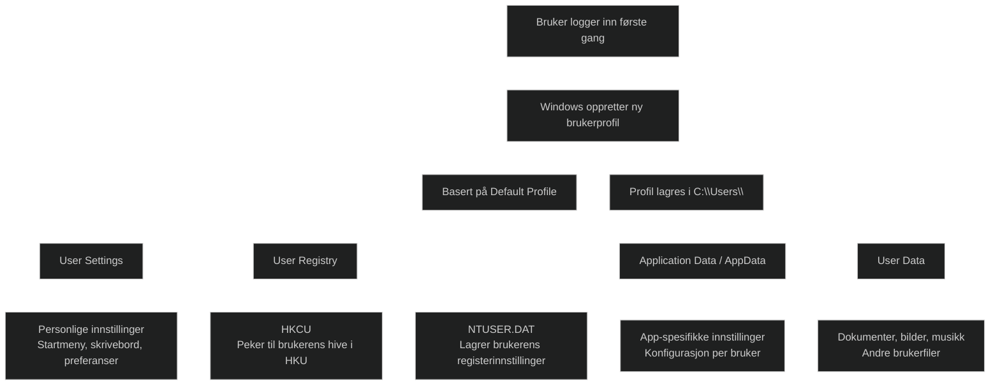
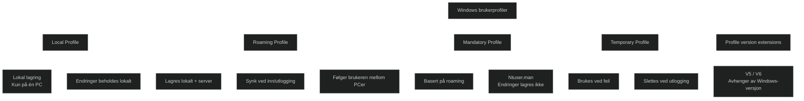
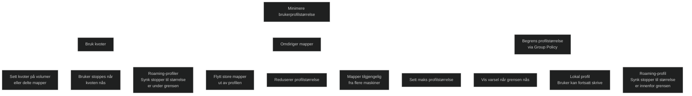
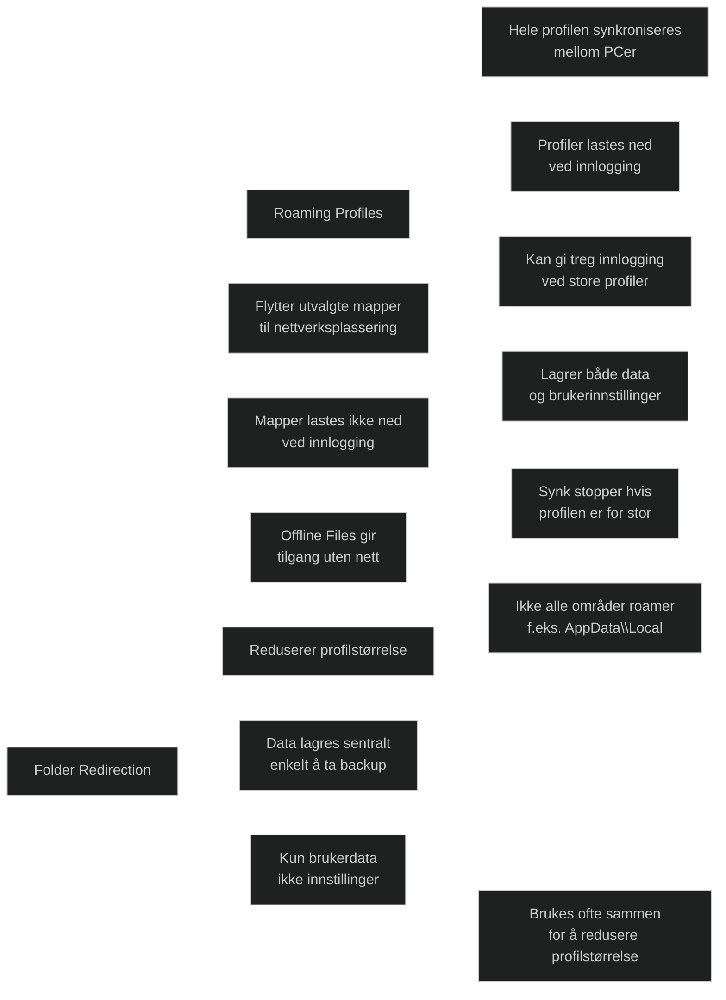
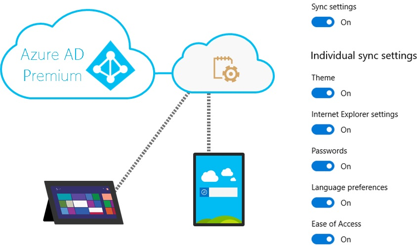
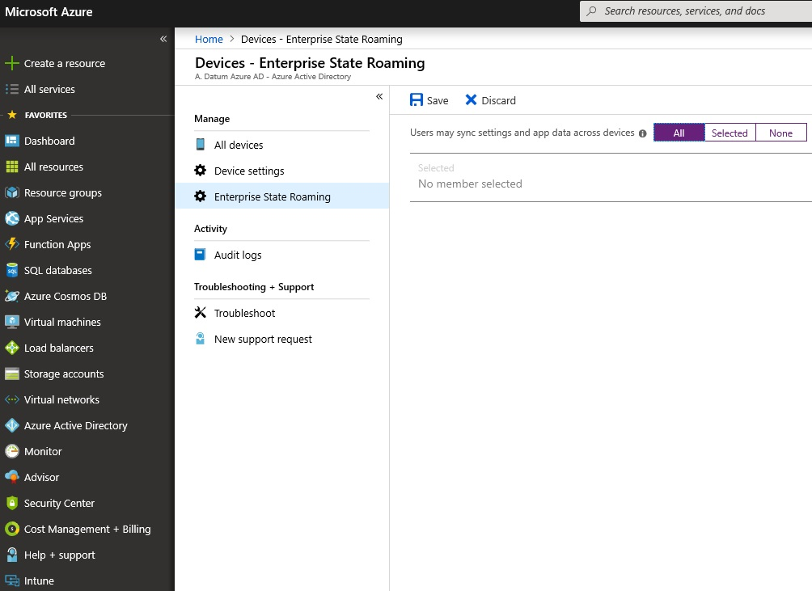

## [Introduction](https://learn.microsoft.com/en-us/training/modules/maintain-user-profiles/1-introduction/?ns-enrollment-type=learningpath&ns-enrollment-id=learn.wwl.configure-profiles-user-device)

  Modulen gir et grunnlag for å forstå hvordan Windows håndterer brukerprofiler og at valget av profiltype vil påvirke ytelse, lagring og brukeropplevelse. 
  Den gir en innsikt i hvordan _Folder Redirection_ kan avlaste lokale maskiner ved å flytte brukerdata til nettverksressurser og hvordan _Enterprise State Roaming_ kan gi en moderne og sømløs synkronisering av innstillinger på tvers av [Entra](../../Glossary/Microsoft-Entra-ID.md)-tilkoblede enheter.

## [Examine user profile](https://learn.microsoft.com/en-us/training/modules/maintain-user-profiles/2-examine-user-profile/?ns-enrollment-type=learningpath&ns-enrollment-id=learn.wwl.configure-profiles-user-device)

En brukerprofil er en samling av filer, mapper og innstillinger som definerer brukerens miljø i Windows. Den opprettes automatisk ved første innlogging og lagres i `C:\Users`.

Fordeler med brukerprofiler:
- Brukeren får et konsistent miljø ved hver innlogging
- Flere brukere kan dele samme maskin uten å påvirke hverandre
- Innstillinger og data er isolert per bruker1

### Elements in a user profile

_User state_ består av fire hovedkategorier.

#### User settings

Personlige innstillinger brukeren har endret etter installasjon.

#### User registry

Brukerens del av Windows-registeret, lagret i `NTUSER.DAT`.

#### Application Data (Appdata)

Applikasjonsspesifikke innstillinger og data.

#### User data

Brukerens egne filer, som dokumenter og bilder.

#### Default Profile

Alle nye profiler baseres på en _Default Profile_, som fungerer som en forhåndskonfigurert mal.

## [Explore user profile types](https://learn.microsoft.com/en-us/training/modules/maintain-user-profiles/3-explore-user-profile-types/?ns-enrollment-type=learningpath&ns-enrollment-id=learn.wwl.configure-profiles-user-device)

Windows støtter flere typer brukerprofiler for å håndtere ulike scenarioer der brukerinnstillinger og data må lagres eller flyttes mellom enheter.

### Local User Profile

- Opprettes automatisk ved første innlogging
- Gjelder kun på en datamaskin
- Endringer og filer følger ikke brukeren til andre enheter

### Roaming User Profile

- Lagres både lokalt og på nettverksplassering
- Synkroniseres ved inn- og utlogging
- Brukerens innstillinger og dokumenter følger mellom maskiner
- Store profiler kan gi treg innlogging
- Ikke alle profilområder roamer
- Ikke kompatibel mellom ulike Windows-versjoner

### Mandatory User Profile

- Variant av roaming _Roaming User Profile_
- Endringer lagres ikke
- Opprettes ved å endre `NTUser.dat` til `NTUser.man`
- Gir et skrivebeskyttet, standardisert brukeroppsett

### Temporary User Profile

- Brukes når en vanlig profil ikke kan lastes
- Slettet ved utlogging
- Ingen endringer beholdes

### Profile extension for each Windows version

- Profilmapper må bruke riktig versjonsutvidelse (V5, V6 osv)
- Sikrer kompabilitet mellom Windows-klient og serverversjon

## [Examine options for minimizing user profile size](https://learn.microsoft.com/en-us/training/modules/maintain-user-profiles/4-examine-options-minimizing-user-profile-size/?ns-enrollment-type=learningpath&ns-enrollment-id=learn.wwl.configure-profiles-user-device)

Brukerprofiler inneholder brukerdata, og fordi brukere har skrivetilgang til sine profiler, kan profilstørrelsen vokse raskt dersom den ikke kontrolleres. Administratorer kan begrense profilstørrelsen på flere måter.

### User quotas

- Sette kvoter på lokale volumer eller delte mapper
- Hindrer brukere i å skrive mer når grensen nås
- Roaming-profiler: lokal kopi synkroniseres ikke før profilen er under kvoten

### Redirect folders out of user profiles

- Flytt store mapper (f.eks. Documents) ut av profilen
- Reduserer profilstørrelse
- Mapper tilgjengelig fra flere maskiner
- Kvoter kan fortsatt brukes på omdirigerte mapper

### Use Group Policy to limit user profile sizes

- Sett maksimal profilstørrelse
- Vis varsel når grensen overskrides
- Lokale profiler: brukeren kan fortsatt skrive data
- Roaming-profiler: endringer synkroniseres ikke før profilen er innenfor grensen

## [Deploy and configure folder redirection](https://learn.microsoft.com/en-us/training/modules/maintain-user-profiles/5-deploy-configure-folder-redirection/?ns-enrollment-type=learningpath&ns-enrollment-id=learn.wwl.configure-profiles-user-device)

_Folder Redirection_  er
- En GPO-funksjon som flytter bestemte brukerprofilmapper til en annen plassering
- Brukes ofte for å redusere profilstørrelse og gjøre data tilgjengelig på tvers av maskiner

Slik fungerer  _Folder Redirection_ 
- Mappen lagres på nettverksressurser
- Brukeren får tilgang på samme måte som lokale mapper
- Offline Files aktiveres automatisk for tilgang uten nettverk

_Folder Redirection_ konfigureres
- via _User Configuration -> Policies -> Windows Settings -> Folder Redirection_
- Windows kan omdirigere 13 forhåndsdefinerte mapper
- Hver bruker får en egen undermappe på nettverkslokasjonen
- Kan baseres på sikkerhetsgrupper

Hvis _Folder Redirection_ tas bort
- Admin kan velge å la innholdet bli på nettverket
- Flytte det tilbake til brukernes lokale profil

_Folder Redirecton_ har følgende begrensninger
- Innstillinger i `NTUser.dat` kan ikke omdirigeres
	- Kombineres ofte med _Roaming Profiles_

Fordelene med _Folder Redirection_ er
- Tilgang til data fra fra flere maskiner
- Ingen kopiering av store datamengder ved innlogging
- Kvoter og NTFS-rettigheter kan styre bruk
- Data ligger sentralt og kan sikkerhetskopieres
- Shadow Copies gir brukere tilgang til tidligere versjoner

### Overview of Folder Redirection deployment

- Verifiser lokale mappeplasseringer
- Opprett Group Policy for omdirigering
- Kjør `GPUpdate /force` og logg ut/inn
- Verifiser at mapper er omdirigert
- Test fra en annen maskin

```mermaid
%%{init: {
  "theme": "dark",
  "themeVariables": {
    "primaryColor": "#1e1e1e",
    "primaryTextColor": "#ffffff",
    "lineColor": "#ffffff",
    "secondaryColor": "#333333"
  }
}}%%
flowchart TD

    A[Folder Redirection] --> B[Formål<br>Flytte profilerte mapper<br>til nettverksplassering]
    A --> C[Konfigurasjon<br>Group Policy]

    B --> B1[Data tilgjengelig<br>fra flere maskiner]
    B --> B2[Reduserer lokal<br>profilstørrelse]
    B --> B3[Offline Files<br>gir tilgang uten nett]

    C --> C1[User Configuration<br>Windows Settings<br>Folder Redirection]
    C --> C2[13 forhåndsdefinerte mapper<br>f.eks. Desktop, Documents]
    C --> C3[Mapper lagres kun<br>på nettverksressurs]

    A --> D[Fordeler]
    D --> D1[Mindre nettverkstrafikk<br>ved innlogging]
    D --> D2[Mulighet for kvoter<br>og NTFS‑kontroll]
    D --> D3[Sentralt backup‑punkt]
    D --> D4[Shadow Copies<br>tidligere versjoner]

    A --> E[Begrensninger]
    E --> E1[Ntuser.dat kan ikke<br>omdirigeres]
    E --> E2[Kombineres ofte med<br>roaming-profiler]

    A --> F[Testing]
    F --> F1[Verifiser lokale mapper]
    F --> F2[Opprett GPO<br>for omdirigering]
    F --> F3[gpupdate /force<br>logg ut/inn]
    F --> F4[Test fra annen klient]


```

## [Sync user state with Enterprise State Roaming](https://learn.microsoft.com/en-us/training/modules/maintain-user-profiles/6-sync-user-state-enterprise-state-roaming/?ns-enrollment-type=learningpath&ns-enrollment-id=learn.wwl.configure-profiles-user-device)

Windows har metoder for å synkronisere brukerinnstillinger og brukerdata på tvers av enheter. Ved å bruke skytjenester som [_Enterprise State Roaming (ESR)_](../../Glossary/Enterprise-State-Roaming.md) og OneDrive kan organisasjoner gi brukere en sømløs opplevelse når de bytter mellom enheter.

### Enterprise State Roaming

- Synkroniserer Windowsinnstillinger og [UWP-appinnstillinger](../../Glossary/Universal-Windows-Platform.md) 
- Krever [Microsoft Entra ID P1/P2](../../Glossary/Microsoft-Entra-ID.md) 
- Synkroniserer ikke desktop-applikasjonsdata
- Kan styres via _Settings_, _GPO_, eller [_MDM_](../../Glossary/Mobile-Device-Management.md)

ESR gir følgende fordeler:
- Separasjon av privat og virksomhetsdata
- Kryptering med [_Azure RMS_](../../Glossary/Azure-Rights-Management.md)
- Administrasjon og overvåkning i Azure-portalen
- Data lagres i samme Azure-region som tenant
- Data beholdes i minst 90 dager

### Sync user data

- ESR synkroniserer ikke filer
- OneDrive brukes for dokumenter og brukerdata
- ESR + OneDrive gir en moderne og enkel migrasjonsmetode

### ESR and Microsoft Edge (Chromium based)

- Edge bruker egen sync-motor
- Synkroniserer favoritter, passord, historikk, åpne faner, innstillinger og extensions
- Fungerer på Windows, iOS, Android og macOS

### User Experience Virtualization

- Synkroniserer desktop-appinnstillinger og OS-innstillinger
- Krever Windows Enterprise og AD DS
- EOL april 2026

```mermaid
%%{init: {
  "theme": "dark",
  "themeVariables": {
    "primaryColor": "#1e1e1e",
    "primaryTextColor": "#ffffff",
    "lineColor": "#ffffff",
    "secondaryColor": "#333333"
  }
}}%%
flowchart TD

    A[Enterprise State Roaming<br>ESR] --> B[Hva synkroniseres]
    A --> C[Fordeler]
    A --> D[Begrensninger]
    A --> E[OneDrive<br>for brukerdata]
    A --> F[Edge Sync]
    A --> G[UE-V]

    B --> B1[Windows-innstillinger<br>UWP-appinnstillinger]
    B --> B2[Styres via Settings<br>GPO eller MDM]

    C --> C1[Separasjon av privat<br>og virksomhetsdata]
    C --> C2[Kryptering med Azure RMS]
    C --> C3[Administrasjon i Azure<br>Se enheter og siste sync]
    C --> C4[Data lagres i<br>samme Azure-region]
    C --> C5[Data retention<br>minst 90 dager]

    D --> D1[Synkroniserer ikke filer]
    D --> D2[Synkroniserer ikke<br>desktop-appdata]

    E --> E1[OneDrive synker filer<br>Dokumenter og brukerdata]
    E --> E2[ESR + OneDrive gir<br>moderne migrasjon]

    F --> F1[Egen sync-motor]
    F --> F2[Synker favoritter<br>passord, historikk<br>åpne faner, utvidelser]
    F --> F3[Fungerer på Windows<br>iOS, Android, macOS]

    G --> G1[Synker desktop-app<br>og OS-innstillinger]
    G --> G2[Krever Windows Enterprise<br>og AD DS]
    G --> G3[End-of-life 2026]

```

## [Configure Enterprise State Roaming in Azure](https://learn.microsoft.com/en-us/training/modules/maintain-user-profiles/7-configure-enterprise-state-roaming-azure/?ns-enrollment-type=learningpath&ns-enrollment-id=learn.wwl.configure-profiles-user-device)

Ved aktivering av  Enterprise State Roaming (ESR) får organisasjonen automatisk en gratis, begrenset lisens for Azure Rights Management fra [Azure Information Protection](../../Glossary/Azure-Information-Protection.md). Denne lisensen brukes kun til å kryptere og dekryptere innstillinger og appdata som synkroniseres via ESR. Full funksjonalitet krever en betalt Azure RMS‑lisens.  

- Gratis, begrenset Azure RMS‑lisens følger med
- Full RMS‑funksjonalitet krever betalt lisens
- Aktiveres via _Microsoft Entra ID → Devices → Enterprise State Roaming_
- Enheter må autentisere med Entra‑identitet

### What data romas?

- Windows-innstillinger (tema, språk, passord, IE-innstillinger, tilgjengelighet osv)
- UWP-appdata lagret i roaming-mappe

### Data storage

- Data lagres i Azure-regionen basert på tenantens land/region
- Ingen kryss-region replikering
- Regionvalg kan ikke endres senere

### View per-user device sync status

- Azure-portalen viser hvilke enheter som synkroniserer
- Tilgjengelig under _Users -> Devices_

### Data retention

- _Brukersletting_: data slettes etter 90-180 dager
- _Directory-sletting_: data slettes etter 90-180 dager
- _Manuell sletting_: admin kan be Azure Support om å fjerne data
- _Stale data_: slettes etter ett år uten tilgang (minimum 90 dager)

### Deleted data recovery

- Ikke mulig å gjenopprette fra skyen
- Data kan lastes opp igjen hvis en enhet fortsatt har lokale innstillinger

## [Module assessment](https://learn.microsoft.com/en-us/training/modules/maintain-user-profiles/8-knowledge-check/?ns-enrollment-type=learningpath&ns-enrollment-id=learn.wwl.configure-profiles-user-device)

1. _What are the four common different types of user profiles?_
	Local User Profile, Roaming User Profile, Mandatory User Profile, Temporary User Profile

2. _Data synced to the Microsoft cloud using Enterprise State Roaming that hasn't been accessed for one year may be deleted from the Microsoft cloud. What are the three methods that can explicitly delete data?_
	User Deletion, Directory Deletion, and On-Request Deletion

## [Summary](https://learn.microsoft.com/en-us/training/modules/maintain-user-profiles/9-summary/?ns-enrollment-type=learningpath&ns-enrollment-id=learn.wwl.configure-profiles-user-device)

### Typer brukerprofiler

_Local user profile_: lagres kun lokalt på én PC
_Roaming user profile_: synkroniseres mellom enheter via nettverksplassering
_Mandatory user profile_: skrivebeskyttet profil der endringer ikke lagres
_Temporary user profile_: brukes når en vanlig profil ikke kan lastes

### Administrasjon av profilstørrelse

_Kvoter_: begrenser hvor mye data brukeren kan lagre
_Folder Redirection_: flytter store mapper ut av profilen
_Group Policy_: kan sette maksimal profilstørrelse og varsle brukeren

### Skybaserte alternativer

_Enterprise State Roaming_: synkroniserer Windows‑innstillinger og UWP‑appdata
_Microsoft OneDrive_: synkroniserer brukerfiler og dokumenter på tvers av enheter

[Microsoft Edge and Enterprise State Roaming](https://learn.microsoft.com/en-us/deployedge/microsoft-edge-enterprise-state-roaming)