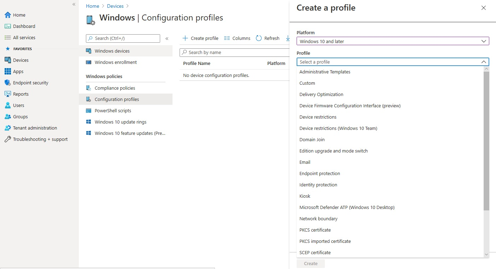
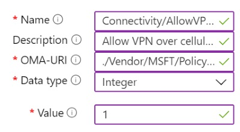

## [Introduction](https://learn.microsoft.com/en-us/training/modules/execute-device-profiles/1-introduction)

[Intune](../../Glossary/Microsoft-Intune.md)-profiler er en sentral del av moderne enhetsadministrasjon. De brukes for å konfigurere, standardisere og sikre enheter på tvers av plattformer. Modulen gir en oversikt over hvilke profiltyper som finnes, hvordan de brukes og hvordan PowerShell-skript kan administreres i Intune.

### Læringsmål
- Typer profiler i Intune
	- De forskjellige profiltypene som finnes
	- Hvordan de brukes til konfigurere innstillinger på Windows, Android og iOS
	- Forskjellen mellom innebygde og tilpassede profiler
- Innebygde vs tilpassede profiler
	- Innebygde profiler gir ferdige maler for vanlige innstillinger
	- Tilpassede profiler brukes når mer avansert eller spesifikk konfigurasjon trengs
	- OMA-URI gjør det mulig å styre innstillinger som ikke finnes i malene
- Opprette og administrere profiler
	- Lage nye profiler basert på plattform og behov
	- Tilordne profiler til riktige grupper
	- Overvåke status og feilsøke distribusjon
- PowerShell-skript i Intune
	- Bruke PowerShell til å konfigurere Windowsenheter utover det profilene dekker
	- Administrere opplastning, kjøring og rapportering av skript
	- Kombinere skript med profiler for mer fleksibel administrasjon
## [Explore Intune device profiles](https://learn.microsoft.com/en-us/training/modules/execute-device-profiles/2-explore-intune-device-profiles)

Intune bruker profiler for å konfigurere og styre innstillinger på enheter i organisasjonen. Profilene gjør det mulig å standardisere nettverkstilgang, sikkerhet, funksjoner og brukeropplevelser på tvers av plattformer.

### Types of device profiles
#### Administrative Templates
- Skybasert administrasjon av [ADMX](../../Glossary/ADMX.md)-innstillinger
- Styrer Edge, Office, OneDrive, passord/PIN og flere Windows funksjoner
- Moderne erstatning for GPOer

#### Certificates
- Konfigurerer betrodde [SCEP](../../Glossary/Simple%20Certificate%20Enrollment%20Protocol.md) og [PKCS](../../Glossary/PKCS.md)-sertifikater
- Brukes for autentisering mot WiFi, VPN og epost
- Sikrer enheter uten manuell sertifikathåndtering

#### Device features (iOS/macOS)
- Styrer Apple-spesifikke funksjoner
- Eksempler: AirPrint, varsler, delte enheter

#### Device restrictions
- Kontrollerer sikkerhet, maskinvare og datadeling
- Eksempel: Blokkere kamera på iOS
- Brukes for å sikre og standardisere enhetsadferd

#### Edition upgrade and mode switch (Windows)
- Oppgraderer Windows-utgaver automatisk
- Brukes for å sikre riktig lisensnivå og funksjonalitet

#### Email
- Setter opp Exchange ActiveSync automatisk
- Gir konsistent epostoppsett og færre supporthenvendelser
- Krever ingen manuell konfigurasjon fra bruker

#### Endpoint protection
- Konfigurerer BitLocker og Defender
- Standardiserer sikkerhetsnivået på Windowsenheter

#### Identity protection
- Styrer Windows Hello for Business
- Definerer krav til PIN, biometriske valg og påloggingsopplevelse

#### Kiosk
- Låser enheter til en eller flere apper
- Kan tilpasses med startmeny og nettleser
- Brukes for terminaler, infoskjermer og dedikerte enheter

#### VPN
- Setter opp sikre VPN-tilkoblinger automatisk
- Gir brukere enkel tilgang til interne ressurser

#### WiFi
- Distribuerer trådløse nettverksinnstillinger
- Gir automatisk tilgang til bedriftsnettverk

#### Custom profile
- Brukes når Intune ikke har en innebygd mal
- Konfigureres via [OMA-URI (Open-Mobile-Alliance-Uniform-Resource-Identifier)](../../Glossary/Open-Mobile-Alliance-Uniform-Resource-Identifier.md)
- Gir fleksibilitet for avanserte leverandørspesifikke innstillinger

## [Create device profiles](https://learn.microsoft.com/en-us/training/modules/execute-device-profiles/3-create-device-profiles)

Tar for seg hvordan du oppretter enhetsprofiler i Intune, og prosessen er lik uansett hvilken profilmal kategori du velger. Hver plattform har sine egne profiltyper, men strukturen for opprettelse og tildeling er den samme.

For å opprette en Windows profil gjøres følgende
- Gå til _Devices -> Windows -> Configuration profiles_
- Velg _Create profile_
- Definer
	- _Platform_: Hvilken Windows versjoner profilen gjelder for
	- _Profile type_: hvilken type profil du vil lage, f.eks. Device restriction, WiFi, VPN 

Når profilen er opprettet, konfigureres den gjennom flere faner:
- Basics
	- Gir profilen et navn og en kort beskrivelse
	- Bruk en _navnestandard_ som gjør det lett å finne igjen profilen senere
- Configuration settings
	- Innholdet varierer basert på valgt profiltype
		- Eksempler:
			- _Device restrictions_: kontrollpanelvalg, Edge-innstillinger, app-restriksjoner
			- _WiFi_: SSID, EAP-innstillinger
- Assignments
	- Velg hvem som skal få profilen
		- Selected groups
		- All devices
		- All users
	- Eksludere grupper, men Intune har klare regler:
		- Ikke bland bruker- og enhetsgrupper i samme eksludering
		- Inkludering vinner alltid over eksludering
		- Enheter uten brukere får ikke policy hvis du kun inkluderer brukere
- Applicability rules
	- Brukes for å begrense profilen ytterligere
	- Eksempler: kun bestemte Windows-versjoner eller utgaver
- Review + Create
	- Oppsummering av alle innstillinger
	- Opprett profilen når alt ser riktig ut

## [Create a custom device profile](https://learn.microsoft.com/en-us/training/modules/execute-device-profiles/4-create-custom-device-profile)

Intune har mange innebygde innstillinger, men noen ganger trenger du mer kontroll enn det malene tilbyr. Da bruker du _custom device profiles_, som lar deg konfigurere [OMA-URI](../../Glossary/Open-Mobile-Alliance-Uniform-Resource-Identifier.md) baserte innstillinger direkte mot enhetens [CSPer](../../Glossary/Configuration-Service-Provider.md). Dette gir fleksibilitet når du må styre funksjoner som ikke finnes som ferdige valg i Intune.

### Create a custom profile for Window 10 and later devices
Windows støtter et stort antall [Configuration Service Providers (CSP)](../../Glossary/Configuration-Service-Provider.md), og custom profiler lar deg konfigurere disse direkte.

For å opprette en Windows profil:
- Gå til _Devices -> Configuration profiles -> Create profile_
- Velg _Windows 10 and later_ og profilen _Custom_
- Under _Custom OMA-URI settings_, velg _Add_

For hver OMA-URI innstilling angis:
- _Name_: et unikt navn for innstillingen
- _Description_: valgfritt
- _OMA-URI_: må være nøyaktig og case-sensitive
- _Data type_: f.eks. String, Integer, Boolean, XML, Base64
- _Value_: selve verdien eller filen som skal brukes

Når alt er lagt inn, velg _Create_ for å opprette profilen

Når _Connectivity/AllowVPNOverCellular_ innstillingen er valgt, lar den Windows åpne en VPN forbindelse på mobile nettverk

Viktig hensyn:
- Ikke alle CSP-innstillinger støttes av Intune
- Innstillingen må støtte _Add_ eller _Replace_ for å fungere
- Sjekk alltid om funksjonen finnes som en innebygd Intune-innstilling før du lager en custom profil

### Create a custom profile for Android devices
Android støtter også OMA-URI, men i et mindre omfang.

Intune støtter kun noen få Android custom innstillinger:
- WiFi med pre-shared key
- Per-app VPN
- Begrenset kopiering/liming mellom jobb og privat profil

For mer avanserte behov brukes [OEMConfig](../../Glossary/OEMConfig.md) som gir tilgang til produsentspesifikke innstillinger.

### Create a custom profile for Apple devices
iOS/iPadOS og macOS bruker en annen tilnærming: Du oppretter innstillingene i [Apple Configurator](../../Glossary/Apple-Configurator.md), eksporterer dem som en konfigurasjonsfil, og importerer filen i Intune.

Oppsettet består av:
- _Name_: navnet som vises i Intune og på enheten
- _Configuration profile file_: filen du eksporterer fra Apple Configurator

Dette gjør det mulig å konfigurere Apple-innstillinger som ikke finnes i Intunes egne maler.

## [Module assessment](https://learn.microsoft.com/en-us/training/modules/execute-device-profiles/5-knowledge-check)

1. _As an IT administrator, you need to create a device profile for Windows devices that will enable the automation and validation of the creation and teardown of environments to help deliver secure and stable application hosting platforms. Which type of device profile should you create?_
	Device Configuration Profile
2. _Your organization wants to prevent iOS device users from using the device camera. Which type of profile should you create in Intune?_
	Device restrictions profile
3. _Why would you create a custom device profile in Intune?_
	To add settings that aren't available in Intune or to use settings available in other device profiles

## [Summary](https://learn.microsoft.com/en-us/training/modules/execute-device-profiles/6-summary)

Intune leveres med et bredt sett av ferdige enhetsprofiler som gjør det enkelt å konfigurere og distribuere vanlige innstillinger på tvers av plattformer. Disse profilene dekker de fleste behov i en organisasjon og brukes til å standardisere nettverk, sikkerhet, funksjoner og brukeropplevelse.

Når de innebygde profilene ikke er nok, kan du bruke _custom profiles_. De lar deg legge til spesifkke innstillinger som ikke finnes i Intune fra før, ofte via OMA-URI eller importerte konfigrasjonsfiler. Dette gir fleksibilitet til å støtte avanserte eller leverandørspesifikke krav.

- [What's new in Microsoft Intune](https://learn.microsoft.com/en-us/intune/intune-service/fundamentals/whats-new)
- [Configuration service provider reference](https://learn.microsoft.com/en-us/windows/client-management/mdm/configuration-service-provider-reference)
- [Use a custom device profile to create a WiFi profile with a pre-shared key – Intune](https://learn.microsoft.com/en-us/intune/intune-service/configuration/wi-fi-profile-shared-key)
- [Use and manage Android Enterprise devices with OEMConfig in Microsoft Intune](https://learn.microsoft.com/en-us/intune/intune-service/configuration/android-oem-configuration-overview)
- [Use custom settings for iOS and iPadOS devices in Microsoft Intune](https://learn.microsoft.com/en-us/intune/intune-service/configuration/custom-settings-ios)
- [Use custom settings for macOS devices in Microsoft Intune](https://learn.microsoft.com/en-us/intune/intune-service/configuration/custom-settings-macos)