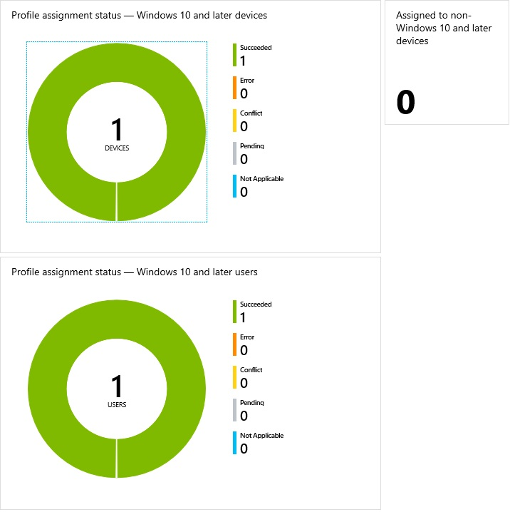
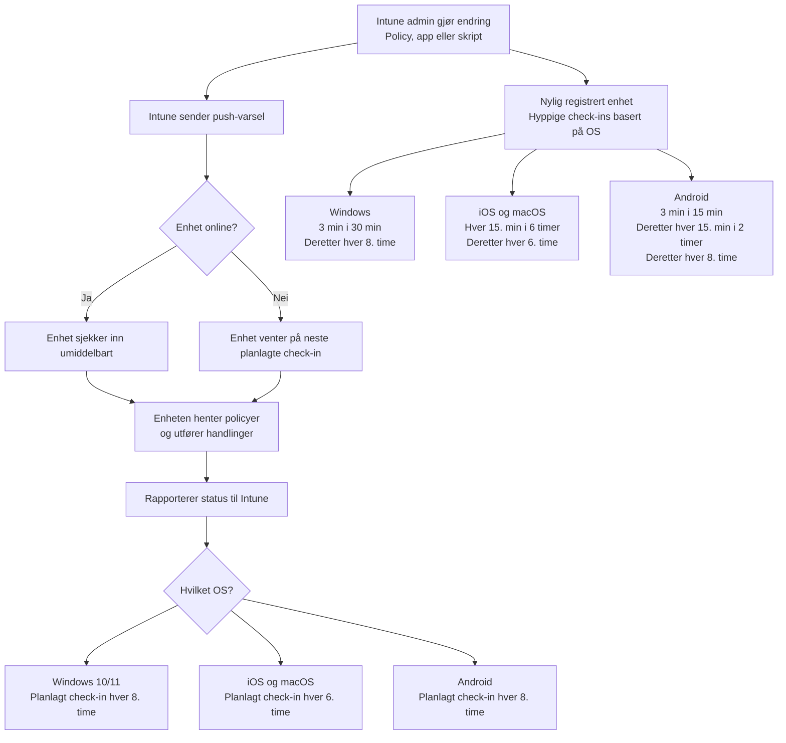

## [Introduction](https://learn.microsoft.com/en-us/training/modules/oversee-device-profiles/1-introduction)

Modulen introduserer hvordan administratorer kan _overvåke, forstå_ og _feilsøke_ enhetsprofiler i [Intune](../../Glossary/Microsoft-Intune.md). I en organisasjon kan enheter ha flere profiler samtidig, og det er derfor viktig å ha kontroll på hvilke profiler som er tildelt, hvordan de brukes og om det oppstår konflikter.

Modulen fokuserer på tre hovedområder:
- _Overvåke profiltilordninger_: Du lærer hvordan du ser hvilke profiler som er tildelt hvilke enheter og brukere og hvordan du identifiserer feil eller konflikter
- _Forstå synkronisering av profiler_: Du får innsikt i hvordan profiler synkroniseres automatisk og hvordan du kan tvinge frem en manuell synkronisering
- _Bruke PowerShell skript i Intune_: Modulen viser hvordan PowerShell kan brukes til å automatisere oppgaver, kjøre skript på enheter og overvåke resultatene direkte fra Intune
## [Monitor device profiles in Intune](https://learn.microsoft.com/en-us/training/modules/oversee-device-profiles/2-monitor-device-profiles-intune)

Intune har flere verktøy for å overvåke og følge opp enhetsprofiler. Du kan se status, hvilke enheter og brukere som er tildelt og identifisere feil eller konflikter.

### View existing profiles
- Gå til _Devices -> Monitor -> Assignment status_
- Viser alle profiler, plattform og om de er tildelt noen enheter

### View details on a profile
- Åpne profilen og bruk _Overview_
- To grafer viser
	- Antall _enheter_ som har fått profilen
	- Antall _brukere_ som er tildelt profilen
- Du kan klikke på grafene for å se _Device status_ og _User status_

Endre eller inspisere en profil:
- _Properties_: endre navn eller innstillinger
- _Assignments_: inkludere eller ekskludere grupper
- _Device status_: viser om profilen er brukt på enheter
- _User status_: viser hvilke brukere som er påvirket
- _Per-setting status_: viser om hver enkelt innstilling er brukt riktig

### View conflicts
- Gå til _Devices -> All devices_ og velg en enhet
- Under _Device configuration_ ser du alle policyer som gjelder
- Hvis en innstilling har konflikt, kan du åpne den og se:
	- Hvilke profiler som innholder den
	- Hvilke som kolliderer
- Dette gjør det enklere å finne og løse policy konflikter

## [Manage device sync in Intune](https://learn.microsoft.com/en-us/training/modules/oversee-device-profiles/3-manage-device-sync-intune)
For at enheter skal få de nyeste policyene og handlingene fra Intune, må de synkronisere jevnlig. _Sync-funksjonen_ lar deg tvinge en enhet til å sjekke inn umiddelbart, slik at den mottar alle ventende profiler, apper, eller endringer uten å vente på neste planlagte intervall.

For å gjøre en manuell synkronisering, gjør følgende:
- Gå til _Devices -> All devices_
- Velg en enhet
- Velg _More -> Sync_
- Bekreft med _Yes_
- Status vises under _Devices -> Monitor -> Device actions_

### Manage settings and features on your devices with Intune Polices
- _Configuration policies_: styrer innstillinger og sikkerhet
- _Compliance policies_: definerer krav enheten må oppfylle
- _Conditional Access_: gir eller blokkerer tilgang basert på risiko og enhetstilstand
- _Enrollment policies_: styrer registrering av bedriftsenheter

Når en policy eller app distribueres, prøver Intune å varsle enheten innen få minutter. Hvis enheten er offline, får den endringen ved neste planlagte check-in.

Standard check-in frekvens:
- _iOS/macOS_: hver 6. time
- _Android_: hver 8. time
- _Windows 11_: hver 8. time

Nyregistrerte enheter sjekker inn oftere de første timene for å få alt raskere.

| Platform                          | Check-in frequency                                                                        |
| --------------------------------- | ----------------------------------------------------------------------------------------- |
| iOS                               | Every 15 minutes for 6 hours, and then every 6 hours                                      |
| macOS                             | Every 15 minutes for 6 hours, and then every 6 hours                                      |
| Android                           | Every 3 minutes for 15 minutes, then every 15 minutes for 2 hours, and then every 8 hours |
| Windows PCs (enrolled as devices) | Every 3 minutes for 30 minutes, and then every 8 hours                                    |

Brukere kan manuelt synkronisere via _Company Portal_ når de måtte ønske.

## [Manage devices in Intune using scripts](https://learn.microsoft.com/en-us/training/modules/oversee-device-profiles/4-manage-devices-intune-use-scripts)

[_Intune Management Extention_](../../Glossary/Microsoft-Intune-Management-Extension.md) gjør det mulig å kjøre PowerShell-skript på Windows og shell-skript på macOS. Dette utvider det Intune kan gjøre gjennom vanlige MDM-policyer, og gir deg fleksibilitet til å automatisere oppgaver og konfigurere enheter på en mer detaljert måte.

Du kan bruk skript til 
- Installere apper (f.eks. eldre Win32-programmer)
- Konfigurere innstillinger som ikke finnes i Intune-profiler
- Automatisere oppgaver på Windows og macOS
- Overvåke kjøring og status direkte i Intune

Forutsetninger for å kunne kjøre skript
- Windows
	- Windows 10/11 versjon 1607 eller nyere
	- Enheten må være Entra tilkoblet (inkl. [Hybrid AD Join](../../Glossary/Entra-Hybrid-Joined.md))
	- Enheten må være Intune administrert
	- Automatisk MDM registrering må være aktivert
- macOS
	- macOS 10.12 eller nyere
	- Enheten må være Intune administrert
	- Skriptet må starte med gyldig shebang (`#!/bin/sh`, `#!/usr/bin/env zsh`)

### Create a PowerShell script policy for Windows

- Gå til _Devices -> Script -> Add -> Windows 10 and later_
- Last opp PowerShell skriptet (maks 200 KB, ASCII)
- Konfigurer
	- _Run using logged-on credentials_: kjør som bruker eller system
	- _Enforce signature check_: krever signert skript eller ikke
	- _Run in 64-bit PowerShell_: velg 32- eller 64-bit kjøring
- Tildel til Entra sikkerhetsgrupper (bruker eller enhet)
- Overvåke kjøring og status i Intune

### Create a shell script policy for macOS

- Velg _Add -> macOS_
- Last opp shell-skriptet (maks 200 KB, ASCII)
- Konfigurer 
	- _Run as signed-in user_ eller _root_
	- _Hide script notifications_: skjul eller vis meldinger
	- _Script frequency_: kjør en gang eller gjentatte ganger
	- _Retry on failure_: hvor mange ganger skriptet skal forsøkes på nytt
- Tildel grupper og overvåk kjøring

## [Module assessment](https://learn.microsoft.com/en-us/training/modules/oversee-device-profiles/5-knowledge-check)

1. _Intune policies fall into multiple categories. Which category is commonly used to manage security settings and features on devices, including defining access to company resources?_
	Configuration policies

2. _As the Desktop Administrator for Contoso, Holly Dickson is using Intune to help monitor and manage the company's device configuration profiles. One of the company's devices has been experiencing issues that Holly feels is related to a configuration policy setting that's applied to the device. In the Microsoft Intune admin center, Holly navigated to a view of the company's devices, selected the device in question, displayed the configuration policies that apply to the device, and then selected the policy that she feels may be the problem. By doing so, Holly can see any setting in the policy that has a "Conflict" state. What else is displayed regarding the conflicted setting that can help Holly troubleshoot this issue?_
	All the profiles that have the conflicted setting

## [Summary](https://learn.microsoft.com/en-us/training/modules/oversee-device-profiles/6-summary)
Intune gir administratorer flere verktøy for å overvåke og administrere enhetsprofiler. Du kan se status på profiler, hvilke enheter som er tildelt og oppdatere egenskaper ved behov. Dersom en enhet trenger oppdaterte policyer umiddelbart, kan du bruke _Sync device_ for å fremtvinge en ny innsjekk. Hvis ikke, følger enheten sin normale synkroniseringsfrekvens basert på plattform.

Modulen oppsummerer tre hovedområder:
- _Overvåkning av profiltilordninger_: Hvordan du ser hvilke profiler som er tildelt hvilke enheter og brukere
- _Forstå og styre synkronisering_: Hvordan profiler synkroniseres automatisk, og hvordan du manuelt kan tvinge en innsjekk
- _Bruk av PowerShell skript_: Hvordan Intune Management Extension lar deg kjøre og overvåke PowerShell skript for avansert administrasjon, inkludert installasjon av eldre Win32 apper