# [Deploy Devices using Windows Autopilot](https://learn.microsoft.com/en-us/training/modules/deploy-devices-windows-autopilot/)

## [Introduction](https://learn.microsoft.com/en-us/training/modules/deploy-devices-windows-autopilot/1-introduction/?ns-enrollment-type=learningpath&ns-enrollment-id=learn.wwl.deploy-cloud-based-tools)

Tradisjonell utrulling har lenge handlet om å slette OEM installasjonen og ersatte den med et organisasjonstilpasset image. Dennne tilnærmingen er ressurskrevende og skalerer dårlig når maskiner allerede leveres med Windows 11. [Autopilot](../../Glossary/Windows-Autopilot.md) introduserer en moderne metode som lar organiasjonen konfigurere nye eller eksisterende enheter uten å bygge og distribuere store image. Målet er å levere en ferdig konfigurert enhet med minimal innsats og uten behov for lokal infrastruktur.

Autopilot bygger på at enheten registreres før bruk, slik at den automatisk får riktig konfigurasjon når brukeren logger inn første gang. Dette gjør prosessen mer effektiv og reduserer behovet for manuell klargjøring. Modulen legger grunnlaget for å forstå hvordan moderne utrulling fungerer, og hvordan Autopilot kan erstatte eller supplere tradisjonelle metoder.

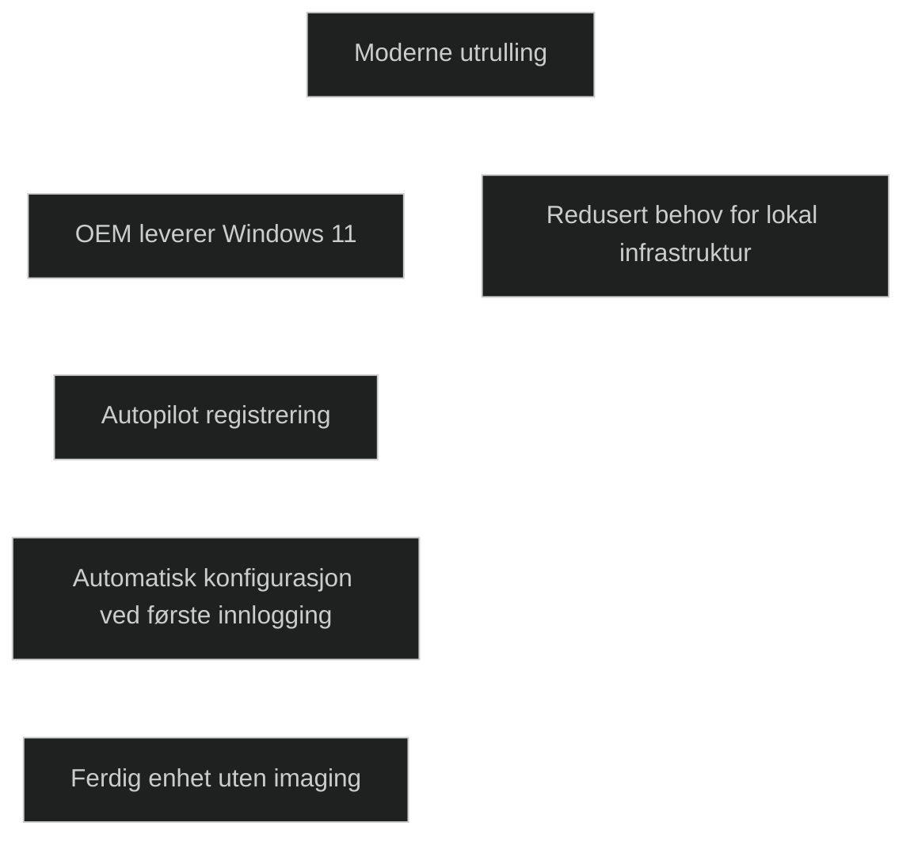

## [Use Autopilot for modern deployment](https://learn.microsoft.com/en-us/training/modules/deploy-devices-windows-autopilot/2-use-autopilot-for-modern-deployment/?ns-enrollment-type=learningpath&ns-enrollment-id=learn.wwl.deploy-cloud-based-tools)

Moderne utrulling handler om å bruke skyen til å klargjøre enheter uten å bygge eller distribuere egne image. Autopilot gjør dette mulig ved å bruke enhetens første oppstart til å hente konfigurasjon fra [Intune](../../Glossary/Microsoft-Intune.md) og [Entra ID](../../Glossary/Microsoft-Entra-ID.md). Dette gir en enklere og mer skalerbar prosess enn tradisjonelle metoder som krever lokal infrastruktur, driverhåndtering og imagebygging.

Autopilot gjør det mulig å konfigurere både nye og eksisterende enheter. Nye enheter kan levere direkte fra produsent til bruker, og Autopilot sørger for at enheten blir satt opp riktig under første oppstart. Eksisterende enheter kan tilbakestilles og få en ny OOBE som om de var nye. Dette gir en effektiv måte å gjenbruke maskiner på uten å bygge image på nytt.

Autopilot er tett integrert med Intune og Entra ID. Det gjør det mulig å automatisk bli medlem av Entra ID, automatisk registrere enheten i MDM, styre adminrettigheter og tilapsse OOBE. Dette gir en kontrollert og forutsigbar utrulling uten behov for lokal infrastruktur.

Tradisjonelle metoder er fortsatt nødvendige i enkelt scenarier, som ved bytte av HDD, korrupte installasjoner eller når organisasjonen trenger tilpassninger som OOBE ikke støtter. Likevel er Autopilot den anbefalte metoden for moderne Windows 11 utrulling.

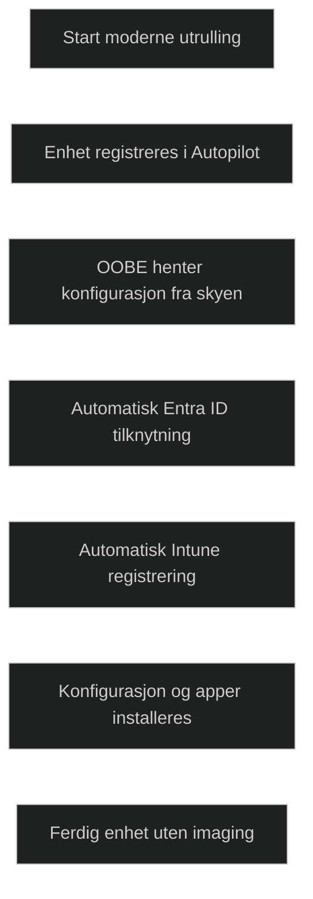

|--|Traditional deployment|Modern deployment|
|---|---|---|
|Deploys Windows 11 images|Yes|No|
|Can be used with any preinstalled operating system|Yes|No|
|Requires a previous Windows 11 installation|No|Yes|
|Uses an on-premises infrastructure|Yes|No|
|Tools for preparing the deployment|Windows ADK, Windows Deployment Services, Microsoft Deployment Toolkit (MDT), and Configuration Manager|Windows Configuration Designer and Windows Autopilot|

## [Examine requirements for Windows Autopilot](https://learn.microsoft.com/en-us/training/modules/deploy-devices-windows-autopilot/3-examine-requirements-for/?ns-enrollment-type=learningpath&ns-enrollment-id=learn.wwl.deploy-cloud-based-tools)

Autopilot kan bare brukes av enheter som er registrert på forhånd. Nye enheter kan registreres av leverandør, mens eksisterende enheter må eksportere maskinvareinformasjon via PowerShell og lastes opp i Intune eller Microsoft Store for Business. Autopilot er en skybasert tjeneste, og krever derfor at enheten har tilgang til internett under oppstart.

Enheten må starte i OOBE og ha en støttet Windows versjon. Autopilot kan ikke brukes på Windows Home eller eldre versjoner enn 1703. Funksjoner som automatisk gjenutrulling og Autopilot for eksisterende enheter krever nyere versjoner av Windows 10 eller Windows 11.

Autopilot krever Entra ID, siden både Intune og Store for Business er avhengige av det. Enheter som settes opp med Autopilot blir automatisk medlem av Entra ID. Hvis organisasjonen ønsker automatisk MDM registrering, må Entra ID være konfigurert for dette, og Intune eller annen MDM løsning må være tilgjengelig.

Autopilot er avhengig av at bestemte nettadresser er tilgjengelige. Dette inkluderer autentiseringstjenester, lisensieringstjenester og Windows Update endepunkter. Uten tilgang til disse kan ikke Autopilot fullføre utrullingen.

- - go.microsoft.com
- login.microsoftonline.com
- login.live.com
- account.live.com
- signup.live.com
- licensing.mp.microsoft.com
- licensing.md.mp.microsoft.com
- ctldl.windowsupdate.com
- download.windowsupdate.com

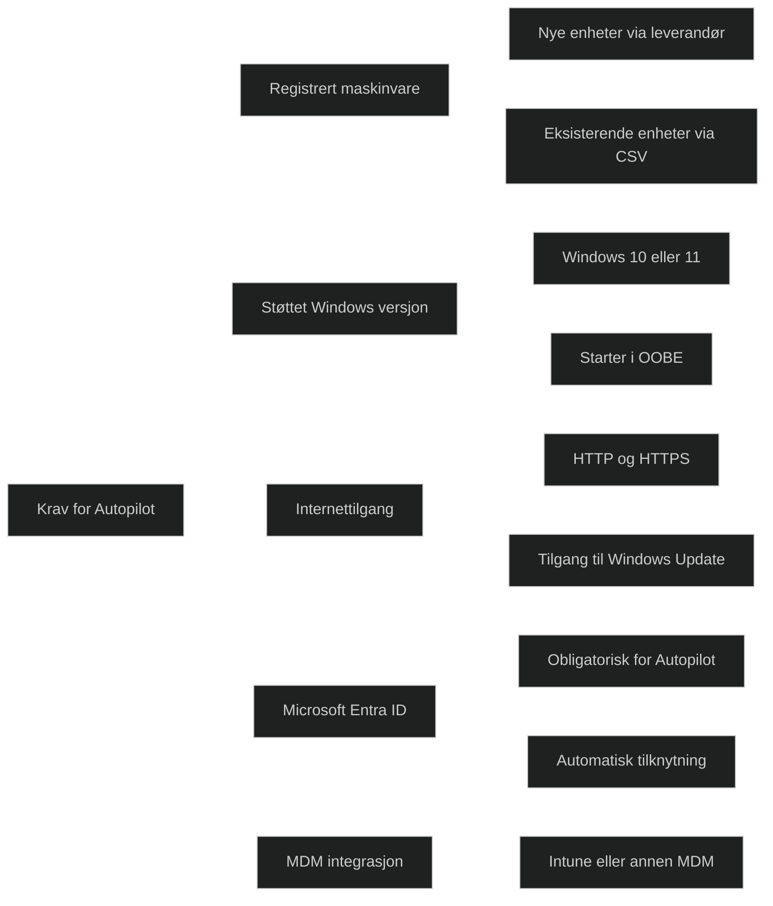

## [Prepare device IDs for Autopilot](https://learn.microsoft.com/en-us/training/modules/deploy-devices-windows-autopilot/4-prepare-device-ids-for-autopilot/?ns-enrollment-type=learningpath&ns-enrollment-id=learn.wwl.deploy-cloud-based-tools)

For å administrere Autopilot i Intune må automatisk MDM registering være aktivtert for Entra ID brukere. Dette sikrer at Windows 11 enheter automatisk registreres i Intune når de blir medlem av Entra ID. Administrator velger om alle brukere eller kun bestemte grupper skal kunne registrere enheter. Når dette er konfigurert, kan Autopilot profiler opprettes og administreres i Intune.

### Prepare a Microsoft Autopilot deployment

Autopilot kan administreres via Intune eller Store for Business. Før utrulling må enhetsinformasjon lastes opp. Dette inkluderer _hardware hash_, _serienummer_ og _Windows produkt ID_. Denne informasjonen må være tilgjengelig i en CSV fil før enheten kan knyttes til en Autopilot profil.

### Get the CSV file from your OEM partner

Hvis leverandøren støtter Autopilot, kan de levere en ferdig CSV fil med nødvendig maskinvareinfo. Filen inneholder tre kolonner:

- Device Serial Number
- Windows Product ID
- Hardware Hash

### Generate your own CSV file

Hvis leverandøren ikke leverer CSV fil, kan informasjonen generes manuelt ved hjelp av PowerShell-skriptet `Get WindowsAutopilotInfo`. Skriptet installeres via `Install-Script` og kan eksportere hardware hash til en CSV fil. Dette brukes ofte for eksisterende enheter eller testmaskiner.

### Upload the device specific CSV file

Opplasting krever adminrettigheter. Systemet validerer filen og gir tilbakemelding om eventuelle feil. Enheter kan legges til eksisterende grupper eller nye grupper, noe som gjør det mulig å målrette Autopilot profiler mot bestemte enheter. Etter opplasting må en synkronisering utføres før enheten vises i Autopilot overiskten.

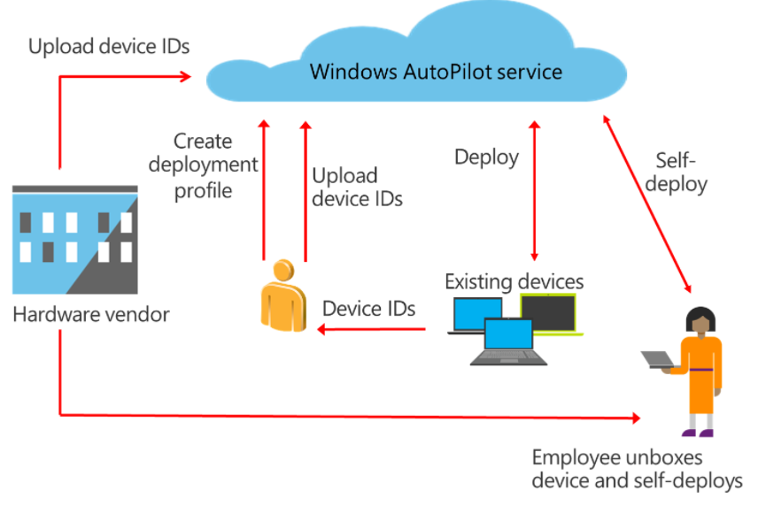

### Import a device hash directly into Intune

I enkelte situasjoner kan hardware hash importeres direkte fra en enhet som står i OOBE. Dette er nyttig i testmiljøer eller når teknikere klargjør maskiner lokalt. PowerShell kan brukes til å sende hash direkte til Intune og samtidig tildele en _Group Tag_ som plasserer enheten i riktig Entra gruppe.

Åpne et PowerShell prompt når Autopilot viser _Welcome screen_:
```powershell
Install-Script -Name Get-WindowsAutopilotInfo
Get-WindowsAutoPilotInfo.ps1 -online -GroupTag "Autopilot-Devices" -Assign
```

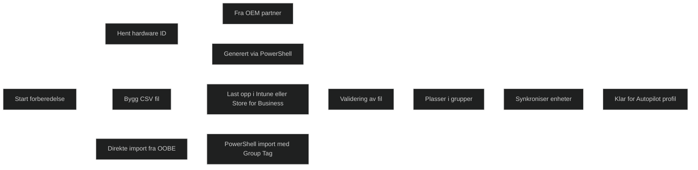

<a href="/certs/diagrams/autopilot-prep.html" target="_blank" rel="noopener">Stort diagram</a>

## [Implement device registration and out-of-the-box customization](https://learn.microsoft.com/en-us/training/modules/deploy-devices-windows-autopilot/5-implement-device-registration-out-of-box-customization/?ns-enrollment-type=learningpath&ns-enrollment-id=learn.wwl.deploy-cloud-based-tools)

Når maskinvareinformasjonen er lastet opp, må det opprettes en Autopilot profil som styrer hvordan enheten skal settes opp. Profilen definerer utrullingsmodus, enten brukerbasert eller selvutrullende, og hvilke OOBE innstillinger som skal brukes, slik som språk, tastatur, EULA, personvern og kontotype. Hver enhet kan bare bruke en profil, og profilen bestemer hvordan oppstartsopplevelsen blir for brukeren.

### Apply a deployment profile

Profilen må tilordnes en gruppe før Autopilot kan styre OOBE. Når enheten starter og har nettverk, henter den profilen og gjennomfører en styrt oppstart. Dette sikrer at brukeren får en forenklet og standardisert opplevelse, og at enheten blir satt opp i tråd med organisasjonens krav.

### Compare the default and Autopilot OOBE experience

Standard OOBE krever at brukeren velger språk, tastatur, lisensvilkår, personvern og tilkobling til katalogtjeneste. Dette kan føre til feil og unødvendig belastning for brukerstøtte. Med Autopilot styres OOBE av administrator, og dialoger skjules eller forhåndsutfylles. Brukeren trenger kun å logge inn, og enheten blir automatisk medlem av Entra ID og registrert i Intune. Dette gir en tryggere og mer effektiv utrulling.

Default OOBE
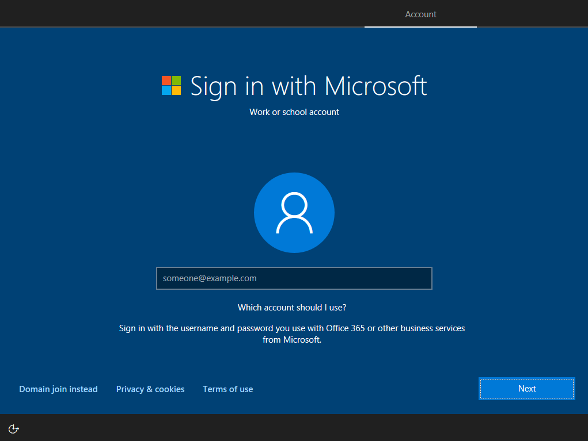

Autopilot OOBE
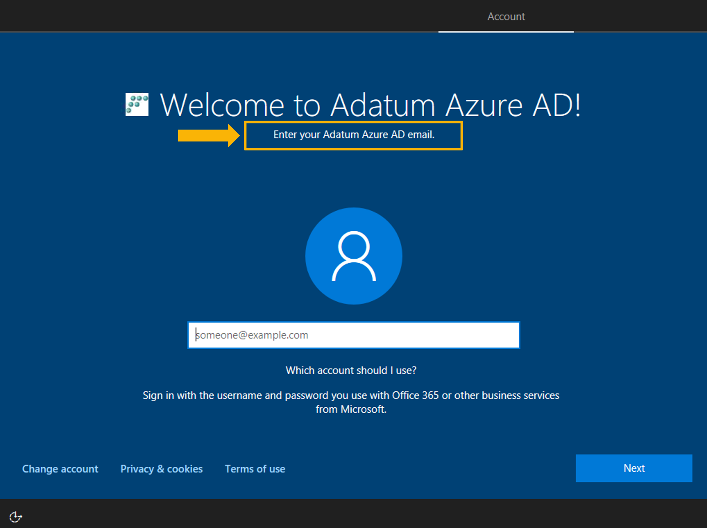

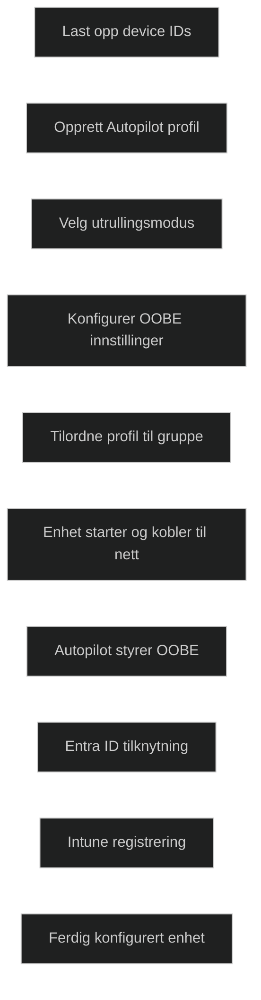

## [Examine Autopilot scenarios](https://learn.microsoft.com/en-us/training/modules/deploy-devices-windows-autopilot/6-examine-autopilot-scenarios/?ns-enrollment-type=learningpath&ns-enrollment-id=learn.wwl.deploy-cloud-based-tools)

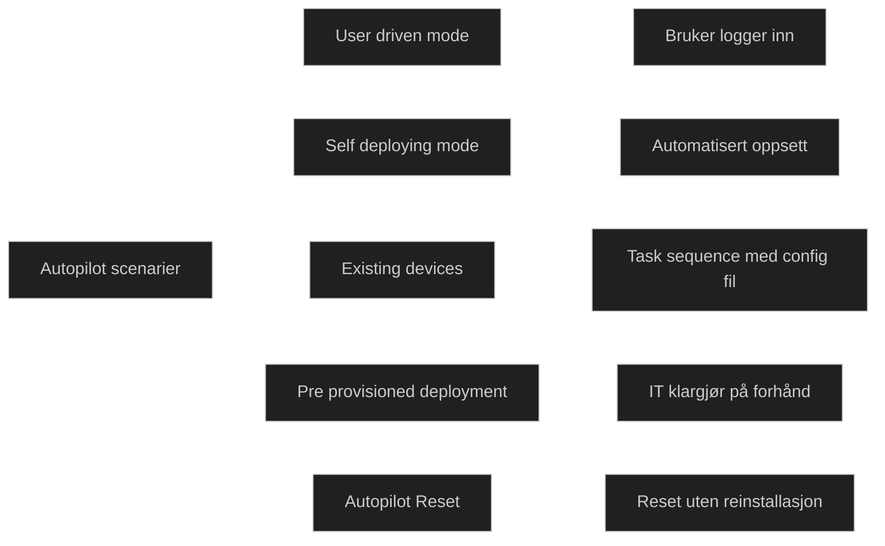

| **Scenario**                                         | **Formål**                                                                   | **Krav**                                                                                                                                                   | **Brukerinteraksjon**                                                | **Typiske bruksområder**                                             |
| ---------------------------------------------------- | ---------------------------------------------------------------------------- | ---------------------------------------------------------------------------------------------------------------------------------------------------------- | -------------------------------------------------------------------- | -------------------------------------------------------------------- |
| **Windows Autopilot user‑driven mode**               | Gjøre nye Windows enheter klare uten at IT må håndtere dem fysisk            | Entra ID join må være mulig, Autopilot profil må være tilordnet, Windows 1809 eller nyere for hybrid, tilgang til internett og domenekontroller for hybrid | Bruker velger språk, nettverk og logger inn                          | Nye enheter sendt direkte til brukere, standard kontorbrukere        |
| **Self‑deploying mode**                              | Fullstendig automatisert utrulling uten bruker                               | TPM 2.0, Windows 1903 eller nyere, Autopilot profil satt til self‑deploying                                                                                | Ingen, bortsett fra valg av språk eller nettverk i enkelte tilfeller | Kiosk, delte enheter, enheter uten dedikert bruker                   |
| **Autopilot for existing devices**                   | Modernisere eldre enheter ved å bruke en Configuration Manager task sequence | Windows 10 eller 11 må installeres via task sequence, JSON konfigurasjonsfil må inkluderes, workgroup join, ingen oppdateringer under installasjon         | Ingen under OOBE, men IT må kjøre task sequence                      | Migrering fra tradisjonell imaging til moderne administrasjon        |
| **Windows Autopilot for pre‑provisioned deployment** | Klargjøre enheter før brukeren mottar dem                                    | Windows 1903 eller nyere, Intune, TPM 2.0, fysisk nettverk under pre‑provision                                                                             | Bruker fullfører kun siste del av OOBE                               | Store utrullinger, redusere ventetid for brukere, partnerklargjøring |
| **Windows Autopilot Reset**                          | Tilbakestille en enhet til klar tilstand uten reinstallasjon                 | Entra ID medlemskap og MDM registrering beholdes, lokal reset krever policyendring, remote reset krever Intune                                             | Ingen for remote reset, lokal reset krever administrator             | Midlertidige brukere, kursrom, gjenbruk av maskiner                  |

### User-driven mode

_User driven mode_ gjør det mulig å sette opp nye Windows enheter uten at IT må håndtere dem fysisk. Brukeren starter enheten, velger språk og nettverk, og logger inn med organisasjonskonto. 
Enheten blir automatisk medlem av Entra ID og registrert i Intune. For hybrid kreves Windows 1809 eller nyere, tilgang til DC og Intune Connector for AD. Dette scenariet passer når brukeren selv skal fullføre oppstarten.

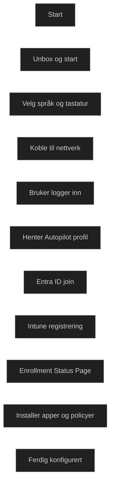

### Self-deploying mode

_Self-deploying mode_ gir en nesten fullstendig automatisert utrulling uten brukerinteraksjon. Enheten konfigureres automatisk og viser kun _Enrollement Status Page_ før den er klar. Dette krever [Trusted Platform Module (TPM 2)](../../Glossary/Trusted-Platform-Module.md) og Windows 1903 eller nyere. Det kan være nødvendig å velge språk eller nettverk hvis flere valg finnes. Scenariet brukes ofte for kiosk, delte enheter eller enheter uten dedikert bruker.

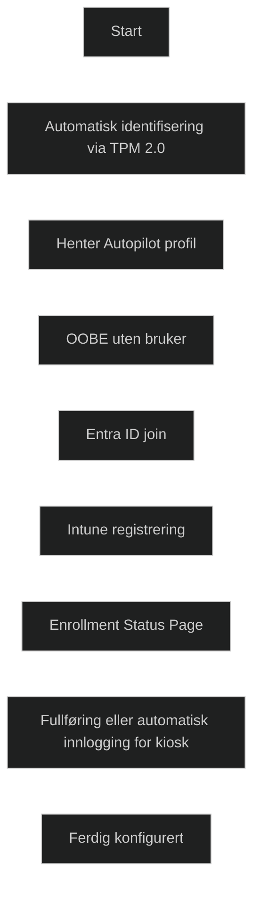

### Autopilot for existing devices

Dette scenariet brukes for å modernisere eldre enheter, som Windows 8.1, ved å bruke Configuration Manager TS som legger inn windows 10/11 og plasser en Autopilot konfigurasjonsfil. TS må bruke _Workgroup_ join, unngå oppdateringer og sikre at Sysprep ikke sletter konfigurasjonsfilen. Dette gjør det mulig å gå fra tradisjonell imaging til moderne administrasjon.

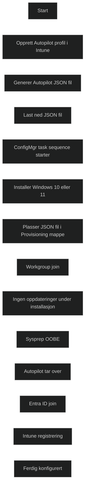

### Windows Autopilot for pre-provisioned deployment

_Pre provisioned deployment_ lar IT eller partner klargjøre enheten før brukeren mottar den. Tunge oppgaver som app installasjon og policyer kjøres på forhånd, mens brukeren kun fullfører siste del av OOBE. Krever 1903 eller nyere, Intune og TPM 2.0. Scenariet reduserer tiden brukeren må vente før enheten er klar.

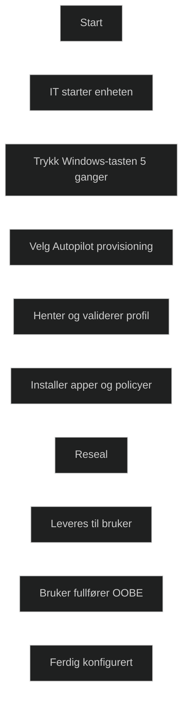

 [Windows Autopilot for Pre-provisioned deployment](https://aka.ms/AA6dcx6)

### Windows Autopilot Reset

_Autopilot Reset_ brukes når en enhet skal tilbakeføres til en klar tilstand uten å reinstallere Windows. Den fjerner brukerdata og apper, men beholder Entra ID medlemskap og MDM registrering. Reset kan utføres lokalt via hurtigtast eller eksternt via Intune. Dette passer for midlertidige brukere, kursrom eller enheter som gjenbrukes.

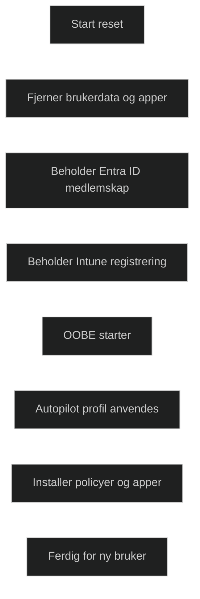

## [Troubleshoot Windows Autopilot](https://learn.microsoft.com/en-us/training/modules/deploy-devices-windows-autopilot/7-troubleshoot/?ns-enrollment-type=learningpath&ns-enrollment-id=learn.wwl.deploy-cloud-based-tools)

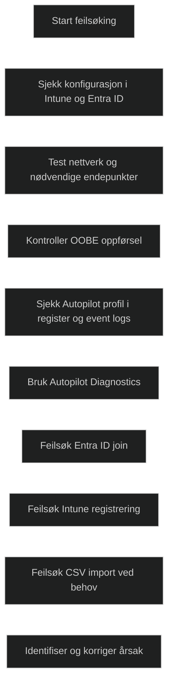

### Configuration

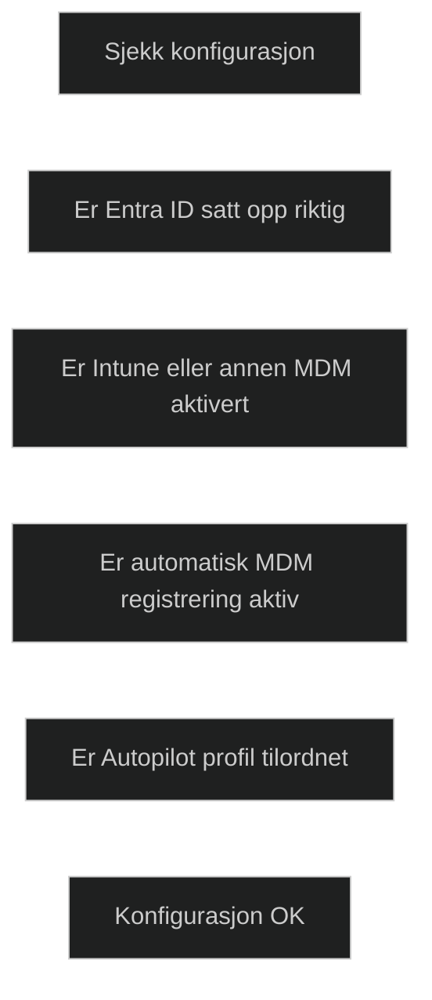

### Network connectivity

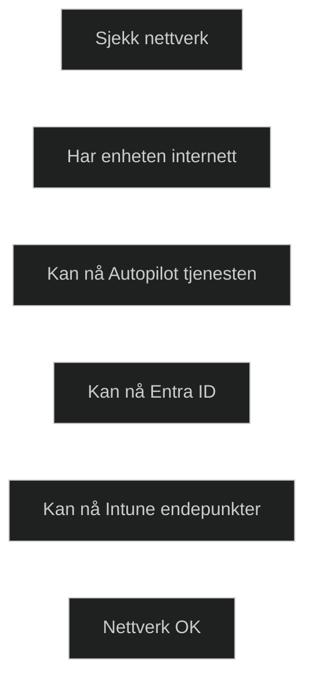

### Troubleshoot Autopilot OOBE issues

Feilsøkingen starter med å kontrollere at Autopilot profilen faktisk er mottatt og at OOBE viser de forventede dialogene. Informasjon om profilen lagres i registeret under _Provisioning Diagnostics Autopilot_, og hendelser logges i _Autopilot loggen_ i Event Viewer. [Event Tracing for Windows](../../Glossary/Event-Tracing-for-Windows.md) kan brukes for mer detaljert innsikt i flyten. Vanlige feilsituasjoner inkluderer manglende profil, feil i TPM attestasjon eller problemer med å gjøre profilen tilgjengelig.

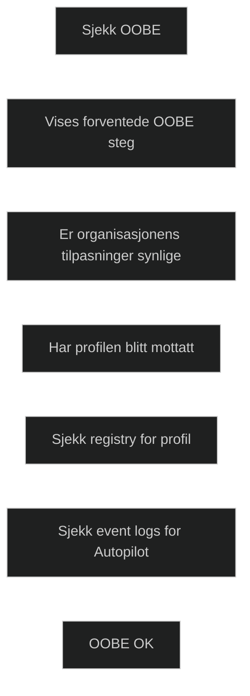

### Windows Autopilot Diagnostic

[Autopilot Diagnostics](../../Glossary/Autopilot-Diagnostics.md) samler flere feilsøkningsmetoder i ett verktøy. Det kjøres via PowerShell og viser status for policyer, apper og konfigurasjon ved hjelp av _Graph API_. Dette gir en rask oversikt over hva som er mottatt og hva som mangler, og er nyttig når OOBE ikke oppfører seg som forventet.

### Troubleshoot Entra ID join issues

Vanlige problemer med [Entra ID join](../../Glossary/Microsoft-Entra-ID.md) skyldes manglende tillatelser eller at brukeren har nådd grensen for hvor mange enheter som kan registreres. Feilkode _801C0003_ indikerer at join prosessen mislyktes. Dette er viktig å kontrollere at brukeren har riktige lisenser og at Entra ID er konfigurert til å tillate join.

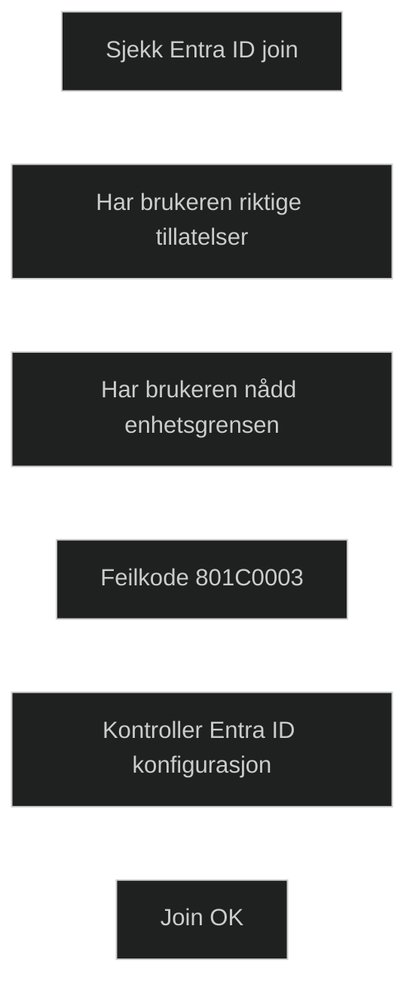

### Troubleshoot Intune enrollement issues

Feil i MDM registrering skyldes ofte manglende eller feil lisens, eller at brukeren har registrert for mange enheter. Feilkode _80180018_ betyr at MDM registreringen feilet. Det er viktig å kontrollere lisensstatus og at automatisk MDM registrering er aktivert.

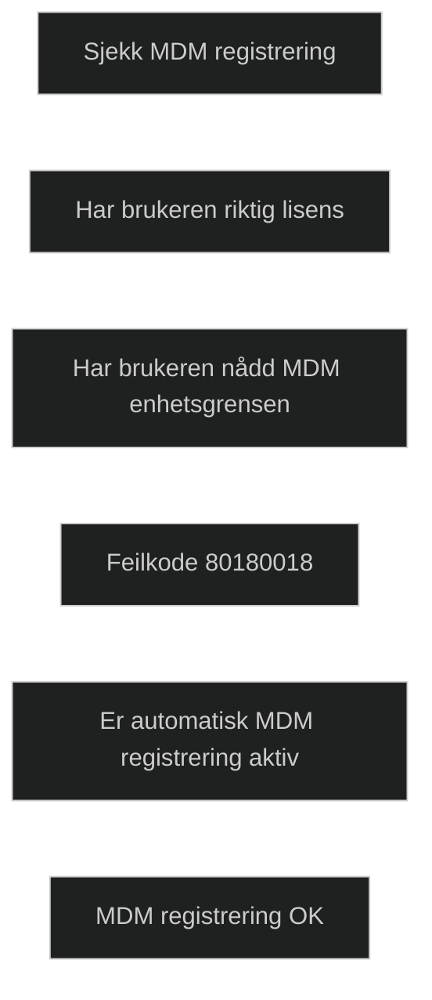

### Troubleshoot Device Import

Feil ved import av CSV fil skyldes ofte at hardware hash er feil formatert eller ikke riktig padet. Dette gir en _400 feil_ i netterverksloggen. En justering av filen kan løse problemet. Dette er relevant når enheter skal registreres manuelt i Autopilot

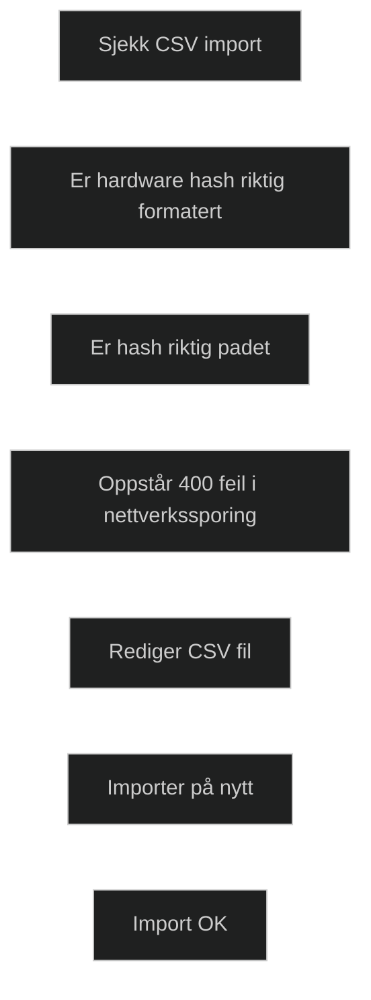


|**Kode / Event ID**|**Type**|**Betydning**|**MD‑102 relevans**|
|---|---|---|---|
|**Event ID 100**|Warning|Autopilot policy ikke funnet. Vanligvis midlertidig mens profilen lastes ned.|Forstå at dette ikke er en kritisk feil, men en indikator på at profilen ikke er mottatt ennå.|
|**Event ID 171**|Error|TPM identitet kunne ikke bekreftes. TPM attestation feilet.|Kritisk for self deploying mode, som krever TPM 2.0 attestation.|
|**Event ID 172**|Error|Autopilot profil kunne ikke settes som tilgjengelig. Ofte relatert til TPM feil (ID 171).|Viser at profilen ikke kan brukes før TPM attestation fungerer.|
|**801C0003**|Entra ID join error|Entra ID join mislyktes. Ofte fordi brukeren ikke har tillatelse eller har nådd grensen for antall registrerte enheter.|Viktig å kjenne igjen som klassisk join feil.|
|**80180018**|MDM enrollment error|MDM registrering feilet. Ofte manglende lisens eller for mange registrerte enheter.|Vanlig Intune feil som må kunne identifiseres.|
|**400 error ved CSV import**|Device import error|CSV filen inneholder en ugyldig eller feil padet hardware hash.|Viser at importfeil ofte skyldes formatproblemer i CSV filen.|

## [Module assessment](https://learn.microsoft.com/en-us/training/modules/deploy-devices-windows-autopilot/8-knowledge-check/?ns-enrollment-type=learningpath&ns-enrollment-id=learn.wwl.deploy-cloud-based-tools)

1. As an IT administrator, you're considering using Windows Autopilot's "Self-Deploying" mode for deploying new devices in your organization. Which of the following is a benefit of this mode?

	It allows a device to be fully configured for company use, reducing the time IT must spend on deploying new devices.

2. You're preparing for an Autopilot deployment in your organization and need to gather device hardware IDs. Which method can you use to obtain these IDs?

	Using the Windows Autopilot hardware ID script.

3. You're troubleshooting a failed Windows Autopilot deployment. Which of the following steps would be most helpful in identifying the root cause of the failure?

	Check the Event Viewer for errors related to device enrollment.

## [Summary](https://learn.microsoft.com/en-us/training/modules/deploy-devices-windows-autopilot/9-summary/?ns-enrollment-type=learningpath&ns-enrollment-id=learn.wwl.deploy-cloud-based-tools)

Windows Autopilot er en moderne metode for utrulling av Windows 11 som bruker den eksisterende installasjonen i stedet for å bygge og distribuere egne image. Administratorer definerer ønsket konfigurasjon i en Autopilot profil, og denne brukes til å sette opp nye eller eksisterende klienter. Dette reduserer behovet for tradisjonell imaging og gjør utrulling mer skalerbar.

Autopilot støtter flere utrullingsmoduser, som user driven, self deploying og pre provisioned deployment. Dette gir fleksibilitet i ulike miljøer, fra brukere som starter enheten selv til automatiserte scenarier uten brukerinteraksjon. Autopilot for existing devices gjør det mulig å oppgradere eldre Windows 8.1 maskiner til en moderne administrasjonsmodell.

Modulen understreker at Autopilot forenkler administrasjon, reduserer kompleksitet og gir en mer effektiv utrullingsprosess for organisasjoner som bruker Windows 11.

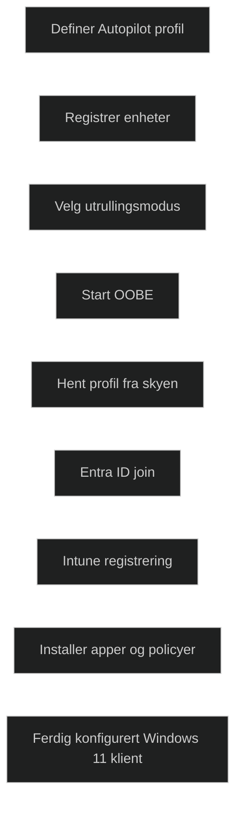

- [Windows Autopilot Deployment Scenarios](https://learn.microsoft.com/en-us/mem/autopilot/user-driven)
- [Create device groups for Windows Autopilot](https://learn.microsoft.com/en-us/mem/autopilot/enrollment-autopilot)
- [Troubleshooting Windows Autopilot](https://learn.microsoft.com/en-us/mem/autopilot/troubleshooting)