# [Explore Microsoft Intune Suite](https://learn.microsoft.com/en-us/training/modules/explore-microsoft-intune-suite/)

## [Introduction](https://learn.microsoft.com/en-us/training/modules/explore-microsoft-intune-suite/1-introduction/?ns-enrollment-type=learningpath&ns-enrollment-id=learn.wwl.deploy-cloud-based-tools)

Modulen forklarer hvorfor moderne organisasjoner trenger en samlet plattform for å håndtere enheter, apper og data på en sikker måte. [Intune Suite](../../Glossary/Microsoft-Intune-Suite.md) løser dette ved å samle avanserte funksjoner for administrasjon, sikkerhet og støtte i en helhetlig løsning. 
Plattformen gjør det mulig å beskytte identitet og data gjennom [Zero Trust prinsipper](../../Glossary/Zero-Trust.md), samtidig som den gir bedre innsikt og kontroll over enheter og apper.

Intune Suite styrker administrasjonen ved å tilby funksjoner som [Endpoint Privilege Management](../../Glossary/Endpoint-Privilege-Management.md), [Remote Help](../../Glossary/Remote-Help.md), [Enterprise App Management](../../Glossary/Enterprise-App-Management.md) og avansert analyse. 
Dette gir bedre brukeropplevelse, raskere feilsøking og mer effektiv drift. Modulen legger grunnlaget for å forstå hvordan disse funksjonene brukes i praksis for å sikre og administrere endepunkter i en moderne organisasjon.

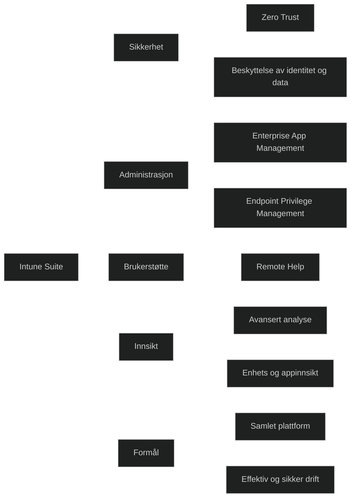
```mermaid
%%{init: {
  "theme": "dark",
  "themeVariables": {
    "primaryColor": "#1e1e1e",
    "primaryTextColor": "#ffffff",
    "lineColor": "#ffffff",
    "secondaryColor": "#333333"
  }
}}%%
flowchart LR

    A[Intune Suite] --> B[Sikkerhet]
    B --> B1[Zero Trust]
    B --> B2[Beskyttelse av identitet og data]

    A --> C[Administrasjon]
    C --> C1[Enterprise App Management]
    C --> C2[Endpoint Privilege Management]

    A --> D[Brukerstøtte]
    D --> D1[Remote Help]

    A --> E[Innsikt]
    E --> E1[Avansert analyse]
    E --> E2[Enhets og appinnsikt]

    A --> F[Formål]
    F --> F1[Samlet plattform]
    F --> F2[Effektiv og sikker drift]

```

## [Discover essentials of Microsoft Intune Suite](https://learn.microsoft.com/en-us/training/modules/explore-microsoft-intune-suite/2-discover-essentials-microsoft-intune-suite/?ns-enrollment-type=learningpath&ns-enrollment-id=learn.wwl.deploy-cloud-based-tools)

### Available add-ons

_Intune Suite_ gir fleksibel utvidelse av funksjonalitet gjennom tillegg som kan aktiveres etter behov. Noen tillegg kan kjøpes enkeltvis, mens andre kun inngår i _Intune Plan 2_ eller _Intune Suite_. 
Dette gjør det mulig å tilpasse administrasjon, sikkerhet, og støtte til organisasjonens krav. 

[Intune Plans and pricing](https://aka.ms/IntuneSuitePricing)

| Capability                                         | Standalone add-on | Intune Plan 2 | Intune Suite |
| -------------------------------------------------- | ----------------- | ------------- | ------------ |
| Endpoint Privilege Management                      | ✅                 |               | ✅            |
| Enterprise App Management                          | ✅                 |               | ✅            |
| Advanced Analytics                                 | ✅                 |               | ✅            |
| Remote Help                                        | ✅                 |               | ✅            |
| Microsoft Tunnel for Mobile Application Management |                   | ✅             | ✅            |
| Microsoft Cloud PKI                                | ✅                 |               | ✅            |
| Firmware-over-the-air update                       |                   | ✅             | ✅            |
| Specialized devices management                     |                   | ✅             | ✅            |

### Key features

#### Endpoint Privilege Management

Gir kontroll over administrative rettigheter på Windows. Reduserer risiko ved å begrense hvem som kan utføre handlinger som krever høyere privilegier.

#### Enterprise App Management

Gir bedre styring av apper på Windows. Forenkler distribusjon, oppdatering og kontroll av applikasjoner.

#### Advanced Analytics

Gir innsikt i bruk, ytelse og risiko. Hjelper admins med å identifisere problemer og forbedre sikkerhet og brukeropplevelse.

#### Remote Help

Gir sikker fjernhjelp direkte integrert i Intune. Forenkler feilsøking og reduserer nedetid.

#### Microsoft Tunnel for Mobile Application Management

Gir sikker tilgang til interne ressurser for mobile apper uten at hele enheten må administreres.

#### Micosoft Cloud PKI

Tilbyr skybasert [Public Key Infrastructure (PKI)](../../Glossary/Public-Key-Infrastructure.md) som forenkler sertifikathåndtering og styrker sikkerhet.

#### Firmware-over-the-air-update

Gir mulighet til å oppdatere firmware på Windows-enheter eksternt. Øker sikkerhet og reduserer vedlikeholdskostnader.

#### Specialized devices management 

Gir administrasjon av spesialiserte enheter som kiosker og POS-terminaler. Sikrer drift og etterlevelse i miljøer med dedikerte formål.

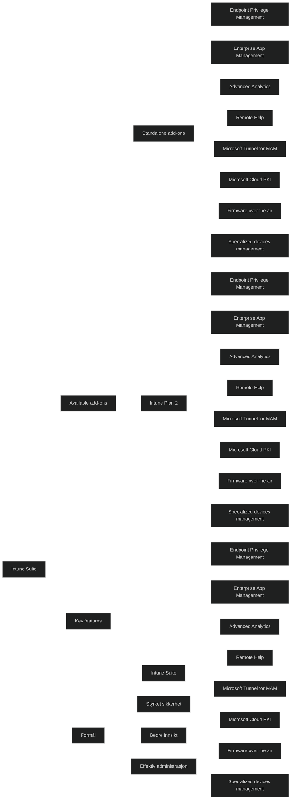
```mermaid
%%{init: {
  "theme": "dark",
  "themeVariables": {
    "primaryColor": "#1e1e1e",
    "primaryTextColor": "#ffffff",
    "lineColor": "#ffffff",
    "secondaryColor": "#333333"
  }
}}%%
flowchart LR

    A[Intune Suite] --> B[Available add-ons]
    B --> B1[Standalone add-ons]
    B --> B2[Intune Plan 2]
    B --> B3[Intune Suite]

    A --> C[Key features]

    %% Standalone blokk
    B1 --> S1[Endpoint Privilege Management]
    B1 --> S2[Enterprise App Management]
    B1 --> S3[Advanced Analytics]
    B1 --> S4[Remote Help]
    B1 --> S5[Microsoft Tunnel for MAM]
    B1 --> S6[Microsoft Cloud PKI]
    B1 --> S7[Firmware over the air]
    B1 --> S8[Specialized devices management]

    %% Plan 2 blokk
    B2 --> P1[Endpoint Privilege Management]
    B2 --> P2[Enterprise App Management]
    B2 --> P3[Advanced Analytics]
    B2 --> P4[Remote Help]
    B2 --> P5[Microsoft Tunnel for MAM]
    B2 --> P6[Microsoft Cloud PKI]
    B2 --> P7[Firmware over the air]
    B2 --> P8[Specialized devices management]

    %% Suite blokk
    B3 --> U1[Endpoint Privilege Management]
    B3 --> U2[Enterprise App Management]
    B3 --> U3[Advanced Analytics]
    B3 --> U4[Remote Help]
    B3 --> U5[Microsoft Tunnel for MAM]
    B3 --> U6[Microsoft Cloud PKI]
    B3 --> U7[Firmware over the air]
    B3 --> U8[Specialized devices management]

    A --> D[Formål]
    D --> D1[Styrket sikkerhet]
    D --> D2[Bedre innsikt]
    D --> D3[Effektiv administrasjon]

```

<a href="/certs/diagrams/deploy-intune-suite-addons-plans.html" target="_blank" rel="noopener">Stort diagram</a>

## [Applying Zero Trust security using the Microsoft Intune Suite](https://learn.microsoft.com/en-us/training/modules/explore-microsoft-intune-suite/3-apply-zero-trust/?ns-enrollment-type=learningpath&ns-enrollment-id=learn.wwl.deploy-cloud-based-tools)

[Zero Trust](../../Glossary/Zero-Trust.md) er en sikkerhetsmodell som tar utgangspunkt i at trusler kan komme fra hvor som helst. Det krever kontinuerlig verifisering av brukere, enheter og apper før tilgang gis. _Intune Suite_ er sentral i denne modellen ved å kombinere ID-, enhets- og appkontroll i en helhetlig løsning. Dette gjør det mulig å sikre tilgang til ressurser uavhengig av hvor brukeren befinner seg eller hvilken enhet som brukes.

### How Zero Trust works in Modern IT

Moderne miljøer er mer distribuert enn tidligere, og tradisjonelle perimeterbaserte modeller gir ikke tilstrekkelig beskyttelse. _Zero Trust_ forutsetter at ingen brukere eller enheter er godkjente uten kontinuerlig vurdering. Intune Suite bidrar ved å sikre at bare enheter og brukere som oppfyller kravene får tilgang, og at risiko vurderes fortløpende. Dette gir bedre kontroll i miljøer med fjernarbeid og blandede enheter.

### Key features for implementing Zero Trust with Microsoft Intune

#### Conditional Access Policies 

Bruker risikovurdering fra [Entra ID](../../Glossary/Microsoft-Entra-ID.md) for å kontrollere tilgang basert på faktorer som enhetsstatus, brukerautentisering og plassering. Tilgang gis bare når kravene er oppfylt.

#### Device compliance Policies

Sikrer at enheter følger definerte sikkerhetskrav som kryptering, passord og oppdateringer. Ikke kompatible enheter blokkeres automatisk.

#### App Protection Policies

Beskytter data i apper, også på BYOD. Data isoleres, krypteres og kan bare deles gjennom godkjente kanaler.

#### Endpoint Privilege Management

Gir midlertidige administrative rettigheter ved behov. Reduserer risiko for misbruk av privilegier og minimerer angrepsflaten.

#### Integration with Microsoft Defender for Endpoint

Gir kontinuerlig trusselovervåkning og respons. Kompromitterte eller risikofylte enheter kan automatisk miste tilgang til ressurser.

### How Intune enables Zero Trust

#### Continuous Authentication and Access Control

Brukere og enheter verifiseres kontinuerlig gjennom [ConditionalA ccess](../../Glossary/Conditional-Access.md) og MFA. Detter fjerner behovet for å stole på klienter og brukere som standard.

#### Granular Device and App Management

Krav til enheter og apper sikrer at bare godkjente og sikre konfigurasjoner får tilgang til data, også i BYOD miljøer.

#### Threat Response and Mitigation

Integrasjon med [Defender for Endpoint](../../Glossary/Microsoft-Defender-for-Endpoint.md) gir sanntidsrespons. Enheter som blir kompromittert mister tilgang umiddelbart.

#### Least Privilege Access

[Endpoint Privilege Management](../../Glossary/Endpoint-Privilege-Management.md) sørger for at brukere kun får nødvendige rettigheter for spesifikke oppgaver.

### Real-world use case

En global finansinstitusjon bruker Zero Trust med Intune for å sikre tilgang til sensitive systemer. Brukere må autentisere med multifaktor, og enheter må være kompatible. Defender for Endpoint overvåker trusler i sanntid, og mistenkelig aktivitet fører til umiddelbar tilgangsbegrensning. Dette beskytter data uavhengig av hvor ansatte jobber.

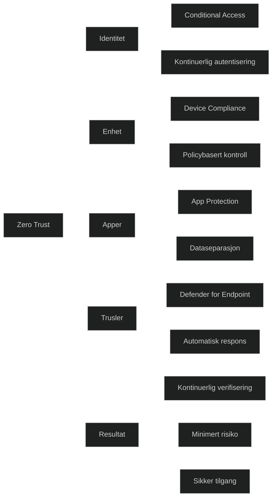
```mermaid
%%{init: {
  "theme": "dark",
  "themeVariables": {
    "primaryColor": "#1e1e1e",
    "primaryTextColor": "#ffffff",
    "lineColor": "#ffffff",
    "secondaryColor": "#333333"
  }
}}%%
flowchart LR

    A[Zero Trust] --> B[Identitet]
    A --> C[Enhet]
    A --> D[Apper]
    A --> E[Trusler]

    B --> B1[Conditional Access]
    B --> B2[Kontinuerlig autentisering]

    C --> C1[Device Compliance]
    C --> C2[Policybasert kontroll]

    D --> D1[App Protection]
    D --> D2[Dataseparasjon]

    E --> E1[Defender for Endpoint]
    E --> E2[Automatisk respons]

    A --> F[Resultat]
    F --> F1[Kontinuerlig verifisering]
    F --> F2[Minimert risiko]
    F --> F3[Sikker tilgang]

```

## [Implement Endpoint Privilege Management](https://learn.microsoft.com/en-us/training/modules/explore-microsoft-intune-suite/4-implement-endpoint-privilege-management/?ns-enrollment-type=learningpath&ns-enrollment-id=learn.wwl.deploy-cloud-based-tools)

[Endpoint Privilege Management (EPM)](../../Glossary/Endpoint-Privilege-Management.md) forbedrer støtte og sikkerhet ved å gi brukere midlertidige rettigheter til å utføre administrative oppgaver uten å være lokale administratorer. Dette øker produktiviteten og reduserer risiko ved at privilegier gis kontrollert og tidsbegrenset. Brukere kan fullføre nødvendige oppgaver uten   å vente på manuell godkjenning, og IT kan automatisere prosessen gjennom policyer. Dette gir bedre flyt i arbeidsdagen og mindre belastning på support.

Løsningen styrker sikkerheten ved å redusere permanent tilgang og ved å logge alle midlertidige tilganger. Dette gir sporbarhet og gjør det enklere oppfylle regulatoriske krav i de miljøer som krever dette. Hver midlertidige tilgang registreres med _tidspunkt, formål_ og _varighet_, noe som gir full oversikt og gjør det mulig å oppdage uvanlig aktivitet. Dette støtter Zero Trust ved at tilgang alltid er begrenset og verifisert.

### Role-based access controls for Endpoint Privilege Management

For å administrere EPM må kontoen har riktige [Role based Access Control (RBAC)](../../Glossary/Role-based-Access-Control-(RBAC).md) rettigheter. [Policy Authoring](../../Glossary/Policy-Authoring.md) gir tilgang til å _lese, opprette, oppdatere_ og _tildele_ policer, mens [Elevation Requests](../../Glossary/Elevation-Requests.md) gir tilgang til å _se_ og _behandle_ forespørsler om retteigheter.
Det finnes innebygde roller som EPM og [Endpoint Privilege Reader](../../Glossary/Endpoint-Privilege-Reader.md), samt roller som [Endpoint Security Manager](../../Glossary/Endpoint-Security-Manager.md) og [Read-Only-Operator](../../Glossary/Read-Only-Operator.md) som også inkluderer nødvendige rettigheter. Dette sikrer at administrasjon av rettigheter kan fordeles etter ansvar og behov.

[Role-based access control for Microsoft Intune](https://learn.microsoft.com/en-us/mem/intune/fundamentals/role-based-access-control)

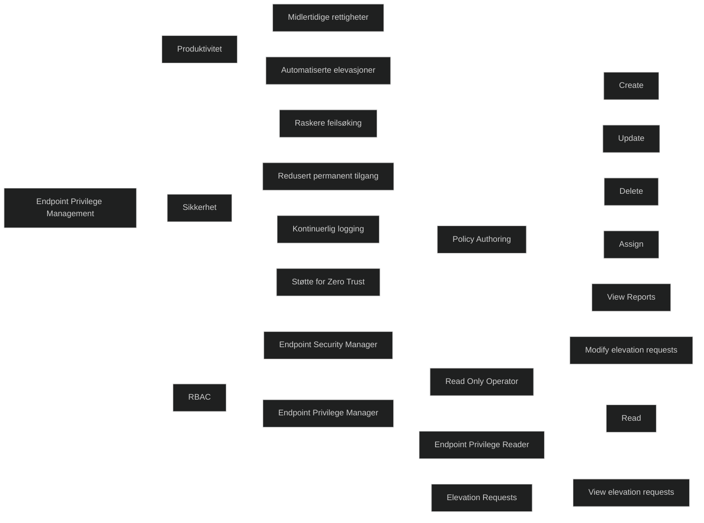
```mermaid
%%{init: {
  "theme": "dark",
  "themeVariables": {
    "primaryColor": "#1e1e1e",
    "primaryTextColor": "#ffffff",
    "lineColor": "#ffffff",
    "secondaryColor": "#333333"
  }
}}%%
flowchart LR

    A[Endpoint Privilege Management] --> B[Produktivitet]
    B --> B1[Midlertidige rettigheter]
    B --> B2[Automatiserte elevasjoner]
    B --> B3[Raskere feilsøking]

    A --> C[Sikkerhet]
    C --> C1[Redusert permanent tilgang]
    C --> C2[Kontinuerlig logging]
    C --> C3[Støtte for Zero Trust]

    A --> D[RBAC]

    %% Policy Authoring
    D --> PA[Policy Authoring]
    PA --> PA1[View Reports]
    PA --> PA2[Read]
    PA --> PA3[Create]
    PA --> PA4[Update]
    PA --> PA5[Delete]
    PA --> PA6[Assign]

    %% Elevation Requests
    D --> ER[Elevation Requests]
    ER --> ER1[View elevation requests]
    ER --> ER2[Modify elevation requests]

    %% Built-in roles
    D --> R1[Endpoint Privilege Manager]
    R1 --> PA
    R1 --> ER

    D --> R2[Endpoint Privilege Reader]
    R2 --> PA1
    R2 --> PA2
    R2 --> ER1

    D --> R3[Endpoint Security Manager]
    R3 --> PA
    R3 --> ER

    D --> R4[Read Only Operator]
    R4 --> PA1
    R4 --> PA2
    R4 --> ER1

```

<a href="/certs/diagrams/deploy-intune-suite-epm.html" target="_blank" rel="noopener">Stort diagram</a>

## [Understand enterprise app management](https://learn.microsoft.com/en-us/training/modules/explore-microsoft-intune-suite/5-understand-enterprise-app-management/?ns-enrollment-type=learningpath&ns-enrollment-id=learn.wwl.deploy-cloud-based-tools)

[Enterprise App Management](../../Glossary/Enterprise-App-Management.md) gir IT mulighet til å sikre, distribuere og administrere apper på en konsistent og kontrollert måte. Løsningen støtter både bedrifts- og personlige enheter, og sørger for at apper installeres riktig, holdes oppdatert og følger krav til sikkerhet og konfigurasjon. Dette er viktig der brukere arbeider fra ulike plattformer og ofte benytter egne enheter.

### How it's used in Modern IT

Moderne organisasjoner er avhengige av Microsoft 365, LOB apper og tredjepartsprogramvare. _Enterprise App Management_ gir en strømlinjeformet måte å sikre at apper er tilgjengelige, oppdaterte og trygge på tvers av enheter. Dette er spesielt viktig i hybride miljøer der brukere veksler mellom bedrifts- og personlige enheter. Løsningen reduserer kompleksitet og gir bedre kontroll over applikasjonsflyten.

### App Protection Policies in Microsoft Intune

_App Protection Polices_ beskytter bedriftsdata i appen, også på enheter som ikke er administrert. Dette gjør det mulig å støtte BYOD uten å miste kontroll over data. Policyene styrer hvordan data kan brukes, deles og lagres i apper, og sikre at informasjon forblir innenfor godkjente rammer.

#### Key features

##### Data protections

Beskytter bedriftsdata gjennom kryptering, blokkering av kopiering og liming, og hindring av sikkerhetskopiering til private tjenester. Dette sikrer at data forblir isolert i appen. 

##### Conditonal Access

Bruker krav som enhetsstatus og identitetskontroll for å bestemme om en app kan brukes. Dette sikrer at bare godkjente enheter og brukere får tilgang til sensitive data.

##### Granular Control

Gir detaljert styring av hvordan apper kan håndtere bedriftsdata, inkludert blokkering av deling mellom ikkegodkjente apper og krav om at data forblir i bedriftens økosystem.

### Real-world use case

_App Protection Policies_ er nyttige i [Zero Trust](../../Glossary/Zero-Trust.md) miljøer der data må beskyttes uavhengig av enhet. Ved å styre data på appnivå kan organisasjoner sikre informasjon uten å kreve full enhetsadministrasjon. Dette gir fleksibilitet for brukere og kontroll for IT.

### Benefits of Enterprise App Management

_Enterprise App Management_ gir flere fordeler:

- _Strømlinjeformet appadministrasjon_: Apper kan legges til direkte fra katalogen, og Intune flytter automatisk inn installsjonsparametere
- _Oppdaterte apper_: Nye versjoner kan distribueres raskt, og Intune håndterer installasjonslogikk, krav og deteksjonsregler
- _Forhåndsutfylte deteksjonsregler_: Filstørrelse, versjon og registerverdier brukes for å sikre riktig installasjon
- _Selvoppdaterende apper_: Intune sikrer at appen minst oppfyller en definert minimumsversjon, mens leverandøren håndterer selve oppdateringen.

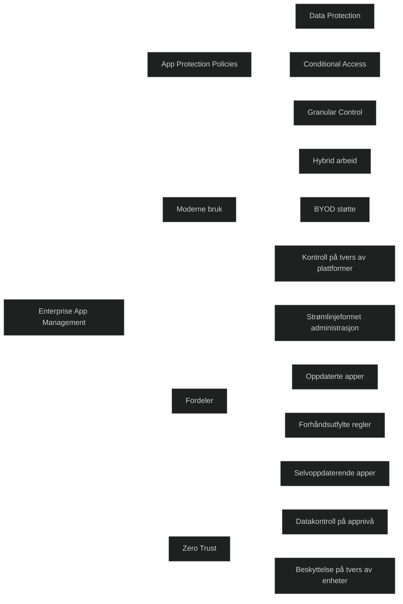
```mermaid
%%{init: {
  "theme": "dark",
  "themeVariables": {
    "primaryColor": "#1e1e1e",
    "primaryTextColor": "#ffffff",
    "lineColor": "#ffffff",
    "secondaryColor": "#333333"
  }
}}%%
flowchart LR

    A[Enterprise App Management] --> B[App Protection Policies]
    B --> B1[Data Protection]
    B --> B2[Conditional Access]
    B --> B3[Granular Control]

    A --> C[Moderne bruk]
    C --> C1[Hybrid arbeid]
    C --> C2[BYOD støtte]
    C --> C3[Kontroll på tvers av plattformer]

    A --> D[Fordeler]
    D --> D1[Strømlinjeformet administrasjon]
    D --> D2[Oppdaterte apper]
    D --> D3[Forhåndsutfylte regler]
    D --> D4[Selvoppdaterende apper]

    A --> E[Zero Trust]
    E --> E1[Datakontroll på appnivå]
    E --> E2[Beskyttelse på tvers av enheter]

```

## [Explore Advanced Analytics](https://learn.microsoft.com/en-us/training/modules/explore-microsoft-intune-suite/6-explore-advanced-analytics/?ns-enrollment-type=learningpath&ns-enrollment-id=learn.wwl.deploy-cloud-based-tools)

[Intune Advanced Analytics](../../Glossary/Intune-Advanced-Analytics.md) gir IT mulighet til å overvåke og analysere data fra enheter, apper, compliance og sikkerhet. Løsningen bygger på sanntidsdata og historiske trender for å gi innsikt som styrker drift, sikkerhet og brukeropplevelse. Dette gjør det mulig å identifisere problemer tidlig, prioritere tiltak og forbedre organisasjonens sikkerhetsnivå. 

### How it's used in Modern IT

Moderne miljøer har stor variasjon i enheter og økende sikkerhetsrisiko. _Advanced Analytics_ gir IT mulighet til å være proaktiv ved å avdekke avvik som ikke-kompatible enheter, appytelsesproblemer og sikkerhetstrusler. Dette gjør det enklere å handle før problemer påvirker brukere eller drift. Løsningen styrker også samsvar i miljøer med strenge krav.

### Key features of Advanced Analytics in Microsoft Intune Suite

#### Customizable Dashboards

Dashboards kan tilpasses for å vise data som appbruk, compliance og trusseldeteksjon. Dette gir fokus på det som er viktigst for organisasjonen.

#### Power BI Integration

Integrasjon med [Power BI](../../Glossary/Power-BI.md) gir visualisering av trender og historikk. Dette gjør det enklere å forstå utvikling i compliance og sikkerhet over tid.

#### Compliance Monitoring

Kontinuerlig overvåkning av compliance sikrer at enheter følger kravene. Dette er viktig i regulerte miljøer der avvik kan føre til brudd på retningslinjer.

#### Real-Time Threat Detection

Integrasjon med [Defender for Endpoint](../../Glossary/Microsoft-Defender-for-Endpoint.md) gir sanntidsdeteksjon av trusler. IT kan reagere raskt på avvik og redusere risiko.

### Prerequisites

_Advanced Analytics_ bygger på [Endpoint Analytics](../../Glossary/Endpoint-Analytics.md). Enheter må være onboardet og administrert gjennom Intune for å bruke funksjonene. Dette gjelder også for co-managed enheter.

### License requirements

_Advanced Analytics_ krever en tilleggslisens i tillegg til lisensene som dekker _Endpoint analytics_. Funksjonene er inkludert i [Intune Suite](../../Glossary/Microsoft-Intune-Suite.md) og kan også kjøpes som et eget tillegg. Admins kan hente prøveversjoner og kjøpe lisenser gjennom Intune Admin Center.

[License requirements](https://learn.microsoft.com/en-us/mem/analytics/enroll-intune#licensing-prerequisites)
[Microsoft Intune Suite](https://learn.microsoft.com/en-us/mem/intune/fundamentals/intune-add-ons)

### Benefits to IT operations

_Advanced Analytics_ gir flere fordeler:

- _Proaktiv problemløsning_: Sanntidsdata gjør det mulig å oppdage problemer før de påvirker brukere.
- _Bedre beslutningsgrunnlag_: Innsikt gjør det enklere å prioritere tiltak og bruke ressurser riktig.
- _Forbedret compliance_: DEtaljerte rapporter gjør det enklere å bestå revisjoner og opprettholde krav.

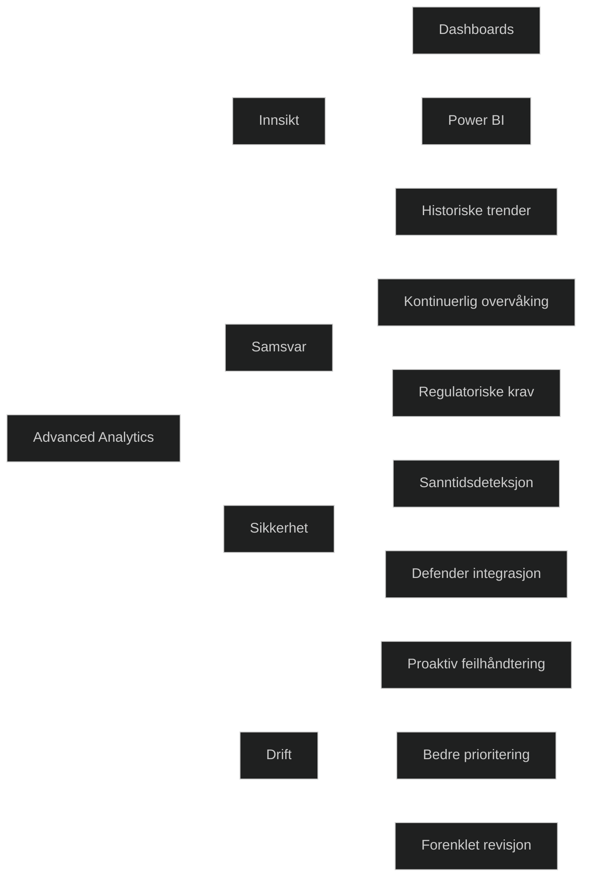
```mermaid
%%{init: {
  "theme": "dark",
  "themeVariables": {
    "primaryColor": "#1e1e1e",
    "primaryTextColor": "#ffffff",
    "lineColor": "#ffffff",
    "secondaryColor": "#333333"
  }
}}%%
flowchart LR

    A[Advanced Analytics] --> B[Innsikt]
    B --> B1[Dashboards]
    B --> B2[Power BI]
    B --> B3[Historiske trender]

    A --> C[Samsvar]
    C --> C1[Kontinuerlig overvåking]
    C --> C2[Regulatoriske krav]

    A --> D[Sikkerhet]
    D --> D1[Sanntidsdeteksjon]
    D --> D2[Defender integrasjon]

    A --> E[Drift]
    E --> E1[Proaktiv feilhåndtering]
    E --> E2[Bedre prioritering]
    E --> E3[Forenklet revisjon]

```

## [Provide Remote Help](https://learn.microsoft.com/en-us/training/modules/explore-microsoft-intune-suite/7-provide-remote-help/?ns-enrollment-type=learningpath&ns-enrollment-id=learn.wwl.deploy-cloud-based-tools)

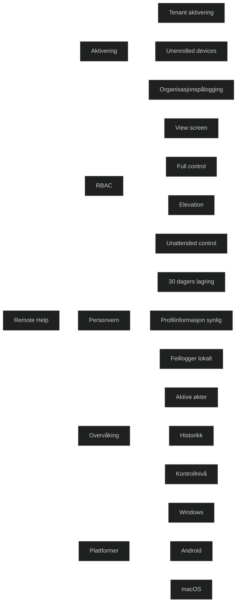
```mermaid
%%{init: {
  "theme": "dark",
  "themeVariables": {
    "primaryColor": "#1e1e1e",
    "primaryTextColor": "#ffffff",
    "lineColor": "#ffffff",
    "secondaryColor": "#333333"
  }
}}%%
flowchart LR

    A[Remote Help] --> B[Aktivering]
    B --> B1[Tenant aktivering]
    B --> B2[Unenrolled devices]
    B --> B3[Organisasjonspålogging]

    A --> C[RBAC]
    C --> C1[View screen]
    C --> C2[Full control]
    C --> C3[Elevation]
    C --> C4[Unattended control]

    A --> D[Personvern]
    D --> D1[30 dagers lagring]
    D --> D2[Profilinformasjon synlig]
    D --> D3[Feillogger lokalt]

    A --> E[Overvåking]
    E --> E1[Aktive økter]
    E --> E2[Historikk]
    E --> E3[Kontrollnivå]

    A --> F[Plattformer]
    F --> F1[Windows]
    F --> F2[Android]
    F --> F3[macOS]

```

[Remote Help](../../Glossary/Remote-Help.md) gjør det mulig for IT å yte støtte i sanntid uavhengig av hvor brukeren befinner seg. Løsningen gir sikker tilkobling mellom hjelper og bruker, og støtter flere plattformer. _Remote Help_ krever aktivering [Tenant](../../Glossary/Tenant.md) og lisens for både hjelper og bruker. Funksjonen styrker driftseffektivitet og reduserer behovet for fysisk tilgang

[Remote Help on Windows with Microsoft Intune](https://learn.microsoft.com/en-us/mem/intune/fundamentals/remote-help-windows)
[Remote Help on Android with Microsoft Intune](https://learn.microsoft.com/en-us/mem/intune/fundamentals/remote-help-android)
[Remote Help on macOS with Microsoft Intune](https://learn.microsoft.com/en-us/mem/intune/fundamentals/remote-help-macos)

Interaktiv demo av [Remote Help](https://regale.cloud/Microsoft/viewer/1746/remote-help/index.html#/0/0).

### Remote Help capabilities and requirements

- _Aktivering i tenant_: Remote Help må aktiveres før brukere kan autentiseres
- _Støtte for unenrolled devices_: Kan aktiveres for enheter som ikke er administrert av [Intune](../../Glossary/Microsoft-Intune.md)
- _Krav om organisasjonspålogging_: Begge parter må bruke Entra konto fra samme tenant
- _Compliance warnings_: Hjelper får varsel hvis enheten ikke er kompatibel
- _[Role based Access Control (RBAC)](../../Glossary/Role-based-Access-Control-(RBAC).md) styring_: Admins kan definere hvem som kan se skjerm, ta kontroll eller utføre elevasjon
- _Overvåkning av økter_: Intune viser aktive og tidligere økter med detaljer om hvem som hjalp hvem og varighet

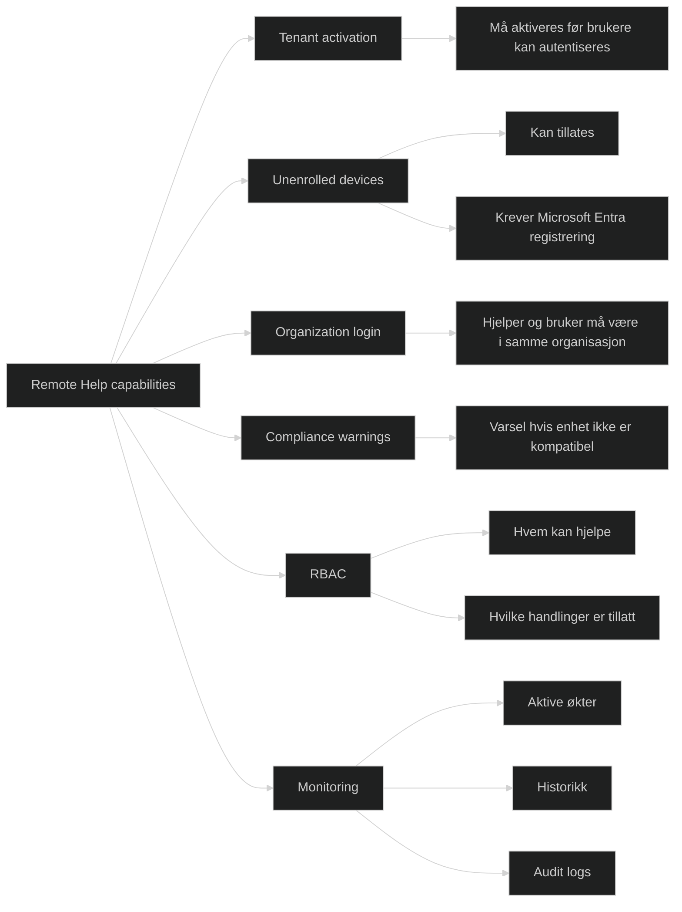
```mermaid
%%{init: {"theme":"dark"}}%%
flowchart LR

    A[Remote Help capabilities] --> B[Tenant activation]
    B --> B1[Må aktiveres før brukere kan autentiseres]

    A --> C[Unenrolled devices]
    C --> C1[Kan tillates]
    C --> C2[Krever Microsoft Entra registrering]

    A --> D[Organization login]
    D --> D1[Hjelper og bruker må være i samme organisasjon]

    A --> E[Compliance warnings]
    E --> E1[Varsel hvis enhet ikke er kompatibel]

    A --> F[RBAC]
    F --> F1[Hvem kan hjelpe]
    F --> F2[Hvilke handlinger er tillatt]

    A --> G[Monitoring]
    G --> G1[Aktive økter]
    G --> G2[Historikk]
    G --> G3[Audit logs]

```

### Prerequisistes

_Remote Help_ krever:
- Intune abonnement
- Remote Help lisens eller [Intune Suite](../../Glossary/Microsoft-Intune-Suite.md) lisens for begge parter
- Plattformspesifikke krav avhengig av Windows, Android eller macOS

for å sikre at funksjonene kan brukes på tvers av enheter.

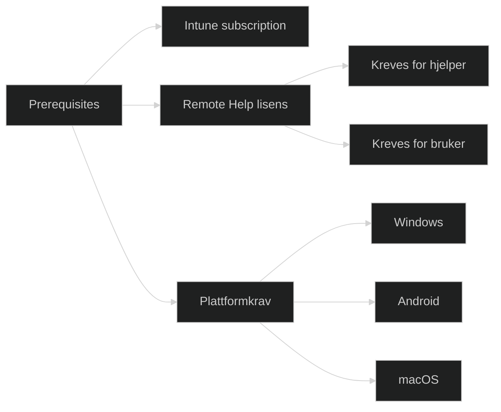
```mermaid
%%{init: {"theme":"dark"}}%%
flowchart LR

    A[Prerequisites] --> B[Intune subscription]
    A --> C[Remote Help lisens]
    C --> C1[Kreves for hjelper]
    C --> C2[Kreves for bruker]

    A --> D[Plattformkrav]
    D --> D1[Windows]
    D --> D2[Android]
    D --> D3[macOS]

```

[Intune subscription](https://learn.microsoft.com/en-us/mem/intune/fundamentals/licenses)
[Remote Help add on license or an Intune Suite license](https://learn.microsoft.com/en-us/mem/intune/fundamentals/intune-add-ons#available-add-ons) 
[Supported platforms and devices](https://learn.microsoft.com/en-us/mem/intune/fundamentals/remote-help#s-upported-platforms-and-devices)

### Supported platforms and devices 

_Remote Help_ støttes på:
- Windows 10/11
- Windows 10/11 på ARM64
- Windows 365
- Samsung og Zebra Android Enterprise dedikerte enheter
- macOS 12, 13, 14

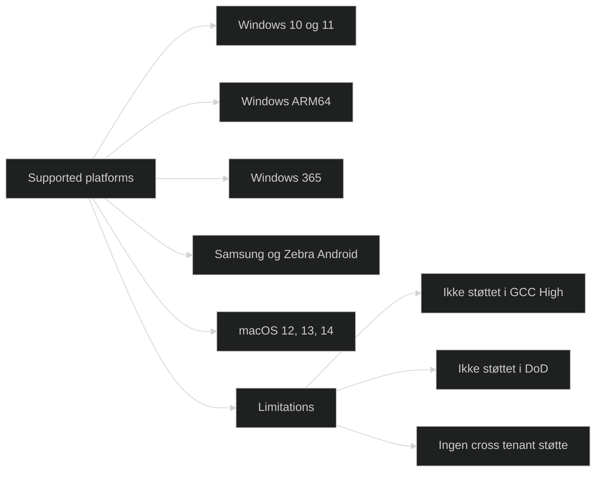
```mermaid
%%{init: {"theme":"dark"}}%%
flowchart LR

    A[Supported platforms] --> B[Windows 10 og 11]
    A --> C[Windows ARM64]
    A --> D[Windows 365]
    A --> E[Samsung og Zebra Android]
    A --> F[macOS 12, 13, 14]

    A --> G[Limitations]
    G --> G1[Ikke støttet i GCC High]
    G --> G2[Ikke støttet i DoD]
    G --> G3[Ingen cross tenant støtte]

```

### Data and privacy considerations for Remote Help in Microsoft Intune

_Remote Help_ lagrer informasjon i 30 dager for å sikre sporbarhet og compliance:
- Start og sluttid for økter
- Hvem som hjalp hvem og enhetsindentifikatorer 
- Feillogger lagres lokalt hos brukeren
- Funksjonsbruk som elevasjon og visning

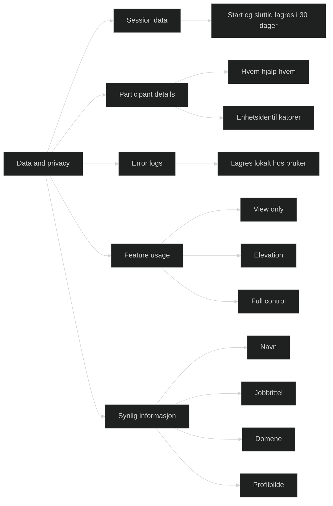
```mermaid
%%{init: {"theme":"dark"}}%%
flowchart LR

    A[Data and privacy] --> B[Session data]
    B --> B1[Start og sluttid lagres i 30 dager]

    A --> C[Participant details]
    C --> C1[Hvem hjalp hvem]
    C --> C2[Enhetsidentifikatorer]

    A --> D[Error logs]
    D --> D1[Lagres lokalt hos bruker]

    A --> E[Feature usage]
    E --> E1[View only]
    E --> E2[Elevation]
    E --> E3[Full control]

    A --> F[Synlig informasjon]
    F --> F1[Navn]
    F --> F2[Jobbtittel]
    F --> F3[Domene]
    F --> F4[Profilbilde]

```

### Data Retention Policy

All data slettes permanent etter 30 dager. Dette støtter personvern og regulatoriske krav.

### Configure Remote Help for your tenant

Konfigurasjon består av tre hovedtrinn og nås fra [Microsoft Intune admin center](https://intune.microsoft.com/#home) _Tenant administration > Remote Help_

#### Step 1: Enable Remote Help

Admins aktiverer _Remote Help_, evt. for unenrolled devices, og kan deaktivere chat. Lisensaktivering kan ta opptil åtte timer.

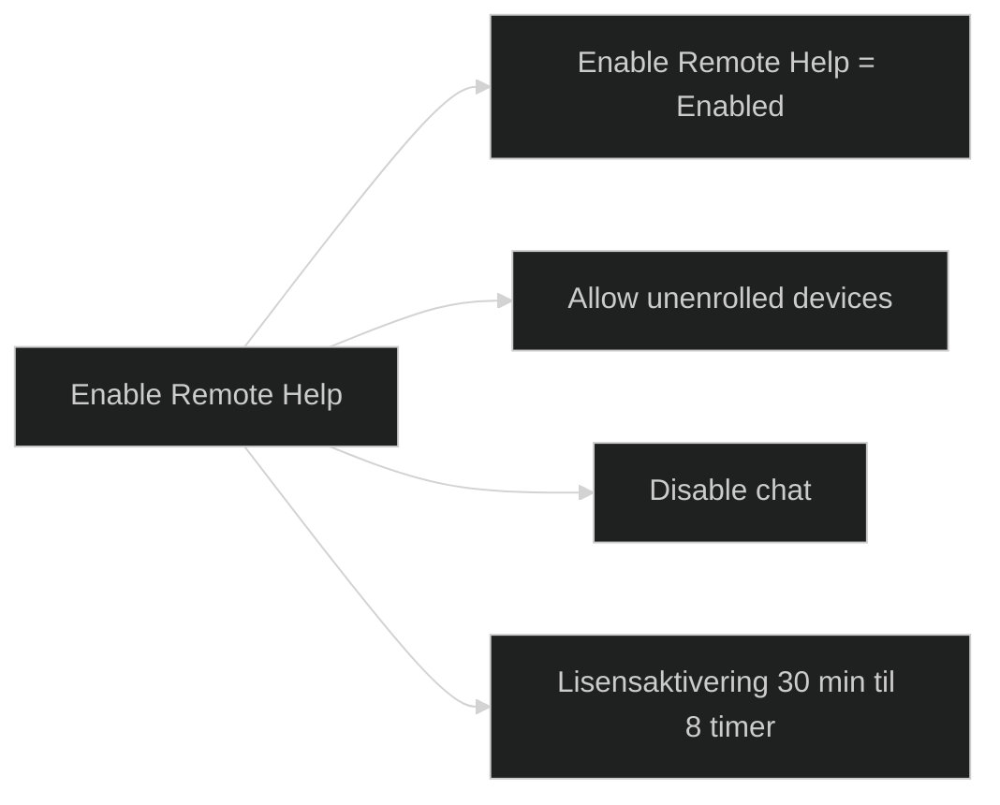
```mermaid
%%{init: {"theme":"dark"}}%%
flowchart LR

    A[Enable Remote Help] --> B[Enable Remote Help = Enabled]
    A --> C[Allow unenrolled devices]
    A --> D[Disable chat]
    A --> E[Lisensaktivering 30 min til 8 timer]

```

#### Step 2: Configure permissions for Remote Help

_RBAC_ styrer hvilke handlinger en hjelper kan utføre:
- _View screen_
- _Take full control_
- _Elevation_
- _Unattended control_

Tillatelser bygger på hverandre. Rollen _Help Desk Operator_ har alle rettigheter som standard.

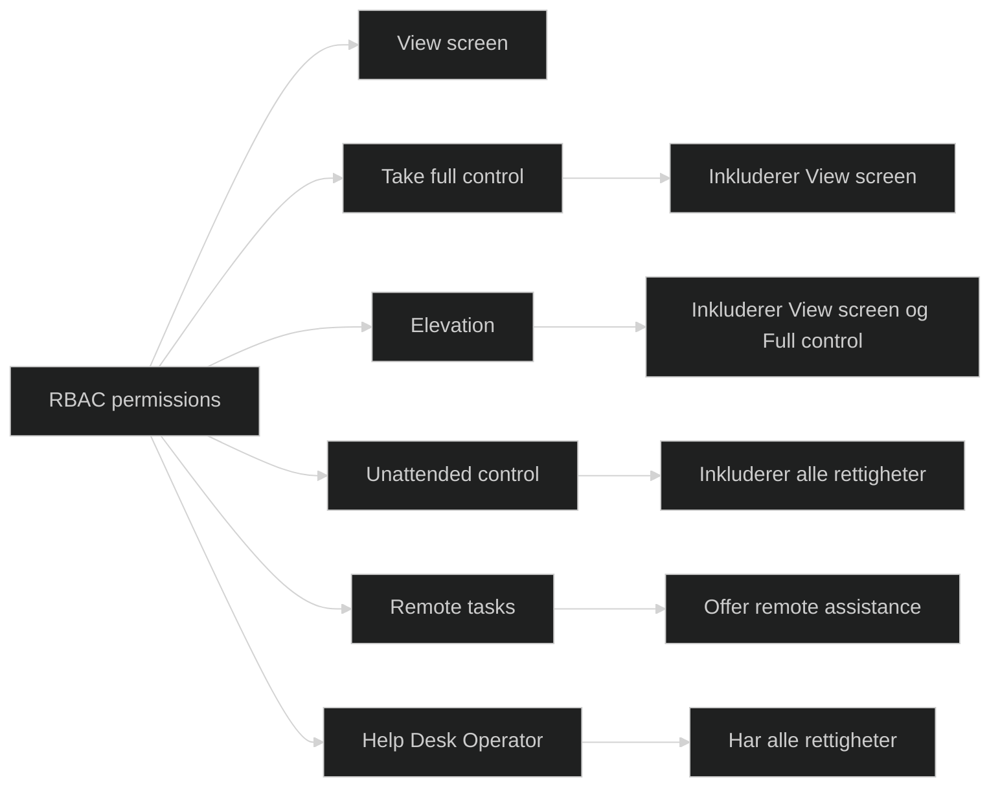
```mermaid
%%{init: {"theme":"dark"}}%%
flowchart LR

    A[RBAC permissions] --> B[View screen]
    A --> C[Take full control]
    A --> D[Elevation]
    A --> E[Unattended control]

    C --> C1[Inkluderer View screen]
    D --> D1[Inkluderer View screen og Full control]
    E --> E1[Inkluderer alle rettigheter]

    A --> F[Remote tasks]
    F --> F1[Offer remote assistance]

    A --> G[Help Desk Operator]
    G --> G1[Har alle rettigheter]

```

#### Step 3: Assign users to roles

Brukere tildeles roller som gir tilgang til _Remote Help_. Rollen må ha riktig scope for at hjelp skal være mulig.

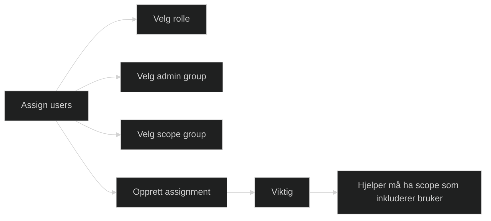
```mermaid
%%{init: {"theme":"dark"}}%%
flowchart LR

    A[Assign users] --> B[Velg rolle]
    A --> C[Velg admin group]
    A --> D[Velg scope group]
    A --> E[Opprett assignment]

    E --> F[Viktig]
    F --> F1[Hjelper må ha scope som inkluderer bruker]

```

### Monitoring and reports

Intune viser aktive økter og historikk, inkludert: 
- Hvem som hjalp hvem
- Enhet
- Start- og sluttid
- Kontrollnivå

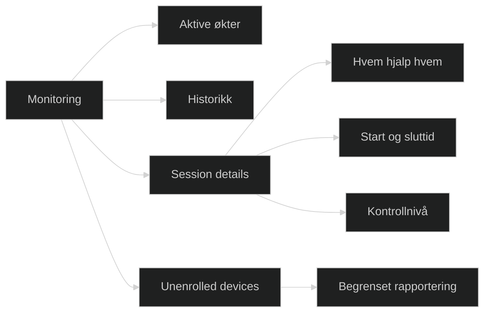
```mermaid
%%{init: {"theme":"dark"}}%%
flowchart LR

    A[Monitoring] --> B[Aktive økter]
    A --> C[Historikk]
    A --> D[Session details]

    D --> D1[Hvem hjalp hvem]
    D --> D2[Start og sluttid]
    D --> D3[Kontrollnivå]

    A --> E[Unenrolled devices]
    E --> E1[Begrenset rapportering]

```

## [Deploy Microsoft Tunnel for mobile applications](https://learn.microsoft.com/en-us/training/modules/explore-microsoft-intune-suite/8-deploy-microsoft-tunnel-mobile-applications/?ns-enrollment-type=learningpath&ns-enrollment-id=learn.wwl.deploy-cloud-based-tools)

[Microsoft-Tunnel](../../Glossary/Microsoft-Tunnel.md) for [Mobile Application Management (MAM)](../../Glossary/Mobile-Application-Management.md) gir sikker tilgang til interne ressurser uten at hele enheten må administreres. Dette gjør løsningen svært nyttig i BYOD miljøer der brukere ikke ønsker full administrasjon, men likevel trenger tilgang til interne apper. Tunnelen gir en sikker og kontrollert tilkobling som støtter [Zero Trust](../../Glossary/Zero-Trust.md) ved å verifisere både bruker og app før tilgang gis. Dette gjør det mulig å gi fleksibel tilgang uten å redusere sikkerheten.

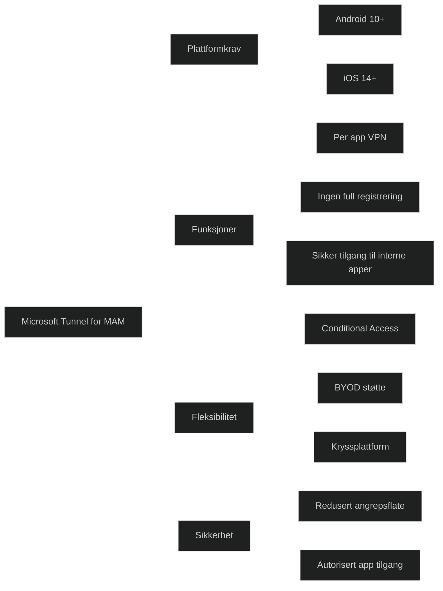
```mermaid
%%{init: {
  "theme": "dark",
  "themeVariables": {
    "primaryColor": "#1e1e1e",
    "primaryTextColor": "#ffffff",
    "lineColor": "#ffffff",
    "secondaryColor": "#333333"
  }
}}%%
flowchart LR

    A[Microsoft Tunnel for MAM] --> B[Plattformkrav]
    B --> B1[Android 10+]
    B --> B2[iOS 14+]

    A --> C[Funksjoner]
    C --> C1[Per app VPN]
    C --> C2[Ingen full registrering]
    C --> C3[Sikker tilgang til interne apper]
    C --> C4[Conditional Access]

    A --> D[Fleksibilitet]
    D --> D1[BYOD støtte]
    D --> D2[Kryssplattform]

    A --> E[Sikkerhet]
    E --> E1[Redusert angrepsflate]
    E --> E2[Autorisert app tilgang]

```

### Platform requirements and feature overview

_Microsoft Tunnel for MAM_ krever at _Tunnel Gateway_ allerede er satt opp. Løsningen støtter _Android Enterprise_ fra versjon 10 og _iOS_ fra versjon 14. 
Tunnelen gir per app VPN, slik at kun godkjente apper får tilgang til interne ressurser. Dette reduserer risiko og gir bedre kontroll i miljøer med personlige enheter. Tunnelen gir også fleksibilitet ved å støtte flere plattformer og sikre tilgang til interne apper uten full enhetsadministrasjon.

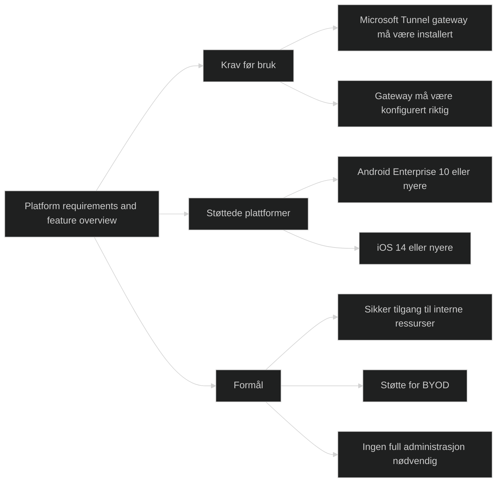
```mermaid
%%{init: {"theme":"dark"}}%%
flowchart LR

    A[Platform requirements and feature overview] --> B[Krav før bruk]
    B --> B1[Microsoft Tunnel gateway må være installert]
    B --> B2[Gateway må være konfigurert riktig]

    A --> C[Støttede plattformer]
    C --> C1[Android Enterprise 10 eller nyere]
    C --> C2[iOS 14 eller nyere]

    A --> D[Formål]
    D --> D1[Sikker tilgang til interne ressurser]
    D --> D2[Støtte for BYOD]
    D --> D3[Ingen full administrasjon nødvendig]

```

[Learn about the Microsoft Tunnel VPN solution for Microsoft Intune](https://learn.microsoft.com/en-us/mem/intune/protect/microsoft-tunnel-overview)
[Identify the prerequisites to install and use the Microsoft Tunnel VPN solution for Microsoft Intune](https://learn.microsoft.com/en-us/mem/intune/protect/microsoft-tunnel-prerequisites)
[Install and configure Microsoft Tunnel VPN solution for Microsoft Intune](https://learn.microsoft.com/en-us/mem/intune/protect/microsoft-tunnel-configure)

#### Key features of Microsoft Tunnel for MAM

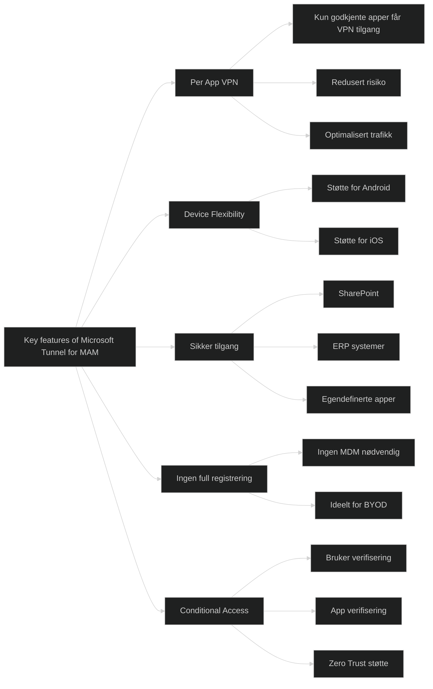
```mermaid
%%{init: {"theme":"dark"}}%%
flowchart LR

    A[Key features of Microsoft Tunnel for MAM] --> B[Per App VPN]
    B --> B1[Kun godkjente apper får VPN tilgang]
    B --> B2[Redusert risiko]
    B --> B3[Optimalisert trafikk]

    A --> C[Device Flexibility]
    C --> C1[Støtte for Android]
    C --> C2[Støtte for iOS]

    A --> D[Sikker tilgang]
    D --> D1[SharePoint]
    D --> D2[ERP systemer]
    D --> D3[Egendefinerte apper]

    A --> E[Ingen full registrering]
    E --> E1[Ingen MDM nødvendig]
    E --> E2[Ideelt for BYOD]

    A --> F[Conditional Access]
    F --> F1[Bruker verifisering]
    F --> F2[App verifisering]
    F --> F3[Zero Trust støtte]

```

##### Per App VPN 

Kun godkjente apper får tilgang tilgang til interne ressurser. Dette reduserer risiko og hindrer at privat trafikk går gjennom bedriftens nettverk.

##### Device Flexibility

Støtte for både Android og iOS gjør at brukere kan arbeide fra ulike enheter uten å miste sikker tilgang.

##### Secure Access to On Premises Resources

Brukere kan nå interne apper som SharePoint, ERP, eller egne bedriftsapper direkte og sikkert.

##### No Full Device Enrollment Needed

Brukere kan få tilgang uten å registrere hele mobilen i Intune. Dette er viktig i BYOD miljøer

##### Conditional Access Integration

Tunnel bruker [Entra ID](../../Glossary/Microsoft-Entra-ID.md) og [Conditional Access](../../Glossary/Conditional-Access.md) for å sikre at bare godkjente brukere og apper får tilgang.

### How Microsoft Tunnel enhances IT operations

Tunnel reduserer angrepsflaten ved å begrense VPN tilgang til spesifikke apper. Dette gir bedre sikkerhet uten å påvirke brukeropplevelsen. Løsningen gir også fleksibilitet ved at ansatte kan bruke egne enheter uten å gi fra seg full kontroll. Dette støtter hybrid arbeid og gjør det enklere å gi tilgang til interne ressurser på en trygg måte. 

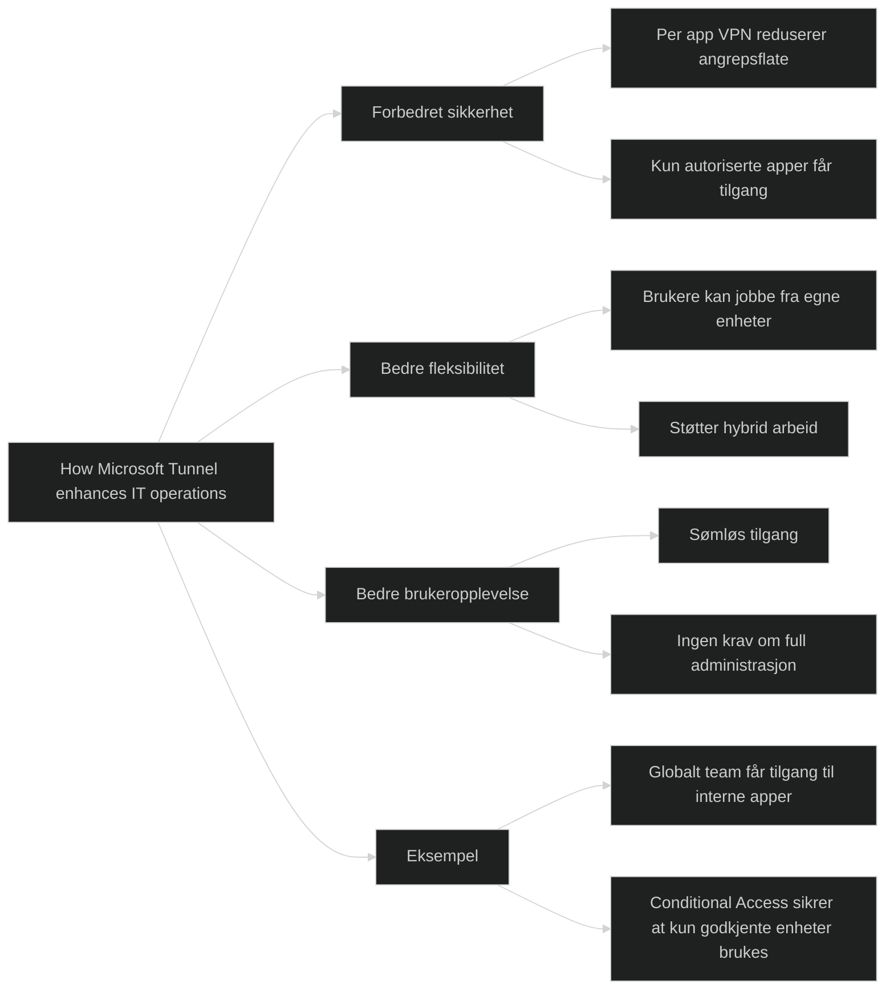
```mermaid
%%{init: {"theme":"dark"}}%%
flowchart LR

    A[How Microsoft Tunnel enhances IT operations] --> B[Forbedret sikkerhet]
    B --> B1[Per app VPN reduserer angrepsflate]
    B --> B2[Kun autoriserte apper får tilgang]

    A --> C[Bedre fleksibilitet]
    C --> C1[Brukere kan jobbe fra egne enheter]
    C --> C2[Støtter hybrid arbeid]

    A --> D[Bedre brukeropplevelse]
    D --> D1[Sømløs tilgang]
    D --> D2[Ingen krav om full administrasjon]

    A --> E[Eksempel]
    E --> E1[Globalt team får tilgang til interne apper]
    E --> E2[Conditional Access sikrer at kun godkjente enheter brukes]

```

### Try the interactive demos

[Microsoft Tunnel for Mobile Application Management for Android](https://regale.cloud/Microsoft/viewer/1896/microsoft-tunnel-for-mobile-application-management-for-android/index.html#/0/0)
[Microsoft Tunnel for Mobile Application Management for iOS/iPadOS](https://regale.cloud/Microsoft/viewer/1976/microsoft-tunnel-for-mobile-application-management-for-ios-ipados/index.html#/0/0)

## [Module assessment](https://learn.microsoft.com/en-us/training/modules/explore-microsoft-intune-suite/9-knowledge-check/?ns-enrollment-type=learningpath&ns-enrollment-id=learn.wwl.deploy-cloud-based-tools)

1. Your company wants to implement Microsoft Tunnel for employees using personal devices. To ensure only specific apps have access to corporate resources, which configuration should you choose?

	Per-App VPN configuration

2. Your organization needs to provide secure access to internal apps for employees using personal mobile devices. What configuration in Microsoft Tunnel supports this requirement effectively?

	Per-App VPN with Conditional Access policies

3. An IT team wants to proactively detect potential security threats and compliance issues across their organization's devices. How can Advanced Analytics in Microsoft Intune aid in this effort?

	By providing real-time threat detection and compliance monitoring through customizable dashboards.

4. What is the primary difference between Advanced Analytics and basic Endpoint analytics in Microsoft Intune?

	Advanced Analytics provides real-time threat detection and customizable dashboards, while basic Endpoint analytics offers general device health monitoring.

5. Which feature of Microsoft Intune Suite assists IT teams in monitoring device compliance and security threats in real-time, allowing for proactive issue resolution?

	Advanced Analytics

6. Which Microsoft Intune Suite feature helps organizations provide remote assistance to users, reducing downtime and improving user satisfaction?

	Remote Help

7. Which Microsoft Intune feature is essential for implementing a secure connection for mobile users to access corporate apps without full device enrollment?

	Microsoft Tunnel

8. How does Endpoint Privilege Management differ from Remote Help in terms of functionality within the Microsoft Intune Suite?

	Endpoint Privilege Management automates temporary admin access, while Remote Help provides real-time user support.

9. Your organization utilizes Remote Help through Microsoft Intune. How can IT ensure that only authorized personnel can offer remote assistance to users?

	By defining role-based access control (RBAC) rules that specify who can provide remote help and under what conditions.

## [Summary](https://learn.microsoft.com/en-us/training/modules/explore-microsoft-intune-suite/10-summary/?ns-enrollment-type=learningpath&ns-enrollment-id=learn.wwl.deploy-cloud-based-tools)

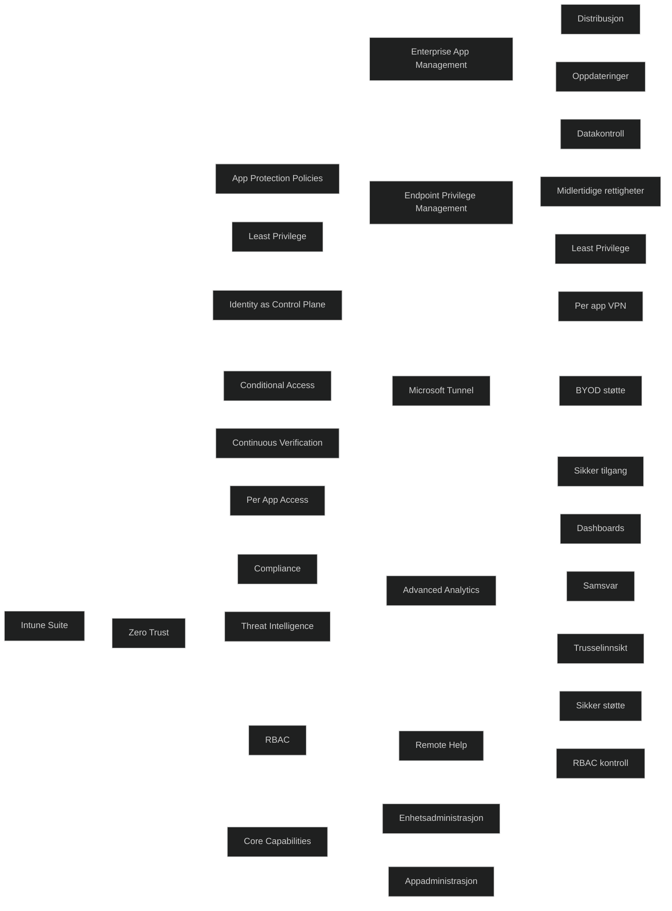
```mermaid
%%{init: {
  "theme": "dark",
  "themeVariables": {
    "primaryColor": "#1e1e1e",
    "primaryTextColor": "#ffffff",
    "lineColor": "#ffffff",
    "secondaryColor": "#333333"
  }
}}%%
flowchart LR

    A[Intune Suite] --> B[Core Capabilities]
    A --> C[Zero Trust]
    A --> D[Endpoint Privilege Management]
    A --> E[Enterprise App Management]
    A --> F[Advanced Analytics]
    A --> G[Remote Help]
    A --> H[Microsoft Tunnel]
    A --> I[RBAC]

    %% Zero Trust prinsipper
    C --> Z1[Least Privilege]
    C --> Z2[Continuous Verification]
    C --> Z3[Identity as Control Plane]

    %% Andre prinsipper
    CA[Conditional Access]
    AP[App Protection Policies]
    CO[Compliance]
    TI[Threat Intelligence]
    PA[Per App Access]

    %% Core Capabilities
    B --> B1[Enhetsadministrasjon]
    B --> B2[Appadministrasjon]
    C --> B1
    C --> B2
    I --> B1
    I --> B2
    CO --> B1

    %% Endpoint Privilege Management
    D --> D1[Midlertidige rettigheter]
    D --> D2[Least Privilege]
    Z1 --> D
    I --> D
    CA --> D

    %% Enterprise App Management
    E --> E1[Distribusjon]
    E --> E2[Oppdateringer]
    E --> E3[Datakontroll]
    AP --> E
    CA --> E
    CO --> E
    Z2 --> E

    %% Advanced Analytics
    F --> F1[Dashboards]
    F --> F2[Samsvar]
    F --> F3[Trusselinnsikt]
    CO --> F
    TI --> F
    Z2 --> F

    %% Remote Help
    G --> G1[Sikker støtte]
    G --> G2[RBAC kontroll]
    I --> G
    CA --> G
    CO --> G
    Z2 --> G

    %% Microsoft Tunnel
    H --> H1[Per app VPN]
    H --> H2[BYOD støtte]
    H --> H3[Sikker tilgang]
    PA --> H
    CA --> H
    AP --> H
    Z3 --> H

```

<a href="/certs/diagrams/deploy-intune-suite-core.html" target="_blank" rel="noopener">Stort diagram</a>