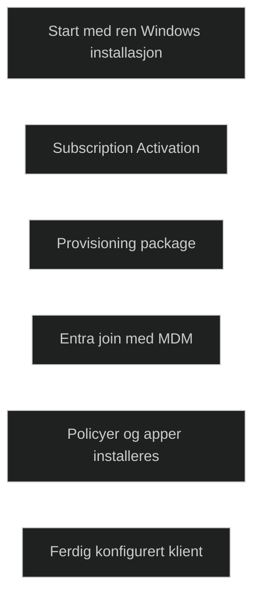
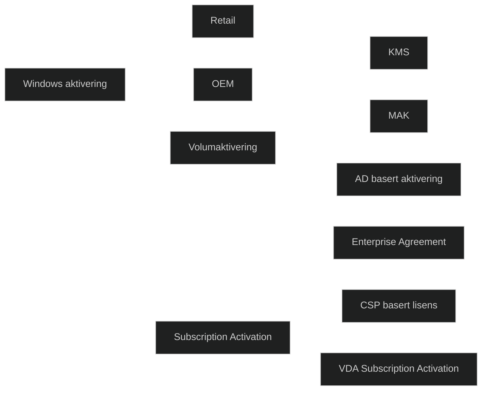
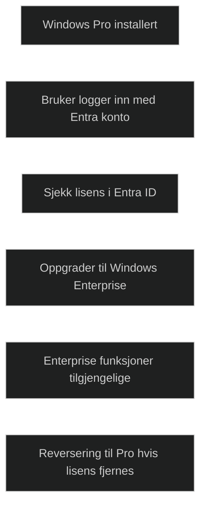
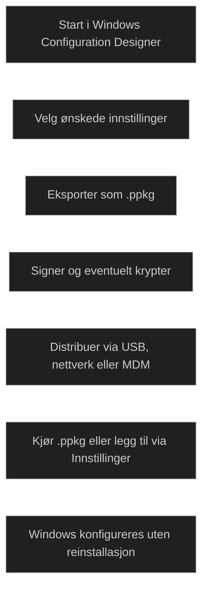
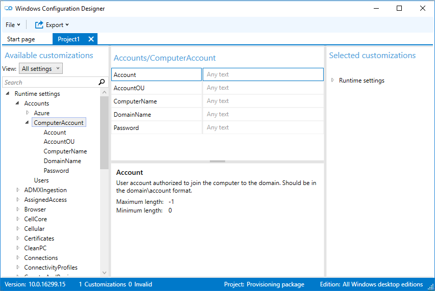
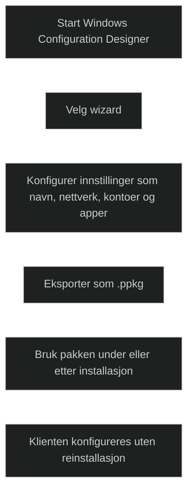
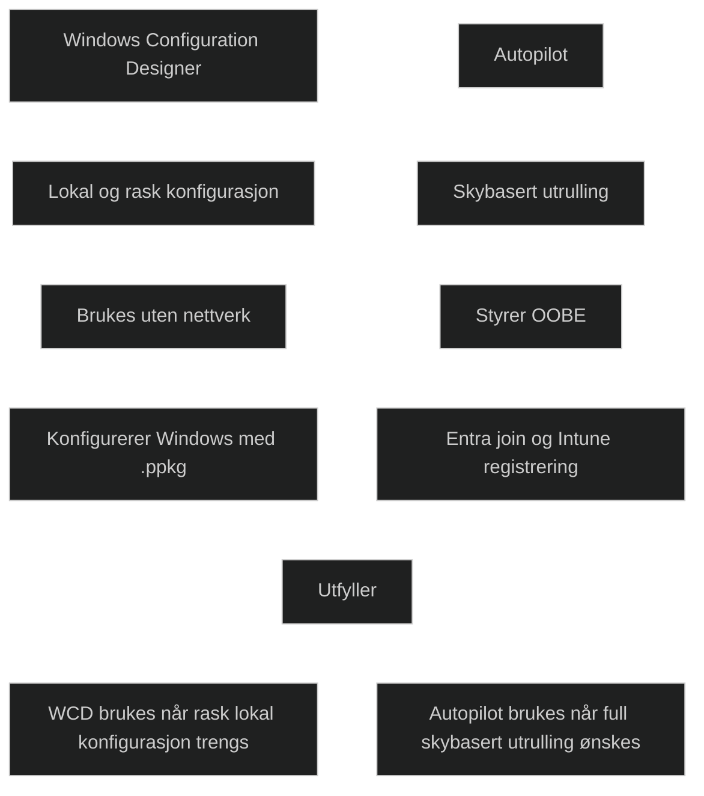
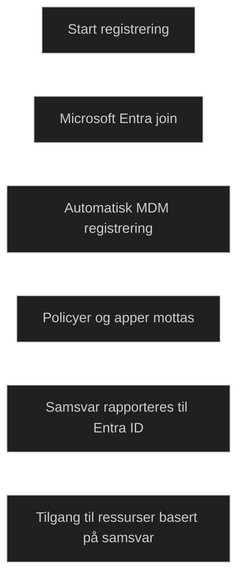
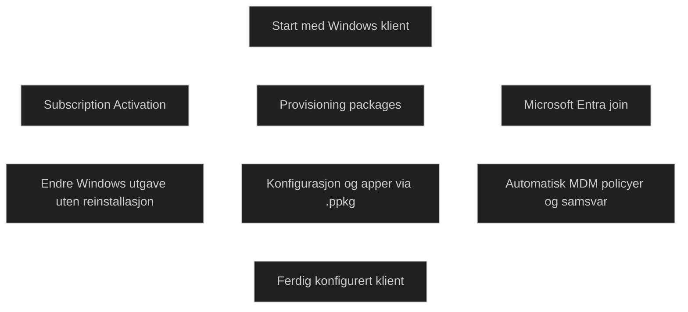

# [Implement dynamic deployment methods](https://learn.microsoft.com/en-us/training/modules/implement-dynamic-deployment/)

|**Faktor**|**Volumaktivering (KMS, MAK, AD‑basert)**|**Subscription Activation**|
|---|---|---|
|**Formål**|Aktivere Windows i større miljøer uten individuell aktivering|Oppgradere Windows Pro til Enterprise uten reinstallasjon|
|**Modeller**|KMS, MAK, Active Directory basert aktivering|Enterprise E3/E5/A3/A5 via EA, MPSA eller CSP|
|**Krav**|KMS host eller AD DS for aktivering, MAK nøkkel for engangsaktivering|Windows Pro installert, Entra ID, Enterprise lisens, Entra join eller hybrid join|
|**Aktiveringsmetode**|Klient kontakter KMS eller AD DS, eller aktiveres med MAK|Bruker logger inn med lisensiert Entra konto|
|**Brukerinteraksjon**|Ingen|Kun innlogging|
|**Endring av Windows‑utgave**|Ingen, aktiverer eksisterende utgave|Oppgraderer automatisk til Enterprise|
|**Lisenshåndtering**|Basert på nøkler og infrastruktur|Dynamisk, knyttet til brukerens lisens i Entra ID|
|**Tilbakerulling**|Ikke relevant|Reverterer til Pro etter 90 dager hvis lisens fjernes|
|**Typiske scenarier**|Tradisjonelle on premises miljøer|Moderne, skybaserte miljøer med Intune og Entra ID|

## [Introduction](https://learn.microsoft.com/en-us/training/modules/implement-dynamic-deployment/1-introduction/?ns-enrollment-type=learningpath&ns-enrollment-id=learn.wwl.deploy-cloud-based-tools)

_Dynamic provisioning_ brukes når nye Windows klienter allerede har en ren installasjon, og det som mangler er riktig utgave, konfigurasjon og apper. Dette gjør utrulling enklere enn tradisjonell imaging og kan brukes når [Autopilot](../../Glossary/Windows-Autopilot.md) ikke er nødvendig. Metoden bygger på tre sentrale mekanismer som til sammen gjør det mulig å konfigurere en klient raskt og standardisert.

### Windows Subscription Activation

_Subscription Activation_ oppgraderer Windows Pro til Enterprise eller Education uten produktnøkkel eller omstart. Brukeren logger inn med en lisensiert konto, og systemet aktiverer riktig utgave automatisk. Dette gir en rask og fleksibel måte å sikre at klienter får riktig Windows versjon.

### Provisioning package configuration

[Windows Configuration Designer](../../Glossary/Windows-Configuration-Designer.md) kan opprette konfigurasjonpakker som inneholder innstillinger, apper og tilpassinger. Disse pakken kan brukes til å konfigurere nye klienter uten behov for imaging. De kan distruberes via USB, nettverk eller MDM.

### Microsoft Entra Join with automatic MDM enrollment

Når brukeren logger inn med jobb/skolekonto, kan klienten automatisk bli medlem av [Entra ID](../../Glossary/Microsoft-Entra-ID.md) og registrert i [MDM](../../Glossary/Mobile-Device-Management.md). Deretter mottar den policyer, apper og konfigurasjon fra organisasjonen. Dette gir en rask og moderne måte å sette opp klienter uten manuell administrasjon.

### Dynamic provisioning vs Autopilot

|**Faktor**|**Dynamic provisioning**|**Autopilot**|
|---|---|---|
|**Formål**|Konfigurere nye Windows klienter som allerede har ren installasjon|Fullstendig styrt utrulling av nye og eksisterende klienter|
|**Bruksområde**|Når enheten kun trenger riktig utgave, konfigurasjon og apper|Når organisasjonen ønsker standardisert OOBE og skybasert utrulling|
|**Teknologi**|Subscription Activation, Provisioning Packages, Entra join med MDM|Autopilot profiler, OOBE styring, Entra ID join, Intune registrering|
|**Krav**|Windows Pro som kan oppgraderes, tilgang til provisioning package|Enhetsregistrering, Autopilot profil, nettverk, Intune og Entra ID|
|**Fordeler**|Raskt, enkelt, ingen imaging, kan brukes uten Autopilot|Full kontroll over OOBE, flere utrullingsmoduser, moderne administrasjon|
|**Kompleksitet**|Lav, krever lite infrastruktur|Moderat, krever registrering og profilhåndtering|
|**Typiske scenarier**|Nye OEM enheter som kun trenger konfigurasjon|Nye enheter til brukere, kiosk, pre provisioned, eksisterende enheter|

## [Examine subscription activation](https://learn.microsoft.com/en-us/training/modules/implement-dynamic-deployment/2-examine-subscription-activation/?ns-enrollment-type=learningpath&ns-enrollment-id=learn.wwl.deploy-cloud-based-tools)

### Current volume activation

_Volumaktivering_ brukes i større miljøer for å aktivere Windows uten at brukeren må gjøre noe. [Key Management Service (KMS)](../../Glossary/Key-Management-Service.md) aktiverer klienter mot en intern server, [Multiple Activation Key (MAK)](../../Glossary/Multiple-Activation-Key.md) bruker nøkler som aktiverer et begrenset antall klienter, og [AD basert](../../Glossary/Active-Directory-based-activation.md) basert aktivering lagrer aktiveringsobjekter i katalogen slik at klienter aktiveres ved oppstart. Disse metodene brukes når organisasjonen har _volumlisensavtaler_.

### Subscription Activation

[Subscription Activation](../../Glossary/Subscription-Activation.md) gjøre det mulig å oppgradere _Pro_ til _Enterprise_ uten reinstallasjon eller produktnøkkel. Når en bruker med riktig lisens logger inn med Entra konto, oppgraderes systemet automatisk. Dette gir en fleksibel og moderne måte å distribuere Enterprise funksjoner på, spesielt i miljøer med mange klienter.

#### Subscription Activation requirements

For at _Subscription Activation_ skal fungere, må klienten ha _Pro_ eller høyere, være aktivert, og være [Entra joined](../../Glossary/Microsoft-Entra-Join.md). Organisasjonen må ha gyldig Enterpriselisenser, enten gjennom [[_Enterprise Agreement_, _MPSA_ eller _CSP_]]. Dette sikrer at oppgraderingen skjer automatisk når brukeren logger inn.

#### How Subscription Activation works

Når en lisensiert bruker logger inn, sjekker systemet lisensen i _Entra ID_ og oppgraderer Windows til Enterprise. Hvis lisensen fjernes, går systemet tilbake til _Pro_ etter en grace periode på 90 dager. Dette gjør lisenshåndtering mer dynamisk og brukervennlig.

### VDA Subscription Activation

For virtuelle klienter kan _Enterprise_ lisens aktiveres via [Virtual Desktop Access (VDA)](../../Glossary/Virtual-Desktop-Access.md). Dette støtter både _Entra join_ og _AD join_, og kan bruke inherited activation der VM arver aktiveringstilstanden fra verten. Dette er nyttig i miljøer med virtuelle skrivebord.

 [Windows Subscription Activation](https://learn.microsoft.com/en-us/windows/deployment/windows-10-enterprise-subscription-activation)
 
## [Deploy using provisioning packages](https://learn.microsoft.com/en-us/training/modules/implement-dynamic-deployment/3-deploy-provisioning-packages/?ns-enrollment-type=learningpath&ns-enrollment-id=learn.wwl.deploy-cloud-based-tools)

En [Provisioning package](../../Glossary/Provisioning-Package.md) brukes til å konfigurere Windows raskt uten reinstallasjon. Den bygges i [Windows Configuration Designer (WDC)](../../Glossary/Windows-Configuration-Designer.md), der admin velger innstillinger som skal inngå i pakken. Resultatet eksporteres som en `.ppkg` fil som kan brukes til å endre en Windows installasjon både _online_ og _offline_. Dette gjør metoden nyttig i miljøer som ikke har sentralisert administrasjon, eller der nettverkstilgang er begrenset.

Pakken kan inneholde et bredt sett med innstillinger, som kontokonfigurasjon, sertifikater, oppgradering av Windows utgave, mapper, policyer og tilpasninger. Den kan også brukes til å legge til apper, filer, nettverksinnstillinger og sikkerhetskrav. Admin kan signere og evt kryptere pakken for å sikre at bare godkjente pakker brukes. 

En _provisioning package_ kan kjøres direkte, legges til via Innstillinger eller installers med _PowerShell_. Den gir en rask måte å konfigurere Windows på uten behov for å imaging, og er derfor et nyttig supplement til [Autopilot](../../Glossary/Windows-Autopilot.md) i situasjoner der internett ikke er tilgjengelig eller der en rask lokal konfigurasjon er nødvendig.

|**Faktor**|**Provisioning packages (.ppkg)**|**Autopilot**|
|---|---|---|
|**Formål**|Rask lokal konfigurasjon uten reinstallasjon|Full skybasert utrulling med styrt OOBE|
|**Bruksområde**|Miljøer uten nettverk, små miljøer, rask manuell konfigurasjon|Standardisert utrulling av nye og eksisterende klienter|
|**Teknologi**|Windows Configuration Designer, .ppkg filer|Autopilot profiler, Entra ID join, Intune registrering|
|**Krav**|Ingen registrering, kun tilgang til .ppkg|Enhetsregistrering, Autopilot profil, Intune og Entra ID|
|**Distribusjon**|USB, nettverk, MDM, manuell kjøring|Automatisk via skyen under OOBE|
|**Fordeler**|Raskt, offline støtte, fleksibelt, ingen imaging|Full kontroll, moderne administrasjon, flere utrullingsmoduser|
|**Kompleksitet**|Lav, krever lite infrastruktur|Moderat, krever registrering og profilhåndtering|
|**Typiske scenarier**|Rask lokal konfigurasjon, feltarbeid, begrenset nettverk|Nye brukere, kiosk, pre provisioned, eksisterende enheter|

## [Use Windows Configuration Designer](https://learn.microsoft.com/en-us/training/modules/implement-dynamic-deployment/4-use-windows-configuration-designer/?ns-enrollment-type=learningpath&ns-enrollment-id=learn.wwl.deploy-cloud-based-tools)

[WDC](../../Glossary/Windows-Configuration-Designer.md) brukes til å lage [provisioning packages](../../Glossary/Provisioning-Package.md) som kan konfigurere Windows raskt uten reinstallasjon. Verktøyet tilbyr flere veivisere som gjør det mulig å sette opp navn, produktnøkkel, nettverk, kontoer, apper, sertifikater og kioskinnstillinger. Hvilke valg som er tilgjengelig avhenger av om du bruker _Desktop, Mobile_ eller _Kiosk_ wizard.

Pakkene kan brukes både under utrulling og etter installasjon, og gir en fleksibel måte å konfigurere Windows på i miljøer der _Autopilot_ ikke er nødvendig eller der nettverkstilgangen er begrenset. Dette gjør metoden relevant i situasjoner der rask lokal konfigurasjon er viktig.

### Microsoft Entra join with automatic MDM enrollment

Denne metoden bygger på [Entra ID](../../Glossary/Microsoft-Entra-ID.md) og [Intune](../../Glossary/Microsoft-Intune.md). Når en klient blir Entra joined og automatisk registrert i MDM, mottar den policyer, apper og konfigurasjon. MDM kan også rapportere samsvar tilbake til Entra ID, som igjen kan styre tilgang til ressurser. Dette gir en moderne og skybasert måte å konfigurere Windows på.

## [Use Microsoft Entra join with automatic MDM enrollment](https://learn.microsoft.com/en-us/training/modules/implement-dynamic-deployment/5-use-azure-ad-join-automatic-mobile-device-management-enrollment/?ns-enrollment-type=learningpath&ns-enrollment-id=learn.wwl.deploy-cloud-based-tools)

### Organizational-owned devices (CYOD)

Entra join brukes om et moderne alternativ til tradisjonell domenetilknytning. Klienten registreres direkte i skyen, og deretter gir en raskere og mer fleksibel utrulling. Under registrering mottar klienten policyer og konfigurasjon som sikrer samsvar. Hvis krav ikke oppfylles, kan registreringen blokkeres. Dette gjør metoden egnet som standard prosess for utrulling av nye klienter uten behov for reimaging.

### User-owned scenarios (BYOD)

Brukere kan legge til jobbkontoen sin i Windows for å få tilgang til organisasjonens ressurser. MDM håndhever policyer, installerer apper og sikrer samsvar. Brukeren må godta kravene for å få tilgang. MDM rapporterer samsvar tilbake til til Entra ID, som deretter kan kontrollere tilgang til ressurser basert på om klienten oppfyller kravene.

## [Module assessment](https://learn.microsoft.com/en-us/training/modules/implement-dynamic-deployment/6-knowledge-check/?ns-enrollment-type=learningpath&ns-enrollment-id=learn.wwl.deploy-cloud-based-tools)

1. As the Desktop Administrator for Fabrikam, Holly Spencer wants to deploy a provisioning package to apply configuration settings to the new batch of Windows 11 computers that Fabrikam recently purchased. Holly configured the settings in the provisioning package using the Windows Configuration Designer tool. What's the next step that Holly must complete as part of the provisioning process?

	Export the provisioning package to a .ppkg file

2. Contoso wants to use Microsoft Volume Licensing to activate the Windows 11 subscriptions that it recently purchased. Contoso wants to use the volume activation method that uses product keys that can activate a specific number of computers. Which volume activation method is this?

	MAK

## [Summary](https://learn.microsoft.com/en-us/training/modules/implement-dynamic-deployment/7-summary/?ns-enrollment-type=learningpath&ns-enrollment-id=learn.wwl.deploy-cloud-based-tools)

Administratorer kan bruke dynamiske utrullingsmetoder for å konfigurere Windows klienter uten behov for tradisjonell imaging. _Subscription Activation_ gjør det mulig å endre Windows utgave uten reinstallasjon, noe som gir en rask og fleksibel måte å aktivere Enterprise funksjoner på. _Provisioning packages_ kan brukes til å anvende ønsket konfigurasjon, inkludert apper, ved hjelp av flyttbare medier eller nedlastede filer. Når en klient blir Microsoft Entra joined, kan konfigurasjonspolicyer anvendes automatisk. For brukere som eier sin egen klient, kan policyer brukes etter at brukeren har godkjent kravene, slik at organisasjonen kan sikre samsvar og kontroll.

[Windows 10/11 Subscription Activation](https://learn.microsoft.com/en-us/windows/deployment/windows-10-subscription-activation)
[Provisioning packages overview on Windows 10/11](https://learn.microsoft.com/en-us/windows/configuration/provisioning-packages/provisioning-packages)
[Microsoft Entra integration with MDM](https://learn.microsoft.com/en-us/windows/client-management/mdm/azure-active-directory-integration-with-mdm)