# [Manage Azure Virtual Desktop](https://learn.microsoft.com/en-us/training/modules/manage-azure-virtual-desktop/)

## [Introduction](https://learn.microsoft.com/en-us/training/modules/manage-azure-virtual-desktop/1-introduction/?ns-enrollment-type=learningpath&ns-enrollment-id=learn.wwl.deploy-cloud-based-tools)

[Azure Virtual Desktop (AVD)](../../Glossary/Azure-Virtual-Desktop.md) er en skybasert tjeneste for desktop og appvirtualisering som gir brukere tilgang til eksterne skrivebord og apper fra de fleste plattformer. Tjenesten er bygget på Azure og gir fleksibel, skalerbar og sentralisert leveranse av Windows miljøer.

 _Azure Virtual Desktop_ er en fleksibel VDI plattform der du selv administrerer infrastrukturen i Azure, mens [Windows 365](../../Glossary/Windows-365.md) er en fullstendig administrert Cloud PC tjeneste som alltid gir hver bruker en personlig maskin. AVD er mer tilpasningsbar og krever mer drift, mens Windows 365 er fast, forutsigbar og krever minimal administrasjon.

## [Examine Azure Virtual Desktop](https://learn.microsoft.com/en-us/training/modules/manage-azure-virtual-desktop/2-examine-azure-virtual-desktop/?ns-enrollment-type=learningpath&ns-enrollment-id=learn.wwl.deploy-cloud-based-tools)

_AVD_ er en skybasert løsning for skrivebord og appvirtualisering som gir brukere tilgang til Windows 10/11 miljøer fra ulike plattformer. Løsningen støtter multi-session Windows 10/11, noe som gir skalerbarhet og effektiv ressursbruk. Den kan også brukes til å migrere eksisterende RDS mijløer og publisere både skrivebord og apper. Administrasjon skjer gjennom Azure verktøy, og infrastrukturen håndteres tjenesten slik at du kun administrerer image og virtuelle maskiner.

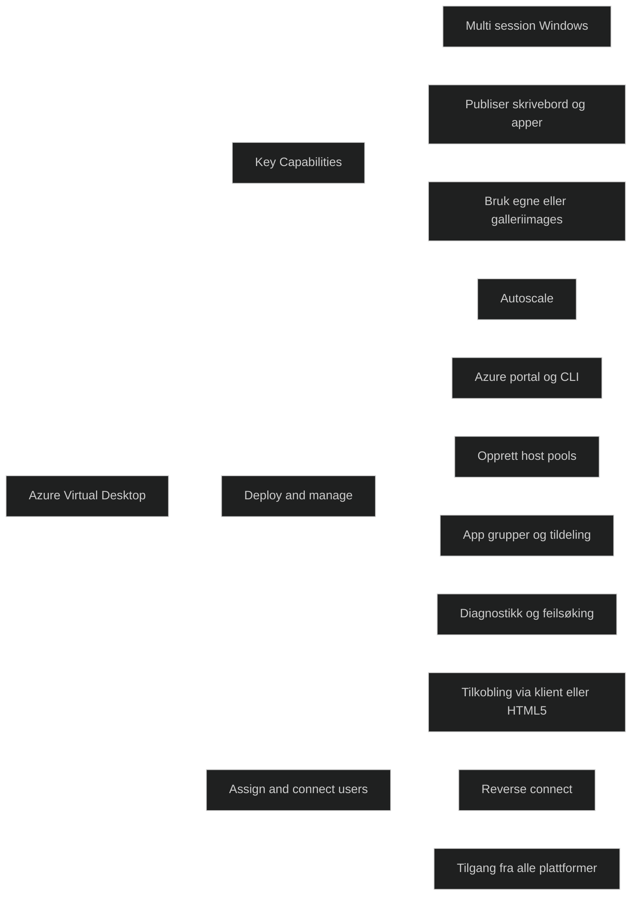


## [Explore Azure Virtual Desktop](https://learn.microsoft.com/en-us/training/modules/manage-azure-virtual-desktop/3-explore-azure-virtual-desktop/?ns-enrollment-type=learningpath&ns-enrollment-id=learn.wwl.deploy-cloud-based-tools)

### Key Capabilites

_AVD_ gir en fleksibel og skalerbar plattform der du kan opprette [host pools](../../Glossary/Host-Pools.md), publisere ressurser og bruke egne eller galleri-images. Multi-session Windows reduserer antall virtuelle maskiner som trengs, og [autoscale](../../Glossary/Autoscale.md) gjør det mulig å tilpasse kapasitet etter behov. Personlige skrivebord kan også tilbys når brukere trenger dedikerte miljøer.

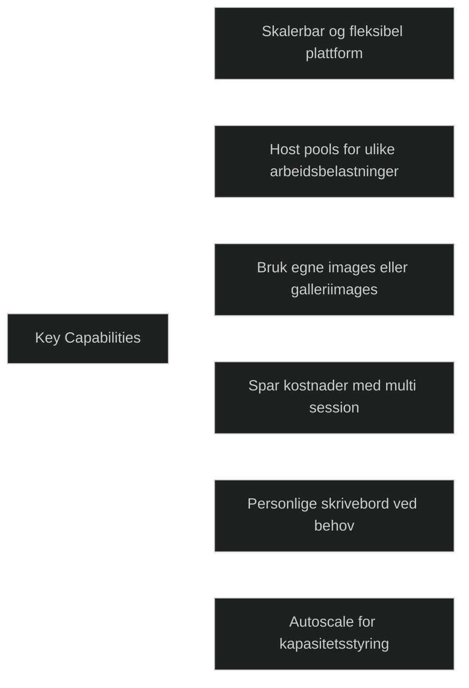

### To deploy and manage virtual desktops

Administrasjon skjer gjennom _Azure portal, [Azure CLI](../../Glossary/Azure-CLI.md) , PowerShell_ og [REST API](../../Glossary/REST-API.md). Du kan opprette host pools, app grupper og tildele brukere. Det er mulig å publisere hele skrivebord eller enkeltapper, og brukere kan tilordnes flere app grupper. 
Diagnostikk og feilsøking støttes gjennom innebygde verktøy, og du administrerer kun image og virtuelle maskiner, ikke infrastrukturen som i tradisjonelle RDS miljøer.

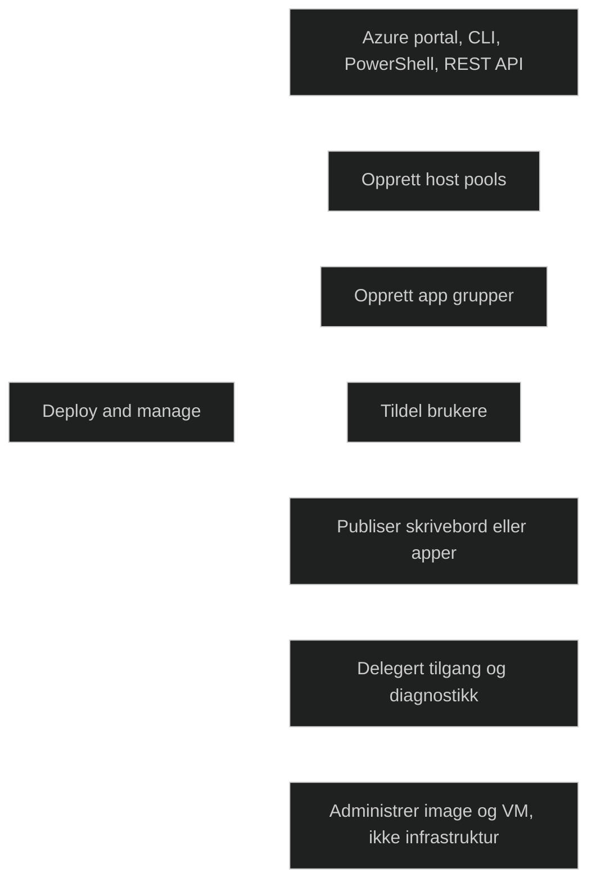

### Assign and connect users to virtual desktops

Når brukere er tildelt, kan de koble seg til via klienter eller HTML5 webklienter. Tilkoblingen skjer gjennom [reverse connect](../../Glossary/Reverse-Connect.md), som gjør at ingen innkommende porter må åpnes. Brukere får tilgang til publiserte skrivebord og apper fra hvilken som helst enhet.

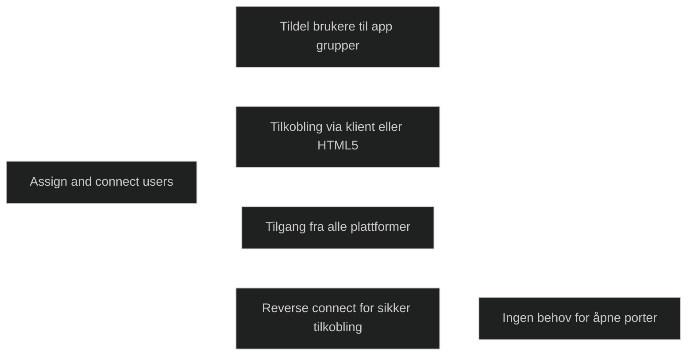

## [Configure Azure Virtual Desktop](https://learn.microsoft.com/en-us/training/modules/manage-azure-virtual-desktop/4-configure-azure-virtual-desktop/?ns-enrollment-type=learningpath&ns-enrollment-id=learn.wwl.deploy-cloud-based-tools)

_Tutorial_

[Azure Virtual Desktop terminology](https://learn.microsoft.com/en-us/azure/virtual-desktop/environment-setup)
[free account](https://azure.microsoft.com/pricing/purchase-options/azure-account?cid=msft_learn_3023bf17-6549-8971-71df-30974b1fb369)
[built-in role-based access control (RBAC) roles](https://learn.microsoft.com/en-us/azure/role-based-access-control/role-assignments-portal)
[virtual network](https://learn.microsoft.com/en-us/azure/virtual-network/quick-create-portal)
[Remote Desktop clients for Azure Virtual Desktop](https://learn.microsoft.com/en-us/azure/virtual-desktop/users/remote-desktop-clients-overview)
[Remote Desktop Web client](https://learn.microsoft.com/en-us/azure/virtual-desktop/users/connect-web)
[Azure portal](https://portal.azure.com/)
 

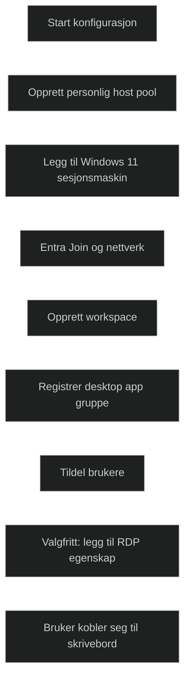

### Prerequisits

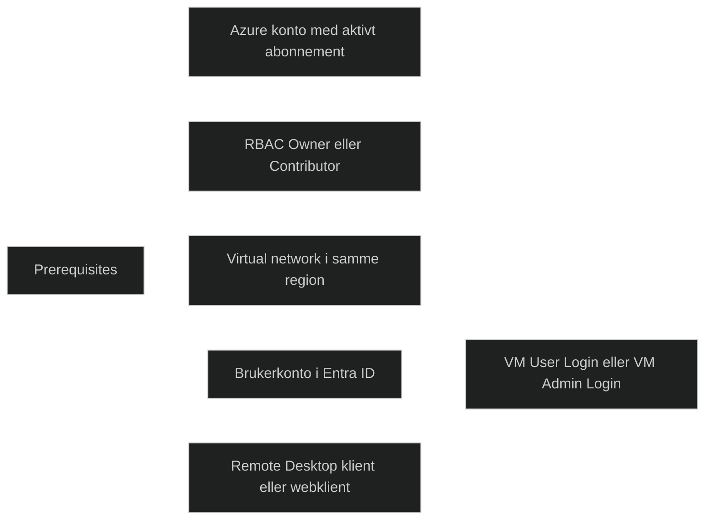

### Create a personal host pool, workspace, application group, and session host VM

Du oppretter en personlig [host pool](../../Glossary/Host-Pools.md) der hver bruker får sin egen dedikerte sesjonsmaskin. Du velger:
- region
- ressursgruppe
- image
- VM størrelse
- Entra Join

Deretter opprettes:
- workspace
- app gruppe

som publiserer et skrivebord til brukeren. Når valideringen er godkjent, opprettes alle ressursene automatisk.

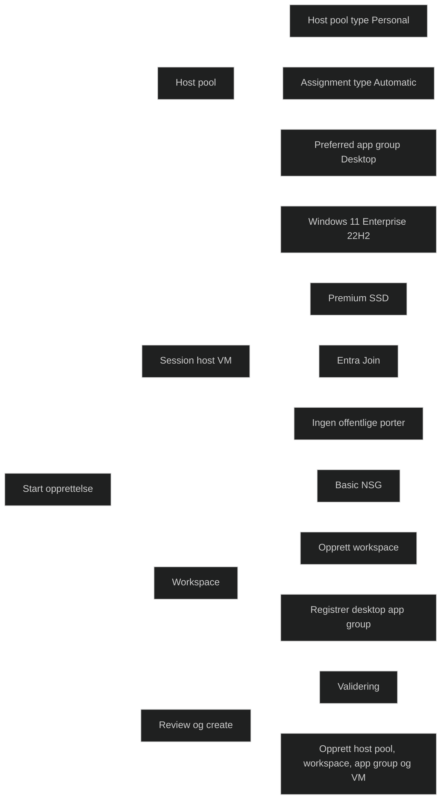

### Assign users to the application group

Når _host pool, workspace, app gruppe_ og _sesjonsmaskin_ er klare, tildeles brukere til _app gruppen_. Brukeren får automatisk en sesjonsmaskin fordi host pool er satt til automatisk tildeling. Dette gir brukeren tilgang til skrivebordet i feeden sin.

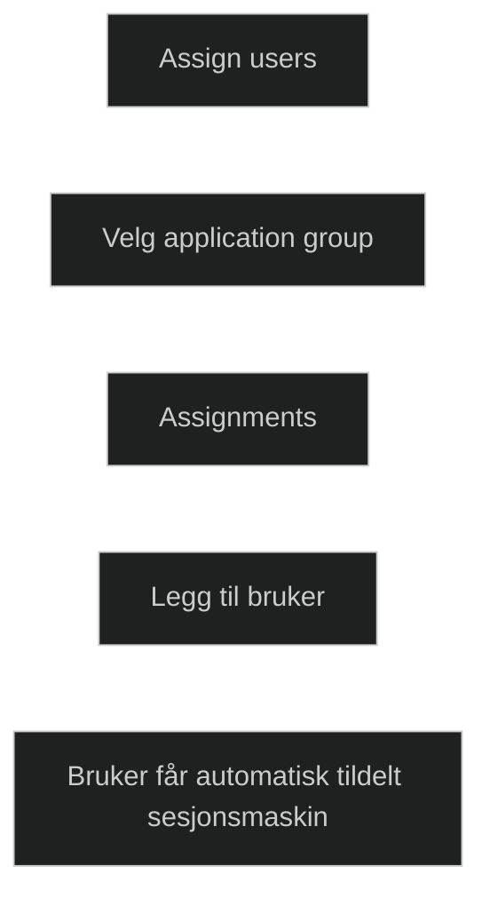

### Enable connections from Remote Desktop clients

For å støtte alle klienttyper kan du legge til i RDP egenskapen `targetisaadjoined:i:1;` i _host pool_ konfigurasjonen. Dette gjør at klienter som ikke er [Entra joined](../../Glossary/Microsoft-Entra-Join.md) kan koble seg til.

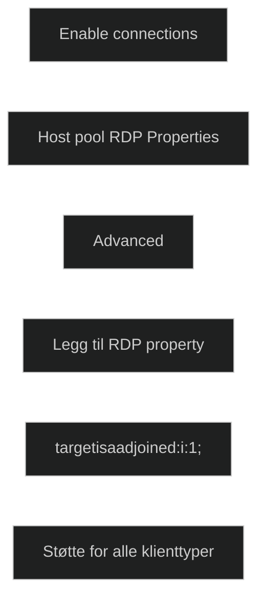

### Connect to the desktop

Brukeren kobler seg til via Windows klient, webklient eller macOS klient. Første innlogging tar lengre tid fordi profilen opprettes. Brukeren må ha _Virtual Machine User Login_ eller _Virtual Machine Administrator Login_ rolle for å få tilgang.

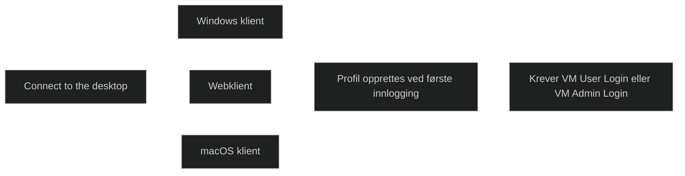

## [Administer Azure Virtual Desktop](https://learn.microsoft.com/en-us/training/modules/manage-azure-virtual-desktop/5-administer-azure-virtual-desktop/?ns-enrollment-type=learningpath&ns-enrollment-id=learn.wwl.deploy-cloud-based-tools)

[Azure CLI](https://learn.microsoft.com/en-us/cli/azure/what-is-azure-cli) 
[Azure PowerShell](https://learn.microsoft.com/en-us/powershell/azure/what-is-azure-powershell)
Azure CLI: [`az desktopvirtualization`](https://learn.microsoft.com/en-us/cli/azure/desktopvirtualization)
Azure PowerShell: [`Az.DesktopVirtualization`](https://learn.microsoft.com/en-us/powershell/module/az.desktopvirtualization)
[Azure Cloud Shell](https://learn.microsoft.com/en-us/azure/cloud-shell/overview)
Azure CLI: [How to install the Azure CLI](https://learn.microsoft.com/en-us/cli/azure/install-azure-cli)
Azure PowerShell: [Install the Azure Az PowerShell module](https://learn.microsoft.com/en-us/powershell/azure/install-az-ps)

Azure Virtual Desktop kan administreres med [Azure CLI](../../Glossary/Azure-CLI.md) og [Azure PowerShell](../../Glossary/Azure-PowerShell.md), som gir mulighet til å opprette, endre og hente informasjon om host pools, workspaces og application groups. Disse verktøyene kan brukes i Azure Cloud Shell eller installeres lokalt. 
Det er viktig å kjenne til modulene og hvordan de brukes for å hente objekt IDer, finne tilgjengelige regioner og administrere ressursene på en effektiv måte.

### Example commands

Eksemplene viser hvordan du henter tilgjengelige regioner, og hvordan du finner objekt IDer for host pools, workspaces og application groups. Disse IDene brukes når du skal automatisere eller integrere Azure Virtual Desktop i større løsninger. 

Azure CLI har ikke kommandoer for applikasjoner, bruk Azure PowerShell når dette er nødvendig i AVD.

#### Retrieve the object ID of a host pool, workspace, application group, or application
```sh
az account list-locations --query "sort_by([].{DisplayName:displayName, Location:name}, &Location)" -o table

# To retrieve the object ID of a host pool, run the following command:
az desktopvirtualization hostpool show --name <Name> --resource-group <ResourceGroupName> --query objectId --output tsv

# To retrieve the object ID of a workspace, run the following command:
az desktopvirtualization workspace show --name <Name> --resource-group <ResourceGroupName> --query objectId --output tsv

# To retrieve the object ID of an application group, run the following command:
az desktopvirtualization applicationgroup show --name <Name> --resource-group <ResourceGroupName> --query objectId --output tsv
```

## [Module assessment](https://learn.microsoft.com/en-us/training/modules/manage-azure-virtual-desktop/6-knowledge-check/?ns-enrollment-type=learningpath&ns-enrollment-id=learn.wwl.deploy-cloud-based-tools)

1. A system administrator needs to ensure optimal performance for Azure Virtual Desktop users. What load balancing option should they use to fully allocate users on one VM before moving to the next?

	Depth mode load balancing

2. A team needs to establish a multi-session Windows 11 environment that offers a comprehensive Windows experience with scalability. They also need to deploy Microsoft 365 Apps for enterprise and optimize them for multi-user virtual scenarios. Which service should they use?

	Azure Virtual Desktop

3. A system administrator is tasked with setting up a Windows 11 Enterprise desktop in Azure Virtual Desktop. They have created a personal host pool, a session host virtual machine, a workspace, and an application group. What should they do next to ensure users can access the desktop?

	They should assign users to the application group.

4. A system administrator needs to retrieve the object ID of a host pool in Azure Virtual Desktop. Which command should they use?

	`az desktopvirtualization hostpool show --name <Name> --resource-group <ResourceGroupName> --query objectId --output tsv`

## [Summary](https://learn.microsoft.com/en-us/training/modules/manage-azure-virtual-desktop/7-summary/?ns-enrollment-type=learningpath&ns-enrollment-id=learn.wwl.deploy-cloud-based-tools)

Modulen gir en samlet forståelse av hvordan AVD brukes til å levere en personlig og sikker Windows 11 opplevelse uavhengig av hvor brukeren befinner seg. Jeg har fått en forståelse for de viktigste funksjonene i AVD, hvordan tjenesten administreres og hvordan miljøet konfigureres for å gi brukerne en stabil og sikker opplevelse. Jeg har også fått innsikt i sikkerhetsmodellen og hvilke utrullingsalternativer som finnes, slik at jeg kan velge riktig løsning basert på behov. 

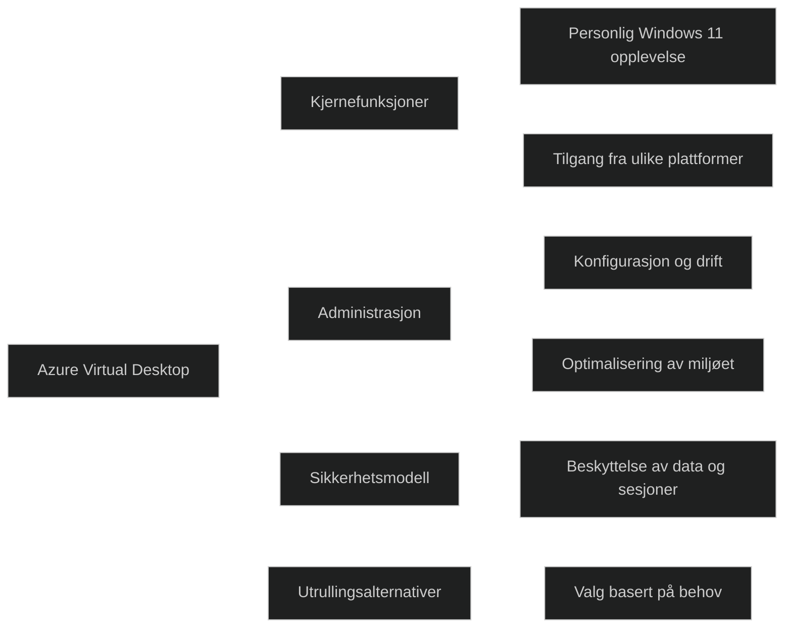