# [Manage Windows 365](https://learn.microsoft.com/en-us/training/modules/manage-windows-365/)

## [Introduction](https://learn.microsoft.com/en-us/training/modules/manage-windows-365/1-introduction/?ns-enrollment-type=learningpath&ns-enrollment-id=learn.wwl.deploy-cloud-based-tools)

_Windows 365_ gir brukere en personlig og sikker Windows 11 opplevelse som kan brukes fra hvilken som helst enhet.Løsningen kombinerer fleksibiliteten til virtuelle klienter med enkelheten fra moderne administrasjon. Den gjør det mulig å levere en fullverdig Windows klient uten behov for lokal maskinvare, og passer godt for organisasjoner som ønsker skalerbarhet, sikker tilgang og enhetlig administrasjon. 

Administrasjon av Windows 365 skjer gjennom kjente verktøy som Endpoint Manager, der admins kan konfigurere, sikre og overvåke cloud PCer på samme måte som fysiske klienter. Sikkerhetsmodellen bygger på Microsoft 365 plattformen og gir beskyttelse gjennom identitet, tilgangskontroll og moderne sikkerhetsfunksjoner.

Windows 365 tilbyr flere utrullingsalternativer og lisensmodeller som gjør det mulig å tilpasse løsningen til ulike behov, fra enkeltbrukere til store organisasjoner. Målet er å gi konsistent og sikker Windows opplevelse uavhengig av hvor brukeren befinner seg.

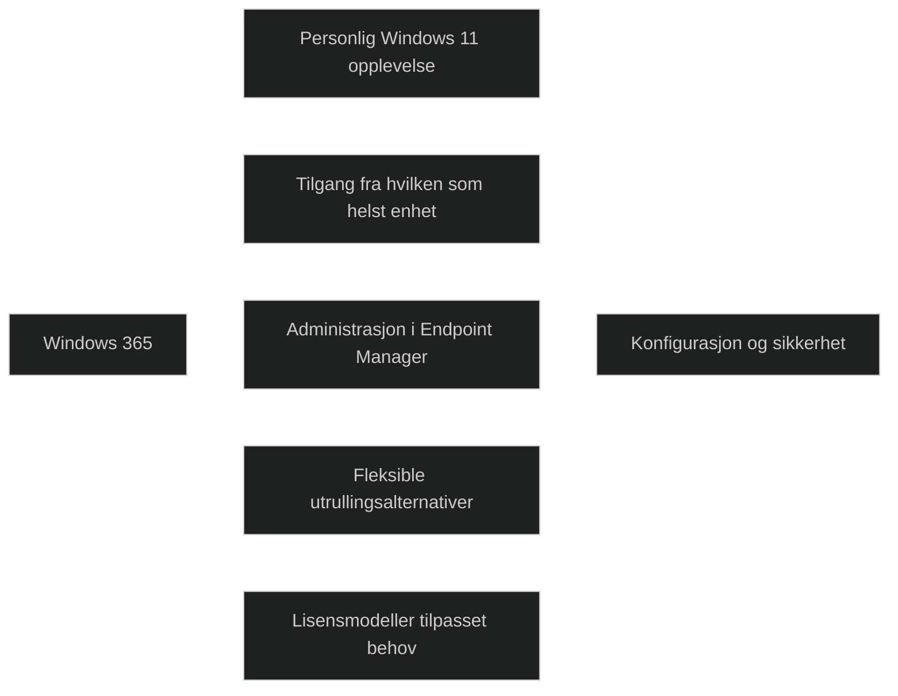

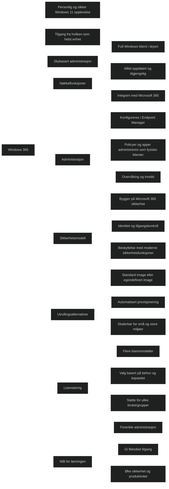

## [Explore Windows 365](https://learn.microsoft.com/en-us/training/modules/manage-windows-365/2-explore-windows-365/?ns-enrollment-type=learningpath&ns-enrollment-id=learn.wwl.deploy-cloud-based-tools)

_Windows 365_ gir hver bruker en personlig Cloud PC som kjører en full Windows opplevelse i skyen. Løsningen gir økt produktivitet, sikkerhet og fleksiblitet, og gjør det mulig å levere en komplett Windows klient uten lokal maskinvare. Cloud PCer opprettes automatisk når en _lisens tildels_, og brukeren får en dedikert virtuell maskin som kan nås fra hvilken som helst enhet.

Windows 365 er tilgjenglig i to forskjellige utgaver som dekker ulike behov i organisasjoner.

### Windows 365 Business

_Windows 365 Business_ er laget for organisasjoner med opptil 300 brukere. Det kreves ingen forhåndslisenser, og det er ingen avhengighet til Azure eller AD. Cloud PCer provisjoneres automatisk med et standard image, og administrasjonen er enkel. Brukere kan _stare, tilbakestille_ og _feilsøke_ fra Windows 365 portalen. Business støtter tilgang fra alle plattformer og gir en standard brukerrolle som kan endres ved behov.

Business har begrenset administrasjon, ingen støtte for GPO eller avansert [Intune](../../Glossary/Microsoft-Intune.md) styring, og ingen innebygd overvåkning. Sikkerhetsfunksjoner som [Conditional Access](../../Glossary/Conditional-Access.md) og [Defender](../../Glossary/Microsoft-Defender-for-Endpoint.md) krever egne lisenser.

 [Getting started with Windows 365 Business and Cloud PCs](https://learn.microsoft.com/en-us/windows-365/business/get-started-windows-365-business)

### Windows 365 Enterprise

_Windows 365 Enterprise_ er laget for store organisasjoner og støtter et ubegrenset antall brukere. Denne utgaven gir mulighet til å bruke egne images, avansert provisjonering, nettverksvalg og full Intune integrasjon. _Enterprise_ bruker [Entra ID](../../Glossary/Microsoft-Entra-ID.md) og kan også bruke AD.

_Enterprise_ gir full administrasjonskontroll, inkludert policyer, Windows Update, apper, overvåkning, feilsøking, resizing av Cloud PCer og tilgang til _on premise_ ressurser.

_Enterprise_ krever Windows Enterprise, Intune og Entra ID P1 for hver bruker.

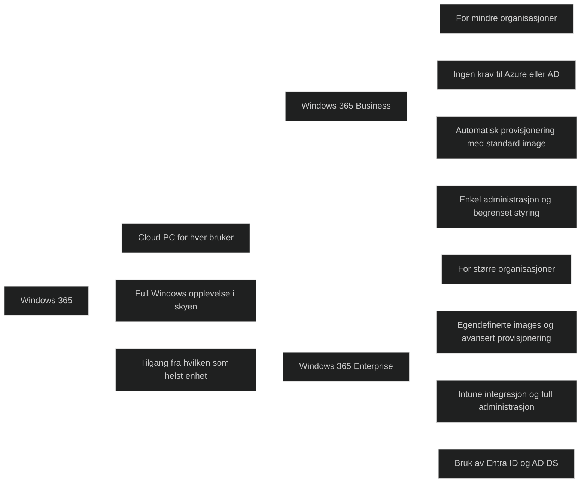

<a href="/certs/diagrams/deploy-w365-diff.html" target="_blank" rel="noopener">Stort diagram</a>

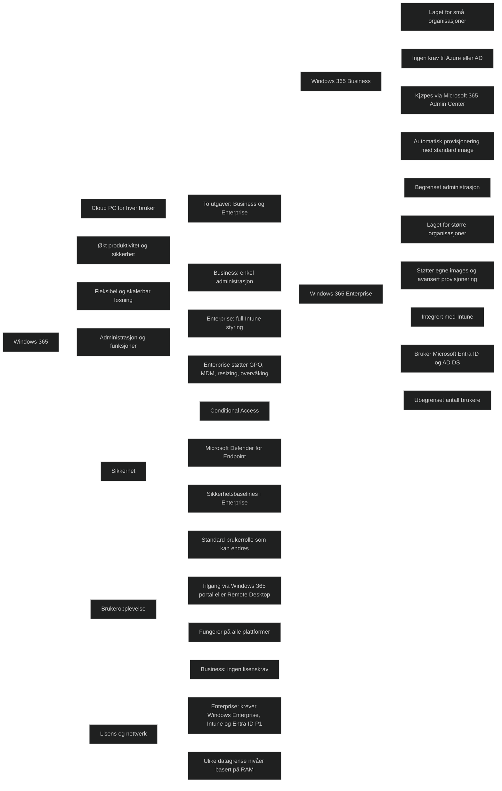

<a href="/certs/diagrams/deploy-w365.html" target="_blank" rel="noopener">Stort diagram</a>

## [Configure Windows 365](https://learn.microsoft.com/en-us/training/modules/manage-windows-365/3-configure-windows-365/?ns-enrollment-type=learningpath&ns-enrollment-id=learn.wwl.deploy-cloud-based-tools)

Konfigurasjonen skjer i Intune og består av fire hovedoppgaver: 
1. tildele lisenser
2. opprette Azure nettverkstilkobling
3. velge / last opp image
4. opprette provisjoneringspolicyer

Når dette er på plass, behandles Cloud PCer som vanlige enheter og kan administreres med de samme profilene og appdistribusjonene som fysiske klienter.

### Assign licenses to users

Brukere må tildeles en Windows 365 lisens før de kan få en Cloud PC. Lisenser kan tildes enkeltbrukere eller grupper. Når lisensen er aktiv, kan brukeren provisjoneres automatisk.

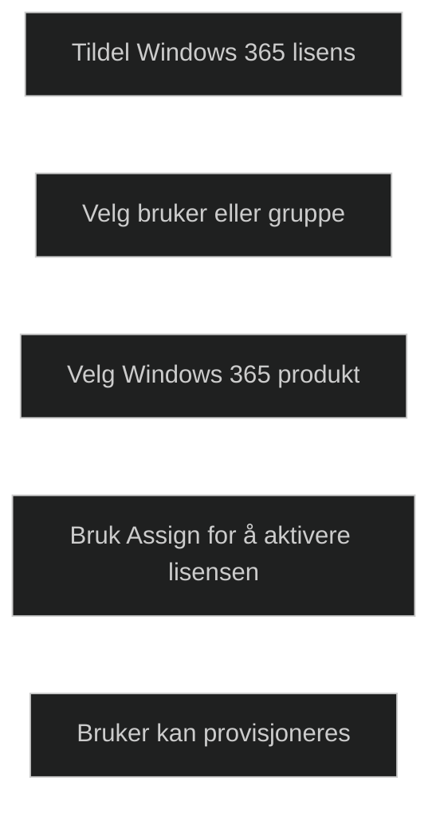

### Create an Azure network connection

[Azure network connection (ANC)](../../Glossary/Azure-network-connection.md) brukes når Cloud PCer skal kobles til organisasjonens domene og få tilgang til lokale ressurser. Dette krever et virtuelt nettverk i Azure med forbindelse til DC. Oppsettet inkluderer valg av abo, ressursgruppe, nettverk, subnet, og domenekonto.

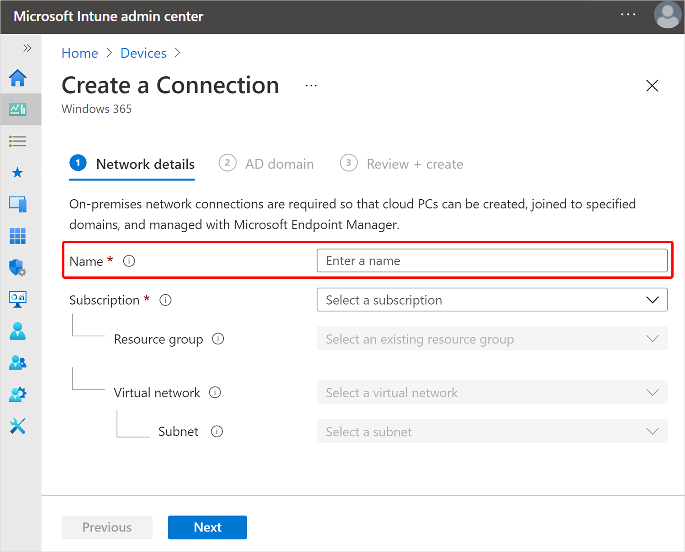

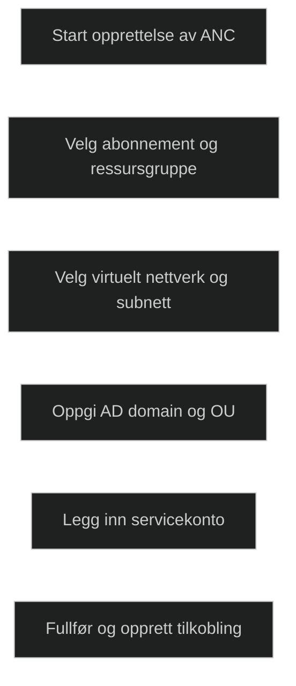

[Create Azure network connection](https://learn.microsoft.com/en-us/windows-365/enterprise/create-azure-network-connection)
[Edit Azure network connection](https://learn.microsoft.com/en-us/windows-365/enterprise/edit-azure-network-connection)
[Delete Azure network connection](https://learn.microsoft.com/en-us/windows-365/enterprise/delete-azure-network-connection)

### Configure a custom device image (optional)

Windows 365 tilbyr ferdige images som oppdateres månedlig. Disse inkluderer optimaliseringer og evt Microsoft 365 apps. Organisasjoner som trenger egne tilpasninger kan laste opp inntil 20 egendefinerte images i Azure og bruke dem i provisjoneringspolicyer.

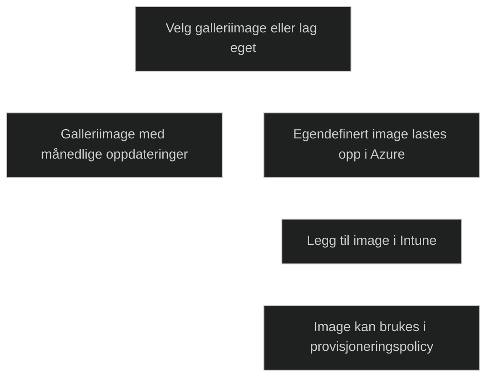

1. [Add or delete custom device images](https://learn.microsoft.com/en-us/windows-365/enterprise/add-device-images)

### Create provisioning policies

Provisjoneringspolicyer bestemmer hvordan Cloud PCer opprettes. Policyen definerer netterkstilkobling, image og hvilke grupper som skal få Cloud PCer. Når policyen er aktiv opprettes Cloud PCer automatisk for brukere med gyldig lisens.

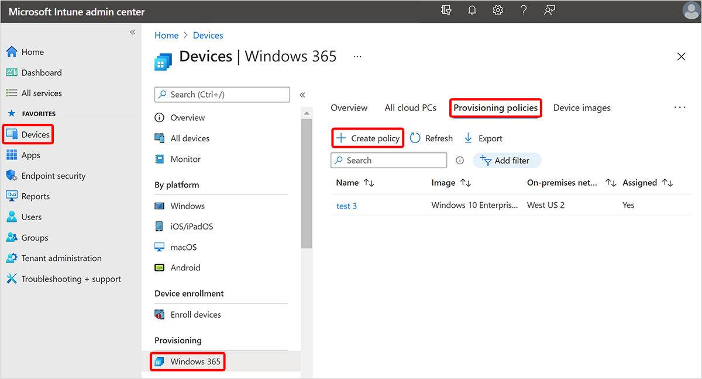

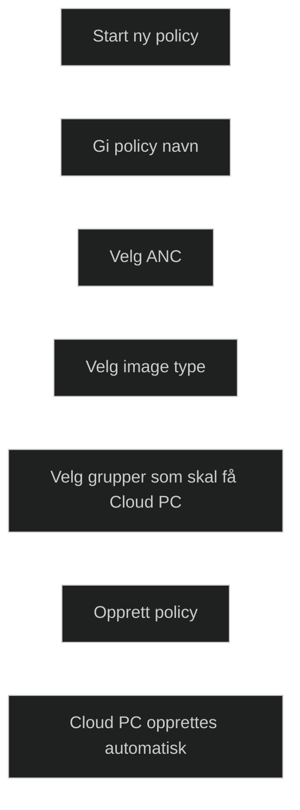

1. [Create provisioning policies](https://learn.microsoft.com/en-us/windows-365/enterprise/create-provisioning-policy)

### Configure and apply device and app configuration profiles

Når en Cloud PC er provisjonert, administreres de som fysiske enheter. Intune profiler, apper og policyer kan brukes på samme måte som ellers. Dette gir en enhetlig administrasjonsmodell for både fysiske og virtuelle klienter.

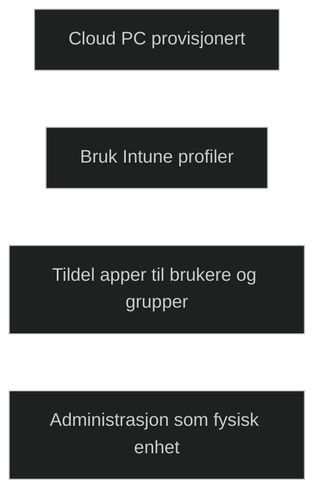

### Business vs Enterprise

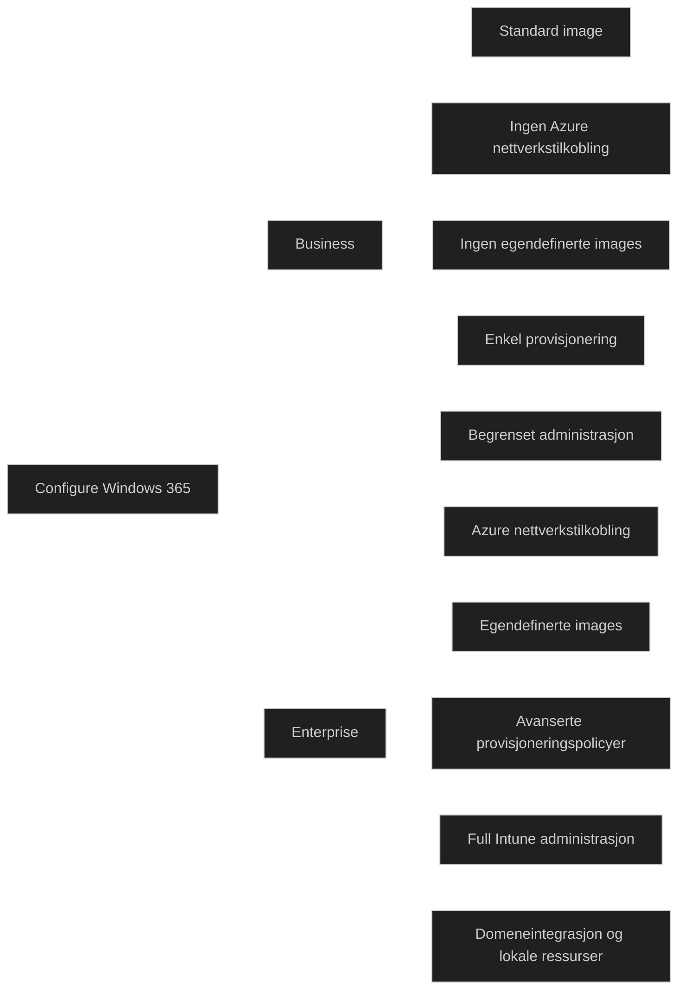

## [Administer Windows 365](https://learn.microsoft.com/en-us/training/modules/manage-windows-365/4-administer-windows-365/?ns-enrollment-type=learningpath&ns-enrollment-id=learn.wwl.deploy-cloud-based-tools)

Dette gjelder i praksis _Enterprise_, da administrasjon skjer gjennom Intune. _Business_ har ikke full Intune integrasjon og støtter derfor ikke de fleste handlingene som beskrives her.

Cloud PCer administreres som vanlige enheter, og admin kan bruke profiler, apper, oppdateringer og sikkerhetspolicyer på samme måte som på fysiske enheter. Cloud PCer har i tillegg tre unike handlinger:
- reprovisioning
- Resize
- Collect diagnostic

### Remote actions

Cloud PCer støtter vanlige fjernhandliger som restart, sync, rename, quick scan, full scan og Defender oppdatering. I tillegg har de tre som er spesifikke for Cloud PCer; reprovisioning, resize og collect diagnostics. Disse handlingene krever Intune administrasjon og er derfor knyttet til Enterprise.

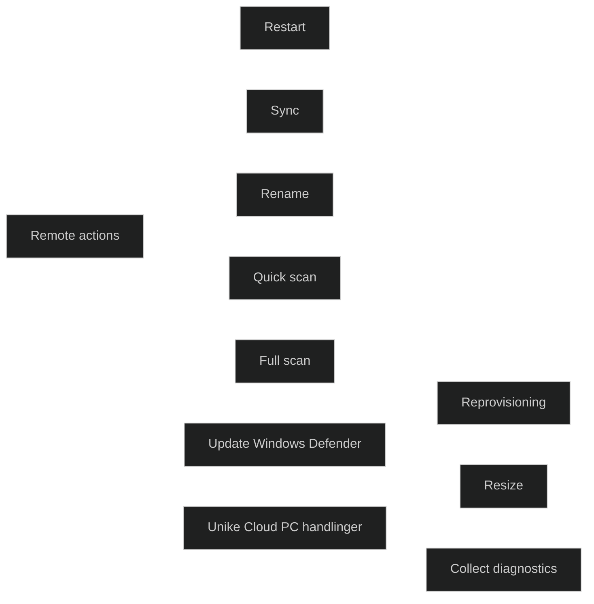

### Reprovisioning

_Reprovisioning_ oppretter en helt ny Cloud PC basert på provisjoneringspolicyen. Dette brukes når en Cloud PC oppfører seg uforutsigbart eller når en ren start er nødvendig. Brukeren må sikre egne data da prosessen ikke beholder apper eller filer.

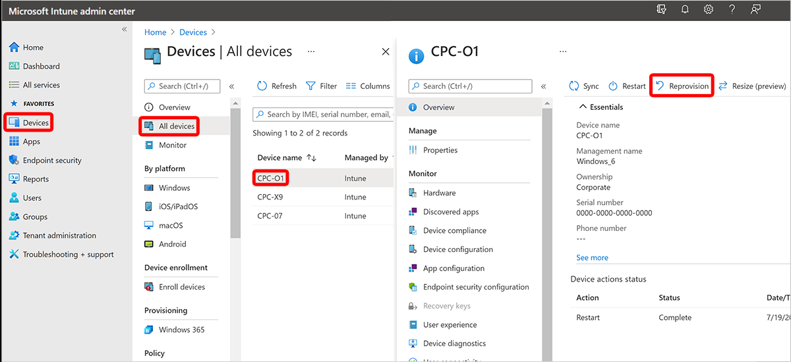

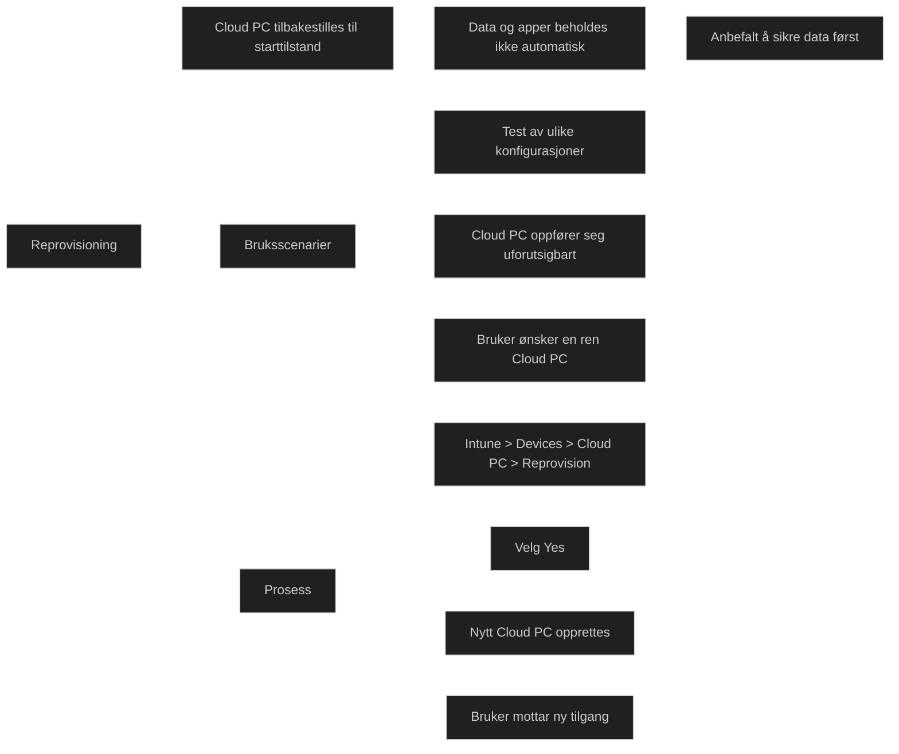

### Resize a Cloud PC

_Resize gjør det mulig å oppgradere RAM, CPU og lagringsplass_. Det er kun mulig å øke lagringsstørrelsen. Handlingen krever riktige roller, tilgjengelige lisenser og at brukeren er logget ut. 

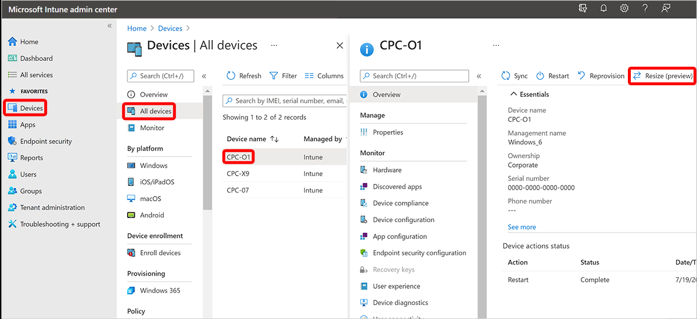

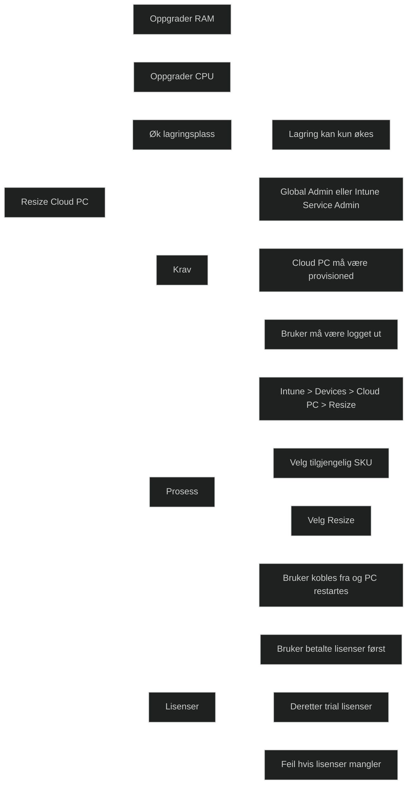

[Device management overview for Cloud PCs](https://learn.microsoft.com/en-us/windows-365/enterprise/device-management-overview)

## [Module assessment](https://learn.microsoft.com/en-us/training/modules/manage-windows-365/5-knowledge-check/?ns-enrollment-type=learningpath&ns-enrollment-id=learn.wwl.deploy-cloud-based-tools)

1. Which Windows 365 feature enables users to securely access their Cloud PC from any device with an internet connection and a compatible web browser?

	Remote Desktop Web Access

2. Which of the following features is exclusive to Windows 365 Enterprise and unavailable in Windows 365 Business?

	Custom Cloud PCs

3. Contoso is interested in deploying Windows as virtual sessions. The company has 150 users, and it wants a solution that provides ready-to-use Cloud PCs with simple management options. It doesn't want any licensing prerequisites or any dependencies on Active Directory. Given these requirements, which of the following solutions should Contoso use?

	Windows 365 Business

## [Summary](https://learn.microsoft.com/en-us/training/modules/manage-windows-365/6-summary/?ns-enrollment-type=learningpath&ns-enrollment-id=learn.wwl.deploy-cloud-based-tools)

Modulen gir en samlet forståelse av hvordan Windows 365 brukes til å levere en personlig og sikker Windows 11 opplevelse uavhengig av hvor brukeren befinner seg eller hvilken plattform som brukes. Løsningen gjør det mulig å standardisere administrasjon, styrke sikkerhet og gi fleksibel tilgang til en fullverdig Windows klient i skyen.

Jeg har fått innsikt i de viktigste funksjonene i Windows 365 og hvordan de bidrar til en enklere og mer forutsigbar administrasjon. Modulen viser hvordan tjenesten settes opp, administreres og sikres, og hvordan Cloud PCer kan tilpasses ulike organisatoriske behov.

Jeg har blitt kjent med ulike utrullingsmetoder og hvordan lisensmodellen påvirker valg av løsning. Samlet gir dette et helhetlig grunnlag for å administrere og optimalisere Windows 365 i en moderne endepunktadministrasjon.

