# [Plan a transition to modern endpoint management](https://learn.microsoft.com/en-us/training/modules/plan-transition-modern-endpoint-management/)

## [Introduction](https://learn.microsoft.com/en-us/training/modules/plan-transition-modern-endpoint-management/1-introduction/?ns-enrollment-type=learningpath&ns-enrollment-id=learn.wwl.deploy-cloud-based-tools)

Organisasjoner som moderniserer klientmiljøet sitt trenger løsninger som gir effektiv og sikker administrasjon. [Autopilot](../../Glossary/Windows-Autopilot.md) og [Co management](../../Glossary/Co-Management.md) gjør det mulig å forenkle utrulling og drift ved å kombinerer skybasert administrasjon med eksisterende verktløy. _Autopilot_ gir en strømlinjeformet måte å klaregjøre nye klienter på, mens _co management_ gjør det mulig å flytte arbeidsbelastninger gradvis fra _Configuration Manager_ til [Intune](../../Glossary/Microsoft-Intune.md).

Modulen beskriver hvordan [Entra Join](../../Glossary/Microsoft-Entra-Join.md) kan brukes i ulike scenarier, hvilke arbeidsbelasninger som egner seg for overgang til _Intune_, og hvilke krav som må være oppfylt for _co management_. Den forklarer også hvordan man planlegger en overgang til moderne administrasjon ved å bruke eksisterende og nye teknologier. Målet er å gi et grunnlag for å kunne planlegge en vellykket migrering eller utrullingsstrategi i et moderne klientmiljø.

## [Explore using co-management to transition to modern endpoint management](https://learn.microsoft.com/en-us/training/modules/plan-transition-modern-endpoint-management/2-explore-co-management-transition/?ns-enrollment-type=learningpath&ns-enrollment-id=learn.wwl.deploy-cloud-based-tools)

_Co management_ gjør det mulig å kombinere ConfigMgr og _Intune_ slik at organisasjoner kan gå gradvis over til moderne administrasjon. Løsningen er spesielt nyttig i miljøer som fortsatt bruker AD og ConfigMgr, men som ønsker å ta i bruk skybaserte funksjoner uten å gjøre en full overgang på en gang.

Ved å bruke [Entra Hybrid Join](../../Glossary/Entra-Hybrid-Joined.md) kan klienter få tilgang til både lokale og skybaserte ressurser med enkel pålogging. [Conditional Access](../../Glossary/Conditional-Access.md) kan brukes for å sikre at tilgang til tjenester som SharePoint Online og Exchange Online styres av automatiske regler. _Intune_ gir en mer strømlinjeformet måte å administrere innstillinger, sikkerhet og apper på, mens _GPO_ gir mer detaljert kontroll. _Co management_ gjør det mulig å flytte arbeidsbelastninger fra GPO og ConfigMgr til Intune.

En anbefalt tilnærming er å starte pilotgrupper, gjerne i IT avdelingen, og deretter utvide til resten av organisasjonen når løsningen fungerer som forventet.

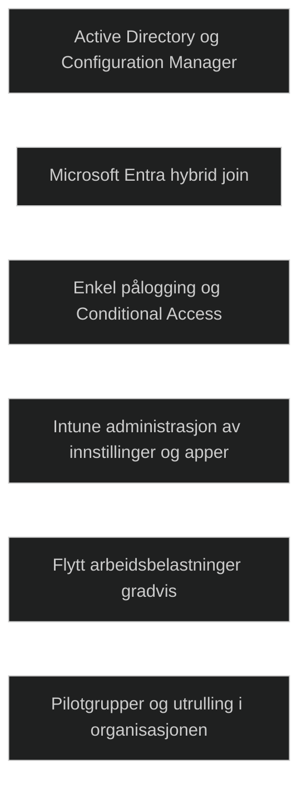

## [Examine prerequisites for co-management](https://learn.microsoft.com/en-us/training/modules/plan-transition-modern-endpoint-management/3-examine-prerequisites-for-co-management/?ns-enrollment-type=learningpath&ns-enrollment-id=learn.wwl.deploy-cloud-based-tools)

For å bruke [Co management](../../Glossary/Co-Management.md) må klienter være [Entra Joined](../../Glossary/Microsoft-Entra-Join.md). Det krever oppdatert [Entra Connect](../../Glossary/Entra-Connect.md), riktig konfigurert synk av klientobjekter og at aktuelle OUer er inkludert i synkroniseringen. [Intune](../../Glossary/Microsoft-Intune.md) må være satt opp for automatisk registrering, og klientene må være AD joined med minst Windows 10 v1709, helst siste versjon.

[Entra](../../Glossary/Microsoft-Entra-ID.md) automatisk registrering må være aktivert, men kan styres slik at ikke alle klienter registreres samtidig. Dette er spesielt viktig i en pilotfase. Dette kan kontrolleres med GPO, eller i ConfigMgr ved å bruke innstillingen _Register domain joined computers as devices_. En GPO kan brukes for å deaktivere automatisk registrering for alle, og en annen en til å aktivere for en pilotgruppe, enten via kobling til en bestemt OU eller via sikkerhetsfiltrering. Når klientene er registrert, kan _Intune_ bruke verktøy som _factory reset_, _select wipe_, _delete_ og _fresh start_. 

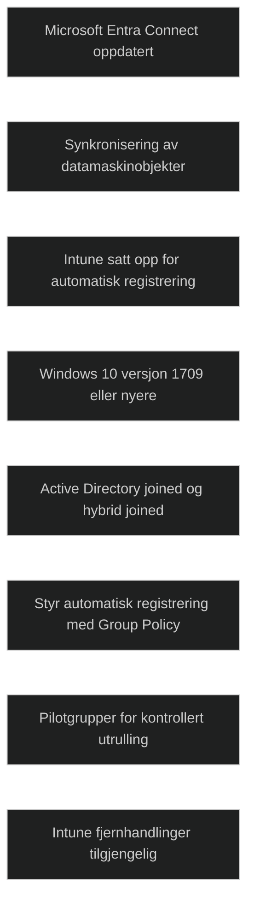

### Transition workloads to Intune

Når forberedelsene er gjort og klientene er klar for _co management_, må det bestemmes hvilke handlinger som skal flyttes til _Intune_. Før en handling flyttes, må tilsvarende konfigurasjon være satt opp og distribuert i _Intune_, slik at en løsning til enhver tid har ansvar for hver handling.

Arbeidsbelastninger som kan flyttes inkluderer blant annet

- Resource access policies
    
    - Email profile
    - Wi-Fi profile
    - VPN profile
    - Certificate profile
- Windows Update policies
- Endpoint Protection
    - Microsoft Defender Antivirus
    - Microsoft Defender Application Guard
    - Windows Defender Firewall
    - Microsoft Defender SmartScreen
    - Windows Encryption
    - Microsoft Defender Exploit Guard
    - Windows Defender Application Control
    - Microsoft Defender for Endpoint
    - Windows Information Protection
- Device Configuration
    - Device Configuration is essentially the settings you configure using Group Policy.
- Microsoft 365 Select-to-Run apps
    - Once the workload has been moved, the app will appear in the Company Portal on the device.

Anbefalt tilnærming er å starte med enkle konfigurasjoner og pilotklienter før større utrulling.

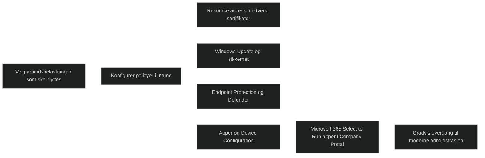

<a href="/certs/diagrams/deploy-transition.html" target="_blank" rel="noopener">Stort diagram</a>

## [Evaluate modern management considerations](https://learn.microsoft.com/en-us/training/modules/plan-transition-modern-endpoint-management/4-evaluate-modern-management-considerations/?ns-enrollment-type=learningpath&ns-enrollment-id=learn.wwl.deploy-cloud-based-tools)

Moderne utrullingsmetoder endrer det eksisterende OSet i stedet for å erstatte det med et nytt image. Dette gir raskere prosesser, mindre nettverkstrafikk og krever lite eller ingen brukerinteraksjon.
Når Windows 11 allerede er installert, finnes det få grunner til å bruke imaging, selv på nye klienter. Moderne metoder kan fjerne forhåndsinstallerte programmer, oppgradere utgaver, koble klienter til AD / Entra ID og registrere dem i MDM for videre tilpasning. 
Dette gjør det mulig å standardisere og konfigurere klienter uten å bygge og vedlikeholde egne images.

### Modern transition considerations

Når organisasjoner vurderer overgang til moderne administrasjon, må de sammenligne kravene til MDT, ConfigMgr og Autopilot. De to førstnevnte krever golden images og brukes til _bare metal_ scenarier, mens Autopilot ikke krever imaging og kan tilbakestille eksisterende installasjoner. Alle tre kan installere apper under utrulling, men bare ConfigMgr og Autopilot kan installere apper etterpå. 
Brukerdata kan migreres med [User-State-Migration-Tool](../../Glossary/User-State-Migration-Tool.md) eller OneDrive, og alle metodene støtter _in place upgrade_. 
Etter vurdering av kravene finnes det to veier videre: enten migrere eksisterende teknologier gradvis eller ta i bruk moderne metoder fra starten av .

Moderne metoder er foretrukket, men imaging er fortsatt nødvendig i situasjoner som maskinvarefeil, komplekse applikasjonsavhengigheter eller når klienten ikke kan starte Windows.
I slike tilfeller må tradisjonelle metoder brukes for å få klienten tilbake i drift.

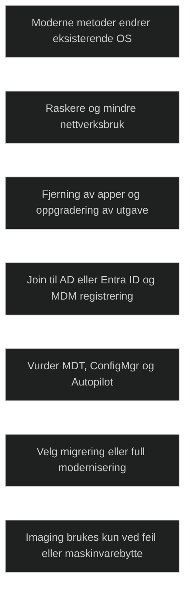

## [Evaluate upgrades and migrations in modern transitioning](https://learn.microsoft.com/en-us/training/modules/plan-transition-modern-endpoint-management/5-evaluate-upgrades-migrations-modern-transitioning/?ns-enrollment-type=learningpath&ns-enrollment-id=learn.wwl.deploy-cloud-based-tools)

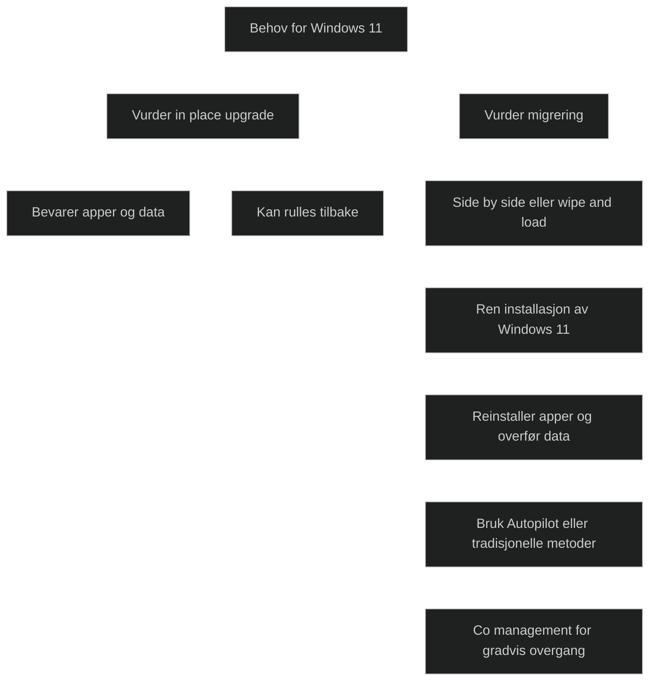

Migrering følger samme prosess som utrulling av en ny klient, men krever at brukerdata og innstillinger bevares. Migrering brukes når en klient skal byttes ut, når en eldre Windows versjon ikke kan oppgraderes direkte til Windows 11 eller når en ren installasjon er nødvendig for å løse ytelsesproblemer eller fjerne uønskede apper og konfigurasjon.

To metoder kan brukes: [Side by side](../../Glossary/Side-by-side-migration.md) og [Wipe and load](../../Glossary/Wipe-and-load-migration.md). _Side by side_ bruker to ulike klienter, mens _wipe and load_ bruker samme klient som både kilde og mål. Begge krever ren installasjon av Windows 11. Migrering innebærer risiko for tap av data dersom noe ikke blir identifisert eller overført riktig, og prosessen kan ikke rulles tilbake.

En _in-place upgrade_ bevarer apper, data og innstillinger, og kan rulles tilbake ved behov. Den gir raskere overgang og mindre risiko, men støttes bare når oppgraderingsstien er gyldig. Migrering gir et standardisert miljø, men krever reinstallasjon av apper og overføring av data. 

Når målet er Windows 11, kan moderne metoder som Autopilot brukes både for nye og eksisterende klienter som skal bygges opp på nytt. _Co management_ kan brukes for å flytte handlinger gradvis over til _Intune_, og _Autopilot grupper_ kan brukes til å teste hvordan arbeidsbelastninger fungerer når de flyttes fra ConfigMgr til Intune.

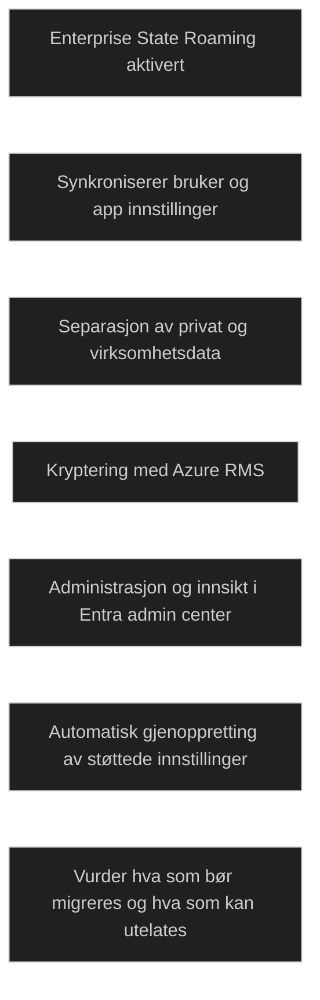

### In-place upgrades

_In-place upgrade_ gjør det mulig å oppgradere eksisterende klienter til Windows 11 samtidig som apper, data og innstillinger beholdes. Metoden kan rulles tilbake dersom noe går galt. Autopilot kan brukes for å modernisere eldre klienter og gjøre dem _Entra styrt_, eller for å bygge nye klienter fra en ren Windows 11 installasjon.

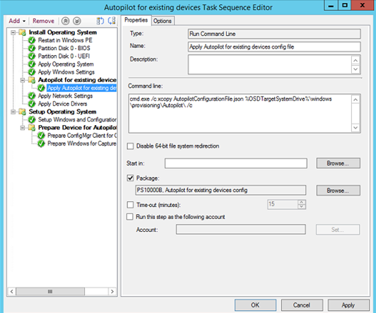

_In-place upgrade_ er effektiv når oppgraderingsstien er støttet, og når målet er å modernisere klienter uten å miste brukerdata. _Co management_ kan brukes for å flytte arbeidsbelastninger gradvis til _Intune_, og _Autopilot grupper_ kan brukes til å teste hvordan arbeidsbelastninger fungerer når de flyttes fra ConfigMgr til Intune.

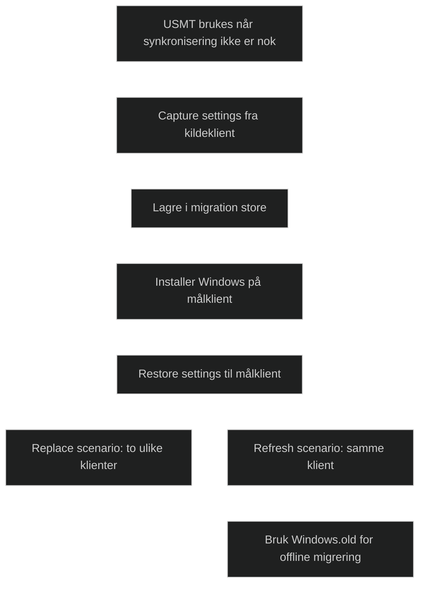

## [Migrate data when modern transitioning](https://learn.microsoft.com/en-us/training/modules/plan-transition-modern-endpoint-management/6-migrate-data-when-modern-transitioning/?ns-enrollment-type=learningpath&ns-enrollment-id=learn.wwl.deploy-cloud-based-tools)

### Synchronize the user state

[Enterprise State Roaming (ESR)](../../Glossary/Enterprise-State-Roaming.md) gjør det mulig å synkronisere brukerinnstillinger og appinnstillinger på en sikker måte. Data krypteres før den forlater klienten og lagres kryptert i skyen. Løsningen skiller mellom privat og virksomhetsdata og gir oversikt i _Entra admin center_ over hvem som synkroniserer og på hvilke klienter. Når en bruker logger inn på en ny klient, gjenopprettes støttede innstillinger automatisk, slik som språkvalg, passord, Edge innstillinger og UWP apper. Det anbefales å migrere nødvendige innstillinger, men unngå å ta med utdatert eller unødvendig data. ESR synkroniserer ikke innstillinger for klassiske desktop apper, og enkelte enkle konfigurasjoner kan være viktige å ta med for å unngå feil etter migrering.

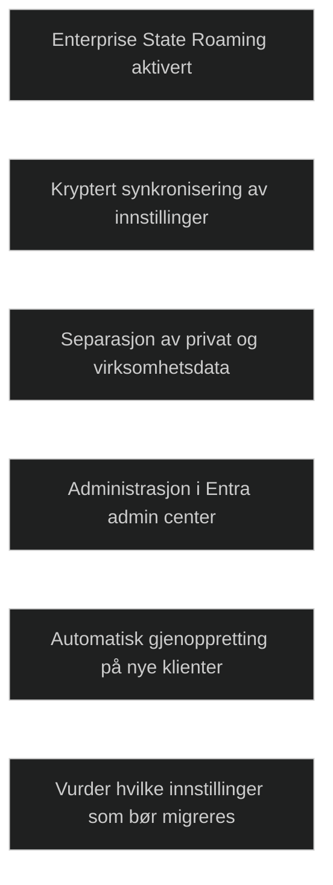

### Migrate the user state
 
Når synkronisering ikke er nok, brukes [User State Migration Tool (USMT)](../../Glossary/User-State-Migration-Tool.md) for å flytte filer og innstillinger. Prosessen består av å fange data fra kildeklienten og lagre det i en _migration store_, og deretter gjenopprette data på målklienten etter installasjon av Windows. I _replace scenario_ brukes det to ulike klienter, mens i _refresh scenario_ brukes samme klient og lagrer data midlertidig før en ren installasjon. _Windows.old_ kan brukes for _offline_ migrering når en støttet Windows versjon oppgraderes.

[Known Folder Move (KFM)](../../Glossary/Known-Folder-Move.md) gjør det mulig å flytte Dokumenter, Bilder og Skrivebord til OneDrive gjennom GPO. Dette gir en moderne filhåndtering og reduserer behovet for _roaming profile_. Det finnes begrensninger, som konflikter med eksisterende _Folder Redirection_ og enkelte filtyper som ikke støttes.

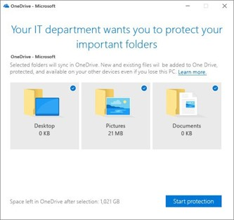

_Configuration Manager_ kan integrere USMT ved hjelp av _USMT pakker, State Migration Points_ og _task sequences_. USMT maler som _MigApp, MigDocs, MigUser_ og _ConfigMgr_ styrer hvilke data som fanges opp og gjenopprettes.

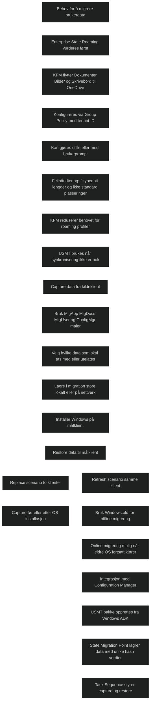

## [Migrate workloads when modern transitioning](https://learn.microsoft.com/en-us/training/modules/plan-transition-modern-endpoint-management/7-migrate-workloads-when-modern-transitioning/?ns-enrollment-type=learningpath&ns-enrollment-id=learn.wwl.deploy-cloud-based-tools)

### Migrate client management to Intune

Når klienter er flyttet bort fra eldre Windows versjoner, kan organisasjoner vurdere å gå helt over til skybasert administrasjon. Dette reduserer behovet for lokal infrastruktur og forenkler drift. Intune passer særlig godt når Autopilot dekker utrullingsbehovene, applikasjonene er moderne og enkle å installere, og det ikke finnes mange komplekse eller eldre applikasjoner. Mindre organiasjoner kan ofte gå direkte til full skyadministrasjon når serveradministrasjon kan håndteres av andre verktøy som _Windows Admin Center_. 

### Choose workloads within Endpoint Manager

Større organisasjoner kan ha behov for å beholde ConfigMgr på grunn av komplekse miljøer, mange eldre applikasjoner eller omfattende eksisterende konfigurasjoner. Selv om Intune kan dekke de fleste behov, kan migrering av store mengder applikasjonspakker og policyer være tidkrevende. Arbeidsbelastninger bør derfor bare flyttes når det gir tydelig verdi. Et vanlig eksempel er OS utrulling, der Autopilot kan erstatte tidkrevende imagehåndtering. Nye og enkle apper kan distribueres via Intune, mens komplekse apper fortsatt kan håndteres av ConfigMgr. Endpoint Manager konsollen gir et samlet admingrensesnitt uavhengig av hvilken teknologi som brukes.

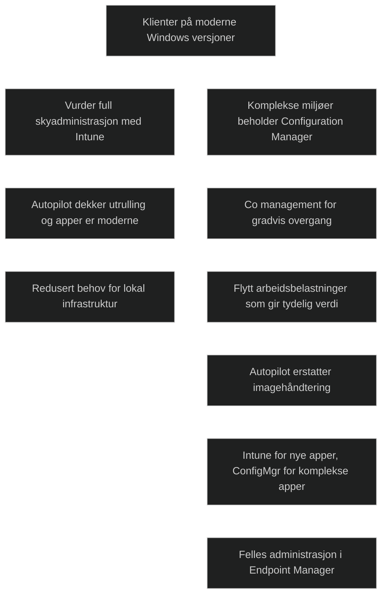

## [Module assessment](https://learn.microsoft.com/en-us/training/modules/plan-transition-modern-endpoint-management/8-knowledge-check/?ns-enrollment-type=learningpath&ns-enrollment-id=learn.wwl.deploy-cloud-based-tools)

1. Wingtip Toys is a small wholesaler specializing in children's toys and games. As the Desktop Administrator, Alan Deyoung has successfully migrated all client devices from older operating system versions to Windows 11. Alan is now deciding what method of client management the company should employ. As part of that process, Alan has analyzed its existing IT environment and come to the following conclusions: Wingtip's applications are modern and relatively simple installs. The OS configuration capabilities provided by Autopilot meet its deployment needs. It doesn't have an excessive number of existing legacy applications. Its existing configuration management deployment is relatively simple. Based on these findings, what method of client management should Alan recommend?

	Moving completely to cloud-based management using Intune

2. Northwind Traders wants its Microsoft Entra users to securely synchronize their user settings and application settings data to the cloud. By doing so, Northwind's users have a unified experience across their Windows devices, and the time needed for configuring a new device will be reduced. What synchronization tool should Northwind use that sync's its users' settings across Microsoft Entra joined devices?

	Enterprise State Roaming (ESR)

## [Summary](https://learn.microsoft.com/en-us/training/modules/plan-transition-modern-endpoint-management/9-summary/?ns-enrollment-type=learningpath&ns-enrollment-id=learn.wwl.deploy-cloud-based-tools)

Overgangen til moderne administrasjon er en gradvis prosess som krever at organisasjoner vurderer eksisterende infrastruktur, behov og mål. _Co management_ gjør det mulig for miljøer som bruker Configuration Manager å beholde eksisterende investeringer samtidig som enkelte arbeidsbelastninger flyttes til Intune. Dette gir fleksibilitet og gjør det mulig å modernisere i eget tempo uten å måtte flytte alt til skyen samtidig.

Moderne administrasjon innebærer også å vurdere hvordan brukerdata skal håndteres. Løsninger som _Known Folder Move_ kan flytte viktige brukerfiler til skyen og redusere behovet for tradisjonelle metoder som roaming profiler. Målet er å kombinere moderne utrulling, moderne administrasjon og moderne datalagring for å skape en enklere og mer robust klientplattform.

Organisasjoner bør velge den tilnærmingen som passer best for egne krav. Det viktigste er å forstå hvilke arbeidsbelastninger som kan flyttes, hvilke som bør beholdes lokalt, og hvordan data og innstillinger kan migreres på en trygg måte. Overgangen handler ikke om å velge alt eller ingenting, men om å bygge en fleksibel og fremtidsrettet administrasjonsmodell.

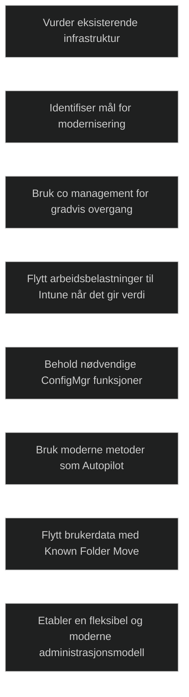