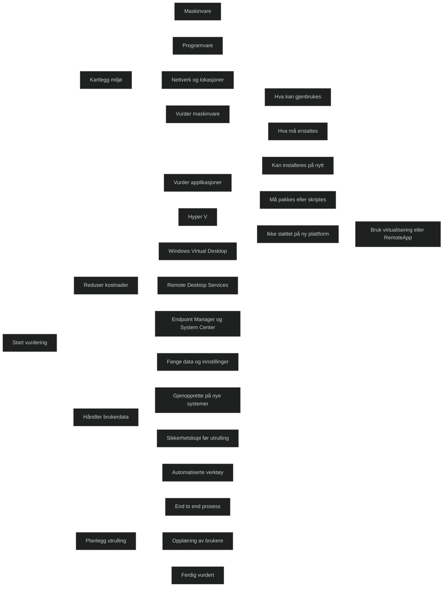
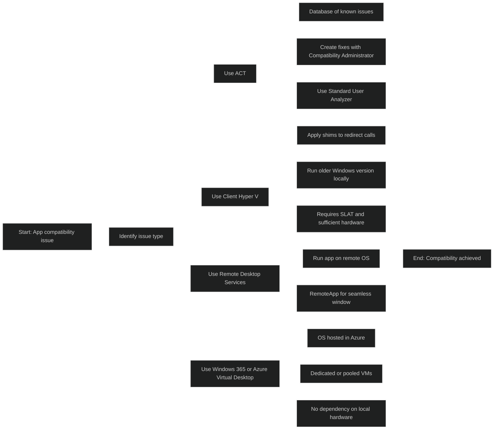
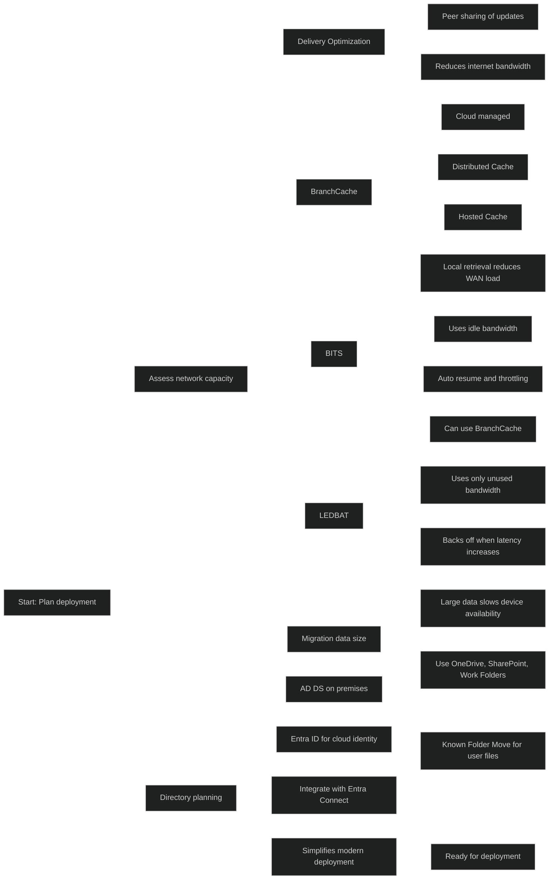

# Assess deployment readiness

## [Introduction](https://learn.microsoft.com/en-us/training/modules/deployment-readiness/1-introduction/?ns-enrollment-type=learningpath&ns-enrollment-id=learn.wwl.deploy-on-premise-based-tools)

Når jeg går inn i denne delen, får jeg først en forståelse av hvorfor en strukturert og automatisert utrulling av Windows klienter er viktig i en organisasjon. Poenget er å skape en mer forutsigbar og kostnadseffektiv drift, der maskinparken kan administreres på en trygg og konsistent måte. For å få dette til må jeg ha oversikt over dagens miljø og vite hvilke komponenter som kan beholdes, oppgraderes eller må erstattes.
## [Examine deployment guidelines](https://learn.microsoft.com/en-us/training/modules/deployment-readiness/2-examine-deployment-guidelines/?ns-enrollment-type=learningpath&ns-enrollment-id=learn.wwl.deploy-on-premise-based-tools)

Dette temaet beskriver hva som må være på plass før en organisasjon kan gjennomføre en vellykket utrulling av Windows klienter. Målet er å sikre at maskinvare, software og brukerdata håndteres på en strukturert måte slik at utrullingen blir stabil, forutsigbar og kostnadseffektiv.

Jeg må kunne vurdere dagens miljø ved å kartlegge maskinvare, software og nettverk på tvers av hovedkontor, avdelinger og andre lokasjoner. Det må identifiseres hvilke maskiner som kan gjenbrukes, og hvilke som må erstattes basert på kravene i OSet.

Jeg må kunne vurdere hvilke programmer som kan installeres på nytt, og hvilke som må pakkes eller skriptes for å sikre en rask og konsistent installasjon uten behov for brukerhandling. Hvis enkelte programmer ikke støttes på den nye plattformen, må jeg kjenne til alternativer som virtualisering eller [RemoteApp](../../Glossary/RemoteApp.md).

Jeg skal forstå hvordan teknologier som _Hyper V_, _Windows Virtual Desktop_, _Remote Desktop Services_, _Endpoint Manager_, og _System Center_ kan redusere kostnader ved å forenkle drift og utrulling gjennom virtualisering.

Jeg må kunne beskrive hvordan brukerdata og innstillinger fanges opp og gjennopprettes på nye systemer, og hvorfor dette er viktig for en trygg overgang. Det innebærer også å ha en metode for backup før utrulling.

Til slutt skal jeg kunne forklare hvordan en helhetlig utrullingsprosess planlegges, med bruk av automatiserte verktøy og god opplæring av brukere for å redusere feil og støttebehov etter utrulling.

<a href="/certs/diagrams/deploy-process.html" target="_blank" rel="noopener">Stort diagram</a>

## [Explore readiness tools](https://learn.microsoft.com/en-us/training/modules/deployment-readiness/3-explore-readiness-tools/?ns-enrollment-type=learningpath&ns-enrollment-id=learn.wwl.deploy-on-premise-based-tools)

For å sikre en vellykket Windows utrulling må jeg ha oversikt over dagens situasjon og kunne identifisere forhold som kan skape problemer. Det finnes verktøy som gir innsikt i maskinvare, software og brukeropplevelse, og som hjelper meg å vurdere om miljøet er klart for utrulling.

### Microsoft Intune

[Intune](../../Glossary/Microsoft-Intune.md) gir oversikt over OS, software og maskinvare, og gjør det mulig å hente ut rapporter og kjøre spørringer på alt som administreres. Dette gir et godt grunnlag for å vurdere om maskiner oppfyller kravene til utrulling, og om det finnes avvik som må håndteres. Intune bidrar også til kontroll, samsvar og sikkerhet i organisasjonen.

### Endpoint Analytics 

[Endpoint Analytics](../../Glossary/Endpoint-Analytics.md) gir innsikt i brukeropplevelse og ytelse, og inneholder rapporter som viser om maskiner er klare for Windows 11. Verktøyet forklarer også hvorfor enkelte maskiner ikke oppfyller kravene, slik at nødvendige tiltak kan planlegges. Endpoint Analytics kan brukes uten _Configuration Manager_, noe som gjør det fleksibelt i ulike miljøer.
## [Assess application compatibility](https://learn.microsoft.com/en-us/training/modules/deployment-readiness/4-assess-application-compatibility/?ns-enrollment-type=learningpath&ns-enrollment-id=learn.wwl.deploy-on-premise-based-tools)

Applikasjonskompabilitet må vurderes før en Windows 11 utrulling. De fleste programmer som fungerer på Windows 7/8.1/10 vil fungere videre, men enkelte typer software kan skape problemer, særlig antivirus og apper som gjør direkte kall mot maskinvare eller bruker funksjoner som er fjernet i nyere Windows versjoner. Endringer mellom 32- og 64 bit, manglende støtte for eldre komponenter og apper som ikke er User Account Control (UAC) bevisste kan også føre til feil.

Det er viktig å bruke en strukturert prosess for å sikre at applikasjoner fungerer som forventet i det nye miljøet. Prosessen består av å finne alle apper som skal videreføres, rydde i app porteføljen, prioritere hvilke apper som skal testes, gjennomføre testing og håndtere eventuelle problemer som oppstår.

### Mitigation methods

Det finnes flere måter å håndtere kompablititetsproblemer på. Konfigurasjonen til en app kan endres, f.eks. ved å flytte filer, endre registry-verdier eller justere tillatelser. Verktøy som _Compability Administrator_ kan brukes til å lage shims som retter spesifikke problemer. Oppdateringer eller nyere versjoner app apper kan løse mange problemer, og i noen tilfeller kan sikkerhetsinnstillinger justeres etter en risikovurdering. 

Hvis en app ikke kan tilpasses, kan den kjøres i et virtualisert miljø som en eldre Windows versjon. Det er også mulig å bruke innebygde kompabilitetsfunksjoner som _kompabilitetsmodus._ Dersom ingen tiltak fungerer, kan organisasjonen vurdere å bytte til en annen app som dekker samme behov.

## [Explore tools for application compatibility mitigation](https://learn.microsoft.com/en-us/training/modules/deployment-readiness/5-explore-tools-for-application-compatibility-mitigation/?ns-enrollment-type=learningpath&ns-enrollment-id=learn.wwl.deploy-on-premise-based-tools)

### Application Compatibility Toolkit

[Application Compatibility Toolkit (ACT)](../../Glossary/Application-Compatibility-Toolkit.md) brukes til å identifisere og løse kompabilitetsproblemer i apper. Det inneholder en database over kjente problemer, verktøy for å lage tilpasninger og et analyseverktøy som avdekker installasjonsfeil. _Standard User Analyzer_ viser hvordan [UAC](../../Glossary/User-Account-Control.md) påvirker appens funksjon. ACT kan rette mange problemer uten at miljøet må endres, ved å bruke shims som omdirigering av kall og simulere nødvendige komponenter.

### Client Hyper V

Client Hyper V gir et lokalt, virtualisert miljø der eldre Windows versjoner kan kjøres for å støtte apper som ikke fungerer på Win10/11. Dette krever maskinvare med støtte for [Second-level Address Translation (SLAT)](../../Glossary/Second-level-Address%20Translation.md) og nok ressurser til å kjøre et ekstra OS.

### Remote Desktop Services

Remote Desktop Services (RDS) gjør det mulig å kjøre apper på en ekstern maskin med et OS som støtter dem. Brukere kan koble seg til og kjøre appene eksternt, eller bruke [RemoteApp](../../Glossary/RemoteApp.md) som viser appen i et eget vindu på klientmaskinen.

### Windows 365 / Azure Virtual Desktop

[Windows 365](../../Glossary/Windows-365.md) og [Azure Virtual Desktop](../../Glossary/Azure-Virtual-Desktop.md) kombinerer RDS og Hyper V for å levere et mer fleksibelt og administrerbart miljø. OSet som kreves for appen kjøres i skyen, noe som fjerner lokal maskinvare og gjør det enklere å administrere virtuelle maskiner. Det kan brukes både som delt skrivebord eller som dedikerte virtuelle maskiner.

<a href="/certs/diagrams/deploy-compability-mitigation.html" target="_blank" rel="noopener">Stort diagram</a>

## [Prepare network and directory for deployment](https://learn.microsoft.com/en-us/training/modules/deployment-readiness/6-prepare-network-directory-for-deployment/?ns-enrollment-type=learningpath&ns-enrollment-id=learn.wwl.deploy-on-premise-based-tools)

### Delivery Optimization

[Delivery Optimization](../../Glossary/Delivery-Optimization.md) reduserer belastningen på nettverket ved å la klienter dele nedlastede oppdateringer og apper med hverandre. Dette gir mindre trafikk mot internett og raskere distribusjon. Løsningen er skyadministrert og krever tilgang til tjenesten til _Delivery Optimization_ tjenesten. Den kan brukes sammen med _Windows Update_, _WSUS_, og _Configuration Manager_.

### Branch Cache

[Branch Cache](../../Glossary/Branch-Cache.md) gjør at klienter kan hente innhold lokalt i stedet for å bruke WAN båndbredde. I _Distributed Cache_ lagres innhold på klienter som deler med hverandre. I _Hosted Cache_ lagres innholdet på en lokal server som fungerer som cache for området. _WSUS_ og _Configuration Manager_ kan bruke _Branch Cache_ for å optimalisere distribusjoner.

 [BranchCache Overview](https://technet.microsoft.com/library/dd637832%28v=ws.10%29.aspx)
 
### BITS

[Background Intelligent Transfer Service (BITS)](../../Glossary/Background-Intelligent-Transfer-Service.md) bruker ledig båndbredde til å overføre uten å påvirke brukerens arbeid. BITS justerer hastigheten etter nettverksbelastning, gjenopptar overføringer etter avbrudd og kan bruke _Branch Cache_ når det er aktivert.

### LEDBAT

[Windows Low Extra Delay Background Transport (LEDBAT)](../../Glossary/Windows-Low-Extra-Delay-Background-Transport.md) bruker tilgjengelig båndbredde uten å skape forsinkelser for andre. Det skalerer automatisk ned når nettverket blir belastet, og gjør det mulig å bruke full kapasitet uten å forstyrre brukerne.

### Migration data size

Store datamengder kan gjøre at brukere mister tilgang til enhetene sine under migrering. Det anbefales å redusere lokalt lagret data og bruker løsninger som _OneDrive_, _SharePoint_ og [Work Folders](../../Glossary/Work-Folders.md) for å sikre sentral styring. Dette gjør utskiftning og oppgradering enklere og raskere. [Known Folder Move (KFM)](../../Glossary/Known-Folder-Move.md) kan brukes for å flytte brukerfiler til OneDrive uten å endre arbeidsvaner.

### Directory planning

Et velfungerende katalogmiljø er viktig for en effektiv utrulling. De fleste organisasjoner bruker _AD DS_ og [Entra ID](../../Glossary/Microsoft-Entra-ID.md). Ved å integrere disse med [Entra Connect](../../Glossary/Entra-Connect.md) får man en samlet identitetsplattform som forenkler moderne utrullingsmetoder og daglig administrasjon.

<a href="/certs/diagrams/deploy-plan.html" target="_blank" rel="noopener">Stort diagram</a>

## [Plan a pilot](https://learn.microsoft.com/en-us/training/modules/deployment-readiness/7-plan-pilot/?ns-enrollment-type=learningpath&ns-enrollment-id=learn.wwl.deploy-on-premise-based-tools)

Pilotarbeidet må ha nok tid til testing før utrulling. Når testingen er ferdig og kjente problemer er løst bør utrullingen skje i faser. Det kan oppstå forhold som ikke ble avdekket i labmiljøet, og IT må være forberedt på å støtte brukerne. Manglende opplæring og kommunikasjon kan påvirke utrullingen like mye som tekniske feil.

### Phased deployment

Fasebasert utrulling bruker _deployment rings_ som starter med små grupper og utvides gradvis. Dette reduserer risiko og gjør det mulig å validere fremgang og pause ved behov. Ringene bør planlegges sammen med organisasjonen for å unngå kritiske perioder. God kommunikasjon og støtte fra ledere gjør det enklere å få brukerne med på endringene.

#### Phase 1: The IT team and early adopter insiders

Utrullingen starter med IT og frivillige brukere. Her testes kommunikasjonen, endringer og opplæring. IT får bedre erfaring med feilsøking og automatisering. Engasjerte deltakere gir verdifulle tilbakemeldinger og fungerer som uformelle ambassadører i senere faser.

#### Phase 2: Pilot

Neste fase omfatter en større og representativ gruppe brukere, enheter og apper. Disse bør være lavrisiko for å unngå forretningskritiske avbrudd. Data fra denne gruppen brukes til å planlegge videre utrulling. Alle enheter må sende diagnostikk til [Endpoint Analytics](../../Glossary/Endpoint-Analytics.md) for innsikt i helse, ytelse og båndbreddebruk. God kommunikasjon er viktig, og ldere bør bidra til å informere om endringer og tidspunkt.

#### Phase 3 and beyond: Broad production deployment

Når utrullingen når bedre produksjon, er prosesser og kommunikasjon forberedt. Diagnostikk brukes for å velge nye enheter for utrulling, og tempoet må tilpasses IT, brukerstøtte og nettverkskapasitet. Nettverksoptimalisering som _peer to peer cache_ og _LEDBAT_ kan brukes for raskere distribusjon. Det er viktig å følge med på bruk av _Microsoft 365 tjenester_ og forsette opplæring og kommunikasjon, siden nye funksjoner kommer jevnlig.

```mermaid
%%{init: {'theme':'dark'}}%%
flowchart LR

    %% Hovedflyt
    A[Plan pilot] --> B[Phased deployment]

    B --> C[Phase 1 IT team og early adopters]
    C --> C1[Test av kommunikasjon og endringer]
    C1 --> C2[Erfaring med feilsøking og automatisering]
    C2 --> C3[Tilbakemeldinger forbedrer prosessen]

    B --> D[Phase 2 Pilot]
    D --> D1[Representativ brukergruppe]
    D1 --> D2[Diagnostikk til Analytics]
    D2 --> D3[Identifisering av problemer og kandidater]
    D3 --> D4[Planlegging av videre utrulling]

    B --> E[Phase 3 Broad deployment]
    E --> E1[Refinerte prosesser og kommunikasjon]
    E1 --> E2[Utrulling i håndterbart tempo]
    E2 --> E3[Kontinuerlig opplæring og oppfølging]

    %% Nettverkskrav
    subgraph NET[Nettverkskrav og optimalisering]
        N1[Peer to peer cache]
        N2[LEDBAT]
        N3[Overvåking av båndbredde]
        N4[Optimalisering ved høy belastning]
    end

    %% Avhengigheter
    C3 --> NET
    D2 --> NET
    E2 --> NET

    %% Tilbakekoblinger
    D3 -->|Problemer funnet| C
    E2 -->|Kapasitet eller støtte utfordringer| D
    NET -->|Nettverksflaskehalser| D

    %% Slutt
    E3 --> Z[Stabil bred utrulling]

```

<a href="/certs/diagrams/deploy-phases.html" target="_blank" rel="noopener">Stort diagram</a>

## [Module assessment](https://learn.microsoft.com/en-us/training/modules/deployment-readiness/8-knowledge-check/?ns-enrollment-type=learningpath&ns-enrollment-id=learn.wwl.deploy-on-premise-based-tools)

1. Northwind Traders has multiple locations and wide area network (WAN) links. When deploying an operating system, an image, or any large amount of data, the company spends considerable time planning the deployment. Its goal is to always minimize the impact the deployment has on the performance of those using the network. When downloading and distributing large amounts of data, which Windows tool can Northwind Traders use that reduces bandwidth consumption by sharing the work of downloading these packages among multiple devices in its deployment?

	Delivery Optimization

2. Fabrikam experienced an application compatibility issue with its oldest legacy application. Unfortunately, all of its mitigation efforts have failed. What final mitigation method should Fabrikam implement so that it can continue to run this app?

	Run the app in a virtualized environment

## [Summary](https://learn.microsoft.com/en-us/training/modules/deployment-readiness/9-summary/?ns-enrollment-type=learningpath&ns-enrollment-id=learn.wwl.deploy-on-premise-based-tools)

Modulen forklarer hvordan man vurderer om organisasjonen er klar for utrulling, og hvordan Deployment Readiness Toolkit kan brukes for å identifisere utfordringer før distribusjon. Det legges vekt på å forstå miljøet, avdekke applikasjonskompatibilitet og sikre at både infrastruktur og ansatte har kapasitet til å håndtere en større utrulling.

Modulen beskriver også verktøyene som brukes til å distribuere Windows 11 i et lokalt miljø. Dette inkluderer tradisjonelle metoder som Configuration Manager og andre lokale distribusjonsverktøy. Det understrekes at moderne tjenester som Intune og Endpoint Analytics kan brukes sammen med lokale verktøy for å avdekke problemer tidlig, spesielt knyttet til apper og enhetshelse.

Det anbefales å bruke nettverksoptimalisering som Delivery Optimization for å redusere belastning under utrulling, og å benytte en fasebasert tilnærming for å unngå at supportteamet blir overbelastet.