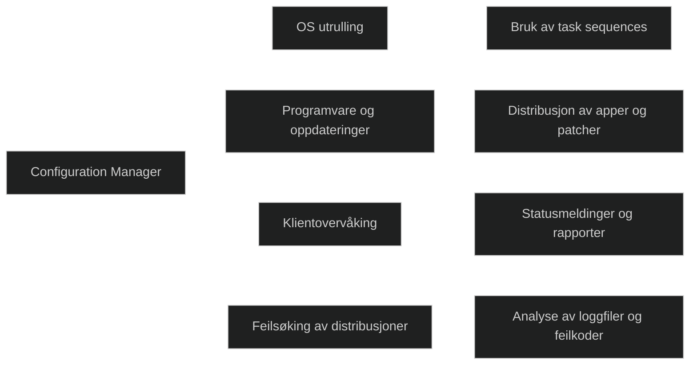
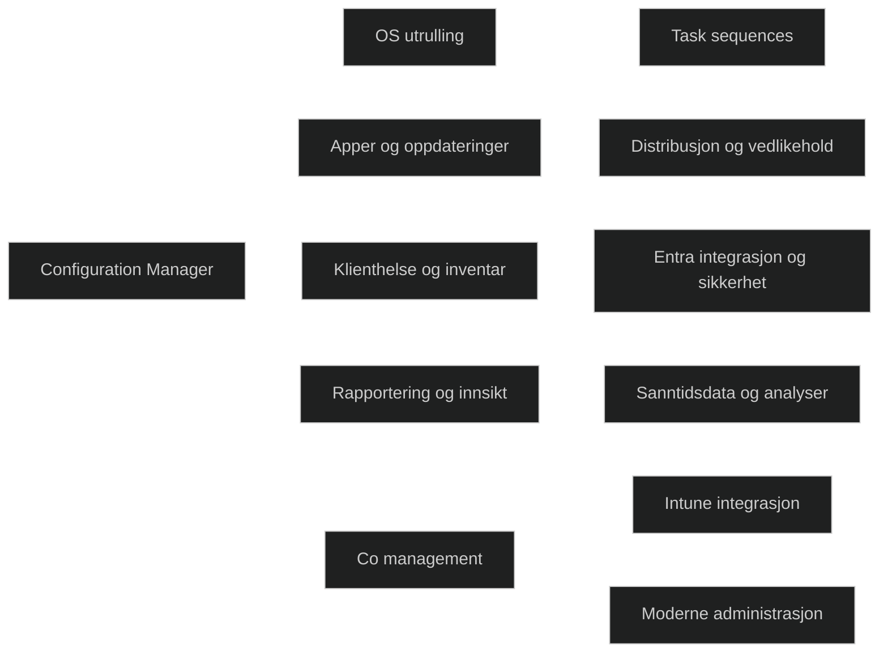
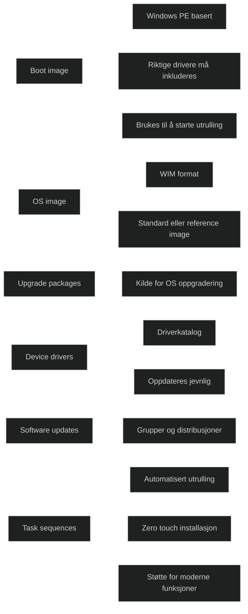
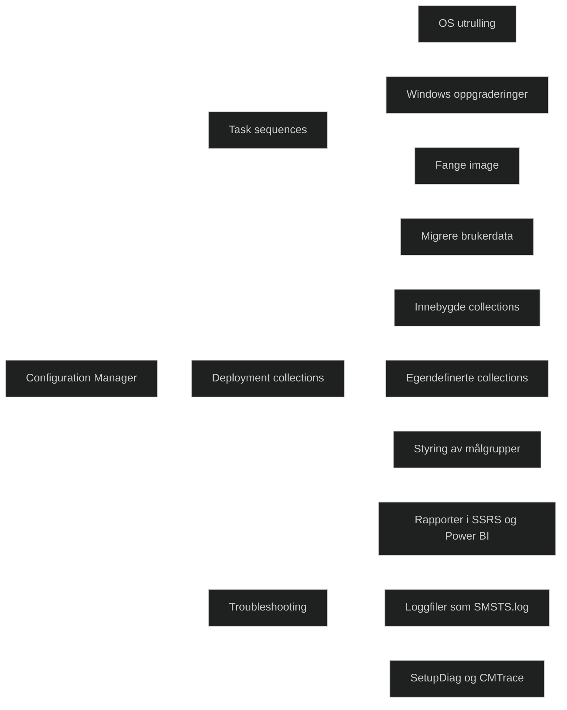
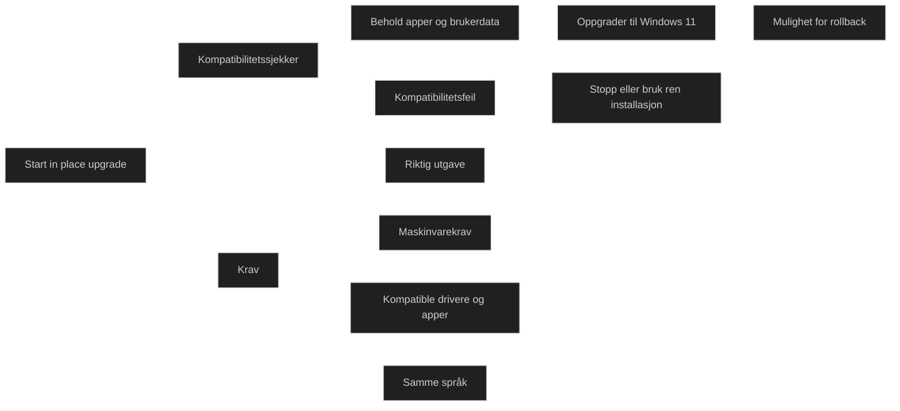
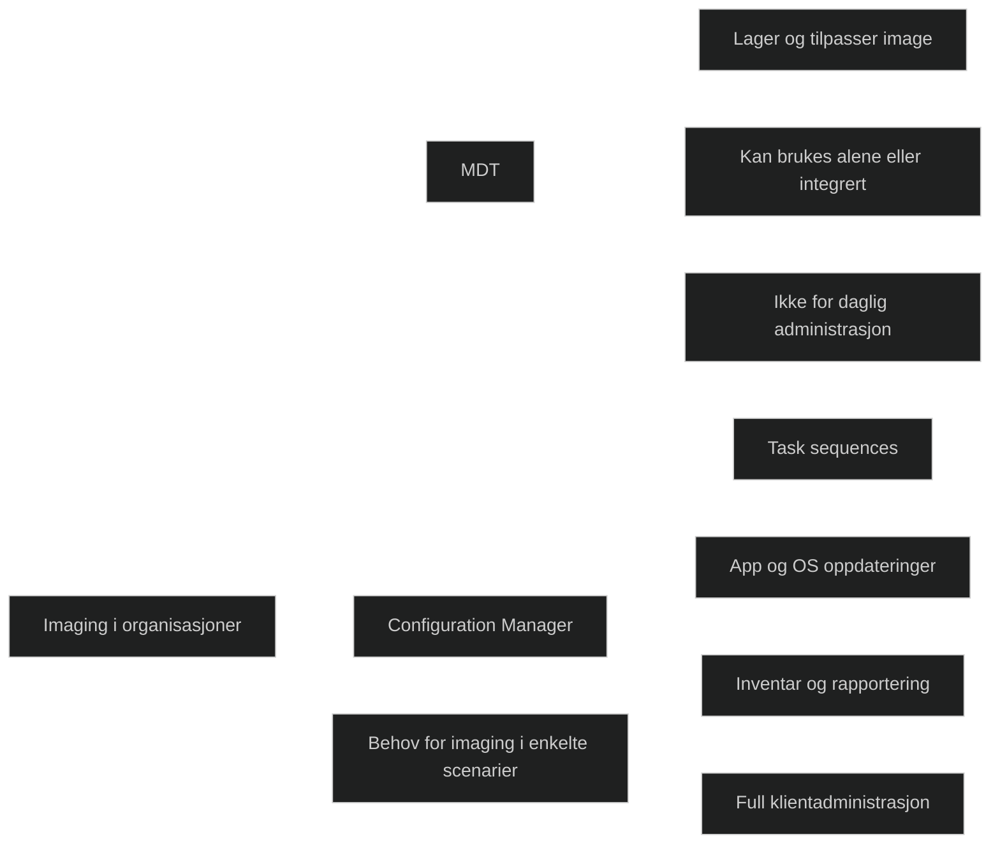
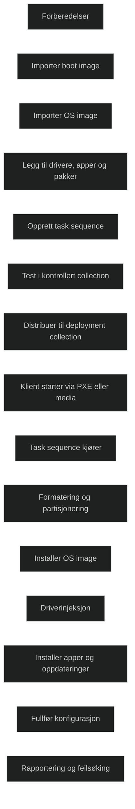

# Deploy using Microsoft Configuration Manager

## [Introduction](https://learn.microsoft.com/en-us/training/modules/deploy-microsoft-configuration-manager/1-introduction/?ns-enrollment-type=learningpath&ns-enrollment-id=learn.wwl.deploy-on-premise-based-tools)

MDT og Configuration Manager bruker et lignende grensesnitt for utrulling av operativsystemer, men de har ulike formål. MDT _fokuserer på OS utrullingen_, mens Configuration Manager er en _komplett løsning for administrasjon av klienter i hele livssyklusen_. Modulen introduserer hvordan Configuration Manager brukes i daglig drift for å sikre at klienter er oppdatert, riktig konfigurert og fungerer som forventet.

Modulen forklarer hvilke muligheter Configuration Manager gir, hvilke komponenter som inngår i løsningen, og hvordan man feilsøker utrullinger. Dette inkluderer innsikt i hvordan klienter kommuniserer med infrastrukturen, hvordan distribusjoner planlegges og overvåkes, og hvordan man identifiserer og løser problemer som oppstår under utrulling.

## [Explore client deployment using Configuration Manager](https://learn.microsoft.com/en-us/training/modules/deploy-microsoft-configuration-manager/2-explore-client-deployment-using/?ns-enrollment-type=learningpath&ns-enrollment-id=learn.wwl.deploy-on-premise-based-tools)

Configuration Manager har lenge vært kjernen i mange organisasjoners utrullingsstrategi. Løsningen fungerer som et samlet verktøy for OS utrulling, applikasjonshåndtering og overvåking av klienthelse. Den er nå en del av [Microsoft Intune familien](../../Glossary/Microsoft-Intune.md) og inngår i en helhetlig plattform for moderne administrasjon. Dette gir støtte for både tradisjonelle og moderne scenarier, inkludert fjernarbeid og hybride miljøer.

### The role of Configuration Manager in a modern desktop journey

Configuration Manager har tradisjonelt vært en lokal administrasjonsløsning for klienter og servere. Med integrasjon mot [Entra ID](../../Glossary/Microsoft-Entra-ID.md), [Defender sikkerhetsstakken](../../Glossary/Microsoft-Defender-XDR.md) og Endpoint Manager konsollen har løsningen utviklet seg til å støtte moderne administrasjon. Kombinasjonen av Configuration Manager og Intune gjennom co management gir fleksibilitet til å bruke riktig verktøy for riktig scenario. Dette gjør det mulig å modernisere gradvis uten å miste kontroll over eksisterende miljøer.

### The foundations of MDT

MDT har historisk blitt brukt sammen med Configuration Manager for å gi flere valgmuligheter i task sequences, regler og automatisering. Mange av fordelene som tidligere krevde MDT er nå tilgjengelige direkte i Configuration Manager gjennom PowerShell og moderne funksjoner. Valget mellom MDT og Configuration Manager bør baseres på behov og scenario, ikke tradisjon.

### Configuration Manager overview

Configuration Manager tilbyr et bredt sett med funksjoner som støtter hele livssyklusen til en klient. Dette inkluderer operativsystemutrulling, applikasjonshåndtering, oppdateringer, inventar, rapportering og integrasjon med skybaserte tjenester. Cloud Management Gateway gjør det mulig å administrere klienter utenfor det interne nettverket, noe som er viktig i miljøer med mye fjernarbeid.

<a href="/certs/diagrams/deploy-cfgmgr.html" target="_blank" rel="noopener">Stort diagram</a>

## [Examine deployment components of Configuration Manager](https://learn.microsoft.com/en-us/training/modules/deploy-microsoft-configuration-manager/3-examine-deployment-components-of/?ns-enrollment-type=learningpath&ns-enrollment-id=learn.wwl.deploy-on-premise-based-tools)

Configuration Manager bruker [Windows PE](../../Glossary/Windows-PE.md) baserte boot image for å starte utrulling. Disse image kan tilpasses og oppdateres, og må inneholde riktige drivere for nettverk og lagring. Løsningen leverer to standard boot image, ett for x86 og ett for x64, og disse kan utvides ved behov. Boot image brukes til å koble klienten til distribusjonsinfrastrukturen, men bruken av slike image har blitt mindre viktig etter innføringen av [Autopilot](../../Glossary/Windows-Autopilot.md) og OEM image.

### OS Images

Et OS image er en Windows Imaging (WIM) fil som inneholder nødvendige filer for å installere Windows. Image kan være standard eller bygget fra et reference image. Mange organisasjoner bruker capture task sequences for å lage golden image. OS image er sentrale i alle utrullingsscenarier.

### Operating System Upgrade Packages

Upgrade packages brukes når en eksisterende installasjon skal oppgraderes. Disse pakkene importeres fra ISO eller DVD og brukes til å levere en ren installasjon eller en oppgradering.

### Device Drivers

Configuration Manager har en driverkatalog som organiserer drivere og driverpakker. Drivere kan knyttes til boot image eller OS image, og må holdes oppdatert. En moderne strategi innebærer å hente drivere direkte fra leverandører i stedet for å bruke store driverpakker.

### Software Updates

Software updates håndteres gjennom egne grupper, regler og distribusjoner. Configuration Manager gir en strukturert måte å sikre samsvar og kontroll på tvers av klienter. Dette bygger videre på det MDT tilbyr, men med mer avansert styring.

### Task Sequences

Task sequences automatiserer utrulling og kan kjøres helt uten brukerinteraksjon. Dette gir zero touch installasjon(ZTI). Task sequences kan inkludere oppdateringer, apper, drivere og moderne funksjoner som Cloud Management Gateway. De er kjernen i utrullingsprosessen og replikkeres i hele hierarkiet.

<a href="/certs/diagrams/deploy-cfgmgr-components.html" target="_blank" rel="noopener">Stort diagram</a>

## [Manage client deployment using Configuration Manager](https://learn.microsoft.com/en-us/training/modules/deploy-microsoft-configuration-manager/4-manage-client-deployment-using/?ns-enrollment-type=learningpath&ns-enrollment-id=learn.wwl.deploy-on-premise-based-tools)

Configuration Manager kan brukes til å lage og distribuere Windows image til klienter. Løsningen har et eget grensesnitt for å importere og administrere boot image og OS image, og utrulling _styres gjennom task sequences og collections_. Dette gir kontroll over hvilke enheter som mottar en utrulling, og reduserer risikoen for feil distribusjon.

### Task Sequences

Task sequences fungerer på samme måte som i MDT, men gir større fleksibilitet ved at de kan bruke apper, pakker og skript som allerede finnes i Configuration Manager. De brukes til å distribuere operativsystem til nye eller gjenoppbygde enheter, utføre Windows oppgraderinger, fange image og migrere brukerdata. Task sequences kan også tilpasses for avanserte konfigurasjoner.

### Deployment Collections

Når en task sequence er klar, må den knyttes til en [deployment collection](../../Glossary/ConfigMgr-Collections.md). Collections fungerer som sikkerhetsmekanisme ved å kontrollere hvilke enheter som mottar en utrulling. Det finnes innebygde collections som All Systems og All Unknown Computers, men det anbefales å bruke egne collections for mer presis styring. Collections brukes også i andre administrative oppgaver og er sentrale i organiseringen av klientmiljøet.

### Troubleshooting a Windows Deployment using Configuration Manager

Feilsøking er en viktig del av utrullingsprosessen. Configuration Manager tilbyr rapporter gjennom _SQL Server Reporting Services_ og _Power BI Report Server_, som gir innsikt i status og feil. Loggfiler på klient og server gir detaljerte spor, spesielt SMSTS.log under selve utrullingen. Verktøy som _SetupDiag_ kan brukes til å analysere problemer under oppgraderinger. _CMTrace_ anbefales for å lese loggfiler effektivt.

<a href="/certs/diagrams/deploy-cfgmgr-deploy.html" target="_blank" rel="noopener">Stort diagram</a>

## [Plan in-place upgrades using Configuration Manager](https://learn.microsoft.com/en-us/training/modules/deploy-microsoft-configuration-manager/5-plan-place-upgrades-using/?ns-enrollment-type=learningpath&ns-enrollment-id=learn.wwl.deploy-on-premise-based-tools)

In place upgrade bruker Windows Setup til å oppgradere operativsystemet samtidig som apper, brukerdata og innstillinger beholdes. Setup utfører kompatibilitetssjekker og kan rulle tilbake til forrige versjon hvis noe går galt. Metoden er egnet når en organisasjon ønsker å beholde apper og brukeropplevelser uten å reinstallere alt fra grunnen av.

Manuell kjøring av Setup skalerer dårlig, derfor anbefales task sequences for større miljøer. Både MDT og Configuration Manager kan utføre in place upgrade med task sequences, og dette gir en kontrollert og repeterbar prosess. Etter at en enhet er oppgradert til Windows 10 eller Windows 11, kan moderne løsninger som Autopilot brukes for videre livssyklus.

### Considerations for In-place Upgrades

Flere forhold avgjør om in place upgrade kan brukes:

- Operativsystem og utgave må støtte oppgradering til Windows 11. Oppgradering til høyere utgave er mulig, men nedgradering av utgave støttes ikke.
- Maskinvaren må oppfylle minimumskravene for Windows 11.
- Drivere og apper må være kompatible. Setup kan kjøres med kompatibilitetssjekk for å identifisere problemer.
- 32 bit kan ikke oppgraderes til 64 bit.
- Språk må være identisk mellom eksisterende og nytt operativsystem.
- Dual boot, multiboot, Windows To Go og VHD støttes ikke.
- Kun standard Windows image kan brukes, ikke tilpassede image.

Hvis oppgraderingen feiler i de siste fasene, vil enheten starte reparasjon av det opprinnelige operativsystemet. Hvis oppgraderingsstien ikke støttes, må en ren installasjon brukes i stedet.

<a href="/certs/diagrams/deploy-cfgmgr-upgrade.html" target="_blank" rel="noopener">Stort diagram</a>

## [Module assessment](https://learn.microsoft.com/en-us/training/modules/deploy-microsoft-configuration-manager/6-knowledge-check/?ns-enrollment-type=learningpath&ns-enrollment-id=learn.wwl.deploy-on-premise-based-tools)

1. As the Desktop Administrator for Fabrikam, Holly Spencer is using Configuration Manager to create and deploy Windows images to devices. Holly began by creating a task sequence. She now wants to target the task sequence at a deployment collection to enable successful delivery. Holly wants to use Configuration Manager's built-in collection that contains the largest scope of device resources. Which built-in collection is this?

	All Systems

2. Contoso wants to run Windows setup to complete an in-place upgrade from Windows 8.1 to Windows 11. What's the recommended approach for large-scale deployments such as Contoso that have hundreds of devices to upgrade?

	Build a task sequence

## [Summary](https://learn.microsoft.com/en-us/training/modules/deploy-microsoft-configuration-manager/7-summary/?ns-enrollment-type=learningpath&ns-enrollment-id=learn.wwl.deploy-on-premise-based-tools)

Imaging har lenge vært brukt for å distribuere operativsystem image til klienter. Selv om moderne løsninger gjør det mulig å unngå imaging, finnes det fortsatt scenarier der dette er nødvendig. Microsoft Deployment Toolkit er en lokal løsning for å lage image og kan brukes alene eller sammen med Configuration Manager. MDT kan bygge et tilpasset image som inneholder konfigurasjoner og apper, men brukes ikke til daglig administrasjon.

Configuration Manager deler mange av de samme utrullingsmulighetene som MDT, inkludert task sequences, men tilbyr i tillegg full administrasjon av klienter gjennom oppdateringer, apper, inventar og rapportering. Dette gjør Configuration Manager til en mer komplett løsning for organisasjoner som trenger både utrulling og kontinuerlig drift.

[Support for Configuration Manager current branch versions](https://learn.microsoft.com/en-us/mem/configmgr/core/servers/manage/current-branch-versions-supported)
[Deploy software updates - Configuration Manager](https://learn.microsoft.com/en-us/mem/configmgr/sum/deploy-use/deploy-software-updates)