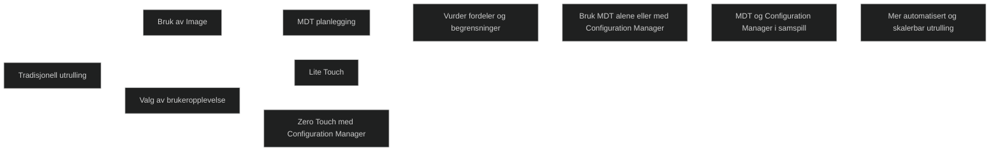
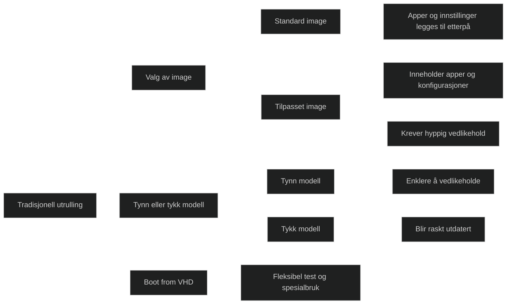
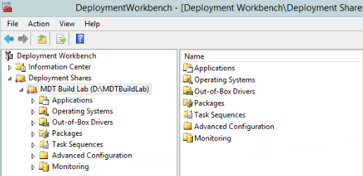
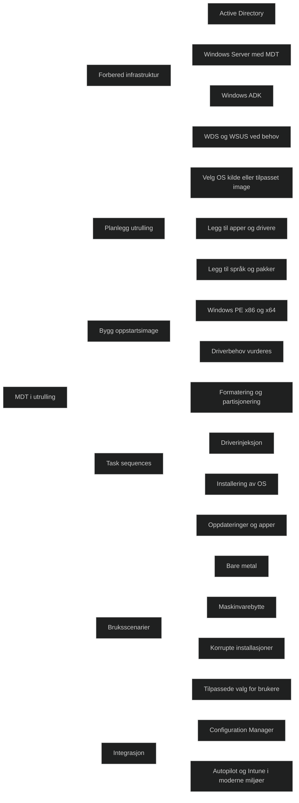
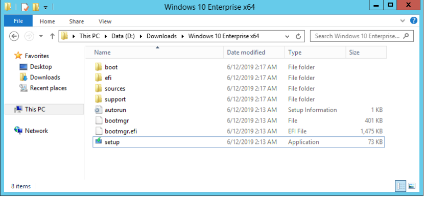
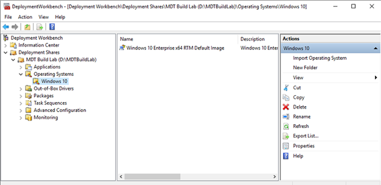
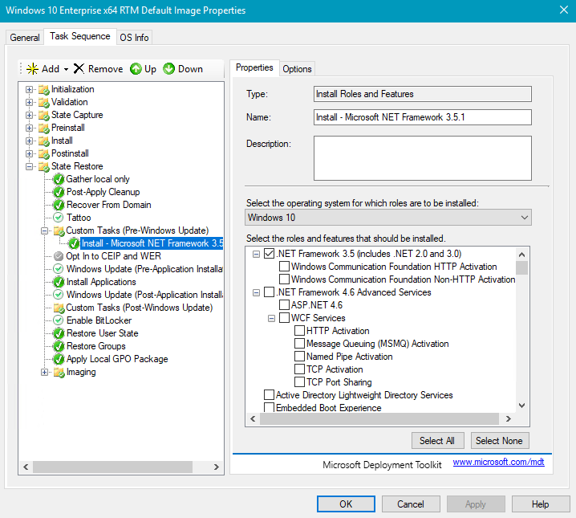
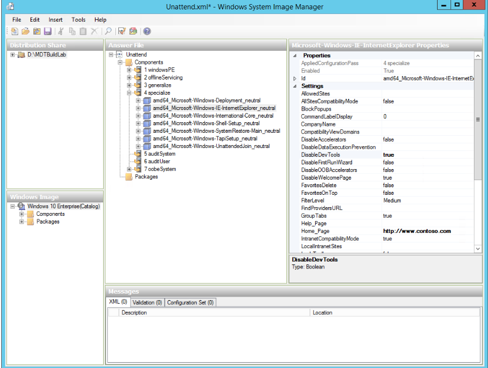
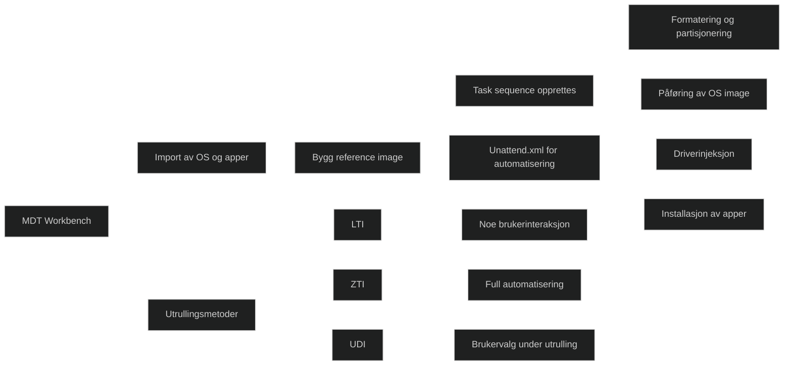
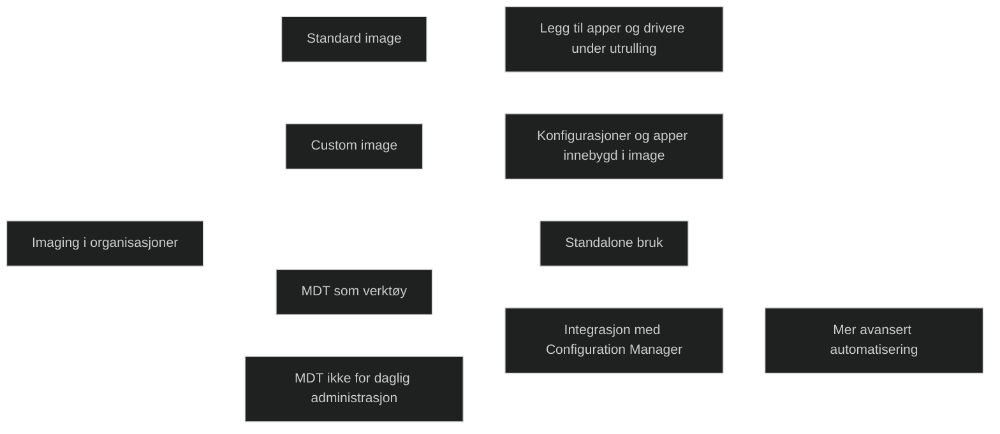

# Deploy using the Microsoft Deployment Toolkit

## [Introduction](https://learn.microsoft.com/en-us/training/modules/deploy-microsoft-deployment-toolkit/1-introduction/?ns-enrollment-type=learningpath&ns-enrollment-id=learn.wwl.deploy-on-premise-based-tools)

Tradisjonelle metoder for utrulling av OSer har lenge vært brukt i organisasjoner, og selv om moderne skybaserte løsninger har forenklet mange prosesser, har lokale verktøy fortsatt en rolle i dagens miljøer. Modulen forklarer hvordan tradisjonell administrasjon gradvis har blitt erstattet av moderne metoder, og hvordan lokale verktøy kan brukes der det fortsatt er behov for dem. 



## [Evaluate traditional deployment methods](https://learn.microsoft.com/en-us/training/modules/deploy-microsoft-deployment-toolkit/2-evaluate-traditional-deployment-methods/?ns-enrollment-type=learningpath&ns-enrollment-id=learn.wwl.deploy-on-premise-based-tools)

Tradisjonell utrulling har lenge vært basert på å bruke _image_ for å installere operativsystemer på mange enheter. Dette er fortsatt støttet i Windows 11, men krever mer vedlikehold enn moderne metoder. Administratoren må velge mellom å bruke standardimaget som følger med Windows, eller å lage et tilpasset image som inneholder apper og konfigurasjoner. Tilpassede _image_ gir raskere utrulling, men krever hyppig oppdatering for å unngå at de blir utdaterte.

### Default and custom images

Standardimaget installerer operativsystemet med grunnleggende drivere, mens apper og innstillinger må legges til etterpå. Tilpassede _image_ kan inkludere apper og konfigurasjoner, men må bygges og vedlikeholdes. Verktøy som DISM brukes til å fange og endre _image_, og Sysprep brukes for å generalisere dem før utrulling. Valget mellom standard og tilpasset image påvirker både vedlikehold og utrullingstid.

### Thin versus thick images

Tynne _image_ inneholder kun operativsystemet og nødvendige drivere, mens tykke _image_ inkluderer apper og konfigurasjoner. Tykke _image_ virker effektive i starten, men blir raskt krevende å vedlikeholde. Tynne _image_ anbefales fordi de er enklere å oppdatere og kan kombineres med automatiserte konfigurasjoner via GPO eller moderne administrasjon.

### Boot from VHD

Operativsystemet kan installeres i en virtuell harddiskfil (.vhd og .vhdx) og startes som om det var installert direkte på disken. Dette gir fleksibilitet i testmiljøer og spesielle scenarier, og kan opprettes med Hyper V, PowerShell eller Disk Management.



<a href="/certs/diagrams/deploy-mdt-image.html" target="_blank" rel="noopener">Stort diagram</a>

## [Set up the Microsoft Deployment Toolkit for client deployment](https://learn.microsoft.com/en-us/training/modules/deploy-microsoft-deployment-toolkit/3-set-up-for-client-deployment/?ns-enrollment-type=learningpath&ns-enrollment-id=learn.wwl.deploy-on-premise-based-tools)

MDT er en samlet verktøypakke for å automatisere utrulling av Windows klienter og servere. Løsningen bygger på Windows ADK og gir ekstra funksjoner som reduserer kompleksitet og tid ved utrulling. MDT kan brukes alene eller integreres med Configuration Manager for mer avansert automatisering. Selv om moderne metoder som Autopilot og Intune tar over mange oppgaver, er MDT fortsatt nyttig i lokale miljøer og ved scenarier som krever full kontroll over bildebygging.

### MDT setup prerequisites

En vellykket utrulling krever at infrastrukturen er på plass. Dette inkluderer et Active Directory miljø for å plassere enheter i riktige OU enheter, en Windows Server som hoster MDT og deployment share, og Windows ADK for å bygge bootimage. Windows Deployment Services (WDS) kan brukes for nettverksbasert oppstart, og WSUS kan levere oppdateringer under utrulling. Disse komponentene sikrer at klienter kan starte, hente innhold og fullføre installasjonen.

### Exploring MDT

MDT støtter Windows 10 og nyere, samt Windows Server. Det kan automatisere sekvenser av oppgaver som installasjon av operativsystem, apper, språkpakker og skript. Løsningen gir også et brukergrensesnitt som lar brukere velge alternativer under utrulling. MDT støtter offline BitLocker og offline USMT, noe som sparer tid og gir mer effektiv migrering.

### Exploring the components of MDT

Deployment Workbench inneholder flere sentrale komponenter. Bootimage i Windows PE brukes for å starte utrullingen og koble til deployment share. Operativsystemer importeres som full kilde eller tilpassede image. Apper kan legges til i mange formater, og drivere kan organiseres etter modell for å unngå konflikter. Pakker som språkpakker kan også legges til. Task sequences er kjernen i utrullingen og definerer rekkefølgen av handlinger som formatering, driverinjeksjon, installasjon og oppdatering.



_MDT brukes primært til å bygge og gjenoppbygge enheter_. For oppgraderinger og moderne administrasjon anbefales Intune eller Windows Update for Business. MDT kan integreres med Configuration Manager for en kombinert løsning der MDT bygger bildet og Configuration Manager håndterer videre livssyklus. Autopilot overtar mange oppgaver i moderne miljøer, men MDT er fortsatt nyttig ved bare metal, maskinvarebytte, korrupte installasjoner og behov for tilpassede valg under utrulling.



<a href="/certs/diagrams/deploy-mdt-deploy.html" target="_blank" rel="noopener">Stort diagram</a>

## [Manage and deploy images using the Microsoft Deployment Toolkit](https://learn.microsoft.com/en-us/training/modules/deploy-microsoft-deployment-toolkit/4-manage-deploy-images/?ns-enrollment-type=learningpath&ns-enrollment-id=learn.wwl.deploy-on-premise-based-tools)

MDT brukes til å lage og distribuere Windows image ved hjelp av Deployment Workbench. De samme komponentene brukes både når du fanger et image og når du distribuerer det, noe som gir fleksibilitet i ulike scenarier. MDT gir en strukturert måte å standardisere operativsystemkonfigurasjoner på, og støtter både originalt installasjonsmedia og tilpassede image.

### Reference images

Et reference image er grunnlaget for en standardisert installasjon. MDT bygger slike image ved hjelp av et deployment share og definerte regler. Tradisjonelt har organisasjoner laget et tilpasset golden image med apper og konfigurasjoner, men dette krever vedlikehold på grunn av hyppige endringer i Windows. Det anbefales å vurdere om alle elementer i image faktisk er nødvendige, og om prosessen kan forenkles. MDT kan importere både originalt installasjonsmedia og tilpassede WIM filer.





### Add an application to the captured image

Før du lager en task sequence, må apper og skript legges til i deployment share. Dette gjøres i Applications området i Workbench. PowerShell kan brukes for å automatisere import av flere apper. Dette gjør det enklere å bygge et image som inneholder nødvendige komponenter.

```powershell
Import-Module "C:\Program Files\Microsoft Deployment Toolkit\bin\MicrosoftDeploymentToolkit.psd1"
New-PSDrive -Name "DS001" -PSProvider MDTProvider -Root "D:\MDTBuildLab"
$ApplicationName = "Install - Office365 ProPlus - x64"
$CommandLine = "setup.exe /configure configuration.xml"
$ApplicationSourcePath = "D:\Downloads\Office365"
Import-MDTApplication -Path "DS001:\Applications\Microsoft" -Enable "True" -Name $ApplicationName -ShortName $ApplicationName -CommandLine $CommandLine -WorkingDirectory ".\Applications\$ApplicationName" -ApplicationSourcePath $ApplicationSourcePath -DestinationFolder $ApplicationName -Verbose
```

### Deploy a reference image with a task sequence

En task sequence består av trinn som samler informasjon, formaterer disken, legger inn operativsystemet, injiserer drivere og installerer apper. MDT tilbyr maler for ulike scenarier. Det anbefales å bygge reference image i en virtuell maskin for å unngå uønskede drivere. Unattend.xml brukes for å automatisere installasjonen og tilpasse Windows under installasjonspassene.





### Methods of installation

Tradisjonelle metoder omfatter LTI, ZTI og UDI. LTI krever noe brukerinteraksjon og støttes av både MDT og Configuration Manager. ZTI er helt automatisert og krever Configuration Manager. UDI lar brukeren velge alternativer som språk og apper, og krever både MDT og Configuration Manager. Valg av metode avhenger av behovet for automatisering og fleksibilitet.



<a href="/certs/diagrams/deploy-mdt-manage-deploy.html" target="_blank" rel="noopener">Stort diagram</a>

## [Module assessment](https://learn.microsoft.com/en-us/training/modules/deploy-microsoft-deployment-toolkit/5-knowledge-check/?ns-enrollment-type=learningpath&ns-enrollment-id=learn.wwl.deploy-on-premise-based-tools)

1. Fabrikam wants to create and deploy a Windows 11 image to bare-metal devices using the Microsoft Deployment Toolkit. Where will Fabrikam store the default image that it creates?

	The Deployment Workbench

2. Tailspin Toys' administrators have chosen to create a custom image of Windows 11 that contains the desired OS, settings, and applications. Which of the following tools can the administrators use to capture the image, mount the image, and make modifications?

	DISM

3. Contoso has transitioned from the Microsoft Deployment Toolkit (MDT) to Windows Autopilot and Microsoft Intune to automate its server and desktop deployments. However, there are still some scenarios where Contoso prefers to use MDT, because it's better suited than Autopilot and Intune. Which of the following scenarios is MDT the better choice for automating desktop deployments rather than modern management and deployment tools such as Autopilot and Intune?

	When deploying to bare metal devices

## [Summary](https://learn.microsoft.com/en-us/training/modules/deploy-microsoft-deployment-toolkit/6-summary/?ns-enrollment-type=learningpath&ns-enrollment-id=learn.wwl.deploy-on-premise-based-tools)

Imaging har vært brukt i mange år for å distribuere operativsystem image til klienter. Selv om moderne metoder tilbyr løsninger som ikke krever imaging, finnes det fortsatt scenarier der dette er nødvendig. Microsoft Deployment Toolkit er en lokal løsning for å lage image og kan også brukes til å distribuere operativsystemet, enten alene eller sammen med Configuration Manager. Administratorer kan distribuere ved hjelp av standard image kombinert med apper og driverpakker, eller lage et tilpasset image som inneholder konfigurasjoner og apper direkte i selve image. MDT brukes til utrulling, men er ikke et verktøy for daglig klientadministrasjon.




<a href="/certs/diagrams/deploy-mdt-summary.html" target="_blank" rel="noopener">Stort diagram</a>

[DISM Image Management Command-Line Options](https://learn.microsoft.com/en-us/windows-hardware/manufacture/desktop/dism-image-management-command-line-options-s14)