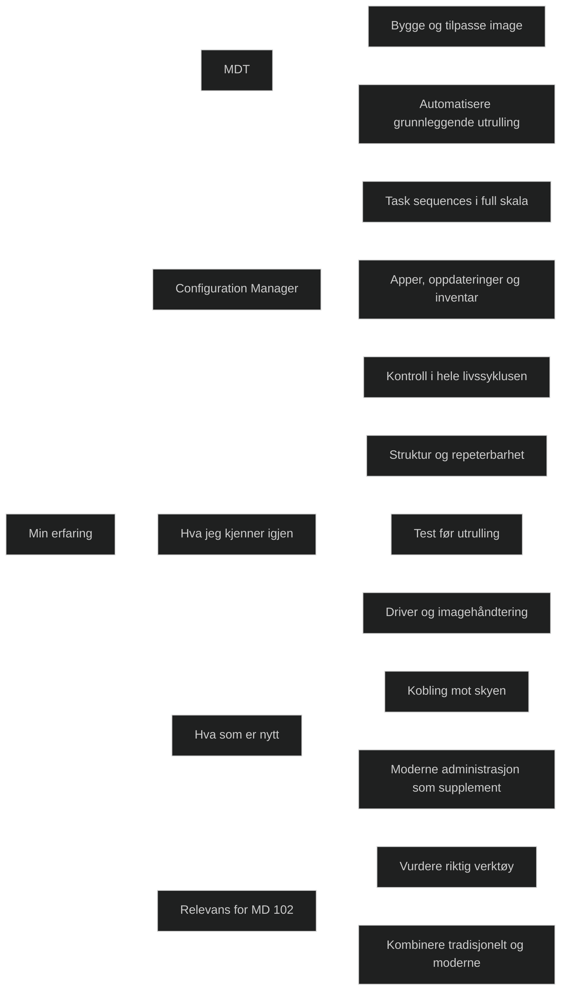

# # Deploy using on-premises based tools

Når jeg går gjennom denne modulen, kjenner jeg igjen mye av det jeg jobbet med da jeg satte opp og vedlikeholdt både MDT og Configuration Manager på Krigsskolen. Arbeidsflyten, tankesettet og strukturen er i stor grad den samme: bygge image, teste i kontrollerte grupper, bruke task sequences for å sikre forutsigbarhet og håndtere drivere og apper på en ryddig måte. Det føles nesten som å lese en oppsummering av praksisen jeg hadde i hverdagen.

Samtidig merker jeg at enkelte ting har utviklet seg. Det er ikke nødvendigvis helt nye konsepter, men mer en modernisering av hvordan de samme verktøyene brukes. Integrasjonen mot skyen er sterkere, og det er tydelig at on premises verktøy nå ses som en del av en større helhet, ikke som det eneste fundamentet. Likevel er kjernen den samme: når jeg trenger full kontroll, repeterbarhet og mulighet til å håndtere komplekse miljøer, er MDT og Configuration Manager fortsatt svært relevante.

Det gjør at modulen ikke føles tung eller fremmed. Snarere blir den en bekreftelse på at erfaringen min fortsatt har verdi. Jeg kjenner igjen logikken bak boot image, OS image, driverhåndtering, collections og task sequences. Jeg kjenner igjen hvorfor vi testet i små grupper før bred utrulling, og hvorfor struktur og dokumentasjon var avgjørende. Det som er nytt, handler mest om hvordan disse verktøyene nå kombineres med moderne administrasjon, og hvordan organisasjoner kan modernisere gradvis uten å miste kontroll.

For MD 102 betyr dette at jeg ikke bare skal kunne teknikken, men også forstå når on premises verktøy fortsatt er riktige. Det handler om vurdering, modenhet og evnen til å se helheten. Og der har jeg et fortrinn, fordi jeg har stått i dette i praksis.

---

| **Tema**                             | **Oppgave**                                                              | **Status** | **Notater**                                                             |
| ------------------------------------ | ------------------------------------------------------------------------ | ---------- | ----------------------------------------------------------------------- |
| **Deployment readiness**             | Forstå hva som inngår i vurdering av utrullingsklarhet                   | ✅          | Maskinvare, drivere, apper, nettverk, lagringskrav, kompatibilitet.     |
|                                      | Bruke Intune og ConfigMgr rapporter for å vurdere readiness              | ✅          | Identifisere enheter som ikke oppfyller krav før utrulling.             |
|                                      | Forstå forskjellen på readiness for ren installasjon og in place upgrade | ✅          | In place upgrade krever kompatibilitet med eksisterende OS og apper.    |
| **MDT – grunnleggende**              | Forstå hva MDT brukes til                                                | ✅          | Bygge og tilpasse image, automatisere utrulling, fange reference image. |
|                                      | Opprette og konfigurere deployment share                                 | ⬜          | Struktur for OS, apper, drivere, task sequences.                        |
|                                      | Importere OS image og apper                                              | ✅          | Støtter WIM, ISO og applikasjonspakker.                                 |
|                                      | Opprette task sequence i MDT                                             | ⬜          | Standard client task sequence, capture sequence, LTI.                   |
|                                      | Forstå LTI, ZTI og UDI                                                   | ✅          | LTI = MDT alene, ZTI/UDI = krever ConfigMgr.                            |
| **MDT – imagehåndtering**            | Forstå reference image vs standard image                                 | ✅          | Reference image inneholder apper og tilpasninger.                       |
|                                      | Fange et reference image                                                 | ⬜          | Bruk capture task sequence, bygg helst i VM.                            |
|                                      | Bruke Unattend.xml                                                       | ⬜          | Automatiserer installasjonspassene.                                     |
| **Configuration Manager – grunnlag** | Forstå rollen til ConfigMgr i moderne administrasjon                     | ✅          | Livssyklusadministrasjon, apper, oppdateringer, OS‑utrulling.           |
|                                      | Forstå hierarki, sites og distribusjonspunkter                           | ✅          | Viktig for skalering og nettverksbelastning.                            |
|                                      | Forstå Cloud Management Gateway                                          | ✅          | Administrasjon av klienter utenfor LAN.                                 |
| **Boot image**                       | Forstå hva boot image er                                                 | ✅          | Basert på WinPE, brukes til å starte utrulling.                         |
|                                      | Oppdatere og tilpasse boot image                                         | ⬜          | Legge til drivere, WinPE komponenter.                                   |
| **OS image**                         | Importere og administrere OS image                                       | ✅          | WIM filer, standard eller reference image.                              |
|                                      | Forstå forskjellen på OS image og upgrade package                        | ✅          | Upgrade package brukes for in place upgrade.                            |
| **Drivers**                          | Forstå driverkatalog og driverpakker                                     | ✅          | Drivere knyttes til modeller eller dynamisk injeksjon.                  |
|                                      | Strategier for driverhåndtering                                          | ✅          | Moderne praksis: hente drivere direkte fra leverandør.                  |
| **Task Sequences**                   | Forstå hvordan task sequences fungerer                                   | ✅          | Kjernen i OS‑utrulling, stegvis automatisering.                         |
|                                      | Lage task sequence for ren installasjon                                  | ⬜          | Formatering, OS, drivere, apper, oppdateringer.                         |
|                                      | Lage task sequence for in place upgrade                                  | ⬜          | Beholder apper og brukerdata, krever kompatibilitet.                    |
|                                      | Feilsøke task sequences                                                  | ⬜          | SMSTS.log, TSProgressUI, distribusjonsstatus.                           |
| **Collections**                      | Forstå collections og limiting collections                               | ✅          | Styrer målgrupper for utrulling.                                        |
|                                      | Lage test‑ og produksjonscollections                                     | ⬜          | Reduserer risiko, sikrer kontrollert utrulling.                         |
| **Troubleshooting**                  | Bruke loggfiler i ConfigMgr                                              | ✅          | SMSTS.log, AppEnforce.log, UpdatesDeployment.log.                       |
|                                      | Bruke SetupDiag for oppgraderingsfeil                                    | ⬜          | Analyserer Windows Setup feil.                                          |
|                                      | Bruke rapportering i SSRS og Power BI                                    | ⬜          | Status, feil, compliance.                                               |