## [Introduction](https://learn.microsoft.com/en-us/training/modules/administer-endpoint-applications/1-introduction/?ns-enrollment-type=learningpath&ns-enrollment-id=learn.wwl.examine-application-management)

Modulen gir en oversikt over hvordan apper distribueres i Intune og hvordan organisasjoner kan håndtere apper på både registrerte og ikke-registrerte enheter. Det legger grunnlaget ved å vise hvilke verktøy og metoder som finnes for moderne appadministrasjon i Microsoft 365 miljøer. 

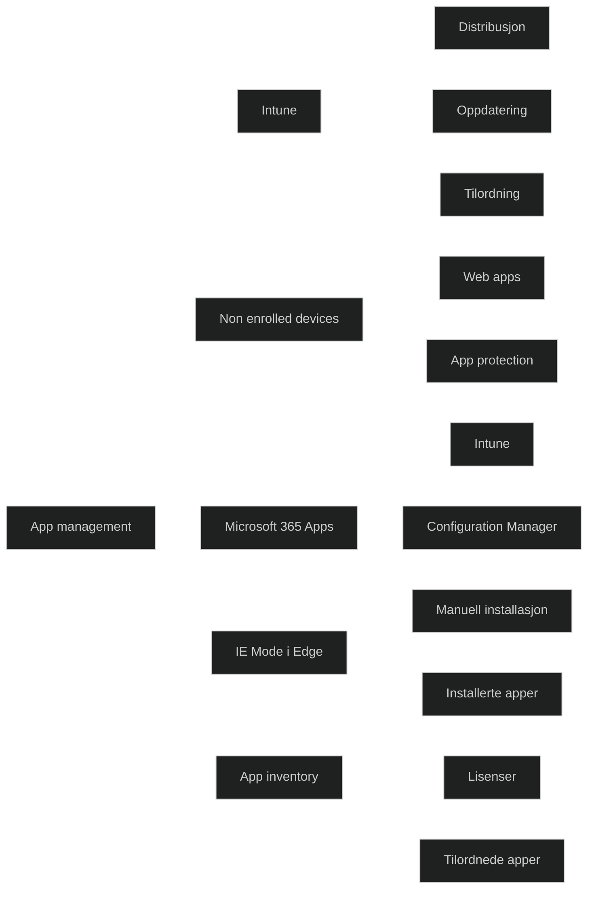

## [Manage apps with Intune](https://learn.microsoft.com/en-us/training/modules/administer-endpoint-applications/2-manage-apps-intune/?ns-enrollment-type=learningpath&ns-enrollment-id=learn.wwl.examine-application-management)

Intune bruker en felles arbeidsflyt for alle apptyper. Målet er å sikre at apper kan installeres uten brukerinteraksjon og at distribusjonen er forutsigbar. Prosessen beskriver hvordan en admin planlegger, distribuerer og overvåker apper.

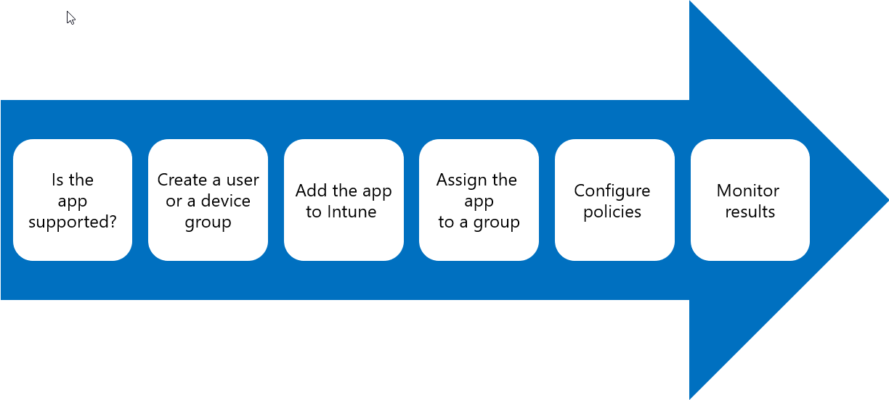

### Ensure that Intune supports the app

Det må bekreftes at appen støttes av Intune og at den kan installeres stille. Dette er avgjørende for automatisert distribusjon og for at [Intune Management Extension](../../Glossary/Microsoft-Intune-Management-Extension.md) eller andre mekanismer skal kunne installere appen uten at brukeren må gjøre noe.

### Create Microsoft Entra groups for either users or devices

Grupper brukes for å målrette appdistribusjon. Brukergrupper passer når appen skal følge brukeren, mens enhetsgrupper brukes når appen skal installeres på bestemte maskiner. 
For tilgjengelige apper må brukere være knyttet til sine maskiner for at Company Portal skal fungere riktig.

### Add the app to Intune

Appen lastes opp eller kobles til Intune. For [Line of Business (LOB) apper](../../Glossary/Line-of-Business-Apps.md) må krav, detection rules, installasjonsparametere og generell informasjon defineres. Når appen er lagt til, kan den distribueres fra _Apps_ i Intune admin center.

### Assign the app to user or device groups

Tilordning styrer om appen installeres automatisk eller gjøres tilgjengelig i Company Portal. Alternativene er:
- Available 
- Not Applicable
- Required
- Uninstall
- Available for enrolled devices
- Available with or without enrollement

Valgene påvirkes av om enheten er registrert i Intune.

### Configure Polices

Appkonfigurasjon og appbeskryttelse brukes for å styre funksjoner og beskytte data. Dette er spesielt viktig for mobile apper og apper som håndterer virksomhetsdata.

### Monitor the result of the app deployment

Intune viser installasjonsstatus per bruker eller per enhet. Admins kan se detaljer for hver app og følge med på om installasjonen er vellykket eller feiler. Dette er viktig for feilsøking og etterkontroll.

### App categories

Kategorier brukes for å organisere apper i Company Portal. Det finnes ni forhåndsdefinerte kategorier, og det er mulig å opprette egne. En app kan tilhøre en eller flere kategorier, for å gjøre det enklere for brukere å finne riktige apper.

### Assign apps

Tilordning kan gjøres når appen legges til eller senere. Appen tilordnes Entra grupper, og valg av tilordningstype avgjør om appen installeres automatisk eller gjøres tilgjengelig. 
Tabellen under viser hvilke handlinger som er mulig avhengig av om statusen til enheten i Intune. 

|**Options**|**Device enrolled in Intune**|**Device not enrolled in Intune**|
|---|---|---|
|Assign an app to a user|Yes|Yes|
|Assign an app to a device|Yes|No|
|Assign an app using the Intune SDK|Yes|Yes|
|Assign an app as Available|Yes|Yes|
|Assign an app as Required|Yes|No|
|Uninstall an app|Yes|No|
|Receive app updates from Intune|Yes|No|
|User install of an app from the Company Portal app|Yes|No|
|User install of an app from the Company Portal website|Yes|Yes|

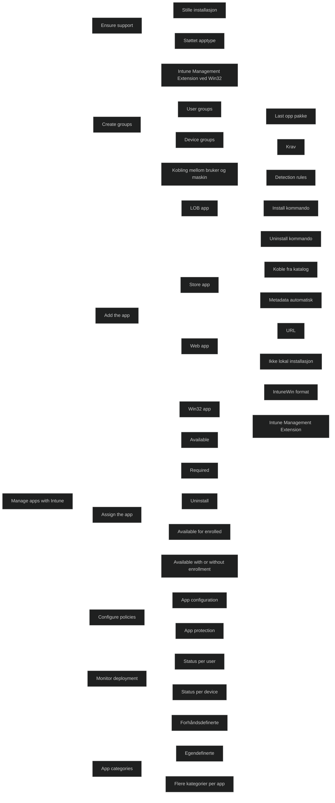

<a href="/certs/diagrams/deploy-intune-app-procedures.html" target="_blank" rel="noopener">Stort diagram</a>

## [Manage Apps on non-enrolled devices](https://learn.microsoft.com/en-us/training/modules/administer-endpoint-applications/3-manage-apps-non-enrolled-devices/?ns-enrollment-type=learningpath&ns-enrollment-id=learn.wwl.examine-application-management)

Brukere kan få apper fra offentlige butikker eller via Intune. Apper fra offentlige butikker er ikke administrert slik som tilordnede apper fra Intune. Administrerte apper gir kontroll over distribusjon, oppdateringer, inventar og selektiv sletting. Intune kan også bruke appbeskyttelse for å gi ekstra databekyttelse gjennom funksjoner som _per app PIN, jailbreak kontroll_ og styring av _dataflyt_. Dette gjør det mulig å velge riktig kombinasjon av administrerte, ikke-administrerte og [Mobile Application Management (MAM)](../../Glossary/Mobile-Application-Management.md) beskyttede apper basert på behov for databeskyttelse.

### Updates for unenrolled devices

Brukere må selv installere oppdateringer via Company Portal. De kan bruke Company Portal appen eller nettstedet. Krav om registrering vises bare hvis Company Portal er konfigurert til å kreve det.

### Deploy apps to unenrolled devices

Apper kan tilordnes av brukere selv om enheten ikke er registrert. Tilordning gjøres ved å velge en app som støtter dette, redigere tilordningen og bruke _Available with or without enrollet_. Gruppen som velges må inneholde brukere. 
Dette gjør det mulig å distribuere apper i BYOD scenarioer uten full administrasjon. Det anbefales likevel å registrere enheter for å få full administrasjonsfunksjonalitet.

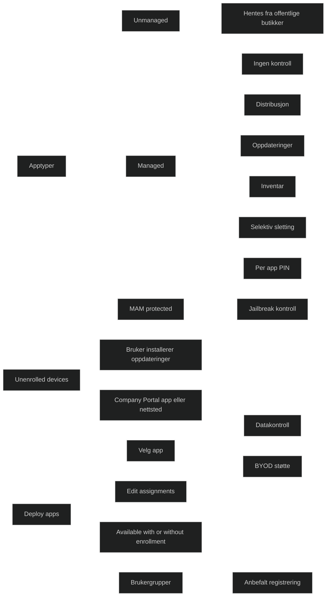

## [Deploy Microsoft 365 Apps with Intune](https://learn.microsoft.com/en-us/training/modules/administer-endpoint-applications/4-deploy-microsoft-365-apps-intune/?ns-enrollment-type=learningpath&ns-enrollment-id=learn.wwl.examine-application-management)

Prosessen starter i Intune admin center. Admins velger _Apps, All Apps_ og legger til en ny app av typen _Microsoft 365 Apps for Windows 10 or later_. Deretter konfigureres informasjon som _navn, beskrivelse, kategori, logo_  og evt. informasjons- og personvernlenker. 
Dette gjør appen synlig og forståelig for brukere i Company Portal.

### App suite information

Her defineres hvordan app-pakken skal fremstå for brukeren. Navn må være unikt for å unngå at appen skjules. Beskrivelsen kan forklare hvilke apper som inngår. Kategorier kan gjøre det enklere å finne appen i Company Portal. Admins kan også velge å vise appen som en fremhevet app.

### Configure App Suite

Her velges hvilke Office apper som skal installeres, inkl. Project og Visio. Admin  velger arkitektur, oppdateringskanal og om eldre MSI baserte Office installasjoner skal fjernes. Fjerning av MSI er nødvendig for at installsjonen skal lykkes. Det kan også aktiveres delt enhets aktivering, aksept av lisensvilkår og installasjon av Microsoft Search i Bing. Språk kan installeres automatisk basert på Windows eller velges manuelt.

Tilslutt tilordnes appen brukere eller grupper, og konfigurasjonen opprettes.

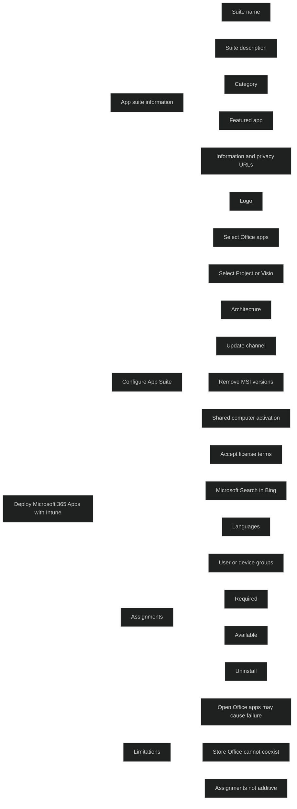

## [Additional Microsoft 365 Apps Deployment Tools](https://learn.microsoft.com/en-us/training/modules/administer-endpoint-applications/5-additional-microsoft-365-apps-deployment-tools/?ns-enrollment-type=learningpath&ns-enrollment-id=learn.wwl.examine-application-management)

Det finnes flere metoder for å distribuere Microsoft 365 Apps når [Intune](../../Glossary/Microsoft-Intune.md) ikke dekker alle behov. Valg av metode avhenger av hvor mye kontroll som kreves, om installasjonen skal skje fra skyen eller fra lokal kilde, og om organisasjonen allerede bruker andre distribusjonsverktøy. 

### Configuration Manager

ConfigMgr passer for organsiasjoner som allerede bruker det til programvarehåndtering. Det gir omfattende kontroll over installasjon, oppdateringer og innstillinger, og skalerer i store miljøer. Det har innebygde funksjoner for distribusjon og administrasjon av Office. 
Dette gir høy grad av styring og forutsigbarhet.

### Use the Office Deployment Tool

[Office Deployment Tool (ODT)](../../Glossary/Office-Deployment-Tool.md) gir full kontroll over installasjon, oppdateringer og innstillinger uten å bruke ConfigMgr. Verktøyet kan brukes alene eller til å laste ned installasjonsfiler som senere distribueres via Intune eller tredjepartsverktøy. 
Dette gir fleksibilitet og er nyttig når distribusjonen krever detaljert tilpasning.

### Use the Office Customization Tool

[Office Customization Tool](../../Glossary/Office-Customization-Tool.md) er en nettbasert løsning som gjør det enkelt å lage XML konfigurasjonsfiler for _Office Deployment Tool_. Det forenkler prosessen og reduserer risikoen for feil. Verktøyet støtter scenarioer som første installasjon, tillegg av produkter, språkpakker, Access Runtime, volumlisensierte produkter og automatisk fjerning av MSI baserte Office versjoner.
Eksisterende konfigurasjonfiler kan importeres og endres.

### End-user installation

Brukere kan installere Microsoft 365 Apps direkte fra Microsoft 365 portalen. Dette krever minst administrativ innsats, men gir også minst kontroll. Administratorer kan fortsatt styre hvor ofte brukere mottar funksjonoppdateringer. 
Brukere må ha adminrettigheter for å installere.

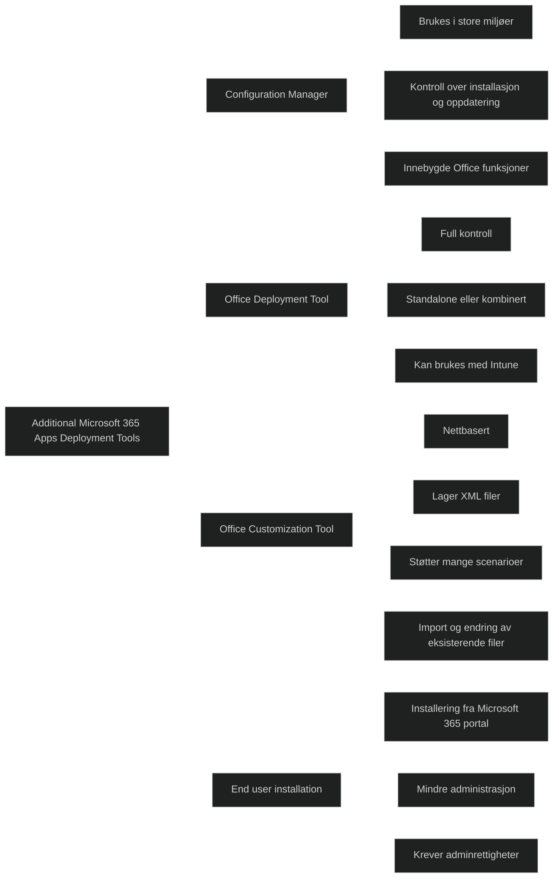

## [Configure Microsoft Edge Internet Explorer mode](https://learn.microsoft.com/en-us/training/modules/administer-endpoint-applications/6-configure-microsoft-edge-internet-explorer-mode/?ns-enrollment-type=learningpath&ns-enrollment-id=learn.wwl.examine-application-management)

Windows 11 bruker Microsoft Edge som standard nettleser, men mange virksomheter har eldre webapplikasjoner som ble laget for Internet Explorer 11. Selv om Internet Explorer 11 er avviklet og deaktivert, kan eldre krav i LOB apper hindre oppgradering av operativsystemet. 

### Microsoft Edge with IE mode

[_IE-mode_](../../Glossary/_IE-mode_.md) gjør det mulig å burke både moderne og eldre nettsteder i samme nettleser. Moderne nettsteder bruker [Chromium](../../Glossary/Chromium.md) motoren, mens eldre nettsteder bruker [MSHTML](../../Glossary/MSHTML.md) motoren fra IE 11. Bare nettsteder som er konfigurert via policy åpnes i __IE-mode__. Når et nettsted åpnes i _IE-mode_. Når et nettsted åpnes i _IE-mode_, vises IE ikonet i adressefeltet. Det er også mulig å åpne nettsteder i et eget IE 11 vindu, men de fleste foretrekker integrert visning i Edge.

_IE-mode_ støtter dokumentmoduser, enterprise moduser, ActiveX, Browser Helper Objects, sikkerhetssoner og F12 verktøy for IE når det startes med IEChosser. 
Det støtter ikke ikke IE verktøylinjer, IE navigasjonsinnstillinger eller F12 verktøy for IE 11 eller Edge.

#### To enable Internet Explorer Mode in Microsoft Edge using Intune

_IE-mode_ aktiveres ved å opprette en konfigurasjonsprofil i Intune. Admin velger Windows, Configuration Profiles og oppretter en profil basert på _Administrative Templates_. Innstillingen _Configure Internet Explorer integration_ sette til _Enabled_ og _Internet Explorer mode_ velges. Profilen tilordnes deretter riktige grupper. Dette gir en standardisert måte å aktivere _IE-mode_ i organisasjonen. 

### Configure IE mode Sites

_IE-mode_ krever en _site list_ som definerer hvilke nettsteder som skal åpnes i _IE-mode_ eller i en bestemt kompabilitetsmodus. Listen bygges som en XML fil og inneholder URLer og evt. kompabilitetsmoduser. Dette gir presis kontroll over hvilke nettsteder som bruker _IE-mode_.

### Enterprise Mode Site List Manager

Dette verktøyet brukes til å lage og vedlikeholde site list filer. Det støtter versjonering, validering av URLer og enkel redigering. _Versjon 2_ anbefales. Nettsteder med _open in IE 11_ åpnes i _IE-mode_, og _compat mode_ kan brukes for eldre kompabilitetsnivåer. Dette verktøyet passer for mindre lister.

### Enterprise Mode Site List Portal

Dette er en nettbasert løsning som støtter flere administratorer, endringsforespørsler, testing og publisering. Portalen bruker IIS, SQL Server og AD DS, Den støtter rollebasert styring, offline drift og testing før publisering. Dette passer større miljøer eller når flere personer administrerer listen.

### Enable Enterprise Site Mode

Når site listen er opprettet, må funksjonaliteten aktiviseres via policy. Listen lagres på en sikker webserver og lastes ned til klienter. Dette gir sentral kontroll og gjør at brukere fortsatt kan åpne nettsteder i _IE-mode_ selv om serveren er uttilgjengelig. Policyen _Configure the Enterprise Mode Site List_ brukes til å angi plasseringen av XML filen.

### Configure with Group Policy

_IE-mode_ kan også konfigureres med GPO. Admin aktiverer _Configure Internet Explorer integration_ og angir site list plassering. Det finnes også en egen policy for Edge som kan overstyre IE site listen. Dette gir fleksibilitet i miljøer som bruker både Intune og GPO.

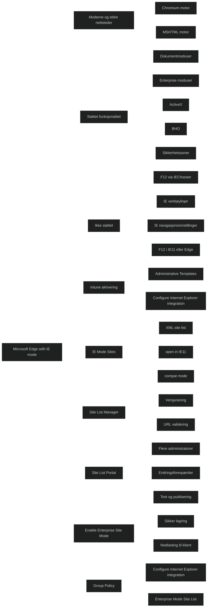

## [App Inventory Review](https://learn.microsoft.com/en-us/training/modules/administer-endpoint-applications/7-app-inventory-review/?ns-enrollment-type=learningpath&ns-enrollment-id=learn.wwl.examine-application-management)

Intune gir flere måter å overvåke status for apper som er tilordnet brukere eller enheter. Dette er viktig da admin må kunne kontrollere installasjoner, feilsøke problemer og sikre at apper er riktig distribuert. Intune viser oversikt over alle apper, installasjonsstatus, lisenser og oppdagede apper. Dette gir et helhetlig bilde av appmiljøet i organisasjonen.

#### Apps > Overview page

Viser alle apper i Intune og status for tilordning. Admin kan velge en app for å se detaljer om tilordninger og installasjonsstatus. Dette gir rask innsikt i om apper er distribuert som planlagt.

#### Apps > Monitor > App licenses page

Viser apper fra [Store](../../Glossary/Microsoft-Store.md) med tilhørende lisensinfo. Admin kan velge en app for å se detaljer om tilordning og installasjonsstatus. Dette er nyttig for å sikre at lisenser brukes riktig og at apper ikke overskrider lisensgrenser.

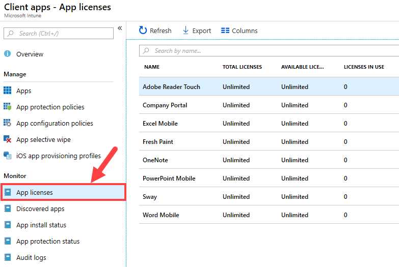

#### Apps > Monitor > Discovered apps page

Viser alle apper som Intune har oppdaget ved siste _Hardware Inventory_. 
For enheter med _Device Ownership_ satt til _Corporate_ vises alle installerte apper.
For enheter med _Device Ownership_ satt til _Personal_ vises apper installert via Company Portal eller apper installert som _Required_.
Listen viser hvor mange enheter som har en gitt app installert, og admin kan se hvilke enheter dette gjelder. 
Dette gir innsikt i faktisk appbruk.

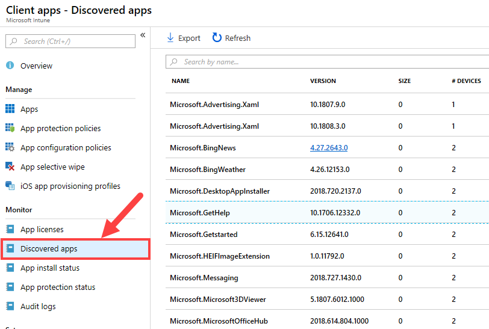

#### Apps > Monitor > App install status page

Viser alle apper i Intune med brukere og enhetsfeil. Admin kan velge en app for å se detaljer om tilordning og installasjonsstatus. Informasjon kan eksporteres til CSV for videre analyse. 
Dette er sentralt for feilsøking og rapportering.

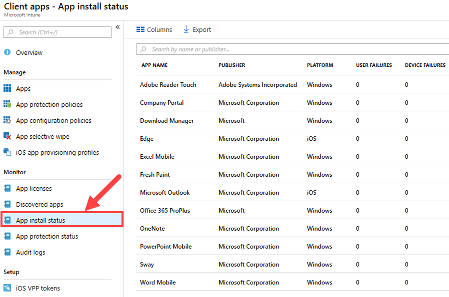

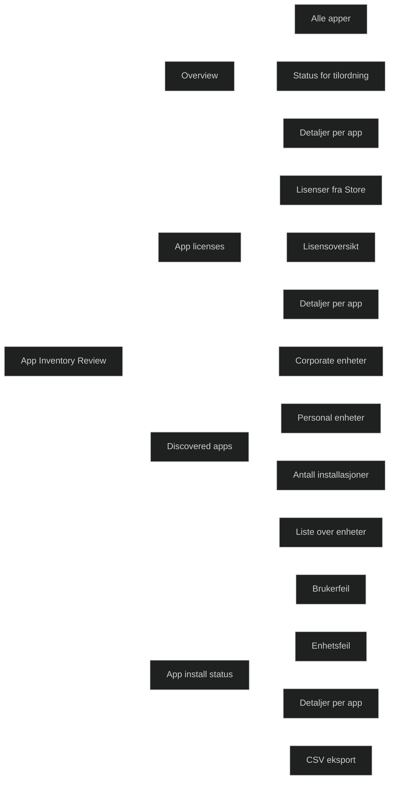

## [Module assessment](https://learn.microsoft.com/en-us/training/modules/administer-endpoint-applications/8-knowledge-check/?ns-enrollment-type=learningpath&ns-enrollment-id=learn.wwl.examine-application-management)

1. Microsoft Intune Mobile Application Manager (MAM) provides added capabilities to protect managed apps. What is the lifecycle for an Intune managed app?

	Deploy the app, Manage app updates, Monitor app installations, Selectively wipe the entire app

2. Contoso's IT department is wanting to assign an app to a device. What is a requirement they must meet before the app can be assigned to a device?

	The device must first be enrolled in Intune

## [Summary](https://learn.microsoft.com/en-us/training/modules/administer-endpoint-applications/9-summary/?ns-enrollment-type=learningpath&ns-enrollment-id=learn.wwl.examine-application-management)

Modulen beskriver hvordan apper administreres i Intune og hvilke verktøy som brukes for distribusjon, oppdatering og kontroll av apper i moderne Windows miljøer. Kjernen i modulen er at alle apper følger samme overordnede prosess: de legges til i Intune, tilordnes brukere eller grupper, konfigureres etter behov og overvåkes gjennom Intune sin rapportering. 

### Apps managed by Intune

Intune bruker en felles arbeidsflyt for alle apptyper. Administrator tilordner apper til brukere eller grupper, definerer installasjonsregler og følger med på status. Intune håndterer både moderne apper, Win32 apper, web apper og Microsoft Store apper. Dette gir en enhetlig administrasjonsmodell på tvers av plattformer.

### Devices that are not enrolled

Enheter som ikke er registrert i Intune kan fortsatt motta apper som gjøres tilgjengelige i Company Portal. Brukeren må selv installere appene og oppdateringene. Dette er viktig i BYOD scenarioer og når organisasjonen ønsker lavere administrasjonsnivå.

### Microsoft 365 apps

Microsoft 365 Apps er tilgjengelig direkte i Intune og kan distribueres til Windows og macOS. Intune håndterer installasjon, oppdateringer og fjerning. Alternativt kan administrator bruke Configuration Manager, Office Deployment Tool, Office Customization Tool eller la brukere installere selv fra Microsoft 365 portalen. Dette gir fleksibilitet i valg av distribusjonsmetode.

### Microsoft Edge with IE mode

Windows 11 bruker Microsoft Edge som standard nettleser. IE mode gjør det mulig å kjøre eldre webapplikasjoner som krever Internet Explorer 11. Moderne nettsteder bruker Chromium motoren, mens eldre nettsteder bruker MSHTML motoren. Bare nettsteder som er definert i en site list åpnes i IE mode. Dette gjør det mulig å modernisere nettleseropplevelsen uten å miste støtte for kritiske LOB apper.

### Monitoring

Intune gir oversikt over installasjonsstatus, versjoner, lisenser og oppdagede apper. Administrator kan se hvilke apper som er installert, hvilke som feiler og hvilke som mangler. Dette er sentralt for feilsøking og etterlevelse.

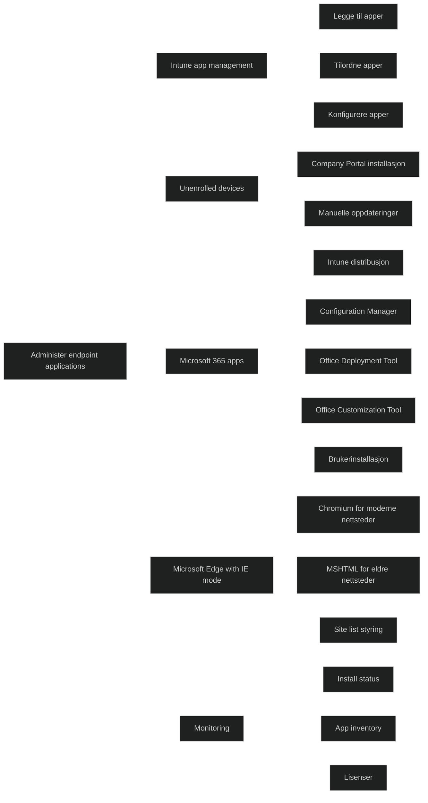

[Deploy Microsoft 365 Apps with Endpoint Configuration Manager (Current Branch)](https://learn.microsoft.com/en-us/deployoffice/deploy-office-365-proplus-with-system-center-configuration-manager)
[An overview of the Office Deployment Tool](https://learn.microsoft.com/en-us/deployoffice/overview-of-the-office-2016-deployment-tool)
[Manage software download settings in Microsoft 365](https://learn.microsoft.com/en-us/DeployOffice/manage-software-download-settings-office-365)
[Enterprise Mode Site List Portal](https://github.com/MicrosoftEdge/enterprise-mode-site-list-portal)