## [Introduction](https://learn.microsoft.com/en-us/training/modules/deploy-applications/1-introduction/?ns-enrollment-type=learningpath&ns-enrollment-id=learn.wwl.examine-application-management)

Modulen gir en oversikt over hvordan apper kan distribueres og administreres i en organisasjon ved hjelp av [Intune](../../Glossary/Microsoft-Intune.md), [Configuration Manager](../../Glossary/Microsoft-Configuration-Manager.md), GPO og [Microsoft Store Apps](../../Glossary/Microsoft-Store.md). Fokus er å gi admins ferdigheter til å håndtere ulike distribusjonsmetoder slik at apper kan leveres effektivt og sikkert til brukere. Dette er sentralt da appdistribusjon er en kjerneoppgave for en endepunktadmin.

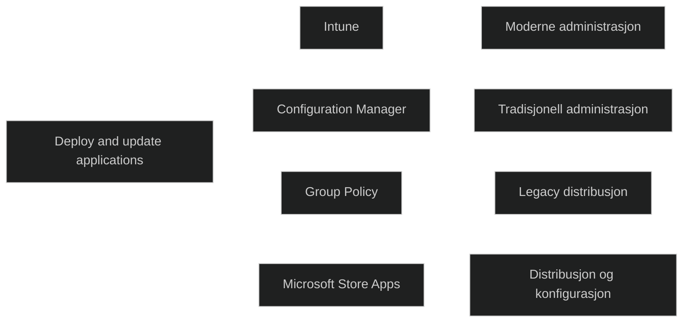

## [Deploy applications with Intune](https://learn.microsoft.com/en-us/training/modules/deploy-applications/2-deploy-applications-intune/?ns-enrollment-type=learningpath&ns-enrollment-id=learn.wwl.examine-application-management)

Intune brukes til å administrere apper som organisasjonens ansatte trenger. Det er et sentralt verktøy for å sikre at brukere får tilgang til nødvendige apper på tvers av ulike plattformer og både jobb og private enheter. Samtidig må sikkerhet ivaretas, og Intune gjør det mulig å distribuere, konfigurere, beskytte og fjerne apper gjennom hele livssyklusen

### Microsoft Intune app lifecycle

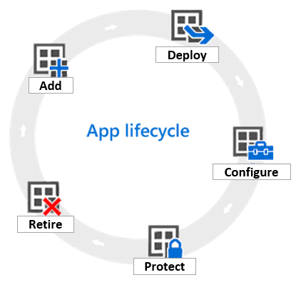

Appens livssyklus består av fem faser som admins må beherske. 

#### Add

- Identifisere apper som skal administreres
- Legge dem til i Intune
- Støtter [Line of Business Apps (LOB)](../../Glossary/Line-of-Business-Apps.md), butikkapper, innebygde apper og webapper

#### Deploy

- Tilordne apper til brukere og enheter
- Overvåke distribusjon i Intune admin center
- Støtte for synkronisering av volumkjøp fra Apple og Windows app stores

#### Configure

- Oppdatere apper når nye versjoner kommer
- Konfigurere ekstra funksjonalitet, f.eks.:
	- iOS app configuration polices
	- Mangaged browser polices

#### Protect

- Beskytte data i apper gjennom:
	- Conditional Access
	- App protection polices

Eksempler: blokkere kopiering mellom apper, hindre kjøring på jailbroken eller rooted enheter.

#### Retire

- Fjerne apper som ikke lenger skal brukes

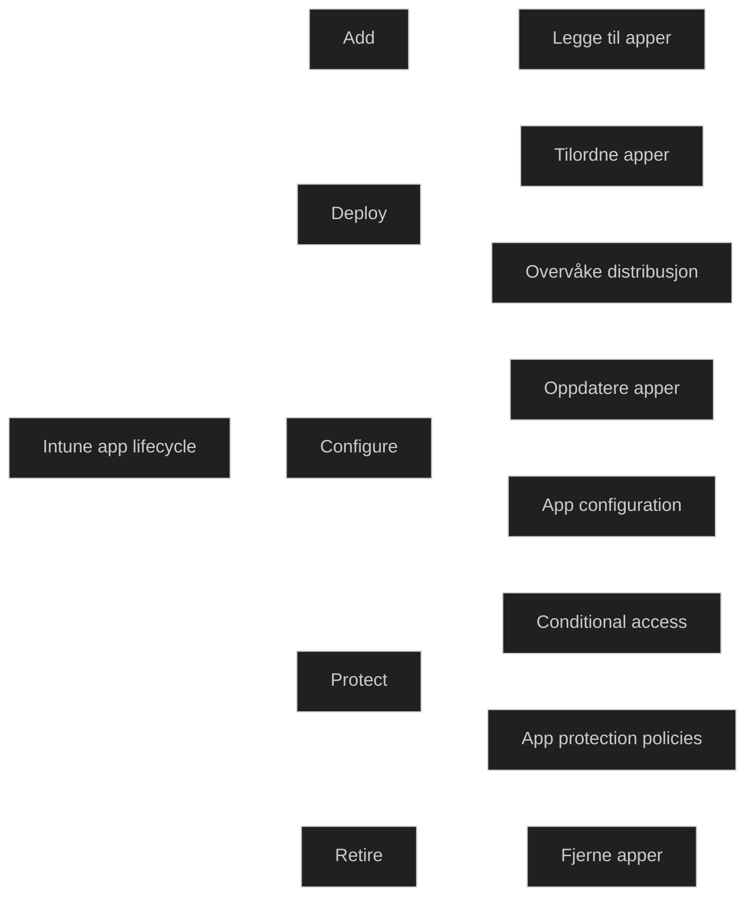

## [Add apps to Intune](https://learn.microsoft.com/en-us/training/modules/deploy-applications/3-add-apps-intune/?ns-enrollment-type=learningpath&ns-enrollment-id=learn.wwl.examine-application-management)

Før apper kan tilordnes, overvåkes, konfigureres eller beskyttes, må de legges til i Intune. Det krever at administratoren forstår hvilke app typer som finnes, hvilke plattformer som støttes, og hvilke behov organisasjonen har. Det må også vurderes om Intune skal administrere både enheter og apper, eller kun apper. Riktig app-type og distribusjonsmetode påvirker hele livssyklusen for apper i en bedrift.

Du kan legge til følgende app-typer i Intune:
### Store app

- Apper fra [Microsoft Store](../../Glossary/Microsoft-Store.md), [Apple Store App](../../Glossary/Apple-Store-App.md) eller [Google Play](../../Glossary/Google-Play.md)
- Leverandøren vedlikeholder og oppdaterer appen
- Velges direkte fra butikklisten og gjøres tilgjengelig for brukere

### Microsoft 365 apps

- Forenkler utrulling av Microsoft 365 apper på Windows og macOS
- Støtter også Project Online og Visio Pro dersom lisenser finnes
- Vises som en samlet app i Intune

### Weblink

- Web apper der serveren leverer grensesnitt, innhold og funksjonalitet
- Intune peker til webappen og tilordner brukere som får tilgang

### Built-in app

- Forhåndsdefinerte administrerte apper for iOS og Android
	- Eksempler: Excel, OneDrive, Outlook, Skype
- Vises som _Built-in iOS app_ eller _Built-in Android app_

### Line-of-business (LOB) app

- Interne apper som lastes opp som installasjonsfiler
- Støttede formater:
	- _Windows_: msi, appx, appxbundle, msix, msixbundle
	- _Android_: apk
	- _iOS_: ipa, intunemac

### Windows app (win32)

- Brukes for distribusjon av eksistrende _Win32 apper_
- Støtter msi, setup.exe, msp og andre formater
- Intune evaluerer krav før installasjon og varsler brukeren via _Windows Action Center_

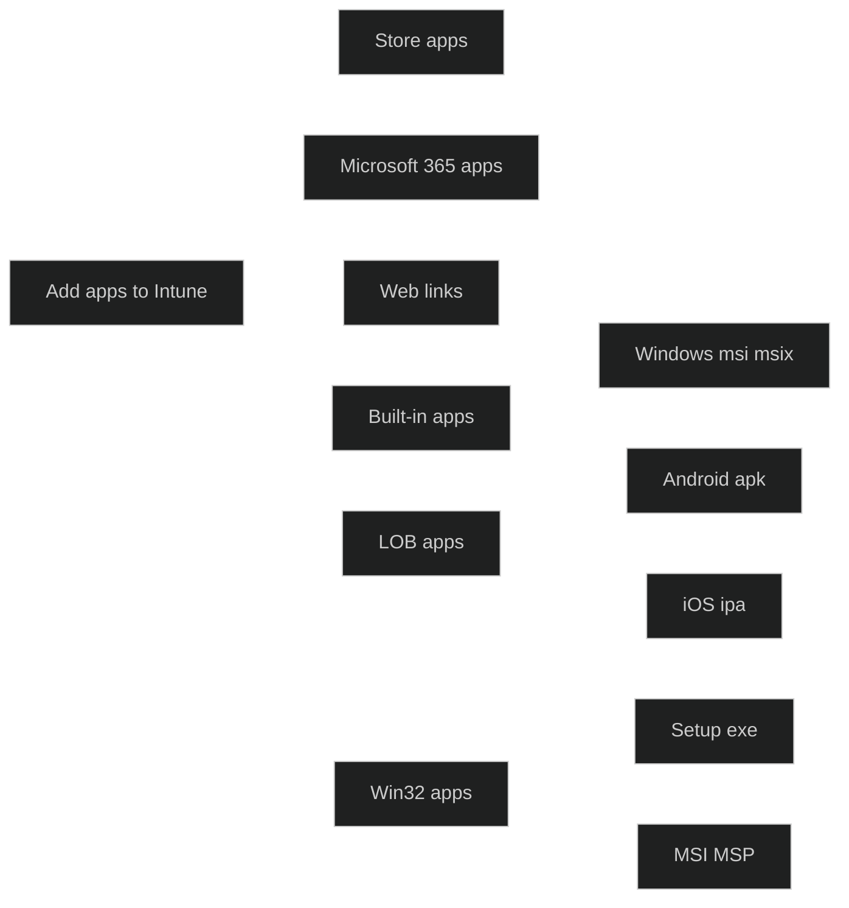

## [Manage Win32 apps with Intune](https://learn.microsoft.com/en-us/training/modules/deploy-applications/4-manage-window-32-apps-intune/?ns-enrollment-type=learningpath&ns-enrollment-id=learn.wwl.examine-application-management)

Intune støtter administrasjon av Win32 apper gjennom [Intune Management Extension](../../Glossary/Microsoft-Intune-Management-Extension.md). Dette gir mulighet til å distribuere mer komplekse apper enn tradisjonelle MSI filer. Det gir også fleksibilitet til å velge mellom Intune eller ConfigMgr for distribusjon. Win32 apper utgjør ofte hoveddelen av programvaren i en bedrift.

For å distribuere Win32 apper må følgende være oppfylt:
- Windows 10 v.1607 eller nyere
- Enheter må være Entra joined eller auto enrolled
- Max app størrelse på 30 GB 

Funksjoner som støttes:
- Både 32- og 64 bit apper
- Definering av avhengigheter og installasjonskrav
- Støtte for Entra joined, hybrid joined og group policy enrolled enheter

Før distribusjon må appen forberedes. [Win32 Content Prep Tool](../../Glossary/Win32-Content-Prep-Tool.md) (IntuneWinAppUtil.exe) brukes til å pakke appen i et _intunewin_ format. Verktøyet komprimerer installasjonsfiler og gjør dem klare for opplasting til Intune.

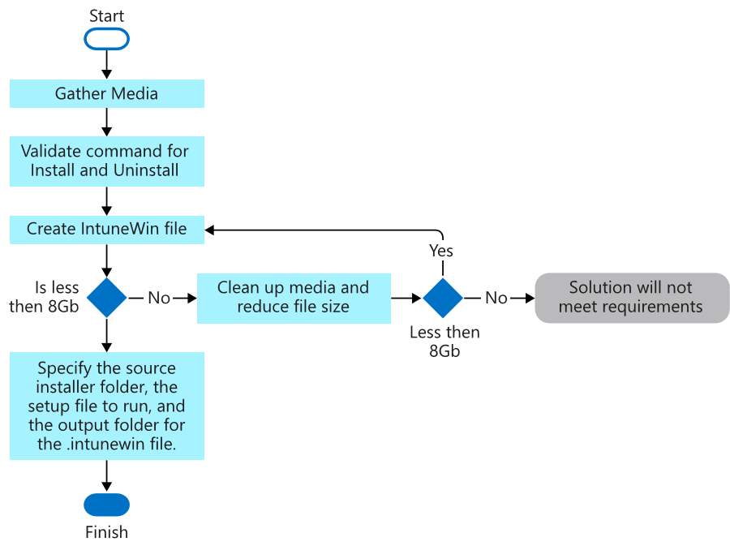

Prosessen for legge til en Win32 app:

- Velg Windows app Win32
- Last opp intunewin filen
- Fyll ut appinfo
- Definer installasjons- og avinstalleringskommandoer
- Angi krav om arkitektur, OS versjon og maskivare
- Legg til requirement rules
- Konfigurer detection rules
- Definer return codes
- Tilordne appen til brukere eller grupper

Delivery Optimization støttes, og varsler kan undertrykkes. Det anbefales å bruke Intune Management Extension eksklusivt dersom både Win32 og LOB apper distribueres under Autopilot.

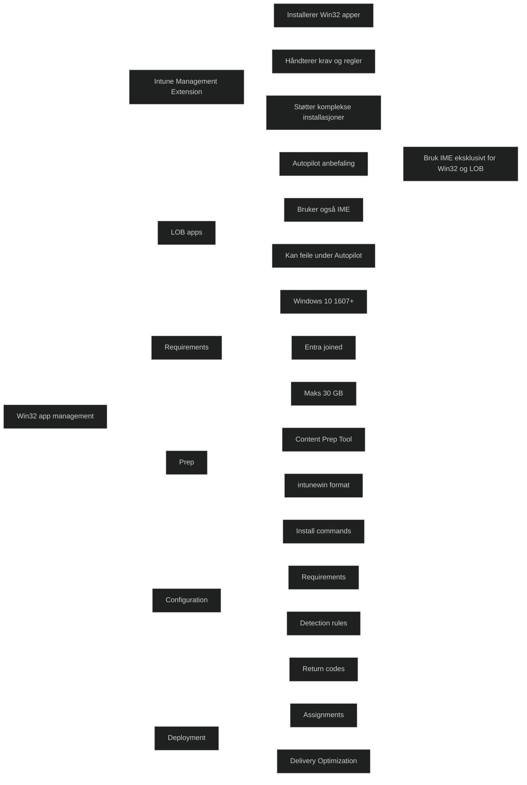

<a href="/certs/diagrams/deploy-intune-win32.html" target="_blank" rel="noopener">Stort diagram</a>

## [Deploy applications with Configuration Manager](https://learn.microsoft.com/en-us/training/modules/deploy-applications/5-deploy-applications-configuration-manager/?ns-enrollment-type=learningpath&ns-enrollment-id=learn.wwl.examine-application-management)

ConfigMgr gir mer fleksibilitet og kontroll enn GPO når apper skal distribueres. Begge følger samme arbeidsflyt, men ConfigMgr håndterer flere deler av livssyklusen. En app består av innhold og instruksjoner for installasjon, og kan inneholde flere [deployment types](../../Glossary/Deployment-types.md) som velges basert på krav. Admins må forstå hvordan apper struktureres, distribueres og vedlikeholdes i ConfigMgr.

### Application deployment in Configuration Manager

En applikasjon består av flere elementer; Deployment type, Requirements, Global conditions, Simulated deployment, Deployment applications, Purpose, Revisions, Detection method, Dependency, Supersedence, Application groups.

#### Deployment type

- Innholdet som installeres
- En applikasjon må ha minst en deployment type
- Flere deployment types kan brukes for ulike scenarier

#### Requirements

- Sikre at riktig deployment type installeres
	- Eksempel: OS må være Windows x64

#### Global condtions

- Brukes sammen med requirements for å definere tilpassede krav

#### Simulated deployment

- Tester krav, detection method og dependencies uten å installere

#### Deployment applications

- Angir install eller uninstall
- Ikke alle deployment types støtter uninstall

#### Purpose

- Required installerer etter planlagt tid
- Available gjør appen tilgjengelig i Software Center

#### Revisions 

- Endringer i applikasjonen lagres som revisjoner

#### Detection method

- Brukes for å avgjøre om appen allerede er installert

#### Dependency

- Krever at andre deployment types installeres først

#### Supersedence

- Brukes for å oppgradere eller erstatte apper

#### Application groups

- Brukes til å distribuere flere apper samlet

### Create an application in Configuration Manager

Prosessen innebærer å velge installasjonsfil, la ConfigMgr hente metadata, angi installasjonskommandoer og fullføre wizard. MSI-filer kan få parametere direkte i installasjonslinjen.

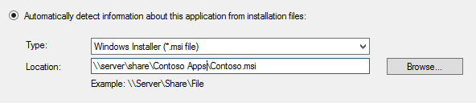

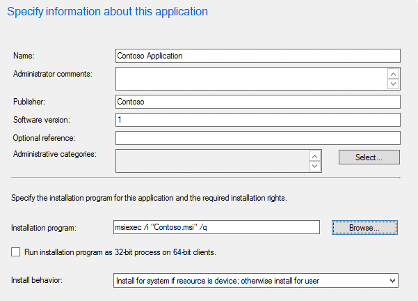

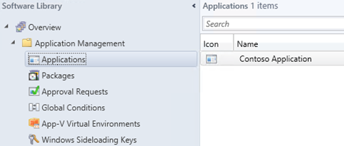

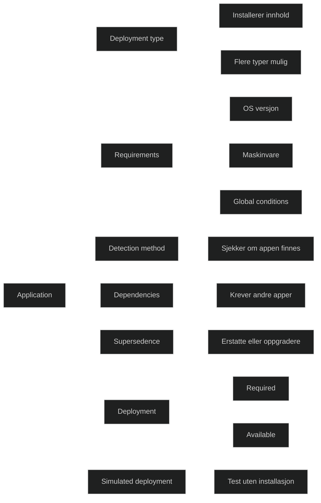

### Choose a solution for deploying an application

ConfigMgr og [Intune](../../Glossary/Microsoft-Intune.md) støtter ulike app typer:

- [Microsoft-Installer](../../Glossary/Microsoft-Installer.md) støttes av begge
- [IntuneWin](../../Glossary/IntuneWin.md) støttes kun av Intune
- [Office C2R](../../Glossary/Office-Click-to-Run.md) støttes av begge
- [MSIX](../../Glossary/MSIX.md) støttes av begge
- [Store apps](../../Glossary/Microsoft-Store.md) støttes kun av Intune
- Microsoft 365 Apps støttes kun av Intune
- App V støttes kun av ConfigMgr

For avansert konfigurasjon er ConfigMgr ofte mer egnet.

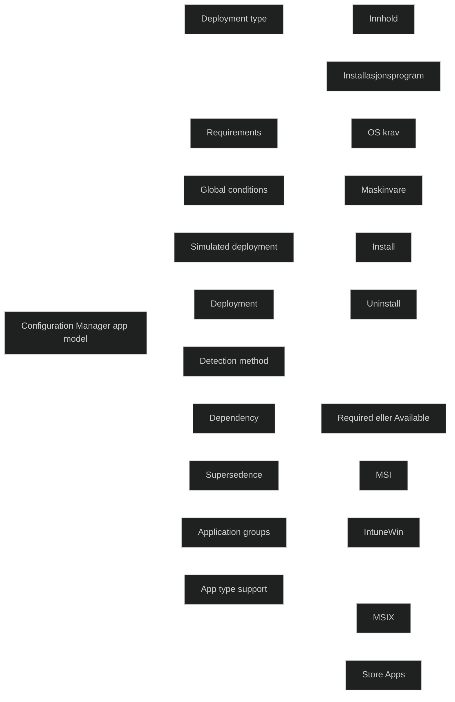

## [Deploying applications with Group Policy](https://learn.microsoft.com/en-us/training/modules/deploy-applications/6-deploy-applications-group-policy/?ns-enrollment-type=learningpath&ns-enrollment-id=learn.wwl.examine-application-management)

GPO kan brukes til å installere, vedlikeholde og fjerne apper i en organisasjon. Programvaredistribusjon skjer gjennom AD DS og Windows Installer, og kan brukes på brukere eller klienter i et site, domene eller OU. Dette gir en enkel måte å automatisere programarehåndtering på, men det har begrenset funksjonalitet sammenlignet med ConfigMgr og Intune. 

### Use Group Policy to manage the software lifecycle

Programvarens livssyklus består av fire faser: _preparation, deployment, maintenance_ og _removal_. GPO kan håndtere alle utenom _preparation_. 

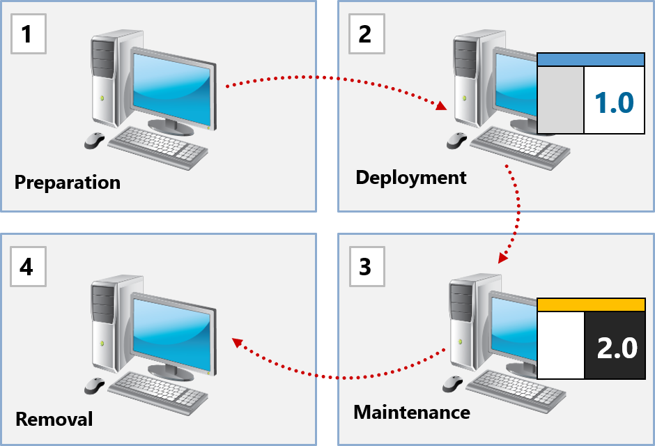
#### Fordeler
- Tilgjengelig uten ekstra kostander
- krever ikke klientprogramvare eller agenter
- rask og enkel å bruke

#### Ulemper

- Minimal funksjonalitet
- Ingen rapportering
- Kun [Microsoft-Installer](../../Glossary/Microsoft-Installer.md) støttes, andre formater må konverteres

### How Windows Installer enhances software distribution

Windows Installer (MSI) brukes til å installere og administrere MSI pakker. MSI inneholder en db med instruksjoner for installasjonen. Installer kjører med forhøyede rettigheter, gjør apper selvreparerende og krever kun lesetilgang til distribusjonspunktet. EXE filer må konverteres til MSI før distribusjon.

### Manage software upgrades by using Group Policy

Oppgraderinger kan håndteres ved å endre innstillinger i GPO som distribuerer programvaren.

- pakker kan redeployes hvis MSI er endret
- oppgraderinger fjerner ofte eldre versjoner og beholder innstillinger
- programvare som er distribuert via GPO kan også fjernes, enten obligatorisk eller valgfritt

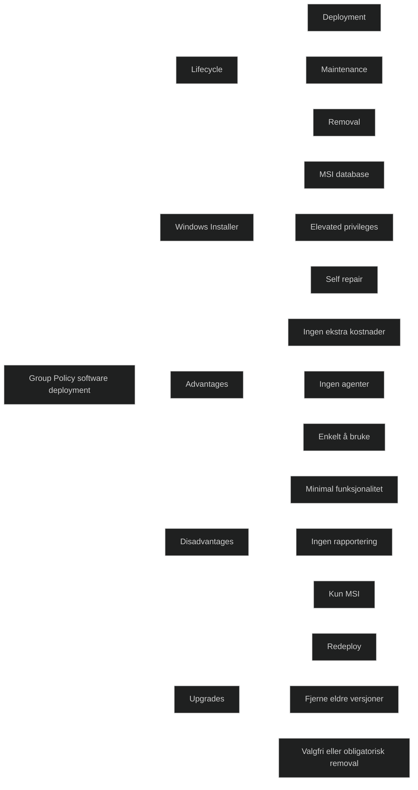

## [Assign and publish software](https://learn.microsoft.com/en-us/training/modules/deploy-applications/7-assign-publish-software/?ns-enrollment-type=learningpath&ns-enrollment-id=learn.wwl.examine-application-management)

Det finnes to måter å levere programmer gjennom GPO. Admins kan installere programvare for brukere/enheter ved å tilordne programvaren, eller gjøre den tilgjengelig for brukere ved å publisere den i AD DS. Programvare legges til i GPO ved å opprette en ny pakke i _Software Installation_ og  velge om den skal tilordnes eller publiseres. Det er også mulig å bruke avansert distribusjon for legge til tilpasningsfiler, f.eks. ved bruke av _Office Customization Tool_.

### Assign software

- Når programvare tilordnes en bruker, annonseres det i Start menyen ved pålogging
- Installasjonen starter først når brukeren åpner programmet eller en tilknyttet fil
- Programvare som tilordnes en bruker deles ikke mellom brukere
- Tilordning til bruker er egnet når programvaren kun skal brukes av enkelte brukere eller når lisenskostnaden må kontrolleres
- Når programvaren tilordnes en enhet, installeres den ved neste oppstart
- Programvaren blir tilgjengelig for alle brukere av enheten
- Tilordning til enhet er egnet når programvaren vil være tilgjengelig uavhengig av hvem som bruker enheten, f.eks agentprogramvare

### Publish software

- Publisert programvare annonseres i _Programs and Features_
- Brukere kan installere programvaren via _Install a program from the network_
- Installasjon kan også starte ved at brukeren åpner en filtype som er knyttet til programmet
- Programmet vises ikke for brukere som ikke har tillatelse til å installere dem
- Programvare kan ikke publiseres til enheter

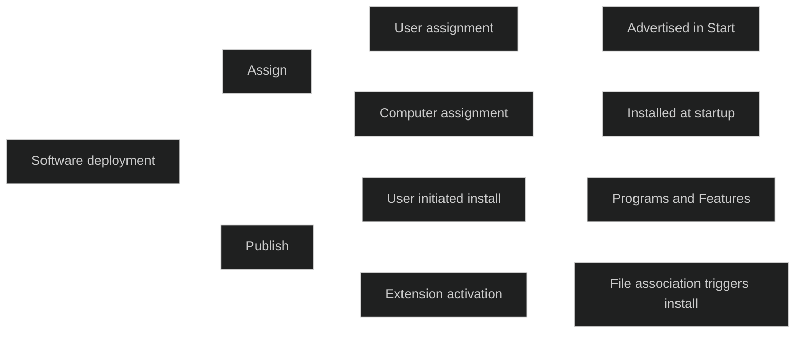

<a href="/certs/diagrams/deploy-gpo-app.html" target="_blank" rel="noopener">Stort diagram</a>

## [Explore Microsoft Store for Business](https://learn.microsoft.com/en-us/training/modules/deploy-applications/8-explore-microsoft-store-business/?ns-enrollment-type=learningpath&ns-enrollment-id=learn.wwl.examine-application-management)

Microsoft Store for Business ble brukt til å anskaffe apper til organisasjoner og synkronisere dem til Intune. Det var mulig å hente både gratis og betalte apper, synkronisere Online og Offline lisenser, overvåke lisensbruk og hindre installasjon dersom lisenser manglet. Lisenser kunne også tilbakekalles når brukere ble fjernet fra Microsoft Entra ID. Denne funksjonaliteten er ikke lenger tilgjengelig, og løsningen er faset ut. 
Moderne administrasjon skjer gjennom Microsoft Store integrasjonen i Intune.

Den nye Microsoft Store integrasjonen i Intune erstatter den gamle løsningen og gir forbedret funksjonalitet:

- Søk og bla gjennom apper direkte i Intune
- Overvåking av installasjonsstatus
- Støtte for Win32 store apps
- Støtte for system og bruker kontekst for [Universal Windows Platform (UWP)](../../Glossary/Universal-Windows-Platform.md) apper

###  Prerequisites

- Enheter må ha minst to prosessorkjerner
- Enheter må støtte [Intune Management Extension (IME)](../../Glossary/Microsoft-Intune-Management-Extension.md)
- Enheter må ha tilgang til Microsoft Store og innholdet som skal installeres

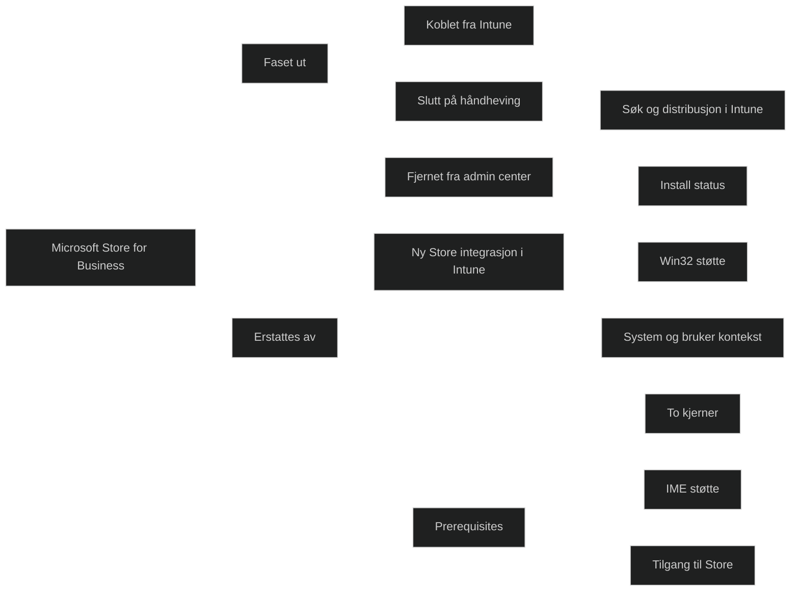

<a href="/certs/diagrams/deploy-store.html" target="_blank" rel="noopener">Stort diagram</a>

## [Implement Microsoft Store Apps](https://learn.microsoft.com/en-us/training/modules/deploy-applications/9-implement-microsoft-store-apps/?ns-enrollment-type=learningpath&ns-enrollment-id=learn.wwl.examine-application-management)

Moderne appdistribusjon i Windows skjer gjennom Intune og Store integrasjon. [Microsoft Store](../../Glossary/Microsoft-Store.md) integrasjon i Intune forenkler distribusjon og oppdateringer av apper. Den gir en sentralisert måte å søke etter, legge til og administrere apper på tvers av organisasjoner. Dette reduserer manuelt arbeid, sikrer at brukere får riktige apper og gjør det enklere å håndtere lisenser og oppdateringer. 

### Step 1: Add an app from the Microsoft Store

- Velg Microsoft Store i Intune
- Appopprettelse består av tre steg:
	- App informasjon
	- Assignments
	- Review + create

### Step 2: Search the Microsoft Store

- Søk etter apper basert på navn, utgiver, type eller store app ID
- Kolonner viser navn, utgiver og type (Win32 eller [Universal Windows Platform (UWP)](../../Glossary/Universal-Windows-Platform.md)
- Enkelte apper vises ikke på grunn av:
	- region
	- aldersbegrensning
	- betaling
	- Android format
	- finnes kun i Store for Business
- Når en app velges, fylles metadata automatisk inn
- Felter som støttes inkluderer:
	- navn
	- beskrivelse
	- utgiver
	- installer type
	- package identifier
	- install behavior
	- informasjon og personvern URL
	- developer
	- owner
	- notes
	- logo

### Step 3: Creating assignments

- Tre typer tilordning
	- Required
	- Available for enrolled devices
	- Uninstall
- Tilordning kan gjøres i grupper, alle brukere eller alle enheter
- Det kan settes varsler, frister og filtre for inkludering eller eksludering

### Step 4: Review and create

- Admins gjennomgår alle innstillinger
- Appen opprettes og legges til i Intune

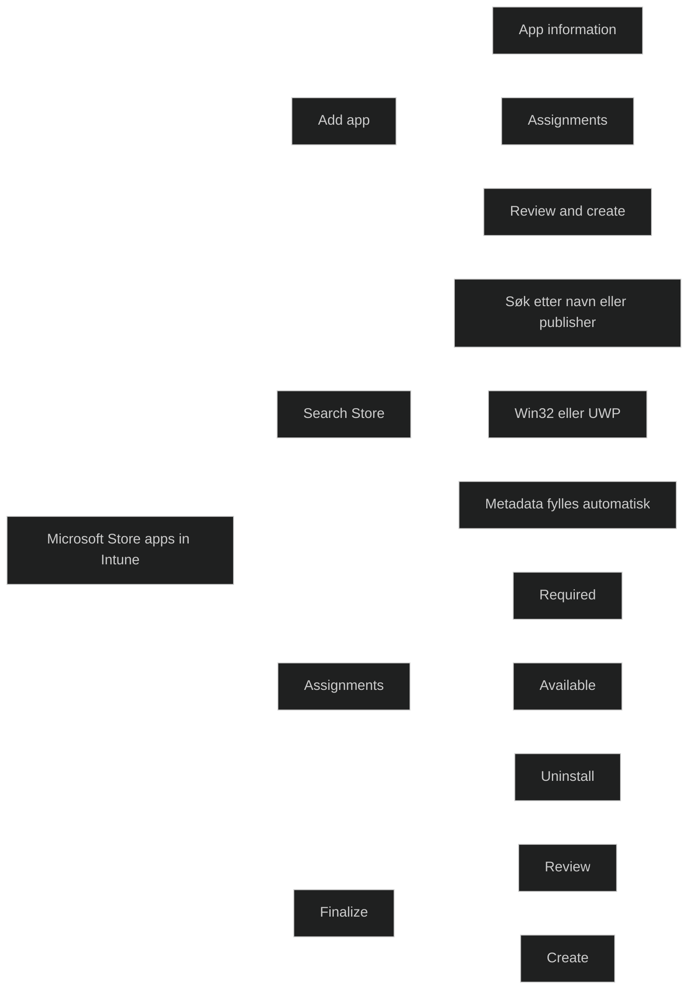

## [Update Microsoft Store Apps with Intune](https://learn.microsoft.com/en-us/training/modules/deploy-applications/10-update-microsoft-store-apps-intune/?ns-enrollment-type=learningpath&ns-enrollment-id=learn.wwl.examine-application-management)

Moderne administrasjon krever at apper holdes oppdatert uten manuelle prosesser. Oppdateringer er avgjørende for sikkerhet, stabilitet og kompatibilitet. Intune kan administrere oppdateringer for Store apper slik at brukere får nyeste versjon og beskyttes mot sårbarheter. 

### App  update

- Apper som distribueres fra Microsoft Store oppdateres automatisk
- For UWP apper må ikke policyen _Turn off Automatic Download and Install of updates_ vare aktivert

### Microsoft Store Win32 apps

- Win32 apper i Store er i _preview_
- Ikke alle Win32 apper er tilgjengelige eller søkbare
- Innhold hostes av leverandøren selv
- Hvis en app er installert fra før, tar Intune over administrasjonen når den distribueres som _Required_
- For _Available_ må brukeren installere via _Company Portal_ før Intune administrerer appen
- Intune forsøker ikke å reinstallere apper som allerede finnes
- Win32 apper kan bruke .exe eller .msi og støtter _User_ eller _System_ kontekst

### Intune management of Microsoft Store Win32 apps

- _Required_: Intune tar kontroll hvis appen finnes fra før
- _Available_: bruker må selv installere før Intune administrerer
- Eksternt hostet innhold krever at nettverkskrav er oppfylt

### Microsoft Store UWP apps

- Kan distribuere i systemkontekst
- Provisioned .appx installeres for alle brukere som logger inn
- Hvis en bruker avinstallerer appen i brukerkontekst, vises den fortsatt som installert pga. provisioning
- Appen må ikke være forhåndsinstallert
- Det anbefales å unngå blanding av installasjonskontekster

### Store group policies restrictions

Policyer kan påvirke distribusjon av Store apper. Viktige punkter:

- _Disable all apps form Microsoft Store_: må være _Not configured_ eller _Enabled_
- _Turn off Automatic Download and Install updates_: må være _Not configured_ eller _Disabled_
- _Enable App Installer Microsoft Store Source_: må være _Not configured_ eller _Enabled_
- _Turn off the Store application_: må være _Not configured_ eller _Disabled_
- _Only display the private store within the Microsoft Store_ kan brukes for å blokkere brukerinstallasjoner uten å blokkere Intune integrasjonen

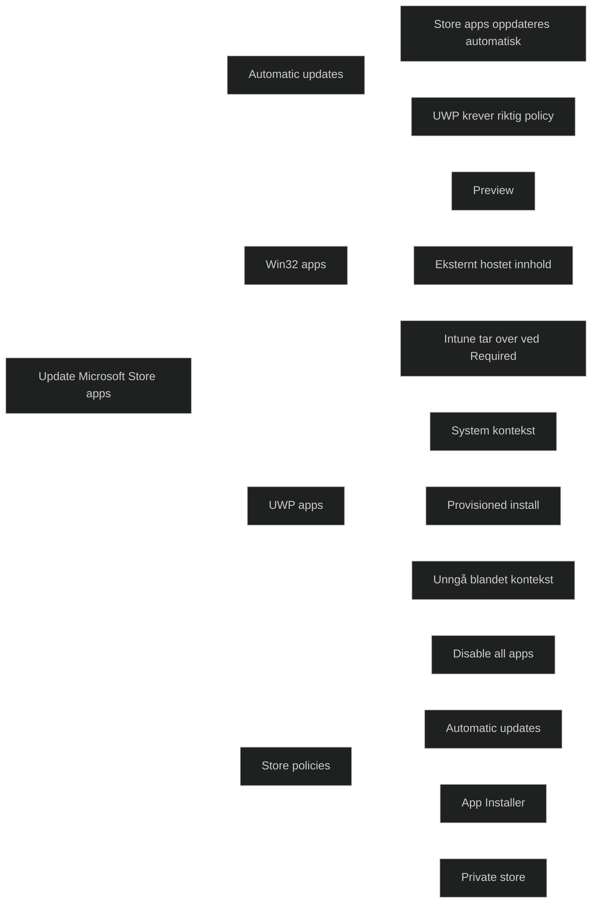

## [Assign apps to company employees](https://learn.microsoft.com/en-us/training/modules/deploy-applications/11-assign-apps-company-employees/?ns-enrollment-type=learningpath&ns-enrollment-id=learn.wwl.examine-application-management)

Det er viktig å å forstå tilordningsvalg, hvordan de påvirker installasjon, oppdatering og avinstallasjon. Når en app er lagt til i Intune, kan den tilordnes til brukere og enheter. Det er mulig å distribuere apper til enheter selv om de ikke er administrert av Intune. Dette gjør appdistribusjon fleksibel og muliggjør støtte for både administrerte og ikke-administrerte miljøer. 

### Viktig

- _Available for enrolled devices_ støttes for bruker- og enhetsgrupper på _[Android-Enterprise-fully-managed (COBO)](../../Glossary/Android-Enterprise-fully-managed.md)_ og _[Android-Enterprise-corporate-owned personally-enabled(COPE)](../../Glossary/Android-Enterprise-corporate-owned%20personally-enabled.md)_

Tabellen viser hvilke handlinger som støttes for enheter som er registrert og ikke-registrert i Intune

|Option|Devices enrolled with Intune|Devices not enrolled with Intune|
|---|---|---|
|Assign to users|Yes|Yes|
|Assign to devices|Yes|No|
|Assign wrapped apps or apps that incorporate the Intune SDK|Yes|Yes|
|Assign apps as Available|Yes|Yes|
|Assign apps as Required|Yes|No|
|Uninstall apps|Yes|No|
|Receive app updates from Intune|Yes|No|
|End users install available apps from the Company Portal app|Yes|No|
|End users install available apps from the web-based Company Portal|Yes|Yes|

### Note

- iOS og Android apper kan tilordnes til ikke-registrerte enheter
- Oppdateringer på ikke-registrerte enheter må installeres manuelt via Company Portal
- Available er vanligvis kun gyldig for brukergrupper
- Win32 apper kan tilordnes både bruker- og enhetsgrupper
- Pre-production apper på Android kan kreve en workaround med to grupper

### Assign apps

- Velg appen i Intune og åpne Assignments
- Tilgjengelige valg:
	- _Available for enrolled devices_: brukere kan installere via Comany Portal
	- _Available with or without enrollment_: brukere uten registrering kan installere
	- _Required_: appen installeres automatisk
	- _Uninstall_: appen fjernes hvis den tidligere er installert av Intune
- iOS støtter valg for håndtering ved fjerning av administrasjon  [App uninstall setting for iOS/iPadOS managed apps](https://learn.microsoft.com/en-us/mem/intune/apps/apps-deploy#app-uninstall-setting-for-ios-managed-apps)
- iOS støtter per app VPN  [VPN settings for iOS/iPadOS devices](https://learn.microsoft.com/en-us/mem/intune/configuration/vpn-settings-ios)
- iOS støtter valg for om Required apper kan fjernes av brukeren
- Android rapportering for _Available with or without enrollment_ gjelder kun registrerte enheter
- _Available for enrolled devices_ vises kun for primærbruker
- Det er mulig å inkludere og ekskludere grupper
- Intune støtter tilordning til nested groups

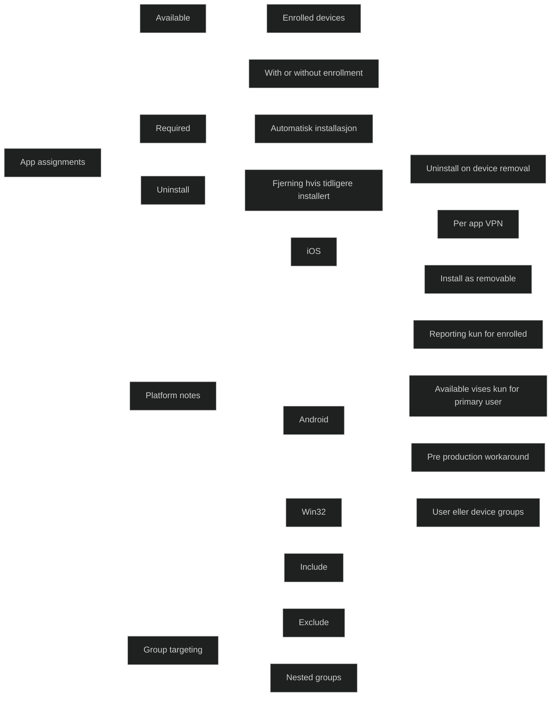

<a href="/certs/diagrams/deploy-app-assign.html" target="_blank" rel="noopener">Stort diagram</a>

## [Module assessment](https://learn.microsoft.com/en-us/training/modules/deploy-applications/12-knowledge-check/?ns-enrollment-type=learningpath&ns-enrollment-id=learn.wwl.examine-application-management)

1. A team member is trying to update a Microsoft Store Win32 app that was manually installed on their device. They're unsure if Intune will manage the update. What should they expect?

	Intune will take over the management of the app without needing to reinstall it.

2. A company's IT administrator needs to assign an app to a group of users whose devices aren't enrolled with Intune. Which option should the administrator select?

	Available with or without enrollment

3. An IT admin wants to manage the client apps that their company's workforce uses. They have identified the apps they want to manage and assign, and added them to Intune. What is the next step in the Microsoft Intune app lifecycle?

	Deploy the apps to users and devices.

## [Summary](https://learn.microsoft.com/en-us/training/modules/deploy-applications/13-summary/?ns-enrollment-type=learningpath&ns-enrollment-id=learn.wwl.examine-application-management)

Modulen beskriver hvordan apper distribueres og oppdateres i moderne og tradisjonelle Windows miljøer. Administratorer må forstå appens livssyklus, valg av distribusjonsmetode og hvordan Intune, Microsoft Store og eldre verktøy som Configuration Manager og Group Policy brukes i ulike scenarioer. 
### Moderne appdistribusjon med Intune

Intune er hovedverktøyet for distribusjon i moderne miljøer. Det støtter:

- Microsoft Store apper (UWP og Win32)
- Win32 apper pakket med Intune Management Extension
- iOS og Android apper
- Web apper og innebygde apper

Intune håndterer installasjon, oppdatering, avinstallasjon og tilordning til brukere eller enheter. Required installerer automatisk, Available gjør appen tilgjengelig i Company Portal, og Uninstall fjerner apper som tidligere er installert av Intune.

### Microsoft Store integrasjon

Den tidligere Microsoft Store for Business er faset ut. Den nye integrasjonen i Intune gir:

- søk og distribusjon direkte i Intune
- støtte for Win32 store apps
- automatisk oppdatering av apper
- støtte for system og bruker kontekst

Dette er nå standardmetoden for å hente og administrere Store apper.

### Win32 apper

Win32 apper krever Intune Management Extension (IME). Administratorer må definere:

- installasjons og avinstallasjonskommandoer
- detection rules
- return codes
- krav som OS versjon og arkitektur

IME brukes også under Autopilot, og det anbefales å bruke IME eksklusivt når både Win32 og LOB apper distribueres.

### Appdistribusjon med Configuration Manager

Configuration Manager gir mer avansert kontroll og brukes ofte i hybride miljøer. Viktige konsepter:

- deployment types
- requirements og global conditions
- detection methods
- dependencies og supersedence
- simulated deployment

Configuration Manager støtter MSI, MSIX, App V og enkelte andre formater, men ikke IntuneWin.

### Appdistribusjon med Group Policy

Group Policy kan installere MSI baserte apper i domene miljøer. Det støtter:

- assign til brukere eller datamaskiner
- publish til brukere
- enkel livssyklusadministrasjon

Det mangler rapportering, moderne formater og fleksibilitet, og brukes derfor kun i eldre miljøer.

### Oppdatering av apper

Intune håndterer oppdateringer automatisk for:

- Microsoft Store apper
- Win32 apper som leverandøren oppdaterer i Store
- iOS og Android apper via deres respektive butikker

For UWP apper må enkelte policyer ikke blokkere automatiske oppdateringer.

### Tilordning av apper

Tilordning styrer hvem som får appen og hvordan den installeres. Viktige punkter:

- Required, Available og Uninstall
- støtte for både bruker og enhetsgrupper
- plattformspesifikke begrensninger (for eksempel iOS per app VPN, Android reporting, Win32 user eller device)
- støtte for nested groups og inkluder eller ekskluder logikk

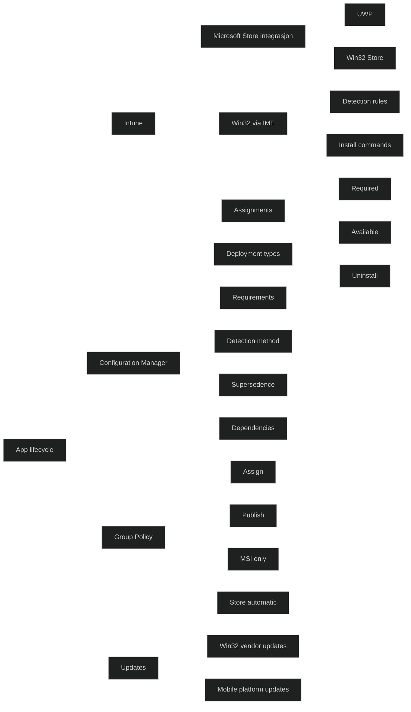

<a href="/certs/diagrams/" target="_blank" rel="noopener">Stort diagram</a>

[What is Microsoft Intune app management?](https://learn.microsoft.com/en-us/mem/intune/apps/app-management)
[Add Android store apps to Microsoft Intune](https://learn.microsoft.com/en-us/mem/intune/apps/store-apps-android)
[Add iOS store apps to Microsoft Intune](https://learn.microsoft.com/en-us/mem/intune/apps/store-apps-ios)
[Add Microsoft Store apps to Microsoft Intune](https://learn.microsoft.com/en-us/mem/intune/apps/store-apps-microsoft)
[Add built-in apps to Microsoft Intune](https://learn.microsoft.com/en-us/mem/intune/apps/apps-add-built-in)
[Intune Standalone - Win32 app management](https://learn.microsoft.com/en-us/mem/intune/apps/apps-win32-app-management)
[Using group policy to remotely install software in Windows server](https://learn.microsoft.com/en-us/troubleshoot/windows-server/group-policy/use-group-policy-to-install-software)