## [Introduction](https://learn.microsoft.com/en-us/training/modules/execute-mobile-application-management/1-introduction/?ns-enrollment-type=learningpath&ns-enrollment-id=learn.wwl.examine-application-management)

[Mobile Application Management (MAM)](../../Glossary/Mobile-Application-Management.md) beskrives som en sentral del av moderne administrasjon. Det handler om å bruke [Intune](../../Glossary/Microsoft-Intune.md) til å publisere, konfigurere, sikre og oppdatere mobilapper. MAM beskytter virksomhetsdata i apper gjennom policyer som hindrer datatap og kontrollerer hvordan data kan deles mellom apper. Dette gjelder både på BYOD og bedriftsenheter, siden MAM kan brukes uten at enheten er registrert i en MDM løsning.

Det legges vekt på at MAM gjør det mulig å sikre data selv når brukeren blander privat og jobbbruk på samme enhet. Policyer sørger for at data holdes innenfor godkjente apper og at tilgang kan begrenses ved behov. MAM kan brukes i både Intune og ConfigMgr, og modulen gir et grunnlag for å forstå hvordan disse løsningene håndterer appbeskyttelse.

### Supported platforms for app protection policies

MAM støtter _iOS_ og _Android_, mens Windows bruker [Windows-Information-Protection (WIP)](../../Glossary/Windows-Information-Protection.md)  for tilsvarende funksjonalitet.

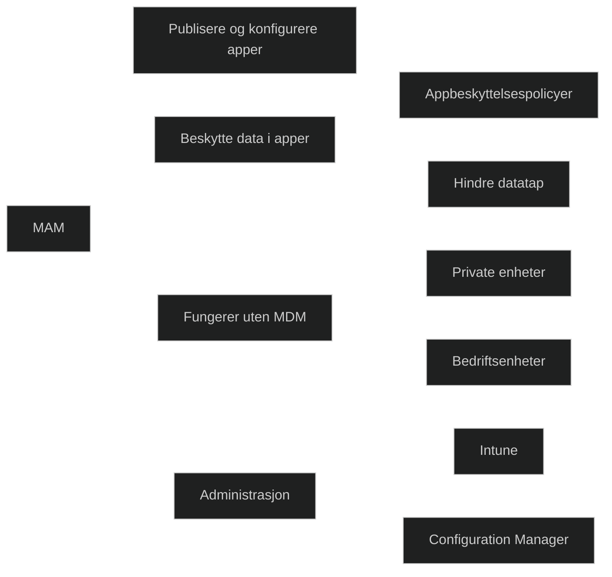

## [Examine mobile application management](https://learn.microsoft.com/en-us/training/modules/execute-mobile-application-management/2-examine-mobile-application-management/?ns-enrollment-type=learningpath&ns-enrollment-id=learn.wwl.examine-application-management)

Intune tilbyr policyer som sikrer apper og data uten at full administrasjon er nødvendig. Policyene kan:
- Begrense _kopiering, innliming_ og _lagring_ for å redusere risiko for datatap
- _Weblenker_ kan åpnes i [Intune Managed Browser](../../Glossary/Microsoft-Intune-Managed-Browser.md) for å hindre at bedriftsata behandles i mindre sikre apper
- _Multi-identity_ gjør det mulig å bruke både privat og jobbidentitet i samme app, og _appnivå conditional access_ sørger for at tilgang kun gis til autoriserte brukere.
- _Data loss prevention_ kan brukes uten å administrere hele brukers enhet
- _App protection_ kan også brukes på enheter som administreres av andre EMM løsninger

Intune tilbyr også en rapport som viser hvilke apper som søtter MAM, slik at administratorer kan følge opp appbeskyttelse.

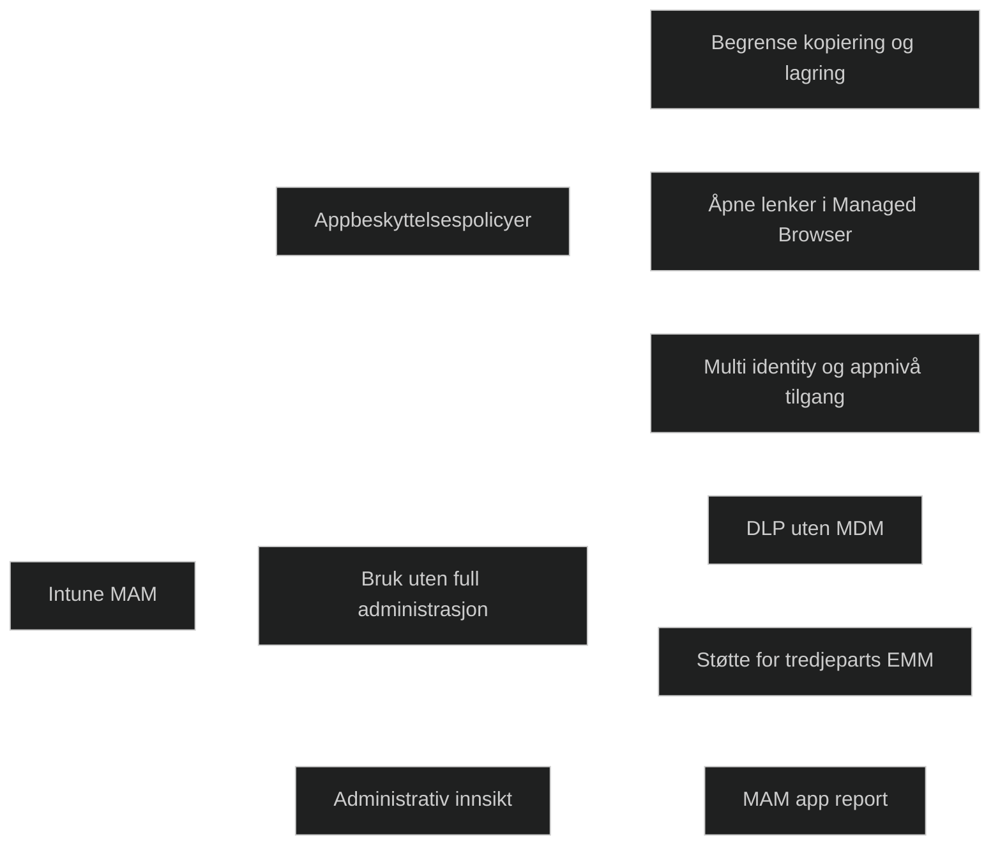

## [Examine considerations for mobile application management](https://learn.microsoft.com/en-us/training/modules/execute-mobile-application-management/3-examine-considerations-mobile-application-management/?ns-enrollment-type=learningpath&ns-enrollment-id=learn.wwl.examine-application-management)

Intune tilbyr policyer som sikrer apper og data uten krav om full administrasjon av enheten
- Intune tilbyr appbeskyttelsespolicyer som sikrer apper og data uten krav om full administrasjon
- Policyene kan begrense kopiering, innliming og lagring for å redusere risiko for datatap
- Weblenker kan åpnes i Intune Managed Browser for å hindre at bedriftsdata behandles i mindre sikre apper
- Multi identity gjør at brukere kan ha flere identiteter i samme app
- Appnivå conditional access sørger for at tilgang kun gis til autoriserte brukere
- Data loss prevention kan brukes uten å administrere hele brukerens enhet
- Appbeskyttelse kan brukes også på enheter som administreres av tredjeparts EMM løsninger

Intune tilbyr en rapport som viser hvilke apper som støtter MAM, slik at administratorer kan følge opp appbeskyttelse effektivt

## [Prepare line-of-business apps for app protection policies](https://learn.microsoft.com/en-us/training/modules/execute-mobile-application-management/4-prepare-line-of-business-apps-app-protection-policies/?ns-enrollment-type=learningpath&ns-enrollment-id=learn.wwl.examine-application-management)
Intune krever at LOB apper gjøres klar for policyer før de kan beskyttes. Dette kan gjøres enten ved å pakke inn appen med et verktøy eller ved å bygge støtte direkte inn i appkoden. Målet er at appen skal kunne motta og håndheve policyer, slik at bedriftsdata kan beskyttes uten at full administrasjon er nødvendig.

### Intune App Wrapping Tool

[Intune App Wrapping Tool](../../Glossary/Intune-App-Wrapping-Tool.md) legger et administrasjonslag rundt en eksisterende app uten at kildekoden må endres. Det brukes typisk for interne apper som distribueres utenfor offentlige appbutikker. 
Verktøyet krever riktig signering og har begrensninge, f.eks. støtte kun for bestemte plattformer og ikke for apper som allerede ligger Apple Store eller Google Play. 

Passer best for enklere apper som ikke oppdateres svært ofte.

### Intune App SDK

[Intune App SDK](../../Glossary/Intune-App-SDK.md) integreres direkte i appkoden og gir innebygget støtte for policyer. Dette gjør det mulig å publisere appen i appbutikker og likevel bruke Intune til å beskytte data. 
SDK egner seg for apper som oppdateres ofte, som har mer kompleks funksjonalitet, eller som skal brukes av mange brukere på tvers av organisasjoner. Krever utviklerkompetanse og kildekode, men gir mest fleksibilitet.

### Apps without app protection policies

Uten policyer kan bedriftsdata blandes med private data og lagres i ukontrollerte områder. Data kan flyte fritt mellom apper og lagringsplasser, noe som øker risiko for datatap. Policyer kan hindre lagring til lokal lagring og blokkere deling til apper som ikke er beskyttet.

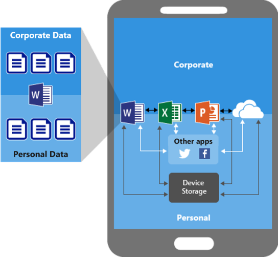

### Data protection with app protection policies

Policyer legger til et ekstra lag med beskyttelse. De kan begrense lagring, kontrollere klipp og lim, kreve PIN og blokkere kjøring på jailbroken/rooted enheter. De kan også slette bedriftsdata fra apper uten å fjerne selve appen.

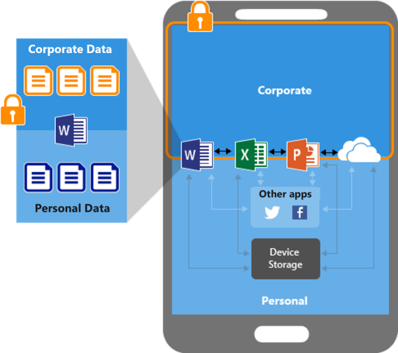

### Data protection with app protection on devices managed by Mobile Device Management solution

Når MDM brukes, kan Intune både administrere enheten og beskytte data i appene. MDM håndterer utrullingen av apper, compliance og konfigurasjon, mens policyer sikrer dataflyt og hindrer lekkasje til ikke-godkjente apper og tjenester.

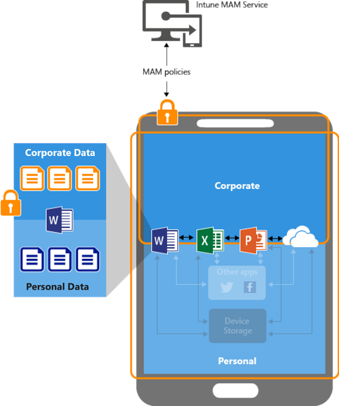

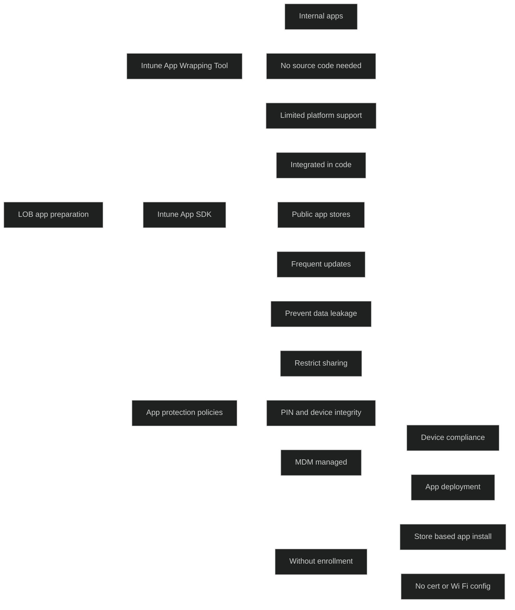

<a href="/certs/diagrams/mam-prep.html" target="_blank" rel="noopener">Stort diagram</a>

## [Implement mobile application management policies in Intune](https://learn.microsoft.com/en-us/training/modules/execute-mobile-application-management/5-implement-mobile-application-management-policies-intune/?ns-enrollment-type=learningpath&ns-enrollment-id=learn.wwl.examine-application-management)

Intune policyer kan brukes på apper på både administrerte og ikke administrerte enheter. Mange organisasjoner tillater brukere å benytte både Intune administrerte enheter private enheter som kun beskyttes med policyer. Siden policyene er knyttet til brukerens ID, gjelder de på tvers av registrerte og ikke-registrerte enheter. Det er vanlig å bruke strengere [Data Loss Prevention (DLP)](../../Glossary/Data-Loss-Prevention.md) kontroller på ikke-administrerte enheter og mer fleksible kontroller på administrerte enheter. Det er mulig å lage egne policyer for de ulike administrerte iOS/Android enhetene.

### Create and assign app protection policies

- I _Intune admin center_ velges _Apps_ og deretter _App protection policies_
- Det opprettes en ny policy og plattform velges
- _Basics_: navn og beskrivelse
- _Apps_: valg av pp typer og om policyen skal gjelde administrerte eller ikke-administrerte enheter
- _Data protection_: styrer hvordan data kan deles, om backup er tillatt, kopiering og liming, kryptering og utskrift
- _Access Requirements_: krav om PIN og andre autentiseringskrav
- _Conditional Launch_: styrer hva som skjer ved sikkerhetsbrudd, som for mange PIN forsøk eller jailbreak
- _Assignments_: policyen tildeles brukergrupper med Intune lisens
- _Review + create_: oppsummering før policyen opprettes

### Edit existing policies

Eksisterende policyer kan redigeres og endringene gjelder for brukere som allerede er målrettet. Brukere som er logget inn vil ikke se endringer før etter opptil åtte timer. For umiddelbar effekt må brukere logge ut og inn igjen. Selv om prosessen er lik for Android og iOS, finnes det forskjeller i tilgjengelige innstillinger.

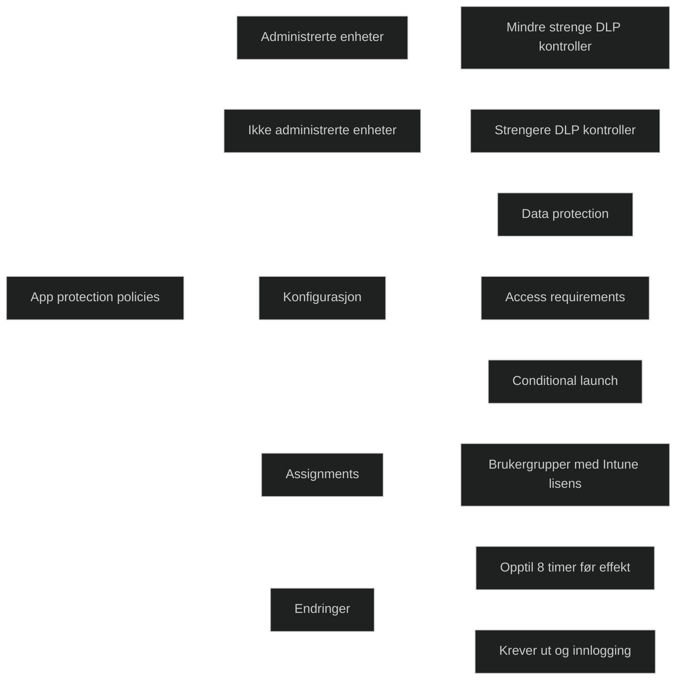

## [Manage mobile application management policies in Intune](https://learn.microsoft.com/en-us/training/modules/execute-mobile-application-management/6-manage-mobile-application-management-policies-intune/?ns-enrollment-type=learningpath&ns-enrollment-id=learn.wwl.examine-application-management)

Intune gir mulighet til å overvåke compliance av policyer som er tilordnet brukere. Det finnes tre visninger som gir innsikt i status, brukere som er berørt og evt. problemer
- Summary view
- Detailed view
- Reporting view

### Summary view

Rapportene finnes under _Intune admin center > Apps > Monitor > App protection status_

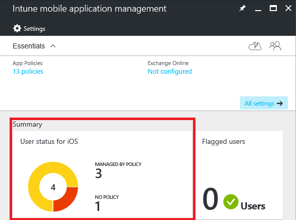

- _Assigned Users_ viser hvor mange brukere som bruker en app som er tilknyttet en policy i arbeidssammenheng
- _Flagged Users_ viser brukere som opplever problemer
- _User status for iOS and Android_ viser antall brukere per plattform som har brukt en app med tilordnet policy
- _No Policy_ visere brukere som bruker en app uten tilordnet policy
- _Top Protected iOS/iPadOS og Top Protected Android Apps_  viser de mest brukte appene og om de er beskyttet
- _Top Configured iOS/iPadOS Without Enrollment_ og _Top Configured Android Apps Without Enrollement_ viser de mest brukte appene på ikke-registrerte enheter som mottar appkonfigurasjon

### Detailed view

Denne visningen nås fra _Summary View_ og gir mer detaljert innsikt i brukere som er berørt av MAM policyer.

#### User status

- Viser en brukers enheter, apper med MAM policy og status
- _Checked in_ betyr at policyen er brukt minst en gang i arbeidssamenheng
- _Not checked in_ betyr at appen ikke er brukt etter at policyen ble tilordnet
- Det er mulig å søke etter en bruker og se detaljer om compliance 

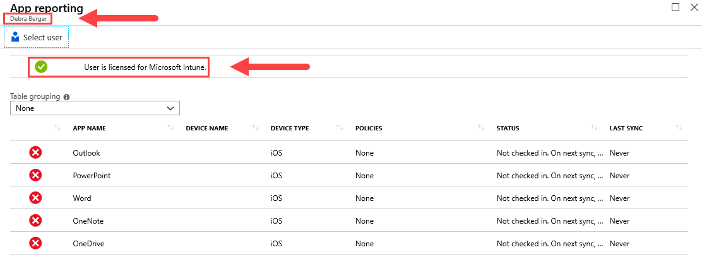

### Reporting view

Rapportene finnes under _Intune admin center > Apps > Monitor > App protection status > Reports_.

Rapportene gir innsikt basert på bruker og app.

- _User report_ viser appnavn, status, enheter, plattform, tilknyttede policyer og siste synkronisering
- _App report_ kan filtreres på plattform og app, og viser status som _Protected_ eller _Unprotected_
- _User status for managed MAM activity_ viser aktivitet for apper som er beskyttet
- _User status for unmanaged MAM activity_ viser aktivitet for apper som ikke mottar MAM policyer
- _User configuration report_ viser appkonfigurasjon for en valgt bruker
- _App configuration report_ viser hvilke brukere som har mottatt konfigurasjon for en valgt app

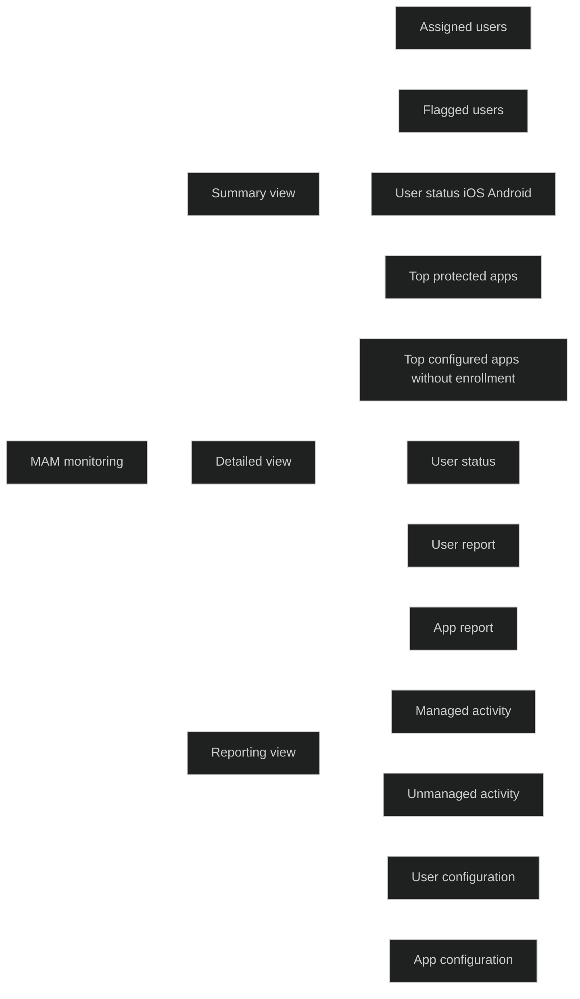

## [Module assessment](https://learn.microsoft.com/en-us/training/modules/execute-mobile-application-management/7-knowledge-check/?ns-enrollment-type=learningpath&ns-enrollment-id=learn.wwl.examine-application-management)

1. There are two types of Microsoft Intune Mobile Application Management (MAM) configurations that can be used to implement app-level policies. One type is Microsoft Intune Mobile Device Manager (MDM) with Microsoft Intune MAM. What is the second type?

	Microsoft Intune MAM without device enrollment

2. The Contoso IT department purchased licenses for an app built by another company. Contoso is deploying the application internally. They don't have access to the source code. Which tool would be best to use to support application protection policies?

	Intune App Wrapping tool

## [Summary](https://learn.microsoft.com/en-us/training/modules/execute-mobile-application-management/8-summary/?ns-enrollment-type=learningpath&ns-enrollment-id=learn.wwl.examine-application-management)

Modulen gir en samlet forståelse av Mobile Application Management og hvordan det brukes til å beskytte apper og data uten krav om full administrasjon. MAM gir fleksibel databeskyttelse i situasjoner der brukere benytter både administrerte og ikke administrerte enheter. Appbeskyttelsespolicyer kan brukes på apper uavhengig av om enheten er registrert i Intune, og de gir kontroll over dataflyt, tilgang og sikkerhet. MAM omfatter også funksjoner som databeskyttelse, appstyring og conditional access. Det er mulig å overvåke etterlevelse av MAM policyer i Intune, noe som gjør det enklere å følge opp brukere og apper som ikke oppfyller kravene. Modulen fremhever at MAM er en viktig del av moderne administrasjon fordi det gir beskyttelse av bedriftsdata uten å kreve full kontroll over brukerens enhet.

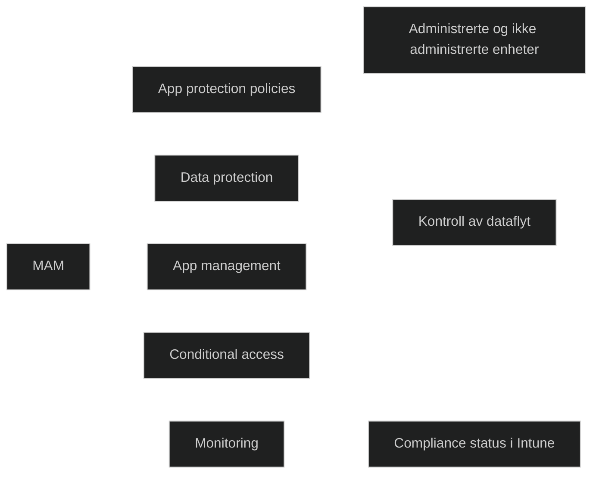