## [Introduction](https://learn.microsoft.com/en-us/training/modules/enroll-devices-use-intune/1-introduction)
Modulen gir en grunnleggende introduksjon til hvordan [Intune](../../Glossary/Microsoft-Intune.md) settes opp og konfigureres, administrerer enheter, og hvilke hensyn som må tas for ulike OS når de registres. 
Den gir også en oversikt over hvordan verifisering av enhetsinventar kan gjøres ved hjelp av Graph API og Power BI.

### Læringsmål
- Klargjøre Intune for enhetsregistrering
- Konfigurere automatisk registrering
- Forklare hvordan Windows, Android og iOS registreres
- Forstå når [Intune Enrollment Manager](../../Glossary/Microsoft-Intune-Enrollment-Manager.md) brukes
- Overvåke og utføre fjernhandlinger på registrerte enheter.

## [Manage mobile devices with Intune](https://learn.microsoft.com/en-us/training/modules/enroll-devices-use-intune/2-manage-mobile-devices-intune)
Du administrerer mobile enheter vi Intune admin center, som finnes på https://intune.microsoft.com/. Her er alle administrasjonsfunksjonene for brukere, grupper og enheter samlet. 
Brukere får tilgang til apper og kan registrere enheter via https://portal.manage.microsoft.com/, enten som webapp eller som app på Windows, iOS og Android.

### Device Managment Lifecycle
Livssyklusen, [DML](../../Glossary/Device-Managment-Lifecycle.md), for mobil enhetsadministrasjon består av fire faser
1. _Enroll_: Enheten registreres i Intune
2. _Configure_: Enheter sikres og konfigureres med policyer og automatiserte oppgaver
3. _Protect_: Intune overvåker compliance og distribuerer oppdateringer
4. _Retire_: Når enheten ikke lenger brukes, kan data fjernes via full eller selektiv sletting.

## [Enable mobile device management](https://learn.microsoft.com/en-us/training/modules/enroll-devices-use-intune/3-enable-mobile-device-management)
Mobile Device Management ([MDM](../../Glossary/Mobile-Device-Management.md)) i Intune er mekanismen som gjør det mulig å håndheve sikkerhet, konfigurere enheter og beskytte bedriftsdata på tvers av alle plattformtyper. 
MDM gir administratorer mulighet til å distribuere policyer som kryptering, passordkrav, WiFi profiler, VPN oppsett og sertifikater, samt overvåke compliance og fjernslette data ved tap eller tyveri.

MDM er for alle typer endepunkter, inkludert Windows PCer, macOS, iOS, iPadOS, Android, kiosker og dedikerte enheter.

Før enheter kan registreres må Intune settes som _MDM Authority_. Dette aktiverer Intune som den primære plattformen for enhetsadministrasjon.

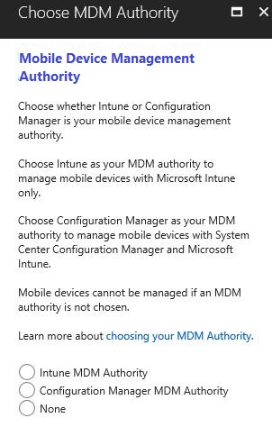

For Apple enheter kreves et _Apple MDM Push Certificate_. Dette gjør det mulig å kommunisere med Apple enheter. Apple-ID som benyttes må være organisasjons eid, ikke personlig!

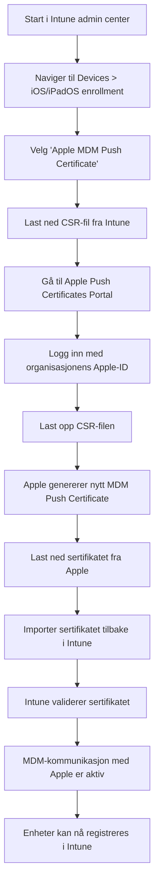
```mermaid

flowchart TD

A[Start i Intune admin center] --> B[Naviger til Devices > iOS/iPadOS enrollment]
B --> C[Velg 'Apple MDM Push Certificate']
C --> D[Last ned CSR‑fil fra Intune]

D --> E[Gå til Apple Push Certificates Portal]
E --> F[Logg inn med organisasjonens Apple‑ID]
F --> G[Last opp CSR‑filen]

G --> H[Apple genererer nytt MDM Push Certificate]
H --> I[Last ned sertifikatet fra Apple]

I --> J[Importer sertifikatet tilbake i Intune]
J --> K[Intune validerer sertifikatet]
K --> L[MDM‑kommunikasjon med Apple er aktiv]

L --> M[Enheter kan nå registreres i Intune]

```

## [Explain considerations for device enrollment](https://learn.microsoft.com/en-us/training/modules/enroll-devices-use-intune/4-explain-considerations-device-enrollment)
Det er noen viktige hensyn som må tas før enheter registreres i Intune. De ulike OSene har forskjellige krav, registreringsmetoder og avhengigheter.
Det må planlegges for 
- MDM autoritet
- Plattformspesifikke sertifikater
- Brukeropplevelse
- [Automatiseringsnivå]((https://learn.microsoft.com/en-us/intune/intune-service/user-help/enroll-windows-10-device)
- Sikkerhetskrav

### 1. MDM‑autoritet må være satt
- Intune må være konfigurert som _MDM Authority_ før noen enheter kan registreres.
- Dette er grunnlaget for all videre administrasjon.

### 2. Plattformene har ulike krav_
- _iOS/iPadOS/macOS_: krever _Apple MDM Push Certificate_.
- _Android_: valg mellom Android Enterprise (Work Profile, Fully Managed, Dedicated) eller AOSP.
- _Windows_: støtter Entra Join, Hybrid Join, Autopilot og manuell registrering.

### 3. Enhetseierskap påvirker registreringsmetode
- _BYOD_: Work Profile (Android), Company Portal (iOS/Windows).
- _Bedriftseid_: Autopilot, ADE (Apple), Android Enterprise Fully Managed.

### 4. Brukeropplevelse må planlegges
- Hvor mye brukeren må gjøre selv
- Om registreringen skal være helautomatisk (Autopilot/ADE) eller manuell
- Om enheten skal være personlig eller delt

### 5. Sertifikater og integrasjoner
- Apple‑sertifikatet må fornyes årlig og må bruke samme Apple‑ID.
- Android‑administrasjon krever valg av administrasjonsmodus.
- Windows‑registrering kan kobles til Entra ID og Autopilot.

### 6. Registreringsmetode bestemmer hva IT kan gjøre
- Compliance‑policyer
- App‑distribusjon
- Konfigurasjonsprofiler
- Fjernhandlinger (wipe, reset, lock)

## [Manage corporate enrollment policy](https://learn.microsoft.com/en-us/training/modules/enroll-devices-use-intune/5-manage-corporate-enrollment-policy)
Når bedriften registrerer seg for Intune, får den et standarddomene i [Entra ID](../../Glossary/Microsoft-Entra-ID.md): ditt-domene.onmicrosoft.com. Du kan legge til og verifisere egne domenenavn slik at brukere kan logge inn med sitt vanlige bedriftsdomene.

For å bruke eget domene må du
- legge til det til i _Microsoft admin center_
- opprette en _TXT post_ i DNS for å verifisere domenet

Når Intune er satt opp, kan du forenkle Windows enhetsregistrering ved å:
- Aktivere _automatisk MDM registrering_ (Krever Entra ID P1/P2)
- Opprette _CNAME-poster_ i DNS for å slippe at brukere må skrive inn MDM server manuelt
- Aktivere _bulk enrollment_ hvis mange enheter skal klargjøres samtidig

CNAME-poster som anbefales:
- _EnterpriseEnrollment.dittDomene_ --> enterpriseenrollment-s.manage.microsoft.com
- _EnterpriseRegistration.dittDomene_ --> enterpriseregistration.windows.net

Disse må verifiseres i Intune.

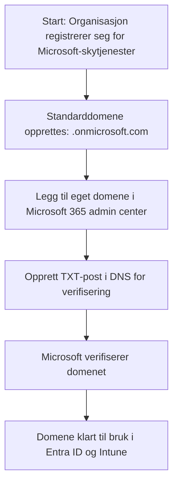
```mermaid

flowchart TD

A[Start: Organisasjon registrerer seg for Microsoft‑skytjenester] --> B[Standarddomene opprettes: <tenant>.onmicrosoft.com]

B --> C[Legg til eget domene i Microsoft 365 admin center]
C --> D[Opprett TXT‑post i DNS for verifisering]
D --> E[Microsoft verifiserer domenet]
E --> F[Domene klart til bruk i Entra ID og Intune]

```
_Domeneregistrering og verifisering (DNS + Entra ID)_

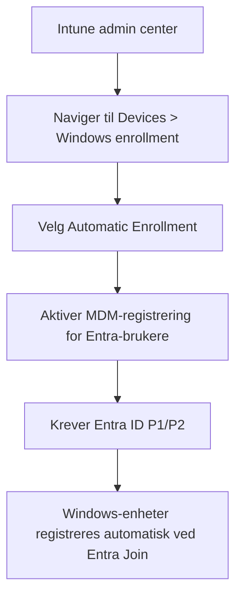
```mermaid

flowchart TD

A[Intune admin center] --> B[Naviger til Devices > Windows enrollment]
B --> C[Velg Automatic Enrollment]
C --> D[Aktiver MDM‑registrering for Entra‑brukere]
D --> E[Krever Entra ID P1/P2]
E --> F[Windows‑enheter registreres automatisk ved Entra Join]

```
_Aktivering av automatisk MDM registrering (Windows)_

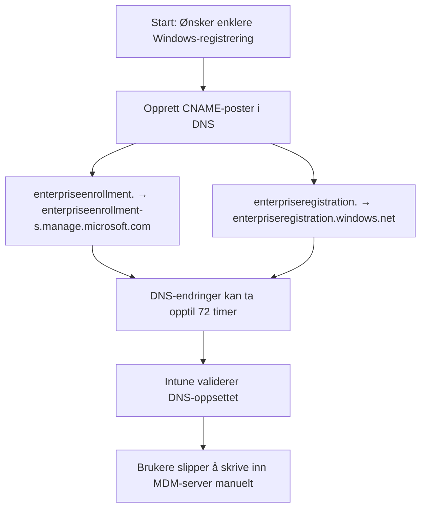
```mermaid

flowchart TD

A[Start: Ønsker enklere Windows‑registrering] --> B[Opprett CNAME‑poster i DNS]

B --> C1[enterpriseenrollment.<domene> → enterpriseenrollment-s.manage.microsoft.com]
B --> C2[enterpriseregistration.<domene> → enterpriseregistration.windows.net]

C1 --> D[DNS‑endringer kan ta opptil 72 timer]
C2 --> D

D --> E[Intune validerer DNS‑oppsettet]
E --> F[Brukere slipper å skrive inn MDM‑server manuelt]

```
_DNS-CNAME oppsett for sømløs registrering._
## [Enroll Windows devices in Intune](https://learn.microsoft.com/en-us/training/modules/enroll-devices-use-intune/6-enroll-windows-devices-intune)
Registrering av Windows enheter i Intune kobler enheten til Intune slik at den kan motta policyer, profiler, apper, WiFi, epost, sikkerhetsinnstillinger. Det fungerer både for _personlige_ og _bedriftseide_ enheter. Dette gir IT kontroll uten å få tilgang til brukerns private data.

### Enrolling Windows devices
1. _Add work or school account_: [Entra Join](../../Glossary/Microsoft-Entra-Join.md.md) via _Innstillinger_. Auto-enrollment hvis P1/P2 er aktivert. 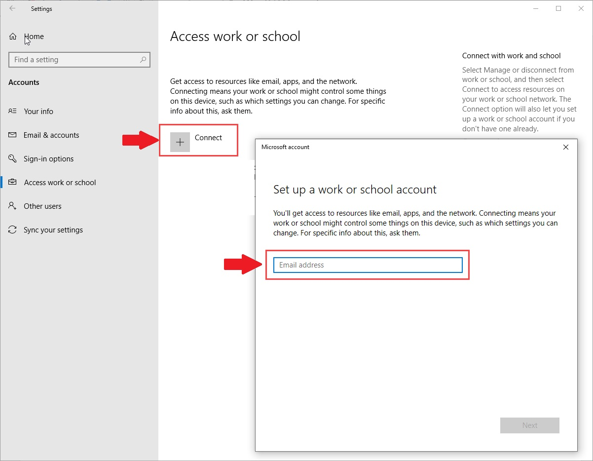
2. _Enroll in MDM only (user-driven)_: Kun Intune registrering, ikke Entra Join. Brukes når man ikke har P1/P2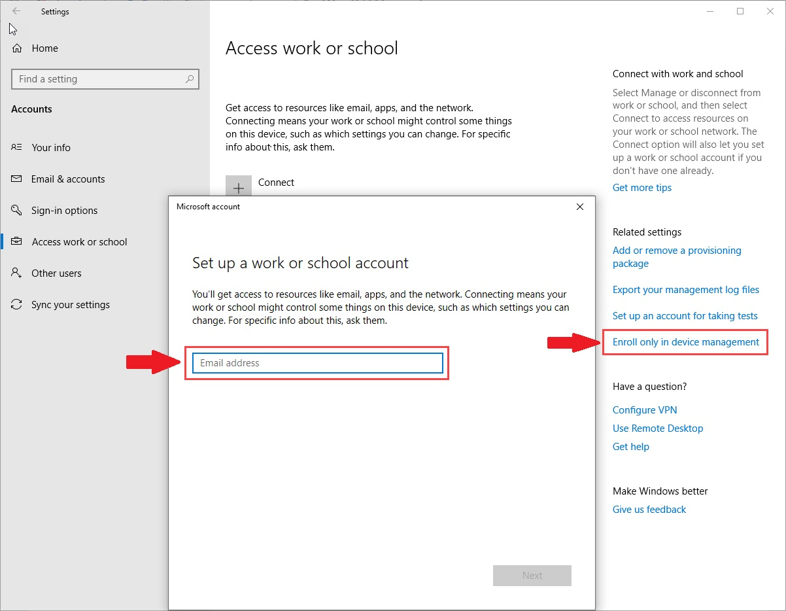
3. _Entra Join (OOBE)_: Brukeren velger _Set up for an organization_ under første oppstart. Auto-enrollment hvis aktivert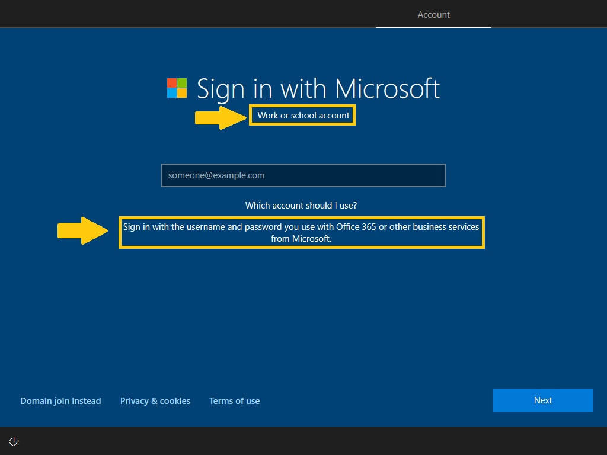
4. _Autopilot – user driven_: Tilpasset OOBE, færre steg for brukeren. Krever P1/P2 og auto-enrollment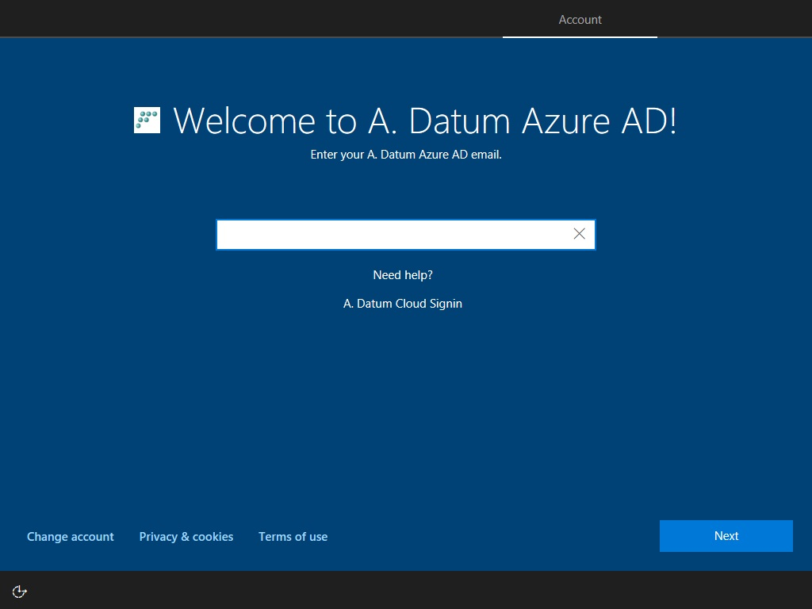
5. _Autopilot – self-deploying_: Fullt automatisert OOBE uten brukerinteraksjon. For kiosker og delte enheter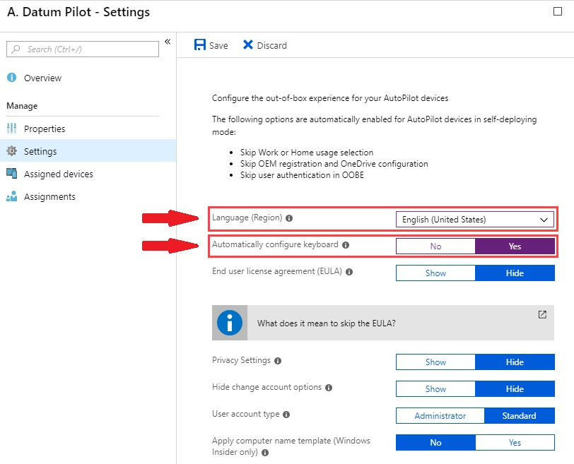
6. _MDM only via Device Enrollment Manager ([DEM](../../Glossary/Microsoft-Intune-Enrollment-Manager.md))_: IT registrerer og klargjør enheter før utlevering. DEM-konto kan registrere opptil 1000 enheter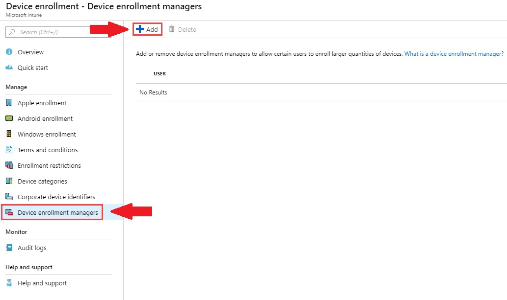
7. _Co-management_: Enheter som allerede styres av ConfigMgr kan samtidig registreres i Intune
8. _Entra Join / Bulk enrollment_: Bruker provisioning package for å registrere mange enheter uten re-imaging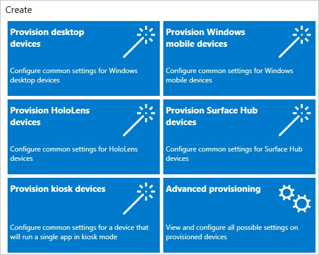

## [Enroll Android devices in Intune](https://learn.microsoft.com/en-us/training/modules/enroll-devices-use-intune/7-enroll-android-devices-intune)
Både BYOD og bedriftseide Android enheter kan registreres i Intune. 
1. _BYOD registrering_
	1. Brukeren installerer _Intune Company Portal_ fra Google Play
	2. Logger inn med jobb/skole konto og følger veiviseren
	3. Opplevelsen varierer basert på hvilke policyer som er tildelt brukeren/enheten

Det finnes tre måter å håndtere Android i en organisasjon
1. _Work Profile (BYOD)_
	1. Oppretter en _separat jobbprofil_ på enheten
	2. IT administrerer kun jobbprofilen, ikke den private delen
	3. Bruker kan installere hva de vil privat
	4. Kun støttet på kompatible Android enheter
2. _Dedicated (bedriftseid, en funksjon)_
	1. For kiosker, digital signage, billettscanning, lager etc
	2. Låst ned til et begrenset sett med apper og handlinger
	3. Bruker kan ikke installere egne apper eller endre instillinger
3. _Fully Managed (bedriftseid, en bruker)_
	1. Hele enheten administreres av IT
	2. Ingen privat bruk, kun jobbrelatert
	3. Gir tilgang til strengere policyer enn Work Profile

For å bruke Android Enterprise må du:
- koble til Intune-tenant til _[Managed-Google-Play](../../Glossary/Managed-Google-Play.md)_
- Opprett et _enrollment-profil_ basert på valgte administrasjonsmetode (Work Profile, Dedicated, Fully Managed)

[Enroll Android devices](https://learn.microsoft.com/en-us/intune/intune-service/user-help/enroll-device-android-company-portal)
## [Enroll iOS devices in Intune](https://learn.microsoft.com/en-us/training/modules/enroll-devices-use-intune/8-enroll-ios-devices-intune)
Både personlige og bedriftseide iOS enheter kan registreres i Intune.

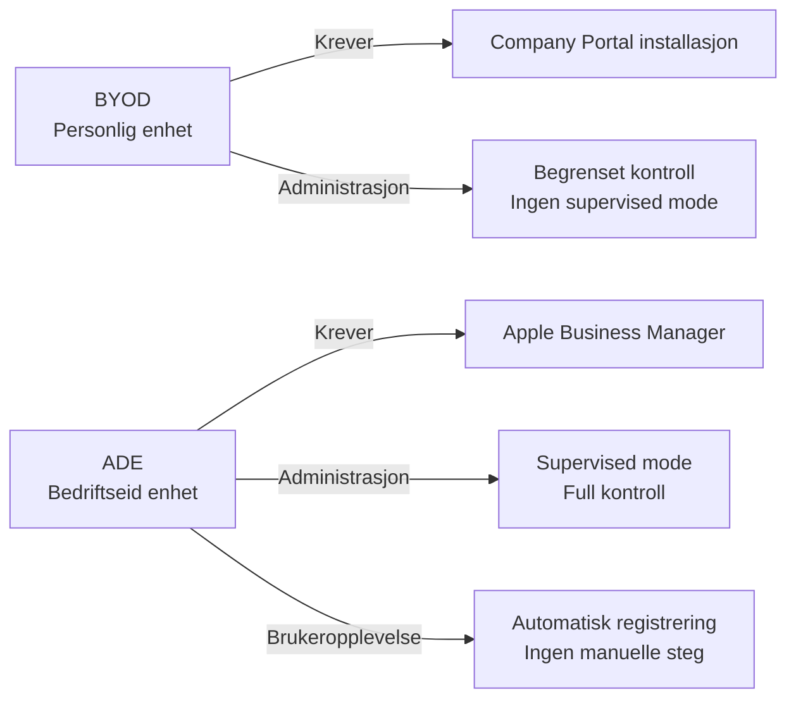
```mermaid

flowchart LR

BYOD[BYOD<br/>Personlig enhet] -->|Krever| CP[Company Portal installasjon]
BYOD -->|Administrasjon| WP[Begrenset kontroll<br/>Ingen supervised mode]

ADE[ADE<br/>Bedriftseid enhet] -->|Krever| ABM[Apple Business Manager]
ADE -->|Administrasjon| SUP[Supervised mode<br/>Full kontroll]
ADE -->|Brukeropplevelse| AUTO[Automatisk registrering<br/>Ingen manuelle steg]

```

Brukere med BYOD kan installere _Intune Company Portal_ fra App Store og følge veiviseren for å registrere enheten. Opplevelsen varierer basert på hvilke policyer som er tildelt brukeren.

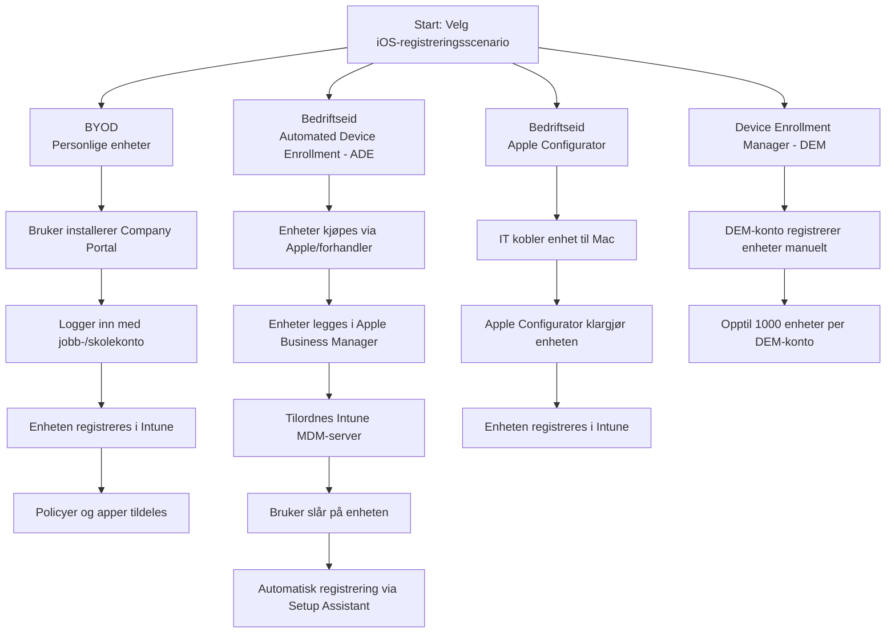
```mermaid

flowchart TD

A[Start: Velg iOS‑registreringsscenario] --> B1[BYOD<br/>Personlige enheter]
A --> B2[Bedriftseid<br/>Automated Device Enrollment - ADE]
A --> B3[Bedriftseid<br/>Apple Configurator]
A --> B4[Device Enrollment Manager - DEM]

%% BYOD
B1 --> C1[Bruker installerer Company Portal]
C1 --> D1[Logger inn med jobb-/skolekonto]
D1 --> E1[Enheten registreres i Intune]
E1 --> F1[Policyer og apper tildeles]

%% ADE
B2 --> C2[Enheter kjøpes via Apple/forhandler]
C2 --> D2[Enheter legges i Apple Business Manager]
D2 --> E2[Tilordnes Intune MDM‑server]
E2 --> F2[Bruker slår på enheten]
F2 --> G2[Automatisk registrering via Setup Assistant]

%% Configurator
B3 --> C3[IT kobler enhet til Mac]
C3 --> D3[Apple Configurator klargjør enheten]
D3 --> E3[Enheten registreres i Intune]

%% DEM
B4 --> C4[DEM‑konto registrerer enheter manuelt]
C4 --> D4[Opptil 1000 enheter per DEM‑konto]

```

For bedriftseide enheter støttes flere metoder
- Apple Business Manager (ABM)
- Automated Device Enrollment (ADE)
- Apple School Manager
- Apple Configurator
- Device Enrollment Manager (DEM)

Apples Device Enrollment Program (DEP/ADE) gjør det mulig å konfigurere og registrere enheter automatisk uten at bruker trenger å installere noe eller gjøre manuelle steg. Enheter kan sendes direkte til brukere og vil registreres i Intune ved første oppstart.

_[Apple-Supervised-Mode](../../Glossary/Apple-Supervised-Mode.md)_ gir flere administrasjonsmuligheter og anbefales for alle bedriftseide enheter. Fra iOS 11 og nyere er _unsupervised mode_ avviklet.

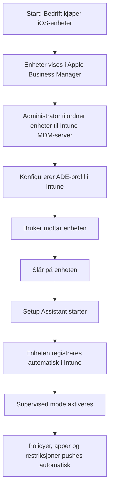
```mermaid
	  
	  flowchart TD

A[Start: Bedrift kjøper iOS‑enheter] --> B[Enheter vises i Apple Business Manager]
B --> C[Administrator tilordner enheter til Intune MDM‑server]
C --> D[Konfigurerer ADE‑profil i Intune]
D --> E[Bruker mottar enheten]
E --> F[Slår på enheten]
F --> G[Setup Assistant starter]
G --> H[Enheten registreres automatisk i Intune]
H --> I[Supervised mode aktiveres]
I --> J[Policyer, apper og restriksjoner pushes automatisk]
```

[Automatically enroll iOS devices with Apple's Device Enrollment Program](https://learn.microsoft.com/en-us/intune/intune-service/enrollment/tutorial-use-device-enrollment-program-enroll-ios)
## [Explore device enrollment manager](https://learn.microsoft.com/en-us/training/modules/enroll-devices-use-intune/9-explore-device-enrollment-manager)
En [DEM](../../Glossary/Microsoft-Intune-Enrollment-Manager.md)-konto er:
- en _spesiell Intune brukerkonto_ som kan registrere opptil 1000 enheter
- brukes når IT skal klaregjøre mange enheter før de deles ut til brukere
- DEM kontoen logger inn på enheten og registrerer den via Company Portal
- DEM registrerte enheter regnes som _shared devices_, ikke personlige

DEM brukes når 
- enheter skal klargjøres før de gis til sluttbrukere
- enheter ikke skal knyttes til en bestemt bruker
- enheter brukes i kiosk, butikk, lager, skole, helse, frontline miljøer
- du trenger en rask måte å registrere mange enheter uten at brukere må gjøre det selv

DEM er _ikke_ egnet når
- Enheten trenger brukerspesifikke profiler som:
	- Epostprofiler
	- Sertifikater
	- WiFi profiler med brukerautentisering
- Enheten skal være personlig eid eller personlig konfigurert
- Du bruker _Apple ADE/DEP, Apple Configurator_ eller _Apple School Manager_
- Du trenger _supervised mode_ på iOS (DEM støtter ikke dette)
- Du bruker _Android Enterprise Work Profile_ i stor skala (Begrensing på 10 enheter pr DEM konto)

### DEM har generelle begrensninger 
- DEM kontoen kan ikke:
	- Utføre _unenroll_ fra Company Portal
	- Motta brukerbaserte apper (kun enhetsbaserte)
	- Bruke funksjoner som krever en personlig bruker
- Enheten vises som _shared device_, ikke personlig

### iOS/iPadOS begrensninger
- ADE/DEP støttes med DEM
- Apple Configurator støttes ikke
- VPP-apper (Volume Purchase Program)
	- Brukerlisensierte apper fungerer ikke
	- kun _device-licensed_ apper fungerer
- Ingen _supervised mode_ via DEM
- DEM registrerte iOS enheter får begrenset funksjonalitet sammenlignet med ADE

### Android begrensninger
- Android Enterprise Work Profile
	- DEM kan kun registrere 10 enheter i Work Profile modus
- Android Enterprise Fully Managed / Dedicated
	- Støttes, men med begrensninger rundt brukerdata
- AOSP enheter støttes ikke med DEM

### Windows begrensninger
- DEM fungerer, men 
	- Enheten blir ikke knyttet til en bestemt bruker
	- Brukerbaserte apper og policyer fungerer ikke
	- DEM kontoen kan ikke unenrolle enheten

### Fordeler med DEM
- Rask masse-registrering av enheter
- Perfekt for delte enheter og frontline-scenarier
- DEM-konto kan registrere 1000 enheter, mot 15 for vanlige brukere
- IT kan klargjøre enheter før brukere mottar dem

### Ulemper med DEM
- Mange funksjoner krever en personlig bruker og fungerer derfor ikke
- Begrenset app-distribusjon (kun enhetsbaserte apper)
- Ikke kompatibelt med Appe ADE/DEP eller Configurator
- Ikke egnet for BYOD eller personlige enheter
- Begrensninger på Android Work Profile

### Krav for å bruke DEM
- DEM brukeren må eksistere i Entra ID
- DEM brukeren må ha Intune lisens
- Administrator må være 
	- Intune Admin eller
	- Global Admin
- DEM kontoen legges under: Devices → Enroll devices → Device enrollment managers

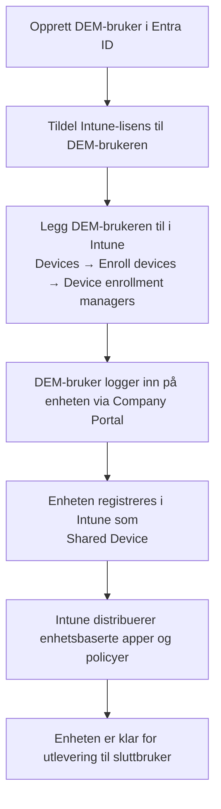
```mermaid

flowchart TD

A[Opprett DEM‑bruker i Entra ID] --> B[Tildel Intune‑lisens til DEM‑brukeren]
B --> C[Legg DEM‑brukeren til i Intune<br/>Devices → Enroll devices → Device enrollment managers]
C --> D[DEM‑bruker logger inn på enheten via Company Portal]
D --> E[Enheten registreres i Intune som<br/>Shared Device]
E --> F[Intune distribuerer enhetsbaserte apper og policyer]
F --> G[Enheten er klar for utlevering til sluttbruker]

```

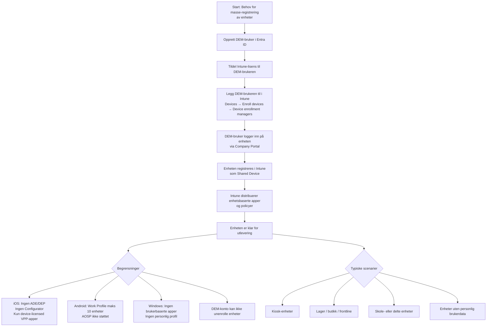
```mermaid

flowchart TD

%% Start
A[Start: Behov for masse‑registrering<br/>av enheter] --> B[Opprett DEM‑bruker i Entra ID]

%% Lisens og aktivering
B --> C[Tildel Intune‑lisens til DEM‑brukeren]
C --> D[Legg DEM‑brukeren til i Intune<br/>Devices → Enroll devices → Device enrollment managers]

%% Registrering
D --> E[DEM‑bruker logger inn på enheten<br/>via Company Portal]
E --> F[Enheten registreres i Intune<br/>som Shared Device]

%% Policy og apper
F --> G[Intune distribuerer enhetsbaserte apper<br/>og policyer]
G --> H[Enheten er klar for utlevering]

%% Begrensninger
H --> I{Begrensninger}
I --> I1[iOS: Ingen ADE/DEP<br/>Ingen Configurator<br/>Kun device‑licensed VPP‑apper]
I --> I2[Android: Work Profile maks 10 enheter<br/>AOSP ikke støttet]
I --> I3[Windows: Ingen brukerbaserte apper<br/>Ingen personlig profil]
I --> I4[DEM‑konto kan ikke unenrolle enheter]

%% Bruksscenarier
H --> J{Typiske scenarier}
J --> J1[Kiosk‑enheter]
J --> J2[Lager / butikk / frontline]
J --> J3[Skole‑ eller delte enheter]
J --> J4[Enheter uten personlig brukerdata]

```
_Utvidet registreringsflyt_

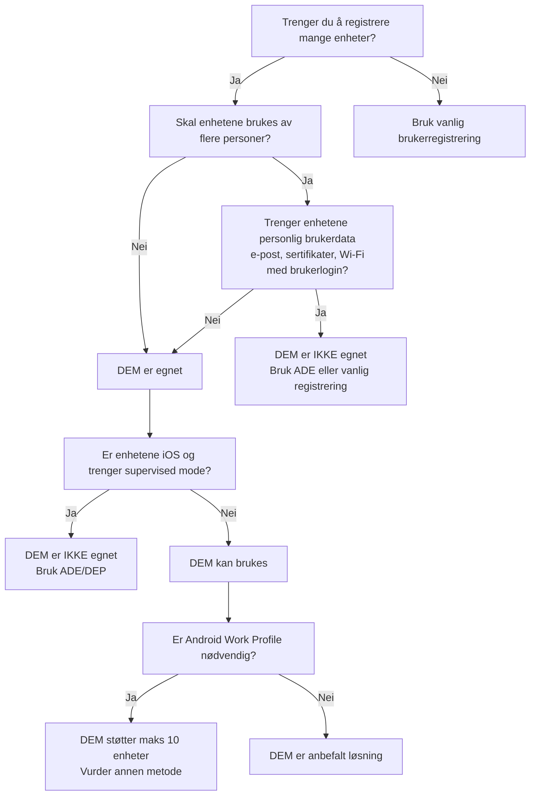
```mermaid

flowchart TD

A[Trenger du å registrere mange enheter?] -->|Ja| B[Skal enhetene brukes av flere personer?]
A -->|Nei| Z[Bruk vanlig brukerregistrering]

B -->|Ja| C[Trenger enhetene personlig brukerdata<br/> e‑post, sertifikater, Wi‑Fi med brukerlogin?]
B -->|Nei| D[DEM er egnet]

C -->|Ja| E[DEM er IKKE egnet<br/>Bruk ADE eller vanlig registrering]
C -->|Nei| D[DEM er egnet]

D --> F[Er enhetene iOS og trenger supervised mode?]
F -->|Ja| G[DEM er IKKE egnet<br/>Bruk ADE/DEP]
F -->|Nei| H[DEM kan brukes]

H --> I[Er Android Work Profile nødvendig?]
I -->|Ja| J[DEM støtter maks 10 enheter<br/>Vurder annen metode]
I -->|Nei| K[DEM er anbefalt løsning]


```
_Beslutningstre, når skal DEM brukes_

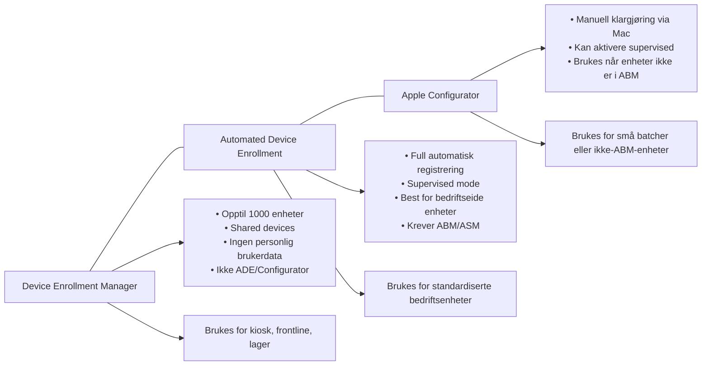
```mermaid

flowchart LR

DEM[Device Enrollment Manager] --- ADE[Automated Device Enrollment] --- AC[Apple Configurator]

DEM --> DEM1[• Opptil 1000 enheter<br/>• Shared devices<br/>• Ingen personlig brukerdata<br/>• Ikke ADE/Configurator]
ADE --> ADE1[• Full automatisk registrering<br/>• Supervised mode<br/>• Best for bedriftseide enheter<br/>• Krever ABM/ASM]
AC --> AC1[• Manuell klargjøring via Mac<br/>• Kan aktivere supervised<br/>• Brukes når enheter ikke er i ABM]

DEM --> DEM2[Brukes for kiosk, frontline, lager]
ADE --> ADE2[Brukes for standardiserte bedriftsenheter]
AC --> AC2[Brukes for små batcher eller ikke‑ABM‑enheter]


```
_DEM vs ADE vs Configurator_

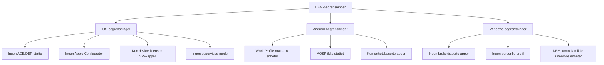
```mermaid

flowchart TD

A[DEM‑begrensninger] --> B[iOS‑begrensninger]
A --> C[Android‑begrensninger]
A --> D[Windows‑begrensninger]

B --> B1[Ingen ADE/DEP‑støtte]
B --> B2[Ingen Apple Configurator]
B --> B3[Kun device‑licensed VPP‑apper]
B --> B4[Ingen supervised mode]

C --> C1[Work Profile maks 10 enheter]
C --> C2[AOSP ikke støttet]
C --> C3[Kun enhetsbaserte apper]

D --> D1[Ingen brukerbaserte apper]
D --> D2[Ingen personlig profil]
D --> D3[DEM‑konto kan ikke unenrolle enheter]


```
_DEM begrensninger_
## [Monitor device enrollment](https://learn.microsoft.com/en-us/training/modules/enroll-devices-use-intune/10-monitor-device-enrollment)
Intune portalen gir innsikt i alle administrative enheter og du kan utføre fjernhandlinger.

### Monitoring enrolled devices
I Intune-adminportalen, under _Devices_ får du 
- _Overview_: Et visuelt sammendrag av alle registrerte enheter, inkludert pr OS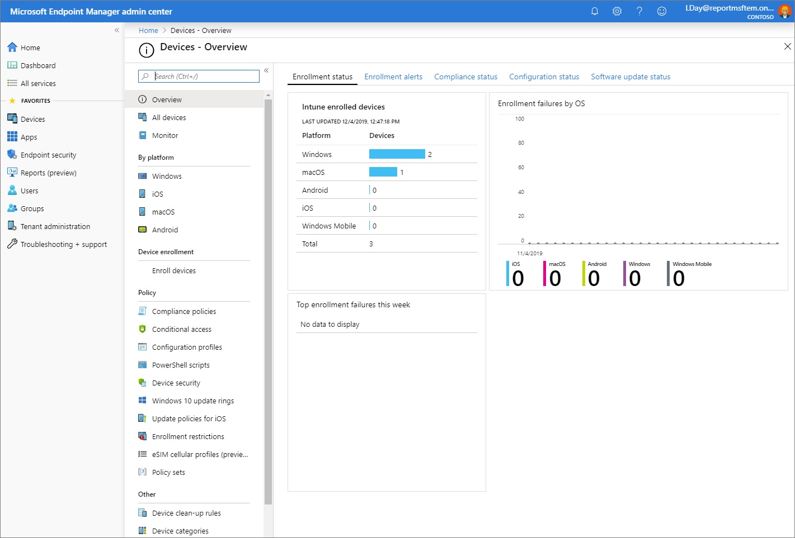
- _All devices_: En full liste over alle enheter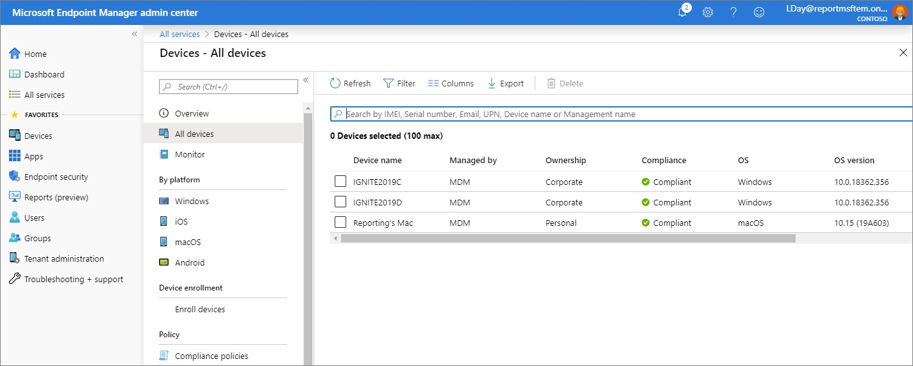
	- Kan eksportere 30000 rader i Edge/Chrome til CSV
- Ved å velge en enhet kan du se:
	- Maskinvareinformasjon
	- Installerte apper
	- Compliance status
	- Flere detaljer om konfigurasjon og tilstand
- _Monitor_: Har rapporter som gir registreringsstaus
	- _Enrollment failures_: Viser hvilke enheter som feilet, feiltyper og hvilken registreringsmetode som ble brukt
	- _Incomplete user enrollments_: Viser hvor brukere stopper i registreringsprossen. Dette kan brukes for å forbedre onboarding dokumentasjon (f.eks. hvis mange stopper ved Terms of use)

### Monitoring Microsoft Entra joined devices
Ikke alle enheter vises i Intune, kun de som faktisk er registrert i Intune. Enheter som kun er Entra-joined (ikke Intune-enrolled) vises i Azure portalen.
- Microsoft Entra ID → Devices → All Devices viser alle registrerte/joinede enheter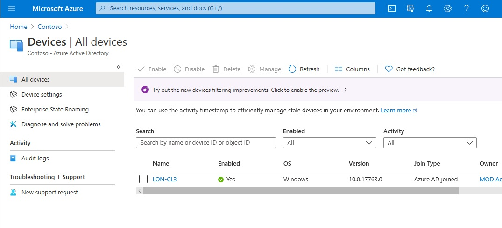
- _Device Settings_ styrer
	- Om brukeren kan Entra joine enheter
	- Om brukeren kan registrere personlige enheter
	- MFA krav
	- Lokale administratorrettigheter
- _Enterprise State Roaming_ styrer hvilke grupper som kan synkronisere innstillinger og appdata mellom enheter
- _Audit Logs_ viser alle endringer som skjer i Intune (opprettelser, endringer, sletting, tildeling)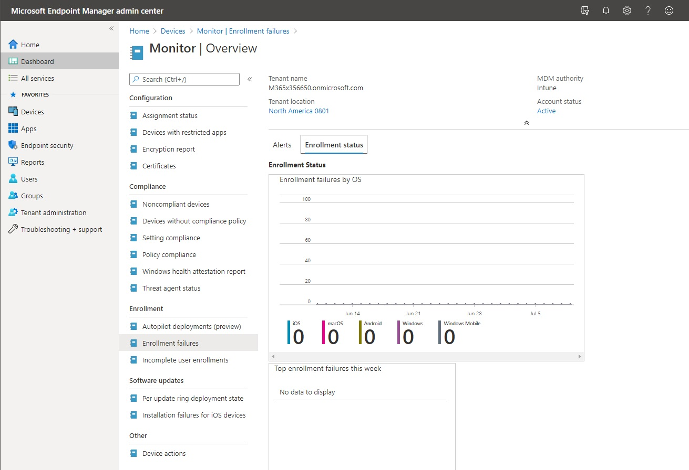
	- Aktivert som standard
	- Kan ikke deaktiveres
	- Kan filtreres
	- Graph API kan hente opptil ett år med hendelser

## [Manage devices remotely](https://learn.microsoft.com/en-us/training/modules/enroll-devices-use-intune/11-manage-devices-remotely)
Intune gir deg mulighet til å se detaljer om alle enheter du administrerer, inkluderte maskinvare, apper og status.
For å se enheter går du til _Devices → All devices_, og velger en enheter for å åpne _Overview_. Her kan du blant annet se
- Enhetsnavn
- BYOD eller corporate
- Siste innsjekk
- Plattform og OS versjon
- Tilgjengelige fjernhandlinger (varierer etter plattform)

Intune støtter en rekke _remote actions_, inkludert:
- _Retire_: Fjerner Intune administrerte apper, profiler og data. Fjerner enheten fra Intune
- _Wipe_: Fabrikkreset. Kan beholde brukerdata hvis _Retain enrollement state and user account_ brukes
- _Delete_: Fjerner enheten fra Intune portalen. Neste innsjekk fjerner firmadata
- _Remote lock_: Android/iOS/macOS, låser enheten
- _Sync_: Tvinger umiddelbar innsjekk for å motta policyer
- _Reset passcode_: iOS/Android, nullstiller enhetens passkode
- _Restart_: Starter enheten på nytt, støttes ikke på macOS eller Android Work Profile
- _Fresh Start_: Windows 10+, fjerner OEM apper
- _Autopilot Reset_: Windows 10+, reinstallerer enheten uten fysisk tilgang
- _Quick scan / Full scan_: Windows Defender, kjører sikkerhetsskanning
- _Update Defender signatures_: oppdaterer antivirusdefinisjoner
- _BitLocker key rotation_: roterer BitLocker recovery key
- _Rename device_: endrer enhetsnavn både i Intune og på enheten
- _Remote Assistance_: Teamviewer, fjernstyring, krever egen lisens
- _Locate device_: Windows/iOS/Android dedicated, viser posisjon eller spiller av lyd 
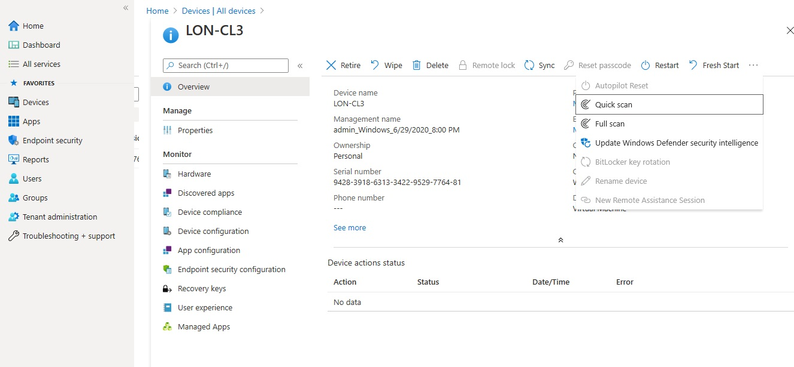

I tillegg kan du se
- _Properties_: kategori, eierskap (Personal/corporate)
- _Hardware_: OS, model, lagring, CA-status
- _Discovered apps_: alle apper Intune finner (rapport kan eksporteres)
- _Device compliance_: status for compliance policyer
- _Device configuration_: status for konfigurasjonspolicyer

## [Module assessment](https://learn.microsoft.com/en-us/training/modules/enroll-devices-use-intune/12-knowledge-check)
1. _What are the four phases of the mobile device management lifecycle?_
	Enroll, Configure, Protect, Retire

2. _A retailer wants to provide 25 tablets to floor staff to capture orders and complete card transactions. The Intune admin creates a new Device Enrollment Manager (DEM) account for the restaurant supervisor. What functionality does the DEM user account have?_
	Enroll in Intune, get company applications, and configure access to company data by deploying role-specific applications

## [Summary](https://learn.microsoft.com/en-us/training/modules/enroll-devices-use-intune/13-summary)
Modulen tar for seg hvordan du registrerer enheter i Intune, hvilke metoder som finnes, og hvordan du velger riktig registreringstrategi for bedriften. Den gir viser hvordan Intune støtter flere plattformer (Windows, iOS/iPadOS, Android, macOS), og hvordan registreringen varierer mellom BYOD enheter og bedrifts enheter.

Modulen har også vist hvordan Intune integrerer med Entra ID og hvordan enheter kan bli Entra joined, registrert eller hybrid joined. Dette påvirker administrasjon og sikkerhet. 
Det gies også en oversikt over hvordan Device Enrollment Manager (DEM), Apple ADE/DEP, Android Enterprise og Window Autopilot brukes for å automatisere og standardisere registreringen. 

Den understreker viktigheten av å velge riktig registeringsmetode basert på enhetstype, eierskap, sikkerhetskrav og brukeropplevelse.

### 1. Registreringsmetoder per plattform

#### Windows
- Entra ID Join + Intune enrollment
- Hybrid Entra ID Join (krever AD Connect)
- Windows Autopilot for automatisert utrulling
- Manual enrollment via `Settings → Accounts → Access work or school`
#### iOS/iPadOS
- BYOD: Company Portal
- Bedriftseid:
    - ADE/DEP (Automated Device Enrollment)
    - [Apple Configurator](../../Glossary/Apple-Configurator.md)
    - DEM (begrenset støtte)

ADE = supervised mode automatisk. Configurator = manuell supervised. DEM = ikke kompatibel med ADE/Configurator.
#### Android
- Android Enterprise Work Profile (BYOD)
- Fully Managed (bedriftseid)
- Dedicated/Kiosk
- AOSP (begrenset scenario)

Work Profile = delt jobb/profil. Fully Managed = full kontroll. Dedicated = kiosk. AOSP = spesialenheter.

### macOS
- Company Portal
- Apple ADE/DEP
- Apple Configurator
### 2. Eierskap: BYOD vs. Corporate

#### BYOD
- Bruker eier enheten
- Begrenset kontroll
- Fokus på personvern
- Work Profile (Android) og Company Portal (iOS/Windows)
#### Corporate
- Full kontroll
- Supervised mode (iOS)
- Fully Managed (Android)
- Autopilot (Windows)

Eierskap styrer hvilke policyer du kan bruke.
### 3. Device Enrollment Manager (DEM)
- Kan registrere 1000 enheter
- Brukes for shared devices
- Ikke kompatibel med ADE/Configurator
- Android Work Profile: maks 10 enheter

DEM = masse‑registrering, ikke personlig bruk.

### 4. Identitet og Entra‑integrasjon
- Enheter kan være:
    - Entra ID Registered (BYOD)
    - Entra ID Joined** (corporate)
    - Hybrid Joined (domene + Entra)

Registreringsmetoden påvirker compliance, policyer og tilgang.

## 5. Velge riktig registreringsmetode
Modulen lærer deg å velge basert på:
- Eierskap (BYOD vs. corporate)
- Plattform
- Sikkerhetskrav
- Automatisering (Autopilot, ADE, Android Enterprise)
- Brukeropplevelse
- IT‑kapasitet