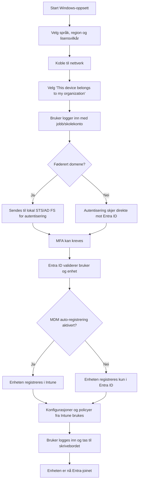

Modulen tar for seg enhetsautentisering  og administrasjon i [Microsoft Entra ID](../../Glossary/Microsoft-Entra-ID.md).
## [Introduction](https://learn.microsoft.com/en-us/training/modules/administer-device-authentication/1-introduction/?ns-enrollment-type=learningpath&ns-enrollment-id=learn.wwl.execute-device-enrollment)
Denne modulen forklarer hvorfor enhetsautentisering og enhetsadministrasjon er viktig når Entra ID tas i bruk. Enheter må ha en sikker identitet for å sikre et trygt og stabilt miljø, og Entra ID har egne mekanismer for å knytte enheter til skyen og administrere dem. 

### Læringsmål
- Forstå hva [Microsoft Entra Join](../../Glossary/Microsoft-Entra-Join.md) er
- Forklare _forutsetninger, begrensninger og fordeler_ ved Entra join
- Utføre registrering av en enhet i Entra ID
- Administrere Entra-joinede enheter i en organisasjon
## [Describe Microsoft Entra join](https://learn.microsoft.com/en-us/training/modules/administer-device-authentication/2-describe-azure-active-directory-join/?ns-enrollment-type=learningpath&ns-enrollment-id=learn.wwl.execute-device-enrollment)
Microsoft Entra Join gjør det mulig å knytte Windows enheter direkte til Entra ID i stedet for et lokalt AD domene. Dette passer godt for organisasjoner som bruker eller beveger seg mot en _cloud-first-strategi_. _Entra-joined_ enheter kan administreres fra skyen, og brukere får enkel pålogging og [SSO](C:\Users\kjetil\OneDrive\Scripts\kjejac.github.io\certs\Glossary\SSO.md) til Microsoft 365 og andre skyressurser.

Entra Join støtter Windows 10/11 (unntatt Home) og enkelte Windows Server versjoner i Azure. Enheten må ikke være tilknyttet domene fra før, og riktige nettverkskrav må være oppfylt.

Andre OS som macOS, iOS og Android kan _ikke Entra-joines_, men de kan _registreres_ i Entra ID. Registrerte enheter får [SSO](C:\Users\kjetil\OneDrive\Scripts\kjejac.github.io\certs\Glossary\SSO.md) og kan administreres via [Intune](C:\Users\kjetil\OneDrive\Scripts\kjejac.github.io\certs\Glossary\Microsoft-Intune.md), men de blir ikke fullverdige Entra-joinede enheter.

Entra Join er spesielt nyttig i miljøer som primært bruker skyressurser, i utdanningsinstitusjoner med mange midlertidige brukere (studenter), i BYOD-situasjoner og i organisasjoner med fjernarbeid eller begrenset lokal infrastruktur.

For virksomheter som trenger lokal AD-funksjonalitet, finnes [Entra Hybrid Join](../../Glossary/Entra-Hybrid-Joined.md), som automatisk registrerer domenjoinede enheter i Entra ID og gir tilgang til både lokale og skybaserte ressurser.
## [Examine Microsoft Entra join prerequisites limitations and benefits](https://learn.microsoft.com/en-us/training/modules/administer-device-authentication/3-examine-azure-active-directory-join-prerequisites-limitations-benefits/?ns-enrollment-type=learningpath&ns-enrollment-id=learn.wwl.execute-device-enrollment)
Entra Join gjør det mulig å knytte Windows enheter direkte til Entra ID. For at dette skal fungere må brukeren ha nødvendige tillatelser, og antall registrerte enheter må ikke overstige grensen som er satt for tenaten. 
Hvis organisasjonen bruker en federert identitetsleverandør må den støtte [WS-Fed](../../Glossary/WS-Fed.md) og [WS-Trust](../../Glossary/WS-Trust.md) (versjon 1.3 eller 2005) for at join og pålogging med passord skal fungere.

Entra Join passer for organisasjoner som ønsker en _cloud-first_ eller en _cloud-only_ tilnærming. Det fungerer også i hybride miljøer. Løsningen gir flere fordeler, blant annet:
- _SSO_ til Azure-administrerte apper uten ekstra påloggingsdialoger
- _Roaming av brukerinnstillinger_ uten behov for [Microsoft-konto](../../Glossary/Microsoft-Account.md)
- _[Windows Hello](../../Glossary/Windows-Hello.md)_ for sikker og enkel pålogging
- Tilgangskontroll basert på enhetskompabilitet
- _Sømløs tilgang til lokale ressurser_ når enheten har kontakt med domenekontroller

Entra Join er nyttig når organisasjoner vil redusere lokal infrastruktur, administrere mobile enheter, støtte fjernarbeid, eller håndtere brukere som sesongarbeidere, konsulenter og studenter. Det er også relevant for avdelingskontorer med begrenset lokal infrastruktur.
## [Join devices to Microsoft Entra ID](https://learn.microsoft.com/en-us/training/modules/administer-device-authentication/4-join-devices-azure-active-directory/?ns-enrollment-type=learningpath&ns-enrollment-id=learn.wwl.execute-device-enrollment)
Du kan knytte en enhet til Entra ID under eller etter Windows oppsettet. Prosessen er enkel og kan gjøres når enheten startes for første gang eller i ettertid.

Fremgangsmåten under Windowsoppsettet:
1. Start enheten og følg de vanlige installasjonsstegene (språk, region, lisensvilkår).
2. Koble til et nettverk.
3. Velg _“This device belongs to my organization”_.
4. Skriv inn jobb‑ eller skolekontoen din og logg inn.
5. Windows finner riktig Entra‑tenant.
    - I et _federert domene_ sendes du videre til lokal STS/AD FS for autentisering.
    - I et _ikke‑federert domene_ logger du inn direkte på Entra‑siden.
6. Du kan bli bedt om _MFA_.
7. Entra ID sjekker om enheten skal registreres i MDM (Intune).
8. Enheten registreres i Entra ID og eventuelt i MDM.

### Hva skjer etterpå
- _Administrerte_ brukere logges automatisk inn og tas til skrivebordet.
- _Federerte brukere_ må logge inn på nytt via Windows‑påloggingsskjermen.

## [Manage devices joined to Microsoft Entra ID](https://learn.microsoft.com/en-us/training/modules/administer-device-authentication/5-manage-devices-joined-azure-active-directory/?ns-enrollment-type=learningpath&ns-enrollment-id=learn.wwl.execute-device-enrollment)
Når enheter kobles direkte til Entra ID, kan de _ikke_ administreres med tradisjonelle GPOer, med mindre de benytter [Entra Domain Services](../../Glossary/Microsoft-Entra-Domain-Services.md). Selv da er funksjonaliteten begrenset, og mobile enheter som smarttelefoner og nettbrett kan ikke styres med GPO.

Entra ID har ingen innebygd funksjon for full enhetsadministrasjon. For å administrere Entra-joined enheter må organisasjoner bruke en MDM-løsning, slik som [Intune](../../Glossary/Microsoft-Intune.md).

Når Intune er konfigurert som en applikasjon i Entra ID, kan enheter som joines automatisk registreres i Intune. Dette krever:
- aktiv Intune-lisens i samme tenant
- bruker som joiner har Intune-lisens

Når enheten er registrert i Intune, kan du bruke Intune til å distribuere sikkerhetspolicyer, konfigurasjoner og apper. Intune fungerer imidlertid annerledes enn GPO og har færre konfigurasjonsmuligheter. Fokus ligger på:
- sikkerhet
- samsvar
- apper og app-policyer

## [Module assessment](https://learn.microsoft.com/en-us/training/modules/administer-device-authentication/6-knowledge-check/?ns-enrollment-type=learningpath&ns-enrollment-id=learn.wwl.execute-device-enrollment)
1. _What is a benefit for using Microsoft Entra ID in an organization that already has Active Directory Domain Services implemented?_
	To offer users the ability to use their personal devices to access organizational resources

2. _What is a benefit from using Microsoft Entra hybrid join?_
	To allow continued use of Group Policy to manage domain-joined devices

## [Summary](https://learn.microsoft.com/en-us/training/modules/administer-device-authentication/7-summary/?ns-enrollment-type=learningpath&ns-enrollment-id=learn.wwl.execute-device-enrollment)
Modulen har gitt forståelse for hvorfor enhetsautentisering og enhetsadministrasjon er viktig i Entra ID, og hvordan sikre enhetsidentiteter på lik linje med brukeridentiteter. 
Den har også vist join-prosessen, inkludert forutsetninger, begrensninger og fordeler. 
I tillegg har den gitt en forståelse for hvordan enhetene administreres.