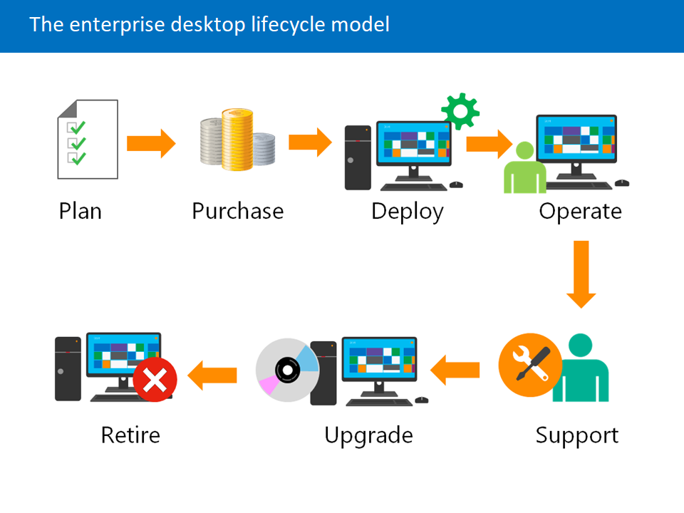

Modulen gir en utvidet forståelse for Windows klienter og Microsoft Entra ID. Den utforsker forskjellige Windows-versjoner, funksjoner og installasjonsmetoder.
Entra ID delen sammenligner likheter og forskjeller opp mot AD DS, og hvordan de to kan synkroniseres.
Du får også en innsikt i administrasjon av Entra-identiter og hvordan du støtter enterprise-klienter på en effektiv måte.

[Microsoft Learn – Explore the Enterprise Desktop](https://learn.microsoft.com/en-us/training/modules/explore-enterprise-desktop/)
## [Introduction](https://learn.microsoft.com/en-us/training/modules/explore-enterprise-desktop/1-introduction/?ns-enrollment-type=learningpath&ns-enrollment-id=learn.wwl.explore-endpoint-management)

### Utviklingen av enterprise-desktopen
Enterprise-desktopen er ikke kun enheter som er eid av arbeidsgiver. Det være en PC, laptop, mobil eller nettbrett som enten er eid av virksomheten eller av den ansatte, og kan benyttes fra der den ansatte befinner seg.
Dette gjør IT-drift mer komplekst og dynamisk.

### Behovet for moderne endpoint-administrasjon
Dagens fleksible og varierte enhetsmiljøer støttes ikke med tradisjonelle administrasjonmetoder. [Moderne endpoint-administrasjon](../../Glossary/Modern-Endpoint-Administration.md) har nye teknikker og konsepter for utrulling, drift og vedlikehold av enheter i et stadig utviklende landskap.
### Enterprise Deployment Lifecycle 
[*Enterprise Deployment Lifecycle* (EDL)](../../Glossary/Enterprise-Deployment-Lifecycle.md) er et rammeverk som beskriver alle prosesser som er knyttet til hele livsløpet til en enhet: 
- Planlegging (av hele livssyklusen)
- Anskaffelse (av enheter)
- (Selve) utrullingsprossesen
- Oppfølging (etter utrulling)
- Løpende støtte og oppgraderinger 
- Utfasing (av enheter)

### Læringsmål
- Beskrive fordelene med [Modern Endpoint Managment](../../Glossary/Modern-Endpoint-Administration.md)
- Forklare [Enterprise Desktop Lifecycle](../../Glossary/Enterprise-Desktop-Lifecycle-(EDL).md) modellen
- Forstå viktige hensyn ved planleggingen av maskinvarestrategier
- Beskrive trinnene i planlegging av OS- og app-utrulling
- Forstå hensyn knyttet til etterforvaltning og utfasing av enheter
## [Examine benefits of modern management](https://learn.microsoft.com/en-us/training/modules/explore-enterprise-desktop/2-examine-benefits-modern-management/?ns-enrollment-type=learningpath&ns-enrollment-id=learn.wwl.explore-endpoint-management)

Tradisjonell administrasjon av IT-infrastruktur og PC-er krevde mye manuelt arbeid. Ny enhetstyper, nye måter å administrere Windows på, skyteknologi og BYOD-trender har gjort morderne endpoint-administrasjon nødvendig.

### Hva moderne endepunkt-administrasjon innebærer
[Moderne administarasjon](../../Glossary/Modern-Endpoint-Administration.md) bygger på prisipper fra [Enterprise Mobility Management (EMM)](../../Glossary/Enterprise-Mobility-Management-(EMM).md). Det gir en enklere måte å rulle ut, sikre og administrere Windows-enheter på. Virksomheten kan håndtere alt fra PC-er, Surface Hub, nettbrett til mobiltelefoner fra en plattform, uansett om enheten eies av virksomheten eller ansatte.

### Hovedpillarene i moderne administrasjon
#### Enkelt å rulle ut og administrere
Tradisjonell OSD (operating system deployment) er kompleks og tidkrevende. [Windows Autopilot](../../Glossary/Windows-Autopilot.md), integrert med[Entra ID](../../Glossary/Microsoft-Entra-ID.md) og [Intune](../../Glossary/Microsoft-Intune.md), gjør utrullingen enklere. Enheter kobles automatisk til Entra ID, registreres i Intune og får apper, innstillinger og sikkerhetspolicyer uten at OS-images må tilpasses.

#### Alltid oppdatert
For å møte nye sikkerhetstrusler og sikre produktivitet må Windows og Microsoft 365-apper oppdateres hyppigere. Med skybasert innsikt og [EMS (Enterprise Mobility + Security)](../../Glossary/Enterprise-Mobility+Security-(EMS).md) kan oppdateringer styres enklere, uten lokal infrastruktur.

#### Intelligent, innebygd sikkerhet
Microsoft 365 har sikkerhet integrert i plattformen gjennom teknologier som [Windows Hello](../../Glossary/Windows-Hello.md), [Defender ATP](../../Glossary/Microsoft-Defender-for-Endpoint-(Defender-ATP).md), [Information Protection](../../Glossary/Microsoft-Purview-Information-Protection-(MPIP).md), [Entra Identity Protection](../../Glossary/Entra-Identity-Protection.md), [Conditional Access](../../Glossary/Conditional-Access.md) med mer. Disse funksjonene bruker [Microsoft Intelligent Security Graph](../../Glossary/Microsoft-Security-Graph.md), som analyserer milliarder av signaler og forbedrer maskinlæring kontinuerlig.
#### Proaktive innsikter 
Skybasert telemetri gjør det mulig å oppdage problemer før brukerne merker dem. Dette gir tryggere OS-oppdateringer, bedre sikkerhetsarbeid og mer effektiv feilsøking. 
## [Examine the enterprise desktop life-cycle model](https://learn.microsoft.com/en-us/training/modules/explore-enterprise-desktop/3-examine-enterprise-desktop-life-cycle-model/?ns-enrollment-type=learningpath&ns-enrollment-id=learn.wwl.explore-endpoint-management)

[_Enterprise Desktop Life-cycle_-modellen](../../Glossary/Enterprise-Desktop-Lifecycle-(EDL).md) er en etablert enhetslivssyklus som sikrer at virksomheten har riktig teknologi tilgjengelig slik at brukerne er produktive og utstyr som når slutten av levetiden ikke blir en belastning. Ved bruk av BYOD i virksomheten, blir også disse en del av livssyklusen.

Fordelene ved å bruke denne modellen:
- Støtte brukere på tvers av enheter og lokasjoner
- Arbeide mer effektivt med færre ressurser
- Sikre at enheter er produktive og ikke blir en risiko ved end-of-life
- Inkludere både bedrifts- og private enheter 

Livssyklusen består av fasene:
- _Planlegging_: Utarbeide strategi for systemadministrasjon
- _Innkjøp_: Behandle bestilling og godkjenne fakturaer
- _Distribusjon_: Installere OS, registrere enheter, distribusjon av apper
- _Drift_: Sikre at systemene fungerer og er beskyttet
- _Brukerstøtte_: Lære opp brukere og gi nødvendig støtte
- _Oppgradering og avhending_: Erstatte enheter, fjerne utdatert maskinvare eller fjerne dem fra administrasjon

## [Examine planning and purchasing](https://learn.microsoft.com/en-us/training/modules/explore-enterprise-desktop/4-examine-plan-purchase/?ns-enrollment-type=learningpath&ns-enrollment-id=learn.wwl.explore-endpoint-management)

### [Planlegging](../../Glossary/Enterprise-Desktop-Lifecycle-(EDL).md#Planning)
- Definere strategier for maskinvare, image, BYOD og utskiftningssyklus
- Velge maskinvare, programvare og tilbehør
- Velge distribusjonsmetoder (cloud, lokal, hybrid)
- Forutsi fremtidige behov
- Bestemme konfigurasjon og nye funksjoner
### [Innkjøp](../../Glossary/Enterprise-Desktop-Lifecycle-(EDL).md#Purchasing)
- Forhandlinger, kontrakter, leverandørhåndtering
- Kostnadsdrivere: maskinvare, programvare, tilbehør
- Distribusjonskostnader (lagring, båndbredde, medier)
- Klargjøring av maskinvare før utrulling
## [Examine desktop deployment](https://learn.microsoft.com/en-us/training/modules/explore-enterprise-desktop/5-examine-desktop-deployment/?ns-enrollment-type=learningpath&ns-enrollment-id=learn.wwl.explore-endpoint-management)

### [Building](../../Glossary/Enterprise-Desktop-Lifecycle-(EDL).md#Building)
- Automatisering
- Velge metode (image / Autopilot)
- Testing (VM + fysisk)
- Standardisert konfigurasjon
- Logistikk og klargjøring

### [Deployment](../../Glossary/Enterprise-Desktop-Lifecycle-(EDL).md#Deployment)
- Fasebasert utrulling
- Stabilisering per fase
- Validering av profiler, apper og brukeropplevelse

### [Enrollment](../../Glossary/Enterprise-Desktop-Lifecycle-(EDL).md#Enrollment)
- Ingen reinstallasjon
- Enheten registreres og konfigureres
- Brukes for Windows, mobil og BYOD
- Varierende krav per gruppe

### [Data Migration](../../Glossary/Enterprise-Desktop-Lifecycle-(EDL).md#data-migration)
- Flytt data til skyen (KFM, OneDrive)
- Bruk in-place upgrade når mulig
- USMT for avansert migrering
## [Plan an application deployment](https://learn.microsoft.com/en-us/training/modules/explore-enterprise-desktop/6-plan-application-deployment/?ns-enrollment-type=learningpath&ns-enrollment-id=learn.wwl.explore-endpoint-management)
Planleggingen består av tre hovedfaser:
- Application inventory and Compatibility
- Packaging applications
- Life-cycle support
### [Application inventory and compatibility](../../Glossary/Enterprise-Desktop-Lifecycle-(EDL).md#application-inventory-and-compatibility)
- Kartlegging av apper
- Standardiser versjoner
- Redusere antall apper
- Analysere kompatibilitet
- Intune Suite kan brukes
### [Application packaging](../../Glossary/Enterprise-Desktop-Lifecycle-(EDL).md#application-packaging)
- Stille installasjoner
- MSI-pakker
- Repacking ved behov
- App-V fases ut til fordel for [MSIX-App-Attach](../../Glossary/MSIX-App-Attach.md)
### [Application life-cycle support](../../Glossary/Enterprise-Desktop-Lifecycle-(EDL).md#application-life-cycle-support)
- Nye apper må testes
- Nye versjoner må planlegges og testes
- Oppdateringer skjer hyppigere, men krever mindre testing
### [Application Delivery](../../Glossary/Enterprise-Desktop-Lifecycle-(EDL).md#application-delivery)
- Automatisk
- Selvbetjening
- BYOD-vuderinger
### [Microsoft Intune](../../Glossary/Enterprise-Desktop-Lifecycle-(EDL).md#microsoft-intune)
- Mange installasjontyper
- App-policyer
- Tilgang basert på compliance
### [Virtual Application Delivery](../../Glossary/Enterprise-Desktop-Lifecycle-(EDL).md#virtual-application-delivery)
- [AVD](../../Glossary/Azure-Virtual-Desktop-(AVD).md)/[Windows 365](../../Glossary/Windows-365.md)
- For enheter som ikke kan kjøre appen lokalt
## [Plan for upgrades and retirement](https://learn.microsoft.com/en-us/training/modules/explore-enterprise-desktop/7-plan-upgrades-retirement/?ns-enrollment-type=learningpath&ns-enrollment-id=learn.wwl.explore-endpoint-management)
- Vurder alder, ytelse, kostnad
- Oppgrader programvare lokalt
- Versjonsoppgraderinger krever mer testing
- Krever lagringsplass og logistikk
### [Retirement](../../Glossary/Enterprise-Desktop-Lifecycle-(EDL).md#Retirement)
- Fjern gamle enheter uten å forstyrre drift, enheter hentes helst etter normal arbeidstid
- Slett data sikkert, gjerne med bulkverktøy ved behov
- Klargjør for salg eller gjenbruk
- Administrativ registrering
- Vurder restverdi eller donasjon
### [BYOD and Unenrollment](../../Glossary/Enterprise-Desktop-Lifecycle-(EDL).md#byod-and-unenrollment)
- Full wipe når enheten er tapt eller den ikke lenger er i bruk
- BYOD enheter bør selektivt slettes via Intune
- Plattform avgjør muligheter
- Brukere må kjenne policyer før registrering

## [Module assessment](https://learn.microsoft.com/en-us/training/modules/explore-enterprise-desktop/8-knowledge-check/?ns-enrollment-type=learningpath&ns-enrollment-id=learn.wwl.explore-endpoint-management)

_What are the different phases of the enterprise desktop life cycle?_
- Planning, Purchasing, Deployment, Operations, Support, Upgrade and Retire

_Contoso is starting to allow employees to enroll their personal mobile devices on the network. When employees leave the company, IT will disconnect the device from the network and wipe selective information related to company access. What Mobile Device Manager (MDM) enables IT to selectively remove applications and application data without affecting personal data?_
- Microsoft Intune
## [Summary](https://learn.microsoft.com/en-us/training/modules/explore-enterprise-desktop/9-summary/?ns-enrollment-type=learningpath&ns-enrollment-id=learn.wwl.explore-endpoint-management)
Modulen tok for seg hvordan _Enterprise Desktop Life-cycle_ har utviklet seg og hvilke utfordringer IT-avdelinger møter når de skal administrere og støtte den.
Den introduserer moderne metoder for _endpoint managment_, som er nødvendig for å distribuere og vedlikehold enheter i et stadig skiftende miljø.

Enterprise Desktop Life-cycle består av 
- Planlegging
- Anskaffelse
- Distribusjon
- Drift og administrasjon
- Oppgradering
- Utfasing

Modulen har har gitt bedre forståelse for 
- Moderne endpoint-administrasjon
- Livssyklusmodellen for enheter
- Strategier for maskinvareoppgraderinger
- Planlegging av OS- og applikasjonsutrulling
- Hensyn etter utrulling og ved utfasing