# MD-102 – Manage Microsoft Entra identities

Modulen gir en praktisk innføring i effektiv bruk av Microsoft Entra ID, inkludert [RBAC](../../Glossary/Role-based-Access-Control-(RBAC).md), brukerroller, opprettelse og administrasjon av brukere og grupper, bruk av PowerShell-cmdlets og synkronisering av objekter fra AD DS til Entra ID.

[Microsoft Learn – Manage Microsoft Entra identities](https://learn.microsoft.com/en-us/training/modules/manage-azure-active-directory-identities/)
## [Introduction](https://learn.microsoft.com/en-us/training/modules/manage-azure-active-directory-identities/1-introduction)
Modulen gir en praktisk innføring i administrasjon av Microsoft Entra ID:
- roller og RBAC
- brukere- og gruppehåndtering
- PowerShell administrasjon 
- synkronisering fra lokal AD DS
## [Examine RBAC and user roles in Microsoft Entra ID](https://learn.microsoft.com/en-us/training/modules/manage-azure-active-directory-identities/2-examine-role-based-access-control-user-roles-azure-active-directory)
RBAC i Microsoft Entra ID
- Entra ID har en enklere deligeringsmodell enn AD DS fordi det ikke finnes _computer objects_ eller GPO
- Det finnes mange innebygde roller, som _Global Administrator_, _User Administrator_, _Password Administrator_, _Billing Administrator_ osv.
- _Global Adminstrator_ har full tilgang og er den eneste som kan tildele andre adminroller
- Apper kan også få delegert rettigheter, og mulighetene øker med P1 og P2 lisensene. F.eks dynamiske grupper, [PIM](certs/Glossary/Microsoft-Entra-Privileged Identity-Management-(PIM).md), selvbetjent gruppeadministrasjon

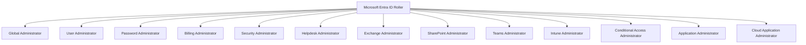

### Azure delegation model and role-based access control
- Azure RBAC brukes for å styre tilgang til Azure-ressurser, slik som VMer, databaser og web-apper
- De tre hovedrollene er _Owner, Contributor_ og _Reader
- Tilgang gis ved å benytte en rolle til et objekt (bruker, gruppe eller service principal) og et spesifikt Azure-ressursnivå

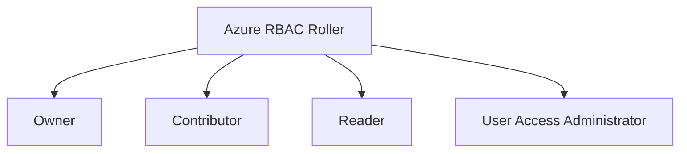

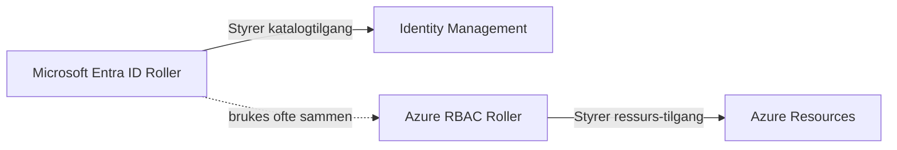
### User roles in Microsoft Entra ID
- Tre typer kontoer kan brukes:
	- Organisasjonskontoer i tenantet
	- Kontoer fra andre Entra-tenants
	- [Microsoft kontoer](../../Glossary/Microsoft-Account.md)
- For å administrere Entra ID må du være _Global Administrator_ eller få delegert en adminrolle
- Begrensede adminroller inkluderer blanet annet:
	- Exchange Admin
	- SharePoint Admin
	- Security Admin
	- Intune Admin
	- Conditional Access Admin
	- osv

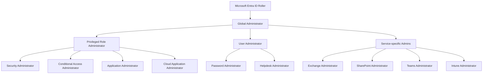
Entra roller etter makt

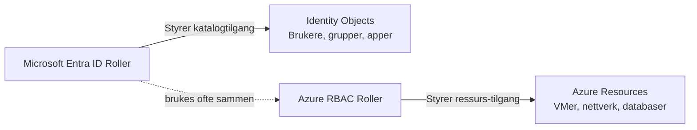
Forskjell mellom Entra roller og Azure RBAC

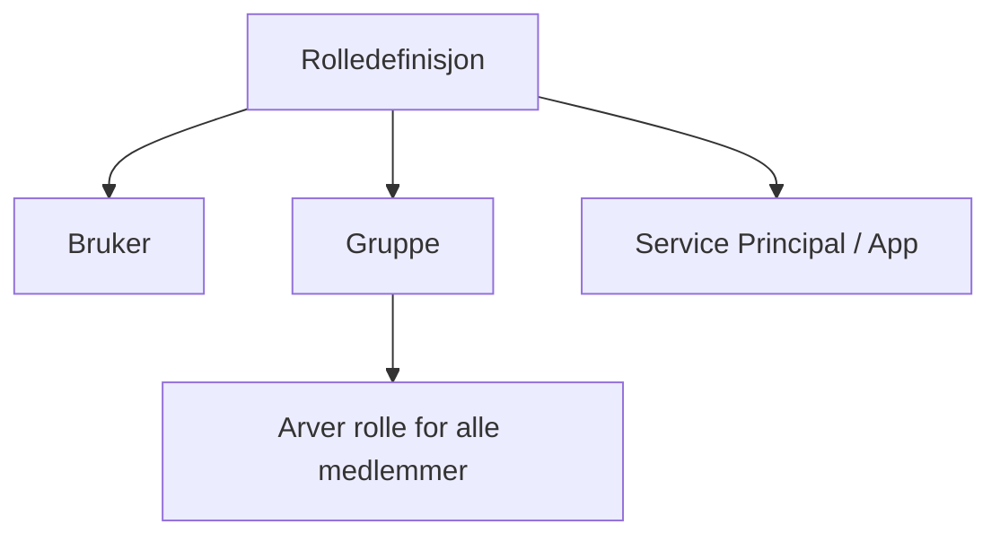
Hvordan roller tildeles (bruker, gruppe, service principal)


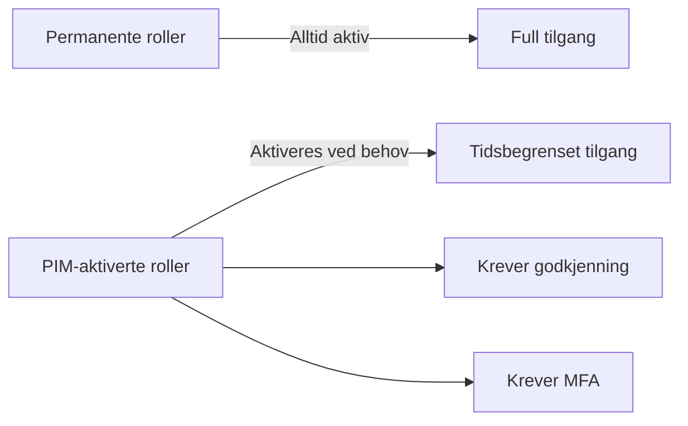
PIM aktiverte roller vs permanente roller


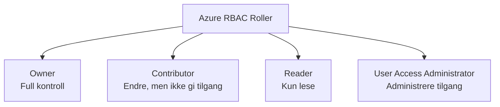
Azure RBAC, hovedrollene

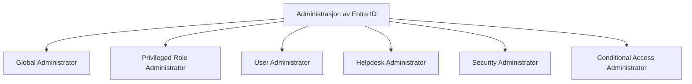
Roller som kan administrere Entra ID

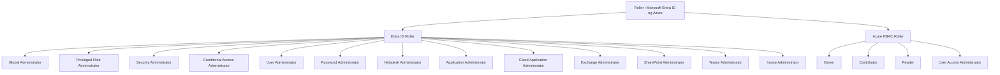
Oversikt over alle rollene 
## [Create and manage users in Microsoft Entra ID](https://learn.microsoft.com/en-us/training/modules/manage-azure-active-directory-identities/3-create-manage-users-azure-active-directory)
- Entra ID støtter både interne og eksterne brukere
- Brukere kan være skybaserte eller synkroniserte fra AD DS
- Azure portalen er den enkleste måten å opprette og administrere brukere på
- Administratorer kan tildele grupper, roller og konfigurere brukernes egenskaper
- Guest brukere opprettes ofte automatisk ved deling av ressurser

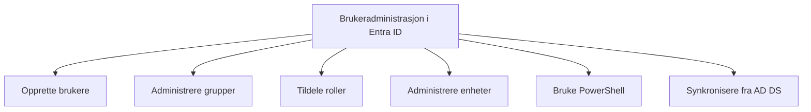

Du kan administrere brukere, grupper og enheter i Entra ID via Azure portalen, PowerShell eller Microsoft 365. 
Det finnes to typer brukerkontoer:
- _Member users_: Vanlige interne brukere som administreres av tenantet
- _Guest users_: Eksterne brukere fra andre Entra-tenants eller _Microsoft kontoer_, ofte opprettet automatisk når man deler innhold

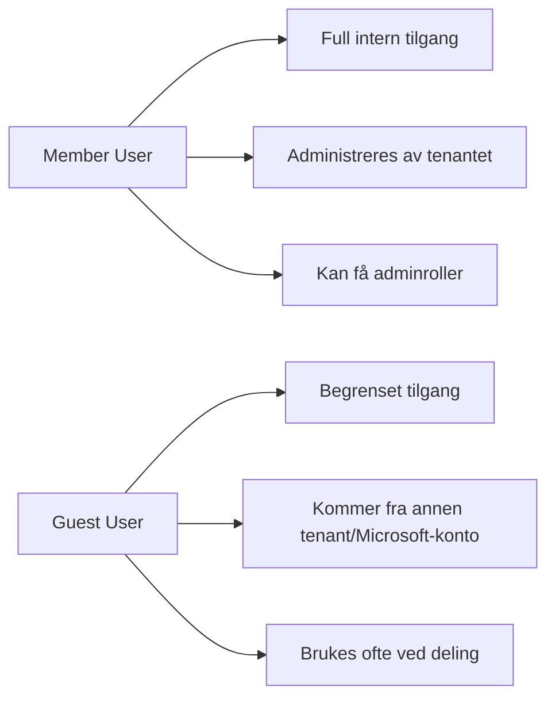

Brukere kan opprettes enten som:
- Skyidentiteter (kun i Entra ID)
- Synkroniserte identiteter fra lokal AD DS

Azure portalen gir en enkel måte opprette og administrere brukere på, inkludert navn, grupper og roller. Etter opprettelsen får brukeren et midlertidig passord.

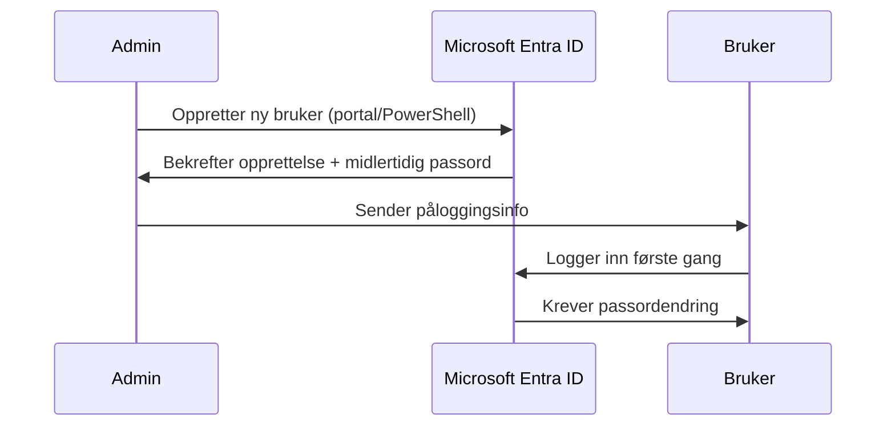
## [Create and manage groups in Microsoft Entra ID](https://learn.microsoft.com/en-us/training/modules/manage-azure-active-directory-identities/4-create-manage-groups-azure-active-directory)

- Entra grupper fungerer som AD DS grupper, men administreres i skyen
- To hovedtyper: _Sikkerhetsgrupper_ (tilgang) og _Microsoft 365 grupper_ (samarbeid)
- Microsoft 365 grupper er alltid epostaktivert
- Sikkerhetsgrupper er ikke epostaktivert
- Medlemskap kan være _tildelt_ eller _dynamisk_
- Dynamiske grupper kan baseres på brukere enheter
- Dynamiske AD DS grupper synkroniseres ikke til Entra ID
- Opprettelse skjer via Azure portalen (`Entra ID --> Groups --> New Group)

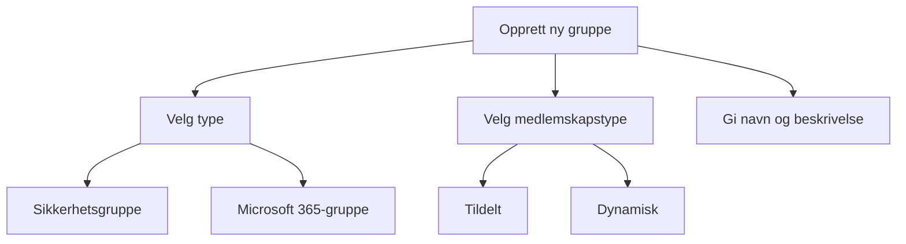

Grupper i Entra ID fungerer på samme måte som grupper i lokal AD DS, de forenkler tilgangsstyring. Hvis katalogsynkronisering er aktivert, kan AD DS grupper synkroniseres til Entra ID, og medlemskap holdes konsistent mellom miljøene.
Uten synkronisering administreres grupper kun i skyen.

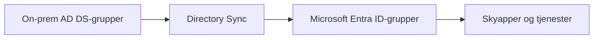

Entra ID har to hovedtyper av grupper:
- _Sikkerhetsgrupper_: Brukes til tilgangstyring til ressurser. Ikke epostaktiverte!
- _Microsoft 365 grupper_: Brukes til samarbeid i Teams, SharePoint og Outlook. Alltid epostaktiverte.

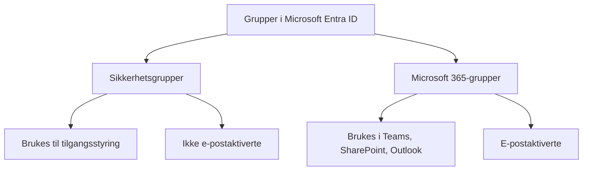
### Assign Membership
Grupper kan ha _tildelt medlemskap_ (manuelt) eller _dynamisk medlemskap_ (basert på regler). Dynamiske grupper kan være bruker- eller enhetsbaserte. Dynamiske AD DS grupper synkroniseres ikke til Entra ID.

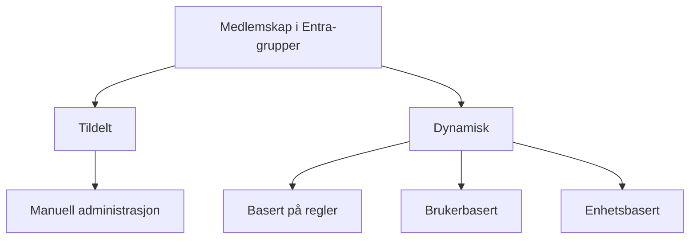

## [Manage Microsoft Entra objects with Microsoft Graph PowerShell](https://learn.microsoft.com/en-us/training/modules/manage-azure-active-directory-identities/5-manage-azure-active-directory-objects-powershell)

- Microsoft Graph PowerShell SDK gir en samlet måte å administrere Entra objekter på
- PowerShell 7+ anbefales, og SDK installeres med `Install-Module Microsoft.Graph`
- Du kobler til Entra ID med `Connect-MgGraph` og angir nødvendige scopes
- Graph PowerShell gir fleksibilitet og automatisering på tvers av Microsoft 365 miljøet

Du kan administrere brukere, grupper og enheter i Entra ID ved hjelp av [Microsoft Graph PowerShell SDK](../../Glossary/Microsoft-Graph-PowerShell-SDK.md). Dette gir en enhetlig og effektiv måte automatisere administrasjon på tvers av Microsoft 365 tjenester.

For å bruke SDKen kreves det:
- Windows 10 eller nyere
- PowerShell 5.1 eller nyere, men PowerShell 7 anbefales
- Microsoft Graph PowerShell SDK installert

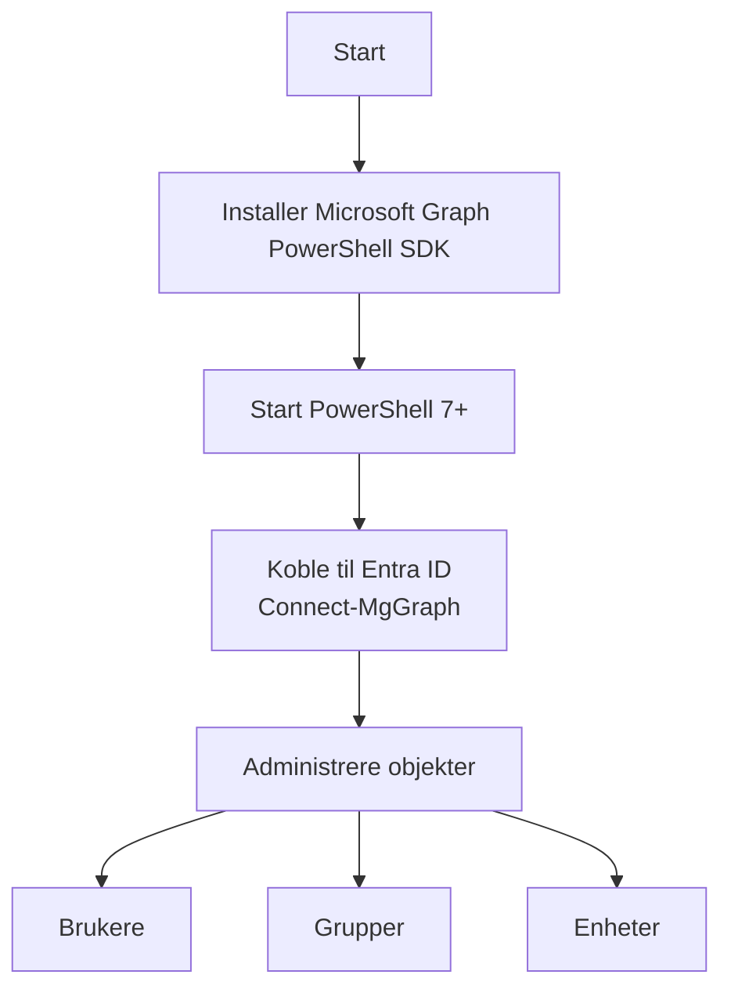

Du kobler til Entra ID med `Connect-MgGraph` og angir hvilke tillatelser (scopes) som trengs. 

For å masseopprette brukere kan du benytte et PowerShell script som importerer en CSV fil og bruker kommandoen `New-MgUser`.

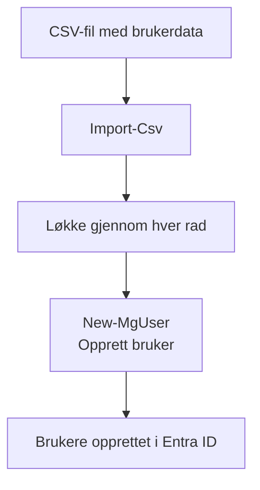

## [Synchronize objects from AD DS to Microsoft Entra ID](https://learn.microsoft.com/en-us/training/modules/manage-azure-active-directory-identities/6-synchronize-objects-active-directory-domain-services)

- Synkronisering mellom AD DS og Entra ID gir enhetlig identitet på tvers av lokalt og sky miljø
- [Entra Connect](../../Glossary/Entra-Connect.md) håndterer synkronisering, filtrering og autentiseringsvalg
- Fire autentiseringsvalg
	- separate passord
	- hash-sync
	- pass-through
	- federation
- Express installasjon dekker de fleste behov, men Custom gir avansert kontroll
- Nye, endrede og slettede AD objekter speiles i Entra ID
- P1 og P2 gir writeback muligheter som passordtilbakestilling, grupper og enheter

Microsoft Entra miljøer uten lokal AD DS trenger ingen synkronisering. Men for organisasjoner som kjører både lokale tjenester og sky, gir synkroniseringen en sømløs brukeropplevelse.

_Directory synchronization_ gjør at brukere, grupper og kontakter fra AD DS replikeres til Entra ID. Med Entra ID Free går synkroniseringen en vei (AD --> Entra). Med P1 og P2 kan enkelte attributter skrives tilbake. 

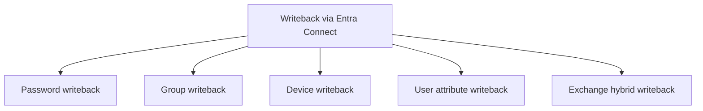

Microsoft Entra Connect er verktøyet som utfører synkronseringen. Standardoppsettet synkroniserer alle brukere og grupper, men du kan filtrere på OU, domene, attributter eller applikasjoner.

Når synkroniseringen er aktivert, kan du velge mellom flere autentiseringsmetoder:
- _Separate cloud password_: bruker har to passord
- _Password hash sync_: ett passord, men ikke ekte SSO
- _Pass-through authentication_: ekte SSO, validering skjer lokalt (PTA)
- _Federation (AD FS)_: claims basert autentisering, skjer lokalt 

```mermaid
flowchart TD
    A[Autentiseringsmetoder med Entra Connect] --> B[Separate cloud password]
    A --> C[Password hash sync]
    A --> D[Pass-through authentication]
    A --> E[Federation AD FS]

    C --> C1[Samme passord, ikke ekte SSO]
    D --> D1[Ekte SSO, validering lokalt]
    E --> E1[Claims-basert autentisering]
```

```mermaid
sequenceDiagram
    participant User as Bruker
    participant Entra as Microsoft Entra ID
    participant PTA as PTA-agent (lokalt)
    participant AD as Lokal AD DS

    User->>Entra: Skriver inn brukernavn + passord
    Entra->>PTA: Sender kryptert valideringsforespørsel
    PTA->>AD: Validerer passord lokalt
    AD->>PTA: OK / Feil
    PTA->>Entra: Sender resultat
    Entra->>User: Innlogging godkjent/avvist
```
Passthrough (PTA) brukes når man ønsker 
- ekte SSO uten AD FS
- vil at passordet aldri skal lagres i skyen 
- vil at policyer i lokal AD skal gjelde (f.eks. smarcards, lockout, password expiry)

Installasjon krever lokale adminrettigheter, Entreprise Admin lokalt og Global Administrator i Entra ID.
Du kan velge _Express_ installasjon eller _Custom_ for avanserte valg som PTA, AD FS, filtering og writeback.

```mermaid
flowchart TD
    A[Installere Entra Connect] --> B[Express]
    A --> C[Custom]

    B --> B1[Synkroniserer hele AD]
    B --> B2[Alle attributter]
    B --> B3[Password sync aktivert]

    C --> C1[PTA]
    C --> C2[Federation]
    C --> C3[OU/attributt-filtering]
    C --> C4[Writeback-funksjoner]
```

Når Entra Connect kjører:
- Nye objekter i AD opprettes i Entra ID
- Endringer i AD oppdateres i Entra ID
- Slettinger i AD slettes i Entra ID
- Deaktiverte brukere i AD deaktiveres i Entra ID, men lisenser fjernes ikke!
## [Module assessment](https://learn.microsoft.com/en-us/training/modules/manage-azure-active-directory-identities/7-knowledge-check)

1. _In Microsoft Entra ID, which role is required to manage privileged roles within the directory?_
	Privileged role Administrator

2. _You are tasked with creating multiple user accounts in Microsoft Entra ID using PowerShell. Which cmdlet should you use within your script to create a new user from a .csv file?_
	New-MgUser

3. _Your organization needs to maintain a synchronized identity system but requires authentication to be handled on-premises. Which Microsoft Entra Connect option should be implemented?_
	Federated Authentication

4. _Your company uses Microsoft Entra ID P2 and wants to ensure that password changes made in the cloud are reflected back in on-premises AD DS. Which feature of Microsoft Entra Connect must be configured?_
	Password writeback

5. _Your organization has enabled directory synchronization using Microsoft Entra Connect, but new users created in AD DS are not appearing in Microsoft Entra ID. What is a likely cause?_
	The synchronization schedule is misconfigured or the service is not running.

6. _Which role in Microsoft Entra ID can manage billing information but does not have other administrative privileges?_
	Billing Administrator

7. _In Microsoft Entra ID, what role should be assigned to allow a user to manage Skype for Business Online settings?_
	Skype for Business Administrator

8. _Which user type in Microsoft Entra ID is managed by your tenant and typically used for employees?_
	Member user

9. _Your organization is experiencing issues with directory synchronization between AD DS and Microsoft Entra ID. What is one potential solution that could address synchronization filtering issues?_
	Configure filtering based on OUs or attributes during Microsoft Entra Connect installation.
## [Summary](https://learn.microsoft.com/en-us/training/modules/manage-azure-active-directory-identities/8-summary)

- RBAC forenkler tilgangsstyring ved å bruke roller med forhåndsdefinerte tillatelser
- Brukere kan legges til roller direkte eller via grupper
- Administrasjon kan gjøre i Azure portalen eller via PowerShell
- Entra Connect synkroniserer AD DS identiteter til Entra ID for å et enhetlig oppsett og unngå dobbeltarbeid.

RBAC gjør det enklere å gi brukere tilgang ved å bruke roller som samler nødvendige tillatelser. Brukere og grupper kan knyttes til roller, enten manuelt eller automatisk basert på kriterier. Brukere kan administreres via Azure portalen eller kommandolinjeverktøy som PowerShell.
AD DS og Entra ID kan synkroniseres med Entra Connect for å slippe dobbeltadministrasjon av identiteter. 