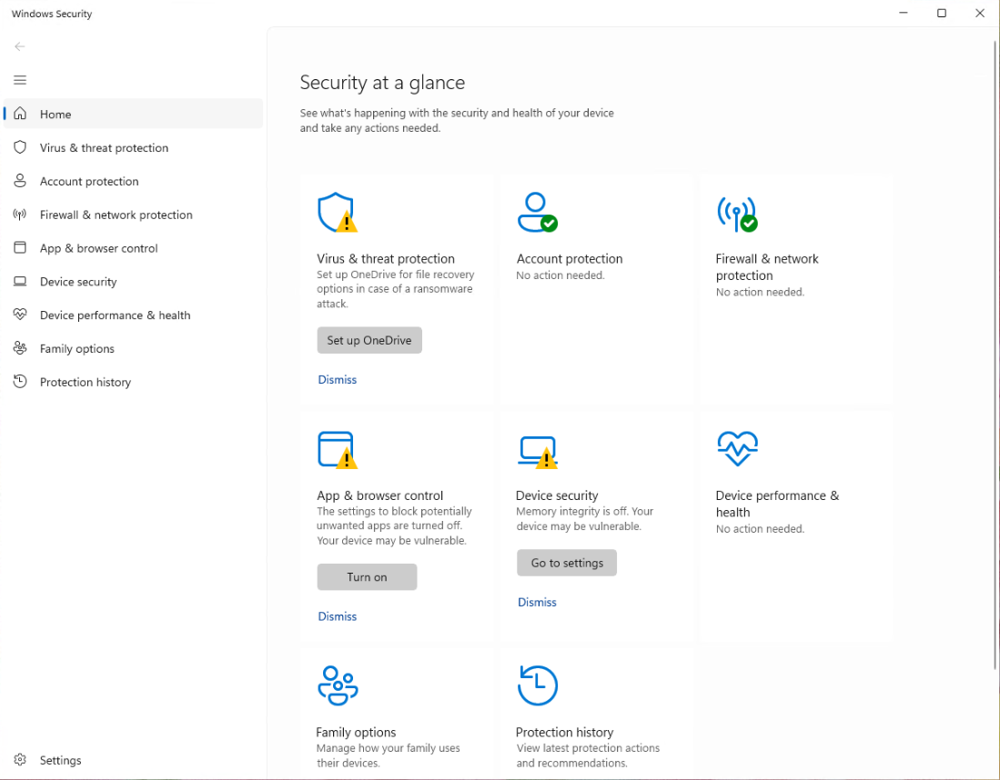
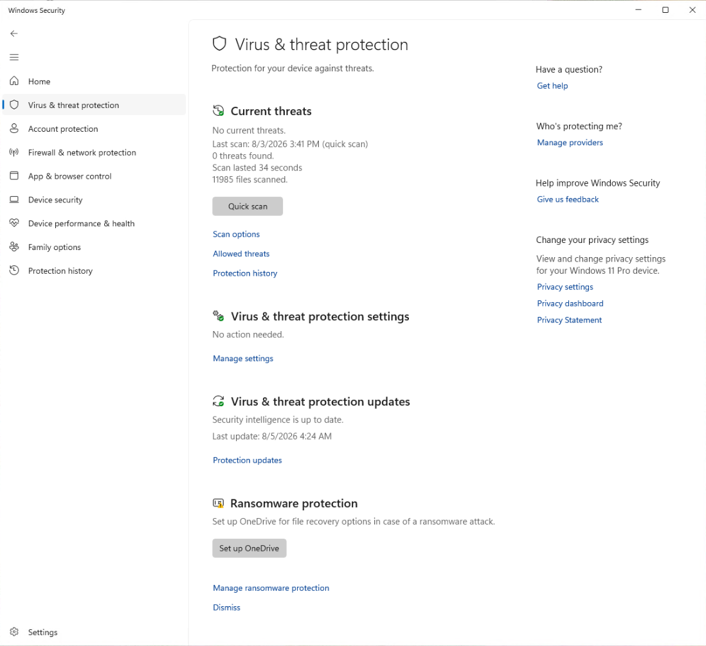
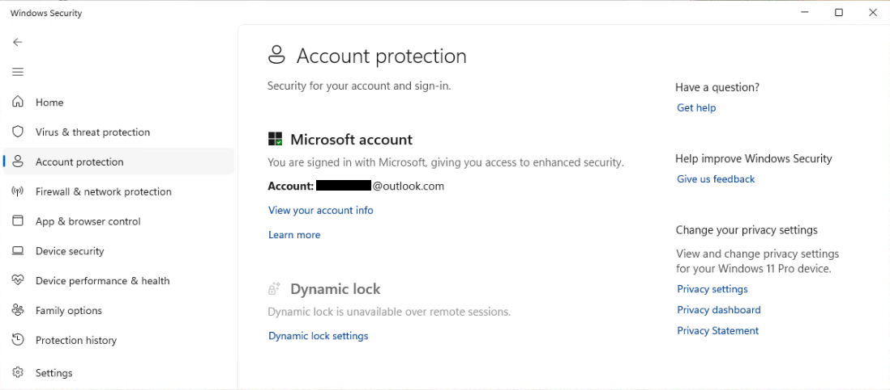
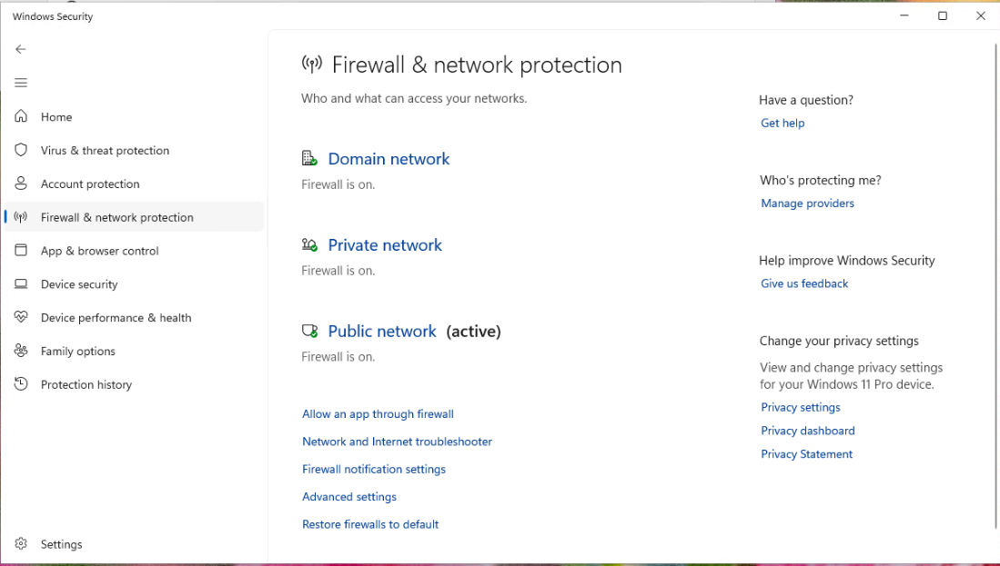
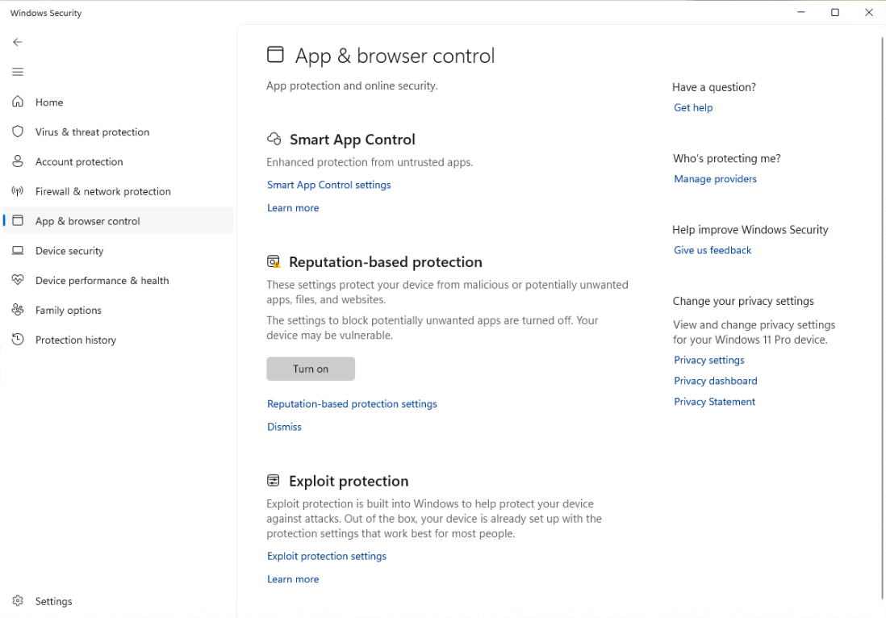
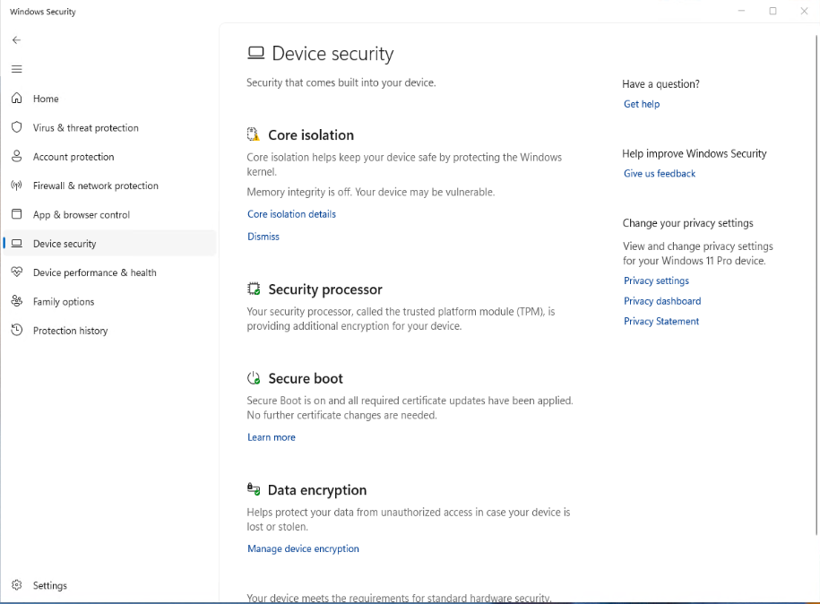
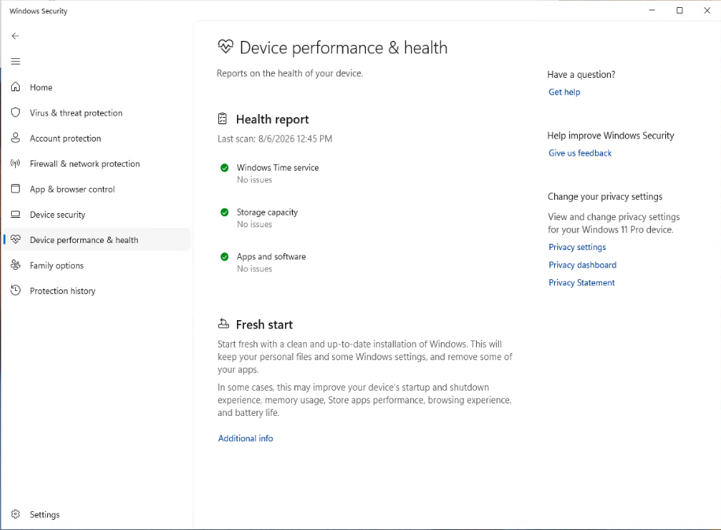
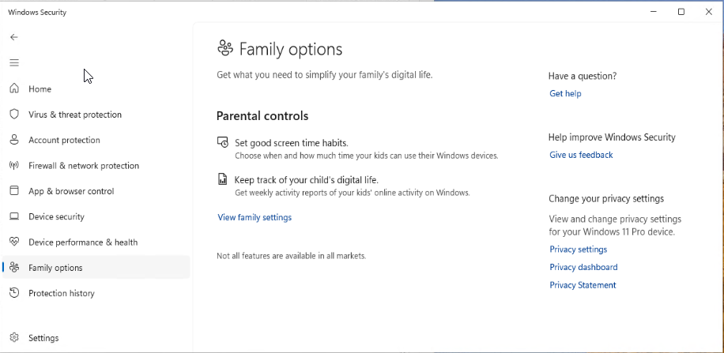
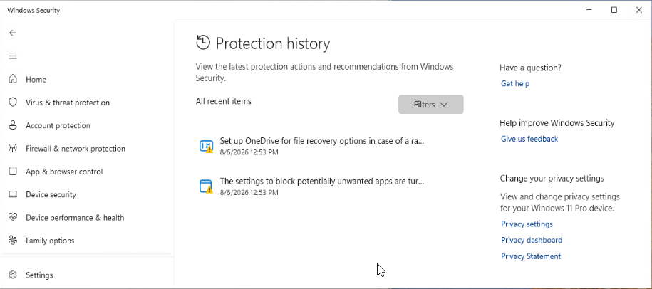

# Klientens sikkerhetsstatus i Windows Security

## Mål
Få oversikt over hvordan _[Windows Security](../../../Glossary/Windows-Security.md)_ viser alle sikkerhetsfunksjoner på enheten.

## Steg for steg

_Windows Security_ er en egen app, men de samme funksjonene er også tilgjengelige under  `Settings > Privacy & security > Windows Security`

### Virus & threat protection

Viser 
- om [Defender Antivirus](../../../Glossary/Microsoft-Defender-Antivirus.md) kjører
- om real-time protection er aktivert
- om cloud-delivered protection er aktivert
- om MDM-sensoren er aktivert (hvis Intune-onboardet)
- om det finnes aktive trusler eller historikk

### Account protection

_Bildet viser ikke Windows Hello da dette er deaktivert når man innlogget via RDP._

Viser 
- om Windows Hello er konfigurert
- om [Dynamic Lock](../../../Glossary/Dynamic-Lock.md) er aktivert
- om [Entra Join](../../../Glossary/Microsoft-Entra-Join.md) påvirker sikkerhetsstatus

### Firewall & network protection

Viser
- om [Defender Firewall](../../../Glossary/Microsoft-Defender-Firewall.md) er aktivert
- om alle tre profilene er aktivert (Domain, Private, Public)
- om det finnes policyer som styrer brannmuren (Intune, GPO, lokal)

### App & browser control

Viser 
- [[Smart App Control]] status
- [[Reputation-based-protection]] status
	- [Smart Screen](../../../Glossary/Microsoft-Defender-SmartScreen.md)-status er en underkategori
- [[Exploit-Protection]] status

### Device security

Viser 
- Core isolation / Memory integrity
- Security processor (TPM)
- Secure Boot
- Data encryption

### Device performance & health

Viser
- Windows Time service status
- Storage capacity status
- Apps and software status

### Family options

Vises under gitte forutsetninger
- Bruk av Microsoft-konto
- Aktivert Family Safty
- Familiemedlemer i Microsoft-familiegruppen

Ikke en lokal sikkerhetsfunksjon, men en portal til _Microsoft Family-tjenesten_.

### Protection history

Viser logg over sikkerhetshendelser som f.eks.
- Defender Antivirus-funn
- SmartScreen-blokerte filer
- Reputation-based protection-hendelser
- Exploit-hendelser

## Refleksjon

Gjennom arbeidet med Windows Security fikk jeg et tydelig bilde av hvordan sikkerhetsfunksjoner varierer avhengig av maskinvare, VM‑miljø og innloggingsmetode. 
På testklienten min (VM via RDP) viser _Device security_ kun Secure Boot, TPM, Core isolation og Data encryption, mens Virtualization‑based security ikke vises fordi VBS ikke støttes i denne konfigurasjonen. Memory integrity er deaktivert, noe som understreker hvordan maskinvarekrav påvirker beskyttelsesnivået.

I _App & browser control_ ser jeg den moderne Windows 11‑strukturen med Smart App Control, Reputation‑based protection og Exploit protection. SmartScreen ligger nå integrert i Reputation‑based protection, noe som gir et mer samlet og oppdatert grensesnitt. Protection history er tom, som forventet på en ren VM uten sikkerhetshendelser, og Family options er minimal siden klienten ikke er del av en Microsoft‑familiegruppe.

Samlet sett viser dette hvordan Windows 11 tilpasser sikkerhetsvisningen basert på miljøet, og hvordan funksjonene henger sammen med Intune‑styring og MD‑102‑pensumet.