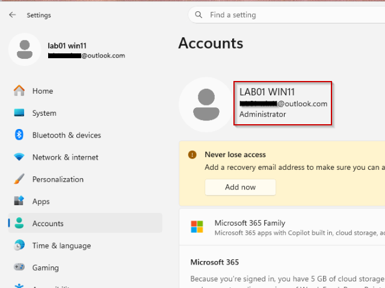

# Identifisere Windows-klientens administrasjonsmodell

## Mål

Lære hvordan Windows viser hvilken administrasjonsmodell den er tilknyttet (ikke-administrert, Azure AD Joined, Hybrid Joined,  MDM-enrolled, MDM-onbordet).

## Steg for steg

### GUI



_En ikke-administrert Windows 11 klient_

Åpne `Settings > Accounts`. Innholdet i rødt firkant på bildet over vil vise administrasjonsstatus, og klient over er ikke-administrert. Bildet viser:
- Microsoft-konto/lokal konto
- Ikke _Azure AD Joined_ (Entra)
- Ikke _Azure AD Registered_ (Workplace Joined)
- Ikke _Domain Joined_
- Ikke _MDM-enrolled_ (Intune; MDMUrl)

Denne sammen informasjonen finnes  også under `Settings > System > About > Device info`.

### PowerShell

I tillegg til GUI kan informasjonen fremhentes ved å benytte PowerShell.

```powershell
PS C:\Users\lab01> dsregcmd /status

+----------------------------------------------------------------------+
| Device State                                                         |
+----------------------------------------------------------------------+

             AzureAdJoined : NO
          EnterpriseJoined : NO
              DomainJoined : NO
           Virtual Desktop : NOT SET
               Device Name : Lab01-Win11
```

### Intune

Intune status vil vises under _Accounts_, som nevnt over.

I tillegg vises det direkte i:
- Event Viewer: `Applications and Services Logs > Microsoft > Windows > DeviceManagement-Enterprise-Diagnostics-Provider`
	- Enrollement events
	- Policy events
	- MDM-status
- Intune-portalen: `Intune admin center > Devices > Windows > Gjeldene klient`
	- MDM enrollement
	- Compliance
	- Configuration profiles
	- Defender status

Indirekte vil  MDM staus bli vist via _MDMUrl_ når kommandoen `dsregcmd /status` kjøres i PowerShell

```PowerShell
MDMUrl : https://enrollment.manage.microsoft.com/...
```

## Refleksjon
Dette var en enkel observasjonsoppgave der jeg kun skulle identifisere administrasjonsstatus på en Windows‑klient. Det var tydelig at maskinen ikke var tilknyttet Entra, Intune eller et domene, noe som kom frem både i GUI og via `dsregcmd /status`. 
