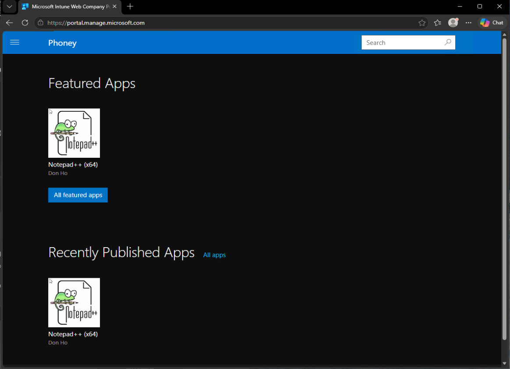
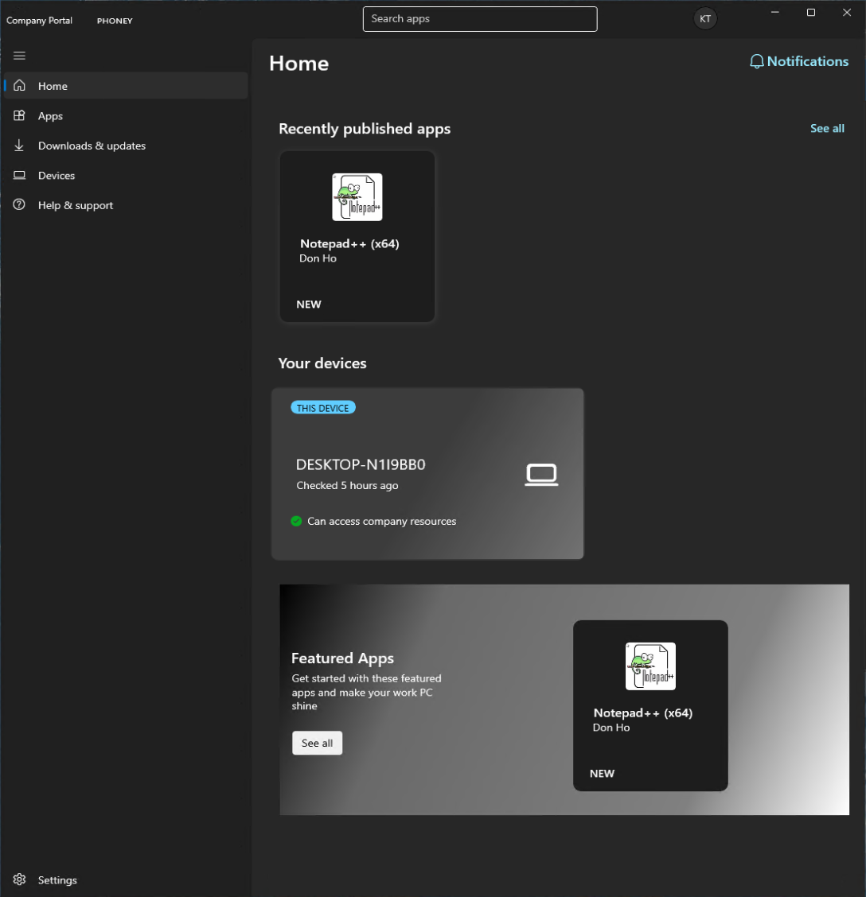

# Company Portal app og web

## Mål
Forstå og beskrive brukeropplevelsen i moderne administrasjon via Company Portal-nettsiden.

## Steg for steg

Company Portal finnes til alle støttede operativesystemer (Windows, macOS, osv.) i tillegg til en webversjon. 

_Company Portal web_

_Company Portal Windows app_

Brukergrensesnittet gir en oversikt over:
- hvilke apper som er tilgjengelige
- hvordan enheten vises
- hvordan compliance vises
- hvordan brukeren kan trigge sync
- hvordan brukeren ser policykrav
- hvordan enheten identifiseres
- hvordan Company Portal presenterer administrasjon

Tilgjengelige apper vil vises under _Apps_

_Notepad++ kan installeres av brukeren ved behov.

Enheter tilknyttet bruker vises under _Devices_. Når brukeren klikker på en enhet, vises detaljer som enhetsinformasjon og compliances-status.

Hvis brukeren ikke ser nye apper, kan de åpne _Settings_ og velge _Sync_ for å siste policyer.

## Refleksjon

Company Portal gir en enkel og moderne brukeropplevelse der apper, enhetsstatus og compliance presenteres på en oversiktlig måte. Brukeren kan selv trigge sync, installere apper og se hvilke krav som gjelder for enheten. Dette gir en mer selvbetjent og forutsigbar hverdag sammenlignet med tradisjonelle verktøy som Software Center.

  
