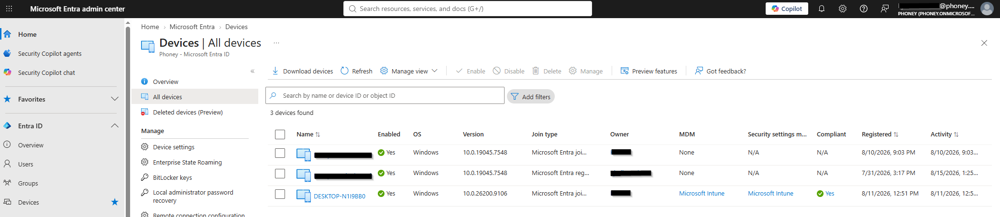

# Enhetsinformasjon i Entra ID

## Mål
Forstå hvordan [Entra ID](../../../Glossary/Microsoft-Entra-ID.md) fungerer som indentitetsfundament for enhetsstyring.

## Steg for steg

Entra ID inneholder alle enheter som er tilknyttet en bedrifts skyinfrastruktur. Her kan administratorer administrere og overvåke alle relevante hendelser. Entra ID tar hånd om enhetens identitet, mens [Intune](../../../Glossary/Microsoft-Intune.md) administrerer enheten.

### Enhetsoversikt i Entra ID

Entra ID viser en oversikt over alle enhetsnavn, join-type, operativsystem, eierskap og siste aktivitet. Dette gir en helhetlig oversikt over hvilke enheter som er tilknyttet organisasjonen, og hvordan de autentiserer mot skyen.

### Koblingen mellom Entra ID og Intune

Enheter må eksistere i Entra ID for å kunne administreres i Intune. Entra ID håndterer identiteten, mens Intune håndterer policyer, compliance og konfigurasjon. Dette gjør at enheten kan administreres uavhengig av lokal infrastruktur.

### Moderne identitetsstyring

Entra ID erstatter behovet for lokal AD i moderne drift. Enheter kan registreres og administreres over internett, og identiteten brukes i [Conditional Access](../../../Glossary/Conditional-Access.md) og [Zero Trust](../../../Glossary/Zero-Trust.md) for å styre tilgang til ressurser. 

### Refleksjon

Entra ID er identitetsdatabasen for enhetsstyring i Intune. Ved å samle enhetsidentitet i skyen får man en mer fleksibel og forutsigbar modell der enheter kan administreres uansett hvor de befinner seg. 