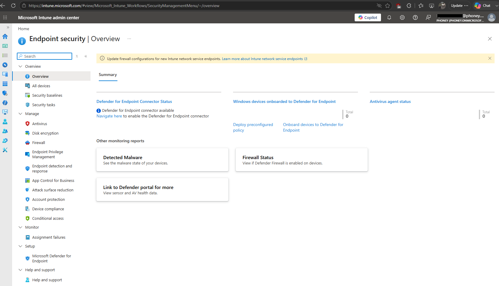

# Utforske Endpoint Security portalen

## Mål
Forstå hvordan Intune samler sikkerhetsstyring i en portal.

## Steg for steg

_Endpoint Security_ i Intune gir en samlet oversikt over sikkerhetsrelaterte områder som administreres av Intune. Her ligger blant annet antivirus, brannmur, diskkryptering, angrepsflate og Security baselines. Dette gjør at sikkerhetsstyring kan håndteres fra en portal, uavhengig av infrastruktur og enheter.

### Integrasjon med Defender for Endpoint

Flere av områdene i _Endpoint Security_ henter data fra [Defender for Endpoint](../../../Glossary/Microsoft-Defender-for-Endpoint.md), noe som gir en mer helhetlig sikkerhetsmodell der trusler, sårbarheter og policyer vises i samme portal.

### Moderne sikkerhetsstyring

_Endpoint Security_ erstatter behovet for separate verktøy som GPO, SCCM eller lokale antivirus-konsoller. Policyer leveres over internett, og enhetene administreres gjennom Entra ID. Dette gir en fleksibel og skalerbar modell som passer moderne drift.

## Refleksjon

_Endpoint Security_ viser hvordan Intune samler sikkerhetsstyring i en portal der administrator får en samlet oversikt over sikkerhetsstatus, policyer og beskyttelse. Enhetene mottar oppdateringer uavhengig av lokal infrastruktur. 
Dette gir en moderne og forutsigbar sikkerhetsmodell. 

