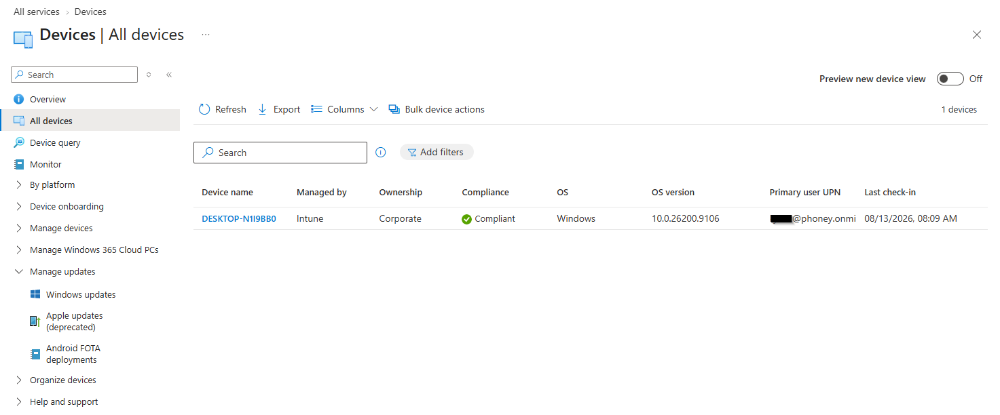
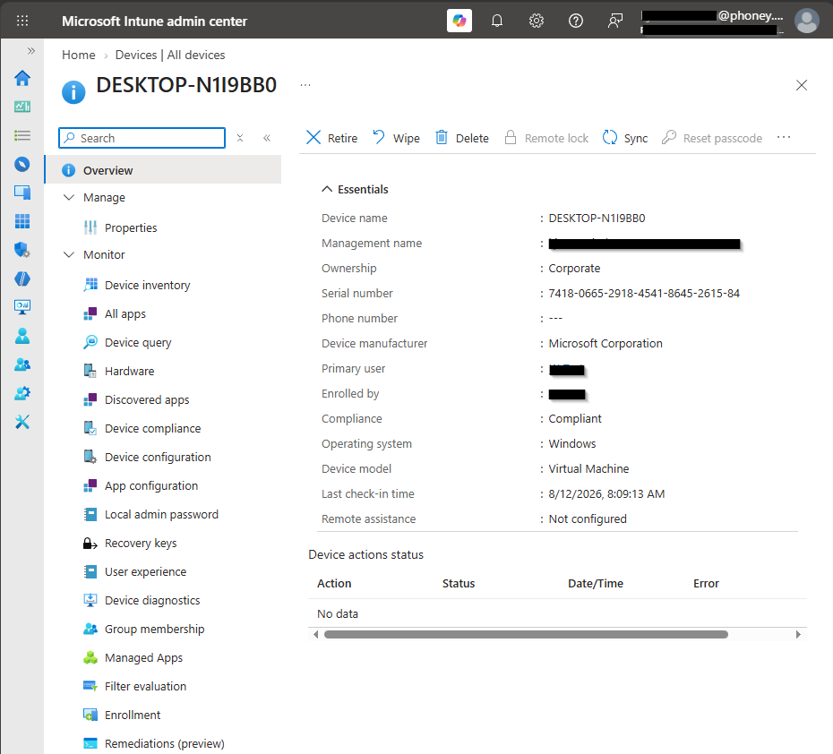
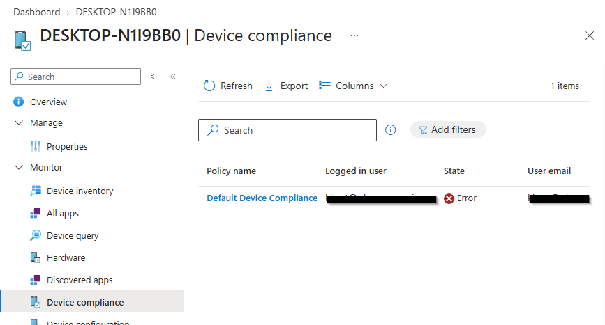
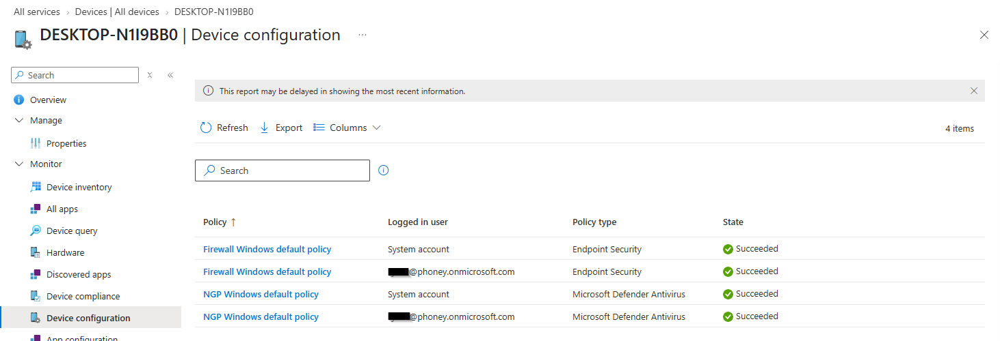
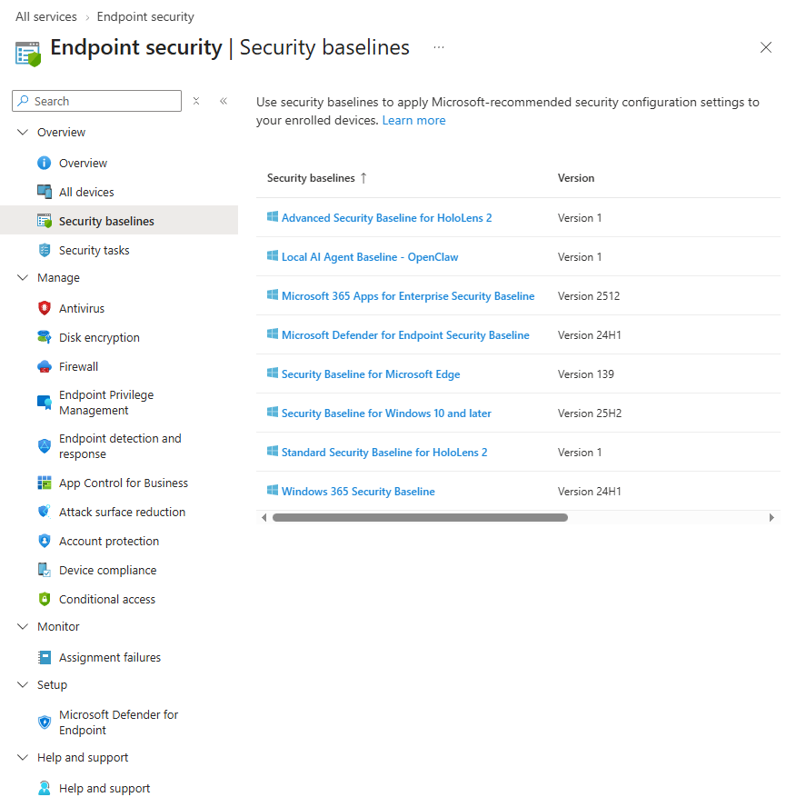
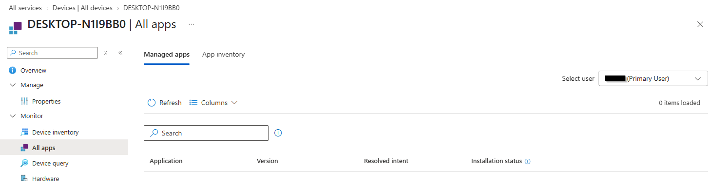
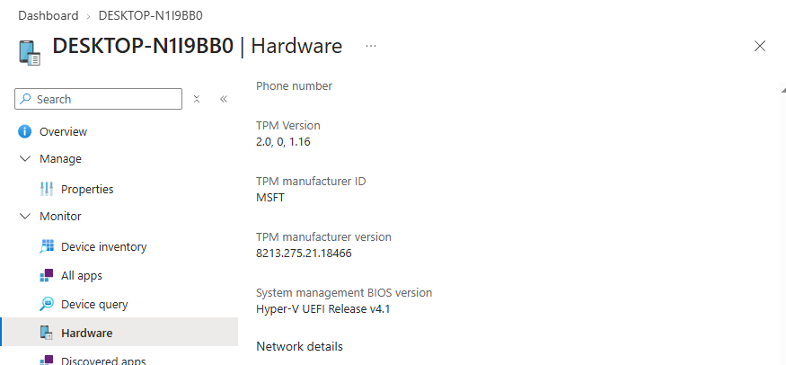
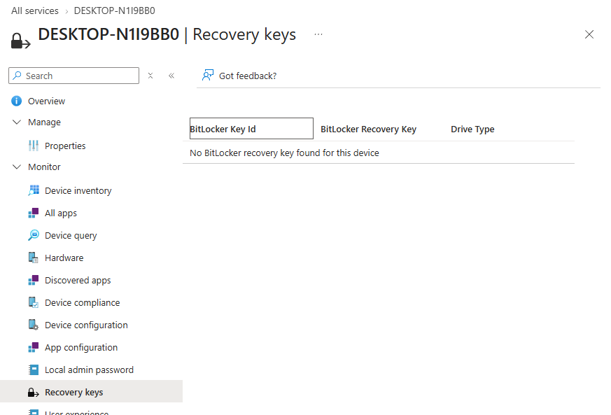
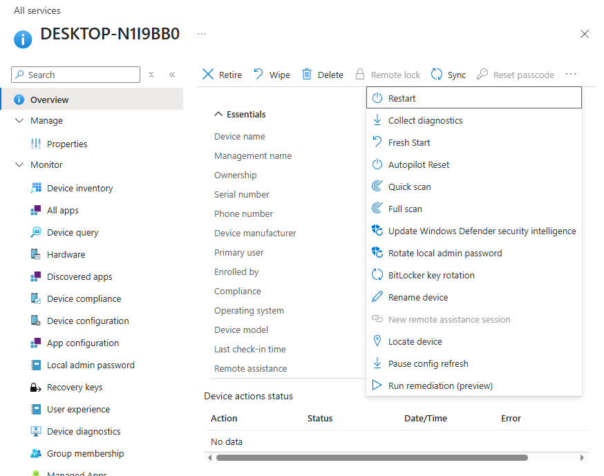

# Intune-portalen, enhetsoversikt og policy-anvendelse

## Mål
Målet er å bli kjent med Intune-portalen og forstå hvordan hver seksjon på _enhetssiden_ viser enhetsstatus og hvordan Intune anvender policyer i praksis. Dette er grunnlaget for å forstå hvordan Intune administrerer Windows-enheter, leverer policyer og evaluerer compliance.

## Steg for steg

Jeg går igjennom hver seksjon på enhetssiden i Intune og forklarer hva den viser, hvordan den brukes og hvordan den relaterer til policy-anvendelse.

Det er endring i portalens menyer og innholdet satt opp mot [Studieveiledning for eksamen MD-102: Endepunktadministrator | Microsoft Learn](https://learn.microsoft.com/nb-no/credentials/certifications/resources/study-guides/md-102)

### Devices

#### All devices

Viser en oversikt over alle administrerte enheter, inkludert OS, compliance-status, ownership, management-type og siste check-in.
Intune viser compliant-status for hver enhet, noe som er avgjørende for [Conditional Access](../../../Glossary/Conditional-Access.md)-tilgang. 
_Managed by_ bekrefter at enheten er MDM-styrt og kan motta policyer.
_Last check-in_ viser når enheten sist kommuniserte med Intune og hentet nye policyer eller rapporterte status.

Dette er også startpunktet for feilsøking; hvis en enhet ikke vises her, er den ikke korrekt enrolled i Intune.

##### Device status 

_Enhetsstatus for en klient._

Ved å klikke på en enhet under _All devices_ får du en oversikt over alle innstillinger og policyer som er gjelder for den aktuelle klienten. Dette inkluderer: 
- Device compliance
- Configuration profiles
- Security baselines
- Managed apps  (erstattet med All Apps)
- Device properties
- Device actions (Restart, Sync, Fresh start)

_Last check-in_ viser når enheten sist kommuniserte med Intune og hadde mulighet til å motta nye policyer eller rapportere status.
_Compliance_ viser resultatet av alle compliance policyer. 
_Primary user_ styrer bruker-målrettede apper og policyer.
_Management name_ og _Managed by_ viser om enheten er MDM-styrt av Intune. I gjeldene Intune-portal vises ikke MDM-status som egen linje, men kan leses ut fra disse feltene om og at ennheten mottar MDM-policyer (config profiles, compliance, baselines).
_Remote assistance_ gjør det mulig for IT-support å koble seg sikkert til enheten når funksjonen er konfigurert.

| **Gammel portal**     | **Ny portal**                        |                                                                                        |
| --------------------- | ------------------------------------ | -------------------------------------------------------------------------------------- |
| _Device > Overview_   | **Overview**                         | Intune viser enhetens helsestatus: compliance, siste check‑in, OS, bruker, MDM‑status. |
| _Properties (gammel)_ | **Properties**                       | Viser administrativ metadata: device name, ownership, primary user, category.          |
| _Device identity_     | **Overview + Properties + Hardware** | Identitet er nå spredd: Entra‑join, MDM‑status, device ID, tenant ID.                  |

###### Device Compliance (Policy resultat) 

_(Gammelt navn: Compliance policies)_

_Oversikt over hvilke regler som gjelder for enheten og statusen på dem._

- Viser om enheten oppfyller kravene som er definert i compliance-policyene
- Viser om enheten får tilgang via [Conditional Access](../../../Glossary/Conditional-Access.md)
- Viser om brukeren er i "godkjent tilstand" basert på enhetens sikkerhetsnivå.

Når enheten viser `Error` under _State_, betyr det at minst en regel i compliance-policyen ikke er oppfylt.
_Compliance_ er `ikke` en policy i seg selv, men en evaluering som Intune utfører basert på enhetens tilstand. Resultatet sendes til Entra ID og brukes direkte i Conditional Access‑vurderingen. Compliance påvirker tilgang til Microsoft 365-ressurser, men ikke hvilke konfigurasjoner enheten mottar.
_Default Device Compliance_ er en innebyd fallback-policy som brukes  når enheten ikke har fått tildelt en egen compliance-policy. Den gjelder for hele tenantet og kan konfigureres (f.eks. "Mark as compliant").

###### Device Configuration (Gammelt  navn: Configuration profiles)

_Viser en oversikt over hvilke innstillinger og sikkerhetspolicyer som er brukt på enheten._

Dette er _policy-anvendelse_ i praksis. Her ser du hvilke profiler som er tildelt enheten og den gjeldende statusen (Succeeded, Pending, Error). 
_Logged in user: System account_ betyr at policy er levert via MDM-kanalen og er maskin-målrettet. Bruker-målrettede profiler vil vise brukernavnet i stedet. 
_Endpoint Security-policyer_ vises her fordi de er implementert som profiler og leveres via MDM-kanalen.

_Settings catalog_ inneholder alle konfigurerbare innstillinger som kan brukes til å bygge moderne, granular policyer. Disse tildeles som profiler og vises derfor under _Device Configuration_.

| **Gammel portal**      | **Ny portal**            |                                                                                  |
| ---------------------- | ------------------------ | -------------------------------------------------------------------------------- |
| _Device configuration_ | **Device configuration** | Her ser du hvilke profiler som er tildelt, og om de har succeeded/pending/error. |
| _Settings catalog_     | **Device configuration** | Moderne granular policy ligger her.                                              |

###### Security baselines (Endpoint security > Security baselines) 

_Security baselines_ er Microsoft-anbefalte sikkerhetskonfigurasjoner som leveres som egne profiler og evalueres separat fra vanlige konfigurasjonsprofiler. De inneholder forhåndsdefinerte sikkerhetsinnstillinger som representerer Microsofts anbefalte sikkerhetsnivå for Windows-klienter.
Baselines har egne versjoner som oppdateres i takt med OS-versjoner, og rapporteres i egne baseline rapporter. De kan overstyre enkelte innstillinger fra andre profiler (Settings catalog) dersom det oppstår konflikt. 
_Assignments_ vises først når baseline er tildelt en gruppe. Dette er endel av policy-anvendelsen der baseline må være tildelt før den evalueres og rapporteres på enheten. 

| **Gammel portal**               | **Ny portal**                              | **Hva du skal forstå i oppgaven**                               |
| ------------------------------- | ------------------------------------------ | --------------------------------------------------------------- |
| _Endpoint security > Baselines_ | **Endpoint security > Security baselines** | Viser hvilke baselines som er tildelt og status for anvendelse. |

###### Managed Apps / All Apps

_Viser hvilke apper Intune har installert og statusen (Installed, Pending, Failed)._

 Dette er en del av policy-anvendelsen knyttet til apper og viser hvordan Intune håndterer:
 - app-distribusjon
 - installasjonsstatus
 - feilsituasjoner
 - versjonskontroll

App-status er en del av policy-anvendelse fordi Intune styrer distribusjon, installasjonen og oppdatering av apper. _Resolved intent_ viser om appen er i ønsket tilstand basert på tildelingen (Required, Available, Uninstall). 

Både Win32-apper og MS Store-apper kan benyttes i Intune. Win32-apper leveres via [Intune Management Extension (IME)](../../../Glossary/Microsoft-Intune-Management-Extension.md), mens Store-apper bruker [Store](../../../Glossary/Microsoft-Store.md)-infrastrukturen. Dette gir ulike mekanismer for pakking, distribusjon og oppdatering.

_Managed apps_ viser apper som Intune har installert, mens _All apps_ viser alle apper som er oppdaget på enheten. En _Required-app_ som filer kan påvirke _compliance-evalueringen_.

###### Hardware 

_Viser sikkerhetsstatusen på maskinvareprofilen og aktive maskinvareinformasjonen som Intune bruker for å vurdere enhetens sikkerhet og policy-anvendelse._

Her vises blant annet:
- TPM
- Secure Boot
- BitLocker
- Maskinvareprofil (BIOS, CPU, RAM, lagring, nettverk, OS-informasjon)

Dette danner grunnlaget for om enheten oppfyller kravene for: 
- [Primary Refresh Token (PRT)](../../../Glossary/Primary-Refresh-Token.md)
- [Entra ID SSO](../../../Glossary/Entra-ID-Single-Sign‑On.md)
- Compliance
- BitLocker-policy

Hardware-status påvirker compliance direkte. _TPM 2.0_ er et krav for _PRT_ og _Entra ID SSO_, [Credential Guard](../../../Glossary/Microsoft-Defender-Credential-Guard.md) og BitLocker. _Secure Boot_ og BitLocker vises kun hvis funksjonene er aktivert og Hyper-V viser dem ikke ikke uten riktig konfigurasjon (Gen2 + Secure Boot aktivert)..

_Security patch level_ vises under Hardware, men styres av compliance-policy. Dette bør konfigureres for å sikre at enheten oppfyller minimumskrav til oppdateringer og beskyttes mot sårbarheter.

| **Gammel portal**         | **Ny portal**                             |                                                                          |
| ------------------------- | ----------------------------------------- | ------------------------------------------------------------------------ |
| _Monitor > Hardware_      | **Hardware**                              | Intune viser TPM, BIOS, OS‑versjon, nettverk, lagring, maskinvareprofil. |
| _Secure Boot / BitLocker_ | **Hardware** (men skjult hvis ikke aktiv) | Hyper‑V viser ikke Secure Boot/BitLocker med mindre du aktiverer dem.    |

###### Recovery keys (BitLocker)

BitLocker-nøkler vises kun hvis BitLocker er aktivert og er endel av databeskyttelsen i [Data Loss Prevention (DLP)](../../../Glossary/Data-Loss-Prevention.md) . Hyper-V viser ingen nøkler dersom disken ikke er kryptert, siden VHDX-disker ikke har BitLocker aktivert som standard.

Intune kan rotere nøkler via _Device actions_, noe som gir sikker nøkkeloppdatering uten fysisk tilgang til enheten. 

Under _Drive Type_ skilles det mellom:
- _OS-disk_, systemdisken 
- _Fixed data disk_, sekundær disker som krypteres separat

BitLocker-status vises under _Hardware_, mens selve nøklene vises under _Recovery keys_. Intune viser både _BitLocker key Id_ og _BitLocker Recovery Key_ når kryptering er aktivert  og rapportert.

###### Device actions

_Device actions_ er flyttet til _Actions-menyen_ i gjeldene portal og inneholder fjernstyrte operasjoner som Intune kan utføre på enheten. Dette er _policy-anvendelse i praksis_, der Intune aktivt utfører handlinger på klienten.
Menyen inneholder blant annet:
- Restart
- Fresh Start
- Autopilot Reset
- Quick scan
- Full scan
- LAPS
- BitLocker rotation
- Sync (tvinger enheten til å hente nye policyer)

To actions som er spesielt relevante:
- _Pause config refresh_, stopper midlertidig levering av policyer til enhet
- _Run remediation_, kjører skript fra _Proactive Remediations_ for å rette feil eller utføre vedlikehold

Device actions krever at enheten er MDM-styrt av Intune. Enkelte handlinger som _Autopilot Reset_, krever Windows 10/11 Enterprise og at enheten er registrert i [Windows Autopilot](../../../Glossary/Windows-Autopilot.md).

## Refleksjon

Oppgaven med Intune‑portalen har gitt meg et innblikk i hvordan enhetsadministrasjon i praksis består av flere viktige områder. De mest sentrale er:
- oversikt
- policy‑anvendelse
- sikkerhetsstatus
- fjernstyrte handlinger

Under gjennomgangen av hver seksjon blir det tydelig hvordan Intune strukturerer informasjonen slik at administratorer kan forstå både _tilstand_ og _effekt_ av policyer på enheten.

Enhetsoversikten gir et første inntrykk av om enheten er riktig registrert, oppdatert og i stand til å motta policyer. Device status knytter dette til konkrete innstillinger, brukere og synkronisering, mens Device compliance viser om enheten oppfyller kravene som styrer tilgang til ressurser. Device configuration og Security baselines viser hvordan Intune anvender konfigurasjoner og sikkerhetsprofiler i praksis, og hvordan statusen på disse gir innsikt i om policyer er levert og aktivert.

App‑håndtering, maskinvarestatus og BitLocker‑nøkler viser bredden i Intune‑administrasjon, fra programvare og sikkerhetsfunksjoner til maskinvarekrav som TPM, Secure Boot og patch‑nivå. Til slutt viser Device actions hvordan administratorer kan utføre målrettede handlinger direkte mot enheten, enten for feilsøking, vedlikehold eller sikkerhetsforbedringer.

Samlet sett viser oppgaven hvordan Intune‑portalen gir et helhetlig bilde av enhetens tilstand og hvordan policyer faktisk anvendes. 