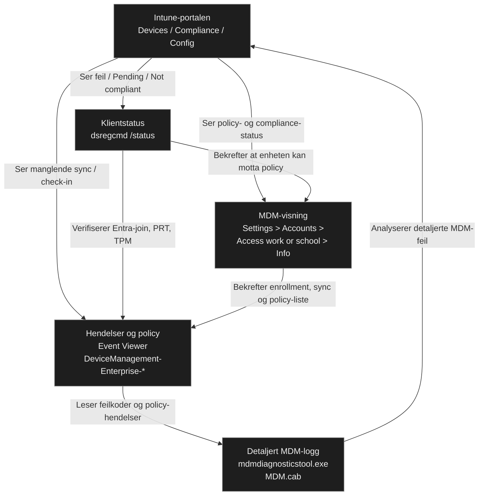
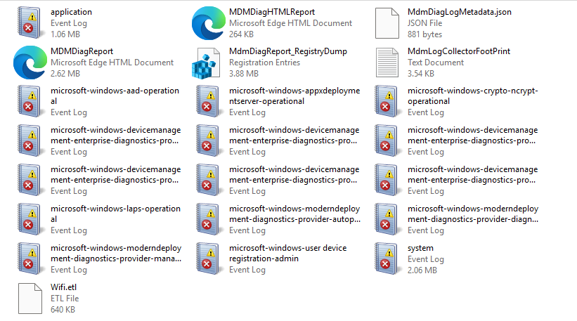
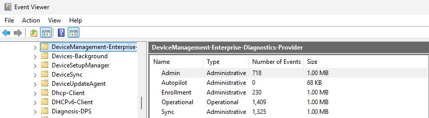

# Undersøk enhetens MDM‑diagnostikk

## Mål
Forstå hvordan Windows-enheten er registrert i Entra ID og Intune, og hvordan policyer hentes og anvendes, slik at denne informasjonen kan brukes i feilsøking og administrasjon.

## Steg for steg

MDM-diagnostikk viser et helhetlig bilde av om enheten kan motta og anvende Intune-policyer. Følgende statuser er sentrale: 
- Entra-join og MDM-registrering
- [Primary Refresh Token (PRT)](../../../Glossary/Primary-Refresh-Token.md) og [Entra ID Single Sign‑On (SSO)](../../../Glossary/Entra-ID-Single-Sign‑On.md)-status
- MDM-endepunkter (MdmUrl, TenantID)
- Policy-synkronisering og feilkoder
- Sertifikater, TPM og autentisering

Verktøyene finnes flere steder:
- _Kommandolinje_
	- `dsregcmd /status`: viser Entra-join, PRT, TPM og MDM-endepunkter
	- `mdmdiagnosticstool.exe`: samler MDM-diagnostikk i en CAB-fil
- _GUI_
	- _Event Viewer_: DeviceManagement-Enterprise-Diagnostics-Provider (Admin, Enrollment, Sync, Operational)
	- _Settings > Accounts > Access work or school > Info_: MDM-registrering, siste sync sync og policyer
	- _Intune-portalen_ > Starter alltid med `Devices > [enhet] > Overview`

MDM-diagnostikk benyttes for å finne årsaken til at klienten feiler når
- policyer ikke leveres
- compliance feiler
- apper ikke installeres
- baselines står som Pending
- PRT mangler eller SSO ikke fungerer

I alle disse tilfellene brukes MDM-diagnostikk til å se om problemet ligger i registrering, policy-levering, token/SSO eller kommunikasjon med Intune.

Typiske feilsøkingstrinn er å kombinere Intune-portalen med MDM-diagnostikk for å se hva Intune prøver å gjøre og hva enheten mottar.

- AzureAdJoined = NO > enheten er ikke registrert
- TpmProtected = NO > PRT/SSO vil feile
- MdmUrl mangler > enheten er ikke MDM‑registrert
- AzureAdPrt = NO > brukeren får ikke SSO
- DM‑events viser feil > policy‑levering feiler



### Windows-klienten

#### Commandline

Kommandoen `dsregcmd /status` henter gjeldene status for klienten og viser de relevante delene når man skal se gjeldene status som kan benyttes til feilsøking:
- MDM-registrering
- Entra-join
- PRT
- SSO
- MDM‑endepunkter
- Sertifikater og TPM
- Enhetsidentitet

##### Device State

```cmd
PS C:\Users\user> dsregcmd /status

+----------------------------------------------------------------------+
| Device State                                                         |
+----------------------------------------------------------------------+

             AzureAdJoined : YES
              DomainJoined : NO
               Device Name : DESKTOP-N1I9BB0
```
_Listen er sterkt redigert og viser kun de relevante feltene i denne sammenhengen._

Informasjonen viser om enheten er riktig registrert i Entra ID og om den kan motta Intune MDM-policyer.
- _AzureAdJoined: YES_ – Enheten er Entra‑joined og kan motta Intune‑policyer.
- _DomainJoined: NO_ – Ikke hybrid; ren cloud‑join.
- _Device Name_ – Navnet på klienten.

##### Device Details

```cmd
PS C:\Users\user> dsregcmd /status

+----------------------------------------------------------------------+
| Device Details                                                       |
+----------------------------------------------------------------------+

                  DeviceId : e37ec551...
 DeviceCertificateValidity : [ 2026-08-11 10:21:16.000 UTC -- 2036-08-11 10:51:16.000 UTC ]
              TpmProtected : YES
          DeviceAuthStatus : SUCCESS
```
_Listen er sterkt redigert og viser kun de relevante feltene i denne sammenhengen._

Viser om enheten har gyldige sertifikater og TPM-beskyttelse, noe som er nødvendig for [Primary Refresh Token](../../../Glossary/Primary-Refresh-Token.md) (PRT) og [Entra ID Single Sign‑On](../../../Glossary/Entra-ID-Single-Sign‑On.md) (SSO).

- _DeviceId_ – Enhetens unike identitet i Entra ID.
- _DeviceCertificateValidity_ – Sertifikatet er gyldig; nødvendig for autentisering.
- _TpmProtected: YES_ – TPM 2.0 aktiv; nødvendig for sikker PRT‑lagring og moderne SSO‑opplevelse.
- _DeviceAuthStatus: SUCCESS_ – Enheten autentiserer korrekt mot Entra ID.

##### Tenant Details

```cmd
PS C:\Users\user> dsregcmd /status

+----------------------------------------------------------------------+
| Tenant Details                                                       |
+----------------------------------------------------------------------+

                TenantName : Phoney
                  TenantId : f0d102d3...
                    MdmUrl : https://enrollment.manage.microsoft.com/enrollmentserver/discovery.svc
```
_Listen er sterkt redigert og viser kun de relevante feltene i denne sammenhengen._

Viser hvilket tenant enheten tilhører og om MDM-endpunktene er riktig konfigurert

- _TenantName / TenantId_ – Bekrefter riktig tenant.
- _MdmUrl_ – Intune‑endepunkt; må være til stede for MDM‑registrering.

##### User State

```cmd
PS C:\Users\user> dsregcmd /status

+----------------------------------------------------------------------+
| User State                                                           |
+----------------------------------------------------------------------+

                    NgcSet : NO
       WamDefaultAuthority : organizations
```
_Listen er sterkt redigert og viser kun de relevante feltene i denne sammenhengen._

Viser brukerens identitet og om [Windows Hello (NGC (Next Generation Credentials))](../../../Glossary/Windows-Hello.md) er konfigurert

- _NgcSet: NO_ – WHfB ikke aktivert (påvirker ikke MDM-registrering eller policy-henting).
- _WamDefaultAuthority: organizations_ – Brukeren autentiserer mot Entra ID.

##### SSO State

```cmd
PS C:\Users\user> dsregcmd /status

+----------------------------------------------------------------------+
| SSO State                                                            |
+----------------------------------------------------------------------+

                AzureAdPrt : YES
      AzureAdPrtUpdateTime : 2026-08-14 11:03:03.000 UTC
      AzureAdPrtExpiryTime : 2026-08-28 11:03:29.000 UTC
                  CloudTgt : YES
```
_Listen er sterkt redigert og viser kun de relevante feltene i denne sammenhengen._

Viser om enheten har PRT og dermed full SSO-støtte

- _AzureAdPrt: YES_ – Enheten har en gyldig Primary Refresh Token.
- _AzureAdPrtExpiryTime_ – PRT fornyes automatisk når enheten er tilkoblet og autentisert
- _CloudTgt: YES_ – Enheten kan hente tokens for skyressurser (SSO fungerer).

##### Diagnostic Data

```cmd
PS C:\Users\user> dsregcmd /status

+----------------------------------------------------------------------+
| Diagnostic Data                                                      |
+----------------------------------------------------------------------+

        DisplayNameUpdated : Managed by MDM
          OsVersionUpdated : Managed by MDM
```
_Listen er sterkt redigert og viser kun de relevante feltene i denne sammenhengen._

Gir en rask indikasjon på om MDM-policyer faktisk oppdaterer enheten
- _DisplayNameUpdated: Managed by MDM_
- _OsVersionUpdated: Managed by MDM_ – Disse feltene indikerer at Intune har oppdatert enhetsmetadata via MDM‑kanalen.

#### Ngc Prerequisite Check

```cmd
PS C:\Users\user> dsregcmd /status

+----------------------------------------------------------------------+
| Ngc Prerequisite Check                                                     |
+----------------------------------------------------------------------+
```
_Listen er sterkt redigert og viser kun de relevante feltene i denne sammenhengen._

Når [Windows Hello for Business](../../../Glossary/Windows-Hello.md) (WHfB) ikke er i bruk, ikke er aktivert i tenant‑innstillingene eller ikke er konfigurert via Intune‑policy, vil _Ngc Prerequisite Check_ ikke vises i `dsregcmd /status`. Dette er normalt, og betyr at enheten ikke forsøker å provisionere WHfB.


#### mdmdiagnosticstool.exe

`mdmdiagnosticstool.exe` er et innebygd verktøy i Windows som samler MDM-relatert diagnostikk i en CAB-fil. Filen inneholder detaljerte logger om MDM-registrering, policy-levering, sync-status, IMR-aktivitet og eventuelle feilkoder.
Benyttes når feilsøkingen krever flere detaljer enn det `dsregcmd /status`, Event Viewer og Intune-portalen viser.

- Se detaljerte feilkoder for MDM‑registrering (DeviceEnrollment)
- Undersøke hvorfor policyer ikke leveres (PolicyManager)
- Analysere sync‑problemer (MDM Session)
- Se [Intune Management Extension (IME)](../../../Glossary/Microsoft-Intune-Management-Extension.md)‑logger for Win32-apper, PowerShell-scripts og remediations
- Dokumentere MDM‑status for feilsøking og rapportering

```cmd
mdmdiagnosticstool.exe -area DeviceEnrollment -cab c:\temp\mdm.cab
```

- `-area DeviceEnrollment`: Samler diagnostikk knyttet til MDM‑registrering, policy‑henting, MDM‑sessioner og kommunikasjon med Intune‑endepunktene.
- `-cab c:\temp\mdm.cab`: Oppretter CAB‑filen med event‑logger, metadata, registry‑dump og IME‑relaterte filer.

Flere av filene i CAB-en er de samme som vises i _Event Viewer_.



#### GUI

##### Event Viewer



_Event Viewer > Applications and Services Logs > Microsoft > Windows >DeviceManagement-Enterprise-Diagnostics-Provider_

Event Viewer er klientens "Intune-logg" (MDM engine), og viser nøyaktig hva som skjer når enheten prøver å hente og anvende policyer:
- _årsaken_ til hvorfor policyer ikke leveres
- _feilkoder_ som Intune ikke alltid viser
- _bekreftelse_ på om sync faktisk skjer
- _detaljer_ om MDM‑registrering
- _IME‑status_ for app‑installasjoner

Dette er fordelt på flere logger, og hver av dem har en spesifikk rolle for feilsøkingen.

###### Admin

Inneholder feil og viktige hendelser. Når Intune viser _Error_, er det ofte Admin-loggen som forklarer hvorfor.

- kritiske feil i MDM‑registrering
- policy‑feil som hindrer anvendelse
- hendelser som krever administratoroppmerksomhet
- typiske feilkoder: 0x80180014, 0x8018002b, 0x80180026

###### Enrollment

Viser _MDM-registreringen_. Dukker ikke enheten opp i Intune eller står som _Not enrolled_ er dette loggen som bør sjekkes. Samsvarer med _MdmUrl_ i `dsregcmd /status`

- om enheten klarte å registrere seg i Intune
- om MDM‑URL er riktig
- sertifikatfeil
- token‑feil under registrering
- eventuelle 0x‑feilkoder knyttet til enrollment

###### Sync

Viser _policy-synkronisering_. Hvis Intune viser _Pending, Not synced_ eller _Error_ bør denne loggen sjekkes.

- når enheten starter sync
- om sync lykkes
- om sync feiler
- hvilke policyer som ble hentet
- feilkoder knyttet til policy‑levering

Sync‑statusen her samsvarer med “Last sync” i Settings > Access work or school > Info.

###### Operational 

Detaljert logg, viser alt som skjer i MDM-motoren, f. eks. når en policy ikke blir anvendt eller når en app ikke installeres. Operational‑loggen viser _PolicyManager‑hendelser_, som er den faktiske anvendelsen av Intune‑policyer.

- policy‑anvendelse
- konfigurasjonsendringer
- compliance‑evaluering
- IME‑relaterte hendelser (Win32‑apper, scripts, remediations)
- interne MDM‑prosesser

De samme loggene finnes også i MDM‑diagnostikk‑CAB‑filen (`mdmdiagnosticstool.exe`), sammen med metadata og IME‑logger som ikke vises i Event Viewer.

##### Settings


Grafisk måte å se MDM-diagnostikk på, viser tre av de _viktigste klient-sidene_ i moderne administrasjon, og gir en rask bekreftelse på om enheten faktisk mottar og anvender Intune-policyer.

- MDM-registrering (Intune enrollement)
	- hvilken konto som er tilkoblet
	- om enheten er registrert i Intune
	- om MDM-kanalen er aktiv (enheten er registrert i Intune og mottar policyer)
	- om enheten har en gyldig MDM-policy tilknytting
	- samsvarer med 
		- `AzureAdJoined : YES` i `dsregcmd /status`
		- _Enrollment_ i _Event Viewer_
- Device sync status
	- Last sync
	- Sync status
	- evt. feilmeldinger
	- hvilke policyer som er levert
	- samsvarer med 
		- Intune-portalen (Devices > Overview > Last check-in)
		- Samsvarer indirekte med PRT‑status i `dsregcmd /status` (PRT påvirker sync, men vises ikke i Settings)
		- _Sync_ i _Event Viewer_
- Policyer som er anvendt
	- konfigurasjonsprofiler
	- compliance-policyer
	- sertifikater
	- MDM-policyer som er levert til enheten
	- samsvarer med 
		- MDM-policy-hendelser (Policy Manager)
		- Intune-portalen (Devices > Configuration profiles > Per-Device status)
		- _Operational_ i _Event Viewer_
	- 
#### Intune-portalen

Intune-portalen viser hva _Intune tror skjer_, mens klienten viser hva som _faktisk skjer_.
Det er tre steder som er direkte relevante:
- `Devices > All devices > [din enhet] > Overview`
	- Helsesjekk for enheten
	- Ser 
		- Last check-in
		- Compliance status
		- Configuration profile status
		- App install status
		- Device actions 
	- Eksempel
		- Check-in er gammel / _Not synced_
			- `dsregcmd /status` > PRT, Entra-join
			- Event Viewer > Sync-loggen
			- Settings > Info > Last sync
- `Devices > [din enhet] > Device configuration`
	- Viser _policy anvendelse_
	- Ser hvilke profiler som er tildelt
	- Status (Succeeded, Pending, Error)
	- Evt. feilkoder
		- Pending eller Error
			- Event Viewer > Operational (PolicyMangager)
			- `mdmdiagnosticstool.exe` > policy-levering
			- Settings > Info > policy-liste
	- PolicyManager‑hendelser i Event Viewer viser den faktiske anvendelsen av disse profilene
- `Devices > [din enhet] > Device compliance`
	- Viser _compliance-evaluering_
		- Hvilke regler som gjelder
		- hvorfor enheten (ikke) er compliant 
		- detaljer om TPM, Secure Boot, BitLocker osv.
	- _Not compliant_
		- `dsregcmd /status` > TPM, PRT, Entra-join
		- Event Viewer > compliance-relaterte events
		- Settings > Info > compliance-policyer
	- Compliance‑status avhenger både av Intune‑policyer og klientens sikkerhetsstatus (TPM, Secure Boot, BitLocker)

## Refleksjon

Gjennomgangen av MDM‑diagnostikk minner om arbeidet jeg tidligere gjorde i SCCM, der jeg også jobbet med klientstatus, policy‑anvendelse og agentkommunikasjon. Forskjellen er at Intune bygger på Entra‑join, PRT og MDM‑kanalen i stedet for en lokal SCCM‑agent. Tankegangen er den samme, forstå hva systemet prøver å gjøre, se hva klienten faktisk mottar, og identifisere hvor det stopper. 

Hovedpunktene jeg tar med meg herfra er:

- _Diagnostikk:_ dsregcmd, Event Viewer, Settings > Info, Intune‑portalen
- _Årsak:_ registrering, sync, PRT, TPM, policy‑motor
- _Løsning:_ re‑enroll, sync, fikse PRT/TPM, rette policy, IME‑reinstallasjon
