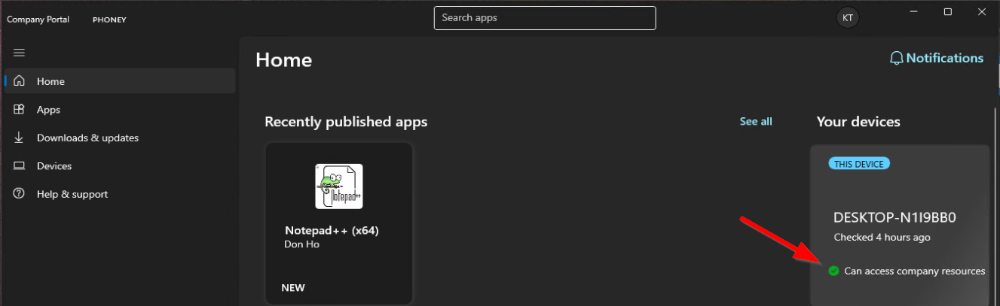
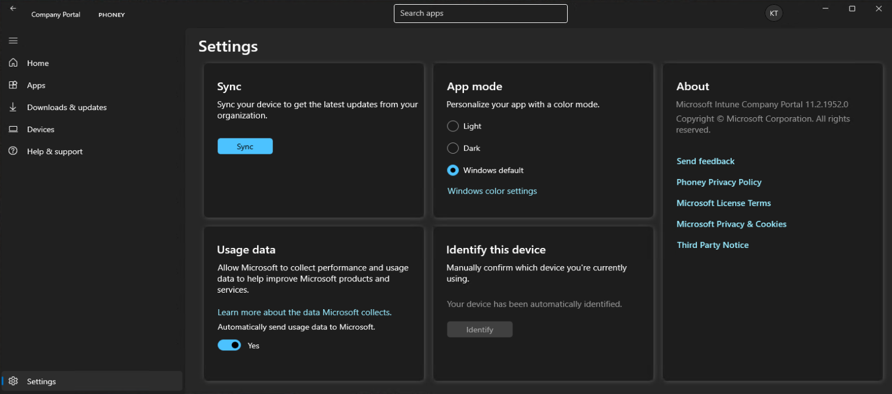
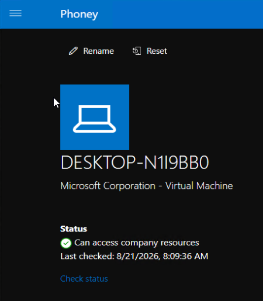
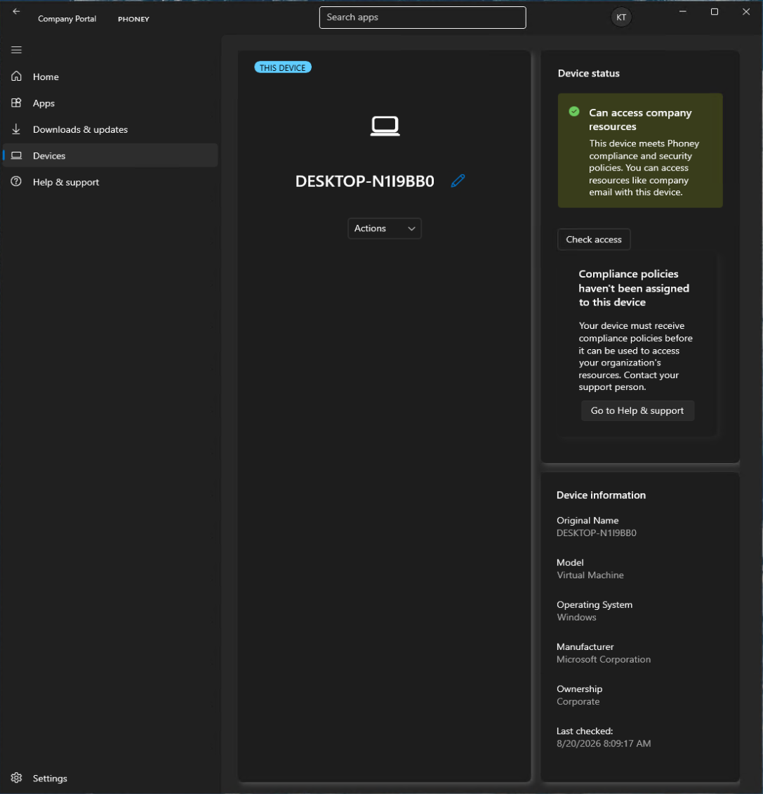

# Sjekk policy-anvendelse på enheten

## Mål
Forstå hvordan policyer leveres og oppdateres på klienten, og hvordan brukeren kan se statusen for compliance og policy-anvendelse.

## Steg for steg

Company Portal viser policyer som er levert av Intune. Brukeren kan se se om enheten som brukes oppfyller kravene for tilgang til bedriftens ressurser, og om det mangler policyer for å gjøre enheten compliant.

### Enhetsstatus og compliance 

I Company Portal, enten under _Home_, eller under _Devices_, vises enhetsstatus tydelig. Grønn status betyr at enheten har tilgang til bedriftens ressurser. 

Dersom policyer mangler vil beskjeden _Compliance policies haven't been assigned_ vises.

### Oppdatering av policyer

Brukeren kan starte synkronisering av policyer manuelt ved å gå til `Company Portal > Settings > Sync` i appen. For web finnes denne under `Devices > Enhet > Check status`. 

### Enhetsinformasjon

Company Portal, under Devices, viser enhetsinformasjon som modell, OS, eierskap og tidspunkt for siste sjekk, noe som gir brukeren en forståelse av hvordan enheten indentifiseres og administres. 

## Refleksjon

Company Portal gir en tydelig og brukervennlig oversikt over hvordan policyer leveres og oppdateres på klienten. Brukere ser både compliance-status, manglende policyer og kan starte synkronisering for å hente oppdateringer. 
Dette gir en mer forutsigbar og selvbetjent opplevelse enn tradisjonelle verktøy, og gjør det enklere å forstå om enheten er compliant eller ikke.