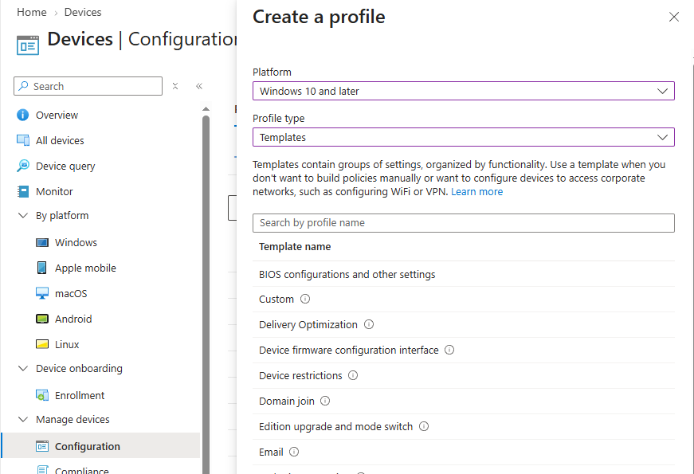
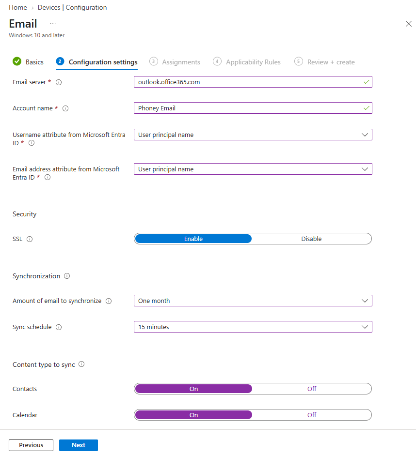
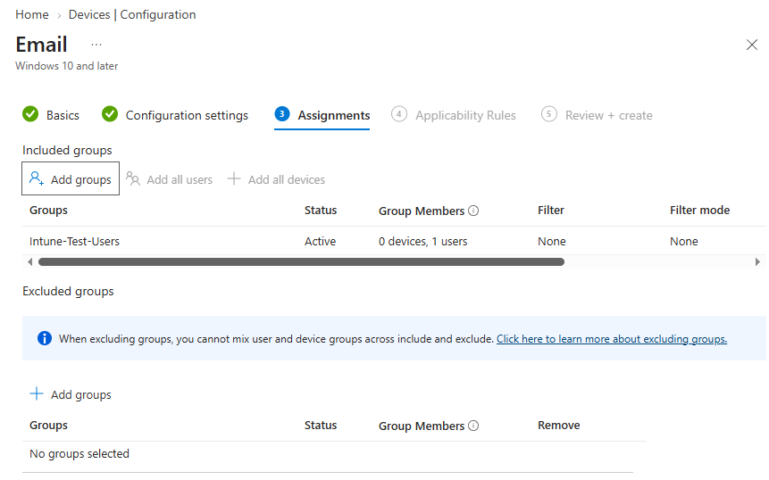

# Opprett en Administrative Templates‑policy

## Mål
Mestre ADMX‑basert styring i Intune.

## Refleksjon

I denne oppgaven opprettet jeg en ren Administrative Templates‑policy i Intune, med en Email‑innstilling som eksempel. Målet var ikke bare å forstå AT som konsept, men å se hvordan en ADMX‑basert innstilling oppfører seg i praksis sammenlignet med Settings catalog‑policyer.

Når jeg velger _Administrative Templates_ som profiltype, får jeg tilgang til ADMX‑baserte innstillinger som er organisert etter applikasjon og komponent. Email‑policyen viser dette godt, siden den kommer direkte fra Microsofts ADMX‑maler og ikke fra CSP‑noder slik Settings catalog gjør.

Oppgaven gjorde det tydelig at _leveransemodellen er annerledes_, AT‑policyen leveres via Intune Management Extension (IME), ikke via MDM‑kanalen. Det betyr at policyen ikke dukker opp i MDM‑diagnostikk eller per‑setting status, men i stedet må verifiseres gjennom IME‑logg, registry og at policyen står som “Succeeded” i Intune. Dette er en viktig forskjell fra Settings catalog, der hver innstilling kan følges som en CSP‑node.

Ved å tilordne policyen til en testgruppe og bruke en enkel Email‑innstilling som case, fikk jeg se hele kjeden: opprettelse i portalen, tildeling, IME‑leveranse og verifisering på klienten. Oppgaven viser hvorfor Administrative Templates fortsatt er relevante, spesielt for app‑spesifikke innstillinger og hybrid‑scenarier, samtidig som at den er en egen leveransemodell ved siden av CSP-baserte policyer.

[Administrative Templates (AT)](../../../Glossary/AdministrativeTemplate.md) er skyversjonen av GPO-innstillinger, og benytter ADMX-logikk. De brukes ofte for Office-policyer, Edge-policyer, OneDrive KFM. Policyene leveres via IME, som fungerer som en agent på klienten og håndterer ADMX-baserte innstillinger. Dette skiller ADMX fra Settings Catalog, som benytter CSP-policyer via MDM-kanalen. 
Settings Catalog er arvtageren til Administrative Templates, men AT er fortsatt nødvendig i hybride miljøer og for enkelte app-policyer. 

## Verifiseringer

Administrative Templates‑policyer verifiseres ikke på samme måte som CSP‑policyer.

De kan ikke sees i:

- `Configuration > Per‑setting status`
- MDM‑diagnostics

AT‑policyer kan verifiseres via:

- IME‑logg
- Registry
- Policyen vises som “Succeeded” i Intune

## Vanlige feil og hvordan de løses

_Feil:_ Velger feil policytype (SC i stedet for AT) 
_Årsak:_ SC ligger øverst i listen og ligner på AT 
_Løsning:_ Velg Administrative Templates når du skal bruke ADMX‑policyer

_Feil:_ Velger feil innstilling (Office vs Windows) 
_Årsak:_ AT‑innstillinger ligger i mange kategorier 
_Løsning:_ Bruk søkefeltet og verifiser ADMX‑navnet

_Feil:_ Glemmer IME‑krav 
_Årsak:_ Tror AT leveres via MDM‑kanalen 
_Løsning:_ IME må være installert for HKCU‑policyer

_Feil:_ Forventer at AT fungerer som CSP 
_Årsak:_ Forveksler leveransemodellene 
_Løsning:_ AT kan stå som Pending til IME kjører

_Feil:_ Tilordner til feil gruppe (user vs device) 
_Årsak:_ AT‑policyer kan være user‑targeted 
_Løsning:_ Velg riktig gruppe basert på policytype

## Steg for steg

Jeg valgte Email‑policyen som eksempel fordi Email‑policyen er en ren ADMX‑basert innstilling og illustrerer Administrative Templates‑modellen tydelig.

- `Devices > Windows > Configuration profiles`
- Create profile
- Platform: Windows 10 and later
- Profile type: Administrative Templates

- Velg en ADMX‑innstilling (f.eks. Email‑policyen)

- Assign til en testgruppe

### Relevant lab

[Forstå IME som leveringsmotor i ESP](../MD-102-Lab-Execute-device-enrollment/MD-102-Configure-Enrollment-Status-Page-IME-PowerShell.md)