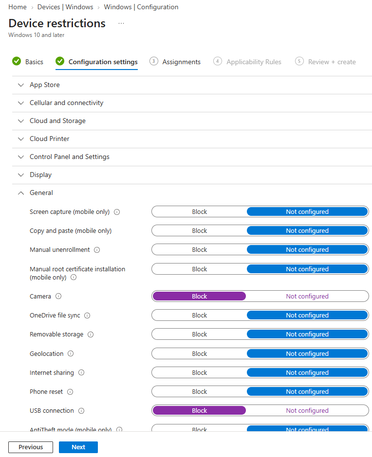
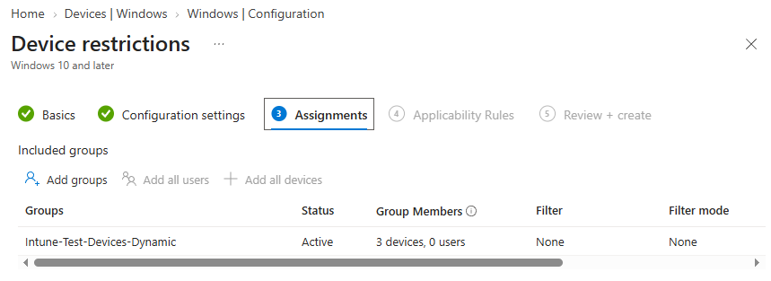
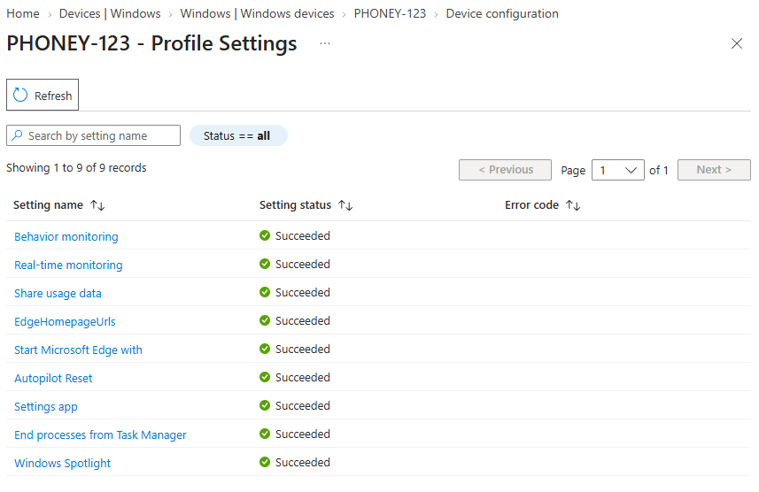

# Konfigurer en Device Restrictions‑policy

## Mål
Forstå hvordan enhetsbegrensninger håndheves i Intune.

## Refleksjon

I denne oppgaven konfigurerte jeg en Device Restrictions‑policy i Intune og brukte blant annet blokkering av kamera, USB og Bluetooth som konkrete eksempler. Målet var å se hvordan MDM‑baserte CSP‑innstillinger håndheves direkte av Windows, og hvordan en ren device‑policy påvirker enheten uavhengig av hvilken bruker som logger inn.

Når jeg oppretter profilen med `Templates > Device Restrictions` og tilordner den til en device‑gruppe, ser jeg at Intune ikke bare lagrer innstillingene, men sender dem som CSP‑policyer til enheten via MDM‑kanalen. Det benyttes en annen modell enn app‑ eller user‑policyer da det er selve enheten som blir begrenset, og resultatet vises direkte i operativsystemet, for eksempel med meldingen “Your camera is disabled by your organization”.

Valget av riktig målgruppe og riktig innstilling er viktig. Hvis policyen tildeles en brukergruppe, blir den aldri evaluert, og hvis flere policyer styrer samme funksjon (for eksempel kamera i både Device Restrictions og Settings catalog), kan det oppstå konflikter. Oppgaven viste at jeg må ha oversikt over hvilke policyer som er autoritative for hver innstilling.

Ved å verifisere at policyen står som _Succeeded_ i Intune, at funksjonene faktisk er deaktivert på enheten, og at apper som Teams og Zoom ikke lenger får tilgang til kamera, fikk jeg se hele kjeden fra Intune‑konfigurasjon til praktisk effekt på klienten. Oppgaven viser hvordan Device Restrictions kan brukes til å standardisere sikkerhetsnivå og brukeropplevelse på tvers av enhetsparken, samtidig som den krever bevisst bruk av device‑grupper og forståelse av CSP‑konflikter.

_Device Restriction-policyer_ er MDM-baserte CSP-innstillinger som håndheves direkte av Windows. De brukes til å styre maskinvarefunksjoner og brukeropplevelse på enheten, som kamera, USB, Bluetooth, lagring og sikkerhetsfunksjoner. I motsetning til user-profiler, slik som Exchange, er dette en ren device-policy som påvirker enheten uavhengig av hvilken bruker som logger inn.

## Verifiseringer

- Policy = _Succeeded_
- Funksjonen er faktisk deaktivert på enheten
- Brukeren får en OS‑melding (f.eks. “Your camera is disabled by your organization”)
- Eventuelle apper som bruker funksjonen feiler (Teams, Zoom, Photos, etc.)

## Vanlige feil og hvordan de løses

_Feil:_ Policy tildeles en brukergruppe  
_Årsak:_ Device Restrictions er en ren device‑policy og evalueres kun mot enheter  
_Løsning:_ Tildel policyen til en device‑gruppe, ellers blir den aldri evaluert

_Feil:_ Enheten er ikke MDM‑enrolled  
_Årsak:_ CSP‑innstillinger krever at enheten er registrert i Intune via MDM  
_Løsning:_ Sørg for at enheten er Intune‑enrolled og at riktig bruker er tilknyttet

_Feil:_ OEM‑restriksjoner eller Windows‑utgave  
_Årsak:_ Enkelte innstillinger krever Enterprise/Education eller spesifikk OEM‑støtte  
_Løsning:_ Verifiser OS‑utgave og OEM‑støtte, oppgrader ved behov

_Feil:_ Funksjon er deaktivert når den skulle vært aktivert  
_Årsak:_ Konflikt med andre policyer (f.eks. kamera blokkert i Device Restrictions, men tillatt i Settings Catalog)  
_Løsning:_ Identifiser konflikt og la en policy være autoritativ for den aktuelle innstillingen

_Feil:_ Innstillinger fungerer ikke i VM  
_Årsak:_ VM mangler fysisk maskinvare (kamera, USB, BT), eller hypervisoren eksponerer ikke funksjonen til gjesten  
_Løsning:_ Test innstillinger som ikke er avhengig av fysisk maskinvare (f.eks. Windows Spotlight, Store, Clipboard)

## Steg for steg

- `Devices > Windows > Configuration profiles`
- Create profile
- Platform: Windows 10 and later
- Profile type: `Templates > Device Restrictions`
- Velg innstillinger som:
    - Kamera: Block
    - USB: Block
    - Bluetooth: Block
    - Windows Spotlight: Off
    - Taskbar settings (valgfritt)
- Assign til _device‑gruppe_
- Sync
- Verifiser

