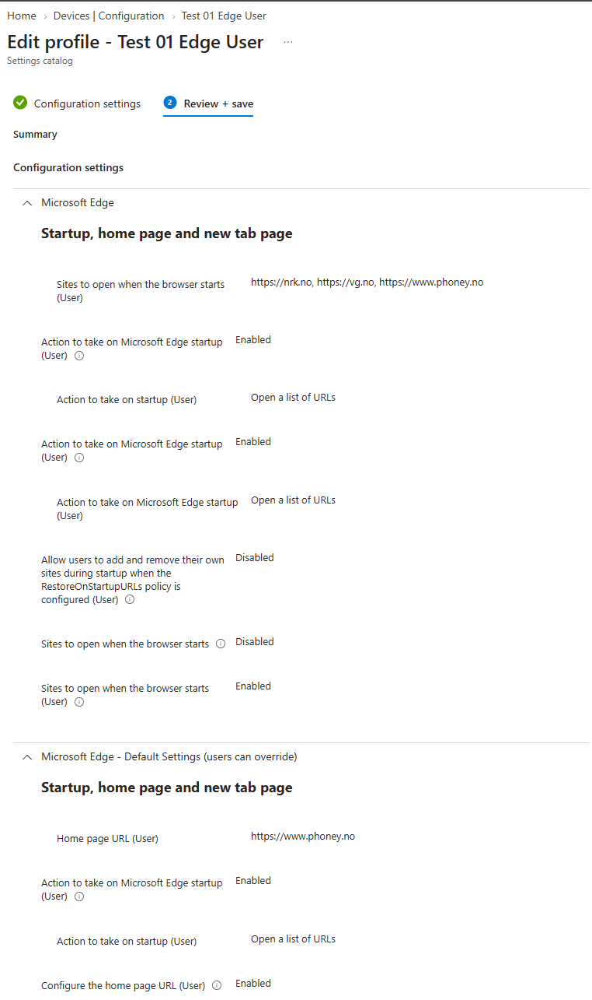
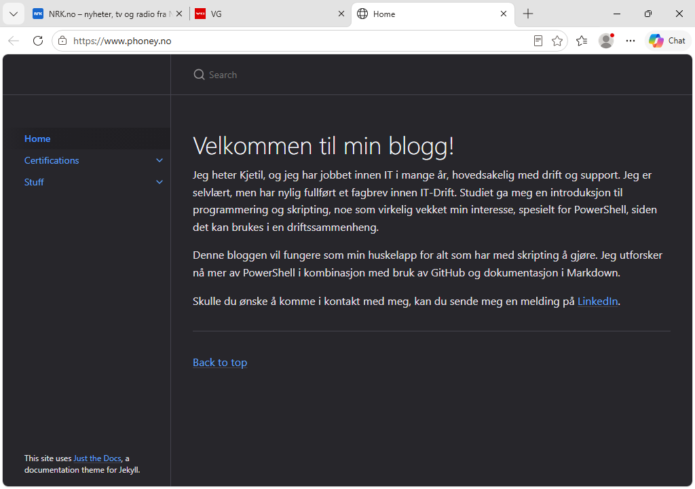

# Opprett en Edge‑policy for brukere

## Mål
Forstå forskjellen mellom bruker‑ og enhetsmålretting.

## Refleksjon

I denne oppgaven opprettet jeg en Edge‑policy som er _user‑scoped_, og brukte en konkret startside‑konfigurasjon som eksempel. Målet var å forstå hvordan user‑målrettede innstillinger oppfører seg annerledes enn device‑policyer, og hvorfor Edge‑innstillinger må leveres til brukeren for å få effekt.

Når jeg opprettet profilen i Settings catalog og valgte User‑scope for både startup‑atferd og URL‑listen, ble det klart at disse innstillingene ikke håndheves av MDM‑motoren, men av Edge‑applikasjonen. Oppgaven viste at policyen først blir aktiv når brukeren logger inn og starter Edge på nytt, og at innstillingene skrives til HKCU i stedet for HKLM. Dette forklarer hvorfor user‑policyer ikke vises under Device configuration i Intune, selv om de er korrekt levert.

Valget av målgruppe er også viktig. Da jeg tildelte policyen til en brukergruppe, ble innstillingene skrevet til brukerens profil og dukket opp i registry under `HKCU\Software\Policies\Microsoft\Edge`. Hadde jeg tildelt den til en device‑gruppe, ville policyen aldri blitt evaluert. Oppgaven gjorde det klart at user‑scope krever en helt annen tilnærming enn device‑scope.

Ved å verifisere endringen i Edge, registry og Event Viewer, fikk jeg se hele leveransekjeden i praksis: Intune leverer policyen til brukeren, ADMX‑innstillingene skrives til HKCU, Edge leser dem ved oppstart, og nettleseren åpner den konfigurerte startsiden. Oppgaven viser hvordan user‑policyer kan være fullt ut aktive uten at Intune viser noen synlig status på enheten, og hvorfor man må bruke verifiseringsmetoder som er spesifikke for brukerprofilen.

## Verifiseringer

### På enheten (User-scope)

- _Lukk Edge helt og åpne den igjen_ > Nettleseren skal starte med siden du har konfigurert (f.eks. `https://www.phoney.no`).
- _Logg ut og inn igjen_ > User‑policyer lastes inn ved ny innlogging. Edge skal nå bruke startside‑policyen.
- _Registry (HKCU)_ > Under `HKCU\Software\Policies\Microsoft\Edge` skal du se nøkler for:
    - `RestoreOnStartup`
    - `RestoreOnStartupURLs`
    - `HomepageLocation` Dette bekrefter at User‑scope ADMX‑innstillinger er skrevet til profilen.
- _Event Viewer_ > `DeviceManagement-Enterprise-Diagnostics-Provider > Admin`
    - Se etter “ADMX ingestion” og “User policy applied”.

### Intune (policy levert)

- _Policy status > Per‑setting status_ > Viser “Delivered to user”. (User‑policyer vises _ikke_ under Device configuration.)
- _Enheten > Sync_ > Bekrefter at enheten har mottatt policyen, selv om den ikke vises i Device configuration.

## Vanlige feil og hvordan de løses

_Feil:_ Policyen er tildelt en device‑gruppe.  
_Årsak:_ User‑scope Edge‑innstillinger evalueres kun når de leveres til brukeren.  
_Løsning:_ Tildel policyen til en brukergruppe og synkroniser enheten.

_Feil:_ Edge viser fortsatt standard startside.  
_Årsak:_ Edge må restartes for å laste inn nye user‑scope ADMX‑innstillinger.  
_Løsning:_ Lukk Edge helt og åpne den igjen.

_Feil:_ Policyen er levert, men ingen endring skjer.  
_Årsak:_ Brukeren har ikke logget ut og inn etter policy‑levering, og HKCU‑innstillingene er ikke oppdatert.  
_Løsning:_ Logg ut av Windows og inn igjen.

_Feil:_ Startup‑URL‑ene brukes ikke.  
_Årsak:_ Startup‑atferd er ikke konfigurert; Edge vet ikke at den skal bruke URL‑listen.  
_Løsning:_ Sett _Action to take on startup (User)_ til *Open a list of URLs*.

_Feil:_ Edge bruker en annen startside enn den som er konfigurert.  
_Årsak:_ En baseline, device‑scope‑policy eller eldre ADMX‑policy overstyrer User‑scope.  
_Løsning:_ Sjekk om brukeren eller enheten har andre Edge‑policyer som kan ta prioritet.

_Feil:_ Settings catalog viser “duplikater” av samme innstilling.  
_Årsak:_ Catalog viser både _User_ og _Default (users can override)_ for samme setting.  
_Løsning:_ Konfigurer kun _User‑scope_ for innstillinger som skal håndheves.

_Feil:_ Registry viser riktige nøkler, men Edge ignorerer dem.  
_Årsak:_ Edge‑profilen er cached eller korrupt (vanlig i lab‑VM).  
_Løsning:_ Opprett ny testbruker eller slett Edge‑profilen.

## Steg for steg

- _Devices > Windows > Configuration profiles_
- _Opprett profil:_ _Create profile_
    - _Platform:_ Windows 10 and later
    - _Profile type:_ Settings catalog
	    - Trykk _Add settings_
	    - Søk etter _Microsoft Edge_
	    - Velg kategorien _Startup, home page and new tab page_
			- _Konfigurer startup‑atferd (User):_
			    - _Action to take on Microsoft Edge startup (User):_
			        - _Enabled_
			        - Sett til _Open a list of URLs_
			- _Konfigurer hvilke sider som skal åpnes (User):_
			    - _Sites to open when the browser starts (User):_
			        - _Enabled_
			        - Legg inn ønsket URL (f.eks. `https://www.phoney.no`)
			- _Konfigurer hjemmside (User – Default settings):_
			    - Under _Microsoft Edge – Default Settings (users can override):_
			        - _Configure the home page URL (User):_
			            - _Enabled_
			            - Sett _Home page URL (User)_ til `https://www.phoney.no`
			        - _Action to take on startup (User):_
			            - _Open a list of URLs_
		
- _Assign policy:_
    - Tildel profilen til en _brukergruppe_ (ikke device‑gruppe)
- _Sync og verifisering:_
    - Verifiser at Edge starter med `https://www.phoney.no` som startside

