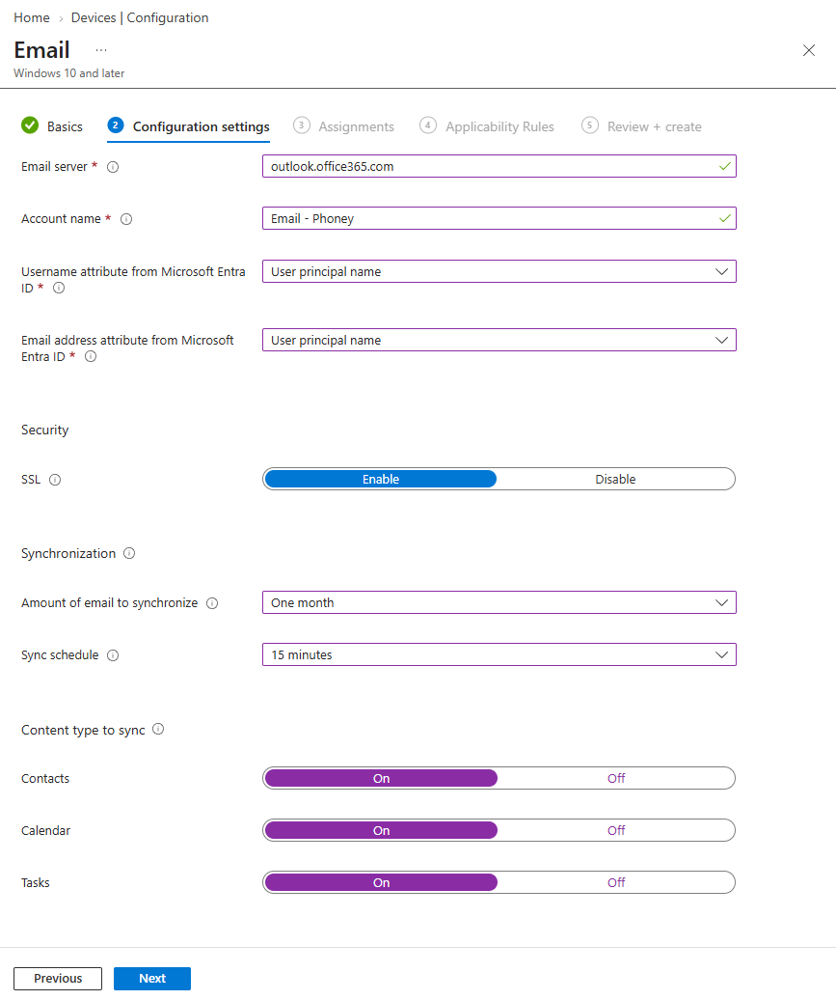
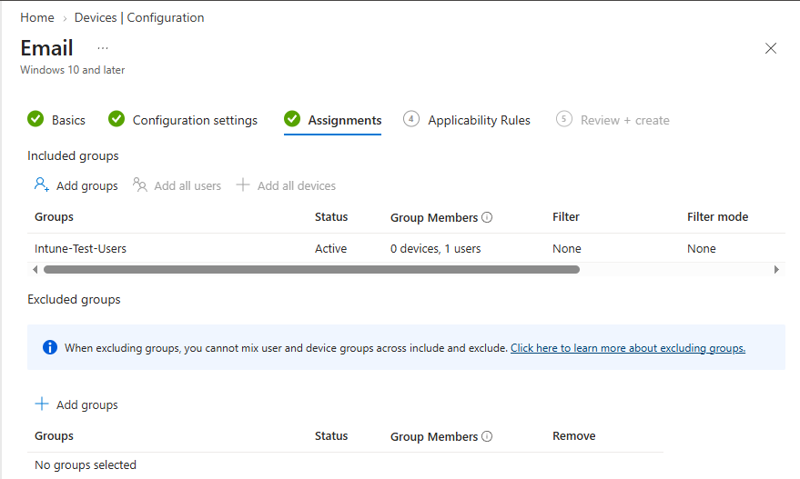

# Opprett en e‑postprofil (Exchange Online)

## Mål
Forstå hvordan Intune kan konfigurere brukeropplevelsen direkte.

## Refleksjon

Exchange-profiler distribueres via _MDM-kanalen_ og opprettes som en _Template-policy_, da epostinnstillinger ikke finnes i _Settings Catalog_ eller _Administrative Templates_. Intune bruker _Email CSP_ til å opprette en Exchange Online-konto automatisk for brukeren i Windows. Outlook starter dermed ferdig konfigurert basert på Entra ID-identiteten uten at brukeren må skrive inn epostadressen, servernavn eller passord.

## Verifiseringer

- Policy vises som _Succeeded_ i Intune
- Outlook starter uten at brukeren må skrive inn:
    - e‑postadresse
    - servernavn
    - kontotype
- Kontoen dukker opp under:
    - `Settings > Accounts > Email & accounts`
    - `Outlook > Connected accounts`

## Vanlige feil og hvordan de løses

_Feil:_ Policyen er tildelt en device-gruppe. 
_Årsak:_ Exchange-profilen er en CSP-policy som kun leveres til brukere. 
_Løsning:_ Bruk en _bruker-gruppe_, eller blir profilen aldri evaluert.

_Feil:_ Brukere får "cannot find mailbox". 
_Årsak:_ Feil UPN-attributt, manglende Exchange Online-lisens eller deaktivert postboks. 
_Løsning:_ Bruk UPN og verifiser at brukeren har aktiv postboks i Exchange Online.

_Feil:_ Feil serveradresse. 
_Årsak:_  On-prem-server eller feil hostname er brukt. 
_Løsning:_ Exchange Online krever `outlook.office365.com`.

_Feil:_ Kontoen opprettes ikke i Windows. 
_Årsak:_  Brukeren logger inn på en enhet som ikke er MDM-enrolled. 
_Løsning:_ Sørg for at enheten er Intune-enrolled og at brukeren er primærbruker på enheten.

## Steg for steg

- `Devices > Windows > Configuration profiles`
- Create Policy
- Platform: Windows 10 and later
- Profile type: `Templates > Email`
- Konfigurer
	- _Email server:_ `outlook.office365.com`
	- _Account name_
	- _Email address_ (ofte UPN)
	- _Username_ (ofte UPN)
	- _Sync settings_
	

- Assign til en brukergruppe

