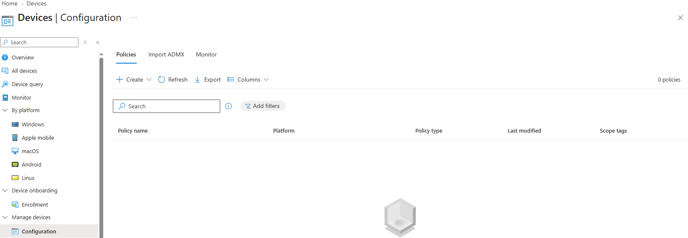
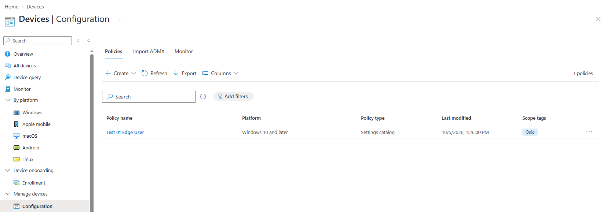
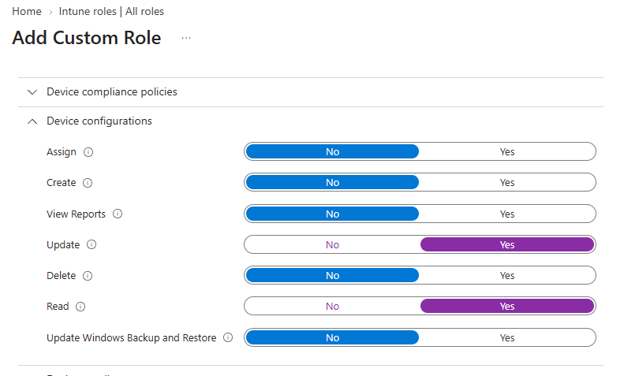
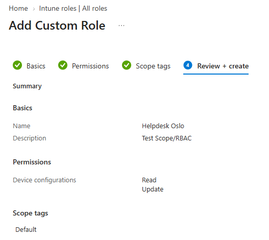
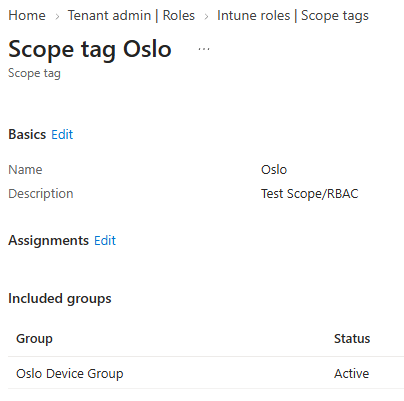
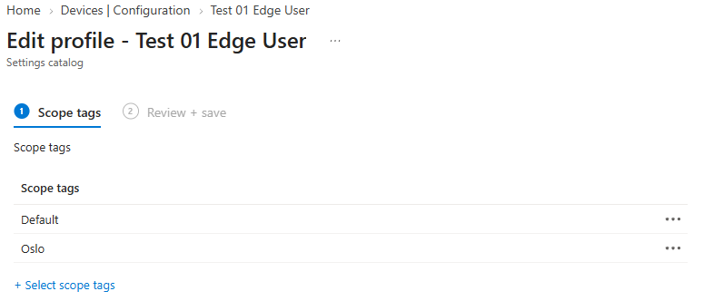
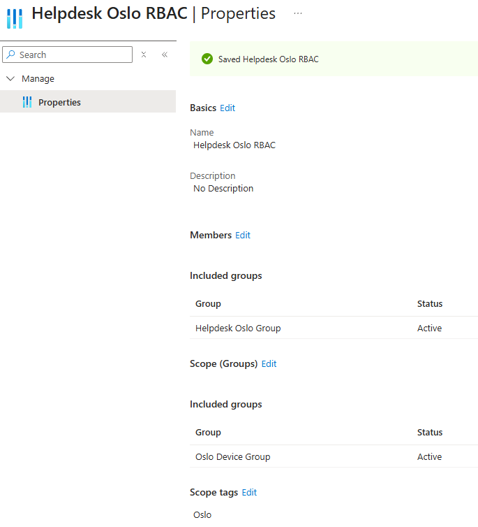

# Test _scope tags_ og RBAC

## Mål
Forstå hvordan Intune segmenterer administrasjon i større miljøer.

## Refleksjon

Arbeidet med RBAC og _scope tags_ i Intune ble langt mer krevende enn forventet. Det som i utgangspunktet skulle være en enkel verifisering av delegert tilgang, utviklet seg til en grundig feilsøkingsøvelse der jeg måtte forstå hvordan den nye Intune‑portalen faktisk oppfører seg i små tenants. Jeg oppdaget at [dokumentasjonen](https://learn.microsoft.com/en-us/intune/fundamentals/role-based-access-control/overview) og lab‑guidene ikke samsvarer med nåværende portal, når dette skulle ha fungert i endpoint.microsoft.com. Dette skapte en situasjon der jeg fulgte alle stegene riktig, men likevel fikk «Access restriction» og en tom device‑liste.

RBAC‑konfigurasjonen i seg selv fungerte hele tiden. _scope tags_, scope groups og rollen jeg hadde laget var korrekt. Problemet lå i portalen, ikke i konfigurasjonen. Den nye portalen krever Graph‑metadata som små tenants visstnok ikke har, og dette gjør at RBAC‑brukere uten Intune Administrator ikke får lastet device‑listen. Det betyr at synlighet feiler, mens rettighetene fungerer. RBAC må verifiseres gjennom policy‑synlighet, ikke device‑synlighet, når portalen ikke leverer.

Jeg måtte derfor endre tilnærming. I stedet for å fokusere på enheter, brukte jeg konfigurasjonspolicyer for verifisering. Når Helpdesk Oslo kun ser profiler med Oslo‑tag, og ikke ser profiler med Default‑tag, er RBAC bekreftet. Dette er en ren og tydelig måte å demonstrere delegert tilgang på, og den fungerer selv når device‑listen er ubrukelig. A/B‑testen med _scope tags_ fungerte som forventet, Oslo‑taggede objekter vises, Default‑taggede objekter skjules.

Jeg fikk ut fra denne prosessen med en forståelse av forskjellen mellom RBAC‑permissions og RBAC‑visibility. Permissions fungerer alltid. Visibility er avhengig av portalens evne til å hente metadata.  Jeg sitter igjen med en dypere forståelse av Intune‑plattformen, og jeg vet nå hvordan jeg skal verifisere RBAC i miljøer der portalen ikke oppfører seg som dokumentert.

Til slutt er dette en påminnelse om at Intune ikke alltid er forutsigbart, og at feilsøking ofte handler om å forstå plattformens begrensninger, ikke bare konfigurasjonen. 

### Teknisk påminnelse

Intune bruker tre mekanismer for delegert administrasjon:

- _Entra‑roller_ avgjør om en bruker i det hele tatt får logge inn i Intune
- _RBAC‑rollen_ avgjør hvilke handlinger brukeren kan utføre
- __scope tags__ avgjør hvilke objekter brukeren får se

RBAC gir rettigheter, mens _scope tags_ gir synlighet. 

En admin kan derfor ha korrekte RBAC‑rettigheter, men likevel se en tom portal hvis objektene ikke har matchende _scope tags_. Når _scope tags_ og RBAC er riktig konfigurert, vil brukeren kun se og administrere objekter som tilhører sitt område, uten behov for separate Intune‑miljøer. 

## Verifiseringer

Verifiseringen av RBAC og _scope tags_ måtte gjøres gjennom _policy‑synlighet_, siden device‑listen i den nye Intune‑portalen ikke lastet for RBAC‑brukeren. Dette er likevel en korrekt og fullverdig måte å teste RBAC på, fordi policy‑synlighet styres av _scope tags_ og RBAC‑rollen, uavhengig av device‑listen.

### Ingen profiler har Scope tag `Oslo` > Helpdesk Oslo ser ingenting

Dette er “B” i A/B‑testen: RBAC‑brukeren skal _ikke_ se objekter som ikke er tagget med `Oslo`.

Når ingen profiler har _Scope tag `Oslo`_ vil listen være tom.

_Policy‑listen er tom når ingen profiler har Oslo‑tag._

Dette bekrefter at RBAC‑synlighet fungerer, objekter uten matchende Scope tag skjules.

### En profil tagges med Scope tag `Oslo` > Helpdesk Oslo ser den

Dette er “A” i A/B‑testen: RBAC‑brukeren skal se objekter som er tagget med `Oslo`.

Når Test 01 Edge User‑profilen får Scope tag `Oslo`, blir den synlig for Helpdesk Oslo.

_Når en profil er tagget med en _Scope tag `Oslo`_ vil denne være synlig for Helpdesk Oslo._

Dette viser at RBAC‑synlighet fungerer som tiltenkt, `Oslo`‑taggede objekter vises.

## Vanlige feil og hvordan de løses

_Feil:_ Admin ser ingen enheter eller policyer.  
_Årsak:_ Scope tag er ikke tilordnet objektene.  
_Løsning:_ Legg til Scope tag på enheter, policyer eller apper.

_Feil:_ Admin har riktig Scope tag, men får “Access denied”.  
_Årsak:_ RBAC‑rollen mangler nødvendige permissions.  
_Løsning:_ Gi rollen riktige rettigheter (f.eks. Read/Update på Devices eller Configuration profiles).

_Feil:_ Admin ser alt i Intune.  
_Årsak:_ Admin er medlem av en global rolle (Intune Administrator).  
_Løsning:_ Fjern global rolle og bruk kun custom RBAC‑rolle.

_Feil:_ Scope tag er tilordnet rollen, men ikke objektene.  
_Årsak:_ _scope tags_ må knyttes til både admin og objekter for å fungere.  
_Løsning:_ Tilordne Scope tag til policyer/enheter.

_Feil:_ Admin ser policyen, men ikke enhetene den gjelder for.  
_Årsak:_ Enhetene mangler Scope tag.  
_Løsning:_ Legg Scope tag på enhetsgruppen.

_Feil:_ Flere _scope tags_ skaper forvirring.  
_Årsak:_ Objekter kan ha flere _scope tags_, og admin ser unionen av dem.  
_Løsning:_ Bruk én konsistent Scope tag per team/område.

## Steg for steg

- _Intune admin center → Tenant administration → Roles_
- _Opprett RBAC‑rolle:_
    -  Create > Intune role > Custom role
    - Gi rollen et navn
    - Velg kun nødvendige permissions (f.eks. Read/Update på Devices)
    - Under _Scope (Tags)_: velg _ingen_ ennå (gjøres senere)
- _Opprett Scope tag:_
    - Tenant administration → _scope tags_
    - Create → Navn: “Oslo”
    - Tilordne tag til enhetsgruppe (f.eks. “Devices – Oslo”)
- _Tilordne Scope tag til objekter:_
    - (Gå til Devices, hvis enheten ikke ligger i valgt device-group → velg enheter → Properties → _scope tags_ → legg til “Oslo”)
    - Gå til Configuration profiles → velg policy → Properties → _scope tags_ → legg til “Oslo”
- _Tilordne RBAC‑rolle til admin:_
    - Tenant administration → Roles → velg rollen → Assignments
    - Velg grupper for admin og scope (device)
    - Under _Scope (Tags)_: velg “Oslo”
- _Logg inn som delegert admin og test:_
    - Admin skal kun se:
        - Policyer med Scope tag “Oslo”
    - Admin skal kun kunne utføre handlinger definert i RBAC‑rollen