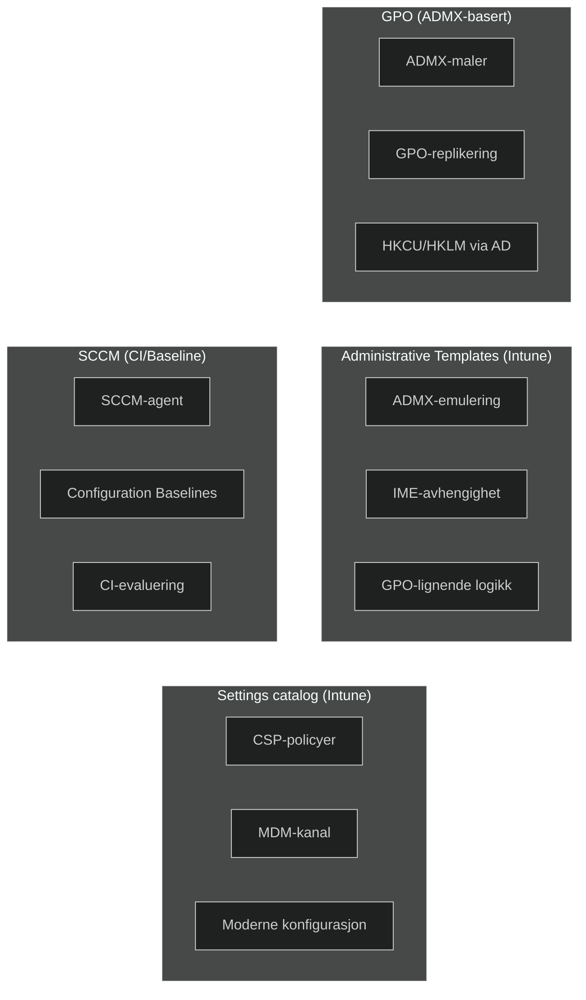
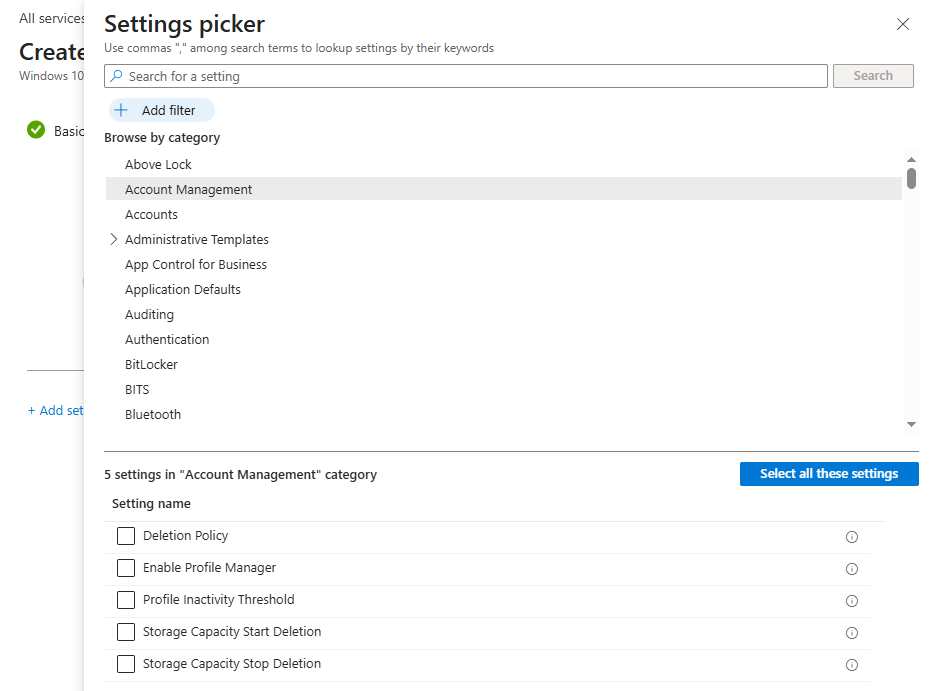

# Konfigurasjonsprofil for Windows‑innstillinger

## Mål
Opprette en konfigurasjonsprofil for Windows‑innstillinger ved hjelp av _Settings catalog_, og forstå hvordan moderne MDM‑konfigurasjon fungerer i Intune.

## Refleksjon

I denne oppgaven fikk jeg praktisk erfaring med hvordan moderne Windows‑konfigurasjon fungerer i Intune.[ _Settings catalog_](../../../Glossary/Settings-Catalog.md) gir en ren MDM‑flyt basert på CSP‑policyer ([Configuration Service Provider](../../../Glossary/Configuration-Service-Provider.md)), noe som gir en presis og forutsigbar administrasjonsmodell.
Dette minner om hvordan jeg jobbet med Configuration Item (CI) og baselines i SCCM der målrettede innstillinger ble levert via en definert kanal, uten [ADMX‑avhengigheter](../../../Glossary/ADMX.md).
[_Administrative Templates_](../../../Glossary/AdministrativeTemplate.md) finnes som et alternativ, men de behandles først i neste oppgave, siden de bygger på ADMX‑logikk og har en annen leveransemodell.

## Verifiseringer

- På test‑enheten: `Device > Configuration > Per‑setting status`
- Bekreft at innstillingene leveres via _MDM‑kanalen (CSP)_

## Vanlige feil og hvordan de løses

_Feil:_ Velger feil plattform (Windows 10 and later vs Windows 11).  
_Årsak:_ Antar at plattformvalget ikke påvirker tilgjengelige CSP‑innstillinger.  
_Løsning:_ Velg riktig plattform basert på OS‑versjonen på test‑enheten. Enkelte CSP‑er finnes kun i Windows 11.

_Feil:_ Velger Administrative Templates i stedet for Settings catalog.  
_Årsak:_ Bruker grensesnittet raskt og klikker på “Administrative Templates” fordi det ligner GPO‑logikk.  
_Løsning:_ Velg _Settings catalog_ for moderne MDM‑konfigurasjon. Administrative Templates brukes først i neste oppgave (ADMX).

_Feil:_ Velger feil innstilling i Settings catalog (f.eks. feil variant av Allow/Enable/Configure).  
_Årsak:_ Mange CSP‑innstillinger har nesten identiske navn, og noen gjelder bruker i stedet for enhet.  
_Løsning:_ Les beskrivelsen i høyre panel og verifiser at innstillingen gjelder riktig kontekst (device/user).

_Feil:_ Tilordner profilen til feil gruppe (brukere vs enheter).  
_Årsak:_ Intune skiller mellom user‑targeted og device‑targeted policyer.  
_Løsning:_ Bruk en _device‑gruppe_ for Windows‑innstillinger. User‑grupper kan føre til “Pending”.

_Feil:_ Forventer at CSP‑policyer slår inn umiddelbart.  
_Årsak:_ Antar at MDM‑kanalen fungerer som GPO‑replikering.  
_Løsning:_ Sørg for at enheten er online, har gyldig PRT, og trigge sync manuelt ved behov.

## Steg for steg

### Opprett profil

- `Devices > Windows > Configuration profiles`
- Create profile
- Platform: _Windows 10 and later_
- Profile type: _Settings catalog_

### Legg til innstillinger

- Velg _Add settings_
- Naviger i kategorier eller bruk søk
- Velg relevante Windows‑innstillinger (f.eks. Account Management)
  

Bildet viser _Settings picker_ i Intune, der jeg velger Windows‑innstillinger via Settings catalog. Dette er grensesnittet for moderne CSP‑basert konfigurasjon.

### Assign

- Tilordne profilen til en _device‑gruppe_
- Fullfør opprettelsen

### Relevant lab

[Exploit Guard uten Exploit protection baseline](../MD-102-Lab-Execute-device-enrollment/MD-102-Configure-Enrollment-Status-Page-Security.md): Viser hvordan man konfigurere en _Exploit Guard-baseline uten Exploit protection_ for moderne sikkerhetsfunksjoner i Windows 11.