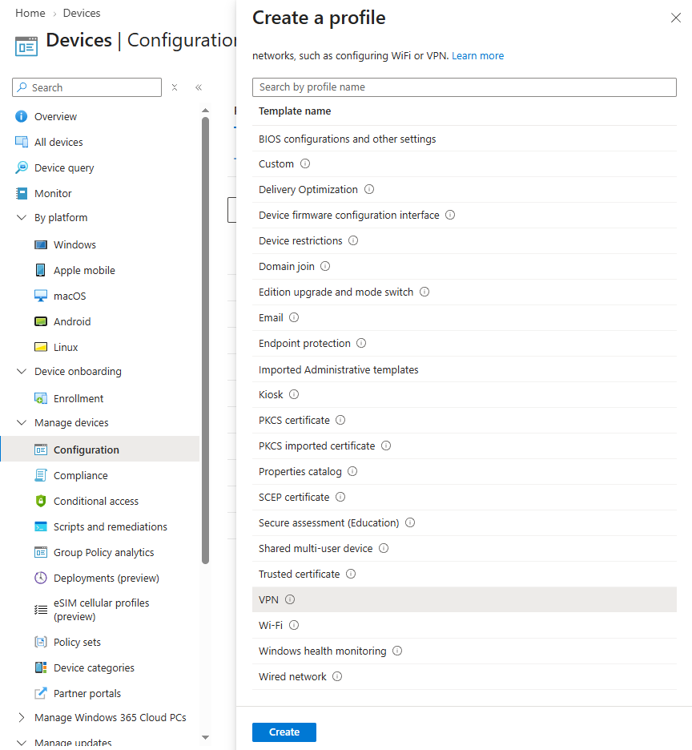
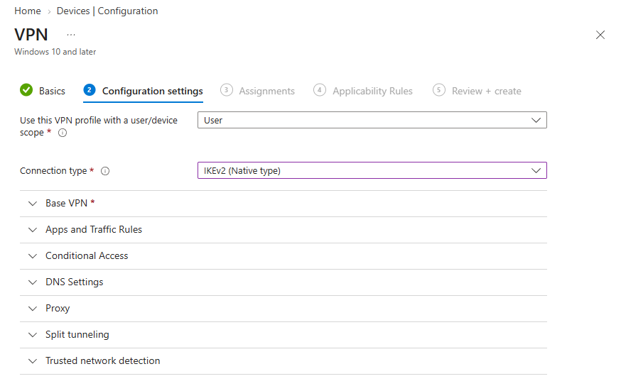

# Opprett en VPN‑profil

## Mål
Forstå hvordan VPN‑konfigurasjon leveres via MDM.

## Refleksjon

I denne oppgaven opprettet jeg en VPN‑profil i Intune som en Template‑policy, og brukte en konkret tilkobling mot en definert VPN‑server som eksempel. VPN‑konfigurasjon leveres via MDM‑kanalen, og ligger ikke i Settings catalog, da den må konfigureres som egen mal.

Når jeg oppretter profilen med `Templates > VPN`, ser jeg at Intune ikke bare lagrer innstillingene, men bygger en full VPN‑tilkoblingsprofil som Windows kan bruke direkte. Oppgaven viser hvordan parametere som connection name, serveradresse, tilkoblingstype (IKEv2, L2TP osv.) og autentisering (bruker/passord eller sertifikat) til sammen utgjør en komplett profil som brukeren kan koble seg til uten manuell konfigurasjon.

Intune‑profilen må matche med infrastrukturen: riktig VPN‑type i forhold til server, riktig autentiseringsmetode, og at sertifikatprofiler (PKCS/SCEP) må tilordnes samme gruppe når sertifikatbasert autentisering brukes. Feil her gir en profil som ser riktig ut i Intune, men som ikke fungerer på klienten.

Ved å verifisere at profilen står som _Succeeded_ i Intune, at den dukker opp under `Settings > Network & Internet > VPN`, og at tilkoblingen faktisk fungerer fra klienten, fikk jeg se hele leveransekjeden i praksis. Oppgaven viser hvordan Intune kan standardisere VPN‑tilkobling for brukere, og samtidig hvor sårbar konfigurasjonen er for små feil i typevalg, autentisering og gruppe‑tilordning.

VPN‑profiler distribueres via MDM‑kanalen og må opprettes som en _Template‑policy_, siden VPN‑innstillinger ikke finnes i Settings Catalog. Intune bruker denne profilen til å konfigurere automatisk tilkobling til en definert VPN-server. Den støtter IKEv2, PPTP, L2TP og SSL-baserte klienter.

## Verifiseringer

- Policy vises som _Succeeded_ i Intune
- Klienten får VPN‑profilen under:
    - `Settings > Network & Internet > VPN`
- Brukeren kan koble til uten manuell konfigurasjon
- Hvis automatisk tilkobling er aktivert > enheten kobler seg når betingelser er oppfylt

## Vanlige feil og hvordan de løses

_Feil:_ Velger Settings Catalog 
_Årsak:_ Tror VPN ligger der 
_Løsning:_ Bruk Templates > VPN

_Feil:_ Feil VPN‑type 
_Årsak:_ Velger PPTP når serveren krever IKEv2 
_Løsning:_ Verifiser serverens krav

_Feil:_ Feil autentisering 
_Årsak:_ Bruker passord når server krever sertifikat 
_Løsning:_ Bruk PKCS/SCEP‑sertifikatprofil

_Feil:_ Feil gruppe (user vs device) 
_Årsak:_ Brukergruppe får ikke device‑policy 
_Løsning:_ Bruk device‑gruppe

## Steg for steg

- `Devices > Windows > Configuration profiles`
- Create profile
- Platform: Windows 10 and later
- Profile type: `Templates > VPN`
- Fyll inn:
    - Connection name
    - VPN server address
    - Connection type (IKEv2, L2TP, etc.)
    - Authentication (username/password eller sertifikat)
- Assign til gruppe

