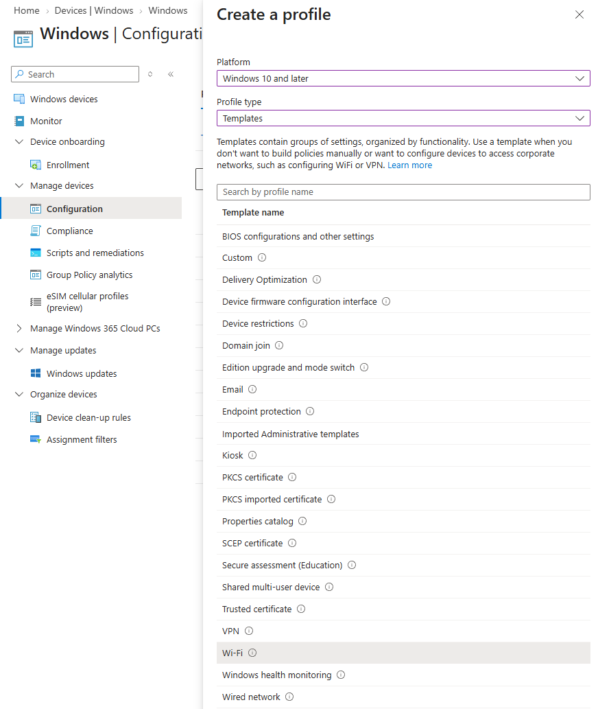
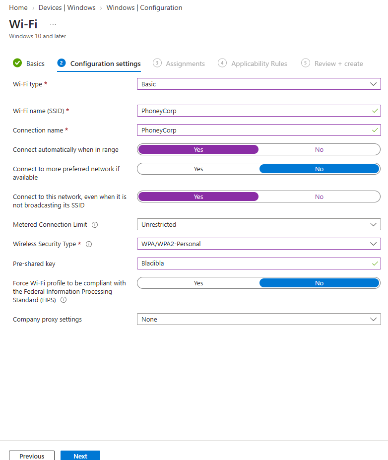
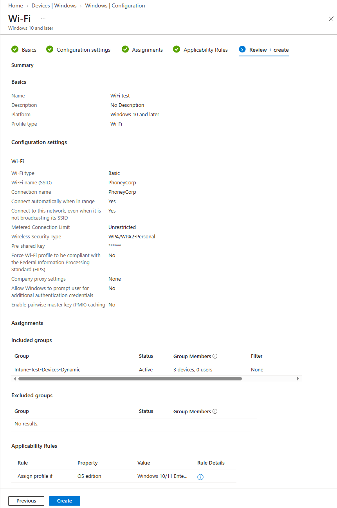

# Konfigurer en Wi‑Fi‑profil

## Mål
Forstå hvordan nettverksprofiler distribueres via Intune.

## Refleksjon

I denne oppgaven opprettet jeg en Wi‑Fi‑profil i Intune som en Template‑policy, og brukte et konkret SSID som eksempel. Målet var å se hvordan nettverksprofiler distribueres via MDM‑kanalen, og hvordan Intune kan standardisere tilkobling til et bestemt trådløst nettverk uten at brukeren trenger å konfigurere noe manuelt.

Når jeg velger `Templates > Wi‑Fi` som profiltype, får jeg mulighet til å definere SSID, sikkerhetstype (for eksempel WPA2‑Personal med PSK eller WPA2‑Enterprise) og eventuelle autentiseringsparametere. Disse verdiene til sammen utgjør en komplett nettverksprofil som Windows lagrer som en “known network”, og som enheten kan koble seg automatisk til når nettverket er tilgjengelig.

Det er viktig å matche Intune‑profilen med det faktiske nettverket. Riktig SSID uten tastefeil, riktig sikkerhetstype, og riktig målgruppe (device‑gruppe fremfor user‑gruppe) siden tilkoblingen gjelder enheten. Feil her gir en profil som ser riktig ut i Intune, men som aldri brukes av klienten.

Ved å verifisere at profilen står som _Succeeded_ i Intune, at den dukker opp under `Settings > Network & Internet > Wi‑Fi > Manage known networks`, og at enheten faktisk kobler seg automatisk til SSID, fikk jeg se hele leveransekjeden i praksis. Oppgaven viser hvordan Intune kan sikre konsistent Wi‑Fi‑tilkobling for alle enheter, samtidig som den avhenger av nøyaktig konfigurasjon og riktig gruppe‑tilordning.

Wi‑Fi‑profiler distribueres via MDM‑kanalen og må opprettes som en _Template‑policy_, siden Wi‑Fi‑innstillinger ikke finnes i Settings Catalog. Intune bruker denne profilen til å konfigurere automatisk tilkobling til et definert SSID, enten med PSK eller Enterprise‑autentisering. Wi‑Fi‑profiler er typisk device‑targeted, siden tilkoblingen gjelder enheten, ikke brukeren.

## Verifiseringer

Wi‑Fi‑profiler verifiseres slik:

- Policy vises som _Succeeded_ i Intune
- Klienten får Wi‑Fi‑profilen under:
    - `Settings > Network & Internet > Wi‑Fi > Manage known networks`
- Enheten kobler seg automatisk til SSID når nettverket er tilgjengelig

## Vanlige feil og hvordan de løses

_Feil:_ Velger Settings Catalog 
_Årsak:_ Tror Wi‑Fi ligger der 
_Løsning:_ Bruk `Templates > Wi‑Fi`

_Feil:_ Feil sikkerhetstype (WPA2‑Enterprise vs WPA2‑Personal) 
_Årsak:_ Velger WPA2‑Enterprise når nettverket er WPA2‑Personal 
_Løsning:_ Verifiser nettverkstype før opprettelse

_Feil:_ Feil gruppe (device vs user) 
_Årsak:_ Brukergruppe får ikke device‑policy 
_Løsning:_ Bruk device‑gruppe

_Feil:_ Feil SSID 
_Årsak:_ Tastefeil 
_Løsning:_ Kopier SSID fra nettverket

_Feil:_ Nettverket er utenfor rekkevidde 
_Årsak:_ Testmaskinen er ikke i nærheten av SSID 
_Løsning:_ Test på riktig lokasjon

## Steg for steg

- `Devices > Configuration > Policies`
- Create Policy
- Platform: Windows 10 and later
- Profile type: `Templates > Wi‑Fi`
- Fyll inn SSID + sikkerhet
- Assign til gruppe
- Fullfør

