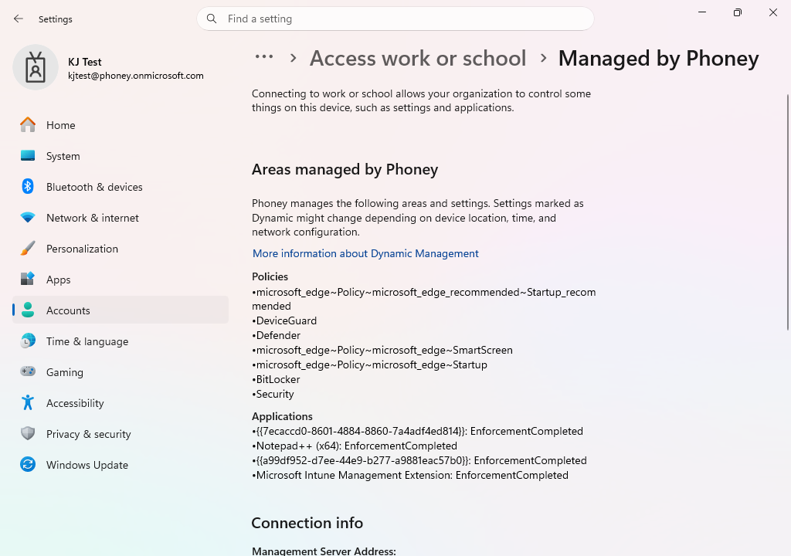
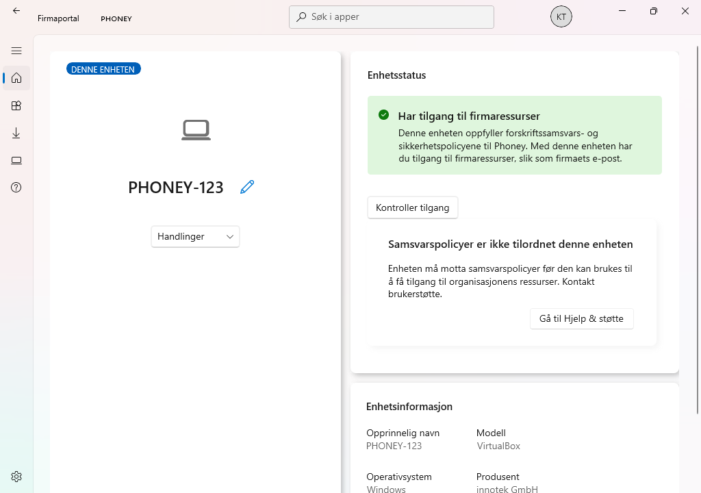
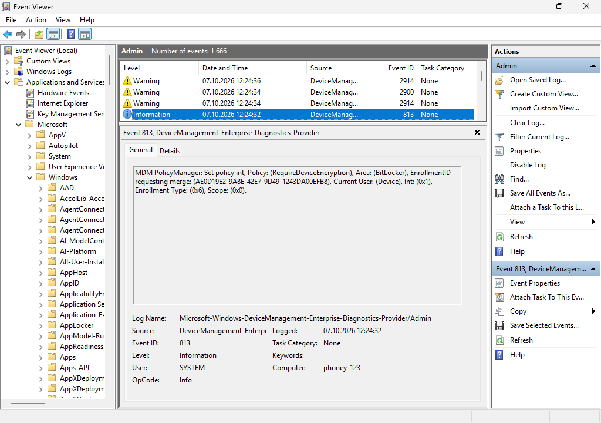
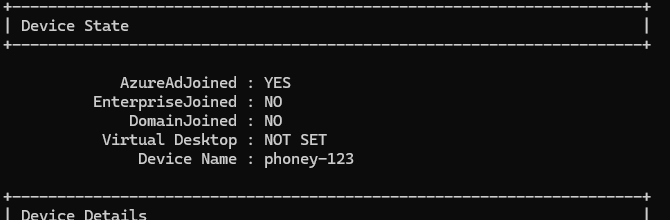
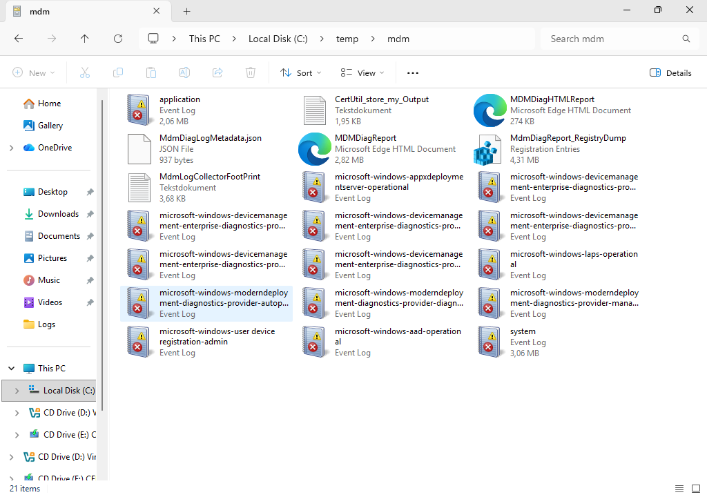
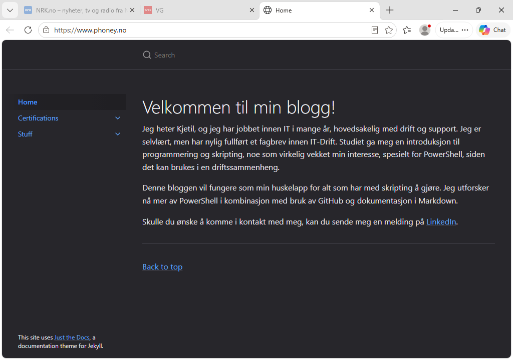

# Analyser policy‑anvendelse på klienten

## Mål
Forstå hvordan policyer leveres og feilsøkes på klienten.

## Refleksjon

Policy‑anvendelse på Windows‑klienten er en prosess der Windows mottar, tolker og anvender Intune‑policyer via [Open Mobile Alliance Device Management (OMA-DM)](../../../Glossary/Open-Mobile-Alliance-Device-Management)‑kanalen. For å forstå leveransekjeden må en kombinasjon av GUI-verktøy og kommandolinje/MDM-diagnostikk benyttes.

Det første jeg oppdaget er at policyer ikke nødvendigvis leveres umiddelbart. Windows synker mot Intune etter faste intervaller, og enkelte policyer krever omstart før de blir aktive. Derfor er **Sync**‑funksjonen i både Company Portal og Access work or school helt sentral når man tester policy‑leveranse.

For teknisk feilsøking er **Event Viewer** det mest presise verktøyet. Under DeviceManagement‑Enterprise‑Diagnostics‑Provider så jeg hvilke CSP‑noder som ble skrevet, når policyen ble lastet ned, og om det oppstod feil, noe som gir en forståelse av hvordan Intune kommuniserer med Windows.

Kommandolinjeverktøyene er også viktige. `dsregcmd /status` bekrefter Azure AD‑tilstand og MDM‑registrering, mens `mdmdiagnosticstool.exe` genererer en CAB‑fil som inneholder hele MDM‑historikken, inkludert policy‑leveranse, feil og tidsstempler. _**Bildet av**_ `C:\temp\mdm` viser at rapporten ble generert og inneholder EVTX‑logger, HTML‑rapport og registry‑dump. Dette er et av de mest detaljerte verktøyene i Intune‑feilsøking.

Til slutt er det avgjørende å bekrefte at policyen faktisk er aktiv i Windows. Intune kan vise “Success”, men innstillingen kan likevel være inaktiv hvis den krever omstart, bruker‑logoff eller hvis CSP‑noden ikke støttes. Oppgaven viser hvor viktig det er å kombinere flere verktøy for å få et helhetlig bilde av policy‑leveranse.

### Teknisk påminnelse

Intune leverer policyer til Windows via OMA-DM‑kanalen. Leveransekjeden består av:

- Enheten registreres i Intune (MDM enrollment)
- Enheten mottar en MDM‑token
- Windows synker mot Intune‑tjenesten
- Policyer lastes ned og skrives til CSP‑noder
- Windows‑komponenter aktiverer innstillingene

Feilsøking handler om å bekrefte at alle disse stegene fungerer.

## Verifiseringer

### Bekreft MDM‑tilkobling

`Settings > Accounts > Access work or school > Info`

- MDM‑tilkobling aktiv
- Last sync timestamp
- Sync‑knapp

### Bekreft policy‑status i Company Portal

- Enheten er compliant
- Ingen manglende policyer
- Sync for å trigge leveranse

### Bekreft policy‑leveranse i Event Viewer

`Applications and Services Logs > Microsoft > Windows > DeviceManagement‑Enterprise‑Diagnostics‑Provider > Admin`

Se etter:

- “Successfully applied policy”
- CSP‑node skrevet
- Feilmeldinger ved manglende leveranse

### Bekreft policy‑leveranse via kommandolinje

#### Azure AD‑status

```
dsregcmd /status
```

Se etter:

- AzureAdJoined = YES
- MDMUrl = `https://enrollment.manage.microsoft.com` 
- TenantId
- JoinType

#### Generer MDM Diagnostic Report

```
mdmdiagnosticstool.exe -area DeviceEnrollment -cab c:\temp\mdm.cab
```

Rapporten inneholder:

- policy‑leveranse
- feil
- tidsstempler
- CSP‑noder
- MDM‑registrering

### Bekreft policyen i Windows

Eksempel:

- Edge‑innstilling aktiv
- Firewall‑regel opprettet
- Defender‑innstilling endret

## Vanlige feil og hvordan de løses

_Feil:_ Policy vises som “Pending” i Intune. 
_Årsak:_ Enheten har ikke synket. 
_Løsning:_ Bruk Sync i Company Portal eller Access work or school.

_Feil:_ Policy vises som “Success”, men er ikke aktiv i Windows. 
_Årsak:_ Policy krever omstart eller bruker‑logoff. 
_Løsning:_ Restart enheten.

_Feil:_ Policy leveres ikke til enheten. 
_Årsak:_ Enheten er ikke i riktig gruppe. 
_Løsning:_ Bekreft at enheten ligger i gruppen policyen er tildelt.

_Feil:_ Policy feiler i Event Viewer. 
_Årsak:_ CSP‑node ikke støttet på denne Windows‑versjonen. 
_Løsning:_ Oppdater Windows eller bruk en annen policy.

## Steg for steg

- Logg inn på klienten
- Åpne `Access work or school > Info > Sync`

- Åpne `Company Portal > Device status`
- Bekreft compliance og policy‑status

- Åpne `Event Viewer > DM‑EDP > Admin`
- Finn loggmeldinger for policy‑leveranse

- Kjør `dsregcmd /status`

- Generer MDM‑diagnostikk med `mdmdiagnosticstool.exe`

- Åpne Windows‑innstillingen som policyen skal endre
- Bekreft at innstillingen er aktiv


