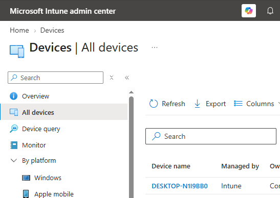
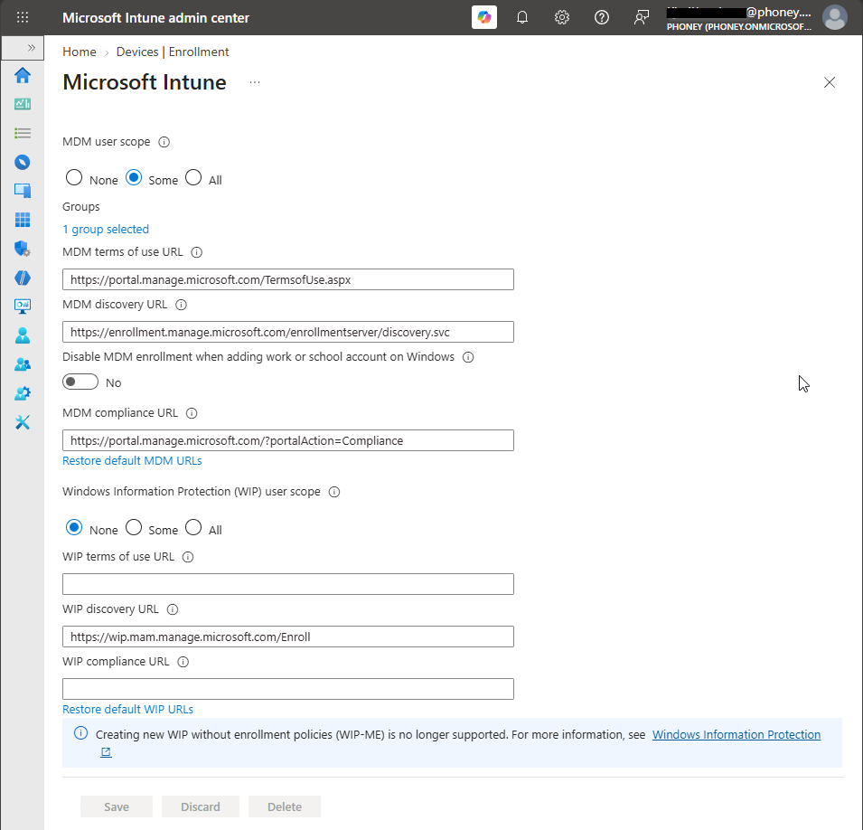
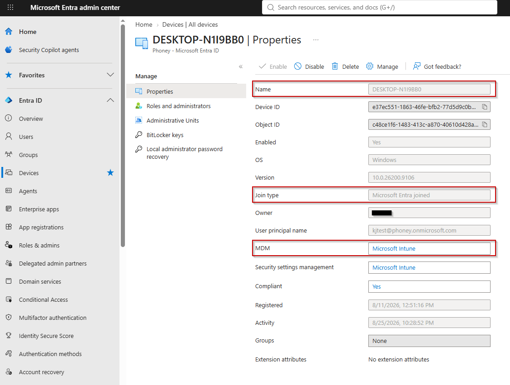

# Konfigurer automatisk MDM‑registrering

## Mål
Forstå hvordan enheter automatisk registreres i Intune ved Entra‑tilknytning.

## Refleksjon

Automatisk MDM‑registrering er koblingen mellom Entra‑identiteten og Intune‑administrasjonen. Når en enhet blir Entra‑tilknyttet, sørger denne innstillingen for at Intune‑registreringen skjer automatisk uten at brukeren må gjøre noe manuelt. Dette er en kritisk del av moderne administrasjon, fordi det sikrer at enheter blir håndtert av Intune fra første øyeblikk og kan motta policyer, apper og sikkerhetsinnstillinger umiddelbart etter join.

## Verifiseringer

Enheten skal:
- dukke opp i Intune med MDM-status `Managed` 
  
- være `Azure AD joined`
- ha en gyldig MdmUrl
- vises i Entra ID med korrekt join-type

## Vanlige feil og hvordan de løses

_Feil_: Brukeren får ikke automatisk MDM-registrering<br>
Årsak: Brukeren er ikke medlem av gruppen som valgt under `Some`<br>
_Løsning_: Legg til brukeren i riktig gruppe eller sett `All` midlertidig for testing

_Feil_: Enheten dukker ikke opp i Intune<br>
_Årsak_: Enheten er kun `Azure AD` **`registered`**<br>
_Løsning_: Utfør full `Azure AD join`

_Feil_: MdmUrl mangler i `dsregcmd /status` <br>
_Årsak_: Automatic enrollement er ikke aktivert<br>
_Løsning_: Aktiver MDM-registrering i Intune

## Steg for steg



Under `Intune Admin center > Devices > Device onboardinng > Enrollment > Automatic Etnrollet` velges for automatisk _MDM-registrering_ når en enhet er tilknyttet Entra. 
I mitt tilfelle ble `Some` valgt da jeg kun ønsker at dette skjer med bestemte brukergrupper. 

Når enheten blir _Azure AD joined_ i Entra ID, vil _Automatic MDM enrollment_ sørge for at enheten _automatisk registreres i Intune_ uten at brukeren trenger å gjøre noe manuelt. Dett er koblingen mellom _Entra-indentiteten_ og _Intune-administrasjonen_.




For å bekrefte at enheten er tilkoblet riktig kan du i `Entra admin center > Devices > Device` se etter feltene: 
- Device Name
- Join type
- MDM status

```cmd
C:\Windows\System32>dsregcmd /status

+----------------------------------------------------------------------+
| Device State                                                         |
+----------------------------------------------------------------------+

             AzureAdJoined : YES
               Device Name : DESKTOP-N1I9BB0

+----------------------------------------------------------------------+
| Tenant Details                                                       |
+----------------------------------------------------------------------+

                    MdmUrl : https://enrollment.manage.microsoft.com/enrollmentserver/discovery.svc
```

På klienten kan kommandoen `dsregcmd /status` benyttes for å sjekke de samme opplysningene. Se etter feltene: 
- AzureAdJoined = Yes
- MDMUrl

