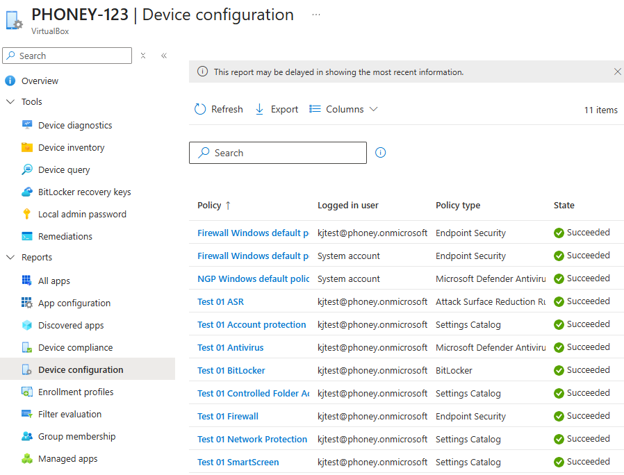
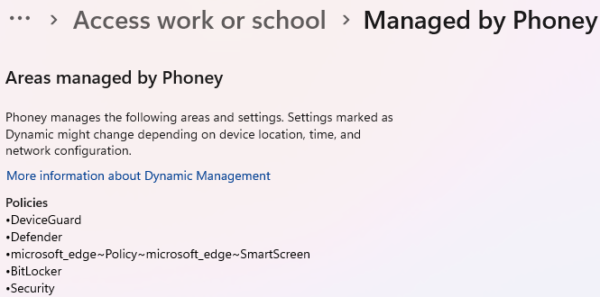

# Exploit Guard uten Exploit protection baseline

## Mål
Konfigurere en _Exploit Guard-baseline uten Exploit protection_ for moderne sikkerhetsfunksjoner i Windows 11 og øke forståelsen av Autopilot-miljøer.

## Forutsetninger
- Enrolled Win 11 klient 
- IME installert
- Ferdig oppsatt språk/region

## Refleksjon

Arbeidet med denne Exploit Guard‑konfigurasjonen viser hvordan sikkerhetsfunksjoner i Windows 11 leveres i et Intune‑miljø, og hvorfor det er viktig å skille mellom hva Intune _kan_ styre direkte og _hva som nå ligger under Microsoft Defender for Endpoint i moderne drift_. Det ble raskt tydelig at Exploit protection ikke lenger er en del av Intune‑baselines, og at resten av Exploit Guard må håndteres gjennom Settings Catalog og Endpoint Security for å få en konsistent og forutsigbar policy‑leveranse.

Prosessen har vist meg hvordan ASR, Network Protection, Controlled Folder Access, SmartScreen, Antivirus og Firewall henger sammen som en helhet, og hvordan tildeling til bruker‑ eller device‑grupper påvirker både leveranse og feilsøking. Samtidig har begrensningene i VirtualBox gjort at enkelte funksjoner, som Credential Guard og TPM‑basert BitLocker krever riktig maskinvarestøtte for å kunne verifiseres. Dette har vært en nyttig påminnelse om at policy‑status og policy‑effekt ikke alltid er det samme i et labmiljø.

Verifiseringsdelen har også vært en viktig del av læringen. Bruken av både GUI, Event Viewer og PowerShell har gitt meg et helhetlig bilde av hvordan policyene lander på klienten, og gjør det enklere å forstå hvorfor konflikter oppstår og hvordan de løses. Spesielt har det vært nyttig å se hvordan Intune håndterer overlappende policyer, og hvorfor “last writer wins” kan skape uforutsigbar adferd hvis man blander baselines og Settings Catalog.

Alt i alt har denne oppgaven gitt et _komprimert og praktisk innblikk_ i hvordan sikkerhetsfunksjoner bør konfigureres, verifiseres og driftes i et Autopilot‑basert miljø, og hvorfor presis policy‑design er avgjørende for å unngå konflikter og sikre en stabil og sikker klientopplevelse.

## Verifiseringer

### Verifisering i portalen



Gå til gjeldene klient `Device > Device Configuration > Per-policy status`

### Verifisering på klient

#### GUI

##### Settings



Det eneste stedet som viser alle policyene som er lastet ned til klienten ligger under `Settings > Accounts > Access work or school > Entra ID > Info > Configuration Profiles`

##### Event Viewer

Den mest detaljerte måten å se status på er loggen som ligger under `Event Viewer > Applications and Services Logs > Microsoft > Windows > DeviceManagement-Enterprise-Diagnostics-Provider > Admin`. Her ser du: 
- policy mottatt
- policy brukt
- policy feilet
- conflicts
- CSP‑navn
- verdier som ble satt

#### PowerShell

##### Defender-policyer

```powershell
Get-MpComputerStatus
Get-MpPreference
```

##### Firewall-policyer

```Powershell
Get-NetFirewallProfile
```

##### BitLocker-policyer

```PowerShell
Get-BitLockerVolume
manage-bde.exe -status <drive letter>:
```

##### Credential Guard

```PowerShell
Get-CimInstance -ClassName Win32_DeviceGuard | Select-Object SecurityServicesConfigured, SecurityServicesRunning
```

##### Network Protection

```PowerShell
Get-MpPreference | Select EnableNetworkProtection
```

##### SmartScreen

```PowerShell
Get-ItemProperty -Path 'HKLM:\SOFTWARE\Microsoft\Windows\CurrentVersion\Explorer'
Get-ItemProperty -Path 'HKLM:\SOFTWARE\Policies\Microsoft\Edge\'
```

## Vanlige feil og hvordan de løses

_Feil:_ Konflikter mellom policyer, f.eks. Antivirus og Network Protection får konflikt med _NGP Windows default policy_.<br>
_Årsak:_ Intune kan ikke slå policyene og "last writer wins"<br>
_Løsning:_ Enten deaktivere (fjern Assignements) _NGP Windows default policy_ som er Microsoft default/starter baseline for miljøer som ikke har egne sikkerhetspolicyer, eller ta bort de to policyene som er opprettet ovenfor. Siden dette er en lab deaktiveres _NGP Windows default policy_.

_Feil:_ Aktiverer både Security Baselines og Settings Catalog og får en uforutsigbar policy-adferd<br>
_Årsak:_ Skaper duplikater, konflikter, feilrapportering. <br>
_Løsning:_ Baselines overstyrer Settings Catalog
- Baselines er "opinionated" og setter mange ting du ikke ser i GUI
- Settings Catalog er mer nøyaktig og presis

_Feil:_ SmartScreen vises ikke i Defender-cmdletene<br>
_Årsak:_ SmartScreen styres av Windows Shell (App&Browser control), Edge policyer og Store apps<br>
_Løsning:_ Sjekk registry.

## Steg for steg

_Exploit Guard_ består av fire deler:
- Attack Surface Reduction
- Network Protection
- Controlled Folder Access
- Exploit protection

I dagens Intune‑portal
- ASR > fungerer
- Network Protection > fungerer
- CFA > fungerer
- Exploit protection > _fungerer ikke_ (backend fjernet, ligger nå under Microsoft Defender for Endpoints)
  Exploit protection kan kun styres via MDE Security Settings Management og leveres ikke lenger via Intune-baselines.


### Konfigurasjon

#### ASR‑policy

ASR-policyen blokkerer de mest kritiske angrepsvektorene i Office, skriptmiljøet, LSASS og USB-baserte prosesser. De mer støyende eller mer diftssensetive reglene er satt til _Audit_ for å gi innsikt uten å blokkere legitime prosesser.

#### Network Protection

_Network Protection_ settes til Audit for å gi innsikt i ondsinnet trafikk uten å blokkere legitime prosesser. Policyen tildeles brukergruppen med hensikt, siden dette er et labmiljø der målet er er sikre rask og konsistent leveranse i et Autopilot-basert miljø. 
I et produksjonsmiljø ville policyen ha blitt tildelt en device-gruppe og ondsinnet trafikk ville blitt blokkert.

#### Controlled Folder Access

_Controlled Folder Access (CFA)_ settes til _Audit_ for å gi innsikt i forsøk på uautoriserte endringer i beskyttende foldere uten å blokkere legitime prosesser. Policyen tildeles brukergruppen siden dette er et labmiljø. 
I et produksjonsmiljø ville policyen blitt tildelt en device-gruppe, og CFA ville vært aktivert i blokk-modus.

#### SmartScreen‑policy

_SmartScreen_ aktiveres for å gi beskyttelse mot ondsinnede websider, utrygge nedlastninger og potensielt uønskede apper. SmartScreen består av tre komponenter: Windows Shell SmartScreen, Edge SmartScreen og Store-app SmartScreen. 
DNS-baserte SmartScreen-kontroller aktiveres, og brukere hindres fra å omgå advarsler. Domain-unntak og AppRep-deaktivering fjernes for å sikre full beskyttelse. 
Policyen tildeles brukergruppen, men ville ha blitt tildelt en dvice-gruppe i produksjonsmiljø.

#### Antivirus‑policy

_Defender Antivirus_ konfigureres med _Real-time protection, cloud-delivered protection_ og _automatic sample submission_ for å sikre en moderne og kontinuerlig trusseloppdagelse. 
Policyen tildeles device-gruppen i et produksjons-miljø og innstillinger som skanningsplaner og PUA-kontroller blitt håndtert via Microsoft Defender for Endpoint eller en sikkerhetsbaseline.

#### Firewall‑policy

_Windows Defender Firewall_ aktiveres med _Real-time for Domain‑, Private‑ og Public‑profilene med blokkering av innkommende trafikk og tillatelse av utgående trafikk. Logging av droppede pakker og tillatte forbindelser er aktivert i labmiljøet for å gi full innsikt i trafikk som blokkeres og tillates. 
I produksjonsmiljøer logges kun droppede pakker, mens innstillinger som Local Policy Merge, User Preference Merge og IPsec Policy Merge normalt deaktiveres for å sikre at Intune‑policyen håndheves uten lokale unntak. 

| Innstilling                | Lab   | Produksjon |
| -------------------------- | ----- | ---------- |
| Local Policy Merge         | True  | False  |
| User Pref Merge            | True  | False  |
| IPsec Merge                | True  | False  |
| Enable Log Dropped Packets | True  | True       |
| Log Success Connections    | False | False  |
| Default inbound            | Block | Block      |
| Default outbound           | Allow | Allow      |

#### BitLocker‑policy

_BitLocker_ konfigureres med TPM-basert kryptering, XTS-AES256 for alle drivetyper og automatisk lagring av recovery-nøkler i Entra ID. Recovery-rotasjon er aktivert, og OS-disken krypteres fullt ut. AD DS-relaterte innstillinger er deaktivert siden lab-miljøet er Entra-basert. Removable drives kan beskyttes av brukeren, og recovery-alternativer vises i oppsettet.

VirtualBox støtter ikke TPM, så klienten vil bruke fallback‑modus i lab.

##### Opprett Account protection

_Account Protection_ konfigureres med _Credential Guard_ aktivert med _UEFI-lock_ for å beskytte autentiseringshemmeligheter. _Windows Hello_ aktiveres både på enhets- og brukernivå med en PIN-policy på 4-6 tegn. Anti-spoofing aktiveres i prod-miljøer for å sikre at biometisk autentisering ikke kan omgås.

Credential Guard krever VBS, Secure Boot og TPM. VirtualBox støtter ikke dette, så funksjonen kan ikke aktiveres i lab.


