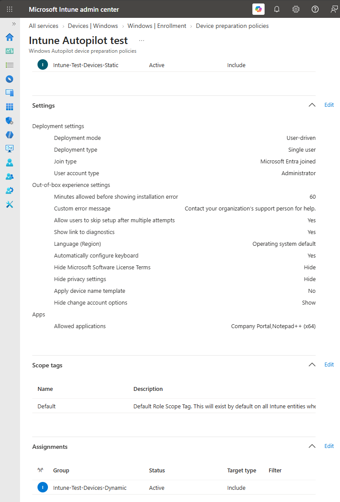
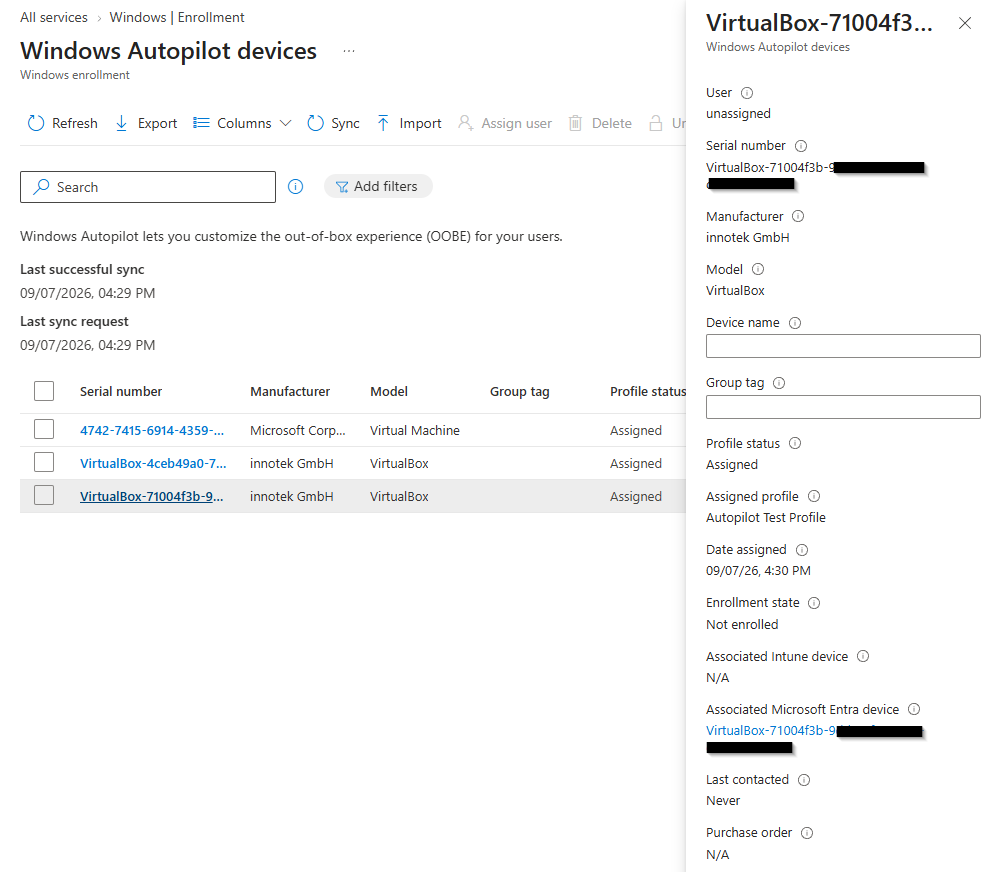

# Konfigurere Enrollment Status siden

## Mål
Forstå hvordan ESP styrer brukeropplevelsen under utrulling.

## Forutsetning

Denne oppgaven forutsetter at [ Autopilot‑setup er fullført](MD-102-Configure-Enrollment-Status-Autopilot-setup.md). ESP bygger videre på Device Preparation‑policyen og required apper som ble definert i forrige oppgave.

## Refleksjon

[Enrollment Status Page (ESP)](../../../Glossary/Enrollment-Status-Page.md) hovedoppgave er å være en kontrollmekanisme som styrer hva brukeren får gjøre under utrullingen, den skal hindre bruk før utrullingen er ferdig. _ESP_ vises under [Autopilot](../../../Glossary/Windows-Autopilot.md) / _Device Preparation_ og sikrer at _kritiske apper, policyer og konfigurasjoner_ blir installert før brukeren når skrivebordet.

ESP sørger for at enheten er klar til bruk ved å kontrollere at required apper og nødvendige policyer er levert før skrivebordet åpnes.For at dette skal fungere må [Autopilot‑oppsettet være riktig konfigurert](MD-102-Configure-Enrollment-Status-Autopilot-setup.md), inkludert en Device Preparation‑policy som faktisk leverer Win32‑apper. Uten dette blir IME ikke installert, og enheten kan fullføre ESP uten å motta kritiske sikkerhetsinnstillinger.

I tillegg håndterer ESP ikke leveranse av [sikkerhetsfunksjoner](MD-102-Configure-Enrollment-Status-Page-Security.md) som Attack Surface Reduction, Network Protection, Controlled Folder Access eller SmartScreen. Disse policyene krever Intune Management Extension (IME) og blir først levert etter at enheten er ferdig enrollert. Dette betyr at en enhet kan fullføre ESP, men fortsatt mangle kritiske sikkerhetsinnstillinger dersom IME ikke er installert. Dette er nærmere forklart i oppgaven om IME som leveringsmotor for sikkerhetspolicyer.

ESP håndterer ikke [språk, tastaturoppsett, regionformat og dato‑/tidsformat](MD-102-Configure-Enrollment-Status-Page-LangRegion-Keyboard-24H.md), og disse finnes heller ikke som innstillinger i Intune Settings Catalog eller Administrative Templates. Slike innstillinger blir først anvendt etter enrollment, enten via Autopilot‑språkvalg eller [PowerShell‑scripts levert av Intune IME](MD-102-Configure-Enrollment-Status-Page-IME-PowerShell.md). Dette er særlig relevant i VM‑miljøer og i scenarier der installasjonsmediet har et annet språk enn ønsket sluttkonfigurasjon.

## Verifiseringer

- Klienten:
	- ESP skal vises i OOBE etter Entra‑innlogging
	- Required apper skal installeres før skrivebordet åpnes
	- Policyer skal rapporteres som “Completed” eller “In progress”
	- Skrivebordet skal blokkeres til ESP er ferdig
- Intune:
	- ESP‑profilen skal være tildelt riktig gruppe
	- Device Preparation skal vise status for Device setup og Account setup
	- Win32‑apper må være merket som Required for enheten

## Vanlige feil og hvordan de løses

_Feil:_ Required apper installeres ikke under ESP 
_Årsak:_ Appen er ikke merket som Required 
_Løsning:_ Sett appen som Required for Autopilot‑gruppen

_Feil:_ ESP hopper over app‑installasjon 
_Årsak:_ Device Preparation‑policy mangler Win32‑apper 
_Løsning:_ Legg Win32‑apper inn i Device Preparation

_Feil:_ ESP henger på “Identifying” eller “Preparing” 
_Årsak:_ Nettverksproblemer eller manglende tilgang til Intune‑endepunkter 
_Løsning:_ Test nettverk, proxy, SSL‑inspection

_Feil:_ ESP vises ikke 
_Årsak:_ ESP‑profilen er ikke tildelt 
_Løsning:_ Sjekk Assignments i Intune

## Steg for steg

> Note
> Denne oppgaven forutsetter at Autopilot‑setup er fullført. ESP bygger videre på Device Preparation‑policyen og required apper som ble definert i forrige oppgave.

- Åpne Intune admin center Gå til `Intune admin center > Devices > Windows devices > Device onboarding > Entrollment > Enrollment Status Page`.
- Opprett eller rediger ESP‑profil Velg enten å opprette en ny ESP‑profil eller redigere en eksisterende som skal brukes for Autopilot‑enheter.
- Konfigurer visning og blokkering Sett at ESP skal vises for brukere under Autopilot / Device Preparation. Aktiver blokkering av bruk til required apper og policyer er installert (Block device use until all apps and profiles are installed).
- Definer timeout og reset‑atferd Angi hvor lenge ESP kan vente før den gir feil (for eksempel 60 minutter). Velg om brukeren skal kunne resette enheten hvis utrullingen feiler.
- Sikre at required apper er riktig definert Kontroller at Win32‑apper som skal være på plass før første innlogging er merket som Required for Autopilot‑gruppen. Bekreft at disse appene er inkludert i Device Preparation‑policyen.
- Tildel ESP‑profilen til riktig gruppe Under Assignments, velg den gruppen som inneholder Autopilot‑enhetene (for eksempel en dynamisk gruppe basert på ZTDID eller Autopilot‑tag).
- Start en Autopilot‑enhet for test Reset eller klargjør en testklient som er registrert for Autopilot. Start OOBE og logg inn med Entra‑kontoen som er i riktig gruppe.
- Observer ESP under OOBE Bekreft at ESP vises etter Entra‑innlogging. Se at required apper og policyer listes og installeres før skrivebordet blir tilgjengelig.
- Verifiser resultatet i Intune Gå tilbake til Intune admin center og åpne enheten under Devices. Kontroller status for Device setup og Account setup, og at required apper er rapportert som installert.
- Kontroller IME og sikkerhetspolicyer etter enrollment På klienten, verifiser at Intune Management Extension (IME) er installert. Sjekk at sikkerhetspolicyer (ASR, NP, CFA, SmartScreen) leveres etter at ESP er ferdig, i tråd med egne oppgaver for IME og sikkerhet.

> NOTE
> De klassiske _ESP-instillingene_ er nå automatiske og ikke lenger eksponert i GUI eller API. Microsoft styrer disse verdiene gjennom den(hardkodede _Device Preparation-motoren_).  
> Under utrullingen vil brukere se en status-skjerm, og brukeren kan _ikke gå videre_ før alle ESP-kravene er oppfylt for å sikre at enheten er klar og sikker før bruk. ESP viser fremdrift for:
> 	- policyer
> 	- apper
> 	- konfigurasjoner

_Device Preparation viser hvilke required apper og policyer som må være ferdige før brukeren får tilgang til skrivebordet._

_Autopilot‑profilen er tildelt, og enheten vil følge ESP‑flyten ved neste OOBE._

