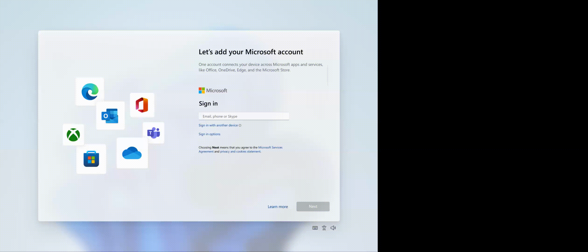
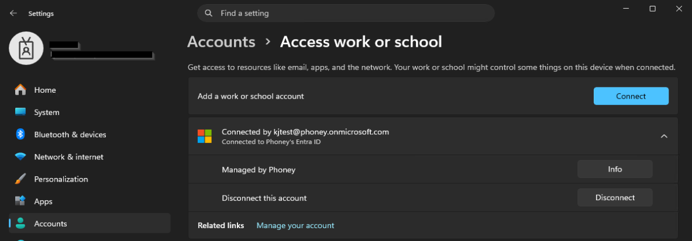

# Utføre Entra join

## Mål
Forstå hvordan Entra join fungerer som fundament for moderne administrasjon.

## Refleksjon

_Entra join_ er grunnlaget for hele Intune‑livssyklusen. Når enheten blir Entra‑tilknyttet (cloud identity), etableres MDM‑kanalen, og klienten kan motta policyer, apper og sikkerhetskonfigurasjoner. Oppgaven viser hvordan en ren Entra‑tilknytning fungerer uten behov for lokal infrastruktur. Dette gav meg en forståelse av hvorfor Entra join er et kritisk første steg i alle Autopilot‑ og Intune‑utrullinger.

Når enheten har blitt _Entra joined_ får den:
- _[Device ID](../../../Glossary/Entra-Device-ID.md)_ i Entra ID 
- _[Primary Refresh Token](../../../Glossary/Primary-Refresh-Token.md) (PRT)_ 
- [Cloud Authentication Provider (CloudAP)](../../../Glossary/Cloud-Authentication-Provider.md) (autentiseringsprovider)
- Entra ID som _identitetsfundament_
- [Intune](../../../Glossary/Microsoft-Intune.md) for administrasjon (hvis _automatic enrollement_ er aktivert)

_Entra join_ er fundamentet for:
- [Entra Single Sign‑On](../../../Glossary/Entra-ID-Single-Sign‑On.md) via _PRT_
- grunnlaget for [Conditional Access](../../../Glossary/Conditional-Access.md)
- grunnlaget for _Intune_-styring
- fungerer over internett
- nødvendig for [Zero Trust](../../../Glossary/Zero-Trust.md)
- tar bort behovet for lokal infrastruktur

## Verifiseringer

### Entra admin center

- Under _Devices_
- Se etter:
	- Device Name
	- Join type: _Azure AD joined_
	- MDM status (hvis Intune er aktivert)

### Enheten

- `dsregcmd /status`
	- AzureAdJoined = Yes
	- TenantID
	- PRT status
- Settings > Accounts > Access work or school

## Vanlige feil og hvordan de løses

_Feil_: Enheten er kun _Azure AD registered_ 
_Løsning_: Utfør full Entra joinn via OOBE eller `Accounts > Access work or school`

_Feil_: Enheten dukker ikke opp i Intune 
_Løsning_: Automatic MDM enrollement må være aktivert

_Feil_: PRT mangler 
_Løsning_: Sjekk at brukeren har gyldig lisens og at enheten er Entra joined

## Steg for steg

Du kan utføre en _Entra join_ på to måter:
- Under oppsettet av enheten i _OOBE_
- Fra en innlogget (lokal) konto

### OOBE

- Start OOBE og velg **Set up for work or school**.
- Logg inn med en Entra‑konto som har Intune‑lisens.
- Fullfør oppsettet; enheten blir Entra joined og registrert i Intune.
- Bekreft join‑status med `dsregcmd /status` og i Entra/Intune‑portalen.
### Accounts

- Settings > Accounts > Access work or school > Connect
- Logg inn med Entra-kontoen for å fullføre join

