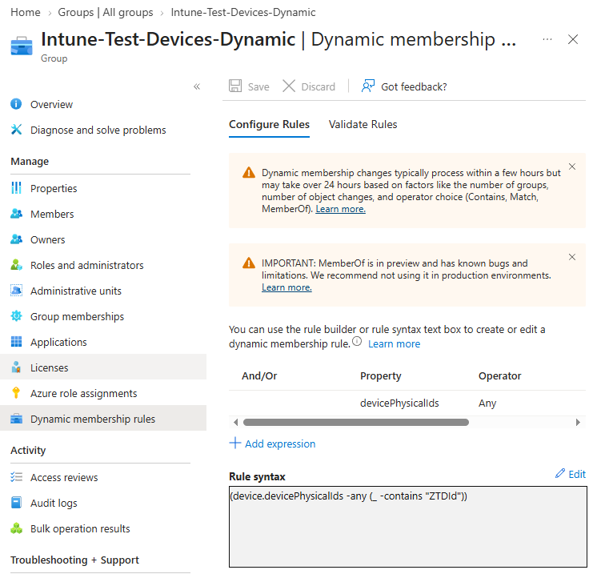
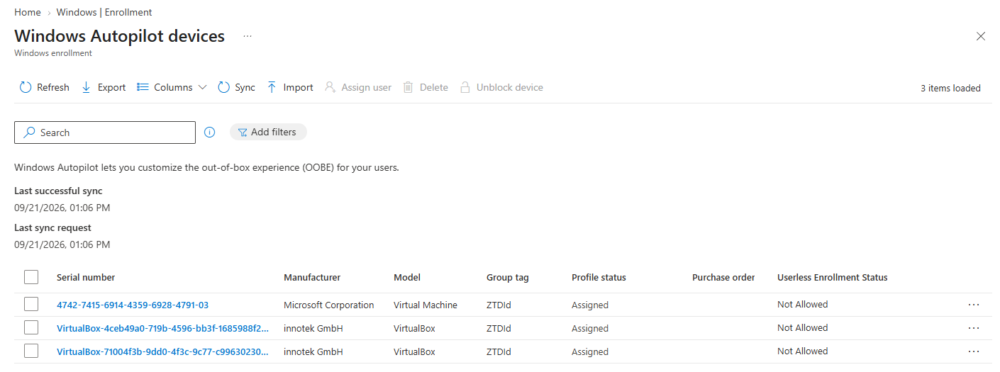
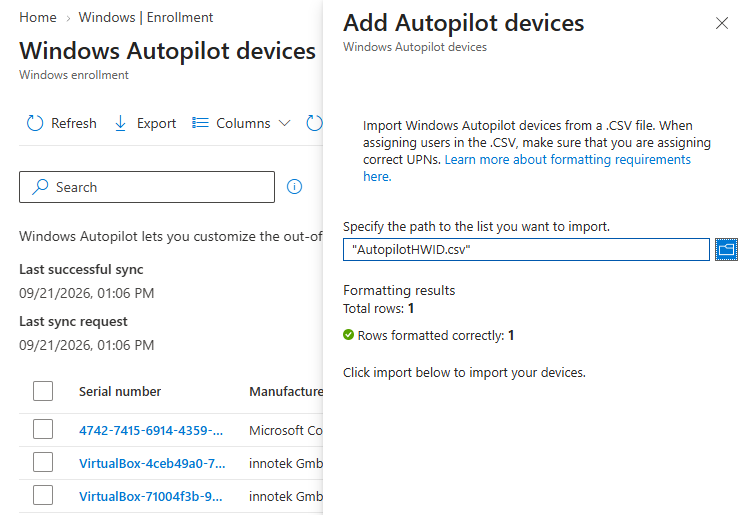

# Importer en enhet til Autopilot

## Mål
Forstå hvordan enheter registreres i Autopilot før utrulling.

## Refleksjon

Denne oppgaven viser hvordan en enhet blir kjent for Autopilot før utrulling. Prosessen med å hente hardware hash, importere den til Intune og knytte enheten til riktig dynamisk gruppe (ZTDId) er avgjørende for at Autopilot‑profilen, ESP og Device Preparation skal tildeles automatisk. Det er viktig å forstå forskjellen mellom dynamiske grupper som brukes til Assignments, og statiske grupper som Device Preparation krever. Når registreringen er riktig satt opp, blir resten av Autopilot‑løpet stabilt og forutsigbart.

### Gruppetyper i Autopilot

Det er viktig å forstå hvilke grupper som brukes i Autopilot‑løpet, og hvorfor.

#### Dynamisk gruppe (ZTDId)

_Formål:_ Automatisk tildeling av Autopilot‑profil, ESP og Device Preparation Assignments.
_Kjennetegn:_
- basert på Group Tag (ZTDId)
- oppdateres automatisk når nye enheter importeres
- brukes i _Assignments_
- krever ingen manuell vedlikehold

*Eksempelregel:* `(device.devicePhysicalIds -any _ -eq "[ZTDId]")`

Dette er gruppen som driver hele Autopilot‑utrullingen.

#### Statisk gruppe (Device Preparation group)

_Formål:_ Brukes av Device Preparation‑motoren som “anchor”.
_Kjennetegn:_
- må være _statisk_
- må ha _Intune Provisioning Client_ som owner
- må inneholde _minst én enhet_
- brukes i _Device group_‑steget i Device Preparation

Denne gruppen kan _ikke_ være dynamisk. Dette er grunnen til feilen du så tidligere:

> “You cannot update this configuration because the group you selected is not a static security group.”

#### Group Tag (grupperegler) i Autopilot

Når en enhet importeres til Autopilot, kan den automatisk havne i en dynamisk gruppe basert på en **regel**. Regelen evaluerer metadata på enheten, ikke roller, ikke rettigheter, ikke RBAC.

En **regel** er et logisk uttrykk som Intune bruker for å avgjøre om en enhet skal være medlem av en gruppe.

```
(device.devicePhysicalIds -any _ -eq "[ZTDId]")
```



Dette betyr:
- Hvis enheten har en **devicePhysicalId** som inneholder **[ZTDId]**
- blir den automatisk medlem av gruppen
- får Autopilot‑profilen
- får ESP
- blir “eligible” for Device Preparation

Group Tag (ofte “ZTDId”) er **bare en metadata‑verdi** som du setter på enheten når du importerer den.

Den brukes **kun** av dynamiske regler for å plassere enheten i riktig gruppe.

Group Tag har **ingenting** med:
- Azure Role assignments
- RBAC
- admin‑rettigheter
- tilgangsstyring

Det er ikke en rolle. Det er ikke en tilordning. Det er ikke en sikkerhetsmekanisme.
Det er kun en **sorteringsnøkkel** for Autopilot.

Autopilot‑flyten er avhengig av at enheten havner i riktig gruppe:
- Dynamisk gruppe styrt av regel basert på Group Tag
- Statisk gruppe Device Preparation anchor må inneholde minst én enhet

Hvis Group Tag mangler, vil:
- enheten ikke havne i ZTDId‑gruppen
- Autopilot‑profilen ikke tildeles
- ESP ikke tildeles
- Device Preparation ikke bli “eligible”

## Verifiseringer

- Enheten vises under _Windows Autopilot devices_
  
- Group Tag (ZTDId) er korrekt
- Enheten ligger i den dynamiske ZTDId‑gruppen
- Deployment Profile viser _Assigned_
- ESP viser _Assigned_
- Device Preparation viser _Eligible_

## Vanlige feil og hvordan de løses

_Feil:_ Enheten dukker ikke opp i Autopilot<br>
_Årsak:_ CSV‑filen er feil format eller importen ikke ferdig <br>
_Løsning:_ Vent 5–15 min, sjekk _Windows Autopilot devices_ 


_Feil:_ Enheten havner ikke i ZTDId‑gruppen<br>
_Årsak:_ Group Tag mangler <br>
_Løsning:_ Legg inn Group Tag manuelt og synkroniser

_Feil:_ Device Preparation feiler<br>
_Årsak:_ Dynamisk gruppe brukt som Device group <br>
_Løsning:_ Opprett statisk gruppe og legg inn minst én enhet

## Steg for steg

### Generer hardware hash

En enhet må registreres i Autopilot før den kan få en Autopilot‑profil. Dette gjøres ved å hente ut hardware hash, enten:

- via OEM (ferdig levert)
- via Intune > _Convert to Autopilot_
- via PowerShell:

#### PowerShell

```PowerShell
Set-ExecutionPolicy -Scope Process -ExecutionPolicy RemoteSigned -Force
Install-PackageProvider -Name NuGet -Confirm:$false -Force
Install-Script -Name Get-WindowsAutoPilotInfo -Force
New-item -ItemType Directory -Name HWID -Path C:\
Get-WindowsAutoPilotInfo -OutputFile C:\HWID\AutopilotHWID.csv
```

### Importer hardware hash til Intune

Gå til:

`Devices > Windows > Windows enrollment > Devices > Import`

Last opp CSV‑filen. Når importen er ferdig, vil enheten dukke opp under _Windows Autopilot devices_.

### Tildel Group Tag (ZTDId)

Group Tag brukes til å plassere enheten i riktig **dynamisk gruppe**. Dette er avgjørende for at enheten automatisk skal få:
- Deployment Profile
- ESP
- Device Preparation Assignments


ZTDId settes enten:
- i CSV‑filen
- eller manuelt etter import

### Synkroniser enheten

Når hardware hash er importert og Group Tag er satt:
- enheten havner i ZTDId‑gruppen
- Autopilot‑profilen tildeles
- ESP knyttes til enheten
- Device Preparation blir “eligible”

Enheten er nå klar for Autopilot‑utrulling.