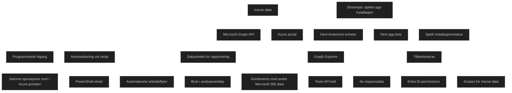

## [Introduction](https://learn.microsoft.com/en-us/training/modules/inventory-complinace-reports/1-introduction)

Modulen introduserer hvordan [Microsoft Intune](../../Glossary/Microsoft-Intune.md) og [Configuration Manager](../../Glossary/Microsoft-Configuration-Manager.md) kan brukes til å _generere og vise rapporter_ om enheter i organisasjonen. Intune tilbyr flere innebygde rapporttyper, og du kan også lage _egendefinerte rapporter_ ved hjelp av [Intune Data Warehouse](../../Glossary/Microsoft-Intune-Data-Warehouse.md) og verktøy som [Power BI](../../Glossary/Power-BI.md).

- Generere _inventarrapporter_ og _compliance‑rapporter_ i Intune
- Overvåke og følge opp _enhetscompliance_
- Lage _tilpassede rapporter_ via Intune Data Warehouse
- Bruke _Microsoft Graph API_ for å bygge egne rapporteringsløsninger

## [Report enrolled devices inventory in Intune](https://learn.microsoft.com/en-us/training/modules/inventory-complinace-reports/2-report-enrolled-devices-inventory-intune)

Du kan hente ut _inventarrapporter_ og _applikasjonsrapporter_ for enheter som er registrert i Microsoft Intune, selv om det ikke finnes en dedikert “Inventory”-rapport i Reports‑fanen.

### Device reporting

Du kan generere en rapport over alle enheter ved å:

- Gå til _Devices > All devices_
- Velge _Columns_ for å bestemme hvilke felter som skal være med
- Bruke _Filter_ for å avgrense etter OS, eierskap osv.
- Velge _Export_ for å laste ned en ZIP‑pakket CSV‑fil med maskinvare‑ og enhetsdata

Det samme kan gjøres per plattform hvis du ikke vil eksportere alle enheter.

### Application reporting

Prosessen er tilsvarende:

- Gå til _Apps > All apps_
- Velg kolonner og filtre
- Eksporter rapporten som ZIP‑pakket CSV

### Audit logs

Du kan også laste ned _Audit logs_, som viser alle endringer og administrative handlinger i Intune. Audit‑logging er alltid aktiv og kan ikke deaktiveres.

Audit logs lastes ned på samme måte som enhets‑ og app‑rapporter, via _Tenant administration > Audit logs_.

## [Monitor and report device compliance](https://learn.microsoft.com/en-us/training/modules/inventory-complinace-reports/3-monitor-report-device-compliance)

Denne siden forklarer hvordan Intune gir administratorer mulighet til å _overvåke og rapportere enhetscompliance_ ved hjelp av innebygde rapporter. Rapportene er laget for å gi et bredt, sammenstilt bilde av compliance‑status i organisasjonen, slik at du raskt kan identifisere avvik og ta nødvendige tiltak.

## Device Compliance Summary report

En oversiktlig rapport som viser et sammendrag av compliance‑status for alle enheter. Du finner den ved å gå til: _Reports > Device Compliance_.


## Device Compliance report

En mer detaljert rapport som viser alle compliance‑tilstander for enheter, uansett datamengde. Du kan:

- filtrere på _compliance status_, _OS_ og _eierskap_
- generere rapporten på nytt for oppdatert data
- vise og sortere individuelle poster som utgjør totalbildet


### Device compliance trends

En trendrapport som viser utviklingen i compliance over tid. Den brukes til å:

- identifisere mønstre
- oppdage avvik
- støtte beslutninger og forbedringsarbeid

Tilgjengelig via: _Reports > Device compliance > Reports‑fanen > Device compliance trends_.


## [Build custom Intune inventory reports](https://learn.microsoft.com/en-us/training/modules/inventory-complinace-reports/4-build-custom-intune-inventory-reports)

Du kan bruke _Intune Data Warehouse_ til å bygge egne, profesjonelle rapporter som gir dypere innsikt enn de innebygde rapportene i Intune‑portalen.

### Hva Intune Data Warehouse gir deg

- _Historiske data_ om Intune‑miljøet
- _Daglig oppdaterte datasett_
- Et _OData‑basert datamodell_ som kan brukes av analyseverktøy
- Mer detaljert informasjon enn det som er tilgjengelig i Intune‑portalen

### Eksempler på rapporter du kan lage

- Trender i enhetsregistrering
- App‑ og OS‑versjonsoversikter
- Compliance‑ og policyutrulling over tid

### Krav for tilgang

- Du må være:
    - Global Administrator
    - Intune Service Administrator
    - Eller ha RBAC‑tilgang til Data Warehouse
- Alternativt kan du bruke _app‑basert autentisering_
- Du må installere _Power BI Desktop_

### To måter å hente data på

#### 1. Load the data in Power BI using the OData link

- Hent OData‑URL fra _Reports > Data warehouse_ `https://fef.{yourinfo}.manage.microsoft.com/ReportingService/DataWarehouseFEService/dates?api-version=beta`
- Koble til via Power BI
- Velg tabeller og bygg egne dashboards

#### 2. Use the Power BI App

- Ferdiglagde rapporter fokusert på compliance
- Kan tilpasses og deles
- Krever Power BI‑lisens eller prøveperiode



## [Access Intune using Microsoft Graph API](https://learn.microsoft.com/en-us/training/modules/inventory-complinace-reports/5-access-intune-using-microsoft-graph-api)

_Microsoft Graph API_ gir programmatisk tilgang til Intune‑data og lar deg utføre de samme operasjonene som i Azure‑portalen, men via skript, automatisering og API‑kall. Graph kan brukes til å hente ut data, kombinere Intune‑informasjon med andre Microsoft 365‑tjenester og bygge egne applikasjoner eller rapporteringsløsninger.

Graph API gir tilgang til _alle_ Intune‑data, men er mer komplekst å jobbe med enn Power BI og Intune Data Warehouse.

## Hva Graph API brukes til

- Automatisere Intune‑administrasjon
- Hente og manipulere Intune‑data for rapportering
- Kombinere data fra flere Microsoft 365‑tjenester
- Bygge egne verktøy og integrasjoner

### Eksempel: Sjekke om en app er installert på en brukers enhet

Siden viser et konkret eksempel med tre API‑kall:

1. _Hent brukerens enheter_
    ```sh
    https://graph.microsoft.com/beta/users/{user}/ownedDevices
    ```
    
2. _Hent alle apper i tenant_
    ```sh
    https://graph.microsoft.com/beta/deviceAppManagement/mobileApps
    ```
    
3. _Sjekk installasjonsstatus for en bestemt app_
    ```sh
    https://graph.microsoft.com/beta/deviceAppManagement/mobileApps/{id}/deviceStatuses/
    ```

### Microsoft Graph Explorer

[Graph Explorer](../../Glossary/Microsoft-Graph-Explorer.md) er et nettbasert verktøy som lar deg teste API‑kall og se responsdata direkte. Nyttig for å lære hvordan Intune‑endepunktene fungerer.

### Tillatelser

Før du bruker [Graph Explorer](https://developer.microsoft.com/graph/graph-explorer) eller skript, må riktige _Microsoft Entra ID‑tillatelser_ (scopes) tildeles. Global Administrator kan gi disse direkte i Graph Explorer.

### Ekstra ressurs

Siden lenker også til et sett med [Microsoft Graph PowerShell Intune Samples](https://github.com/microsoftgraph/powershell-intune-samples)  for Intune‑administrasjon via Graph.

## [Module assessment](https://learn.microsoft.com/en-us/training/modules/inventory-complinace-reports/6-knowledge-check)

1. _Which of the following features enables programmatic access to Intune information for your tenant, can be used for building automation scripts, and can be used to extract data from Intune and further manipulate that data into your favorite analysis or reporting tool?_

	Microsoft Graph API for Intune

2. _As the Desktop Administrator for Fabrikam, Holly Spencer wants to build professional looking reports that provide insight into the company's enterprise mobile environment. Holly wants to access historical Intune data, data that's refreshed on a daily cadence, and a data model that uses the OData standard. What tool should Holly use that provides this advanced level of information?_

	Intune Data Warehouse

## [Summary](https://learn.microsoft.com/en-us/training/modules/inventory-complinace-reports/7-summary)

### 1. Intune‑portalen gir deg grunnleggende, men nyttige rapporter

Du kan hente ut _enhets‑ og applikasjonsdata_ basert på egne kriterier. Dette er kjernen i daglig drift: rask oversikt, filtrering og eksport. 

### 2. For mer avansert innsikt må du bruke eksterne verktøy

Siden understreker at _Power BI + Intune Data Warehouse_ gir mulighet til å bygge mer omfattende rapporter basert på historiske data. Intune alene er ikke nok for dyp analyse. Du må forstå _hvorfor_ Data Warehouse eksisterer.

### 3. Graph API åpner for automatisering og integrasjon

Graph API gir en _programmatisk vei_ inn i Intune‑data, slik at organisasjoner kan bruke egne rapporteringsverktøy eller automatisere prosesser. Dette viser hvor fleksibel Intune‑plattformen er.