## [Introduction](https://learn.microsoft.com/en-us/training/modules/implement-device-compliance/1-introduction)

Modulen gir en introdukusjon til _[device compliance](../../Glossary/Compliance‑Policy.md) i Intune_, altså hvordan du definerer, håndhever og følger krav som enheter må oppfylle for å få tilgang til organisasjonens ressurser. 

## [Protect access to resources using Intune](https://learn.microsoft.com/en-us/training/modules/implement-device-compliance/2-protect-access-to-resources-using-intune)

Et av de mest sentrale poengene i moderne endepunktadministrasjon er at _tilgangen til organisasjonens ressurser ikke er tilfeldig, den skal være fortjent_. Intune, gjennom MDM-styring og compliance fungerer som er et filter som sikrer at kun enheter som faktisk følger virksomhetens krav får tilgang.

Dette betyr at Intune håndhever alt fra passordkrav og kryptering til MFA og oppdateringsnivå. En enhet som ikke oppfyller kravene, får ikke tilgang til epost, dokumenter etc. før dette er i orden.

Samspillet mellom [_Intune_](../../Glossary/Microsoft-Intune.md) og  beskytter ressurser. Compliance-status kan brukes som ett av flere kriterier i en [Conditional Access](../../Glossary/Conditional-Access.md)-policy, sammen med faktorer som sign-in risiko, enhetstype og plassering. Hvis en enhet ikke er registrert i Intune, kan ikke compliance vurderes. I slike tilfeller kan du velge om brukeren skal blokkeres, omdirigeres  til å registrere enheten, eller få tilgang med et registrert policy-avvik.
Med andre ord kan Intune ikke bare vurdere enheter, men også styre brukeropplevelsen når kravene ikke oppfylles.

Intune administrerer ikke bare enheter, den beskytter aktivt tilgang til organisasjonens ressurser ved å kombinere MDM-styring, compliance og Conditional Access til en sammenhengende sikkerhetsmodell.

## [Explore device compliance policy](https://learn.microsoft.com/en-us/training/modules/implement-device-compliance/3-explore-policy)

Compliance-policyer definerer hvilke krav en enhet må oppfylle for å anses som trygg og i tråd med organisasjonens standarder. Når en enhet registrers i Intune, vurderes den automatisk mot policyene som er tildelt brukeren, og statusen rapporteres videre til Intune og Microsoft Entra ID. Dette gjør det mulig å følge enhetens tilstand over tid og bruke informasjonen i både sikkerhetsarbeid og rapportering.

Kravene som kan stilles spenner fra passord og kryptering til OS-versjoner, jailbreak/root-deteksjon og integrasjon med [Mobile Threat Defence (MTD)](../../Glossary/Mobile-Threat-Defense.md) . Policyene er fleksible, en enhet kan markeres som ikke-kompatibel umiddelbart, eller få en definert grace-periode der brukeren kan rette opp avvik. Varsling via epost kan tilpasses med eget innhold og sendes automatisk når enheten faller utenfor kravene.

Compliance kan brukes sammen med Condtional Access for å styre tilgang til organisasjonsdata, men også fungere helt uavhengig dersom målet kun er å overvåke og rapportere status. Policyene tildeles brukere og Entra-grupper, gjerne dynamisk da for å sikre at riktige enheter og brukere alltid får riktige krav. Dynamiske grupper gjør det mulig å styre medlemskap basert på produsent, OS eller avdeling, noe som gir forutsigbar og automatisk policyflyt.

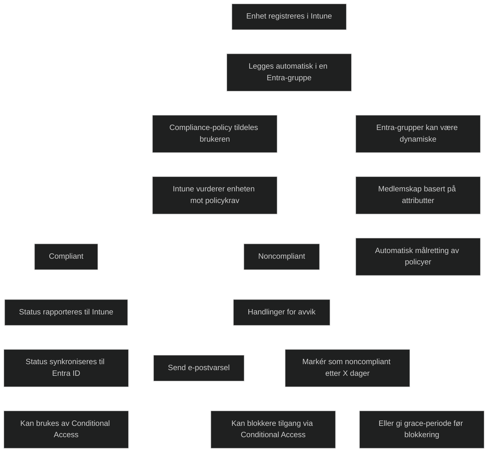

## [Deploy a device compliance policy](https://learn.microsoft.com/en-us/training/modules/implement-device-compliance/4-deploy-policy)

Implementering av en compliance-policy handler om å sikre at organisasjonen har tydelige, tekniske  krav som alle administrerte enheter må oppfylle. Før policyer kan tas i bruk, må virksomheten ha riktige lisenser ([Entra ID P1/P2](../../Glossary/Microsoft-Entra-ID.md#lisenser-p1-og-p2) og Intune) og enheter som kjører støttede plattformer. Bare enheter som er registrert i Intune kan vurderes for compliance, noe som gjør registreringen til et grunnleggende premiss i hele prosessen.

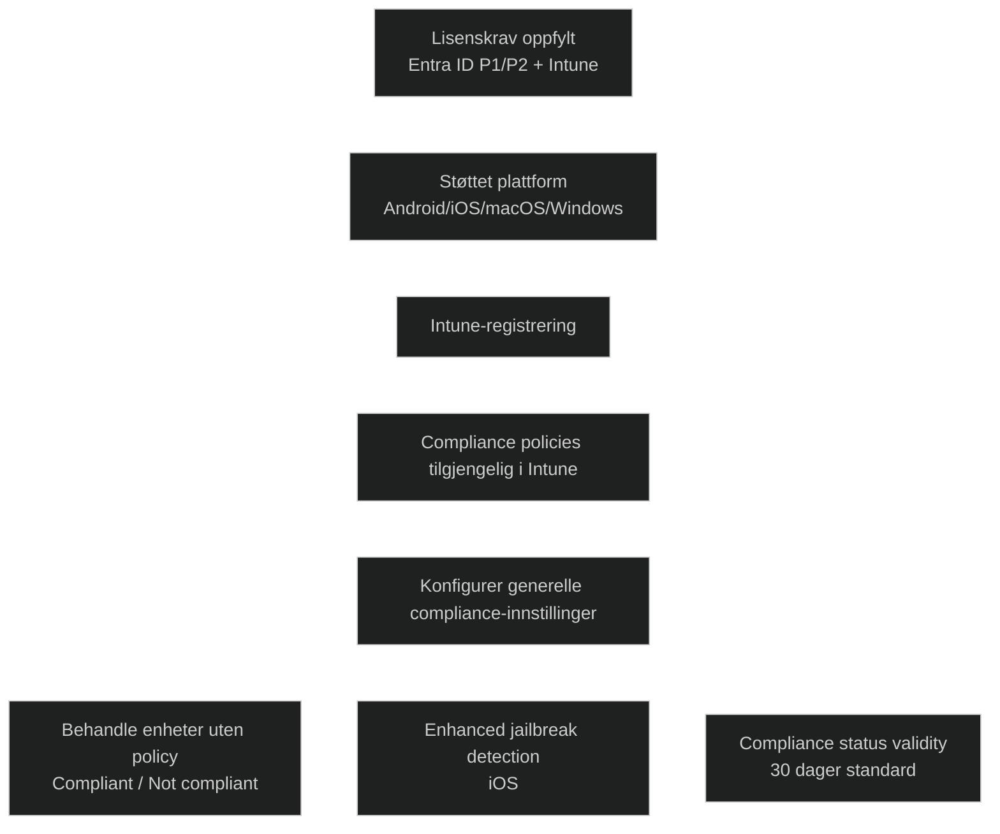

Policyer kan tildeles både bruker- og enhetesgrupper, men bruk av enhetsgrupper gir mer presise rapporter når enheten ikke er registrert av den primære brukeren. I Intune finnes et sett med generelle compliance-innstillinger som påvirker hvordan enheter uten tildelt policy skal behandles, hvor lenge compliance-status er gyldig, og om forbedret jailbreak-deteksjon skal aktiveres for iOS.

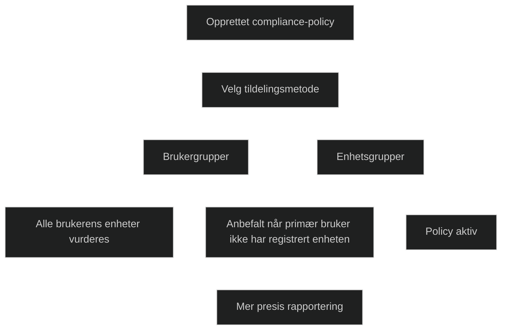

Selve policykonfigurasjonen består av å velge plattform, definere krav som OS-versjon, passordregler, kryptering, antivirus og jailbreak/root-deteksjon, og deretter bestemme hvilke tiltak som skal iverksettes ved avvik. Tiltak kan være alt fra epostvarsler til låsing eller pensjonering av enheten, og kan tidsstyres for å gi brukeren en grace-periode før strengere handlinger trer i kraft.

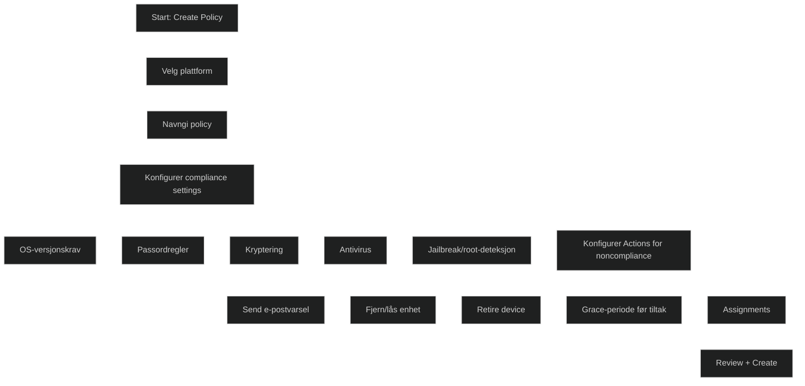

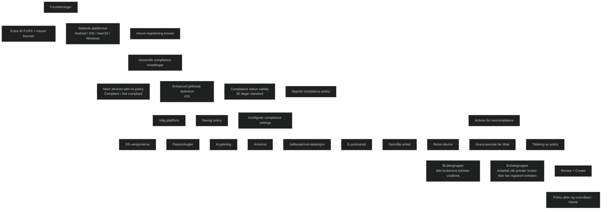

## [Explore conditional access](https://learn.microsoft.com/en-us/training/modules/implement-device-compliance/5-explore-conditional-access)

Conditional Access fungerer som et intelligent kontrollpunkt som vurderer tilgangsforsøk basert på både hvem brukeren er og hvordan tilgangen skjer. Prinsippet bygger på _When this happens -> Then do this_, der et sett med betingelser utløser en definert respons. To forhold er alltid obligatoriske:
- Hvilke brukere som forsøkerå få tilgang
- Hvilke apper som er målet.

I tillegg kan andre faktorer inkluderes, som enhetstype, nettverksplassering eller risiko.

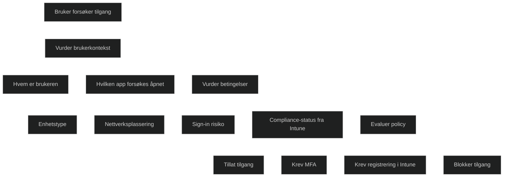

Tilgangskontrollen skjer i samspill mellom Intune og Entra ID. Intune leverer informasjon om compliance-status, mens Entra ID evaluerer denne informasjonen opp mot gjeldende Conditional Access-policyer. Dersom kravene ikke er oppfylt, kan tilgangen blokkeres eller det kan kreves ytterlige sikkerhetstiltak, som MFA. Brukren kan også bli bedt om å registrere enheten eller rette opp evt. avvik før tilgang gis.

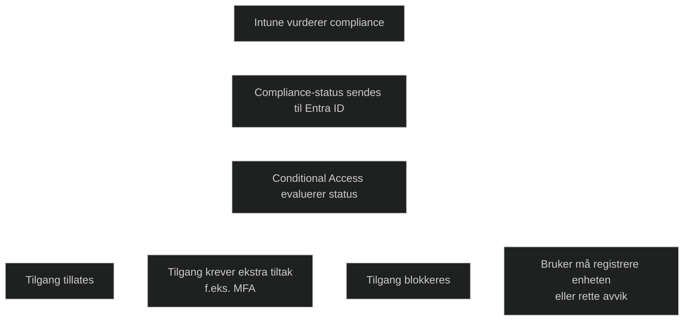

Conditional Access gir særlig verdi i situasjoner der risikoen varierer. Det kan innebære å kreve MFA for apper med høyere beskyttelsesbehov, skjerpe krav når brukeren befinner seg på et utrygt nettverk, eller begrense Microsoft 365 tilgang til enheter som er administrert og oppfyller organisasjonens krav. Resultatet er en fleksibel og risikobasert tilgangsmodell som støtter [_Zero Trust_-prinsippene](../../Glossary/Zero-Trust.md) og sikrer at bare autoriserte brukere under riktige betingelser får tilgang til virksomhetsdata. 

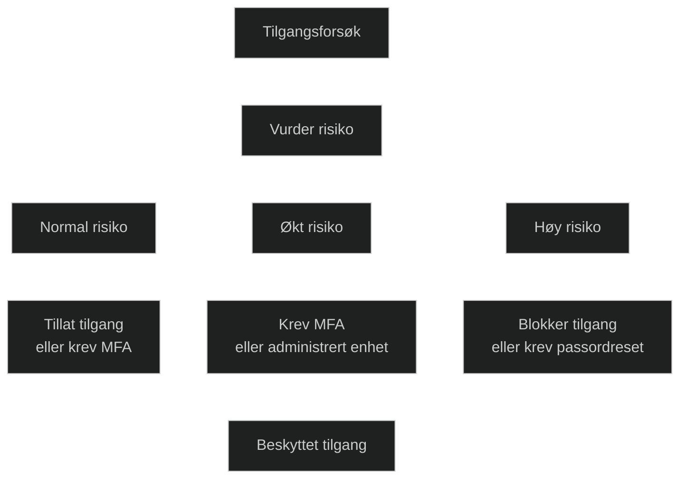
Conditional Access tilpasser krav etter risiko

## [Create conditional access policies](https://learn.microsoft.com/en-us/training/modules/implement-device-compliance/6-create-conditional-access-policies)

Conditional Access bygger på et sett med betingelser og kontroller som avgjør hvordan tilgang til organisasjonsdata skal håndteres. Betingelsene definerer _når_ en policy skal tre i kraft, basert på faktorer som plattform, plassering eller hvilke klientapplikasjoner som brukes. Kontrollene definerer _hva_ skal skje når betingelsene er oppfylt, f.eks å blokkere tilgang eller kreve ekstra sikkerhetstiltak før brukeren får fortsette.

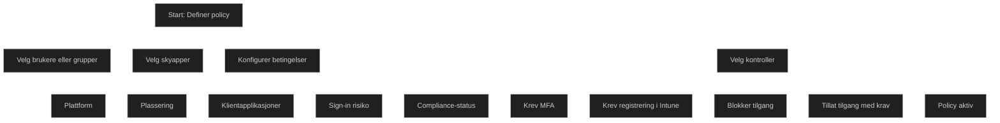

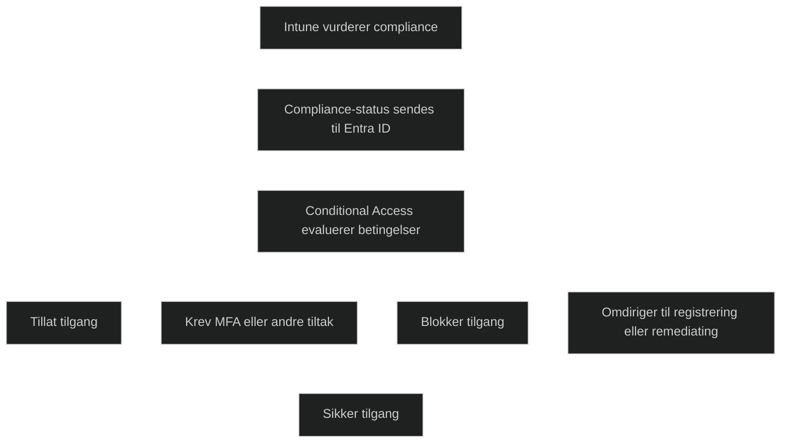

Policyer konfigureres i Intune-adminsenteret og tildeles brukere eller gruppre, sammen med valgte skyapper som skal omfattes. Dette gjør det mulig å styre tilgang på en målrettet og risikobasert måte. Conditional Access kan også brukes mot [_Exchange ActiveSync (AES)_](../../Glossary/Exchange-ActiveSync.md) , slik at tilgang til epost styres etter samme prinsipper. Når dette kombineres med compliance-krav, sikres det at bare administrerte og godkjente enheter får tilgang til Exchange-data, både lokalt og i skyen.

Integrasjonen mellom Intune, Exchange og Entra ID gjør det mulig å blokkere ukjente eller ikke-administrerte enheter, kreve registrering, eller veilede brukeren gjennom nødvendige steg for å oppfylle kravene. Intune Exchange-connectoren synkroniserer ActiveSync-poster og kobler dem til Intune-administrerte enheter, slik at tilgang kan styres konsekvent og automatisk.

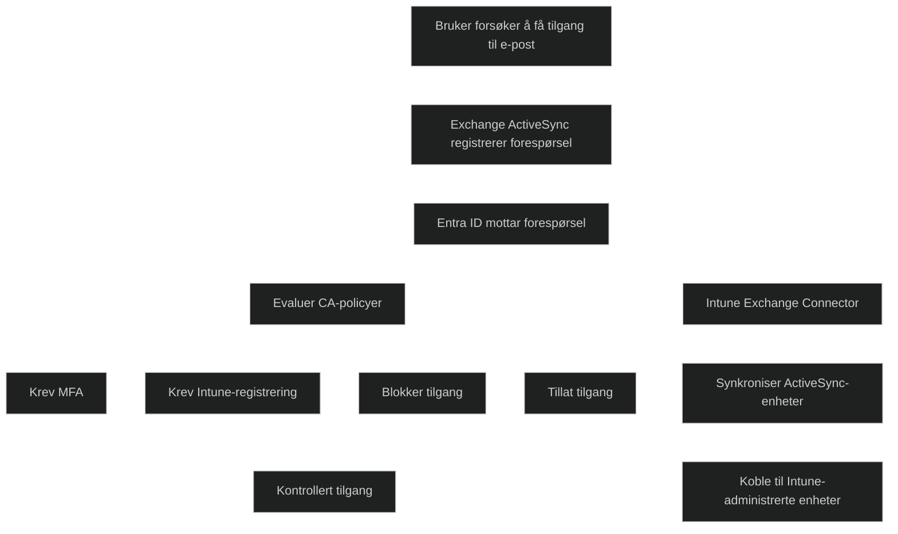

## [Module assessment](https://learn.microsoft.com/en-us/training/modules/implement-device-compliance/7-knowledge-check)

1. _Which of the following items is a synchronization protocol that allows mobile phone users to access their email, calendar, contacts, and tasks, and continue to access this information when they're working offline?_

	Exchange ActiveSync

2. _As the Desktop Administrator for World Wide Importers, Alan Deyoung wants to create Conditional Access policies to provide granular access control over organizational data while allowing users to work from essentially any device and location. In which of the following scenarios will Conditional Access be especially beneficial for World Wide Importers?_

	Enabling employees to use a corporate application on their personal device

## [Summary](https://learn.microsoft.com/en-us/training/modules/implement-device-compliance/8-summary)

Device compliance policies gir en strukturert måte å sikre at krav til sikkerhet og drift etterleves uten å skape unødvendig friksjon for brukerne. Krav som minimum OS‑versjon, passordregler eller kryptering kan defineres på forhånd, og brukeren får selv velge når det passer å gjennomføre nødvendige endringer. Samtidig kan Conditional Access begrense tilgangen til organisasjonsressurser så lenge kravene ikke er oppfylt. Når brukeren har gjort det som kreves, fjernes restriksjonene umiddelbart, noe som skaper en forutsigbar og brukervennlig sikkerhetsmodell.

- Compliance fungerer som _grunnmuren_ i hele sikkerhetsmodellen for moderne administrasjon
- Det er her Intune og Entra ID (Conditional Access) _kobles sammen i praksis_
- Det er avgjørende å forstå _hvordan enheter vurderes_, og hva som skjer når krav ikke oppfylles
