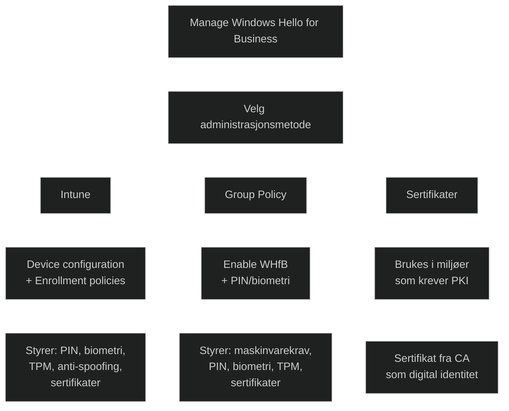
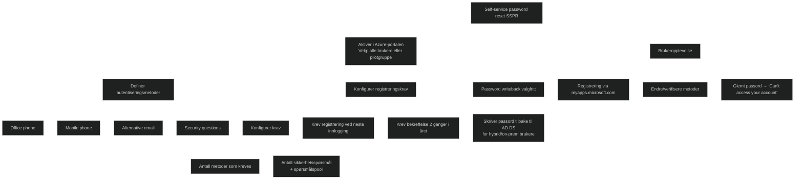

# Protect identities in Microsoft Entra ID
## [Introduction](https://learn.microsoft.com/en-us/training/modules/protect-identities-azure-acative-directory/1-introduction)

Moderne identitetsbeskyttelse krever flere autentiseringsmetoder, alternative innloggingsløsninger og teknologi som kontinuerlig overvåker identiteter og oppdager unormal atferd. Målet er å stoppe angrep før de får fotfeste, ikke rydde opp etterpå.

## [Explore Windows Hello for Business](https://learn.microsoft.com/en-us/training/modules/protect-identities-azure-acative-directory/2-explore-windows-hello-for-business)

På Windows 11‑enheter erstatter Windows Hello for Business passord med sterk tofaktorautentisering. Brukeren får et legitimasjonsbevis som er knyttet til enheten og autentiserer seg med biometrisk innlogging eller en PIN. Dette løser vanlige passordproblemer som gjenbruk, phishing, [replay‑angrep](../../Glossary/Replay-attack.md) og risiko ved kompromitterte servere.

[Windows Hello](../../Glossary/Windows-Hello.md) kan brukes mot [Microsoft‑kontoer](../../Glossary/Microsoft-Account.md), Active Directory, [Entra‑ID](../../Glossary/Microsoft-Entra-ID.md) og tjenester som støtter [FIDO2](../../Glossary/FIDO2.md). Etter en første tofaktorverifisering setter brukeren opp en PIN eller biometrisk gest, som deretter brukes for videre innlogging. Administratorer kan styre bruken av Windows Hello for Business gjennom Intune‑policyer på Windows‑enheter.

### Biometric sign-in

Windows Hello tilbyr integrert biometrisk autentisering med ansiktsgjenkjenning eller fingeravtrykk. IR‑kameraer og kapasitetsbaserte sensorer beskytter mot spoofing og gir pålitelig identifikasjon. Maskinvarestøtten er bred, og sensorer kan være innebygd eller legges til eksternt.

Biometriske data lagres kun lokalt på enheten og sendes aldri til servere. Dette eliminerer risikoen for sentrale datalekkasjer og passer inn i en moderne, identitetsbasert sikkerhetsmodell.

## [Deploy Windows Hello](https://learn.microsoft.com/en-us/training/modules/protect-identities-azure-acative-directory/3-deploy-windows-hello)

Windows Hello for Business kan implementeres på ulike måter, og de fleste organisasjoner har allerede mye av det nødvendige grunnlaget. Selv om det kan virke komplisert, handler en vellykket innføring først og fremst om god koordinering mellom teamene. Funksjonen støttes kun på Windows 10 og nyere.

### Deployment models

_Cloud only_:For organisasjoner som kun bruker Microsoft Entra‑identiteter og skyressurser. Enheter er Entra‑joined, og Windows Hello for Business konfigureres via Intune, som er den eneste skybaserte løsningen som støtter dette fullt ut.

_On‑premises_: For organisasjoner som kun bruker lokale AD DS‑identiteter og ikke har Entra‑integrasjon. Windows Hello for Business kan brukes uten sky, og konfigureres via Group Policy.

_Hybrid_: For miljøer som bruker både AD DS og Entra ID. Man må velge om policyer skal styres via Group Policy eller Intune, og unngå overlapp. Ved bruk av Intune må enheter være Intune‑enrolled eller Entra‑joined.

## [Manage Windows Hello for Business](https://learn.microsoft.com/en-us/training/modules/protect-identities-azure-acative-directory/4-manage-windows-hello-for-business)

Windows Hello for Business kan administreres enten via _Intune_ eller _Group Policy_, og gir organisasjoner et bredt sett med detaljerte policyer for å styre hvordan brukere og enheter autentiserer seg. Løsningen er tilgjengelig på Windows 10 og nyere, og kan aktiveres som en del av en moderne, passordløs strategi.

### Manage Windows Hello for Business with Intune

I Intune konfigureres Windows Hello for Business gjennom _Device configuration profiles_ eller _Device enrollment policies_. Her kan administratorer:
- aktivere/deaktivere Windows Hello for Business
- definere PIN‑krav (lengde, kompleksitet, historikk, utløp)
- tillate eller blokkere biometrisk autentisering
- kreve TPM og aktivere anti‑spoofing
- aktivere PIN‑gjenoppretting
- konfigurere sertifikatbruk for lokale ressurser

Enrollment‑policyer kan håndheve de samme innstillingene allerede ved enhetsregistrering, slik at enheter blir riktig konfigurert fra første oppstart.

### Manage Windows Hello for Business with Group Policy

For organisasjoner som bruker lokal AD eller hybrid miljøer, kan Windows Hello for Business styres via Group Policy. Dette krever en Windows 10/11‑klient med oppdaterte policy‑maler.

Den viktigste innstillingen er _Use Windows Hello for Business_, som må settes til _Enabled_ for at brukere skal kunne registrere seg. Policyen kan settes på bruker‑ eller maskinnivå, men brukerpolicy vinner ved konflikt.

Group Policy gir også kontroll over:
- maskinvarekrav (TPM, sikkerhetsenheter)
- biometriske valg
- PIN‑kompleksitet
- bruk av sertifikater for lokal autentisering

### Windows Hello for Business certificate

I miljøer som krever [Public Key Infrastructure (PKI)‑basert](../../Glossary/Public-Key-Infrastructure.md) autentisering kan Windows Hello for Business bruke et _sertifikat som digital identitet_. Sertifikatet utstedes av organisasjonens [CA (Certificate-Authority)](../../Glossary/Certificate-Authority.md) og brukes til å validere brukeren ved innlogging.

Fordeler inkluderer:
- sterk kryptografisk sikkerhet
- sømløs integrasjon med eksisterende PKI
- passordløs autentisering med høy sikkerhet

Sertifikater fornyes automatisk før utløp gjennom forbedret auto‑enrollment, så lenge brukeren logger inn med Windows Hello for Business. Dette reduserer risikoen for autentiseringsfeil.

## [Explore Microsoft Entra ID Protection](https://learn.microsoft.com/en-us/training/modules/protect-identities-azure-acative-directory/5-explore-identity-protection)

[Microsoft Entra ID Protection](../../Glossary/Microsoft-Entra-ID-Protection.md) hjelper organisasjoner med å beskytte brukerkontoer ved å overvåke autentiseringer og identifisere mistenkelig aktivitet. Identitetsbeskyttelse er kritisk fordi brukere ofte har mange kontoer og gjenbruker passord, noe som øker risikoen for identitetstyveri. Entra ID Protection er en del av Entra ID P2‑lisensen og gir automatisert risikovurdering basert på faktorer som geografisk plassering, enhet og applikasjon.

Løsningen kan automatisk reagere på risiko ved å kreve sterkere autentisering, tvinge passordendring eller blokkere tilgang. Administratorer kan definere risikopolicyer for nivåene Low+, Medium+ og High. Et dashboard gir oversikt over risikobrukere, hendelser og sårbarheter i sanntid.

## [Manage self-service password reset in Microsoft Entra ID](https://learn.microsoft.com/en-us/training/modules/protect-identities-azure-acative-directory/6-manage-self-service-password-reset)

Når organisasjoner kun bruker lokal AD DS, kan ikke brukere tilbakestille glemte passord selv. Microsoft Entra ID tilbyr _self-service password reset (SSPR)_, og med Entra ID P1/P2 kan denne funksjonen utvides til lokale AD DS‑miljøer via _password writeback_. Dette gjør at passord endret i skyen også skrives tilbake til lokal AD.

Før brukere kan ta i bruk [SSPR (Self-service password reset)](../../Glossary/Microsoft-Entra-self-service-password-reset.md), må funksjonen aktiveres i Azure‑portalen under _Password reset_. Administrator velger om funksjonen skal gjelde for alle brukere eller en pilotgruppe. Brukere må registrere alternative autentiseringsmetoder som mobiltelefon, kontortelefon, alternativ e‑post eller sikkerhetsspørsmål. Administrator definerer hvor mange metoder som kreves, og hvor mange sikkerhetsspørsmål som må besvares.

Det anbefales å kreve at brukere registrerer og jevnlig bekrefter sine alternative metoder, slik at de alltid kan verifisere identiteten sin. Dersom katalogsynkronisering er aktivert, bør password writeback også aktiveres for å sikre at passordendringer i skyen synkroniseres tilbake til AD DS.

Brukere registrerer seg via _myapps.microsoft.com_, hvor de også kan endre passord og administrere verifiseringsmetoder. Hvis en bruker glemmer passordet sitt når de prøver å få tilgang til en skyressurs, kan de starte SSPR‑prosessen via _Can’t access your account_.

## [Implement multi-factor authentication](https://learn.microsoft.com/en-us/training/modules/protect-identities-azure-acative-directory/7-implement-multi-factor-authentication)

Multifaktorautentisering (MFA) legger til et ekstra sikkerhetslag ved å kreve mer enn en autentiseringsmetode. Brukeren logger fortsatt inn med brukernavn og passord, men må i tillegg bekrefte identiteten sin med noe de _vet_ (passord/PIN), noe de _har_ (telefon, token) eller noe de _er_ (biometri). Dette reduserer risikoen for kompromitterte kontoer og styrker beskyttelsen av apper og data.

Det finnes flere måter å implementere MFA på, blant annet Microsoft Authenticator‑appen (push eller engangskoder), telefonanrop, SMS‑koder og tredjeparts OAuth‑tokens. Microsoft Entra MFA er tilgjengelig gjennom Entra ID P1/P2‑lisenser og gir full skybasert funksjonalitet uten behov for lokal infrastruktur. Den eldre Azure MFA Server kan fortsatt brukes i miljøer med AD FS, men Microsoft anbefaler skybasert MFA for nye implementeringer.

MFA kan aktiveres for enkeltbrukere via Azure‑portalen. Administrator velger brukere, aktiverer MFA og informerer dem om at de må registrere metoder ved neste innlogging. Brukere som benytter apper uten moderne autentisering kan trenge app‑passord. Microsoft Entra Connect er kun nødvendig dersom lokale AD‑identiteter synkroniseres til Entra ID.

```mermaid
%%{init: {
  "theme": "dark",
  "themeVariables": {
    "primaryColor": "#1e1e1e",
    "primaryTextColor": "#ffffff",
    "lineColor": "#ffffff",
    "secondaryColor": "#333333"
  }
}}%%
flowchart TD

    A[Implement multi-factor authentication] --> B[Hva er MFA?]
    B --> B1[Krever mer enn én autentiseringsmetode]
    B --> B2[Kombinerer: noe du vet<br>noe du har<br>noe du er]

    A --> C[Autentiseringsmetoder]
    C --> C1[Microsoft Authenticator<br>Push / OTP]
    C --> C2[Telefonanrop]
    C --> C3[SMS-koder]
    C --> C4[Tredjeparts OAuth-tokens]

    A --> D[Lisensalternativer]
    D --> D1[Entra ID P1/P2<br>Full skybasert MFA]
    D --> D2[Entra MFA Service<br>Anbefalt for nye miljøer]
    D --> D3[Azure MFA Server<br>Kun for AD FS / eldre miljøer]
    D --> D4[M365 MFA<br>Begrenset funksjonalitet]
    D --> D5[Global Admin MFA<br>Alltid tilgjengelig]

    A --> E[Implementering]
    E --> E1[Velg bruker i Azure Portal]
    E --> E2[Aktiver MFA for brukeren]
    E --> E3[Bruker registrerer metode ved neste innlogging]
    E --> E4[App-passord for apper uten moderne auth]

    A --> F[Avhengigheter]
    F --> F1[Entra Connect kun nødvendig<br>ved synkronisering fra lokal AD]

```

[Implement multi-factor authentication](https://learn.microsoft.com/en-us/training/modules/protect-identities-azure-acative-directory/7-implement-multi-factor-authentication?utm_source=copilot.com)

## [Module assessment](https://learn.microsoft.com/en-us/training/modules/protect-identities-azure-acative-directory/8-knowledge-check)

1. _What are the three deployment models for Windows Hello for Business?_
	
Cloud Only, On-premises, or Hybrid
	
2. _Contoso's IT department has implemented self-service password reset functionality for its users. What alternative authentication methods are supported on Microsoft Entra ID?_
	
	Office phone, Mobile Phone, Alternative email address, Security questions

## [Summary](https://learn.microsoft.com/en-us/training/modules/protect-identities-azure-acative-directory/9-summary)

Windows Hello, Entra ID Protection, SSPR og MFA er sentrale identitets‑ og sikkerhetsfunksjoner i Microsoft‑miljøet. Modulen oppsummerer hvordan disse teknologiene sammen beskytter brukere og organisasjoner gjennom sterk autentisering, risikobasert overvåkning og selvbetjente verktøy.

### Windows Hello for Business

- distribusjonsmodeller (cloud/on‑prem/hybrid)
- Intune vs. GPO‑styring
- PIN/biometri/TPM‑krav
- sertifikatbasert WHfB

### MFA og SSPR

- hvordan MFA aktiveres og hvilke metoder som finnes
- hvordan SSPR fungerer med writeback
- brukeropplevelsen og registreringsflyten
- lisenskrav og avhengigheter

### Microsoft Entra ID Protection – risikomodellene

- forskjellen mellom _risk detections_, _risky users_ og _risky sign-ins_
- hvordan risiko _reduseres automatisk_ etter tiltak
- hvordan Conditional Access bruker risikonivåer
- hvilke signaler som utløser risiko

###  Samspillet mellom WHfB, MFA og CA

- når WHfB bruker sertifikater vs. FIDO2
- hvordan CA/PKI spiller inn i hybrid‑scenarier
- når MFA fortsatt kreves selv om WHfB er aktivert

