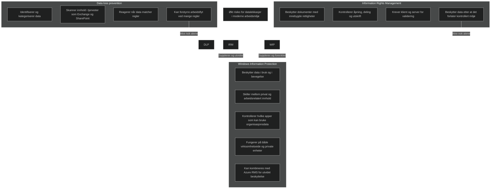
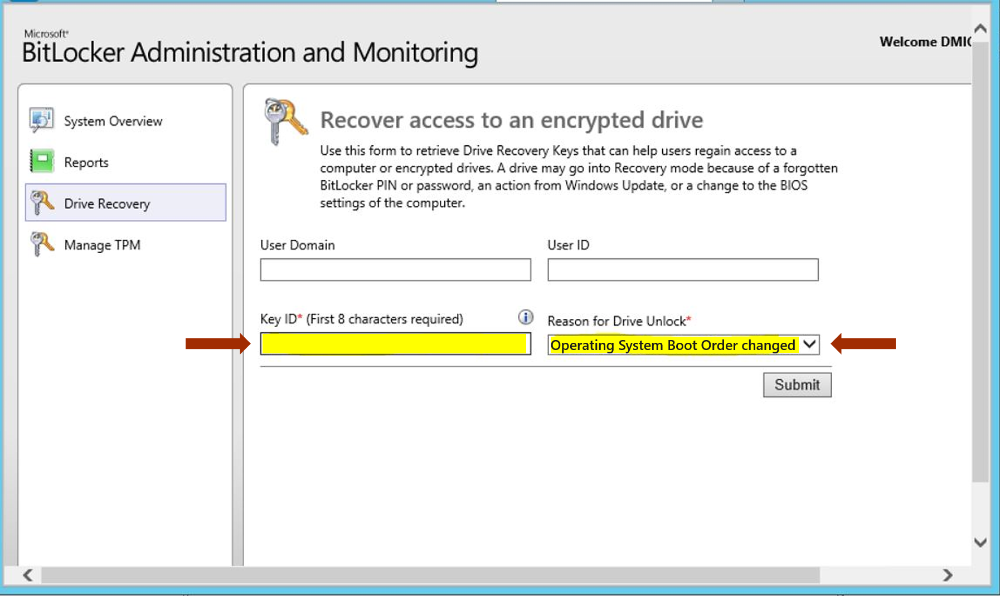

# [Deploy device data protection](https://learn.microsoft.com/en-us/training/modules/deploy-device-data-protection/)

## [Introduction](https://learn.microsoft.com/en-us/training/modules/deploy-device-data-protection/1-introduction/?ns-enrollment-type=learningpath&ns-enrollment-id=learn.wwl.manage-endpoint-security)

[Windows Information Protection (WIP)](../../Glossary/Windows-Information-Protection.md) introduseres som et verktøy for å forhindre utilsiktet eller ondsinnet datalekasjer i moderne organisasjoner. Løsningen beskytter data på enheter, enten bedriftseide eller BYOD, uten å forstyrre brukers arbeidsflyt. 

Modulen legger til grunnlaget for hvordan [Intune](../../Glossary/Microsoft-Intune.md) brukes til å planlegge, konfigurere og administrere WIP-policyer, samt hvordan teknologier som [EFS (Encrypting File System)](../../Glossary/Encrypting-File-System.md) og [BitLocker](../../Glossary/BitLocker.md) inngår i helheten for databeskyttelse. Fokus ligger på å forstå mekanismene som skiller, krypterer og kontrollerer  tilgang til bedriftsdata, og hvordan disse brukes for å oppfylle krav til sikkerhet og compliance i et [Zero Trust](../../Glossary/Zero-Trust.md)-miljø.

## [Explore Windows Information Protection](https://learn.microsoft.com/en-us/training/modules/deploy-device-data-protection/2-explore-windows-information-protection/?ns-enrollment-type=learningpath&ns-enrollment-id=learn.wwl.manage-endpoint-security)

Windows Information Protection beskriver hvorfor tradisjonelle tilgangskontroller ikke lenger er tilstrekkelige i moderne arbeidsmiljøer. Når ansatte samarbeider på tvers av organisasjoner, bruker egne enheter og lagrer data i skybaserte tjenester, øker risikoen for både utilsiktet og bevisst datalekkasjer. Selv når brukere er korrekt autentisert, kan de fortsatt kopiere, dele eller videresende informasjon feil. WIP adresserer dette ved å beskytte selve dataene, ikke bare tilgangen.

### Data loss prevention

[Data loss prevention (DLP)](../../Glossary/Data-Loss-Prevention.md) brukes for å identifisere og kontrollere informasjon som krever beskyttelse. Reglene definerer hva som skal beskyttes, og applikasjoner som Exchange og SharePoint kan skanne innhold og reagere når data matcher disse reglene. DLP kan hindre feil deling, men omfattende regelsett kan forstyrre arbeidsflyten og føre til at brukere finner omveier. Selv med moderne forbedringer kan DLP oppleves som rigid og lite fleksibel i et miljø der ansatte forventer sømløs samhandling.

### Information Rights Management

[Information Rights Management (IRM)](../../Glossary/Information-Rights-Management.md) beskytter dokumenter ved å bygge rettigheter inn i selve filen. Brukere eller administratorer kan definere hvilke handlinger som er tillatt, som å hindre åpning, videresending eller utskrift. IRM krever både klient- og serverkomponenter som validerer rettigheter før innhold åpnes. Selv om IRM beskytter dokumenter etter at de forlater et kontrollert miljø, er det ikke tilstrekkelig i situasjoner der ansatte bruker private enheter eller trekker tilbake administrativ tilgang.

WIP er utviklet som et mer fleksibelt og brukervennlig supplement til DLP og IRM. WIP beskytter data i bruk og i bevegelse, skiller mellom privat og arbeidsrelatert innhold, og lar administrator styre hvilke apper som kan behandle organisasjonsdata. Sammen gir disse teknologiene et helhetlig rammeverk for databeskyttelse i et Zero Trust‑miljø, der data alltid skal være beskyttet uavhengig av hvor de befinner seg.

<a href="/certs/diagrams/wip-efs-bitlocker.html" target="_blank" rel="noopener">Stort diagram</a>

## [Plan Windows Information Protection](https://learn.microsoft.com/en-us/training/modules/deploy-device-data-protection/3-plan-windows-information-protection/?ns-enrollment-type=learningpath&ns-enrollment-id=learn.wwl.manage-endpoint-security)

Planlegging av Windows Information Protection handler om å forstå hvordan løsningen kan brukes til å beskytte organisasjonsdata i praktiske scenarier. WIP adresserer svakheter i tradisjonelle mekanismer som DLP og IRM og gir en mer fleksibel måte å håndtere data på tvers av apper og enheter. Planleggingen må ta høyde for hvordan organisasjonen skiller mellom privat og arbeidsrelatert innhold, hvilke apper som skal ha tilgang til bedriftsdata, og hvordan data skal beskyttes når de lagres lokalt.

WIP gir mulighet til å kryptere data som kopieres eller lastes ned fra tjenester som SharePoint, OneDrive og nettverksressurser. Dette gjelder også på enheter som er privat eid, så lenge de er registrert og styrt av WIP policyer. Planleggingen må derfor omfatte hvilke datakilder som skal omfattes av beskyttelsen og hvordan brukerne arbeider med disse.

En viktig del av planleggingen er å definere hvilke apper som skal være godkjente. Apper på listen for tillatte apper får full tilgang til organisasjonsdata, mens andre apper får begrensede muligheter. I situasjoner der brukeren forsøker å flytte data fra en godkjent app til en personlig app, kan WIP vise en advarsel og be om bekreftelse. Dette krever at organisasjonen vurderer hvilke apper som brukes i daglig drift og hvilke risikoer som må håndteres.

Noen apper kan gjenkjenne organisasjonsdata og skille dette fra privat innhold. Disse appene opprettholder beskyttelsen selv om filnavn endres eller innhold lagres sammen med privat data. Planleggingen må derfor ta hensyn til hvilke apper som støtter denne funksjonaliteten og hvordan dette påvirker arbeidsflyten.

WIP kan også brukes til å hindre bruk av personlige tjenester som kan føre til utilsiktet deling, som personlig OneDrive eller sosiale medier. Dette krever at organisasjonen vurderer hvilke tjenester som skal blokkeres for å redusere risikoen for datalekkasjer.

En sentral del av planleggingen er muligheten for selektiv sletting. WIP gjør det mulig å fjerne organisasjonsdata fra enheter som er mistet, stjålet eller ikke lenger i bruk, uten å påvirke privat innhold. Dette er spesielt viktig i miljøer der ansatte bruker egne enheter. Planleggingen må derfor inkludere retningslinjer for enhetsavvikling og håndtering av ansatte som slutter.

WIP integreres med Intune og andre MDM systemer, noe som gjør det mulig å administrere policyer og få innsikt gjennom rapportering. Planleggingen må derfor inkludere hvordan WIP skal administreres, overvåkes og vedlikeholdes.

<a href="/certs/diagrams/planning-wip.html" target="_blank" rel="noopener">Stort diagram</a>

## [Implement and use Windows Information Protection](https://learn.microsoft.com/en-us/training/modules/deploy-device-data-protection/4-implement-use-windows-information-protection/?ns-enrollment-type=learningpath&ns-enrollment-id=learn.wwl.manage-endpoint-security)

Windows Information Protection beskytter organisasjonsdata ved å kryptere innhold som lastes ned eller åpnes lokalt. Krypteringen knytter data til virksomhetens identitet, og policyer styrer hvilke apper som får bruke og behandle disse dataene. Apper som er klar over organisasjonsdata, som Word og Excel, kan arbeide med både privat og arbeidsrelatert innhold uten at brukeren må gjøre egne valg. Dette gir en mer sømløs og kontrollert håndtering av data i bruk.

WIP tilbyr fire beskyttelsesmoduser som avgjør hvordan brukere kan dele eller flytte data. Block eller Hide overrides hindrer deling helt. Allow overrides viser en advarsel, men lar brukeren fortsette. Silent registrerer handlinger uten å vise varsler. Off slår av beskyttelsen. Valg av modus påvirker balansen mellom sikkerhet og brukeropplevelse, og det anbefales å teste med Silent eller Allow overrides før strengere kontroll tas i bruk.

### Create a WIP policy in Intune

En WIP policy definerer hvilke apper som skal være beskyttet, hvilken plattform som gjelder, og om enheten må være registrert. Policyen opprettes i Intune ved å angi navn, beskrivelse, plattform og registreringsstatus. Deretter legges apper til som skal være beskyttet. Dette kan være anbefalte apper som er klar over organisasjonsdata, butikkbaserte apper eller klassiske skrivebordsprogrammer.

Det er viktig å planlegge app listen nøye. Hvis en app fjernes fra listen, kan den miste tilgang til data og gi feilmeldinger. I slike tilfeller bør appen avinstalleres og installeres på nytt, eller unntas fra policyen. Dette er sentralt for MD 102 fordi feil app konfigurasjon kan påvirke både sikkerhet og produktivitet.

### Allowed and exempt apps

Policyen kan inneholde apper som er tillatt og apper som er unntatt. Tillatte apper får full tilgang til organisasjonsdata, mens unntatte apper ikke omfattes av WIP. Apper legges til ved hjelp av ulike maler, avhengig av om det er anbefalte apper, butikkapper eller klassiske skrivebordsprogrammer.

Når app listen er satt, må beskyttelsesmodus velges. Det anbefales å teste med Silent eller Allow overrides for å sikre at riktige apper er inkludert før strengere kontroll tas i bruk. Dette er viktig for å unngå at brukere mister tilgang til nødvendige verktøy.

### Corporate identity

Organisasjonens identitet brukes for å skille mellom privat og arbeidsrelatert innhold. Dette gjøres ved å legge inn domener som representerer virksomheten, for eksempel e postdomener. Når data kommer fra disse domenene, behandles de som organisasjonsdata og beskyttes automatisk. Dette er en grunnleggende del av WIP fordi det avgjør hvilke data som skal krypteres og kontrolleres.

### Network perimeter

WIP må vite hvor organisasjonsdata finnes. Nettverksgrensen beskriver hvilke ressurser som skal behandles som beskyttede, som skyressurser, interne domener, proxyer og IP områder. Det finnes ingen standardliste, så alt må defineres manuelt.

Dette gjør at WIP kan identifisere data som kommer fra bestemte kilder og behandle dem som organisasjonsdata. For MD 102 er dette viktig fordi nettverksgrensen avgjør hvilke data som automatisk blir beskyttet.

### Data Recovery Agent (DRA) certificate

WIP krypterer organisasjonsdata lokalt. Hvis nøkler går tapt, kan data ikke gjenopprettes uten en [Data Recovery Agent](../../Glossary/Data-Recovery-Agent.md) . Et DRA sertifikat gir en ekstra nøkkel som kan brukes til å dekryptere innhold ved behov. Dette er viktig for drift og beredskap, og må være på plass før policyen tas i bruk.

### Optional WIP related settings

Det finnes flere valgfrie innstillinger som kan styrke sikkerheten. Dette inkluderer tilbakekalling av nøkler ved avregistrering, visning av ikoner som markerer beskyttede filer, bruk av [Azure RMS](../../Glossary/Azure-Rights-Management.md) for kryptering og aktivering av [Windows Hello for Business](../../Glossary/Windows-Hello.md) . Disse innstillingene gir bedre kontroll og integrasjon med andre sikkerhetsfunksjoner i Windows miljøet.

```mermaid

%%{init: {
  "theme": "dark",
  "themeVariables": {
    "primaryColor": "#1e1e1e",
    "primaryTextColor": "#ffffff",
    "lineColor": "#ffffff",
    "secondaryColor": "#333333"
  }
}}%%

flowchart TB

    A[Implement and use Windows Information Protection] --> B[Create a WIP policy in Intune]
    A --> C[Allowed and exempt apps]
    A --> D[Corporate identity]
    A --> E[Network perimeter]
    A --> F[Data Recovery Agent DRA certificate]
    A --> G[Optional WIP related settings]

    B --> B1[Velg plattform og registreringskrav]
    B --> B2[Legg til beskyttede apper]
    B --> B3[Velg beskyttelsesmodus]

    C --> C1[Tillatte apper får full tilgang]
    C --> C2[Unntatte apper omfattes ikke av WIP]
    C --> C3[Bruk maler for ulike app typer]

    D --> D1[Definer organisasjonsdomener]
    D --> D2[Skille mellom privat og arbeidsrelatert innhold]

    E --> E1[Definer skyressurser]
    E --> E2[Definer interne domener]
    E --> E3[Definer proxyer og IP områder]

    F --> F1[Legg til DRA sertifikat]
    F --> F2[Sikrer gjenoppretting av kryptert innhold]

    G --> G1[Tilbakekall nøkler ved avregistrering]
    G --> G2[Vis ikoner for beskyttede filer]
    G --> G3[Bruk Azure RMS for kryptering]
    G --> G4[Aktiver Windows Hello for Business]

```

<a href="/certs/diagrams/implement-wip.html" target="_blank" rel="noopener">Stort diagram</a>

## [Explore Encrypting File System in Windows client](https://learn.microsoft.com/en-us/training/modules/deploy-device-data-protection/5-explore-encrypting-file-system-windows-client/?ns-enrollment-type=learningpath&ns-enrollment-id=learn.wwl.manage-endpoint-security)

[Encrypting-File-System (EFS)](../../Glossary/Encrypting-File-System.md) er en innebygd funksjon i Windows som gir filkryptering på NTFS volumer. Krypteringen skjer automatisk når brukeren har riktig nøkkel, og hindrer innsyn selv om noen får fysisk tilgang til maskinen. EFS er et sterkt sikkerhetstiltak, men krever god nøkkelhåndtering for å unngå tap av data. Kryptering alene løser ikke alle trusler, så EFS må inngå i en bredere sikkerhetsstrategi.

### Manage EFS certificates

EFS bruker offentlige og private nøkler fra brukerens EFS sertifikat. Disse kan utstedes av en sertifikatutsteder eller genereres lokalt. Sertifikater fra en sertifikatutsteder gir sentral administrasjon og mulighet for gjenoppretting, mens selvopprettede sertifikater legger mer ansvar på brukeren. Brukere kan gi andre tilgang til krypterte filer ved å legge til deres EFS sertifikater. Riktig håndtering av sertifikater er avgjørende for å unngå tap av tilgang.

### Issue a certificate for a DRA

En [Data Recovery Agent (DRA)](../../Glossary/Data-Recovery-Agent.md) er nødvendig for å sikre at organisasjonen kan dekryptere filer dersom brukeren ikke kan eller vil gjøre det. En DRA kan dekryptere alle filer som er kryptert etter at sertifikatet ble utstedt. Dette er et viktig tiltak før EFS tas i bruk i en organisasjon.

### CAs can archive and recover CA issued EFS certificates

Når en sertifikatutsteder (CA) brukes, kan private nøkler arkiveres og gjenopprettes. Dette bør konfigureres før EFS tas i bruk. Hvis arkivering ikke brukes, må brukere selv eksportere og lagre sine nøkler sikkert. Dette er kritisk for å unngå permanent tap av data.

### Export the client EFS certificate without the private key

Brukere kan eksportere sitt offentlige sertifikat uten privat nøkkel dersom det kun skal deles for tilgang. Den private nøkkelen ligger i brukerprofilen og må beskyttes godt, siden det finnes kun én kopi og den er sårbar for maskinvarefeil.

### Export certificates with the MMC Certificates snap in

MMC kan brukes til å eksportere sertifikater og private nøkler. Når filer krypteres på nettverksressurser, lagres nøklene på filserveren. Dette gjør det mulig å administrere nøkler sentralt i enkelte scenarier.

### How EFS works

EFS bruker en symmetrisk nøkkel for selve filkrypteringen. Denne nøkkelen krypteres med brukerens offentlige nøkkel og lagres i filens header. Brukerens private nøkkel må være tilgjengelig for dekryptering. Hvis nøkkelen går tapt og det ikke finnes en DRA eller arkivert nøkkel, er filen tapt. EFS krypterer filer lokalt, men filer som sendes over nettverket er ikke kryptert med mindre andre teknologier brukes, som WebDAV eller IPSec. EFS bruker moderne algoritmer som AES med 256 bit nøkkel.

### EFS features in Windows 10

Windows støtter lagring av private nøkler på smartkort, noe som gir sterkere beskyttelse. Rekeying Wizard gjør det mulig å migrere filer til nye sertifikater uten å dekryptere og kryptere på nytt. Gruppepolicy kan brukes til å styre EFS sentralt, inkludert kryptering av sidefilen. EFS kan også brukes til å kryptere filer som lagres offline. Selective Wipe gjør det mulig å tilbakekalle nøkler på tapte eller stjålne enheter, slik at filer ikke lenger kan åpnes.

```mermaid
%%{init: {
  "theme": "dark",
  "themeVariables": {
    "primaryColor": "#1e1e1e",
    "primaryTextColor": "#ffffff",
    "lineColor": "#ffffff",
    "secondaryColor": "#333333"
  }
}}%%

flowchart TB

    A[Explore Encrypting File System in Windows client]

    A --> B[Manage EFS certificates]
    B --> B1[EFS bruker offentlige og private nøkler]
    B --> B2[Sertifikater kan utstedes av en sertifikatutsteder]
    B --> B3[Brukere kan gi andre tilgang ved å legge til sertifikater]

    A --> C[Issue a certificate for a DRA]
    C --> C1[DRA kan dekryptere alle filer kryptert etter utstedelse]
    C --> C2[DRA må være på plass før EFS tas i bruk]

    A --> D[CAs can archive and recover CA issued EFS certificates]
    D --> D1[Private nøkler kan arkiveres sentralt]
    D --> D2[Arkivering må være aktivert før EFS tas i bruk]
    D --> D3[Uten arkivering må brukere selv eksportere nøkler]

    A --> E[Export the client EFS certificate without the private key]
    E --> E1[Offentlig sertifikat kan eksporteres for deling]
    E --> E2[Privat nøkkel ligger i brukerprofilen og må beskyttes]

    A --> F[Export certificates with the MMC Certificates snap in]
    F --> F1[MMC kan eksportere sertifikater og private nøkler]
    F --> F2[Nøkler for filer på nettverksressurser lagres på filserver]

    A --> G[How EFS works]
    G --> G1[Fil krypteres med en symmetrisk nøkkel]
    G --> G2[Nøkkelen krypteres med brukerens offentlige nøkkel]
    G --> G3[Privat nøkkel kreves for dekryptering]
    G --> G4[Uten DRA eller arkivert nøkkel er filen tapt]
    G --> G5[EFS krypterer filer lokalt, ikke over nettverk]
    G --> G6[EFS bruker AES med 256 bit nøkkel]

    A --> H[EFS features in Windows 10]
    H --> H1[Støtte for lagring av private nøkler på smartkort]
    H --> H2[Rekeying Wizard migrerer filer til nye sertifikater]
    H --> H3[Gruppepolicy kan styre EFS sentralt]
    H --> H4[EFS kan kryptere filer som lagres offline]
    H --> H5[Selective Wipe kan tilbakekalle nøkler på tapte enheter]

```

<a href="/certs/diagrams/efs-process.html" target="_blank" rel="noopener">Stort diagram</a>

## [Explore BitLocker](https://learn.microsoft.com/en-us/training/modules/deploy-device-data-protection/6-explore-bitlocker/?ns-enrollment-type=learningpath&ns-enrollment-id=learn.wwl.manage-endpoint-security)

BitLocker beskytter operativsystemet og alle data som ligger på systemvolumet og andre volumer. Løsningen sørger for at data forblir utilgjengelige dersom noen forsøker å få tilgang utenfor normal oppstart, for eksempel ved å flytte disken til en annen maskin eller bruke verktøy for offline angrep. BitLocker er tett integrert i Windows og reduserer risikoen for datatyveri fra tapte, stjålne eller avhendet maskiner.

BitLocker gir to hovedfunksjoner:

- Kryptering av alle data på operativsystemvolumet og eventuelle datavolumer, inkludert systemfiler, applikasjoner og midlertidige filer.
- Systemintegritetskontroll som låser volumer dersom oppstartsprosessen er manipulert.

BitLocker bruker som standard en TPM for å sikre at oppstartsfilene ikke er endret. Hvis BitLocker oppdager endringer, låses systemet og brukeren må gjennom en gjenopprettingsprosess.

### System integrity verification

BitLocker bruker TPM for å kontrollere integriteten til tidlige oppstartskomponenter. TPM kan:

- kontrollere at oppstartsfilene ikke er endret
- beskytte mot offline angrep ved å hindre tilgang til dekrypteringsnøkler
- låse systemet dersom det oppdages manipulering

Dette er viktig fordi de tidligste oppstartskomponentene ikke kan krypteres. Uten integritetskontroll kunne en angriper endret disse filene og skaffet seg tilgang til systemet og nøklene.

### Compare BitLocker and EFS

BitLocker og EFS tilbyr kryptering, men med ulike formål.

- BitLocker beskytter hele volumer og operativsystemet.
- EFS beskytter individuelle filer og mapper.

BitLocker krever ikke brukersertifikater og beskytter systemet mot endringer. EFS krever sertifikater og beskytter ikke operativsystemet.

For MD 102 er det viktig å forstå at BitLocker gir bred volum og systembeskyttelse, mens EFS gir filbasert beskyttelse.

### Device encryption

Device encryption er en forenklet variant av BitLocker som aktiveres automatisk på støttede enheter. Den bruker AES 128 bit kryptering og beskytter både operativsystemvolumet og faste datavolumer. Den kan brukes med Microsoft konto eller domenekonto. Dette gir grunnleggende beskyttelse uten administrativ konfigurasjon.

### BitLocker To Go

BitLocker To Go utvider BitLocker til flyttbare medier som USB minnepinner. Brukere kan aktivere kryptering via Filutforsker og velge passord eller smartkort som opplåsingsmetode. Gjenopprettingsnøkkelen kan lagres i Active Directory Domain Services. Når en kryptert enhet kobles til, blir brukeren bedt om å låse den opp.

### Microsoft BitLocker Administration and Monitoring (MBAM)

[MBAM](../../Glossary/BitLocker-Administration-and-Monitoring.md) gir sentral administrasjon av BitLocker og BitLocker To Go. Viktige funksjoner inkluderer:

- automatisert kryptering av klientmaskiner
- rapportering av samsvar
- integrasjon med Endpoint Configuration Manager
- selvbetjent gjenoppretting for brukere
- revisjon av tilgang til gjenopprettingsnøkler

MBAM reduserer administrativ belastning og gir bedre kontroll over BitLocker i større miljøer.

## [Module assessment](https://learn.microsoft.com/en-us/training/modules/deploy-device-data-protection/7-knowledge-check/?ns-enrollment-type=learningpath&ns-enrollment-id=learn.wwl.manage-endpoint-security)

1. _Contoso wants to implement EFS to provide transparent file encryption and decryption. When implementing EFS, what's the most important task that Contoso must complete?_

	Properly manage EFS certificates for users

2. _You want to create a Windows Information Protection (WIP) policy in Intune. In the policy, you defined which applications are protected and the level of protection provided. What's another parameter that must be defined in the WIP policy?_

	Where apps can find organizational data on your network

## [Summary](https://learn.microsoft.com/en-us/training/modules/deploy-device-data-protection/8-summary/?ns-enrollment-type=learningpath&ns-enrollment-id=learn.wwl.manage-endpoint-security)

Autentisering beskytter mot uautorisert tilgang, men hindrer ikke nødvendigvis uautorisert bruk av data etter at en bruker er logget inn. Windows Information Protection gir styring av hvordan data kan brukes, deles og flyttes. Regler kan følge data uansett hvor de befinner seg, og kan automatisk klassifisere og beskytte innhold basert på kriterier som kilde eller sensitivitet.

Krypteringsteknologier som Encrypting File System og BitLocker beskytter data dersom enheten blir kompromittert, mistet eller stjålet. Disse teknologiene gir et ekstra lag med sikkerhet utover fil og mappebaserte tillatelser. Samlet gir dette en helhetlig tilnærming til databeskyttelse som dekker både bruk, lagring og deling.