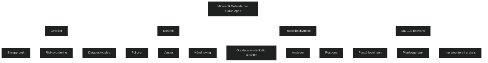
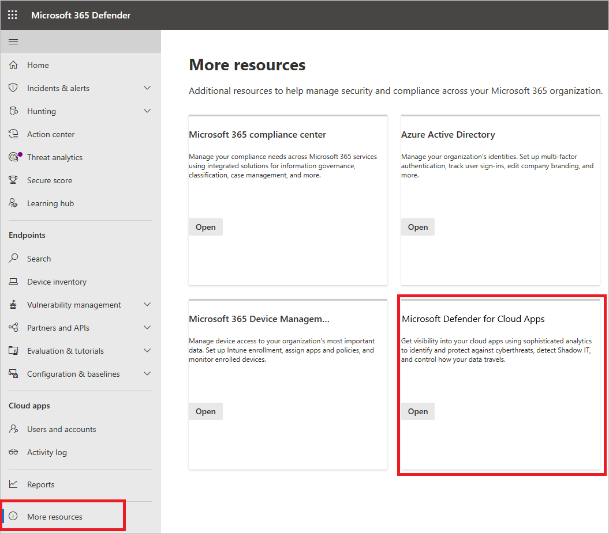

# [Manage Microsoft Defender for Cloud Apps](https://learn.microsoft.com/en-us/training/modules/manage-microsoft-defender-cloud-apps/)

## [Introduction](https://learn.microsoft.com/en-us/training/modules/manage-microsoft-defender-cloud-apps/1-introduction/?ns-enrollment-type=learningpath&ns-enrollment-id=learn.wwl.manage-endpoint-security)

Skyteknologi gir fleksibilitet for både ansatte og IT avdelinger, men øker samtidig kompleksiteten i sikkerhetsarbeidet. Det krever en balanse mellom tilgjengelighet og beskyttelse av data. [Microsoft Defender for Cloud Apps](../../Glossary/Microsoft-Defender-for-Cloud-Apps) er utviklet for å gi en oversikt, kontroll og beskyttelse i et miljø der apper og tjenester brukes på tvers av plattformer og lokasjoner.

Løsningen gir innsikt i hvordan skyapper brukes, hvilke risikoer som finnes og hvordan data kan sikres mot trusler. Den bidrar til å styrke sikkerhetsposisjonen ved å overvåke aktivitet, oppdage mistenkelige hendelser og håndheve policyer som beskytter sensitiv informasjon. Dette gjør den relevant i moderne arbeidsmiljøer der brukere arbeider fra ulike steder og med mange ulike tjenester.

<a href="/certs/diagrams/defender-cloud-apps.html" target="_blank" rel="noopener">Stort diagram</a>

## [Explore Microsoft Defender for Cloud Apps](https://learn.microsoft.com/en-us/training/modules/manage-microsoft-defender-cloud-apps/2-explore-microsoft-defender-cloud-apps/?ns-enrollment-type=learningpath&ns-enrollment-id=learn.wwl.manage-endpoint-security)

Microsoft Defender for Cloud Apps er en _[Cloud Access Security Broker (CASB)](../../Glossary/Cloud-Access-Security-Broker)_ som gir oversikt, kontroll og beskyttelse på tvers av skyapper. Den støtter flere distribusjonsmetoder som logginnsamling, API tilkoblinger og [reverse proxy](../../Glossary/Reverse-proxy.md). Løsningen gir innsikt i dataflyt, brukeradferd og risiko, og bruker avanserte analyser for å oppdage og håndtere trusler i både Microsoft og tredjeparts skyapper. Den integreres med andre Microsoft sikkerhetsløsninger for enklere administrasjon og automatisering.

### What is CASB

En CASB fungerer som en sikkerhetskontroll mellom brukere og skyressurser. Den håndhever virksomhetens sikkerhetspolicyer uavhengig av hvor brukeren befinner seg eller hvilken enhet som brukes. CASB løsninger gir oversikt over skyapper, [_Shadow IT](../../Glossary/Shadow-IT.md) , overvåker aktivitet, beskytter data, hindrer lekkasjer og vurderer samsvar. De dekker SaaS, PaaS og IaaS og brukes mot alt fra produktivitetstjenester til ERP og HR systemer.

### Why do I need a CASB

En CASB er nødvendig for å forstå og sikre hele skyen i en organisasjon. Den avdekker uautoriserte apper, vurderer [risiko](../../Glossary/Risikovurdering.md) og beskytter mot trusler som kan utnytte skyplattformer. CASB løsninger styrker sikkerheten innen fire hovedområder:

- _Visibility_: oppdager skyapper, rangerer risiko og identifiserer brukere og tredjeparts apper
- _Data security_: beskytter sensitiv informasjon med [Data Loss Prevention (DLP)](../../Glossary/Data-Loss-Prevention.md) og støtte for sensitivitetsetiketter
- _Threat protection_: bruker adaptive kontroller, adferdsanalyse og skadevarebeskyttelse
- _Compliance_: gir rapporter og innsikt som støtter styring og regulatoriske krav

Dette gjør CASB til en viktig del av moderne sikkerhetsarkitektur.

## [Planning Microsoft Defender for Cloud Apps](https://learn.microsoft.com/en-us/training/modules/manage-microsoft-defender-cloud-apps/3-planning-microsoft-defender-cloud-apps/?ns-enrollment-type=learningpath&ns-enrollment-id=learn.wwl.manage-endpoint-security)

Microsoft Defender for Cloud Apps gir mulighet til å bruke skyapps samtidig som du beholder kontroll over data og aktiviteter. Løsningen øker synlighet i skybruk og styrker databeskyttelsen ved å samle informasjon om aktivitet, risiko og tilgang. Den inngår i [Microsoft Defender XDR](../../Glossary/Microsoft-Defender-XDR.md), som samler sikkerhetsadministrasjon på tvers av identiteter, data, apper og infrastruktur. Dette gir en helhetlig og effektiv sikkerhetsforvaltning.

For å ta i bruk løsningen må du ha riktige lisenser, og administratorer må ha nødvendige roller i [Entra ID](../../Glossary/Microsoft-Entra-ID.md) eller Office 365. Administratorroller gjelder på tvers av alle skyapper du abonnerer på, noe som gjør rolleforståelse viktig. Når lisensene er på plass, får administratorer tilgang til portalen der konfigurasjon og overvåkning utføres. Løsningen støtter moderne nettlesere og krever ingen produktivitetslisenser fra Microsoft 365. 

## [Implement Microsoft Defender for Cloud Apps](https://learn.microsoft.com/en-us/training/modules/manage-microsoft-defender-cloud-apps/4-implement-microsoft-defender-cloud-apps/?ns-enrollment-type=learningpath&ns-enrollment-id=learn.wwl.manage-endpoint-security)

Det finnes sju trinn som må gjennomføres for å ta i bruk _Microsoft Defender for Cloud Apps_. 

### To access the portal

Portalen kan åpnes via  [https://portal.cloudappsecurity.com](https://portal.cloudappsecurity.com/) eller via  [Microsoft Defender portal](https://security.microsoft.com/). 

### Step 1: Set instant visibility, protection, and governance actions for your apps

[[App-connectors]] brukes for å koble til apper. Når en app er koblet til, får man dypere innsikt i aktiviteter, filer og kontoer. Dette gir grunnlag for undersøkelser og styring.

[Set instant visibility, protection, and governance actions for your apps](https://learn.microsoft.com/en-us/defender-cloud-apps/enable-instant-visibility-protection-and-governance-actions-for-your-apps)

### Step 2: Protect sensitive information with DLP policies 

_File monitoring_ aktiveres for å overvåke filer i tilkoblede apper. _Sensitivity labels_ kan brukes hvis organisasjonen benytter [Microsoft Purview Information Protection](../../Glossary/Microsoft-Purview-Information-Protection.md). Deretter opprettes file policies for å beskytte sensitiv informasjon.

- _Tips_: Filer kan vises under Investigate > Files. 
- _Migration recommendation_: Man kan bruke løsningen parallelt med en eksisterende CASB. 
- _Note_: For tredjepartsapper må man kontrollere API begrensninger.

[Protect sensitive information with DLP policies](https://learn.microsoft.com/en-us/defender-cloud-apps/policies-information-protection)
[File policies](https://learn.microsoft.com/en-us/defender-cloud-apps/data-protection-policies)

### Step 3: Control cloud apps with policies

Policyer opprettes fra maler og tilpasses med filtre og handlinger. Policyer brukes for å identifisere trender, oppdage trusler og håndheve styring og databeskyttelse.

- Tips: Opprett policyer for alle risikokategorier. Policyer brukes for å spore trender, identifisere trusler og etablere styring og databeskyttelse.

[Control cloud apps with policies](https://learn.microsoft.com/en-us/defender-cloud-apps/control-cloud-apps-with-policies)

### Step 4: Set up Cloud Discovery

_Cloud Disovery_ gir oversikt over skybruk, inkludert [Shadow IT](../../Glossary/Shadow-IT.md). Dette kan gjøres via [Defender for Endpoint](../../../_site/certs/Glossary/Microsoft-Defender-for-Endpoint.html) eller ved å laste opp logger. Snapshot rapporter kan også opprettes. 

- _Migration recommendation_: Kan brukes parallelt med annen CASB. 
- _Snapshot rapporter_ opprettes under Discover > Create snapshot report. 
- _Cloud Discovery_ gir oversikt over skybruk, hvem som bruker hvilke apper og på hvilke enheter.

[Set up Cloud Discovery](https://learn.microsoft.com/en-us/defender-cloud-apps/set-up-cloud-discovery)
[Integrate with Microsoft Defender for Endpoint](https://learn.microsoft.com/en-us/defender-cloud-apps/mde-integration)

### Step 5: Deploy Conditional Access App Control for catalog apps

[Conditional Access App Control](../../Glossary/Conditional-Access-App-Control) gir mulighet til å overvåke og styre bruk av katalogapper i sanntid. Identitetsleverandøren må konfigureres. 

Med Microsoft Entra ID kan man bruke Monitor only og Block downloads for katalogapper. Appene må onboardes ved å logge inn med en bruker som omfattes av policyen. 

- _Migration recommendation_: Parallell bruk med annen CASB kan gi dobbel proxying og bør unngås.

[Deploy Conditional Access App Control for catalog apps](https://learn.microsoft.com/en-us/defender-cloud-apps/proxy-deployment-aad)
[Deploy Conditional Access App Control for custom apps using Microsoft Entra ID](https://learn.microsoft.com/en-us/defender-cloud-apps/proxy-deployment-any-app)

### Step 6: Personalize your experience

Epostinnstillinger, varsler og risikopoeng kan tilpasses for å gi bedre varsler og mer relevante risikoscorer.

- Epostinnstillinger settes under Mail settings. 
- Varsler konfigureres under User settings. 
- Score metrics kan tilpasses under Cloud Discovery for å justere risikovurdering. 

[Personalize your experience](https://learn.microsoft.com/en-us/defender-cloud-apps/mail-settings)

### Step 7: Organize the data according to your needs

IP områder, rapporter og domener kan konfigureres for å strukturere data og gjøre det enklere å filtrere og lage policyer.

- IP adresser kan tagges via Continuous reports. 
- Domener legges inn under Organization details.

[Working with ip ranges and tags](https://learn.microsoft.com/en-us/defender-cloud-apps/ip-tags)

## [Module assessment](https://learn.microsoft.com/en-us/training/modules/manage-microsoft-defender-cloud-apps/5-knowledge-check/?ns-enrollment-type=learningpath&ns-enrollment-id=learn.wwl.manage-endpoint-security)

1. You're an IT team member responsible for ensuring the security of your organization's cloud applications and services. Your team is planning to implement Microsoft Defender for Cloud Apps. What is the relevance of this solution in today's dynamic work settings?

	Microsoft Defender for Cloud Apps is a robust cloud security solution that helps strike a balance between facilitating access and safeguarding crucial data in today's dynamic work settings.

2. Why is a Cloud Access Security Broker (CASB) necessary for organizations using cloud apps?

	CASBs are necessary to tackle the unique challenges of securing cloud environments, including IAM, VMs, compute resources, data and storage, and network resources.

3. As a security administrator, what is the prerequisite to set up Microsoft Defender for Cloud Apps?

	A license for every user protected by Microsoft Defender for Cloud Apps

4. What is the purpose of connecting an app in Microsoft Defender for Cloud Apps?

	To gain deeper visibility so you can investigate activities, files, and accounts for the apps in your cloud environment

## [Summary](https://learn.microsoft.com/en-us/training/modules/manage-microsoft-defender-cloud-apps/6-summary/?ns-enrollment-type=learningpath&ns-enrollment-id=learn.wwl.manage-endpoint-security)

Modulen tar for seg hvordan organisasjoner møter nye sikkerhetsutfordringer når de flytter til skyteknologi, og hvordan dette krever løsninger som kan kombinere tilgangsstyring og databeskyttelse. Den beskriver hvordan Microsoft Defender for Cloud Apps fungerer som en sentral del av denne sikkerhetsmodellen ved å gi innsikt i aktivitet, risiko og trusler i skyapplikasjoner.

Modulen tar for seg hvordan løsningen bruker teknologier som app connectors for å hente data direkte fra skyapper, Cloud Discovery for å identifisere bruk av apper og Shadow IT, og policybasert styring for å overvåke og kontrollere aktivitet. Den viser hvordan løsningen beskytter sensitiv informasjon gjennom overvåking av filer, risikovurdering av apper og bruk av databeskyttelsesmekanismer.

Modulen beskriver også hvordan Defender for Cloud Apps inngår i en større sikkerhetsarkitektur, der den samarbeider med identitetskontroll, tilgangsstyring og andre sikkerhetsverktøy for å beskytte data i dynamiske arbeidsmiljøer. Den viser hvordan løsningen brukes i praksis for å oppdage trusler, analysere aktivitet og styrke sikkerheten i skyapplikasjoner og tjenester.