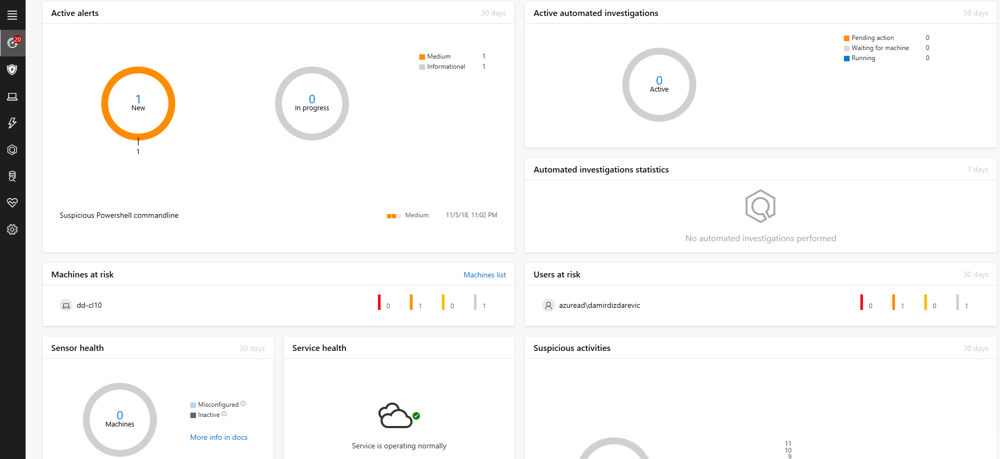
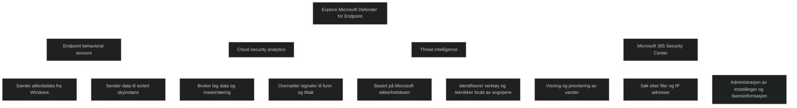
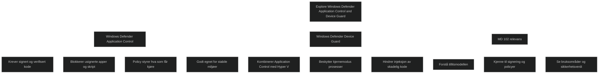
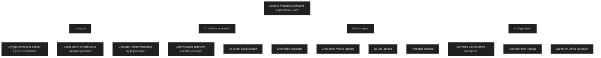
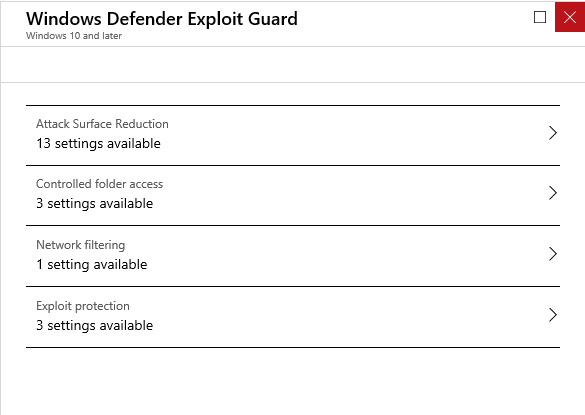
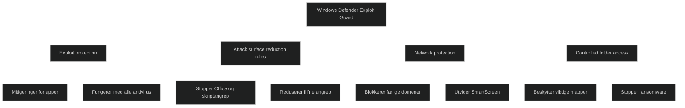
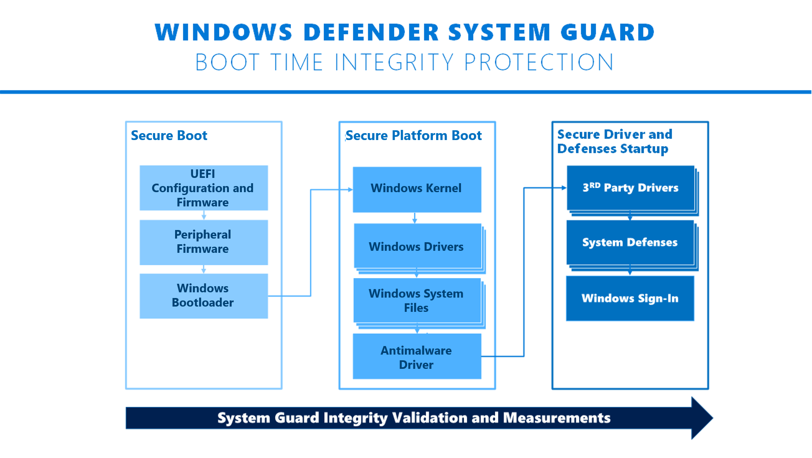
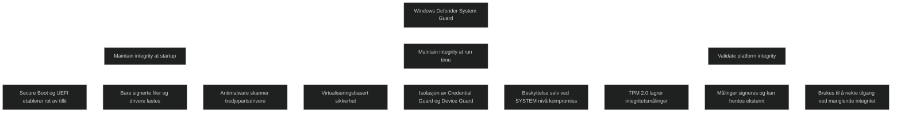
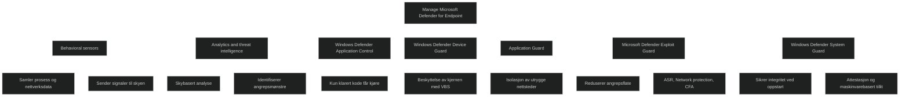

# [Manage Microsoft Defender for Endpoint](https://learn.microsoft.com/en-us/training/modules/manage-defender-endpoint/)

## [Introduction](https://learn.microsoft.com/en-us/training/modules/manage-defender-endpoint/1-introduction/?ns-enrollment-type=learningpath&ns-enrollment-id=learn.wwl.manage-endpoint-security)

[Microsoft Defender for Endpoint](../../Glossary/Microsoft-Defender-for-Endpoint.md) er en avansert skybasert sikkerhetsløsning som hjelper organisasjoner med å _identifisere, undersøke og håndtere moderne trusler_. 
Løsningen kombinerer adferdsbasert angrepsdeteksjon, en detaljert tidslinje for hendelser og et omfattende kunnskapsbase for trusselinformasjon. Dette gjør det mulig å oppdage angrep tidlig, forstå hvordan de utvikler seg og iverksette tiltak.

De viktigste komponentene i Defender for Endpoint er:
- [Microsoft Defender Application Guard](../../Glossary/Microsoft-Defender-Application-Guard.md)
- [Microsoft Defender Exploit Guard](../../Glossary/Microsoft-Defender-Exploit-Guard.md)
- [Microsoft-Defender-System-Guard](../../Glossary/Microsoft-Defender-System-Guard.md)

## [Explore Microsoft Defender for Endpoint](https://learn.microsoft.com/en-us/training/modules/manage-defender-endpoint/2-explore/?ns-enrollment-type=learningpath&ns-enrollment-id=learn.wwl.manage-endpoint-security)

Microsoft Defender for Endpoint er en plattform som beskytter virksomheter mot avanserte trusler. Løsningen går langt utover den innebygde Microsoft Defender og gir sentralisert kontroll, avansert trusseldeteksjon og integrasjon med flere sikkerhetstjenester i Microsoft 365. Den samler data fra klienter, analyserer dem i skyen og gir anbefalte tiltak for å stoppe angrep før de utvikler seg.

### Endpoint behavioral sensors

Sensorer innebygd i Windows samler inn adferdsdata fra systemet. Disse dataene sendes til en isolert skyinstans av Defender for Endpoint. Sensorene gir innsikt i prosesser, nettverkstrafikk og systemhendelser og danner grunnlaget for avansert trusselanalyse.

### Cloud security analytics

Skybasert analyse bruker store datamengder, maskinlæring og innsikt fra Microsofts økosystem. Dette gjør det mulig å oppdage mønstre som indikerer angrep, inkludert avanserte og vedvarende trusler. Analysen oversetter rådata til konkrete funn og anbefalte tiltak.

### Threat intelligence

Trusselintelligens fra Microsofts sikkerhetsteam og partnere gjør det mulig å identifisere kjente verktøy, teknikker og prosedyrer brukt av angripere. Når slike mønstre oppdages i sensorinformasjonen, genereres varsler som kan undersøkes videre.

### Microsoft 365 Security Center

Dette er hovedkonsollet for Defender for Endpoint. Her kan sikkerhetsteam:

- se og prioritere varsler
- undersøke filer, prosesser og IP adresser
- endre innstillinger og administrere lisensinformasjon

Konsollet gir en samlet oversikt over sikkerhetstilstanden i virksomheten.

<a href="/certs/diagrams/defender-for-endpoint.html" target="_blank" rel="noopener">Stort diagram</a>

## [Examine key capabilities of Microsoft Defender for Endpoint](https://learn.microsoft.com/en-us/training/modules/manage-defender-endpoint/3-examine-key-capabilities-of/?ns-enrollment-type=learningpath&ns-enrollment-id=learn.wwl.manage-endpoint-security)

Microsoft Defender for Endpoint består av flere sikkerhetsfunksjoner som sammen beskytter mot moderne trusler. Plattformen kombinerer forebygging, deteksjon, respons og kontinuerlig vurdering av sikkerhetstilstanden. Dette gir et helhetlig rammeverk som styrker virksomhetens evne til å motstå avanserte angrep.

### Attack surface reduction

Attack surface reduction er første forsvarslinje og reduserer muligheten for at angrep lykkes. Funksjonene sørger for riktig konfigurasjon, blokkerer skadelig atferd og bruker mitigeringsteknikker for å hindre utnyttelse.

Viktige komponenter:

- _Hardware based isolation_ beskytter systemintegritet ved oppstart og i drift, og bruker attestasjonsmekanismer.
- _Application control_ krever at apper må bevise at de er til å stole på før de får kjøre.
- _Exploit protection_ legger til mitigeringer for apper og fungerer sammen med både [Microsoft Defender Antivirus](../../Glossary/Microsoft-Defender-Antivirus.md) og tredjeparts antivirus.
- _Network protection_ blokkerer skadelig trafikk og utvider [SmartScreen](../../Glossary/Microsoft-Defender-SmartScreen.md) beskyttelse til hele systemet.
- _Controlled folder access_ beskytter viktige mapper mot uautoriserte endringer, inkludert ransomware.
- _Attack surface reduction rules_ stopper angrepsvektorer i Office, skript og e post.
- _Network firewall_ filtrerer inn og utgående trafikk på vertsnivå.

### Next generation protection

Microsoft Defender Antivirus gir moderne beskyttelse mot nye og ukjente trusler. Den bruker:

- skybasert beskyttelse for rask blokkering
- maskinlæring og Intelligent Security Graph
- sanntidsbeskyttelse med overvåking av filer og prosesser
- kontinuerlige oppdateringer basert på forskning og big data

Dette gir et sterkt lag av forebyggende beskyttelse.

### Endpoint detection and response

Endpoint detection and response oppdager avanserte angrep i nær sanntid. Funksjonene gjør det mulig å:

- prioritere varsler
- se hele angrepsforløpet
- gruppere relaterte varsler i hendelser
- undersøke prosesser, nettverk og systemaktivitet
- spore hendelser tilbake i tid med seks måneders telemetri

Dette bygger på et assume breach prinsipp og gir dyp innsikt i hva som faktisk skjer på klientene.

### Auto investigation and remediation

Automatisert undersøkelse og utbedring reduserer antall varsler som må håndteres manuelt. Systemet bruker algoritmer og playbooks for å:

- analysere varsler
- identifisere årsak
- utføre tiltak automatisk

Dette gjør at sikkerhetsteam kan fokusere på de mest kritiske hendelsene.

### Secure score

Secure score gir en dynamisk vurdering av sikkerhetstilstanden. Dashboardet viser:

- samlet sikkerhetsscore
- score over tid
- anbefalte tiltak
- maskiner som krever oppmerksomhet

Dette hjelper organisasjoner med å prioritere forbedringer og følge anbefalte konfigurasjoner.

### Advanced hunting

Advanced hunting gir mulighet til å søke etter trusler i hele miljøet ved hjelp av et fleksibelt spørrespråk. Du kan:

- bruke tabeller med telemetri
- lage egne spørringer
- opprette tilpassede deteksjoner
- navigere direkte til relevante objekter i portalen

Dette er et kraftig verktøy for proaktiv trusseljakt.

### Management and APIs

Defender for Endpoint kan integreres i eksisterende administrasjonsmiljøer. Det støtter:

- Intune og Configuration Manager for onboarding
- gruppepolicy og tredjepartsverktøy
- rollebasert tilgangskontroll for detaljert styring
- APIer for automatisering og integrasjon

Dette gjør løsningen fleksibel og skalerbar.

```mermaid
%%{init: {
  "theme": "dark",
  "themeVariables": {
    "primaryColor": "#1e1e1e",
    "primaryTextColor": "#ffffff",
    "lineColor": "#ffffff",
    "secondaryColor": "#333333"
  }
}}%%

flowchart TB

    A[Examine key capabilities of Microsoft Defender for Endpoint]

    %% Attack surface reduction
    A --> B[Attack surface reduction]
    B --> B1[Hardware based isolation]
    B1 --> B1a[Integritet ved oppstart og i drift]
    B1 --> B1b[Attestasjon av systemtilstand]

    B --> B2[Application control]
    B2 --> B2a[Apper må bevise at de er til å stole på]

    B --> B3[Exploit protection]
    B3 --> B3a[Mitigeringer for apper]
    B3 --> B3b[Fungerer med Defender Antivirus og tredjeparts antivirus]

    B --> B4[Network protection]
    B4 --> B4a[Blokkerer skadelig trafikk]
    B4 --> B4b[Utvider SmartScreen beskyttelse]

    B --> B5[Controlled folder access]
    B5 --> B5a[Beskytter viktige mapper]
    B5 --> B5b[Stopper ransomware]

    B --> B6[Attack surface reduction rules]
    B6 --> B6a[Stopper Office og skriptbaserte angrep]

    B --> B7[Network firewall]
    B7 --> B7a[Filtrerer inn og utgående trafikk]

    %% Next generation protection
    A --> C[Next generation protection]
    C --> C1[Cloud delivered protection]
    C --> C2[Sanntidsbeskyttelse]
    C --> C3[Kontinuerlige oppdateringer]

    %% Endpoint
```

<a href="/certs/diagrams/defender-for-endpoint-capabilities.html" target="_blank" rel="noopener">Stort diagram</a>

## [Explore Windows Defender Application Control and Device Guard](https://learn.microsoft.com/en-us/training/modules/manage-defender-endpoint/4-explore-windows-defender-application-control-device-guard/?ns-enrollment-type=learningpath&ns-enrollment-id=learn.wwl.manage-endpoint-security)

Windows Defender Application Control og Device Guard gir et ekstra lag med beskyttelse mot ukjente og nye trusler. Tradisjonell signaturbasert antivirus er ikke nok når tusenvis av nye filer skapes hver dag. Disse teknologiene bygger på prinsippet om at apper må bevise at de er til å stole på før de får kjøre.

### Windows Defender Application Control

[Application Control](../../Glossary/Microsoft-Defender-Application-Control.md) endrer tillitsmodellen fra at alt er tillatt som standard, til at bare verifisert og godkjent kode får kjøre. Dette skjer ved at:

- kjørbare filer må være signert av en pålitelig utgiver
- administrator kan lage en liste over usignert kode som organisasjonen selv signerer
- policyen blokkerer alle apper, skript, MSIs og PowerShell som ikke er godkjent

Dette passer spesielt godt i miljøer med stabile og forutsigbare systemer, som PoS terminaler, bankautomater og VDI løsninger. Windows Update fungerer fortsatt fordi Microsoft signerer alt innhold.

### Windows Defender Device Guard

Device Guard kombinerer Application Control med Hyper V basert beskyttelse av kjernemodus prosesser. Dette hindrer injeksjon og kjøring av skadelig kode i kjernen.

Hypervisor protected code integrity krever kompatibel maskinvare og drivere, men gir svært sterk beskyttelse mot avanserte angrep.

<a href="/certs/diagrams/defender-appcontrol-deviceguard.html" target="_blank" rel="noopener">Stort diagram</a>

## [Explore Microsoft Defender Application Guard](https://learn.microsoft.com/en-us/training/modules/manage-defender-endpoint/5-explore-application-guard/?ns-enrollment-type=learningpath&ns-enrollment-id=learn.wwl.manage-endpoint-security)

Microsoft Defender Application Guard isolerer utrygge nettsteder i en egen Hyper V basert container. Målet er å hindre at skadelig kode får tilgang til virksomhetsdata eller brukerens identitet. Administrator definerer hvilke nettsteder, ressurser og nettverk som er klarerte. Alt annet åpnes i en isolert økt som ikke har tilgang til systemet.

Denne isolasjonen gjør at selv om et nettsted er ondsinnet, kan angrepet ikke nå virksomhetens data eller brukerens legitimasjon. Containeren er anonym og helt adskilt fra operativsystemet.

### Types of devices that should use Application Guard

Application Guard kan brukes på flere typer klienter:

- Enterprise desktops
- Enterprise mobile laptops
- BYOD mobile laptops
- Personal devices

Dette viser at løsningen fungerer både i styrte og delvis styrte miljøer, men gir størst verdi i virksomhetsstyrte scenarioer.

### Configuring Application Guard

Application Guard kan aktiveres via Windows funksjoner eller administreres sentralt gjennom Intune. Intune gir flere konfigurasjonsmuligheter enn gruppepolicy og støtter også Application Guard for Office.

<a href="/certs/diagrams/application-guard2.html" target="_blank" rel="noopener">Stort diagram</a>

## [Examine Windows Defender Exploit Guard](https://learn.microsoft.com/en-us/training/modules/manage-defender-endpoint/6-examine-windows-defender-exploit-guard/?ns-enrollment-type=learningpath&ns-enrollment-id=learn.wwl.manage-endpoint-security)

[Microsoft Defender Exploit Guard](../../Glossary/Microsoft-Defender-Exploit-Guard.md) består av fire hovedfunksjoner som reduserer angrepsflaten og beskytter mot moderne trusler. Løsningen kombinerer forebygging, blokkering av skadelig atferd og beskyttelse av viktige filer. Alle funksjonene kan administreres via gruppepolicy eller Intune.

### Exploit protection

Exploit protection legger til mitigeringer som beskytter apper mot sårbarhetsutnyttelse. Dette gjelder både Microsoft apper og tredjepartsprogrammer. Funksjonen fungerer sammen med både Microsoft Defender Antivirus og tredjeparts antivirus. Innstillinger kan konfigureres per app eller globalt.

### Attack surface reduction rules

Attack surface reduction regler stopper vanlige angrepsvektorer i Office, skript og e post. Reglene blokkerer blant annet kjøring av mistenkelige makroer, barneprosesser, skriptinjeksjon og andre teknikker brukt i filfrie angrep. Reglene krever Microsoft Defender Antivirus.

### Network protection

Network protection utvider SmartScreen beskyttelse til hele systemet. Den blokkerer utgående trafikk til farlige domener og hindrer brukere og apper i å nå nettsteder som er kjent for phishing eller malware. Dette reduserer risikoen for sosial manipulering og nedlasting av skadelig innhold.

### Controlled folder access

Controlled folder access beskytter viktige mapper mot uautoriserte endringer. Bare klarerte apper får skrive til beskyttede områder. Dette hindrer ransomware i å kryptere dokumenter, bilder, videoer og andre brukerfiler. Administrator kan legge til egne mapper og godkjente apper.

<a href="/certs/diagrams/defender-exploit-guard.html" target="_blank" rel="noopener">Stort diagram</a>

## [Explore Windows Defender System Guard](https://learn.microsoft.com/en-us/training/modules/manage-defender-endpoint/7-explore-windows-defender-system-guard/?ns-enrollment-type=learningpath&ns-enrollment-id=learn.wwl.manage-endpoint-security)

Windows Defender System Guard beskytter systemintegriteten gjennom hele livssyklusen. Løsningen isolerer kritiske tjenester i en egen sikker container og sørger for at systemet forblir pålitelig selv om angriperen får høy privilegert tilgang. System Guard samler flere integritetsfunksjoner i en helhetlig modell som styrker plattformens motstandskraft.

# Maintain the integrity of the system as it starts

System Guard bygger på en maskinvarebasert rot av tillit gjennom Secure Boot og UEFI. Dette hindrer at uautoriserte komponenter som bootkits og rootkits kan starte før Windows. Bare signerte og sikre Windows filer og drivere lastes inn. Etter oppstart skannes tredjepartsdrivere av antimalwareløsningen for å sikre at systemet starter i en tilstand med høy integritet.

# Maintain integrity of the system after it is running (run time)

System Guard bruker virtualiseringsbasert sikkerhet til å isolere kritiske tjenester som Credential Guard, Device Guard, Virtual TPM og deler av Exploit Guard. Disse tjenestene ligger i et maskinvareisolert miljø som ikke kan manipuleres selv om angriperen får SYSTEM nivå eller kompromitterer kjernen. Dette gir et robust forsvar mot avanserte angrep.

# Validate platform integrity after Windows is running (run time)

System Guard tar integritetsmålinger under oppstart og lagrer dem i TPM 2.0 i et maskinvareisolert område. Målingene signeres og kan hentes av administrasjonsverktøy som Intune eller Configuration Manager for ekstern validering. Dersom integriteten ikke kan bekreftes, kan tilgang til ressurser nektes. Dette bygger på et assume breach prinsipp og gir en viktig kontrollmekanisme i moderne sikkerhetsarkitektur.'

## [Module assessment](https://learn.microsoft.com/en-us/training/modules/manage-defender-endpoint/8-knowledge-check/?ns-enrollment-type=learningpath&ns-enrollment-id=learn.wwl.manage-endpoint-security)

1. _Fabrikam wants to isolate enterprise-defined untrusted sites for the purpose of protecting the company while its employees browse the internet. What feature of Microsoft Defender for Endpoint provides this functionality?_

	Microsoft Defender Application Guard

2. _Northwind Traders wants to use Microsoft Defender for Endpoint to help prevent, detect, investigate, and respond to advanced threats against its corporate network. What feature of Microsoft Defender for Endpoint will help Northwind Traders to assess the security posture of the organization, see machines that require attention, as well as recommendations for actions to further reduce the attack surface within the company?_

	The Secure score dashboard

## [Summary](https://learn.microsoft.com/en-us/training/modules/manage-defender-endpoint/9-summary/?ns-enrollment-type=learningpath&ns-enrollment-id=learn.wwl.manage-endpoint-security)

Microsoft Defender for Endpoint er en helhetlig sikkerhetsplattform som samler beskyttelse, deteksjon og respons på tvers av både sky og lokale ressurser. Løsningen bruker sensorer, analyse og trusselintelligens for å gi administratorer innsikt i mistenkelig aktivitet og mulighet til å reagere raskt.

Plattformen fungerer som et sentralt kontrollpunkt for endepunktsikkerhet og er en kjernekomponent i moderne Zero Trust arkitektur.

### Behavioral sensors

Sensorer i Windows samler inn data om prosesser, nettverkstrafikk og systemhendelser. Disse dataene sendes til Defender for Endpoint for analyse og deteksjon av trusler.

### Analytics and threat intelligence

Skybasert analyse og trusselintelligens gjør det mulig å identifisere angrepsmønstre og mistenkelig aktivitet. Dette gir tidlige varsler og anbefalte tiltak.

### Windows Defender Application Control

Hindrer uautoriserte apper i å kjøre ved å kreve at kode er klarert og signert.

### Windows Defender Device Guard

Beskytter kjernen mot uverifisert kode ved hjelp av virtualiseringsbasert sikkerhet.

### Application Guard

Isolerer utrygge nettsteder i en Hyper V container for å hindre at angrep når systemet.

### Microsoft Defender Exploit Guard

Reduserer angrepsflaten gjennom exploit protection, ASR regler, network protection og controlled folder access.

### Windows Defender System Guard

Sikrer systemintegritet ved oppstart og under drift gjennom maskinvarebasert tillit og attestasjonsmekanismer.

<a href="/certs/diagrams/defender-for-endpoint2.html" target="_blank" rel="noopener">Stort diagram</a>