# [Manage Microsoft Defender in Windows client](https://learn.microsoft.com/en-us/training/modules/manage-defender-windows-client/)

## [Introduction](https://learn.microsoft.com/en-us/training/modules/manage-defender-windows-client/1-introduction/?ns-enrollment-type=learningpath&ns-enrollment-id=learn.wwl.manage-endpoint-security)

Modulen gir en grunnleggende forståelse av hvordan [Windows Security](../../Glossary/Windows-Security.md) beskytter klienter mot moderne trusler. Den forklarer hvordan den samlede plattformen fungerer for å beskytte, detektere og respondere, samt hvordan administratorer kan bruke de innebygde verktøyene for å sikre klientene i virksomheten.

Da Windows er spesielt utsatt for nettverksbaserte angrep tar modulen for seg hvordan Defender komponentene samarbeider for å redusere risikoen og håndtere hendelsene raskt.

## [Explore Windows Security Center](https://learn.microsoft.com/en-us/training/modules/manage-defender-windows-client/2-explore-windows-security-center/?ns-enrollment-type=learningpath&ns-enrollment-id=learn.wwl.manage-endpoint-security)

Windows Security Center er stedet der du ser og styrer sikkerheten i Windows (11 og nyere). Det samler antivirus, brannmur, appkontroll og maskinvarebasert beskyttelse på et sted. Løsningen bygger på Microsoft Defender og er aktiv fra første oppstart. Den dekker hele livssyklusen til systemet og sørger for at viktige sikkerhetsfunksjoner alltid er tilgjengelig.

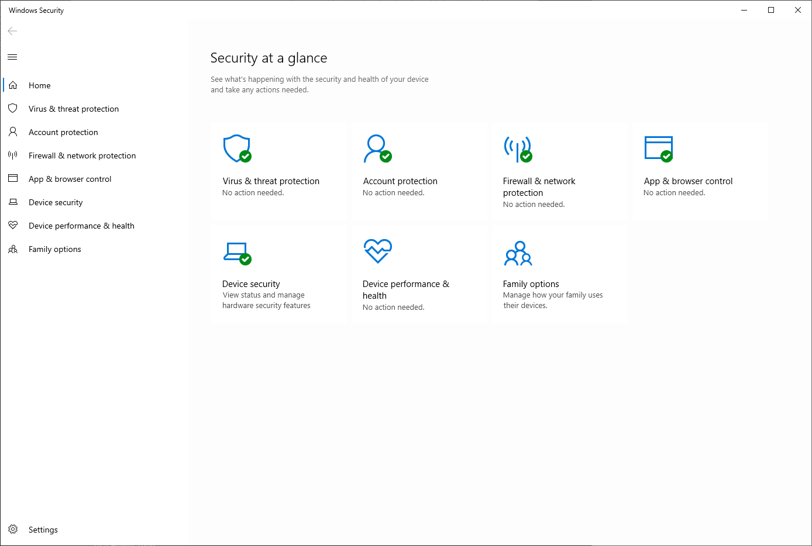

### Virus and threat protection

Håndterer antivirus og antimalware. Her finner du skanninger, sanntidsbeskyttelse, karantene og oppdateringer. Er kjernen i Microsoft Defender Antivirus og del av grunnsikringen. 

### Account protection

Gir kontroll over påloggingsmetoder som [Windows Hello](../../Glossary/Windows-Hello.md) og [Dynamic Lock](../../Glossary/Dynamic-Lock.md). Dette styrker identitetssikkerheten og reduserer risikoen for uautorisert tilgang.

### Firewall and network protection

Gir tilgang til Windows Firewall. Her kan du styre hvilke apper som får kommunisere, og konfigurere regler for ulike nettverksprofiler.

### App and browser control

Her konfigureres [Microsoft Defender SmartScreen](../../Glossary/Microsoft-Defender-SmartScreen.md). Den beskytter mot utrygge apper, filer og nettsteder, både i nettleser og i MS Store apper.

### Device Security

Gir informasjon om maskinvarebasert sikkerhet som _[core isolation](../../Glossary/Core-Isolation), TPM_ og _Secure Boot_. Dette er grunnlaget for plattformintegritet og [Zero Trust](../../Glossary/Zero-Trust.md).

### Device performance and health

Viser status for Windows oppdateringer, lagringsplass, drivere, batteri og programvare. Du kan også starte en refresh av OS uten en reinstallasjon.

### Family options

Gir tilgang til foreldrekontroll og familieadministrasjon.

### Protection history

Viser nylige trusler og anbefalte tiltak. I Win11 ligger dette som en egen del av _Virus and Threat protection_.

```mermaid
%%{init: {
  "theme": "dark",
  "themeVariables": {
    "primaryColor": "#1e1e1e",
    "primaryTextColor": "#ffffff",
    "lineColor": "#ffffff",
    "secondaryColor": "#333333"
  }
}}%%

flowchart TB

    A[Windows Security Center]

    A --> B[Virus and threat protection]
    B --> B1[Antivirus og antimalware]
    B --> B2[Skanning og karantene]

    A --> C[Account protection]
    C --> C1[Windows Hello]
    C --> C2[Dynamic Lock]

    A --> D[Firewall and network protection]
    D --> D1[Brannmurregler]
    D --> D2[Nettverksprofiler]

    A --> E[App and browser control]
    E --> E1[SmartScreen]
    E --> E2[Appkontroll]

    A --> F[Device security]
    F --> F1[TPM og Secure Boot]
    F --> F2[Core isolation]

    A --> G[Device performance and health]
    G --> G1[Systemstatus]
    G --> G2[Fresh start]

    A --> H[Family options]
    H --> H1[Foreldrekontroll]

    A --> I[Protection History]
    I --> I1[Nylige trusler]

```

## [Explore Windows Defender Credential Guard](https://learn.microsoft.com/en-us/training/modules/manage-defender-windows-client/3-explore-windows-defender-credential-guard/?ns-enrollment-type=learningpath&ns-enrollment-id=learn.wwl.manage-endpoint-security)

[Microsoft Defender Credential Guard](../../Glossary/Microsoft-Defender-Credential-Guard.md) beskytter autentiseringshemmeligheter ved å isolere dem i et eget, virtualisert miljø. Funksjonen ble introdusert i Win10 Enterprise og Server 2016. Den ble utviklet for å stoppe angrep som _pass the hash_ og _pass the ticket_.

_Credential Guard_ hindrer at angripere får tilgang til _NTLM hasher, Kerberos Ticket Granting Tickets_ og legitimasjon som apper lagrer. Selv skadevare med adminrettigheter kan ikke hente ut hemmeligheter som ligger i det beskyttede miljøet.

_Credential Guard_ bygger på [secure boot](../../Glossary/Secure-Boot), [trusted platform module (TPM)](../../Glossary/Trusted-Platform-Module) og virtualiseringsbasert sikkerhet for å sikre at bare klarerte systemkomponenter får tilgang til autentiseringsdata.

```mermaid
%%{init: {
  "theme": "dark",
  "themeVariables": {
    "primaryColor": "#1e1e1e",
    "primaryTextColor": "#ffffff",
    "lineColor": "#ffffff",
    "secondaryColor": "#333333"
  }
}}%%

flowchart TB

    A[Windows Defender Credential Guard]

    A --> B[Beskyttede hemmeligheter]
    B --> B1[NTLM hasher]
    B --> B2[Kerberos TGT]
    B --> B3[App lagrede legitimasjoner]

    A --> C[Virtualiseringsbasert sikkerhet]
    C --> C1[Isolert LSA miljø]
    C --> C2[Klarerte systemkomponenter]
    C --> C3[Ingen tilgang fra OS prosesser]

    A --> D[Beskyttelse mot angrep]
    D --> D1[Stopper pass the hash]
    D --> D2[Stopper pass the ticket]
    D --> D3[Hindrer APT teknikker]

    A --> E[Plattformfunksjoner]
    E --> E1[Secure Boot]
    E --> E2[TPM]
    E --> E3[VBS]

    A --> F[Aktivering]
    F --> F1[Group Policy]
    F --> F2[Intune]

    A --> G[Anbefalinger]
    G --> G1[Kombiner med Device Guard]
    G --> G2[Del av Zero Trust]

```

<a href="/certs/diagrams/defender-credential-guard.html" target="_blank" rel="noopener">Stort diagram</a>
### How Credential Guard works

Tidligere ble hemmeligheter lagret direkte i _[Local Security Authority (LSA)](../../Glossary/Local-Security-Authority)_ prosessen. Med _Credential Guard_ flyttes disse til en isolert _LSA_ prosess som kjører i et beskyttet miljø.

- LSA i OSet kommuniserer med den isolerte prosessen via RPC
- Bare signerte og klarerte binærfiler får kjøre i det beskyttede miljøet
- Drivere er blokkert for hindre manipulering
- Hemmeligheter er utilgjengelige for resten av systemet

Når _Credential Guard_ er aktivert, støttes ikke eldre autentiseringsprotokoller som _NTMLv1, MS CHAPv2, Digest_ og _CredSSP_. [[Kerberos]] blokkerer også _unconstraind delegation_ og _DES_.

#### Platform security features to protect credentials 
_NTLM, Kerberos_ og _Credential Manager_ bruker plattformfunksjoner som  _Secure Boot_ og virtualisering for å beskytte legitimasjon. Dette sikrer at hemmeligheter kun lastes av klarerte komponenter og ikke kan manipuleres av skadevare.

#### Virtualization-based security

_Credential Guard_ bruker virtualiseringsbasert sikkerhet til å kjøre _NTML_ og _Kerberos_ avledede hemmeligheter i et isolert miljø som er adskilt fra OSet. Dette miljøet er beskyttet mot innsyn, selv fra prosesser med høye rettigheter.

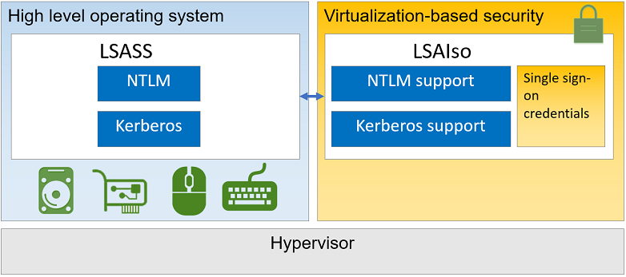

#### Better protection against advanced persistent threats

_Credential Guard_ blokkerer teknikker som brukes i målrettede angrep, der angripere forsøker å hente ut legitimasjon fra minnet. Selv skadevare med adminrettigheter kan ikke hente ut hemmeligheter som er beskyttet av virtualiseringsbasert sikkerhet.

Selv om _Credential Guard_ gir sterk beskyttelse, kan avanserte trusselaktører forsøke nye metoder. Derfor anbefales det å kombinere _Credential Guard_ med andre sikkerhetsfunksjoner som [Microsoft Defender Device Guard](../../Glossary/Microsoft-Defender-Device-Guard.md) og en helhetlig sikkerhetsarkitektur.

### Enable Windows Defender Credential Guard by using Group Policy

Credential Guard kan aktiveres via Group Policy:

- Turn On Virtualization Based Security settes til Enabled
- Velg Secure Boot eller Secure Boot and DMA Protection
- Velg Credential Guard konfigurasjon med eller uten UEFI lock

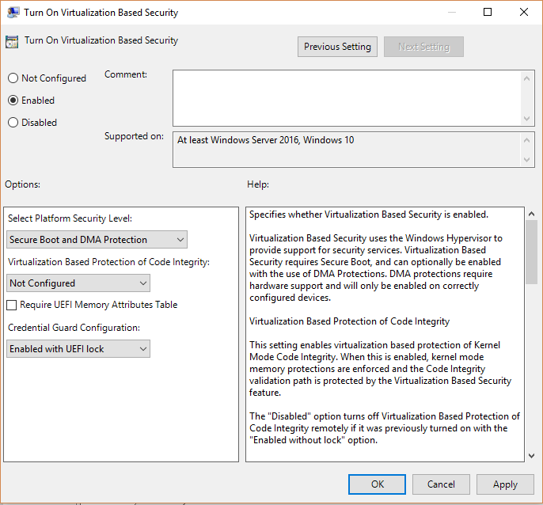

Funksjonen kan også distribueres via Intune som en del av enhetskonfigurasjon for Windows 10 og nyere.

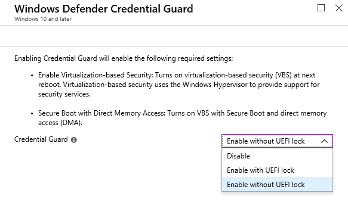

## [Manage Microsoft Defender Antivirus](https://learn.microsoft.com/en-us/training/modules/manage-defender-windows-client/4-antivirus/?ns-enrollment-type=learningpath&ns-enrollment-id=learn.wwl.manage-endpoint-security)

[Microsoft Defender Antivirus](../../Glossary/Microsoft-Defender-Antivirus.md) beskytter mot virus, spyware og annen skadevare. Løsningen bruker oppdaterte definisjoner for å identifisere trusler, og nye definisjoner installeres automatisk. 
Den kan kjøre _Quick, Full_ eller _Custom_ scan. _Quick_ scan sjekker områder som vanligvis angripes, _Full_ scan går igjennom alle filer og prosesser og _Custom_ scan lar deg velge bestemte mapper eller disker. 
Det anbefales å planlegge daglig _Quick_ scan, og bruke _Full_ scan når du mistenker infeksjon.

Når skadevare oppdages, stoppes aktiviteten og filen flyttes til karantene. Der kan du fjerne eller gjenopprette elementer, men det anbefales ikke å gjenopprette filer med høy risiko. Du kan legge til eksluderinger for filer, mapper, filtyper eller prosesser, men dette reduserer beskyttelsen.

[Microsoft Defender Offline](../../Glossary/Microsoft-Defender-Offline.md) kan brukes for å scanne fra et isolert miljø. Dette er nyttig mot trusler som angriper oppstartssektoren eller skjuler seg før Windows lastes.

Administrasjon kan gjøres via [Intune](../../Glossary/Microsoft-Intune.md), [Configuration Manager](../../Glossary/Microsoft-Configuration-Manager.md), GPO, PowerShell eller WMI. 
Intune anbefales når Microsoft 365 brukes som plattform. Her kan du konfigurere innstillinger som real time protection, cloud delivered protection og hvordan brukere kan samhandle med klienten.

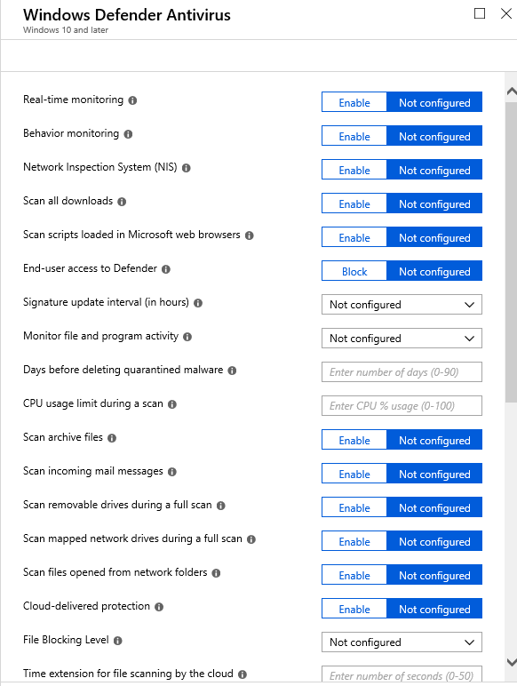
### Additional features in Microsoft Defender Antivirus

_Block at First Sight_ bruker skybasert beskyttelse for rask identifisering og blokkering av ny skadevare. Når funksjonen aktiveres, slås både _cloud based protection_ og automatisk innsending av prøver på. Dette gir svært rask respons på nye trusler.

_Detect and Block Potentially Unwanted Applications_ kan blokkere uønsket programvare under nedlastning eller installasjon. Dette gjelder blant annet programvare som følger med andre nedlastninger, reklareinfeksjon og verktøy som manipulerer systemet. Funksjonen er tilgjengelig for bedrifter som administrerer klienter via Configuration Manager eller Intune.

## [Manage Windows Defender Firewall](https://learn.microsoft.com/en-us/training/modules/manage-defender-windows-client/5-manage-windows-defender-firewall/?ns-enrollment-type=learningpath&ns-enrollment-id=learn.wwl.manage-endpoint-security)

[Microsoft Defender Firewall](../../Glossary/Microsoft-Defender-Firewall) er en viktig del av sikkerheten i Windows. Innstillinger kan administreres fra _Windows Security, Control Panel_ og _Network and Sharing Center_. I _System and Security_ kan du konfigurere grunnleggende innstillinger og se varsler i _Action Center_. I _Network and Sharing Center_ kan du endre nettverksprofil og tilpasse hvordan brannmuren oppfører seg på ulike nettverkstyper.

For klienter som administreres gjennom [Intune](../../Glossary/Microsoft-Intune.md) eller tilknyttet [Entra ID](../../Glossary/Microsoft-Entra-ID.md), kan innstillingene styres via _Endpoint protection profiler_. Dette er anbefalt metode i moderne administrerte miljøer. Alle funksjonene som beskrives i denne modulen kan styres gjennom Intune.

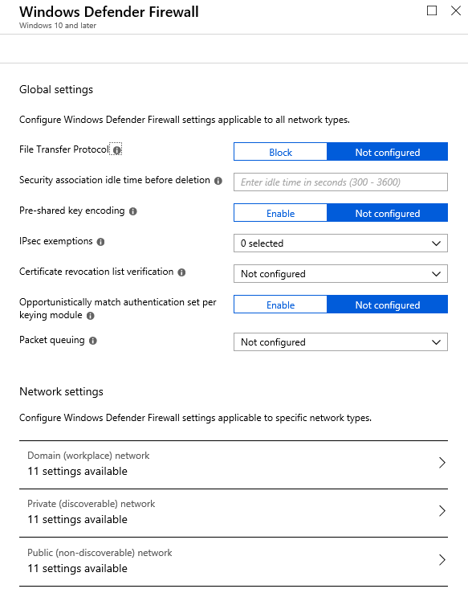

### Firewall execeptions

Når et program legges til som tillatt, eller en port åpnes, skapes en åpning i brannmuren. Hver åpning reduserer sikkerheten. Det er tryggere å tillate et program enn å åpne en port, siden en port forblir åpen til den lukkes manuelt. Et program åpner kun kommunikasjon når den faktisk trenger det.

For å administrere unntak brukes _Control Panel_, der du kan legge til, endre eller fjerne programmer eller porter. For å redusere risiko bør du:

- bare tillate programmer som er nødvendige
- fjerne unødvendige unntak
- aldri tillate programmer du ikke kjenner

### Multiple active firewall profiles

Windows kan ha flere aktive FW profiler samtidig. Dette gjør at en enhet kan bruke domenets firewallregler selv om den også er tilkoblet andre nettverk. Dette forenkler administrasjon for IT avdelinger som håndterer både interne og eksterne klienter.

Når en enhet kobles til et nettverk første gang, velger brukeren nettverksplassering. Window bruker _network location awareness_ for å identifisere netterverket basert på IP og maskinvareadresser (MAC). Hvis nettverket gjenkjennes velges riktig profil automatisk.

Det finnes tre profiler:

- _Domain networks_: Brukes når enheten kan nå en domenekontroller
- _Private networks_: Brukes på nettverk du stoler på
- _Guest or public networks_: Brukes på åpne nettverk og gir strengest beskyttelse

Hver profil kan konfigureres med egne innstillinger, som å blokkere alle innkommende tilkoblinger eller vise varsler når nye programmer blokkeres.

### Windows Defender Firewall notifications

Varsler kan vises når nye programmer blokkeres. Dette styres i _Control Panel_ under _Change notification settings_. For hver nettverksprofil kan du velge om du vil varsles når FW blokkerer et nytt program.

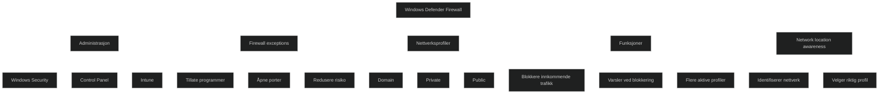

<a href="/certs/diagrams/defender-firewall.html" target="_blank" rel="noopener">Stort diagram</a>

## [Explore Windows Defender Firewall with Advanced Security](https://learn.microsoft.com/en-us/training/modules/manage-defender-windows-client/6-explore-windows-defender-firewall-advanced-security/?ns-enrollment-type=learningpath&ns-enrollment-id=learn.wwl.manage-endpoint-security)

[Microsoft Defender Firewall with Advanced Security](../../Glossary/Microsoft-Defender-Firewall-with-Advanced-Security) gir detaljert kontroll over nettverkstrafikk og sikkerhet. Den kan konfigureres lokalt, eksternt eller via GPO. Løsningen er nettverksbevisst og bruker profiler for _domain_, _private_ og _public network_. Hver profil kan ha egne regler, slik at du kan tillate mer fleksibilitet på interne nettverk og samtidig bruke strenge regler på offentlige nettverk. Dette gir god balanse mellom sikkerhet og funksjonalitet.

### Windows Defender Firewall with Advanced Security properties

Egenskapene for hver profil kan tilpasses i dialogboksen for firewall properties. Her kan du styres:

- Firewall state
- Inbound connections
- Outbound connections
- Hvilke nettverksadaptere som skal beskyttes
- Varsler, unicast respons og lokale regler
- Logging av droppede pakker og vellykkede tilkoblinger

_IPsec Settings_ brukes for å konfigurere standardverdier for _IPsec_, som autentisering og kryptering.

### Windows Defender Firewall with Advanced Security rules

Regler definerer hvilken trafikk som tillates, blokkeres eller sikres. Det finnes tre hovedtyper:

- Inbound rules
- Outbound rules
- Connection security rules

_Inbound rules_ brukes for å tillate eller blokkere trafikk som kommer inn. Som standard blokkeres all uønsket innkommende trafikk. _Outbound rules_ styrer trafikk som går ut, og tillates som standard med mindre en regel blokkerer den.

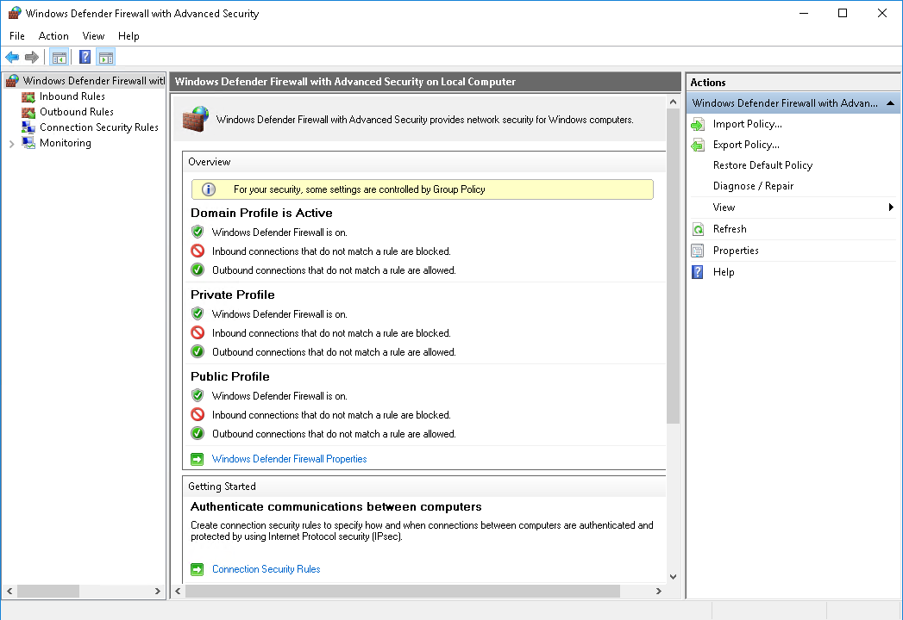

#### Inbound rules

_Inbound rules_ beskriver hvilken innkommende trafikk som skal tillates. Eksempler er RDP eller webtrafikk på port 80/443. Hvis ingen regel gjelder, blokkers trafikke som standard.

#### Outbound rules

_Outbound rules_ styrer trafikk som går ut fra enheten. Som standard tillates all utgående trafikk, men du kan blokkere spesifikke programmer, porter eller IP adresser.

#### Inbound and outbound rule types

Det finnes fire regeltyper:

- Program rules
- Port rules
- Predefined rules
- Custom rules

Dette gir fleksibilitet fra enkle programregler til avanserte tilpasninger.

### Connection security rules

_Connection security rules_ bruker _IPsec_ for å sikre trafikk mellom to endepunkter. De tillater ikke trafikk alene, men krever autentisering eller kryptering. Typer inkluderer:

- Isolation rules
- Authentication exemption rules
- Server to server rules
- Tunnel rules
- Custom rules

Dette brukes for å bygge en helhetlig sikkerhetsmodell med autentisering og krypterte forbindelser.

### Monitoring

_Monitoring_ viser aktive profiler, gjeldende regler og IPsec sikkerhetsassosiasjoner. Hendelser kan også sees i _Event Viewer_, spesielt _ConnectionSecurity_ loggen som viser _IPsec_ relaterte hendelser.

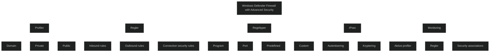

<a href="/certs/diagrams/defender-firewall-advanced.html" target="_blank" rel="noopener">Stort diagram</a>

## [Module assessment](https://learn.microsoft.com/en-us/training/modules/manage-defender-windows-client/7-knowledge-check/?ns-enrollment-type=learningpath&ns-enrollment-id=learn.wwl.manage-endpoint-security)

1. Contoso has implemented Microsoft Defender Antivirus on all company devices to help prevent spyware and other unwanted software from running on any of its computers. As a best practice, Contoso schedules a daily Quick scan on each device. If Microsoft Defender Antivirus identifies a potentially dangerous file during a scan, what action does it take?

	Moves the file to a quarantine area

2. What feature of Windows Defender Credential Guard blocks the credential theft attack techniques and tools used in many targeted attacks?

	Virtualization-based security

## [Summary](https://learn.microsoft.com/en-us/training/modules/manage-defender-windows-client/8-summary/?ns-enrollment-type=learningpath&ns-enrollment-id=learn.wwl.manage-endpoint-security)

# Windows Security capabilities

Windows Security samler alle sikkerhetsfunksjoner i ett grensesnitt. Her administreres antivirus, brannmur, appkontroll, enhetsisolasjon og beskyttelse mot sårbarhetsutnyttelse. Målet er å gi et helhetlig bilde av sikkerhetstilstanden og gjøre det enkelt å reagere på trusler.

# Windows Defender Credential Guard

Credential Guard beskytter legitimasjon ved å isolere LSASS i et virtualiseringsbasert miljø. Dette hindrer angrep som forsøker å hente passordhash eller token fra minnet. Funksjonen er sentral i Zero Trust og stopper teknikker som pass the hash.

# Manage Microsoft Defender Antivirus

Defender Antivirus gir sanntidsbeskyttelse mot skadelig programvare. Administratorer kan styre:

- sanntidsbeskyttelse
- skybasert beskyttelse
- signaturoppdateringer
- skanninger og karantene

Dette er grunnlaget for neste generasjons beskyttelse i Windows.

# Manage Windows Defender Firewall

Brannmuren kontrollerer inn og utgående trafikk og beskytter mot uautorisert tilgang. Den kan konfigureres med regler basert på apper, porter og protokoller.

# Manage Windows Defender Firewall with Advanced Security

Dette er den avanserte konsollen for detaljert styring av brannmur og IPSec. Administratorer kan lage:

- innkommende og utgående regler
- tilkoblingssikkerhetsregler
- profiler for domene, privat og offentlig nettverk

Dette gir presis kontroll over trafikk og kommunikasjon.