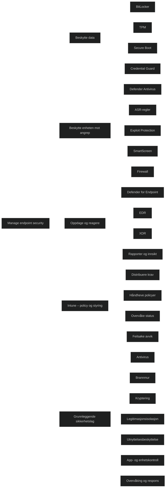

# Manage endpoint security

Når jeg jobber meg gjennom denne modulen, merker jeg at den tar for seg et stort og sammensatt område: hvordan jeg beskytter Windows‑enheter i en organisasjon. Det som gjør dette krevende for meg, spesielt siden jeg mangler praktisk erfaring, er at jeg ikke lærer ett verktøy, men et helt _økosystem av sikkerhetsfunksjoner_ som virker sammen.

Det er ikke nok at jeg forstår hva den enkelte funksjonem gjør – jeg må også forstå _hvordan de henger sammen_, og hvorfor Microsoft har bygget det slik.

Det viktigste jeg tar med meg fra modulen er at endpoint‑sikkerhet egentlig handler om tre hovedområder:

1. _Beskytte data_: [BitLocker](../../Glossary/BitLocker.md), [Trusted Platform Module (TPM)](../../Glossary/Trusted-Platform-Module.md), [Secure Boot](../../Glossary/Secure-Boot.md), [Credential Guard](../../Glossary/Microsoft-Defender-Credential-Guard.md).
2. _Beskytte enheten mot angrep_: [Defender AV](../../Glossary/Microsoft-Defender-Antivirus.md), [ASR, Exploit Protection](../../Glossary/Microsoft-Defender-Exploit-Guard.md), [SmartScreen](../../Glossary/Microsoft-Defender-SmartScreen.md), [Firewall](../../Glossary/Microsoft-Defender-Firewall.md).
3. _Oppdage og reagere på trusler_: [Defender for Endpoint](../../Glossary/Microsoft-Defender-for-Endpoint.md)  (Endpoint Detection and Response (EDR), tidlinje, rapporter, ), [Defender XDR](../../Glossary/Microsoft-Defender-XDR.md) (samlet hendelsesbilde).

Alt annet er detaljer rundt hvordan dette styres, håndheves og overvåkes.

<a href="/certs/diagrams/endpoint-security.html" target="_blank" rel="noopener">Stort diagram</a>

Modulen tydeliggjør at sikkerheten på Windows‑klienter består av flere lag som jobber samtidig, der lagene består av:

- antivirus
- brannmur
- kryptering
- isolasjon av legitimasjon
- beskyttelse mot utnytteleser
- kontroll av apper og enheter
- overvåking og respons

Siden jeg bare har jobbet delvis med noen av disse lagene tidligere, føles det litt som å lære ti nye fag samtidig. Men poenget er at _ingen av disse lagene alene er nok_. De er laget for å dekke hverandres svakheter.

Modulen viser også at Intune er stedet der jeg:

- konfigurerer antivirus
- styrer brannmur
- aktiverer BitLocker
- setter [(Defender Exploit Guard) ASR](../../Glossary/Microsoft-Defender-Exploit-Guard.md)‑regler
- distribuerer sikkerhetsbaselines

Dette virker litt abstrakt for meg nå, siden jeg ikke har begynt å jobbe praktisk med det et i labmiljø enda..

I tillegg introduserer modulen flere Defender‑komponenter:

- [Defender Antivirus](../../Glossary/Microsoft-Defender-Antivirus.md)
- [Defender for Endpoint (EDR)](../../Glossary/Microsoft-Defender-for-Endpoint.md)
- [Defender Firewall](../../Glossary/Microsoft-Defender-Firewall.md)
- [Defender SmartScreen](../../Glossary/Microsoft-Defender-SmartScreen.md)
- [Defender for Cloud Apps](../../Glossary/Microsoft-Defender-for-Cloud-Apps.md)
- [Defender XDR](../../Glossary/Microsoft-Defender-XDR.md)

Det er lett å blande dem, men når jeg bryter det ned, gir det mer mening:

- _Defender AV_ stopper kjente trusler
- _ASR og Exploit Protection_ stopper ukjente angrep
- _[BitLocker](../../Glossary/BitLocker.md) og [Credential Guard](../../Glossary/Microsoft-Defender-Credential-Guard.md)_ beskytter data og legitimasjon
- _Defender for Endpoint_ overvåker og reagerer når noe slipper gjennom
- _Defender XDR_ binder alt sammen og viser hele angrepsforløpet

Modulen går også gjennom teknologier som skal sikre at Windows starter i en trygg tilstand:

- [Trusted Platform Module (TPM)](../../Glossary/Trusted-Platform-Module.md)
- [Secure Boot](../../Glossary/Secure-Boot.md)
- Virtualization‑based Security (Win10/11, Hyper-V; Credential Guard, LSA Protection, Application Guard, HVCI, Secure boot)
- [Credential Guard](../../Glossary/Microsoft-Defender-Credential-Guard.md)
- [LSA Protection](../../Glossary/Local-Security-Authority.md)

Dette er vanskelig å forstå uten praktisk erfaring, fordi de jobber _under_ operativsystemet. Jeg ser dem ikke, men vil merker dem når de mangler.

Til slutt handler endpoint‑sikkerhet mye om policyer. Jeg må:

- definere krav
- distribuere dem
- håndheve dem
- overvåke dem
- feilsøke dem

Dette er en helt annen måte å tenke på enn klassisk IT‑drift. Det handler ikke om å “fikse en PC”, men om å _styre hundrevis av enheter samtidig_.

---

| **Tema**                                  | **Oppgave**                                                 | **Status** | **Notater**                                                                                                                |
| ----------------------------------------- | ----------------------------------------------------------- | ---------- | -------------------------------------------------------------------------------------------------------------------------- |
| Windows Security oversikt                 | Forstå hvordan Windows Security samler sikkerhetsfunksjoner | ✅          | Omfatter antivirus, brannmur, app‑ og nettleserbeskyttelse, enhetsisolasjon, enhetsytelse og helse.                        |
| Microsoft Defender Antivirus              | Forstå motor, sanntidsbeskyttelse, skybasert beskyttelse    | ✅          | _Viktig_: real‑time protection, cloud‑delivered protection, automatic sample submission, periodic scanning.                |
| Antivirus‑policyer i Intune               | Konfigurere Defender AV via Endpoint security               | ✅          | Policyer for sanntidsbeskyttelse, skanning, ekskluderinger, tamper protection, cloud protection level.                     |
| Antivirus‑rapporter                       | Bruke Intune og Defender portal for innsikt                 | ✅          | Rapporter viser trusler, status, signaturversjoner og enhetshelse.                                                         |
| Attack surface reduction (ASR)            | Forstå og konfigurere ASR‑regler                            | ✅          | Regler som blokkerer makroangrep, scriptmisbruk, credential theft, Office‑eksploitering. Kan settes til Audit eller Block. |
| Controlled folder access                  | Beskytte mapper mot uautoriserte endringer                  | ✅          | Hindrer ransomware i å endre filer. Kan tillate apper manuelt.                                                             |
| Exploit protection                        | Konfigurere system‑ og appnivå mitigations                  | ✅          | DEP, ASLR, CFG, SEHOP. Kan konfigureres via XML eller Intune.                                                              |
| Network protection                        | Hindre tilgang til ondsinnede domener                       | ✅          | Bruker SmartScreen‑signaler. Kan settes til Audit eller Block.                                                             |
| Web protection                            | Forstå SmartScreen og URL‑filtrering                        | ✅          | Beskytter mot phishing, ondsinnede nedlastinger og farlige nettsteder.                                                     |
| Credential Guard                          | Forstå VBS‑basert isolasjon av legitimasjon                 | ✅          | Beskytter NTLM‑hash og Kerberos‑billetter. Krever Secure Boot og VBS.                                                      |
| LSA Protection                            | Aktivere beskyttet LSASS                                    | ✅          | Hindrer prosesser uten signatur fra å lese LSASS‑minne.                                                                    |
| Secure Boot                               | Forstå kjede av tillit i oppstart                           | ✅          | Sikrer at kun signert firmware, drivere og bootloadere lastes.                                                             |
| TPM                                       | Forstå maskinvarebasert nøkkellagring                       | ✅          | Brukes av BitLocker, attestation, autentisering og integritetsmåling.                                                      |
| BitLocker                                 | Konfigurere disk‑kryptering                                 | ✅          | Policyer for krypteringsmetode, TPM‑bruk, gjenoppretting, OS‑ og datadisker.                                               |
| BitLocker‑policyer i Intune               | Administrere kryptering via Endpoint security               | ✅          | Krever at enheten rapporterer status. Viktig: silent enablement.                                                           |
| Defender Firewall                         | Forstå brannmurprofiler og regeltyper                       | ✅          | Domain, Private, Public. Inbound/outbound‑regler, app‑regler, port‑regler.                                                 |
| Firewall with Advanced Security           | Konfigurere avanserte regler og IPsec                       | ✅          | Connection security rules, autentisering, kryptering, tunnel/transport.                                                    |
| Firewall‑policyer i Intune                | Administrere brannmur via MDM                               | ✅          | Endpoint security -> Firewall. Støtter regler, profiler, logging.                                                          |
| Endpoint detection and response (EDR)     | Forstå Defender for Endpoint integrasjon                    | ✅          | Sensor, onboarding, EDR‑innsikt, automatisert etterforskning.                                                              |
| Attack surface reduction – Device control | Administrere USB og eksterne enheter                        | ✅          | Blokkere, tillate, audit. Granulær kontroll av enhetstyper.                                                                |
| Security baselines                        | Bruke Microsofts anbefalte baseline‑konfigurasjoner         | ✅          | Windows, Edge, MDM baseline. Forenkler sikkerhetsstyring.                                                                  |
| Compliance + Endpoint security            | Forstå hvordan sikkerhetsstatus påvirker compliance         | ✅          | Antivirus, brannmur, BitLocker og sikkerhetsfunksjoner inngår i compliance‑vurdering.                                      |
| Rapporter og overvåking                   | Bruke Intune, Defender og Windows Security                  | ✅          | Oversikt over trusler, enhetsstatus, policy‑samsvar og sikkerhetsavvik.                                                    |